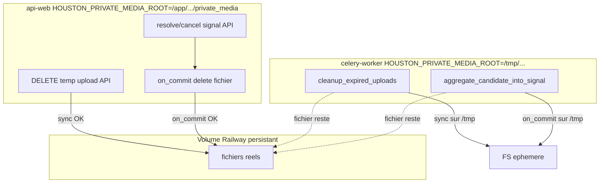

# Audit donnees Houston — gestion, retention et croissance

**Scenario principal : 500 utilisateurs pendant 6 mois (180 jours).**

Contexte : Django / DRF / PostgreSQL, Celery / Beat / Redis, Railway, fichiers prives `private_media`, OpenAI (pipeline observation + transcription).

Sources verifiees : modeles et services sous `apps/api/houston/`, `apps/api/config/settings.py`, `docs/deploy/railway_*.md`, `infra/railway/`, `infra/docker/railway/start-api-web.sh`, `docker-compose.yml`.

---

## 1. Resume executif

Houston dispose d'une purge chat fonctionnelle (7 jours), d'une purge uploads temporaires **partielle** (DB oui, fichiers non fiables sur Railway), et d'aucune purge production pour auth, notifications, push, outbox ni AI logs.

Le risque bloquant avant ouverture a 500 utilisateurs n'est **pas** la capacite PostgreSQL ni Redis a l'ordre de grandeur estime, mais la **desynchronisation PostgreSQL / volume `private_media`** sur Railway : des chemins Celery mettent a jour la base alors que les fichiers persistants restent sur le volume `api-web`.

**Recommandation P0** : table `PendingStorageDeletion` (PostgreSQL) + processus Celery dedie `storage_deletion` demarre **dans le conteneur `api-web`** (seul service avec le volume) + reconciliation `--dry-run` + validation manuelle Railway avant merge.

---

## 2. Verdict pour 500 utilisateurs / 6 mois

> **Houston n'est pas prete en l'etat pour une ouverture maitrisee a 500 utilisateurs pendant 6 mois**, principalement parce que la suppression de `private_media` n'est pas fiable avec la topologie Railway actuelle.

### Nuances

| Dimension | Verdict |
|---|---|
| **PostgreSQL** | Semble pouvoir absorber l'ordre de grandeur estime (~1 a ~12 Go selon scenario) sur 6 mois. Pas le facteur bloquant immediat. |
| **Redis** | Non bloquant (< 200 Mo a ~1 Go operationnel estime). Broker transitoire, tickets WS TTL 60 s, resultats Celery ~24 h (defaut, non configure in-repo). |
| **Croissance non bornee (P1)** | Tables auth (`UserSession`, `AccessToken`, `SessionRefreshToken`), `Notification`, `PushDelivery`, `ActionPlanMixedOutboxEntry`, `AIUsageLog` : accumulation sans purge prod. |
| **Blocage P0** | Coherence **PostgreSQL ↔ fichiers persistants** : suppressions annoncees en DB mais non executees sur le volume reel. |

Le P0 est **structurel** : il affecte chaque evenement de suppression declenche par `celery-worker`, independamment du delai avant saturation disque.

---

## 3. Hypotheses de capacite

### Parametres fixes

| Parametre | Valeur | Source |
|---|---|---|
| Utilisateurs `U` | 500 | Scenario |
| Duree `D` | 180 jours | Scenario |
| Etablissements `E` | 50 (~10 users/etab.) | **Hypothese** (non fixe dans le code) |

### Ancres code (limites reelles)

| Parametre | Valeur | Fichier |
|---|---|---|
| Photos max / observation | 3 | `apps/api/houston/observations/constants.py` (`MAX_OBSERVATION_PHOTOS`) |
| Taille max photo | 10 MiB | `HOUSTON_OBSERVATION_PHOTO_MAX_BYTES` dans `settings.py` |
| TTL upload temporaire | 24 h | `HOUSTON_TEMPORARY_UPLOAD_TTL_HOURS` |
| Retention chat | 7 jours | `HOUSTON_CHAT_MESSAGE_RETENTION_DAYS` |
| Cap envoi chat | 30 msg/min/user | `CHAT_MESSAGE_SEND_RATE_LIMIT_PER_MINUTE` |
| Candidats AI max / obs | 5 | `MAX_CANDIDATES_PER_OBSERVATION` dans `signals/constants.py` |
| AIUsageLog / tentative pipeline | 1 ligne | `ai/observation_pipeline.py` (`_write_usage_log`) |
| ObservationProcessing | 1:1 observation | `observations/models.py` |
| Access token TTL | 15 min | `HOUSTON_AUTH_ACCESS_TOKEN_TTL` |
| Refresh token TTL | 30 jours | `HOUSTON_AUTH_REFRESH_TOKEN_TTL` |
| Session absolue | 90 jours | `HOUSTON_AUTH_ABSOLUTE_SESSION_TTL` |
| Horizon materialisation PA | 14 jours | `action_plans/materialization.py` (`MATERIALIZATION_HORIZON_DAYS`) |
| Purge auth / notif / outbox | Aucune en prod | Exploration codebase |

### Trois scenarios d'usage (hypotheses explicites)

| Parametre | Faible | Realiste | Eleve |
|---|---|---|---|
| Utilisateurs actifs / jour (`U_dau`) | 100 (20 %) | 200 (40 %) | 300 (60 %) |
| Observations / user actif / jour | 1 | 2,5 | 5 |
| Observations avec >= 1 photo | 30 % | 50 % | 70 % |
| Photos moyennes / obs avec photo | 1 | 1 | 1,5 |
| Taille moyenne photo (Mo) | 1,5 | 2 | 2,5 |
| Photos supprimees via **agregation Celery** | 25 % des photos liees | 35 % | 45 % |
| Signaux resolve/cancel **API** (photos non agreg.) | 60 % | 40 % | 25 % |
| Uploads temporaires abandonnes | 5 % | 10 % | 12 % |
| Messages chat / user actif / jour | 5 | 15 | 25 |
| Notifications / user / jour | 4 | 10 | 18 |
| Users avec push | 25 % | 50 % | 70 % |
| Subscriptions / user push | 1,1 | 1,2 | 1,3 |
| Refresh / user actif / jour | 4 | 8 | 12 |
| Nouvelles sessions / user / mois | 1 | 1,5 | 2 |
| Transcription (% des obs) | 10 % | 25 % | 35 % |
| Facteur retry pipeline (AI logs) | x1,05 | x1,10 | x1,15 |
| CandidateSignal / observation | 2 | 2,5 | 3,5 |
| Executions PA / etab / jour | 0,5 | 2 | 5 |
| Taches / execution PA | 4 | 5 | 6 |
| Mixed submissions / etab / mois | 1 | 2 | 4 |
| Destinataires notif / execution (outbox) | 3 | 4 | 5 |

---

## 4. Estimations faible / realiste / eleve

Formules de reference :

- `Obs = U_dau x obs/jour x D`
- `P = Obs x taux_photo x photos_moy` (evenements photo lies)
- `Orphan_agg_Go = P x taux_agg x taille_Mo / 1024`
- `Orphan_ttl = P x abandon / (1 - abandon)` fichiers
- `Chat_regime = U_dau x msgs/jour x 7`
- `Notif = U x notif/jour x D`
- `Push = Notif x frac_push x subs`
- `AI_logs = Obs x retry_factor x (1 + taux_transcription)`
- `Sessions = U x sessions/mois x 6`
- `AccessTokens ~ Sessions x jours_actifs x refresh/jour` (jours actifs hyp. : 30 / 45 / 60)
- `Executions_PA = E x exec/etab/jour x D`
- `Outbox ~ Submissions x (1 + destinataires)` avec `Submissions = E x submits/mois x 6`

### Tableau recapitulatif

| Domaine | Faible | Realiste | Eleve | Facteur dominant |
|---|---|---|---|---|
| **Observations** | ~18 k | ~90 k | ~270 k | `U_dau x obs/j x D` |
| **Fichiers orphelins (cumul 6m)** | **~2 Go** | **~42 Go** | **~417 Go** | `P x taux_agg` + abandon TTL |
| **Chat conserve 7 jours** | ~3,5 k | ~21 k | ~52 k | `U_dau x msgs/j x 7` |
| **Notifications (cumul)** | ~360 k | ~900 k | ~1,6 M | `U x notif/j x D` |
| **PushDelivery (cumul)** | ~99 k | ~540 k | ~1,47 M | `Notif x push x subs` |
| **AccessToken (cumul)** | ~360 k | ~1,6 M | ~4,3 M | sessions x jours x refresh/j |
| **SessionRefreshToken** | ~360 k | ~1,6 M | ~4,3 M | ~1 par refresh |
| **UserSession (cumul)** | ~3 k | ~4,5 k | ~6 k | `U x sessions/mois x 6` |
| **CandidateSignal** | ~36 k | ~225 k | ~945 k | `Obs x candidats/obs` |
| **AIUsageLog** | ~21 k | ~124 k | ~419 k | `Obs x retry x transcription` |
| **ObservationProcessing** | ~18 k | ~90 k | ~270 k | `= Obs` |
| **ActionPlanExecution** | ~4,5 k | ~18 k | ~45 k | `E x exec/j x D` |
| **ActionPlanExecutionTask** | ~18 k | ~90 k | ~270 k | exec x taches |
| **MixedSubmission** | ~300 | ~600 | ~1,2 k | `E x submits/mois x 6` |
| **MixedOutboxEntry (PROCESSED)** | ~1,2 k | ~2,4 k | ~4,8 k | submits x (1+N) |
| **PostgreSQL (ordre de grandeur)** | **~1 Go** | **~3-5 Go** | **~8-12 Go** | tokens + notifications |
| **Redis** | **< 200 Mo** | **200-500 Mo** | **< 1 Go** | Channels + broker |

### Detail orphelins `private_media`

**Orphelins garantis (bug Railway)** — DB `DELETED`, fichier sur volume `api-web` :

1. Agregation pipeline (Celery) : `Orphan_agg`
   - Faible : 5 400 x 0,25 x 1,5 Mo ≈ **2 Go**
   - Realiste : 45 000 x 0,35 x 2 Mo ≈ **32 Go**
   - Eleve : 283 500 x 0,45 x 2,5 Mo ≈ **319 Go**

2. TTL uploads expires (Celery `cleanup_expired_uploads`) : `Orphan_ttl`
   - Faible : ~284 fichiers ≈ **0,4 Go**
   - Realiste : ~5 000 ≈ **10 Go**
   - Eleve : ~38 660 ≈ **97 Go**

**Total fuite fichier** : Faible ~2,4 Go | Realiste ~42 Go | Eleve ~417 Go

Stockage legitime (signaux encore ouverts, hors bug) peut s'ajouter : ordre de grandeur +2 a +100 Go selon scenario — **hypothese**, pas mesure code.

---

## 5. Inventaire des donnees

42 modeles Django repartis dans 12 fichiers `models.py` sous `apps/api/houston/`.

| Modele | Donnees | Retention actuelle | Purge prod | Risque croissance |
|---|---|---|---|---|
| `User` | Identite | Indefinie | Non | Faible |
| `UserSession` | Session | TTL 90j runtime | Non (soft revoke) | **Eleve** |
| `AccessToken` | Digest 15 min | Expire runtime | Non | **Eleve** |
| `SessionRefreshToken` | Refresh rotation | 30j rolling | Non | **Eleve** |
| `TemporaryUpload` | Photo temp + FileField | TTL 24h si VALIDATED | Celery (DB partiel Railway) | Moyen disque |
| `Observation` | Texte (max 1000 car.) | Indefinie | Dev only | Eleve |
| `ObservationMedia` | storage_key | Tant que signal actif | Via resolve/cancel/agregation | Eleve disque |
| `ObservationProcessing` | Etat pipeline 1:1 | Indefinie | Non | Eleve |
| `CandidateSignal` | Candidats AI (max 5/obs) | Indefinie | Non | Eleve |
| `Signal` | Feed operationnel | Indefinie | Non | Eleve |
| `Comment` / `CommentMention` | Threads | Indefinie | Non | Eleve |
| `Notification` | In-app | Archive soft | Non | **Eleve** |
| `WebPushSubscription` | Endpoint push | Revoke soft | Non | Moyen |
| `PushDelivery` | Tentative push | Indefinie | CASCADE si notif suppr. | **Eleve** |
| `ChatMessage` | Corps (max 2000 car.) | **7 jours** | Celery daily | **Borne** |
| `ChatConversation` / `ChatParticipant` | Metadata | Indefinie | Soft delete | Moyen |
| `ActionPlanExecution` (+ tasks) | Instances PA | Indefinie | Non | Eleve |
| `ActionPlanMixedSubmission` | Idempotence | Indefinie | Non | Moyen |
| `ActionPlanMixedOutboxEntry` | Outbox async | PROCESSED conserve | Non | Eleve |
| `AIUsageLog` | Metadonnees OpenAI | Indefinie | Non | Eleve |
| `EstablishmentInvitation` | Invite | TTL 7j runtime | Non | Moyen |

**Donnees metier a ne pas supprimer arbitrairement** : `Observation`, `Signal`, `Comment`, `ActionPlanExecution`, structure tenant (`Establishment`, `Membership`).

---

## 6. Purges existantes

| Purge | Declencheur | Cible | Cadence | Batch | Retries | Tests | Fiabilite Railway |
|---|---|---|---|---|---|---|---|
| `purge_chat_messages_task` | Beat `purge-chat-messages` | `ChatMessage` > 7j | 04:00 UTC | 1000 | 0 | `chat/tests/test_purge.py` | **DB OK** si beat actif |
| `cleanup_expired_uploads_task` | Beat `cleanup-expired-uploads` | `TemporaryUpload` VALIDATED expire | 05:00 UTC | Aucun (iterator) | 0 | `uploads/tests/test_cleanup.py` | **DB OK, fichiers NON** |
| `recover_stuck_observation_processing_task` | Beat horaire :15 | Re-queue pipeline | Horaire | N/A | 0 | `signals/tests/test_observation_pipeline_recovery.py` | Ne supprime pas |
| `materialize_action_plan_schedules_horizon_task` | Beat 03:30 UTC | Cree executions | Quotidien | N/A | 0 | `action_plans/tests/test_horizon_task.py` | **Augmente** donnees |
| `process_action_plan_mixed_outbox_batch_task` | Beat */1 min | Traite outbox | 1 min | 50 | 0 | `action_plans/tests/test_mixed_outbox.py` | Marque PROCESSED, ne purge pas |
| `clean_operational_test_data` | Manuel | Bulk dev | N/A | N/A | N/A | `core/tests/test_operational_test_data_cleanup.py` | **Interdit prod** |

**Aucune purge prod** : auth, notifications, push, AI logs, outbox PROCESSED, invitations.

Configuration beat : `CELERY_BEAT_SCHEDULE` dans `apps/api/config/settings.py` L176-215.

---

## 7. Analyse `private_media`

### Stockage

- Backend : `PrivateMediaStorage` (`FileSystemStorage`) — `apps/api/houston/uploads/private_storage.py`
- Racine : `HOUSTON_PRIVATE_MEDIA_ROOT` (`settings.py`, defaut `apps/api/private_media`)
- Chemin upload : `establishments/{establishment_id}/temporary/{upload_id}.{ext}` — `uploads/models.py`
- Seuls `TemporaryUpload.file` et `ObservationMedia.storage_key` referencent le disque persistant
- Transcription audio : `tempfile` ephemere, **hors** `private_media` (`uploads/api/transcription_views.py`)

### Topologie Railway

| Affirmation | Statut | Source |
|---|---|---|
| `api-web` monte volume persistant `/app/apps/api/private_media` | **Confirme doc versionnee** | `docs/deploy/railway_deploy_contract.md` L114-120 |
| `celery-worker` : `HOUSTON_PRIVATE_MEDIA_ROOT=/tmp/houston-private-media`, pas de volume | **Confirme doc versionnee** | `docs/deploy/railway_deploy_contract.md` L158-164, `docs/deploy/railway_variables.md` L103-111 |
| Volumes non partageables entre services Railway | **Confirme doc versionnee** | `railway_deploy_contract.md` L234-251 |
| `start-api-web.sh` = Daphne + nginx uniquement | **Confirme code** | `infra/docker/railway/start-api-web.sh` |
| Volumes declares dans `railway.toml` | **Non** — config manuelle UI Railway | `infra/railway/README.md` |
| Volume reellement monte en prod | **A verifier deploiement** | Smoke checklist |

### Local Docker ≠ Railway

`docker-compose.yml` : services `api` et `celery` partagent le volume nomme `private_media`. Les tests de cleanup **ne detectent pas** le split Railway.

### Hypothese P0 confirmee

> La DB peut etre mise a jour alors que le fichier persistant reste sur le volume web.

**Confirme par le code** pour les chemins Celery : suppression via `get_private_media_storage()` du processus worker (`/tmp/...`), alors que l'upload a ete ecrit par `api-web` sur le volume persistant.

`_delete_storage_file_idempotent` avale `OSError` (`media_services.py` L20-21) → echec silencieux.

---

## 8. Chemins de suppression

### 8.1 Cleanup uploads temporaires expires

| | |
|---|---|
| **Entree** | `cleanup_expired_uploads_task` (`uploads/tasks.py`) ou `manage.py cleanup_expired_uploads` |
| **Service** | `cleanup_expired_uploads` (`uploads/services.py` L78) |
| **Processus** | `celery-worker` (beat quotidien) |
| **Modification DB** | `TemporaryUpload.status = DELETED` dans `@transaction.atomic` |
| **Suppression fichier** | **Sync** `upload.file.delete(save=False)` avant save, dans la transaction |
| **ROOT utilise** | `/tmp/houston-private-media` sur Railway worker |
| **Acces volume reel** | **Non** |
| **Echec fichier** | Souvent no-op ; transaction commit quand meme |
| **Retry** | `max_retries=0` ; idempotent DB (filtre VALIDATED) |
| **Idempotence DB** | Oui — second run `deleted_count=0` |
| **Idempotence fichier** | Non sur volume api-web — orphelins permanents |

### 8.2 Agregation observation dans signal

| | |
|---|---|
| **Entree** | `process_observation_task` → `run_observation_pipeline` → `aggregate_candidate_into_signal` (`signals/services.py` L245) |
| **Processus** | `celery-worker` |
| **Modification DB** | `delete_all_observation_media` → `ObservationMedia.delete()` + `TemporaryUpload.status=DELETED` |
| **Suppression fichier** | **Differe** `transaction.on_commit` → `_delete_storage_file_idempotent` |
| **ROOT utilise** | `/tmp/houston-private-media` |
| **Acces volume reel** | **Non** |
| **Echec fichier** | `OSError` avale ; DB deja committee |
| **Retry pipeline** | `max_retries=3` sur task — re-execution idempotente DB mais orphelin deja cree |
| **Garde** | Supprime seulement si aucun signal `CREATED_FROM` actif pour l'observation (L265-271) |

### 8.3 Resolution signal

| | |
|---|---|
| **Entree** | `SignalResolveView` → `resolve_signal` (`signals/api/views.py` L358-371) |
| **Processus** | `api-web` |
| **Modification DB** | `_delete_created_from_media_for_signal_terminal` puis `signal.status=RESOLVED` |
| **Suppression fichier** | `on_commit` via `delete_observation_media_permanently` |
| **ROOT utilise** | `/app/apps/api/private_media` |
| **Acces volume reel** | **Oui** |
| **Echec fichier** | `OSError` avale ; DB committee — orphelin disque possible meme sur api-web |
| **Garde** | Un seul signal `CREATED_FROM` actif (L1449-1451) |

### 8.4 Annulation signal

Identique a 8.3 via `cancel_signal` (`signals/services.py` L1382). Processus `api-web`, `on_commit`, acces volume **oui**.

### 8.5 Suppression ObservationMedia (generique)

| | |
|---|---|
| **Service** | `delete_observation_media_permanently` / `delete_all_observation_media` (`observations/media_services.py`) |
| **Appelants** | Agregation (Celery), resolve/cancel (API) |
| **DB** | `media.delete()` + upload `DELETED` |
| **Fichier** | `on_commit` → `_delete_storage_file_idempotent` |
| **Volume** | Celery : **non** ; API : **oui** |

### 8.6 DELETE upload temporaire utilisateur (bonus)

| | |
|---|---|
| **Entree** | `TemporaryUploadDeleteView.delete` (`uploads/api/views.py` L123) |
| **Service** | `delete_temporary_upload` (`uploads/services.py` L48) |
| **Processus** | `api-web` |
| **Fichier** | Sync avant save DB |
| **Volume** | **Oui** — chemin fiable |

### Synthese acces volume

| Chemin | Processus | Fichier supprime sur volume Railway |
|---|---|---|
| DELETE upload user | api-web | **Oui** |
| Cleanup uploads expires | celery-worker | **Non** |
| Agregation pipeline | celery-worker | **Non** |
| Resolve / cancel signal | api-web | **Oui** (si on_commit reussit) |

---

## 9. Risques P0 / P1 / P2

### P0 — avant ouverture

| Risque | Detail |
|---|---|
| Suppression fichier non fiable | Chemins Celery decrits section 8 |
| Echecs silencieux | `_delete_storage_file_idempotent` avale `OSError` |
| DB / disque desynchronises | `DELETED` en DB, fichier sur volume |
| Pas de reconciliation | Aucun scan filesystem vs DB |
| Tests locaux trompeurs | Volume partage Docker Compose |
| Topologie Railway non verifiee in-repo | Volumes configures en UI, pas dans `railway.toml` |

### P1 — avant montee effective a 500 users

| Risque | Detail |
|---|---|
| Auth tokens accumules | ~360 k a ~4,3 M `AccessToken` sans purge |
| Notifications + PushDelivery | ~360 k a ~1,6 M notifications |
| Outbox PROCESSED | Croissance monotone |
| Saturation volume `private_media` | ~42 Go fuite realiste / 6m sans correctif P0 |

### P2 — amelioration future

| Risque | Detail |
|---|---|
| `AIUsageLog` | ~21 k a ~419 k lignes |
| `ChatConversation` vides apres purge messages | Metadata conservee |
| `EstablishmentInvitation` expirees | Lignes conservees |
| `WebPushSubscription` revoquees | Lignes conservees |
| Object storage S3/R2 | Solution structurelle long terme (hors scope V1 doc) |

---

## 10. Solution P0 recommandee

### Comparaison breve des options

| Option | Durabilite | Retries | Observabilite | Railway | Verdict |
|---|---|---|---|---|---|
| **Queue Redis seule** | Faible (flush/eviction) | Manuel | Faible | Besoin consumer avec volume | Rejetee seule |
| **Table PostgreSQL `PendingStorageDeletion`** | Excellente | `attempts`, backoff | SQL + logs | Aucun nouveau volume | **Retenue** |
| **Management command seule** | N/A | Manuel | Logs commande | Pas de cron documente in-repo | Complement ops, pas suffisant seul |
| **Service Railway dedie + volume** | N/A | — | — | **Impossible** (volume non partageable) | Rejetee |
| **Worker Celery sans acces volume** | — | — | — | Deja le cas | Cause du bug |

**Rejetees explicitement** : middleware timer, thread Daphne, traitement lie au trafic HTTP, queue sans consumer sur le volume.

### Architecture retenue (description precise)

#### Composants

1. **Table `PendingStorageDeletion`** (PostgreSQL)
   - Champs : `storage_key`, `source`, `status` (pending/processing/done/failed), `attempts`, `last_error`, `available_at`, `processed_at`
   - Contrainte unicite partielle sur `storage_key` WHERE status IN (pending, processing)
   - Insert par tout processus qui ne peut pas supprimer localement (`celery-worker`, et api-web en filet de securite)

2. **Processus `storage-deletion-worker`** dans le **meme conteneur** que `api-web`
   - **Service Railway** : `api-web` (pas de nouveau service — seul service avec volume)
   - **Demarrage** : modification de `infra/docker/railway/start-api-web.sh` pour lancer en parallele :
     - Daphne (existant)
     - nginx (existant)
     - `celery -A config worker -Q storage_deletion -n storage@%h -c 1` (nouveau)
   - **Volume monte** : `/app/apps/api/private_media` → `HOUSTON_PRIVATE_MEDIA_ROOT=/app/apps/api/private_media`
   - **Utilisateur** : `houston` (meme que Daphne)
   - **Arret** : trap SIGTERM propage au worker storage (comme Daphne)

3. **Queue Celery `storage_deletion`**
   - Route : `CELERY_TASK_ROUTES` dans `settings.py` — tache `drain_pending_storage_deletions_task` → queue `storage_deletion`
   - **Seul** le worker dans `api-web` consomme cette queue (worker distant `celery-worker` : `-Q celery` par defaut, exclut `storage_deletion`)

4. **Beat `celery-beat`** (service existant, volume schedule `/var/lib/celerybeat`)
   - Nouvelle entree beat : `drain-pending-storage-deletions` toutes les 2 minutes (configurable)
   - Beat **enqueue** sur Redis ; seul `storage-deletion-worker` sur `api-web` **execute** la suppression fichier

5. **`celery-worker` distant** (inchangé comme service Railway)
   - Continue pipeline, cleanup uploads DB, etc.
   - **Ne appelle plus** `file.delete()` ni `_delete_storage_file_idempotent` directement
   - Remplace par `request_storage_deletion(storage_key, source=...)` → INSERT PG `on_commit`

#### Comportement transactionnel

| Etape | Acteur | Action |
|---|---|---|
| 1 | celery-worker ou api-web | Commit metier (DB DELETED, media supprime) |
| 2 | `on_commit` | INSERT `PendingStorageDeletion` status=pending |
| 3 | beat | Enqueue `drain_pending_storage_deletions_task` |
| 4 | storage-deletion-worker (api-web) | `SELECT FOR UPDATE SKIP LOCKED` batch pending |
| 5 | | status=processing |
| 6 | | `_delete_storage_file_idempotent` sur **vrai** volume |
| 7 | | Si `not storage.exists(key)` → status=done ; sinon attempts++, backoff ou failed |

#### Retries et echec

- `HOUSTON_STORAGE_DELETION_MAX_ATTEMPTS` (defaut 5)
- Backoff sur `available_at` : 1m, 5m, 15m, 1h, 6h
- `status=failed` apres max → log `storage_deletion_permanently_failed` ; visible via reconcile
- **Ne pas** marquer `done` si fichier encore present

#### Verrouillage

- Claim atomique : `SELECT ... FOR UPDATE SKIP LOCKED` + passage `processing`
- Un seul consumer `-c 1` sur queue `storage_deletion` (suffisant pour MVP)

#### Redemarrage / redeploy

- Lignes `pending`/`processing` (lease expire) survivent en PostgreSQL
- Au redemarrage `api-web`, worker storage reprend le drain
- Entrees `processing` bloquees : reset vers `pending` si `updated_at` > timeout (a implementer)
- Fichiers orphelins **anterieurs** au fix : `reconcile_private_media --dry-run` puis purge manuelle ou backfill table

#### Ce qui n'est pas verifiable depuis le repo

- Volume Railway reellement attache a `api-web` en prod (config UI)
- Taille actuelle du volume
- Processus effectifs dans le conteneur (`ps aux`)
- **Etape obligatoire** : validation manuelle Railway (section 13) **avant** merge du fix P0

---

## 11. Lots d'implementation

### Lot 1 — P0 (bloquant ouverture)

1. Modele `PendingStorageDeletion` + migration
2. Module `apps/api/houston/uploads/storage_deletion.py` (enqueue, claim, drain)
3. Brancher `uploads/services.py` et `observations/media_services.py`
4. Tache `drain_pending_storage_deletions_task` + route queue + beat entry
5. Modifier `start-api-web.sh` (worker storage)
6. Commands `drain_pending_storage_deletions` + `reconcile_private_media --dry-run`
7. Tests + validation Railway

### Lot 2 — P1 (avant 500 users effectifs)

1. Purge `UserSession` / tokens expires (> 90j + marge)
2. Purge `Notification` lues/archivees > 90j (CASCADE PushDelivery)
3. Purge `ActionPlanMixedOutboxEntry` PROCESSED > 30j
4. Settings retention configurables + logs compteurs purge

### Lot 3 — P2

1. Purge `AIUsageLog` > 12 mois
2. Invitations expirees, push revokes, conversations chat vides
3. Object storage (hors scope immediat)

---

## 12. Tests necessaires

| Test | Fichier propose | Objectif |
|---|---|---|
| Enqueue idempotent | `uploads/tests/test_storage_deletion.py` | Duplicate storage_key pending |
| Drain done + fichier absent | idem | Happy path |
| Max attempts → failed | idem | Echec permanent |
| Cross-root 2 MEDIA_ROOT | `uploads/tests/test_storage_deletion_cross_root.py` | Worker enqueue, drain autre root supprime |
| cleanup enqueue sans delete local | etendre `uploads/tests/test_cleanup.py` | Simule Railway worker |
| agregation enqueue | etendre `signals/tests/test_signal_detail_media.py` | Pas de delete sur root worker |
| reconcile dry-run | `uploads/tests/test_reconcile_private_media.py` | Orphelin detecte |

---

## 13. Verifications Railway

Checklist manuelle (non automatisable depuis le repo) :

- [ ] Service `api-web` : volume monte a `/app/apps/api/private_media`
- [ ] Service `celery-worker` : `HOUSTON_PRIVATE_MEDIA_ROOT=/tmp/houston-private-media`, pas de volume
- [ ] `celery-beat` et `celery-worker` running (logs)
- [ ] `du -sh /app/apps/api/private_media` via shell api-web
- [ ] `python manage.py reconcile_private_media --dry-run` sur api-web
- [ ] Apres fix : `ps` montre worker `storage@...` dans conteneur api-web
- [ ] Smoke : upload TTL → fichier disparait du volume
- [ ] Smoke : agregation avec photo → fichier disparait
- [ ] Smoke : resolve signal → fichier disparait
- [ ] Logs : `storage_deletion_drained`, pas de `upload_cleanup_task_completed` sans drain suivant

References : `docs/deploy/smoke_checklist.md`, `docs/deploy/prod_test_runbook.md`

---

## 14. Risques et elements non verifiables

| Element | Statut |
|---|---|
| Split api-web / celery-worker MEDIA_ROOT | **Confirme** doc + code settings |
| Volumes Railway montes en prod | **Non verifiable** in-repo — validation manuelle requise |
| Beat actif en prod | **Non verifiable** in-repo — logs Railway |
| Taille volume actuelle | **Non verifiable** in-repo |
| `result_expires` Celery Redis | **Hypothese** ~24 h (defaut Celery, absent de `settings.py`) |
| Frequences d'usage terrain (table section 3) | **Hypotheses** explicites |
| Taux agregation / resolve reels | **Hypotheses** — impactent orphelins, pas l'existence du bug P0 |
| Doc `railway_security.md` mention « shared path » worker | **Incoherence** avec `railway_variables.md` — a corriger au lot 1 |

### Fichiers cles

| Domaine | Chemins |
|---|---|
| Storage | `apps/api/houston/uploads/private_storage.py`, `observations/media_services.py`, `uploads/services.py` |
| Pipeline | `signals/tasks.py`, `signals/services.py` (L245, L1427) |
| API lifecycle | `signals/api/views.py`, `uploads/api/views.py` |
| Beat | `apps/api/config/settings.py` L176-215 |
| Railway | `docs/deploy/railway_deploy_contract.md`, `infra/docker/railway/start-api-web.sh` |
| Tests purge | `uploads/tests/test_cleanup.py`, `chat/tests/test_purge.py`, `signals/tests/test_signal_detail_media.py` |

---

## Annexe — fichiers a modifier (lot P0)

| Fichier | Changement |
|---|---|
| `apps/api/houston/uploads/models.py` | Modele `PendingStorageDeletion` |
| `apps/api/houston/uploads/storage_deletion.py` | **Nouveau** — enqueue, claim, drain |
| `apps/api/houston/uploads/storage_deletion_tasks.py` | **Nouveau** — `drain_pending_storage_deletions_task` |
| `apps/api/houston/uploads/services.py` | Enqueue au lieu de `file.delete` hors volume local |
| `apps/api/houston/observations/media_services.py` | Enqueue dans `_schedule_storage_file_deletion` |
| `apps/api/config/settings.py` | Beat entry, routes queue, limites |
| `infra/docker/railway/start-api-web.sh` | Processus worker `storage_deletion` |
| `apps/api/houston/uploads/management/commands/drain_pending_storage_deletions.py` | **Nouveau** |
| `apps/api/houston/uploads/management/commands/reconcile_private_media.py` | **Nouveau** |
| `docs/deploy/railway_deploy_contract.md` | Documenter topologie storage worker |
