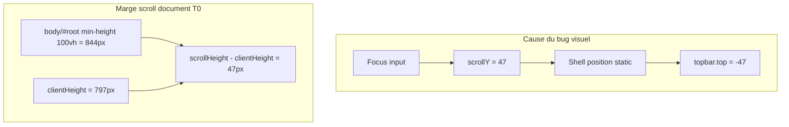

# iOS Safari/PWA — topbar décalée au focus clavier

## Mesures réelles iPhone (2026-07-13, PWA, avant commit `b99d81a`)

| Métrique | T0 repos | T1 clavier/bug | Δ T0→T1 | T2 après blur |
|----------|----------|----------------|---------|---------------|
| `scrollY` / `scrollTop` | 0 | **47** | **+47** | 0 |
| `innerHeight` | 797 | 797 | 0 | 797 |
| `vv.height` | 797 | 797 | **0** | 797 |
| `vv.offsetTop` | 0 | 0 | **0** | ~0 |
| `vv.pageTop` | 0 | **47** | +47 | 0 |
| `shell.top` | 0 | **-47** | **-47** | 0 |
| `shell.height` | 797 | 797 | **0** | 797 |
| `topbar.top` | 0 | **-47** | **-47** | 0 |
| `scrollHeight` | 844 | 844 | 0 | 844 |
| `clientHeight` | 797 | 797 | 0 | 797 |
| `shellStyle.position` | static | static | — | static |

**Restauration T2 (mesures initiales) :** `scrollY`, `shell.top`, `topbar.top` reviennent à 0.

---

## Diagnostic confirmé

### 1. Symptôme visuel — scroll document + shell static

- `scrollY` passe de 0 → **47** à T1.
- `shell.top` et `topbar.top` = **-scrollY** exactement.
- `vv.pageTop` = `scrollY` → iOS scroll le **layout viewport**, pas un pan `offsetTop`.
- Plage de scroll disponible à T0 : `scrollHeight − clientHeight` = **844 − 797 = 47 px** — iOS consomme toute la marge au focus.

**Mécanisme :** `TerrainShell` est `position: static` dans le flux document → il suit le scroll document → topbar passe sous la barre système.

### 2. Origine de `scrollHeight − clientHeight` (47 px)

**Élément scrollable mesuré :** `document.scrollingElement` (= `html` en WebKit).

**Ce qui est exclu :**

| Élément | Mesure T0 | Conclusion |
|---------|-----------|------------|
| `TerrainShell` | `shell.height` = 797 px = `innerHeight` | Ne produit pas l'excédent |
| `visualViewport` | `offsetTop` = 0, `height` stable | Exclu comme cause |

**Source de l'excédent document (au moment des mesures) :**

À T0, [`globals.css`](apps/web/src/styles/globals.css) n'avait que `min-height: 100vh` sur `body` et `#root` (pas encore `100dvh`). Sur iOS PWA, `100vh` ≈ **844 px** (large viewport) alors que le viewport visible (`innerHeight`, `clientHeight`, `h-dvh`) = **797 px**. L'écart **47 px** correspond à `100vh − viewport visible`.

L'excédent scrollable provient donc du **containing block document** (`body` / `#root` via `min-height: 100vh`), pas du shell. Le shell (`h-dvh` = 797 px) est plus petit que le min-height document et ne déborde pas.

**État actuel (déjà commité, hors scope de cette tâche) :**

`min-height: 100dvh` est déjà présent sur `body` et `#root` (commit `b99d81a`). Ce n'est **pas** une nouvelle correction à appliquer. Il faut **re-mesurer sur iPhone** si `scrollHeight − clientHeight` persiste à 47 px malgré `100dvh` — auquel cas investiguer `html` (pas de contrainte de hauteur explicite, seulement background).

**Ne pas présenter `100dvh` comme cause prouvée ni comme action du plan.**

### 3. Pan visual viewport — exclu

- `visualViewport.offsetTop` = **0** à T0 et T1.

### 4. Erreur de hauteur shell — exclu

- `shell.height` = **797 px** stable. `h-dvh` est correct.



---

## Deux objectifs distincts

| Objectif | Correctif | Garanti ? |
|----------|-----------|-----------|
| **Stabilité visuelle** — topbar/shell restent ancrés au viewport visible | `position: fixed` sur `TerrainShell` | **Oui** — `shell.top` reste 0 même si `scrollY > 0` |
| **Suppression du scroll document** — `scrollY` revient à 0 / pas de marge fantôme | Non adressé par `fixed` seul | **Non** — `scrollY` peut rester > 0 sans effet visuel sur le shell |

Le correctif `fixed` traite le **symptôme utilisateur** (topbar décalée). La persistance éventuelle de `scrollY > 0` est acceptable tant que le shell ne bouge pas visuellement. À surveiller lors de la navigation hors terrain (voir validation).

---

## Inventaire des anciens patches — à ne pas conserver

Patches tentés, retirés ou à vérifier absents du code final :

| Patch | Commit | Fichier | Statut attendu |
|-------|--------|---------|----------------|
| `html[data-terrain-shell]` + `overflow: hidden` sur html/body/#root | `759bf1c` → rollback `11f49a8` | `globals.css` | **Supprimé** — ne pas réintroduire |
| `useEffect` → `dataset.terrainShell` sur `<html>` | `759bf1c` → rollback `11f49a8` | `terrain-shell.tsx` | **Supprimé** |
| `useTerrainLayoutSnapshotDevHelper` + `__terrainLayoutSnapshot` | `759bf1c` → rollback `11f49a8` | `terrain-shell.tsx` | **Supprimé** |
| `useEffect` → `html/body.style.overflow = 'hidden'` | `e6f658a` | `terrain-shell.tsx` | **Supprimé** (état HEAD actuel) |
| `max-h-dvh` + `overscroll-none` sur shell | `e6f658a` | `terrain-shell.tsx` | **Supprimé** |
| Listener `visualViewport` (height/offsetTop sync) | plan initial non implémenté | — | **Jamais ajouté** — ne pas ajouter |
| `window.scrollTo(0, 0)` automatique au blur/focus | envisagé puis rejeté | — | **Ne pas ajouter** |

**À conserver (légitime, hors bug layout) :**

- `document.body.style.overflow = 'hidden'` dans [`signal-detail-photo-section.tsx`](apps/web/src/features/signals/components/signal-detail-photo-section.tsx) — modale photo plein écran uniquement.
- Architecture scroll interne (`mainScroll`, zones `overflow-y-auto`) — commit `0770e97`, intentionnelle.

**État HEAD vérifié :** `terrain-shell.tsx` est propre (pas de `useEffect` layout). `globals.css` a `100dvh` mais **pas** le bloc `html[data-terrain-shell]`.

**Nettoyage (étape 2) :** recherche globale dans le dépôt — pas seulement `terrain-shell` / `globals.css`. Motifs à traquer : `dataset.terrainShell`, `data-terrain-shell` (hors attribut diagnostic prévu), `__terrainLayoutSnapshot`, `visualViewport` listeners layout, `scrollTo(0`, `max-h-dvh`, `overscroll-none` sur shell, locks `overflow: hidden` sur html/body hors modale photo.

---

## Ordre d'exécution, scope et critères de décision

### Étape 0 — Remesure iPhone **avant toute modification**

1. **Confirmer que la PWA exécute le commit `b99d81a`** (ou HEAD ≥ `b99d81a` incluant `min-height: 100dvh` sur `body` / `#root`) :
   - rebuild + réinstall PWA si nécessaire ;
   - vérifier dans les assets servis que `globals.css` contient `100dvh` ;
   - noter le SHA déployé.
2. **Remesure T0 / T1 / T2** via [`terrain-scroll-debug-snippet.js`](apps/web/scripts/terrain-scroll-debug-snippet.js) sur routes terrain (chat, commentaire, signal).
3. **Noter** : `scrollY`, `shell.top`, `topbar.top`, `scrollHeight − clientHeight`, `shellStyle.position`.

### Critère d'application de `position: fixed`

| Résultat remesure T1 | Action |
|----------------------|--------|
| `shell.top === -scrollY` (bug reproduit) | **Appliquer** `fixed inset-x-0 top-0` sur `TerrainShell` |
| `shell.top === 0` ou bug non reproduit | **Ne pas appliquer** `fixed` — documenter les mesures, clôturer ou investiguer autre piste |
| `shell.top` décalé mais **≠** `-scrollY` | **Ne pas appliquer** `fixed` — investiguer avant toute modif |

### Scope itération 1

**In :** remesure, nettoyage patches (recherche globale), `position: fixed` conditionnel, test minimal si fix appliqué, validation post-fix.

**Out :** [`comment-highlight.ts`](apps/web/src/features/comments/lib/comment-highlight.ts) — tâche séparée **uniquement** si le scénario notification de mention échoue **après** validation post-fix.

### Critères de rollback (si `fixed` appliqué)

Revenir immédiatement au shell `static` si **l'un** de ces critères échoue en validation iPhone post-fix :

- **Clavier** — champ actif masqué ou inaccessible au-dessus du clavier
- **Scroll interne** — feeds (`/signals`, `/execution`, `/reporting`), chat, chargement historique dégradé ou bloqué
- **Bottom nav** — position, safe-area ou tap targets incorrects
- **Modales** — modale photo plein écran (ouverture/fermeture, `body.overflow` non restauré)
- **Navigation hors TerrainShell** — décalage résiduel ou scroll document anormal après focus + navigation vers `/login` ou route AppShell

En cas de rollback : ne pas compenser par locks overflow, listeners viewport ou `scrollTo` automatique.

---

## Correctif retenu (conditionnel)

### 1. `position: fixed` sur `TerrainShell` — si et seulement si remesure confirme `shell.top = -scrollY`

Fichier : [`terrain-shell.tsx`](apps/web/src/components/layout/terrain-shell.tsx)

```tsx
<div
  data-terrain-shell-root
  className="fixed inset-x-0 top-0 mx-auto flex h-dvh w-full max-w-md flex-col overflow-hidden bg-[#F5F4F0]"
>
```

- `fixed inset-x-0 top-0` — ancrage viewport, découplage du scroll document
- `mx-auto max-w-md` — centrage inchangé
- `h-dvh` — conservé
- **Pas de `z-0`** — ajouter uniquement si un conflit de stacking est démontré
- `data-terrain-shell-root` — diagnostic via [`terrain-scroll-debug-snippet.js`](apps/web/scripts/terrain-scroll-debug-snippet.js)

**Ne pas ajouter :** locks overflow, listeners viewport, `scrollTo` compensatoire, `max-h-dvh`, `overscroll-none`.

### 2. `comment-highlight.ts` — hors scope itération 1

Traité séparément si le scénario notification de mention (`?tab=comments&commentId=…`) échoue **après** validation post-fix. Ne pas modifier dans cette itération.

### 3. `globals.css` — aucune modification prévue

`100dvh` déjà en place. La ligne `min-height: 100vh` redondante (écrasée par `100dvh`) reste comme fallback navigateur — ne pas toucher sauf si remesure iPhone montre un écart document persistant nécessitant une action sur `html`.

### Inchangé

- Correctifs chat `0770e97` : scroll messages interne, composer `shrink-0`, `text-base`
- Safe areas topbar / bottom nav / composers
- `PwaUpdateBanner` dans le shell (`0770e97`)

---

## Tests

**Si `fixed` appliqué :** assertion minimale dans [`terrain-shell.test.tsx`](apps/web/src/components/layout/terrain-shell.test.tsx) — `expect(shell?.className).toContain('fixed')`. Pas une preuve fonctionnelle iOS.

Régression chat : `npm test -- src/features/chat/pages/chat-conversation-page.test.tsx`

---

## Validation

### Phase A — Remesure (avant modif, obligatoire)

- PWA sur commit **`b99d81a`** confirmé
- T0 / T1 / T2 : noter `scrollY`, `shell.top`, `topbar.top`, `scrollHeight − clientHeight`
- Décision go/no-go `fixed` selon tableau ci-dessus

### Phase B — Post-fix (si `fixed` appliqué)

**Checks automatisés :**

```bash
cd apps/web
npm test -- terrain-shell
npm test -- src/features/chat/pages/chat-conversation-page.test.tsx
npm run typecheck
npm run lint
```

**iPhone PWA — critères métriques :**

| Métrique | T1 focus | Attendu post-fix |
|----------|----------|------------------|
| `shell.top` | — | **0** (même si `scrollY` > 0) |
| `topbar.top` | — | **0** |

**Scénarios manuels + critères rollback :**

1. Stabilité topbar (focus composer, commentaire, champ éditable)
2. Champ actif visible au-dessus du clavier → **rollback si échec**
3. Navigation hors TerrainShell après `scrollY > 0` → **rollback si échec**
4. Modale photo plein écran → **rollback si échec**
5. Scroll interne feeds et chat → **rollback si échec**
6. Bottom nav (position, safe-area, taps) → **rollback si échec**
7. Notification mention — observer seulement ; échec → tâche séparée `comment-highlight.ts`, pas rollback `fixed` sauf si topbar instable

### Doc (mineure, si fix validé sans rollback)

[`docs/engineering/frontend_architecture.md`](docs/engineering/frontend_architecture.md) — Terrain shell : `fixed h-dvh`.

---

## Risques / non vérifié

- `scrollY > 0` persistant sans effet visuel — acceptable ; risque lors de navigation hors terrain
- `scrollHeight − clientHeight` après `100dvh` — non re-mesuré sur iPhone
- `position: fixed` sur routes terrain desktop (faible : `max-w-md` centré)
- Résidu position input post-blur (`editable.top` -11 px en mesures initiales)
