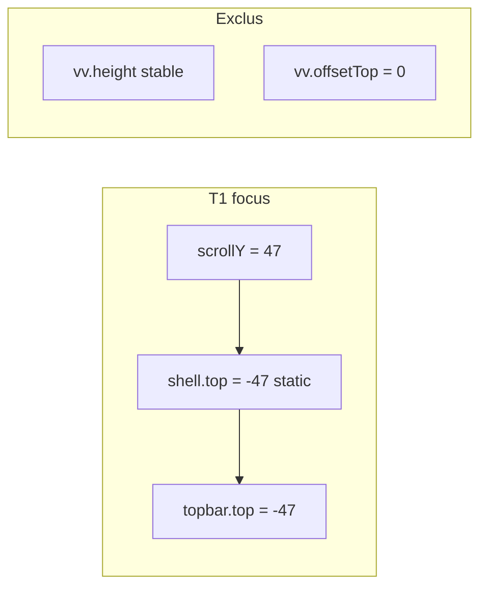

# iOS Safari/PWA — topbar décalée au focus clavier

## Mesures réelles iPhone (2026-07-13, PWA)

| Métrique | T0 repos | T1 clavier/bug | Δ T0→T1 | T2 après blur |
|----------|----------|----------------|---------|---------------|
| `scrollY` / `scrollTop` | 0 | **47** | **+47** | 0 |
| `innerHeight` | 797 | 797 | 0 | 797 |
| `vv.height` | 797 | 797 | **0** | 797 |
| `vv.offsetTop` | 0 | 0 | **0** | ~0 |
| `vv.pageTop` | 0 | **47** | +47 | 0 |
| `shell.top` | 0 | **-47** | **-47** | 0 |
| `shell.height` | 797 | 797 | **0** | 797 |
| `topbar.top` | 0 | **-47** | **-47** | 0 |
| `editable.top` | 206 | 148 | -58 | 195 |
| `scrollHeight` | 844 | 844 | 0 | 844 |
| `clientHeight` | 797 | 797 | 0 | 797 |
| `shellStyle.position` | static | static | — | static |

**Restauration T2 :** oui — `scrollY`, `shell.top`, `topbar.top` reviennent à 0. Résidu mineur sur `editable.top` (-11 px vs T0), sans impact topbar.

---

## Diagnostic confirmé

### 1. Scroll document — **SEUL signal actif**

- `scrollY` et `scrollTop` passent de 0 → **47** à T1.
- `shell.top` et `topbar.top` = **-scrollY** exactement (0 → -47).
- `vv.pageTop` = 47 = `scrollY` → iOS scroll le **layout viewport**, pas un pan `offsetTop`.
- Plage de scroll disponible : `scrollHeight - clientHeight` = **844 - 797 = 47 px** — iOS consomme toute la marge au focus.

**Mécanisme :** le document est scrollable de 47 px (probable écart `min-height: 100vh` sur `body`/`#root` vs viewport visible 797 px en PWA). Le shell est `position: static` dans le flux → il suit le scroll document → topbar passe sous la barre système.

### 2. Pan visual viewport — **exclu**

- `visualViewport.offsetTop` = **0** à T0 et T1.
- Aucun décalage vv indépendant du scroll document.

### 3. Erreur de hauteur shell — **exclu**

- `shell.height` = **797 px** stable (=`vv.height` = `innerHeight`).
- `h-dvh` est correct ; le shell n'est pas « trop haut » au sens dvh.

### 4. Repositionnement input iOS — **secondaire**

- `editable.top` baisse de 58 px (vs 47 px de scroll shell) → léger ajustement interne possible.
- Ne change pas le diagnostic principal (topbar suit `shell.top`).



---

## Correctif retenu (révisé vs plan initial)

Le plan précédent prévoyait un hook `visualViewport` (height + offsetTop) — **non justifié** par les mesures.

### Fix minimal : `position: fixed` sur le conteneur TerrainShell

**Preuve :** à T1, `shell.top === -scrollY`. Un shell fixé au viewport (`top: 0`) ne suit plus le scroll document.

Dans [`terrain-shell.tsx`](apps/web/src/components/layout/terrain-shell.tsx) — sur le `div` racine existant :

```tsx
className={cn(
  'fixed inset-x-0 top-0 z-0 mx-auto flex h-dvh w-full max-w-md flex-col overflow-hidden bg-[#F5F4F0]',
)}
```

- `fixed inset-x-0 top-0` + `mx-auto max-w-md` : centrage inchangé, ancrage viewport
- **`h-dvh` conservé** — mesures prouvent que la hauteur est correcte
- **Pas** de listener `visualViewport`
- **Pas** de `window.scrollTo(0,0)` automatique
- **Pas** de lock `html/body` (`overflow: hidden`, `dataset.terrainShell`) — aggravait T2 au rollback [`11f49a8`](11f49a8)

### Hors scope (sauf si fix insuffisant)

- Corriger `body`/`#root` `min-height: 100vh` → `100dvh` dans [`globals.css`](apps/web/src/styles/globals.css) pour supprimer les 47 px de scroll racine — toucherait login/AppShell ; à envisager seulement si `position:fixed` seul laisse un scroll fantôme.
- `interactive-widget=resizes-content` dans [`index.html`](apps/web/index.html) — sans effet iOS aujourd'hui.

### Inchangé

- Correctifs chat [`b239de2`](b239de2) : `scrollTo` messages, composer non-sticky, `text-base`
- Safe areas topbar/composer
- Pas de fix chat-only

---

## Tests

[`terrain-shell.test.tsx`](apps/web/src/components/layout/terrain-shell.test.tsx) (nouveau, léger) :

- Le conteneur `[data-terrain-shell-root]` a `position: fixed` (classe ou style computed)
- `h-dvh` toujours présent
- Pas de prétention à reproduire le clavier iOS

Régression chat : `npm test -- src/features/chat/pages/chat-conversation-page.test.tsx`

---

## Validation

```bash
cd apps/web
npm test -- terrain-shell
npm test -- src/features/chat/pages/chat-conversation-page.test.tsx
npm run typecheck
npm run lint
cd ../.. && git diff --check
```

**iPhone post-fix — critères T1 :**

| Métrique | Attendu |
|----------|---------|
| `shell.top` | **0** (fixe, même si `scrollY` > 0) |
| `topbar.top` | **0** |
| `shell.height` | 797 |
| `scrollY` | peut rester > 0 sans effet visuel sur shell |

**T2 :** identique à T0 (comme mesures actuelles).

**Régressions :** login (AppShell non fixé), scroll interne chat/report, modale photo.

---

## Risques / non vérifié

- `position: fixed` sur routes terrain desktop (faible : `max-w-md` centré)
- Scroll document résiduel (`scrollY=47`) sans effet visuel — acceptable ; à surveiller si scroll chaining gênant
- Résidu `editable.top` -11 px à T2 — à reconfirmer post-fix
