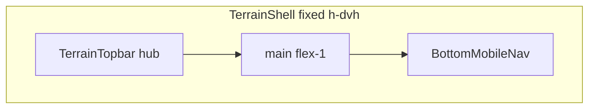

# Plan UI terrain — bottom nav, top bars, logo (révision 2)

## 1. Besoin reformulé

Sur les 5 hubs terrain (`/reporting`, `/signals`, `/execution`, `/chat`, `/general`), obtenir une interface mobile plus compacte et **strictement cohérente** : bottom nav avec rangée maîtrisée à 44 px (safe area séparée, FAB 56×56 entièrement cliquable hors flux), suppression du logo dans la top bar, et **identité visuelle identique** des 5 hub top bars — sans régression PWA/iPhone.

**Exception Reporting** : pas de titre dans la top bar ; le titre principal « Une observation ? » reste le **`h1` in-page**.

---

## 2. Diagnostic corrigé

### Architecture shell (inchangée)



Fichiers centraux :
- [`terrain-shell.tsx`](apps/web/src/components/layout/terrain-shell.tsx)
- [`bottom-mobile-nav.tsx`](apps/web/src/components/layout/bottom-mobile-nav.tsx)
- [`terrain-topbar.tsx`](apps/web/src/components/layout/terrain-topbar.tsx)
- [`terrain-routes.ts`](apps/web/src/app/terrain-routes.ts)
- [`App.tsx`](apps/web/src/App.tsx)

Script diagnostic : [`apps/web/scripts/terrain-scroll-debug-snippet.js`](apps/web/scripts/terrain-scroll-debug-snippet.js)

---

### Bottom nav — diagnostic FAB corrigé

**Erreur du plan initial** : supposer que `-translate-y-4` réduit la hauteur layout. `transform` ne modifie que le rendu ; la boîte layout reste celle du contenu non transformé.

**Code actuel (cause réelle)** :

```84:93:apps/web/src/components/layout/bottom-mobile-nav.tsx
                  <span
                    className={cn(
                      'flex h-14 w-14 -translate-y-4 items-center justify-center rounded-full ...',
                    )}
                  >
```

| Élément | Effet layout |
|---------|--------------|
| `<span>` cercle | **`h-14 w-14` (56 px) dans le flux** |
| Rangée `<ul>` | Hauteur ≈ **56 px + `pt-1` + padding safe area** |

Le `min-h-11` sur le lien **ne plafonne pas** la hauteur. La correction par seuls ajustements de padding est **insuffisante**.

**Bande blanche basse** :
- Sur iPhone PWA, zone blanche sous les icônes = **safe area home indicator** (~34 px) via padding bas — **nécessaire**.
- Shell `fixed h-dvh` → `navGapFromViewportBottom` attendu = **0**.
- Réductible : plancher `0.5rem` → `0.25rem` quand inset = 0 ; retirer `pt-1`.

**Safe area CSS** : `pb-[max(0.25rem,env(safe-area-inset-bottom))]` sur le **`<nav>`**, pas sur le `<ul>`.

**Piège box-sizing** : si `h-11` et padding safe area coexistent sur le **même** `<ul>`, avec le box sizing actuel le padding **réduit** la hauteur utile de la rangée. La cible est :

```
hauteur totale nav = rangée 44 px + safe area
```

et **non** une hauteur de 44 px contenant déjà la safe area.

---

### Structure bottom nav recommandée

#### Séparation rangée / safe area

| Élément | Rôle |
|---------|------|
| `<nav>` | Fond, bordure, `z-20`, `overflow-visible`, **`pb-[max(0.25rem,env(safe-area-inset-bottom))]`** |
| `<ul>` | Grille **`h-11`**, `px-2`, **sans padding vertical** |
| Onglets standard | `<li>` + `<NavLink>` **`min-h-11 min-w-11`** (44×44) |
| Cellule FAB | `<li className="relative h-11">` dans le flux (44 px) |

#### FAB central — lien 56×56 entièrement cliquable

**À éviter** : lien 44×44 + cercle 56 px décoratif en `absolute` avec `pointer-events-none` → zone visuelle dépassante **non interactive**.

**Structure cible** :

```tsx
<nav
  aria-label="Navigation terrain"
  className={cn(
    'relative z-20 w-full shrink-0 overflow-visible border-t border-[#E8E6DF] bg-white',
    'pb-[max(0.25rem,env(safe-area-inset-bottom))]',
    className,
  )}
>
  <ul
    className="grid h-11 px-2"
    style={{ gridTemplateColumns: `repeat(${columnCount}, minmax(0, 1fr))` }}
  >
    {/* Onglets standard */}
    <li className="flex h-11 items-center justify-center">
      <NavLink className="flex min-h-11 min-w-11 flex-col items-center justify-center gap-1 ...">
        ...
      </NavLink>
    </li>

    {/* FAB : cellule h-11, lien 56×56 absolute entièrement cliquable */}
    <li className="relative h-11">
      <NavLink
        href="/reporting"
        aria-label="Nouvelle observation"
        aria-current={isActive ? 'page' : undefined}
        onClick={...}
        className={cn(
          'absolute left-1/2 top-1/2 flex h-14 w-14 -translate-x-1/2 -translate-y-[calc(50%+0.5rem)]',
          'items-center justify-center rounded-full border-4 border-[#F5F4F0] text-white',
          terrainBrandAction.bg,
          terrainBrandAction.shadow,
          isActive && cn('ring-2', terrainBrandAction.ring),
        )}
      >
        <Icon className="h-6 w-6" />
      </NavLink>
    </li>
  </ul>
</nav>
```

**Points clés** :
- Le **lien** porte `h-14 w-14`, styles visuels, `aria-label`, navigation et état actif — **cible interactive complète 56×56**
- Position `absolute` + translate : déborde vers le haut **sans** augmenter la hauteur de la rangée `h-11`
- La cellule `<li>` reste `h-11` dans le flux de la grille
- Ajuster `-translate-y-[calc(50%+0.5rem)]` pour reproduire visuellement l'actuel `-translate-y-4`
- Conserver `overflow-visible` sur `<nav>`, `z-20`, couleurs/ring actifs

**Gain attendu** : rangée 56→44 px (~12–16 px) + retrait `pt-1` (~4 px) ; safe area inchangée en hauteur absolue.

---

### Top bars hub — cible uniforme

**Cible — identique sur les 5 hubs** (structure chrome, pas le contenu titre) :

| Propriété | Valeur unique |
|-----------|---------------|
| Safe area top | `pt-[max(0.75rem,env(safe-area-inset-top))]` |
| Padding bas header | `pb-1.5` |
| Rangée inner | `flex h-14 items-center justify-between gap-3 px-3` |
| Structure | `pageTitle` (h1) **ou** spacer `aria-hidden` ; `TrailingSlot` à droite |
| Logo | **supprimé** |
| Bordure basse | **`showBottomBorder={false}`** sur tous les hubs |
| `topbarSize` | **supprimé du code** |

**Reporting (`/reporting`) — règle spécifique** :
- **Aucun `pageTitle`** dans [`terrain-routes.ts`](apps/web/src/app/terrain-routes.ts) — ne pas en ajouter
- Top bar : spacer gauche + cloche droite (même chrome que les autres, sans titre)
- [`report-page.tsx`](apps/web/src/features/observations/pages/report-page.tsx) : conserver **« Une observation ? » en `h1`** — **ne pas** transformer en `h2`
- Les autres hubs (`/signals`, `/execution`, `/chat`, `/general`) gardent leur `pageTitle` → `h1` dans la top bar

**Suppression `topbarSize`** :

| Artefact | Action |
|----------|--------|
| `TerrainTopbarSize` | Supprimer |
| `topbarSize?` dans `TerrainRouteConfig` | Supprimer |
| Prop `topbarSize` dans `TerrainTopbar` | Supprimer ; hub = toujours `h-14` |
| Passage dans `App.tsx` | Supprimer |
| Tests « compact » | Remplacer par test hub hauteur unique |

**`resolveTerrainTopbarShowBottomBorder`** : hubs (`TERRAIN_HUB_PATHS`) → **`false`** ; detail inchangé.

---

## 3. Scope minimal

### Frontend

| Fichier | Changement |
|---------|------------|
| [`bottom-mobile-nav.tsx`](apps/web/src/components/layout/bottom-mobile-nav.tsx) | Nav/safe area séparés ; ul `h-11` ; FAB lien 56×56 absolute |
| [`terrain-topbar.tsx`](apps/web/src/components/layout/terrain-topbar.tsx) | Retrait logo, layout flex unifié, retrait `topbarSize` |
| [`terrain-routes.ts`](apps/web/src/app/terrain-routes.ts) | Retrait `TerrainTopbarSize` / `topbarSize` ; reporting **sans** `pageTitle` ; resolver bordure hubs |
| [`App.tsx`](apps/web/src/App.tsx) | Retrait prop `topbarSize` |

**Pas de modification** de [`report-page.tsx`](apps/web/src/features/observations/pages/report-page.tsx) pour le titre (h1 conservé tel quel).

### Hors scope

- Subheaders, routes detail, API, shell `fixed`, clavier iOS
- Suppression de [`houston-logo.tsx`](apps/web/src/components/domain/houston-logo.tsx)
- Réduction zones tactiles standard sous 44 px
- Ajout d'un `pageTitle` sur `/reporting`

---

## 4. Étapes d'implémentation

1. **Baseline iPhone** — snippet debug sur `/reporting` et `/signals`.
2. **`bottom-mobile-nav.tsx`** — safe area sur `<nav>` ; `<ul>` `h-11` sans padding vertical ; FAB lien 56×56 `absolute` ; retirer `pt-1` et padding bas de l'ancien `<ul>`.
3. **`terrain-topbar.tsx`** — hub flex `h-14`, retirer logo et `topbarSize`.
4. **`terrain-routes.ts`** — retirer `topbarSize` ; confirmer reporting sans `pageTitle` ; resolver bordure hubs.
5. **`App.tsx`** — retirer `topbarSize={...}`.
6. **Tests** — section 5.
7. **Checks** — typecheck, test, lint.
8. **Validation iPhone** — re-mesure + tap FAB bords supérieurs + clavier `/reporting`.

---

## 5. Tests ciblés

| Fichier | Assertions |
|---------|------------|
| [`bottom-mobile-nav.test.tsx`](apps/web/src/components/layout/bottom-mobile-nav.test.tsx) | **`pb-[max(0.25rem,env(safe-area-inset-bottom))]` sur `<nav>`**, pas sur `<ul>` ; **`<ul>` avec `h-11` sans classe `pb-[...]`** ; onglets standard `min-h-11 min-w-11` ; lien primary **`h-14 w-14`** + **`absolute`** (FAB hors flux) ; **pas de `pointer-events-none`** sur le cercle FAB ; `aria-label="Nouvelle observation"` ; z-20 |
| [`terrain-topbar.test.tsx`](apps/web/src/components/layout/terrain-topbar.test.tsx) | Pas de logo ; hub `.h-14` ; flex (pas grille 3 col.) ; spacer sans `pageTitle` |
| [`terrain-routes.test.ts`](apps/web/src/app/terrain-routes.test.ts) | Configs hub sans `topbarSize` ; **reporting sans `pageTitle`** (config inchangée sur ce point) |
| **Nouveau** `terrain-routes.test.ts` | `resolveTerrainTopbarShowBottomBorder` → false pour les 5 hubs |
| [`report-page.test.tsx`](apps/web/src/features/observations/pages/report-page.test.tsx) *(si existant)* ou test d'intégration | **`h1` « Une observation ? »** présent in-page |

**Tests layout bottom nav — détail recommandé** :
- `nav` contient le padding safe area ; `ul` hauteur fixe `h-11` seule
- Lien FAB : dimensions `h-14 w-14`, positionnement `absolute`, pas de wrapper 44×44 autour d'un décor 56 px

---

## 6. Vérifications manuelles mobile/PWA

- [ ] `navGapFromViewportBottom === 0`
- [ ] Hauteur nav totale ≈ **44 px (rangée) + safe area** — mesurer `<ul>` et `<nav>` séparément via snippet
- [ ] Rangée `<ul>` = 44 px ; padding safe area visible **sous** la rangée, pas dedans
- [ ] FAB : tap sur le **bord supérieur** du cercle 56 px déclenche la navigation (zone entière interactive)
- [ ] Onglets latéraux : tap 44×44 OK
- [ ] Home indicator : icônes au-dessus de la safe area
- [ ] 5 hubs : top bar chrome identique (hauteur, padding, pas de bordure)
- [ ] `/reporting` : top bar **sans titre** ; **`h1` « Une observation ? »** visible in-page
- [ ] Clavier iOS `/reporting` : pas de régression shell
- [ ] Sticky footers : pas de chevauchement

---

## 7. Risques de régression

| Risque | Mitigation |
|--------|------------|
| Safe area réduite par `h-11` sur même élément | Padding safe area **uniquement** sur `<nav>` |
| FAB partiellement non cliquable | Lien entier 56×56 = cible interactive ; pas de décor séparé |
| FAB visuel tronqué | `overflow-visible` sur `<nav>` |
| Safe area supprimée | `max(0.25rem, env(...))` sur nav |
| Reporting titre dupliqué | Ne pas ajouter `pageTitle` |
| Hiérarchie titres Reporting | h1 in-page conservé ; acceptable (pas de h1 topbar sur cette route) |
| Régression clavier iOS | Ne pas modifier `TerrainShell` |

---

## 8. Definition of Done

- Nav : rangée 44 px + safe area séparée ; FAB 56×56 entièrement cliquable, hors flux
- 5 hub top bars : chrome identique ; logo absent ; `topbarSize` supprimé
- `/reporting` : sans `pageTitle` ; h1 « Une observation ? » in-page inchangé
- Tests et checks CI verts
- Validation iPhone documentée

---

## 9. Recommandation

**Deux commits logiques** :
1. **Bottom nav** — séparation nav/ul + FAB 56×56 cliquable
2. **Top bar hub** — uniformisation + suppression logo/`topbarSize`

Cause racine bottom nav : `h-14` du cercle **dans le flux**. Correction : rangée `h-11` sur `<ul>` isolé, safe area sur `<nav>`, lien FAB 56×56 en `absolute`.

**Prêt pour validation avant implémentation.**
