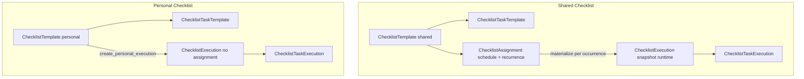

# Audit Checklist — Houston

> **SUPERSEDED (2026-06-09)** — Snapshot d’audit pré-correction doc. **Vérité produit actuelle :** [`checklist_domain.md`](../product/domains/checklist_domain.md), [`feed_domain.md`](../product/domains/feed_domain.md), [`rbac_permissions_domain.md`](../product/domains/rbac_permissions_domain.md). Ne pas utiliser ce fichier comme gate d’implémentation.
>
> **Périmètre** : lecture seule. Code audité dans `apps/api/houston/checklists/`, `apps/web/src/features/checklists/`, intégrations execution feed / observations, et docs produit.
>
> **État au 2026-06-09 (historique)** : implémentation substantiellement complète côté code ; documentation produit en retard au moment de la rédaction (depuis corrigée — Lots Doc 1–2, 6).

---

## 1. Résumé exécutif

### État général

La fonctionnalité Checklist est **implémentée de bout en bout** :

- Backend : modèles, services, permissions, 20+ endpoints REST, intégration Execution Feed polymorphe, handoff Observation/AI.
- Frontend : hub Profil, pages template/exécution, intégration feed terrain, reporting contextuel.
- Tests backend : **14 modules** couvrant RBAC, matérialisation, feed, observation handoff.
- Tests frontend : **12 fichiers lib-only** ; pas de tests pages/hooks.

### Niveau de maturité

| Couche | Maturité | Commentaire |
|--------|----------|-------------|
| Backend métier | **Élevée** | Services explicites, snapshots, contraintes DB, permissions strictes |
| API / OpenAPI | **Élevée** | ~78 références checklist dans [`schema.yml`](../apps/api/schema.yml) |
| Frontend terrain | **Moyenne** | Flux principaux OK ; permissions UI incomplètes ; code mort |
| Documentation produit | **Faible** | [`checklist_domain.md`](../product/domains/checklist_domain.md) et [`feed_domain.md`](../product/domains/feed_domain.md) contredisent le code |
| Historique / analytics | **Faible** | Pas de liste d'exécutions terminées ; accès par ID uniquement |

### Risques majeurs

1. **Drift doc/code** — risque de mauvaises décisions produit et régressions.
2. **Permissions UI non alignées** — boutons d'action visibles pour des rôles qui recevront 403 (exécution tâches, annulation).
3. **Matérialisation récurrente fragile** — tâche Celery non planifiée ; horizon 14j dépend du feed read.
4. **Vocabulaire UX ambigu** — supprimer vs désactiver vs annuler vs retirer du feed.
5. **DELETE template shared avec historique** — autorisé (détache exécutions) alors qu'un message mort `_SHARED_DELETE_HISTORY_MESSAGE` suggère l'inverse.

### Recommandation principale

**Mettre à jour la documentation produit en priorité P0**, puis **aligner l'UI sur les permissions backend** (masquer actions non autorisées, exposer désactivation template) avant d'ajouter des bottom sheets edit/delete.

---

## 2. Cartographie métier

### Concepts (réponse Q1)



| Concept | Rôle | Durée de vie |
|---------|------|--------------|
| **Template** | Définition réutilisable (titre, tâches, BU pour shared) | Long terme ; `active`/`inactive` |
| **Assignment** (shared only) | Planification : assigné à, fenêtre start/due, récurrence | `active`/`inactive` ; pas de réactivation |
| **Execution** | Instance opérationnelle snapshotée | `assigned` → `in_progress` → `done`/`canceled` |
| **Task Template** | Étape du modèle | Position ordonnée |
| **Task Execution** | Étape runtime copiée du template | `pending` → `done`/`skipped`/`observation_created` |

### Shared vs Personal

| | Shared | Personal |
|---|--------|----------|
| `business_unit` | Requis (RBAC Manager via `MembershipScope`) | `null` |
| Assignment | Oui (schedule + `recurrence_days`) | Non |
| Matérialisation | Par occurrence ; `visible_from = start_at - 1h` | Immédiat (`visible_from = null`) |
| `due_at` | Oui (snapshot) | `null` (pas d'overdue) |
| Exécutions actives concurrentes | Multiples (par assignment/occurrence) | **1 max** par template |
| Catalogue Profil | Owner/Director/Manager (BU scope) | Créateur uniquement |
| Feed `+` | Interdit | « Checklist personnelle » |

### Flux principaux

1. **Créer shared** : Template (`inactive` par défaut) → ajouter tâches (auto-`active`) → affecter → 1ère occurrence matérialisée.
2. **Créer personal** : Template + tâches + activate → `personal-executions/` → page exécution.
3. **Exécuter** : 1er mark-done/skip/observation → `in_progress` ; toutes tâches traitées → `done`.
4. **Signaler** : `create-observation` → Observation `origin=checklist_task` → pipeline AI async.
5. **Feed** : `GET execution-feed/` merge actions + checklists ; matérialisation lazy à la lecture.

---

## 3. Cartographie backend

### Structure du domaine

Répertoire : [`apps/api/houston/checklists/`](../../apps/api/houston/checklists/)

| Fichier | Rôle | Responsabilités | Interactions | Points faibles |
|---------|------|-----------------|--------------|----------------|
| [`models.py`](../../apps/api/houston/checklists/models.py) | Schéma | 5 modèles, contraintes CHECK, unique `(assignment, occurrence_date)`, unique exécution personal active | establishments, observations | FK assignment→template `SET_NULL` → assignments orphelins |
| [`constants.py`](../../apps/api/houston/checklists/constants.py) | Enums/frozensets | Statuts, jours récurrence, longueurs max | services, permissions | — |
| [`exceptions.py`](../../apps/api/houston/checklists/exceptions.py) | Erreurs domaine | 400/403/409 + `active_execution_id` | views | Messages delete en français |
| [`services.py`](../../apps/api/houston/checklists/services.py) (~1092 lignes) | **Autorité métier** | CRUD template/tâches, assignments, matérialisation, exécution, tâches, delete | observations.services, permissions | Constante morte `_SHARED_DELETE_HISTORY_MESSAGE` ; logique dense |
| [`selectors.py`](../../apps/api/houston/checklists/selectors.py) | Lectures | Catalogues RBAC, feed, merge actions+checklists | actions.selectors | Pagination merge approximative |
| [`permissions.py`](../../apps/api/houston/checklists/permissions.py) | RBAC | 20+ helpers | establishments.membership_scope | Pas de hints API pour le frontend |
| [`api/views.py`](../../apps/api/houston/checklists/api/views.py) | HTTP mince | 20 endpoints | services, selectors | — |
| [`api/serializers.py`](../../apps/api/houston/checklists/api/serializers.py) | DTO | Request/response | — | Pas d'orchestration (correct) |
| [`api/urls.py`](../../apps/api/houston/checklists/api/urls.py) | Routing | Sous `/api/v1/establishments/{id}/` | config/urls.py | — |
| [`feed_serializers.py`](../../apps/api/houston/checklists/feed_serializers.py) | Projection feed | `ChecklistFeedItem` safe summary | actions ExecutionFeedView | — |
| [`tasks.py`](../../apps/api/houston/checklists/tasks.py) | Celery wrapper | `materialize_checklist_assignments_horizon_task` | services | **Non planifié** (aucun Beat/caller) |

### Endpoints API

Tous sous `/api/v1/establishments/{establishment_id}/` :

| Method | Path | Purpose |
|--------|------|---------|
| GET, POST | `checklist-templates/?type=shared\|personal` | List / create |
| GET, PATCH, DELETE | `checklist-templates/{template_id}/` | Detail / update / delete |
| POST | `checklist-templates/{template_id}/activate/` | Activate (requires ≥1 task) |
| POST | `checklist-templates/{template_id}/deactivate/` | Deactivate |
| POST | `checklist-templates/{template_id}/tasks/` | Add task |
| POST | `checklist-templates/{template_id}/tasks/reorder/` | Reorder tasks |
| PATCH, DELETE | `checklist-task-templates/{task_template_id}/` | Update / delete task |
| GET | `checklist-assignments/` | List assignments |
| POST | `checklist-templates/{template_id}/assignments/` | Create assignment + materialize first occurrence |
| GET, PATCH | `checklist-assignments/{assignment_id}/` | Detail / update schedule |
| POST | `checklist-assignments/{assignment_id}/deactivate/` | Deactivate assignment |
| POST | `checklist-templates/{template_id}/personal-executions/` | Create personal execution |
| GET | `checklist-executions/{execution_id}/` | Detail with task executions |
| POST | `checklist-executions/{execution_id}/cancel/` | Cancel execution |
| POST | `checklist-task-executions/{id}/mark-done/` | Mark task done |
| POST | `checklist-task-executions/{id}/skip/` | Skip task |
| POST | `checklist-task-executions/{id}/create-observation/` | Observation handoff |

### Migrations

- `0001_initial` : schéma complet
- `0002` : `ChecklistExecution.checklist_template` nullable (détachement historique)
- `0003` : `ChecklistAssignment.checklist_template` → `SET_NULL`
- [`observations/0004`](../../apps/api/houston/observations/migrations/0004_observation_checklist_origin.py) : `origin`, FKs execution/task

### Tests backend ([`tests/`](../../apps/api/houston/checklists/tests/))

| Module | Couverture critique |
|--------|---------------------|
| `test_permissions.py` | Matrice RBAC complète |
| `test_materialization_services.py` | Idempotence, visible_from, horizon |
| `test_execution_feed_checklist.py` | Feed inclusion/exclusion, overdue, 1h rule |
| `test_observation_handoff.py` | Origin, pas de Signal/Action sync |
| `test_template_api.py` | DELETE avec historique, conflit active execution |
| `test_task_api.py` | Pas de endpoint start, auto in_progress |
| `test_assignment_services.py` | Update n'affecte pas exécutions existantes |

**Lacunes tests** : Celery task scheduling, orphan assignments cleanup, pagination feed merge edge cases, manager hors scope sur URLs directes.

---

## 4. Cartographie frontend

### Pages ([`features/checklists/pages/`](../../apps/web/src/features/checklists/pages/))

| Page | Fichier | Données | Mutations | Points faibles |
|------|---------|---------|-----------|----------------|
| Hub | `checklist-hub-page.tsx` | templates shared/personal | delete template | `window.confirm` ; `toRoleEnum` dupliqué |
| Template create | `checklist-template-create-page.tsx` | — | create+tasks+activate / quick personal | Pas de garde URL shared pour Staff |
| Template detail | `checklist-template-detail-page.tsx` | template, tasks, assignments | update, tasks CRUD, assignment create/deactivate, start personal | Pas d'edit assignment ; pas deactivate template |
| Quick create | `checklist-quick-create-page.tsx` | — | quickCreatePersonalChecklistExecution | Duplique personal create |
| Execution detail | `checklist-execution-detail-page.tsx` | execution + tasks | mark-done, skip, cancel | **Pas de garde assignee** sur actions ; cancel visible pour tous |
| Legacy redirects | `checklist-shared/personal-page.tsx` | — | redirect hub | Routes mortes dans terrain-routes |

### Composants clés

- **Actifs** : `checklist-template-section`, `checklist-assignment-section`, `checklist-assignment-create-sheet`, `checklist-task-editor`, `checklist-create-menu-sheet`
- **Mort/inutilisé** : `checklist-template-list.tsx`, `checklist-status-badge.tsx`

### Hooks ([`hooks.ts`](../../apps/web/src/features/checklists/hooks.ts))

- 15+ hooks TanStack Query
- Invalidation : `checklistsQueryKeys` + `actionsQueryKeys.all`
- **Asymétrie** : `invalidateChecklistExecutionSurfaces` n'invalide que templates `personal`, pas `shared`

### API client ([`api.ts`](../../apps/web/src/features/checklists/api.ts))

- Wrapper OpenAPI complet sauf **`PATCH checklist-assignments/{id}`** (existe backend, absent frontend)

### Lib helpers

- [`checklist-management-access.ts`](../../apps/web/src/features/checklists/lib/checklist-management-access.ts) : rôles miroir backend (sans scope BU Manager)
- [`checklist-display.ts`](../../apps/web/src/features/checklists/lib/checklist-display.ts) : labels FR, feed sections, overdue client
- [`checklist-delete-flow.ts`](../../apps/web/src/features/checklists/lib/checklist-delete-flow.ts) : gestion 409 active execution
- [`checklist-reporting-context.ts`](../../apps/web/src/features/checklists/lib/checklist-reporting-context.ts) : handoff `/reporting?checklist_*`

### Intégration Execution Feed

- [`execution-checklist-card.tsx`](../../apps/web/src/features/execution/components/execution-checklist-card.tsx)
- [`execution-feed-sections.ts`](../../apps/web/src/features/execution/lib/execution-feed-sections.ts)
- Placeholders supprimés (`execution-checklist-placeholder-card.tsx` deleted)

### Routing

- [`app-routes.ts`](../../apps/web/src/app/app-routes.ts) : 7 routes checklist
- Entrée Profil : [`profile-page.tsx`](../../apps/web/src/features/auth/pages/profile-page.tsx) → « Gérer les checklists »

### Tests frontend

12 fichiers `lib/*.test.ts` uniquement — **0 test** pages/hooks/api/report handoff.

---

## 5. Flux fonctionnels actuels

### Création Shared Checklist

1. Hub → create menu → `/checklists/shared/new`
2. `POST checklist-templates/` (`inactive`, BU requis)
3. `POST .../tasks/` (×N) → auto-activate si ≥1 tâche
4. `POST .../activate/` (si orchestration `createChecklistTemplateWithTasks`)
5. Retour hub

### Création Personal Checklist

- **Via Profil** : `/checklists/personal/new` → `quickCreatePersonalChecklistExecution` → execution detail
- **Via Feed `+`** : `/checklists/executions/new` → même flux

### Affectation Shared

1. Template detail (active, ≥1 tâche) → sheet assignment
2. `POST .../assignments/` avec `start_at`, `due_at`, `recurrence_days`
3. Backend matérialise **première occurrence** ; `last_materialized_at` mis à jour

### Matérialisation

- Horizon : **14 jours** (`MATERIALIZATION_HORIZON_DAYS`)
- Visibilité : `visible_from = start_at - 1h`
- Triggers : création assignment, `ensure_visible_executions_materialized` (feed read)
- Idempotence : unique `(assignment, occurrence_date)` — **retourne exécution existante même si `done`/`canceled`** → pas de re-matérialisation

### Exécution

- Pas de `POST /start/` — 1er événement tâche démarre
- Assigné uniquement peut exécuter (`can_execute_checklist_tasks`)
- Complétion auto quand toutes tâches `done|skipped|observation_created`

### Annulation

- `POST .../executions/{id}/cancel/` — shared : Owner/Director/Manager (BU) ; personal : assignee
- Exécution disparaît du feed ; **reste consultable** via GET detail

### Suppression template

- Shared : Owner/Director only
- Bloque si exécution **active** (409 + `active_execution_id`)
- Exécutions **terminales** : `checklist_template` → `NULL` (snapshots conservés)
- Assignments : désactivés ; supprimés si sans exécutions

### Feed execution

- Polymorphe `item_type: action | checklist`
- Checklists : `status IN (assigned, in_progress)` AND `now >= visible_from`
- `done`/`canceled` exclus ; historique **non listé** ; accessible par lien direct si ID connu

### Historique

- **Pas d'endpoint liste** d'exécutions terminées
- Données historiques : snapshots sur `ChecklistExecution` / `ChecklistTaskExecution` + FK Observation `PROTECT`
- Après delete template : GET execution detail fonctionne ; `checklist_template_id` peut être `null`

### Interactions Observations / Signals / Actions

- Observation : [`create_observation_from_task`](../../apps/api/houston/checklists/services.py) → `submit_observation` avec origin `checklist_task`
- AI : [`observation_pipeline.py`](../../apps/api/houston/ai/observation_pipeline.py) `_build_checklist_context`
- Signal/Action : **async uniquement** via pipeline (testé : pas de création sync)

---

## 6. Matrice permissions

| Action | Owner | Director | Manager (in BU) | Manager (hors BU) | Staff | Backend | Frontend | Aligné ? |
|--------|-------|----------|-----------------|-------------------|-------|---------|----------|----------|
| Accès hub Profil | ✓ | ✓ | ✓ | ✓ | ✓ | ✓ | ✓ | ✓ |
| Voir catalogue shared | ✓ | ✓ | ✓ | ✗ | ✗ | ✓ | ✓ (section cachée) | ✓ |
| Créer shared template | ✓ | ✓ | ✓ | ✗ | ✗ | ✓ | ✓* | ⚠ URL directe staff |
| Modifier shared template | ✓ | ✓ | ✓ | ✗ | ✗ | ✓ | ✓ (detail) | ⚠ pas de gate BU UI |
| **Supprimer** shared template | ✓ | ✓ | ✗ | ✗ | ✗ | ✓ | ✓ | ✓ |
| Créer assignment | ✓ | ✓ | ✓ | ✗ | ✗ | ✓ | ✓ | ✓ |
| Désactiver assignment | ✓ | ✓ | ✓ | ✗ | ✗ | ✓ | ✓ | ✓ |
| Créer personal template | ✓ | ✓ | ✓ | ✓ | ✓ | ✓ | ✓ | ✓ |
| Supprimer personal template | créateur | créateur | créateur | créateur | créateur | ✓ | ✓ | ✓ |
| Créer personal execution | créateur | créateur | créateur | créateur | créateur | ✓ | ✓ | ✓ |
| **Exécuter tâches** | si assigné | si assigné | si assigné | si assigné | si assigné | ✓ | ✗ boutons pour tous viewers | **✗** |
| Voir exécution shared | ✓ | ✓ | ✓/assigné | assigné | assigné | ✓ | ✓ | ✓ |
| **Annuler** shared execution | ✓ | ✓ | ✓ | ✗ | ✗ | ✓ | ✗ bouton pour tous | **✗** |
| Annuler personal execution | assigné | assigné | assigné | assigné | assigné | ✓ | ✗ bouton pour tous viewers | **✗** |
| Feed `+` personal | ✓ | ✓ | ✓ | ✓ | ✓ | ✓ | ✓ | ✓ |
| Feed `+` action | ✓ | ✓ | ✓ | ✗ | ✗ | ✓ | ✓ | ✓ |

---

## 7. Modèle de données et cycle de vie

### Statuts et transitions

**Template** : `inactive` (défaut) ↔ `active` (activate / auto on task add / auto-off on last task delete)

**Assignment** : `active` → `inactive` (irréversible)

**Execution** :

```
assigned ──(1er événement tâche)──► in_progress ──(toutes traitées)──► done
   │                                        │
   └──────────── cancel ────────────────────┴──► canceled
```

**Task execution** : `pending` → `done` | `skipped` | `observation_created`

### Snapshots (Q3)

Copiés à la matérialisation / création personal :

- `template_title`, `template_description`
- `business_unit`, `assigned_to`, `assigned_by`
- `start_at`, `due_at`, `visible_from`, `occurrence_date` (shared)
- Par tâche : `title`, `instructions`, `position`

**Pourquoi** : immutabilité opérationnelle ; edits template/assignment n'affectent pas exécutions en cours.

### Données historiques (Q4) — ne pas détruire

- `ChecklistExecution` / `ChecklistTaskExecution` terminaux (même `checklist_template_id = null`)
- FK `Observation` sur tâche (`PROTECT` sur checklist side ; `SET_NULL` côté observation delete)
- Assignments avec exécutions (conservés, `inactive` ou orphelins)

### FK cascade / protect

| Relation | on_delete | Zone dangereuse |
|----------|-----------|-----------------|
| Execution → Template | PROTECT (nullable) | Delete template détache, ne supprime pas executions |
| Execution → Assignment | PROTECT | Assignment jamais hard-deleted si executions |
| Assignment → Template | **SET_NULL** | Orphan assignments possibles |
| TaskExecution → TaskTemplate | SET_NULL | Référence perdue, snapshot texte OK |

### `inactive` (Q5)

- **Template** : bloque nouvelles assignments/exécutions ; existantes inchangées — **produit-compatible** mais **mal exposé UI** (pas de bouton désactiver, seulement delete)
- **Assignment** : stoppe matérialisation future — UI « Désactiver » OK
- **Pas de `inactive` sur Execution** — annulation = `canceled`

---

## 8. Incohérences produit

| # | Problème | Impact utilisateur | Impact technique | Recommandation |
|---|----------|-------------------|------------------|----------------|
| 1 | Doc dit `not_started` ; code complet | Confusion équipe, mauvais planning | Agents/devs ignorent APIs existantes | Mettre à jour `checklist_domain.md`, `feed_domain.md` §implementation |
| 2 | Doc §3.8 handoff « not implemented » | — | Faux ; migration 0004 + endpoints existent | Corriger doc §3.8 |
| 3 | `_SHARED_DELETE_HISTORY_MESSAGE` mort vs delete autorisé | Owner peut supprimer checklist « utilisée » sans avertissement historique | Dette code / intention produit floue | Décider : bloquer delete si historique OU documenter comportement detach |
| 4 | Supprimer vs Désactiver template | Delete destructif affiché ; deactivate invisible | Managers ne peuvent pas « retirer » sans delete (shared) | Exposer deactivate UI ; réserver delete aux cas sans historique |
| 5 | Annuler vs retirer du feed | Annulation = disparaît feed mais reste en DB | Pas d'historique UI | Clarifier copy « Annuler » ; future page historique |
| 6 | `inactive` template invisible UI | Templates listés sans badge statut | Utilisateur ne sait pas pourquoi assignment échoue | Afficher `ChecklistStatusBadge` ou label |
| 7 | Manager voit boutons exécution | Clic → erreur 403 | Mauvaise UX terrain | Masquer actions si `assigned_to !== me` |
| 8 | Staff voit bouton annuler shared | 403 | Frustration | Masquer selon rôle/type |
| 9 | Pas d'edit assignment UI | Doit recréer ou laisser plan obsolète | Dette ; PATCH backend inutilisé | Ajouter edit sheet ou documenter limitation |
| 10 | Personal create dupliqué (2 pages) | Maintenance | Code redondant | Consolider sur quick-create |
| 11 | Feed sort actions vs checklists | Ordre peut différer de spec simple | Pagination merge non cursor-safe | Ticket dédié feed pagination |
| 12 | Messages erreur delete en français | Incohérent avec API anglaise | i18n ad hoc | Centraliser via error codes |

---

## 9. Dettes techniques

### P0 — Critique

- Documentation produit obsolète ([`checklist_domain.md`](../product/domains/checklist_domain.md) L5-58, [`feed_domain.md`](../product/domains/feed_domain.md) L5-6)
- Permissions UI execution detail (actions visibles sans droit)
- Celery horizon task non planifiée ([`tasks.py`](../../apps/api/houston/checklists/tasks.py))

### P1 — Important

- Frontend : `PATCH assignment` non implémenté
- `deactivateChecklistTemplate` hook sans UI
- Invalidation query asymétrique (personal vs shared)
- Report page n'invalide pas execution feed
- Orphan assignments (`SET_NULL`) sans cleanup
- Constante/message mort `_SHARED_DELETE_HISTORY_MESSAGE`

### P2 — Amélioration

- Code mort : `checklist-template-list`, `checklist-status-badge`, routes legacy shared/personal
- `checklist-template-create-flow.ts` non utilisé par pages
- `toRoleEnum` dupliqué hub vs `checklist-role.ts`
- Overdue recalculé client (`REFERENCE_NOW_MS`) vs backend feed
- Pagination feed merge approximative
- Pas de `ChecklistPermissionHints` API (contrairement Actions)

### P3 — Confort

- `window.confirm` pour delete (bottom sheet futur)
- Tests frontend pages/hooks
- Drag-and-drop reorder (API existe, UI position-only implicite)

---

## 10. Risques

| Risque | Sévérité | Détail |
|--------|----------|--------|
| Perte d'historique perçue | Moyen | Delete template OK ; snapshots restent mais pas de UI historique |
| Suppression dangereuse | Moyen | Delete vs deactivate confondu ; shared delete = owner/director only |
| Re-matérialisation | **Faible** | Idempotence par `(assignment, occurrence_date)` inclut terminaux |
| Divergence FE/BE | **Élevé** | Actions/cancel visibles sans permission ; staff URL shared/new |
| Permissions trop larges UI | Moyen | Backend protège ; UX dégradée |
| États impossibles | Faible | Contraintes DB solides |
| Récurrence hors horizon | **Élevé** | Sans Celery Beat, occurrences >14j sans feed read peuvent manquer |
| Dette tests FE | Moyen | Régressions non détectées sur mutations |
| Bottom sheet futur | Moyen | Delete flow + invalidation + 409 conflict doivent être centralisés |

---

## 11. Recommandations (roadmap courte)

### Quick wins (1-2 jours)

1. Mettre à jour docs produit (statut implémenté, endpoints, feed Phase 7 done, handoff done).
2. Execution detail : masquer mark-done/skip/report/cancel si non assigné / non autorisé à cancel.
3. Afficher statut template `active`/`inactive` dans hub/detail.
4. Exposer « Désactiver la checklist » (template deactivate) à côté de delete.
5. Fix invalidation : inclure `shared` templates + `actionsQueryKeys` dans report success.

### Corrections produit (1 sprint)

6. Décision explicite delete-with-history (bloquer vs detach+warn).
7. UI edit assignment (PATCH) ou message « recréer l'affectation ».
8. Page ou section « Historique » exécutions terminées (nouveau selector + endpoint liste).
9. Planifier Celery Beat pour `materialize_checklist_assignments_horizon_task`.

### Corrections techniques

10. Supprimer code mort (template-list, status-badge unused, legacy redirects).
11. Consolider personal create en une page.
12. Ajouter `permission_hints` sur execution detail API (pattern Actions).
13. Nettoyer `_SHARED_DELETE_HISTORY_MESSAGE` (utiliser ou supprimer).

### Tests à ajouter

- Frontend : execution detail permission gating, delete 409 flow, report invalidation
- Backend : Celery task integration, orphan assignment cleanup, feed pagination edge cases

### Ce qu'il ne faut **pas** faire maintenant

- Endpoint `start` (contre spec MVP)
- Modèle `PersonalChecklist` séparé
- Notifications checklist (hors scope MVP)
- Refactor massif `services.py` sans ticket dédié
- Bottom sheets edit/delete avant alignement permissions

---

## 12. Fichiers candidats pour futurs tickets

### Documentation

- [`docs/product/domains/checklist_domain.md`](../product/domains/checklist_domain.md)
- [`docs/product/domains/feed_domain.md`](../product/domains/feed_domain.md)

### Backend

- [`apps/api/houston/checklists/services.py`](../../apps/api/houston/checklists/services.py) — delete semantics, orphan cleanup
- [`apps/api/houston/checklists/tasks.py`](../../apps/api/houston/checklists/tasks.py) — Celery Beat wiring
- [`apps/api/houston/checklists/selectors.py`](../../apps/api/houston/checklists/selectors.py) — historique, feed pagination
- [`apps/api/houston/checklists/permissions.py`](../../apps/api/houston/checklists/permissions.py) — permission hints
- [`apps/api/houston/checklists/api/serializers.py`](../../apps/api/houston/checklists/api/serializers.py) — hints sur execution detail

### Frontend

- [`apps/web/src/features/checklists/pages/checklist-execution-detail-page.tsx`](../../apps/web/src/features/checklists/pages/checklist-execution-detail-page.tsx) — permission gating
- [`apps/web/src/features/checklists/pages/checklist-template-detail-page.tsx`](../../apps/web/src/features/checklists/pages/checklist-template-detail-page.tsx) — deactivate, assignment edit
- [`apps/web/src/features/checklists/pages/checklist-hub-page.tsx`](../../apps/web/src/features/checklists/pages/checklist-hub-page.tsx) — status display, bottom sheet delete
- [`apps/web/src/features/checklists/hooks.ts`](../../apps/web/src/features/checklists/hooks.ts) — invalidation fix
- [`apps/web/src/features/checklists/api.ts`](../../apps/web/src/features/checklists/api.ts) — PATCH assignment
- [`apps/web/src/features/observations/pages/report-page.tsx`](../../apps/web/src/features/observations/pages/report-page.tsx) — invalidation feed
- Suppression : `checklist-template-list.tsx`, `checklist-status-badge.tsx` (ou brancher), legacy pages

---

## Réponses aux 15 questions clés

| # | Question | Réponse courte |
|---|----------|----------------|
| 1 | Template vs Assignment vs Execution | Définition / planification shared / instance snapshotée runtime |
| 2 | Qui peut quoi | Voir matrice §6 ; exécution tâches = **assigné uniquement** |
| 3 | Snapshots | Titre, description, BU, schedule, tâches — à matérialisation |
| 4 | Historique | Exécutions terminées détachées mais conservées ; pas de liste UI |
| 5 | `inactive` | Template + Assignment ; pas sur Execution ; mal exposé UI |
| 6 | UX supprimer/désactiver/annuler | Confusion confirmée — voir §8 |
| 7 | BE/FE alignés | Backend autoritaire ; FE gaps sur execution actions |
| 8 | Permissions UI = BE | **Non** pour execute/cancel ; **partiel** pour manager BU scope |
| 9 | Endpoints cohérents | Oui sauf DELETE template absent de doc candidat |
| 10 | Tests cas critiques | Backend : bon ; Frontend : faible |
| 11 | Docs à jour | **Non** — drift majeur |
| 12 | Fragilité bottom sheet | Delete 409, invalidation, confirm → centraliser avant sheets |
| 13 | Re-matérialisation supprimées | Non — exécutions non supprimées ; idempotence par occurrence |
| 14 | Historique après delete template/assignment | Consultable par ID ; pas dans feed ; template_id null |
| 15 | Code mort/redondant | template-list, status-badge, legacy routes, create-flow helper, 2 personal create pages |
