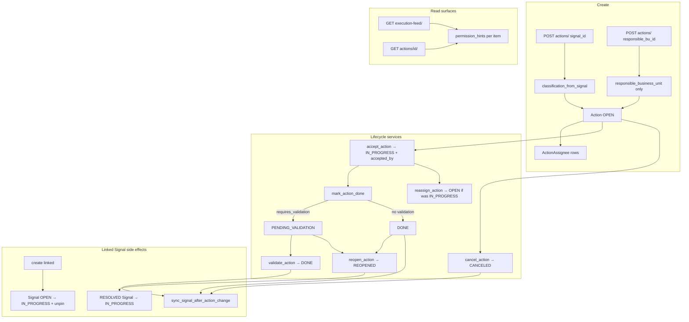

# Action Domain Audit

Status: audit report  
Date: 2026-06-24  
Scope: Action create/assign/update/validate/expose — backend `actions/` app, execution feed, Signal coupling, frontend `features/actions/` + `features/execution/`, related tests and docs  
Mode: audit only — no source changes

Related: [Signal + Signal Feed Consolidation](./signal_feed_consolidation.md) (upstream handoff; SIG-03 aggregation race done), [`action_domain.md`](../product/domains/action_domain.md), [`feed_domain.md`](../product/domains/feed_domain.md)

---

## Inspection manifest

### 1. Files inspected

**Contract and rules**

- `AGENTS.md`, `apps/api/AGENTS.md`
- `.cursor/rules/10-backend-django-drf.mdc`, `80-security-data-integrity.mdc`

**Backend — actions core**

- `apps/api/houston/actions/models.py` — `Action`, `ActionAssignee`, indexes, unique `(action, membership)`
- `apps/api/houston/actions/services.py` — create, lifecycle transitions, `sync_signal_after_action_change`, notifications/realtime scheduling
- `apps/api/houston/actions/selectors.py` — feed visibility, sorting annotations, `get_action_for_detail`
- `apps/api/houston/actions/permissions.py` — visibility, actionability, command hints
- `apps/api/houston/actions/constants.py` — `ACTIVE_ACTION_STATUSES`, `EXECUTION_FEED_STATUSES`, `TERMINAL_ACTION_STATUSES`
- `apps/api/houston/actions/action_classification.py` — linked/free classification, `resolve_action_responsible_business_unit`
- `apps/api/houston/actions/execution_feed.py`, `execution_feed_cursor.py` — polymorphic checklist+action pagination
- `apps/api/houston/actions/api/views.py`, `serializers.py`, `urls.py`
- `apps/api/houston/actions/exceptions.py`
- `apps/api/houston/actions/migrations/` — `0001`–`0005` (multi-assignee phase)

**Backend — cross-domain (Action coupling only)**

- `apps/api/houston/signals/services.py` — `resolve_signal` guard when linked actions active
- `apps/api/houston/establishments/membership_scope.py` — `build_action_visibility_scope_q`
- `apps/api/houston/notifications/scheduling.py` — action notification producers
- `apps/api/houston/realtime/broadcast.py`, `ws_payloads.py`

**Frontend**

- `apps/web/src/features/actions/` — pages, components, hooks, api, types, lib
- `apps/web/src/features/execution/` — feed page, action cards, section grouping
- `apps/web/src/features/signals/pages/signal-detail-page.tsx` — linked create entry
- `apps/web/src/lib/query-invalidation.ts`
- `apps/web/src/features/realtime/lib/apply-operational-invalidation.ts`
- `apps/web/src/api/generated/types.ts` — `ActionDetail`, `ActionPermissionHints`

**Docs**

- `docs/product/domains/action_domain.md`
- `docs/product/domains/feed_domain.md`
- `docs/product/build_plan_mvp/phase_5_actions_execution_feed.md`

### 2. Tests inspected

| Area | Key files |
|------|-----------|
| Lifecycle services | `actions/tests/test_action_services.py` |
| RBAC helpers | `actions/tests/test_action_permissions.py` |
| Create/detail API | `actions/tests/test_actions_api.py` |
| Transition API + hints | `actions/tests/test_action_transitions_api.py` |
| Execution feed visibility | `actions/tests/test_execution_feed_api.py` |
| Feed pagination (mixed checklist+action) | `actions/tests/test_execution_feed_pagination.py` |
| Signal resolve guard | `actions/tests/test_signal_resolve_with_actions.py` |
| Realtime invalidation | `realtime/tests/test_action_invalidation.py` |
| Linked create hints (Signal) | `signals/tests/test_signal_create_action_permission_hints.py` |
| Notifications | `notifications/tests/test_action_notification_producers.py` |
| Comments on actions | `comments/tests/test_action_comments_api.py` |
| Frontend | `actions/pages/*.test.tsx`, `hooks.mutations.test.ts`, `lib/*.test.ts`, `execution/pages/execution-feed-page.test.tsx`, `execution/lib/execution-action-sections.test.ts`, `lib/query-invalidation.test.ts`, `realtime/lib/apply-operational-invalidation.test.ts` |

`make backend-test` / `make verify` were not run in this audit pass.

### 3. Docs / rules inspected

- `docs/product/domains/action_domain.md` — authoritative Action behavior (2026-06-18)
- `docs/product/domains/feed_domain.md` — Execution Feed cross-rules (partially stale — see ACT-06)
- `apps/api/AGENTS.md` — backend ownership (no Action pipeline table; observations→signals documented separately)

### 4. Assumptions or unknowns

- Signal aggregation race fix (SIG-03) on the current branch is treated as done; Signal domain is not re-audited except where Action↔Signal coupling creates Action-side risk.
- No Celery tasks call Action transition services today (no `tasks.py` in `actions/`).
- Production execution-feed volume and explain plans for permission-hint serialization not measured.
- Product intent for multi-assignee UX (co-assignees vs single executor) not confirmed with PM.
- Proof/evidence on Actions is placeholder-only in UI; no backend contract exists yet.

---

## 1. Current Action flow

### Creation (linked vs free)

Entry: `create_action()` in `apps/api/houston/actions/services.py`.

| Mode | Discriminator | Classification | Staff rule |
|------|---------------|----------------|------------|
| **Linked** | `signal_id` set | Copied from Signal via `classification_from_signal()` — `affected_business_unit`, `responsible_business_unit`, `activity_subject` all required | Denied (`_validate_staff_create_constraints`, `can_create_linked_action`) |
| **Free** | `signal_id` null, `responsible_business_unit_id` required | Only `responsible_business_unit`; `affected` and `activity_subject` stay null | Allowed only if BU in scope and `assignee_ids == [creator]` |

Create always requires `assignee_ids` (1..N active establishment memberships, no duplicates). Optional `requires_validation` (default `true`). Legacy taxonomy keys rejected by `reject_legacy_classification_keys()`.

**Linked Signal side effects on create:** if Signal is `OPEN` → `IN_PROGRESS`; if pinned → `unpin_signal()`; schedule `action.created` notification and realtime invalidation.

### Lifecycle transitions

All transitions use `_lock_action_for_transition()` (`select_for_update`). State errors raise `ActionStateError`.

| Transition | Service | Who may invoke (RBAC) |
|------------|---------|----------------------|
| Accept | `accept_action(action_id, accepted_by)` | Any assignee while `open`/`reopened` |
| Mark done | `mark_action_done(action_id)` | `accepted_by` while `in_progress` (view-only check today — see ACT-02) |
| Validate | `validate_action(action_id)` | Owner/Director; Manager if canonical responsible BU in scope (view-only check — ACT-02) |
| Reopen | `reopen_action(action_id, actor)` | Validate roles; Manager = creator only |
| Cancel | `cancel_action(action_id, actor)` | Validate roles; Manager = creator only |
| Reassign | `reassign_action(action_id, assignee_ids, actor)` | Validate roles; Manager = responsible BU actionable; blocked on `pending_validation`/`done`/`canceled` |
| Update due-at | `update_action_due_at(action_id, due_at)` | Admin any; Manager creator only |

**Multi-assignee:** `_replace_action_assignees()` full-replaces `ActionAssignee` rows. First `accept_action` under row lock wins. Reassign from `in_progress` resets to `open` and clears `accepted_by`/`accepted_at`.

**`requires_validation`:** if true, mark-done → `pending_validation` + validator notification; if false, mark-done → `done` directly and may `sync_signal_after_action_change`. Immutable after create (no API to change).

### Signal coupling (`sync_signal_after_action_change`)

Called after mark-done (no-validation path), validate, cancel on linked actions; reopen moves `RESOLVED` Signal back to `IN_PROGRESS`.

Logic in `services.py:128–160`:

1. If any linked action is **active** → no-op.
2. If any linked action is **non-terminal** (not in `TERMINAL_ACTION_STATUSES`) → no-op.
3. If any linked action is **done** → `resolve_signal()`.
4. If **all** linked actions are **canceled** and Signal is active → reopen Signal to `OPEN`, unpin.

Manual `resolve_signal` returns **409** `business_conflict` when any linked action is still active (`test_resolve_signal_blocked_with_active_linked_action`).

### Read surfaces

**Execution feed** — `GET .../execution-feed/?view_mode=personal|general`

- Polymorphic page: checklist items first (up to `page_size`), then actions fill remaining slots.
- Actions filtered to `EXECUTION_FEED_STATUSES` (`open`, `in_progress`, `pending_validation`, `reopened`) — terminal `done`/`canceled` excluded from feed.
- **Personal:** `created_by` OR assignee (`Exists` subquery — no join duplication).
- **General:** Owner/Director → all establishment actions in active statuses; Manager → personal OR `build_action_visibility_scope_q` (linked: affected OR responsible BU; free: responsible BU only); Staff → personal only.

**Detail** — `GET .../actions/{id}/`

- `get_action_for_detail()` applies `action_visible_to_membership` — includes terminal statuses when visible.
- Returns `permission_hints` for UX gating.

### Frontend surfaces

| Route | Purpose |
|-------|---------|
| `/execution` | Execution feed (actions + checklists) |
| `/actions/new` | Free action create |
| `/signals/:id/plan` | Linked action create from signal |
| `/actions/:actionId` | Detail + lifecycle footer + comments tab |

Lifecycle buttons (accept, mark-done, validate, reopen, cancel) wired via `permission_hints`. **Reassign and due-at mutations exist in hooks but have no UI** (ACT-03). Staff create locks self-assign in frontend (UX-only; backend enforces).

Cache invalidation: `invalidateActionMutationSurfaces()` invalidates action feed + detail and signal queries. Realtime `subject_type: action` triggers same path.

### Domain ownership assessment

**Good:** Action domain is well-bounded in `houston/actions/` with explicit services, permissions, and selectors. Views are thin (`_action_transition_response` pattern). Linked/free invariants enforced at create in both serializer and service. No business workflows in models or Celery.

**Coupling by design:** `actions/services.py` imports `signals.services` for resolve, touch, unpin; `signals/services.py` imports `Action` for resolve guard. Circular imports avoided via local imports.

---

## 2. Top findings

### ACT-01 — Execution feed permission hints N+1

| Field | Value |
|-------|-------|
| **Severity** | P1 |
| **Category** | performance |
| **Evidence** | `serialize_action_permission_hints()` in `actions/api/serializers.py:192–214` calls `is_action_assignee()` → `ActionAssignee.objects.filter(...).exists()` per action. `can_accept_action()` also calls `is_action_assignee()`. Feed serializes N items via `serialize_action_feed_item()`. Selectors prefetch `assignee_links` in `actions_for_establishment()` (`selectors.py:40–59`) but permission helpers ignore prefetch. |
| **Problem** | Each feed item triggers 2+ extra DB queries for assignee checks despite prefetch. |
| **Why it matters now** | Execution feed is the primary Action list surface; managers in Vue globale see many scoped actions. |
| **Why it will hurt later** | Linear query growth per page (25–50 items × ~2 queries) undermines the empty-feed query budget test and will dominate latency as establishments scale. |
| **Recommended fix** | Add prefetch-aware `is_action_assignee()` (iterate `action.assignee_links.all()` when prefetched, else query). Optionally annotate `is_assignee` on feed queryset. |
| **Tests to add/update** | `test_execution_feed_query_count_with_actions` — seeded page, assert query ceiling (ties to ACT-09). |
| **Size** | M |

### ACT-02 — Service-layer auth gap on mark-done and validate

| Field | Value |
|-------|-------|
| **Severity** | P1 |
| **Category** | security |
| **Evidence** | `mark_action_done(action_id)` (`services.py:317–354`) and `validate_action(action_id)` (`services.py:357–370`) take only `action_id`. Views check `can_mark_action_done` / `can_validate_action_on_object` before calling (`views.py:337–371`). Contrast: `accept_action(action_id, accepted_by)` asserts assignee in service via `_assert_assignee_membership()` (`services.py:279–296`). |
| **Problem** | RBAC for mark-done and validate depends entirely on the HTTP view layer. |
| **Why it matters now** | Violates project rule: backend authorization mandatory for writes; services should not assume callers checked permissions. |
| **Why it will hurt later** | Any future Celery task, management command, or internal caller invoking these services directly could bypass RBAC. Pattern diverges from `accept_action` and from hardened observation/signal paths. |
| **Recommended fix** | Pass `actor_membership` into `mark_action_done` and `validate_action`; assert `can_mark_action_done` / `can_validate_action_on_object` inside service before mutation. |
| **Tests to add/update** | Service tests: non-`accepted_by` assignee cannot mark done via service; staff cannot validate via service. |
| **Size** | S |

### ACT-03 — Reassign and due-at API wired; no frontend UI

| Field | Value |
|-------|-------|
| **Severity** | P2 |
| **Category** | API contract / maintainability |
| **Evidence** | Backend: `POST .../reassign/`, `PATCH .../due-at/` in `actions/api/urls.py`; API tests in `test_action_transitions_api.py`, `test_actions_api.py`. Frontend: `useReassignActionMutation`, `useUpdateActionDueAtMutation` in `features/actions/hooks.ts:138+` — only referenced in `hooks.mutations.test.ts`, not in any component. `can_reassign` / `can_update_due_at` appear only in test fixtures and generated types, not in lifecycle UI (`action-detail-lifecycle-actions.tsx`). |
| **Problem** | Managers and owners cannot reassign or edit deadlines in the product despite full backend contract and permission hints. |
| **Why it matters now** | Operational workflows (sick leave, deadline slip) require reassignment — users must use API/admin or ask engineering. |
| **Why it will hurt later** | API consumers and mobile clients may assume hints map to UI; drift accumulates as execution feed becomes the operational hub. |
| **Recommended fix** | Add detail UI: reassign sheet (reuse create assignee picker) + due-at edit gated by hints; or document explicit deferral in `action_domain.md`. |
| **Tests to add/update** | Component tests for hint-gated reassign/due-at buttons; integration test for reassign flow. |
| **Size** | M |

### ACT-04 — Linked signal realtime stale after action terminal sync

| Field | Value |
|-------|-------|
| **Severity** | P2 |
| **Category** | maintainability / realtime |
| **Evidence** | `test_cancel_last_linked_action_reopen_refreshes_via_action_updated_only` in `realtime/tests/test_action_invalidation.py:158–184` documents contract: when last linked action is canceled and Signal reopens to `OPEN`, only `action.updated` invalidation fires — no `signal.updated`. `sync_signal_after_action_change()` mutates Signal status (`services.py:138–159`) without scheduling signal invalidation. |
| **Problem** | Signal detail/feed can show stale status (e.g. still `IN_PROGRESS`) until reconnect or unrelated invalidation. |
| **Why it matters now** | Users cancel linked actions expecting Signal to reflect reopen; action detail refetches but signal detail may not. |
| **Why it will hurt later** | As linked Action workflows grow, cross-surface inconsistency erodes trust in realtime freshness. Frontend already invalidates signals on action mutations (`invalidateActionMutationSurfaces`) but WS-only paths (another user's cancel) miss signal refresh. |
| **Recommended fix** | Emit `signal.updated` when `sync_signal_after_action_change` mutates Signal; or extend action invalidation handler to always invalidate signals on terminal action transitions. |
| **Tests to add/update** | Realtime test asserting dual invalidation if chosen; frontend reconnect behavior unchanged. |
| **Size** | S–M |

### ACT-05 — `sync_signal_after_action_change` mixed terminal states untested

| Field | Value |
|-------|-------|
| **Severity** | P2 |
| **Category** | tests |
| **Evidence** | `sync_signal_after_action_change()` (`services.py:128–160`) has four branches (active exists, non-terminal exists, any done → resolve, all canceled → reopen). Tested: single-action resolve (`test_linked_action_auto_resolves_signal_when_all_done`), cancel-reopen via realtime test. **Not tested:** multiple linked actions with mixed `done` + `canceled`; two actions where one done should resolve while other canceled. |
| **Problem** | Subtle early-return logic (`linked.exclude(status__in TERMINAL).exists()`) could regress without detection. |
| **Why it matters now** | Signals commonly spawn multiple Actions in operational scenarios. |
| **Why it will hurt later** | Wrong branch leaves Signal stuck `IN_PROGRESS` or prematurely `RESOLVED`. |
| **Recommended fix** | Add service tests for 2+ linked actions: (done + canceled) → resolve; (all canceled) → OPEN + unpin (service-level, complement realtime test). |
| **Tests to add/update** | New cases in `test_action_services.py`. |
| **Size** | S |

### ACT-06 — Doc drift: `assigned_to` and frontend phase status

| Field | Value |
|-------|-------|
| **Severity** | P2 |
| **Category** | ambiguity |
| **Evidence** | `feed_domain.md:144` — Execution Feed personal view says `created_by` or **`assigned_to`**; backend uses `ActionAssignee` / `assignee_ids` since migration `0005`. `action_domain.md:66` — "Frontend Phase 1 … later phase" but web has create, detail, feed, lifecycle, comments (`features/actions/`, `features/execution/`). |
| **Problem** | Docs mislead engineers and auditors about assignee model and frontend coverage. |
| **Why it matters now** | New contributors may search for `assigned_to` FK or assume frontend is API-only. |
| **Why it will hurt later** | Feed RBAC audits and mobile client specs built on stale terminology. |
| **Recommended fix** | Update `feed_domain.md` §139 to assignee semantics; update `action_domain.md` §3 to reflect implemented frontend Phase 2 scope and remaining gaps (reassign, due-at, proof). |
| **Tests to add/update** | None (doc-only). |
| **Size** | S |

### ACT-07 — No comprehensive Action tenant isolation API suite

| Field | Value |
|-------|-------|
| **Severity** | P2 |
| **Category** | security / tests |
| **Evidence** | Single foreign-establishment test: `test_foreign_establishment_returns_not_found` in `test_action_transitions_api.py:209`. Onboarding has parametrized suite: `establishments/tests/test_onboarding_tenant_isolation_api.py`. No equivalent for create, detail, all commands, execution-feed across establishments. |
| **Problem** | Tenant boundary regression on any new action endpoint may go undetected. |
| **Why it matters now** | Action endpoints carry operational payloads (titles, instructions, assignee names). |
| **Why it will hurt later** | One missed establishment check on a new command is a data-leak class bug. |
| **Recommended fix** | Add `test_action_tenant_isolation_api.py` parametrizing GET detail, POST create, all transition commands, PATCH due-at, GET execution-feed — foreign actor → 404. |
| **Tests to add/update** | New file mirroring onboarding isolation pattern. |
| **Size** | M |

### ACT-08 — Multi-assignee execution model unclear in UI

| Field | Value |
|-------|-------|
| **Severity** | P2 |
| **Category** | ambiguity |
| **Evidence** | All assignees see action in personal feed (`selectors.py:62–66`, `test_multi_assignee_action_appears_once_in_feed`). Only `accepted_by` may mark done (`permissions.py:166–176`, `test_action_permissions.py` multi-assignee case). `accepted_by_me` and `is_assignee` hints populated but unused in components (only fixtures/tests). Reassign from `in_progress` resets acceptance (`test_reassign_in_progress_resets_acceptance`). |
| **Problem** | Co-assignees may believe they can execute; accept race is backend-correct but invisible in feed cards. |
| **Why it matters now** | Phase 1 multi-assignee is shipped; product semantics need clear UX. |
| **Why it will hurt later** | Support burden and wrong operational assumptions; may drive premature single-assignee rollback. |
| **Recommended fix** | Product decision (see §4). Minimal UX: show `accepted_by` on feed cards when set; badge when `is_assignee && !accepted_by_me`. |
| **Tests to add/update** | Frontend display tests when implemented. |
| **Size** | S (UX) |

### ACT-09 — Execution feed query budget: empty feed only

| Field | Value |
|-------|-------|
| **Severity** | P3 |
| **Category** | performance |
| **Evidence** | `test_execution_feed_query_count_baseline_empty` in `test_execution_feed_api.py:346–367` — asserts ceiling only when `items == []`. No populated-feed regression guard. |
| **Problem** | ACT-01 N+1 can land without CI failure. |
| **Why it matters now** | Baseline exists but does not protect the hot path. |
| **Why it will hurt later** | Query regressions discovered in production, not PR review. |
| **Recommended fix** | Extend baseline with seeded actions (after ACT-01 fix, set realistic ceiling). |
| **Tests to add/update** | Same test file. |
| **Size** | S |

### ACT-10 — `ActionPermissionError` dead code

| Field | Value |
|-------|-------|
| **Severity** | P3 |
| **Category** | structure |
| **Evidence** | `ActionPermissionError` defined in `actions/exceptions.py:16–17`; grep shows no raises/usages elsewhere. Views return 403 via boolean permission checks. |
| **Problem** | Unused exception class; two parallel error patterns. |
| **Why it matters now** | Low confusion cost. |
| **Why it will hurt later** | Engineers may raise `ActionPermissionError` expecting view handling that does not exist. |
| **Recommended fix** | Remove unused class or adopt consistently in services (prefer boolean + view 403 for API consistency). |
| **Tests to add/update** | None. |
| **Size** | S |

### Strengths (no action required)

- Clear domain ownership in `actions/` with thin views and dedicated transition services + `select_for_update`.
- Linked/free invariants enforced at create (service + serializer + legacy key rejection).
- RBAC matrix well-tested in `test_action_permissions.py` and execution feed visibility tests (manager scope, staff self-assign, linked affected vs responsible visibility).
- Realtime invalidation thoroughly tested for all action transitions (`test_action_invalidation.py`).
- Frontend uses generated OpenAPI types; mutation invalidation covers actions + signals (`invalidateActionMutationSurfaces`).
- Manager visibility vs actionability for linked actions documented and tested on Signal create hints (`test_signal_create_action_permission_hints.py`).

---

## 3. Fix now vs later

### Top 3 fixes to do first

1. **ACT-02** — Service-layer actor checks on `mark_action_done` / `validate_action` (S, security, no product sign-off).
2. **ACT-01** — Prefetch-aware `is_action_assignee` before execution feed scales (S core fix, M with query budget test).
3. **ACT-05** — Mixed linked-action signal sync service tests (S, prevents silent Signal lifecycle bugs).

### Quick wins

- **ACT-06** — Doc sync (`assigned_to` → assignee model; frontend phase status).
- **ACT-09** — Populated feed query ceiling (after ACT-01).
- **ACT-10** — Remove or document `ActionPermissionError`.

### Structural issues to plan later

- **ACT-03** — Reassign + due-at UI (M, needs UX design).
- **ACT-04** — Signal invalidation on linked terminal sync (cross-domain contract).
- **ACT-07** — Tenant isolation API suite (M).
- **ACT-08** — Multi-assignee UX polish (product + frontend).
- DB-level status transition constraints (Python-only today).
- Proof/evidence feature (placeholder in UI; no backend API).

### Things not worth fixing now

- Dual status label maps in frontend (`STATUS_LABELS` vs `EXECUTION_FEED_STATUS_LABELS`) — presentation-only.
- `ActionDetailCommentsDisabledSection` unused component — cleanup when touching detail page.
- Execution feed cursor `as_of` drift between pages — documented tradeoff in `execution_feed_cursor.py`.
- Director role explicit tests — covered by `ADMIN_ROLES` parity with Owner.

---

## 4. Product decisions needed

1. **Multi-assignee execution model** — Keep "any assignee accepts, one `accepted_by` executes"? Or require single assignee for operational clarity?
2. **`requires_validation` immutability** — Accept create-time-only for MVP, or allow manager/owner toggle before mark-done?
3. **Reassign + due-at UI priority** — Ship both in detail footer, or reassign-only first?
4. **Linked signal realtime** — When action sync changes Signal status (cancel-all → OPEN, all-done → RESOLVED), should clients get explicit `signal.updated` invalidation?
5. **Terminal action visibility** — Keep `done`/`canceled` detail-only (out of feed), or add history section later?
6. **Proof / evidence** — Placeholder on detail page; define whether Actions V2 attaches media like Observations.

---

## 5. Tests required

| Area | Tests to add/update | Finding |
|------|---------------------|---------|
| Security | Service-layer mark-done/validate actor enforcement | ACT-02 |
| Signal sync | Multi-action terminal combinations (done+canceled, all canceled) | ACT-05 |
| Tenant isolation | Parametrized API suite for all action endpoints | ACT-07 |
| Performance | Populated execution-feed query count ceiling | ACT-01, ACT-09 |
| Realtime | Optional dual signal+action invalidation | ACT-04 |
| Frontend | Reassign/due-at component tests when UI ships; `accepted_by` display | ACT-03, ACT-08 |

---

## 6. Recommended next audit

**Execution Feed consolidation** (Actions + Checklists polymorphic feed):

- `actions/execution_feed.py` — checklist-first pagination merge
- Checklist domain visibility rules vs Action rules in `general` view
- Mixed cursor stability (`execution_feed_cursor.py`)
- Frontend section grouping drift (`execution-action-sections.ts` — unknown statuses dropped client-side)

**Alternative:** Notifications matrix audit for action lifecycle events (`action.created`, `action.pending_validation`, `action.reassigned`) vs `notification_matrix_v0.2.md`.

---

## Changed

- Created `docs/audits/action_audit.md` (audit report only).

## Validated

- Finding evidence cross-checked against current branch files (services, permissions, serializers, views, tests, frontend hooks, docs).
- `make backend-test` / `make verify` not run (audit-only pass).

## Risks / not verified

- Runtime query counts on populated execution feed not measured.
- Celery/concurrent accept load not stress-tested.
- Product sign-off on multi-assignee and terminal visibility not obtained.
