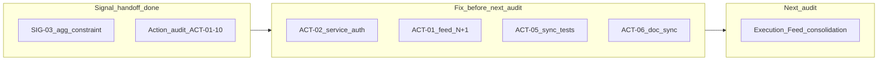

# Action Domain — Audit Consolidation

Status: consolidation report  
Date: 2026-06-24  
Mode: audit only — no source changes

## Sources

| Audit | File | Findings |
|-------|------|----------|
| Action domain | [`action_audit.md`](./action_audit.md) | ACT-01–ACT-10 |
| Signal + Signal feed (context) | [`signal_feed_audit.md`](./signal_feed_audit.md) | SIG-01–SIG-10 |
| Signal consolidation (prior) | [`signal_feed_consolidation.md`](./signal_feed_consolidation.md) | fix-now / defer / product gates |

**Branch context:** Signal pre-audit quick fixes (SIG-05, SIG-07, SIG-08) and SIG-03 aggregation constraint (`signal_unique_active_aggregation_key`) appear implemented on the current branch — verify before relying on them in production. Action audit treats SIG-03 as done for handoff purposes at `sync_signal_after_action_change` / linked Action surfaces.

---

## 1. Audit read

### Action domain audit (2026-06-24)

Audited `houston/actions/` end-to-end: linked vs free create, multi-assignee lifecycle, `accepted_by` / `requires_validation`, RBAC and permission hints, execution feed projection, Signal coupling (`sync_signal_after_action_change`, resolve guard), notifications/realtime, and frontend `features/actions/` + `features/execution/`.

**Findings:** 0 P0, 2 P1, 6 P2, 2 P3 (ACT-01–ACT-10).

**Strengths (no action):** Action domain is well-bounded in `actions/` with thin views and dedicated transition services + `select_for_update`. Linked/free invariants enforced at create. RBAC matrix well-tested (`test_action_permissions.py`, execution feed visibility tests). Realtime invalidation thoroughly tested (`test_action_invalidation.py`). Frontend uses generated OpenAPI types; mutation invalidation covers actions + signals.

**Main risk themes:** Execution feed permission-hint N+1 (ACT-01); service-layer auth gap on mark-done/validate (ACT-02); reassign/due-at API without UI (ACT-03); linked Signal realtime stale on terminal sync (ACT-04); mixed linked-action signal sync untested (ACT-05); doc drift on assignee model (ACT-06); no Action tenant isolation API suite (ACT-07).

### Signal consolidation (prior handoff)

The signal consolidation recommended **Actions + Execution feed** as the next audit after signal quick fixes. That audit is now complete. Open Signal **product** items (SIG-01 detail scope, SIG-02 feed vs actionability) remain unresolved — not blockers for Action backend fixes but relevant when auditing Execution Feed RBAC parity.

| Prior signal item | Status (verify on branch) |
|-------------------|---------------------------|
| SIG-05 permission helper alignment | Likely done |
| SIG-07 realtime lifecycle tests | Likely done |
| SIG-08 `feed_domain.md` feed-visible statuses | Likely done |
| SIG-03 aggregation DB guard | Done (`0006_signal_unique_active_aggregation_key`) |
| SIG-01, SIG-02 feed vs detail RBAC | **Open** (product decision) |
| OB-03 frontend wizard component tests | **Open** (defer from prior consolidation) |



---

## 2. Findings to fix now

**Criteria:** P0/P1 or high-ROI **S-sized** fixes that do **not** require product sign-off.

| ID | Severity | Size | Action | Tests |
|----|----------|------|--------|-------|
| **ACT-02** | P1 | S | Pass `actor_membership` into `mark_action_done` and `validate_action`; assert `can_mark_action_done` / `can_validate_action_on_object` inside [`actions/services.py`](../../apps/api/houston/actions/services.py); update [`actions/api/views.py`](../../apps/api/houston/actions/api/views.py) callers | Service tests: non-`accepted_by` assignee cannot mark done; staff cannot validate via service |
| **ACT-01** | P1 | S (core) | Make `is_action_assignee()` prefetch-aware in [`actions/permissions.py`](../../apps/api/houston/actions/permissions.py) — use `action.assignee_links` when prefetched instead of per-row `.exists()` | Optional same PR: populated feed query ceiling (ACT-09) |
| **ACT-05** | P2 | S | Add mixed linked-action cases for `sync_signal_after_action_change` in [`actions/tests/test_action_services.py`](../../apps/api/houston/actions/tests/test_action_services.py) | done + canceled → resolve signal; all canceled → OPEN + unpin |
| **ACT-06** | P2 | S | Doc-only: replace `assigned_to` with assignee semantics in [`feed_domain.md`](../product/domains/feed_domain.md) §139; update [`action_domain.md`](../product/domains/action_domain.md) §3 — frontend implemented, gaps documented (reassign, due-at, proof) | None — behavior covered by existing API tests |

**Optional stretch (bundle with ACT-01 if time):**

| ID | Severity | Size | Action | Tests |
|----|----------|------|--------|-------|
| **ACT-09** | P3 | S | Extend `test_execution_feed_query_count_*` in [`test_execution_feed_api.py`](../../apps/api/houston/actions/tests/test_execution_feed_api.py) with seeded actions after ACT-01 | Set realistic `EXECUTION_FEED_*_MAX_QUERIES` in query baseline |

**Explicitly not in fix-now** (blocked on product or M-sized): ACT-03, ACT-04, ACT-07, ACT-08.

---

## 3. Findings needing product decision

| ID | Question | Options | Default recommendation |
|----|----------|---------|------------------------|
| **ACT-03** | Ship reassign + due-at UI now or defer? | Both in detail footer vs reassign-only vs document deferral | **Reassign first** (higher ops value); due-at second; document gaps in `action_domain.md` if waiting |
| **ACT-04** | Emit `signal.updated` when `sync_signal_after_action_change` mutates Signal? | Backend emit in sync helper vs frontend always invalidate signals on action WS events | **Yes — backend emit** (or schedule `signal.updated` invalidation); fixes WS-only stale signal when another user cancels last linked action |
| **ACT-08** | Multi-assignee UX: keep accept-race model? | Single assignee only vs keep model + surface `accepted_by` | **Keep backend model**; minimally show `accepted_by` on feed cards |
| **§4 (action audit)** | `requires_validation` immutable after create? | Create-time only vs manager toggle before mark-done | **Create-time only** for MVP |
| **§4** | Terminal action visibility (`done`/`canceled`)? | Detail-only vs future history section | **Detail-only** for MVP |
| **§4** | Proof / evidence on Actions? | Defer vs Observation-style media | **Defer** — no backend API today |
| **SIG-01** | Signal detail wider than Ma zone scope? | Enforce scope vs deep-link model | **(B) document** — from signal consolidation; affects cross-surface navigation |
| **SIG-02** | Feed scope vs command actionability BU rules? | Responsible-only feed vs affected ∪ responsible visibility | **(B) keep visibility, read-only commands** — Execution Feed audit should check Action parity |

**Tests to add after product decides:**

| ID | Test |
|----|------|
| ACT-03 | Component tests for hint-gated reassign/due-at buttons; integration reassign flow |
| ACT-04 | Realtime test: `sync_signal_after_action_change` emits `signal.updated` when Signal status changes |
| ACT-08 | Frontend display tests for `accepted_by` on feed cards |
| SIG-01 | API: scoped Manager/Staff reads resolved signal outside personal scope — 200 or 404 per decision |
| SIG-02 | API: manager affected-only scope — feed 200, commands 403; hints false on detail |

---

## 4. Findings to defer

| ID | Size | Source | Rationale |
|----|------|--------|-----------|
| **ACT-03** | M | Action audit | Full detail UI — assignee picker + due-at edit; hooks exist, no components |
| **ACT-04** | S–M | Action audit | Cross-domain realtime contract — blocked until product picks invalidation strategy |
| **ACT-07** | M | Action audit | Parametrized Action tenant isolation API suite — valuable, not blocking next audit |
| **ACT-08** | S | Action audit | Multi-assignee UX polish after product sign-off |
| **ACT-10** | S | Action audit | Dead `ActionPermissionError` in `exceptions.py` — cleanup when touching exceptions |
| **SIG-01, SIG-02** | M | Signal consolidation | Feed vs detail RBAC — product decisions pending |
| **OB-03** | M | Prior consolidation | Frontend onboarding wizard component tests |

---

## 5. Findings to ignore for now

- Dual frontend status label maps (`STATUS_LABELS` vs `EXECUTION_FEED_STATUS_LABELS` in `action-display.ts`) — presentation-only
- `ActionDetailCommentsDisabledSection` unused component — cleanup when touching detail page
- Execution feed cursor `as_of` drift between pages — documented tradeoff in `execution_feed_cursor.py`
- Director role explicit tests — covered by `ADMIN_ROLES` parity with Owner
- DB-level action status transition constraints — Python-only enforcement acceptable in dev phase
- Proof/evidence placeholder on detail page — no backend API
- Broad TanStack Query prefix invalidation (`invalidateActionMutationSurfaces`) — works at MVP scale
- **ACT-09** alone without **ACT-01** — query budget on broken N+1 path is misleading; bundle or skip until ACT-01 lands

---

## 6. Recommended next audit

**Primary: Execution Feed consolidation** (Actions + Checklists polymorphic feed)

Scope:

- [`actions/execution_feed.py`](../../apps/api/houston/actions/execution_feed.py) — checklist-first pagination merge
- Checklist domain visibility rules vs Action rules in `general` view ([`checklist_domain.md`](../product/domains/checklist_domain.md) §9)
- [`execution_feed_cursor.py`](../../apps/api/houston/actions/execution_feed_cursor.py) — mixed cursor stability
- Frontend [`execution-action-sections.ts`](../../apps/web/src/features/execution/lib/execution-action-sections.ts) — client-side status bucketing (unknown statuses dropped)
- Cross-domain: SIG-02 feed-vs-action asymmetry may repeat for Manager scope

Rationale:

- Execution feed is the primary operational surface combining Actions and Checklists
- Action audit flagged feed N+1 and empty-only query budget — fixes should land before or during this audit
- Polymorphic pagination and visibility rules are the highest structural risk as Houston scales

**Secondary (after Execution Feed):** Notifications matrix for action lifecycle events (`action.created`, `action.pending_validation`, `action.reassigned`) vs [`notification_matrix_v0.2.md`](../product/notification_matrix_v0.2.md).

---

## 7. Short Cursor implementation prompt

```
Implement pre–Execution-Feed-audit Action quick fixes only. No product RBAC or frontend UI changes.

1. ACT-02: Add actor_membership to mark_action_done and validate_action; enforce
   can_mark_action_done / can_validate_action_on_object in houston/actions/services.py;
   update api/views.py callers and all tests (service + API + realtime if callers change).

2. ACT-01: Make is_action_assignee prefetch-aware in houston/actions/permissions.py
   (use action.assignee_links when prefetched, else DB query).

3. ACT-05: Add test_action_services.py cases for sync_signal_after_action_change:
   - two linked actions (one done, one canceled) → signal resolves
   - all linked actions canceled → signal reopens to OPEN and unpins

4. ACT-06: Doc-only —
   - docs/product/domains/feed_domain.md §139: assigned_to → assignee / assignee_ids semantics
   - docs/product/domains/action_domain.md §3: frontend Phase 2 implemented; document gaps
     (reassign UI, due-at UI, proof placeholder)

Optional: ACT-09 populated execution-feed query count baseline after ACT-01.

Do NOT ship reassign/due-at UI (ACT-03) or signal.updated invalidation (ACT-04) without product approval.
Do NOT add tenant isolation suite (ACT-07) in this pass unless explicitly requested.

Validate: make backend-test on houston/actions/tests/ and realtime/tests/test_action_invalidation.py
if services change.
```

---

## Summary

| Metric | Count |
|--------|-------|
| Source audits referenced | 3 (action + signal audit + signal consolidation) |
| Action audit findings | 10 (0 P0, 2 P1) |
| Fix now (no product gate) | 4 (ACT-02, ACT-01, ACT-05, ACT-06) — **done on branch** |
| Phase 2 shipped | 2 (ACT-07, ACT-08 minimal) |
| Optional stretch | 1 (ACT-09) — **done on branch** |
| Product decisions pending | 8 (ACT-03, ACT-04, ACT-08, §4 items, SIG-01, SIG-02) |
| Defer | 7 |
| Ignore | 8 |

**Top 3 before Execution Feed audit:**

1. **ACT-02** — Service-layer auth on mark-done/validate (S, security).
2. **ACT-01** — Feed N+1 fix via prefetch-aware `is_action_assignee` (S core).
3. **ACT-05 + ACT-06** — Signal sync regression tests + doc sync (S).

---

## Changed

- Created `docs/audits/action_consolidation.md`.

## Validated

- Consolidation derived from [`action_audit.md`](./action_audit.md), [`signal_feed_audit.md`](./signal_feed_audit.md), and [`signal_feed_consolidation.md`](./signal_feed_consolidation.md); no application source code modified.
- ACT-01–ACT-10 IDs and file paths cross-checked against `action_audit.md`.
- SIG-03 migration presence verified on branch (`signals/migrations/0006_signal_unique_active_aggregation_key.py`).

## Risks / not verified

- `make backend-test` / `make verify` not executed for this consolidation pass.
- Product confirmation of ACT-03, ACT-04, ACT-08, SIG-01, SIG-02 not obtained.
- SIG-05, SIG-07, SIG-08 implementation status assumed from branch context — not re-verified file-by-file in this pass.

---

## 8. Phase 2 status (2026-06-24)

**Context:** Quick fixes (ACT-01, ACT-02, ACT-05, ACT-06, ACT-09) landed on branch before Phase 2.

| ID | Phase 2 outcome | Evidence |
|----|-----------------|----------|
| **ACT-07** | **Done** | [`test_action_tenant_isolation_api.py`](../../apps/api/houston/actions/tests/test_action_tenant_isolation_api.py) — detail, parametrized commands, reassign, due-at, execution-feed visibility, in-progress cross-tenant mark-done |
| **ACT-08** | **Partial (minimal)** | Classic feed card footer uses `resolveActionFeedFooterDisplay` — `accepted_by` > `assignees` > creator; component + display tests |
| **ACT-10** | **Closed** | `ActionPermissionError` used after ACT-02 — no cleanup needed |
| **ACT-03** | **Deferred** | Backend + hooks exist; detail UI still missing reassign/due-at |
| **ACT-04** | **Deferred** | Hand off to Execution Feed consolidation audit |

**Phase 2 files changed:**

- Backend: `houston/actions/tests/test_action_tenant_isolation_api.py` (new)
- Frontend: `execution-action-card.tsx`, `action-display.ts`, `execution-action-card.test.tsx`, `action-display.test.ts`

**OpenAPI / types:** No contract changes in Phase 2.

**Next audit:** Execution Feed consolidation — include ACT-04 (`signal.updated` on terminal `sync_signal_after_action_change`), SIG-02 feed-vs-command RBAC parity, polymorphic pagination (`execution_feed.py`, `execution_feed_cursor.py`), checklist visibility rules.
