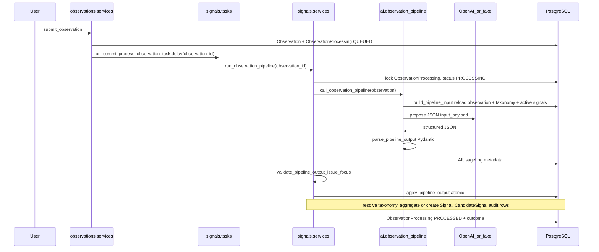

# AI Pipeline Orchestration Audit

Status: audit report  
Date: 2026-06-24  
Domain: AI pipeline orchestration and AI-to-Signal handoff

---

## 1. Files inspected

**AI module**

- `apps/api/houston/ai/observation_pipeline.py` — provider call, prompt, input build, parse, usage logging
- `apps/api/houston/ai/observation_pipeline_schema.py` — Pydantic output models
- `apps/api/houston/ai/observation_pipeline_provider_schema.py` — OpenAI strict JSON schema
- `apps/api/houston/ai/observation_pipeline_diagnostics.py` — safe `AIUsageLog.error_context` sanitization
- `apps/api/houston/ai/transcription.py` — audio-to-text (pre-submit boundary)
- `apps/api/houston/ai/models.py` — `AIUsageLog`

**Signals (orchestration + handoff)**

- `apps/api/houston/signals/services.py` — `run_observation_pipeline`, `apply_pipeline_output`, aggregation, recovery
- `apps/api/houston/signals/tasks.py` — `process_observation_task`, `recover_stuck_observation_processing_task`
- `apps/api/houston/signals/constants.py` — pipeline version constants, limits
- `apps/api/houston/signals/classification_fallback.py` — responsible=affected fallback
- `apps/api/houston/signals/signal_classification.py` — transversal routing validation
- `apps/api/houston/signals/selectors.py` — `active_signals_for_establishment`
- `apps/api/houston/signals/models.py` — `Signal`, `CandidateSignal`, `SignalSourceObservation`

**Observations (submit + processing state)**

- `apps/api/houston/observations/services.py` — `submit_observation`, enqueue
- `apps/api/houston/observations/models.py` — `Observation`, `ObservationProcessing`
- `apps/api/houston/observations/selectors.py` — processing status projection

**Core / config**

- `apps/api/houston/core/observability.py` — pipeline log context allowlists
- `apps/api/config/settings.py` — Celery beat stuck-recovery schedule, AI timeouts

---

## 2. Tests inspected

**AI**

- `apps/api/houston/ai/tests/test_observation_pipeline_provider.py`
- `apps/api/houston/ai/tests/test_observation_pipeline_schema.py`
- `apps/api/houston/ai/tests/test_observation_pipeline_prompt.py`
- `apps/api/houston/ai/tests/test_observation_pipeline_diagnostics.py`
- `apps/api/houston/ai/tests/test_observation_pipeline_input_queries.py`
- `apps/api/houston/ai/tests/test_observation_pipeline_provider_schema.py`
- `apps/api/houston/ai/tests/test_usage_log.py`

**Signals / pipeline**

- `apps/api/houston/signals/tests/test_pipeline_v4_golden.py`
- `apps/api/houston/signals/tests/test_pipeline_validation.py`
- `apps/api/houston/signals/tests/test_observation_pipeline_recovery.py`
- `apps/api/houston/signals/tests/test_observation_pipeline_observability.py`
- `apps/api/houston/signals/tests/test_import_graph.py`
- `apps/api/houston/signals/tests/test_golden_observation_split.py`
- `apps/api/houston/signals/tests/test_legacy_issue_focus_aggregation.py`
- `apps/api/houston/signals/tests/test_openai_observation_pipeline_v4_corpus_smoke.py` (gated)

**Observations**

- `apps/api/houston/observations/tests/test_submit_on_commit_enqueue.py`
- `apps/api/houston/observations/tests/test_processing_status_selectors.py`

**Golden corpus**

- `apps/api/houston/testing/pipeline_golden_v4_corpus.json` (referenced by golden tests)

---

## 3. Docs / rules inspected

- `AGENTS.md`, `apps/api/AGENTS.md`
- `docs/product/domains/ai_domain.md`
- `docs/product/domains/ai_observation_pipeline_contract.md`
- `docs/product/domains/observation_domain.md`
- `docs/product/domains/signal_domain.md`
- `docs/audits/backend_core_architecture.md` (finding F2 — split-brain ownership)
- `docs/audits/global_architecture_mapping.md` (finding R7 — AI pipeline complexity)
- `.cursor/rules/10-backend-django-drf.mdc` (Celery: pass IDs, reload, idempotence)

**Prior audit note:** `docs/audits/03_observation_audit.md` does **not** exist. This report cross-references `backend_core_architecture.md` F2 and `global_architecture_mapping.md` R7 for related ownership and scalability context.

---

## 4. Assumptions and unknowns

- OpenAI provider retention / training policies are not validated in-repo; `validated_text` is sent to the configured external provider by design.
- Production volume, token costs, and stuck-recovery incident rates were not measured; performance findings are structural.
- Celery beat (`recover-stuck-observation-processing`) is assumed enabled in deployed environments per `settings.py`; not verified in infra config here.
- Transcription (`ai/transcription.py`) is adjacent to the pipeline but out of scope except as pre-submit text source.

---

## 5. Current AI pipeline flow

### Stage summary

| Stage | Module | Function | Notes |
|-------|--------|----------|-------|
| Submit | `observations` | `submit_observation` | Creates `Observation` + `ObservationProcessing` (QUEUED) |
| Enqueue | `observations` | `_enqueue_observation_processing` | `on_commit` → `process_observation_task.delay(str(observation_id))` |
| Task | `signals` | `process_observation_task` | Passes **observation_id only**; reloads in service |
| Lock + state | `signals` | `run_observation_pipeline` | `select_for_update`; QUEUED/RETRYING → PROCESSING |
| Input build | `ai` | `build_pipeline_input` | Re-fetches observation; taxonomy snapshot; up to 20 active signals |
| Provider | `ai` | `call_observation_pipeline` → `OpenAIObservationPipelineProvider.propose` | System prompt + JSON user payload; strict JSON schema |
| Parse | `ai` | `parse_pipeline_output` | Pydantic `ObservationPipelineOutput` |
| Usage log | `ai` | `_write_usage_log` | Metadata only; sanitized `error_context` on failure |
| Business validate | `signals` | `validate_pipeline_output_issue_focus`, `resolve_taxonomy_from_candidate` | Issue focus, BU/AS keys, classification rules |
| Apply | `signals` | `apply_pipeline_output` | Create / aggregate Signal; `CandidateSignal` audit trail |
| Recovery | `signals` | `recover_stuck_observation_processing_batch` | Beat task; stuck PROCESSING → RETRYING or FAILED |

**Pipeline version:** `ai_observation_pipeline_v4` (prompt + schema).

---

## 6. Ownership and boundary assessment

### Q1 — Who owns the pipeline?

**De facto: `signals` owns orchestration; `ai` owns the provider adapter; `observations` owns submit and processing state.**

| Concern | Owner in code | Evidence |
|---------|---------------|----------|
| Celery task | `signals` | `signals/tasks.py` — `process_observation_task` |
| Orchestration + apply | `signals` | `signals/services.py` — `run_observation_pipeline`, `apply_pipeline_output`, `create_signal_from_candidate`, `aggregate_candidate_into_signal` |
| Provider I/O + prompt | `ai` | `ai/observation_pipeline.py` |
| Processing state model | `observations` | `ObservationProcessing` in `observations/models.py` |
| Version constants | `signals` | `signals/constants.py` — `AI_OBSERVATION_PIPELINE_*_VERSION` |
| Enqueue trigger | `observations` → `signals` | `observations/services.py` imports `signals.tasks` |

Product docs (`ai_domain.md`) state AI proposes and backend validates. Validation and persistence live in `signals`, not `ai`. That matches the product boundary but is **not documented** in `apps/api/AGENTS.md`, and duplicates the concern raised in [`backend_core_architecture.md` F2](backend_core_architecture.md).

### Q2 — Is Observation → AI → Signal explicit and maintainable?

**Partially yes.**

**Strengths**

- Clear staged handoff: enqueue → lock → AI call → validate → atomic apply.
- Contract doc [`ai_observation_pipeline_contract.md`](../product/domains/ai_observation_pipeline_contract.md) aligns with v4 implementation (`issue_focus`, aggregation rules, golden corpus G01–G11).
- `CandidateSignal` rows provide an audit trail per candidate outcome.
- Import smoke test: `signals/tests/test_import_graph.py`.

**Weaknesses**

- Cross-app imports: `observations` → `signals.tasks`; `ai` → `signals.constants`, `signals.selectors.active_signals_for_establishment`.
- ~400 LOC of pipeline orchestration inside an already large `signals/services.py`.
- No dedicated pipeline module or documented ownership rule in backend AGENTS.

---

## 7. Failure / retry / idempotence risks

### Q3 — Can retries create duplicate signals or inconsistent state?

**Mostly safe for completed runs; material gaps for orphaned and divergent retries.**

| Mechanism | Behavior | Risk level |
|-----------|----------|------------|
| `PROCESSED` guard | Second `run_observation_pipeline` is a no-op | Low — tested in `test_double_pipeline_on_processed_is_noop` |
| Atomic apply | `apply_pipeline_output` is one `@transaction.atomic` with status update | Low — all-or-nothing per attempt |
| In-batch dedupe | `seen_keys` rejects duplicate aggregation keys within one output | Low |
| Aggregation | `find_active_signal_for_aggregation` + hint validation merge instead of duplicate create | Low when keys stable |
| Provider retry | Celery `max_retries=3` on timeout/unavailable; `_mark_processing_retry_or_failed` | Medium — **re-calls LLM**; non-idempotent |
| Stuck recovery | Beat sets `RETRYING` but **does not re-enqueue** task | **High** — stranded observations |
| Divergent LLM output | Retry after failed apply or different model response | Medium — second Signal if aggregation key differs |

**Celery retry path** (`signals/tasks.py`): on `ObservationPipelineUnavailableError` / `ObservationPipelineTimeoutError`, retries only when `processing.status == RETRYING`. No integration test covers this end-to-end.

**Stuck recovery gap** (`signals/services.py` — `recover_stuck_observation_processing_batch`, `_try_recover_stuck_processing`): moves stuck `PROCESSING` → `RETRYING` but never calls `process_observation_task.delay()`. The only enqueue site is `observations/services.py` on initial submit. If the worker dies after recovery marks `RETRYING`, the observation can remain unprocessed until manual intervention.

**Attempt budget:** `_MAX_OBSERVATION_PIPELINE_ATTEMPTS = 3`; `attempt_count` incremented when entering `PROCESSING`.

---

## 8. Sensitive data exposure risks

### Q5 — Are sensitive inputs/outputs protected?

**Application logs and usage logs: strong.**

- `core/observability.py` — pipeline log builders exclude `raw_text` / `validated_text` from standard fields.
- `observation_pipeline_diagnostics.py` — `sanitize_observation_pipeline_error_context` strips sensitive fragments; caps size.
- Tests assert observation text never appears in logs or `AIUsageLog.error_context` (`test_observation_pipeline_observability.py`, `test_openai_provider_invalid_payload_writes_safe_error_context`).

**External provider: inherent exposure (by design).**

- `build_pipeline_input` sets `"validated_text": observation.raw_text`.
- `OpenAIObservationPipelineProvider.propose` JSON-serializes the full input into the user message.
- Required for semantic analysis; must be treated as sub-processor / DPA boundary, not a logging defect.

**Residual operational metadata in logs and DB**

- `issue_focus`, `structured_summary`, `title` in `CandidateSignal` and apply logs.
- `active_signals_context` includes titles and summaries of up to 20 active signals sent to the provider each call.

**Celery task compliance:** passes `observation_id` only; observation reloaded from DB in `run_observation_pipeline` / `build_pipeline_input`. Aligns with `apps/api/AGENTS.md` async rules.

---

## 9. Signal handoff risks

### Q4 — Is AI output validated before becoming business state?

**Yes — layered validation before any `Signal` row is created.**

1. **Provider:** OpenAI `json_schema` strict (`observation_pipeline_provider_schema.py`).
2. **Parse:** Pydantic `ObservationPipelineOutput` — `extra=forbid`, max 5 candidates, field length limits.
3. **Post-parse:** `validate_pipeline_output_issue_focus` — normalized non-empty `issue_focus`.
4. **Taxonomy:** `resolve_taxonomy_from_candidate` — active BU/AS keys, `validate_signal_classification`, explicit `try_apply_responsible_affected_fallback`.
5. **Aggregation:** `_try_resolve_hint_signal` — hint UUID, taxonomy match, `issue_focus` match; else `find_active_signal_for_aggregation` on `(affected, responsible, subject, unit, issue_focus)`.
6. **Rejection path:** invalid taxonomy → `CandidateSignal.REJECTED`; no Signal created.

**Handoff gaps**

| Gap | Impact |
|-----|--------|
| Pydantic `schema_version` is plain `str` | Wrong version accepted if fake/non-OpenAI provider bypasses const |
| Partial candidate rejection within batch | Valid candidates become Signals; invalid ones REJECTED — correct product behavior but mixed outcome |
| `NOT_ACTIONABLE` outcome never set | Model/docs drift; only `no_signal_created` used for empty candidates |
| No pipeline domain events | No `ObservationPipelineStarted` / `Failed` events despite candidate list in `ai_domain.md` |

**Notification side effect:** `create_signal_from_candidate` schedules `schedule_signal_created_notification` inside the apply transaction path — handoff to notifications is synchronous with signal creation.

---

## 10. Scalability pressure (Q6)

What will become painful as AI processing volume grows:

- **Serial Celery tasks** — one task per observation; no batching.
- **Prompt size** — large French system prompt (~100 lines) on every call; full establishment taxonomy snapshot; up to `MAX_ACTIVE_SIGNALS_CONTEXT` (20) signals with title + `structured_summary` in input.
- **Cost / latency** — OpenAI chat completion per observation; `input_payload_bytes` logged but no budget enforcement.
- **Query load** — `build_pipeline_input` baseline capped at 8 queries (`test_observation_pipeline_input_queries.py`); payload bytes still grow with establishment size.
- **Ownership friction** — provider swaps, retry policy, and context trimming require coordinated edits across `ai` and `signals`.

See also [`global_architecture_mapping.md` R7](global_architecture_mapping.md).

---

## 11. Top findings (max 10)

### F1 — Split pipeline ownership across `signals` and `ai`

- **Severity:** P1
- **Category:** structure / ambiguity
- **Evidence:** Orchestration in `signals/services.py` (`run_observation_pipeline`, `apply_pipeline_output`); provider in `ai/observation_pipeline.py`; Celery task in `signals/tasks.py`; version constants in `signals/constants.py`
- **Problem:** No single module owns the Observation → Signal workflow; `ai` depends on `signals` for context and constants while `signals` depends on `ai` for provider I/O.
- **Why it matters now:** Every pipeline change requires context in two apps.
- **Why it will hurt later:** New providers, pipeline stages, or retry policies multiply coupling and onboarding cost.
- **Recommended fix:** Document explicit ownership in `apps/api/AGENTS.md`, or extract a thin `pipeline` orchestrator (option A: `ai` orchestrates, `signals` applies; option B: keep `signals` as owner, slim `ai` to pure adapter). See `backend_core_architecture.md` F2.
- **Tests to add/update:** Extend `signals/tests/test_import_graph.py` with documented allowed cross-imports.
- **Suggested implementation size:** M

### F2 — Stuck recovery marks `RETRYING` without re-enqueueing Celery

- **Severity:** P1
- **Category:** ambiguity / tests
- **Evidence:** `signals/services.py` — `recover_stuck_observation_processing_batch`, `_try_recover_stuck_processing` sets `RETRYING`; only enqueue in `observations/services.py` `_enqueue_observation_processing`; beat schedule in `config/settings.py`
- **Problem:** Worker death after stuck recovery can leave observations in `RETRYING` forever with no automatic re-run.
- **Why it matters now:** Users see perpetual “analysis in progress” / retry UX with no completion.
- **Why it will hurt later:** More workers and restarts increase orphan rate.
- **Recommended fix:** After moving a row to `RETRYING`, call `process_observation_task.delay(str(observation_id))` (idempotent given status guards).
- **Tests to add/update:** `test_recovery_sweep_re_enqueues_pipeline_task` — assert `delay` called after batch recovery.
- **Suggested implementation size:** S

### F3 — Provider retry path untested; AI calls not idempotent

- **Severity:** P1
- **Category:** tests / idempotence
- **Evidence:** `signals/tasks.py` — Celery retry on timeout/unavailable when `RETRYING`; no test named for retry; `call_observation_pipeline` invoked on each attempt
- **Problem:** Retries re-invoke the LLM; divergent output can create a second Signal if aggregation keys differ from the first attempt.
- **Why it matters now:** Transient provider failures are expected in production.
- **Why it will hurt later:** Higher volume increases duplicate-signal and cost risk.
- **Recommended fix:** Add integration test: mock timeout → `RETRYING` → Celery retry → success, assert single Signal set; consider persisting parsed output before apply for retry reuse (larger change).
- **Tests to add/update:** Celery retry integration test; optional duplicate-signal guard test on retry with stable keys.
- **Suggested implementation size:** S (test only) / M (persisted intermediate output)

### F4 — Inverted enqueue dependency (`observations` → `signals.tasks`)

- **Severity:** P2
- **Category:** structure
- **Evidence:** `observations/services.py` — `_enqueue_observation_processing` imports `houston.signals.tasks.process_observation_task`
- **Problem:** Observation submit domain depends on Signal app for async processing entry point.
- **Why it matters now:** Violates intuitive domain layering (observations should not import signals for core submit flow).
- **Why it will hurt later:** Harder to extract pipeline or run observations without signals app loaded.
- **Recommended fix:** Move task to `observations/tasks.py` or shared `pipeline/tasks.py` that delegates to `run_observation_pipeline`; or document as intentional coupling.
- **Tests to add/update:** `test_submit_on_commit_enqueue.py` — update import path if moved.
- **Suggested implementation size:** S

### F5 — `schema_version` not enforced in Pydantic parse

- **Severity:** P2
- **Category:** API contract
- **Evidence:** `ai/observation_pipeline_schema.py` — `schema_version: str`; OpenAI const only in `observation_pipeline_provider_schema.py`
- **Problem:** Fake or future providers can return wrong schema version; backend accepts it if shape matches.
- **Why it matters now:** Test provider and eval tooling bypass OpenAI const.
- **Why it will hurt later:** Version migrations become ambiguous in persisted `CandidateSignal.schema_version`.
- **Recommended fix:** Use `Literal[AI_OBSERVATION_PIPELINE_SCHEMA_VERSION]` or explicit equality check in `parse_pipeline_output`.
- **Tests to add/update:** `test_rejects_wrong_schema_version` in `test_observation_pipeline_schema.py`.
- **Suggested implementation size:** S

### F6 — Prompt payload scales with full taxonomy and signal summaries

- **Severity:** P2
- **Category:** performance / scalability
- **Evidence:** `ai/observation_pipeline.py` — `build_pipeline_input`, `_build_active_signals_context`; `MAX_ACTIVE_SIGNALS_CONTEXT = 20`; `input_payload_bytes` logged
- **Problem:** Every observation sends full runtime taxonomy plus up to 20 active signal titles/summaries; large system prompt always attached.
- **Why it matters now:** Acceptable at dev volume.
- **Why it will hurt later:** Token cost and latency grow superlinearly with establishment size and open signal count.
- **Recommended fix:** Trim `active_signals_context` to aggregation-relevant fields (keys + `issue_focus` + `signal_id`); cache taxonomy snapshot per establishment with TTL; monitor `input_payload_bytes` p95.
- **Tests to add/update:** Payload size budget test per fixture establishment size.
- **Suggested implementation size:** M

### F7 — `validated_text` sent to external LLM (sub-processor boundary)

- **Severity:** P2
- **Category:** security
- **Evidence:** `ai/observation_pipeline.py` — `build_pipeline_input` L133; `OpenAIObservationPipelineProvider.propose` L243
- **Problem:** Raw observation text leaves the Houston trust boundary to the configured provider on every pipeline call.
- **Why it matters now:** Required for MVP semantic structuring; must be explicit in security/RGPD docs and customer-facing posture.
- **Why it will hurt later:** Compliance review without documented sub-processor mapping blocks enterprise adoption.
- **Recommended fix:** Document in security domain; ensure DPA / data-minimization narrative; avoid expanding context beyond contract.
- **Tests to add/update:** None in code; doc + compliance checklist.
- **Suggested implementation size:** S (documentation)

### F8 — `NOT_ACTIONABLE` outcome never set

- **Severity:** P2
- **Category:** maintainability / ambiguity
- **Evidence:** `observations/models.py` — `ObservationProcessing.Outcome.NOT_ACTIONABLE`; grep shows no assignment in services; contract lists `not_actionable` in `ai_observation_pipeline_contract.md`
- **Problem:** Dead outcome enum value; docs imply a path that code does not implement.
- **Why it matters now:** Confuses processing status API consumers and support tooling.
- **Why it will hurt later:** Product may want explicit “declined to propose” distinct from `no_signal_created`.
- **Recommended fix:** Remove from model/docs or implement when AI explicitly declines (distinct from empty `candidates`).
- **Tests to add/update:** Processing status selector test for chosen behavior.
- **Suggested implementation size:** S

### F9 — AI pipeline events documented but not implemented

- **Severity:** P3
- **Category:** ambiguity
- **Evidence:** `ai_domain.md` §8 — candidate events `ObservationPipelineStarted`, `ObservationPipelineSucceeded`, etc.; no emitters in `ai/` or `signals/services.py`
- **Problem:** Event-driven observability and notification matrix cannot rely on pipeline events today.
- **Why it matters now:** Logging substitutes (`observation_pipeline_*` structured logs).
- **Why it will hurt later:** Adding events retroactively requires backfilling consumers and ordering guarantees.
- **Recommended fix:** Mark docs as “not implemented” or add minimal after-commit events at orchestration boundaries.
- **Tests to add/update:** Event emission tests when implemented.
- **Suggested implementation size:** M

### F10 — `AIUsageLog.Domain.ONBOARDING` lingers after product removal

- **Severity:** P3
- **Category:** maintainability
- **Evidence:** `ai/models.py` — `Domain.ONBOARDING`; `ai_domain.md` — “AI onboarding permanently removed”
- **Problem:** Stale enum and FK fields (`onboarding_session`, `onboarding_proposal`) increase schema noise.
- **Why it matters now:** Low runtime impact.
- **Why it will hurt later:** New contributors assume onboarding AI still exists.
- **Recommended fix:** Deprecation migration or doc comment on model; align `ai_domain.md` object list.
- **Tests to add/update:** None urgent.
- **Suggested implementation size:** S

### Positive findings (no action required)

- Golden corpus G01–G11 green via `test_pipeline_v4_golden.py`.
- Safe failure diagnostics and log sanitization with dedicated tests.
- Fake provider default under pytest; OpenAI gated by markers.
- `select_for_update` on processing lock and aggregation targets.
- `PROCESSED` idempotence tested.
- OpenAI strict JSON schema enforced at provider level.
- Query baseline for input build (≤ 8 queries).

---

## 12. Fix now vs later

### Fix now (S–M)

| Finding | Action |
|---------|--------|
| F2 | Re-enqueue `process_observation_task` after stuck recovery → `RETRYING` |
| F3 | Celery timeout retry integration test |
| F5 | Harden `schema_version` in Pydantic |

### Plan later (M–L)

| Finding | Action |
|---------|--------|
| F1 / F4 | Document or refactor pipeline ownership and enqueue location |
| F6 | Trim context payload; taxonomy caching |
| F8 | Remove or implement `NOT_ACTIONABLE` |
| F9 / F10 | Align events and model enums with product surface |

### Not worth fixing now

- Provider management UI, BYOK, multi-provider routing.
- Fuzzy `issue_focus` matching (explicitly rejected in v4 contract).
- Full event sourcing of pipeline state.

---

## 13. Tests required (recommended additions)

| Test | Targets | Finding |
|------|---------|---------|
| `test_recovery_sweep_re_enqueues_pipeline_task` | Beat recovery calls `process_observation_task.delay` | F2 |
| `test_celery_retry_after_provider_timeout_completes_without_duplicate_signals` | Timeout → RETRYING → retry → one Signal | F3 |
| `test_rejects_wrong_schema_version` | Pydantic parse rejects unknown version | F5 |
| `test_retry_aggregates_instead_of_duplicating_when_keys_match` | Second LLM output with same keys aggregates | F3 |
| `test_input_payload_bytes_budget_large_establishment` | Guardrail on context size | F6 |

**Existing coverage to preserve:** `test_pipeline_v4_golden.py`, `test_observation_pipeline_recovery.py`, `test_pipeline_validation.py`, `test_observation_pipeline_provider.py`, `test_observation_pipeline_diagnostics.py`, `test_observation_pipeline_observability.py`.

---

## 14. Suggested implementation order

1. **F2** — Stuck recovery re-enqueue (unblocks stranded observations).
2. **F3 + F5** — Retry integration test + `schema_version` hardening.
3. **F1 / F4** — Ownership documentation in `apps/api/AGENTS.md` (no code move required initially).
4. **F6** — Context trimming when volume metrics justify.
5. **F8, F9, F10** — Doc/model cleanup.

---

## 15. Top 3 fixes to do first

1. **F2** — Re-enqueue pipeline task after stuck recovery (`RETRYING` must not be a terminal wait state).
2. **F3** — Test and harden Celery retry / idempotence behavior.
3. **F5** — Enforce `schema_version` at parse time for all providers.

---

## 16. Quick wins

- Add `schema_version` Literal validation (F5) — one-line Pydantic change + test.
- Document pipeline ownership in `apps/api/AGENTS.md` (F1) — no refactor.
- Mark AI pipeline events as “not implemented” in `ai_domain.md` (F9).

---

## 17. Structural issues to plan later

- Consolidate pipeline orchestration under one module or documented owner (F1).
- Move Celery task out of `signals` or introduce `pipeline` package (F4).
- Reduce prompt payload and add establishment-level context caching (F6).

---

## 18. Things not worth fixing now

- Fuzzy aggregation on `issue_focus` synonyms (v4 explicitly uses exact normalized match).
- AI provider abstraction beyond OpenAI + fake test double.
- Reintroducing `NOT_ACTIONABLE` without explicit product requirement.
- Event catalog implementation until notification/realtime consumers are defined.

---

## Changed

- Created `docs/audits/ai_pipeline_audit.md`.

## Validated

- Code paths and tests cited above were read from the repository at audit time.
- No application source code was modified.

## Risks / not verified

- Production Celery beat schedule and worker concurrency not verified in deployment config.
- OpenAI data retention / zero-training claims not validated against provider contracts.
- Runtime token cost and p95 `input_payload_bytes` not measured in a live environment.
