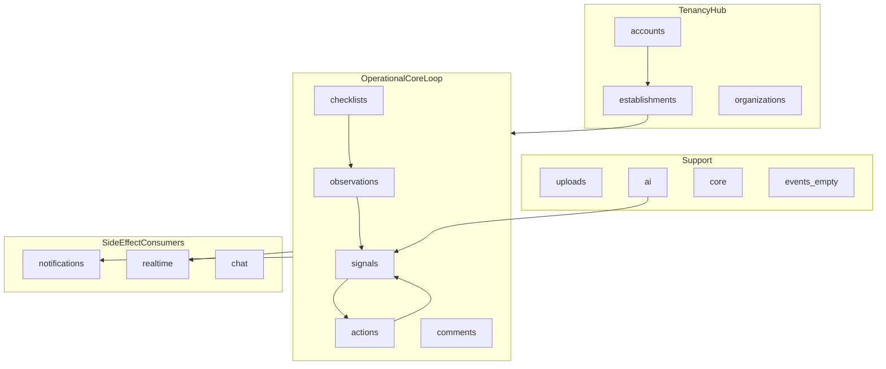
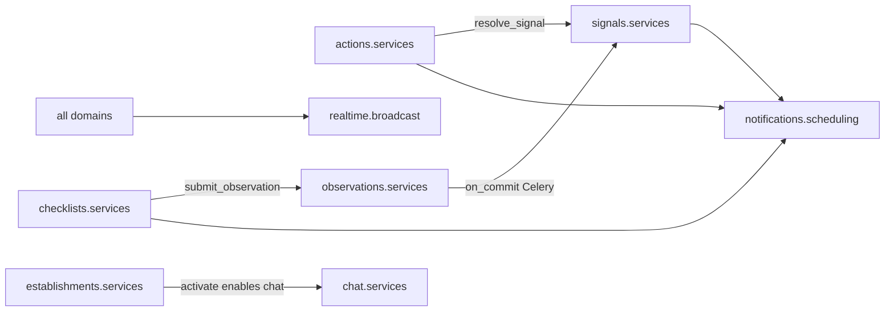

# Houston Backend Core Architecture Audit

Status: audit report  
Date: 2026-06-23  
Scope: backend core architecture — models, services, selectors, permissions, API views, serializers, migrations, tests  
Mode: audit only — no source changes

Related: [Global Architecture Mapping Audit](./global_architecture_mapping.md) (repo-wide map, frontend coupling, runtime stack). This report goes deeper on backend domain ownership, service boundaries, and maintainability only.

---

## Inspection manifest

### 1. Files inspected

**Contract and rules**

- `AGENTS.md`, `apps/api/AGENTS.md`
- `.cursor/rules/10-backend-django-drf.mdc`, `01-agent-guardrails.mdc`, `80-security-data-integrity.mdc`

**Tenancy hub**

- `apps/api/houston/establishments/services.py` (2,545 LOC)
- `apps/api/houston/establishments/selectors.py` (527 LOC)
- `apps/api/houston/establishments/permissions.py`
- `apps/api/houston/establishments/membership_scope.py`
- `apps/api/houston/establishments/access.py`
- `apps/api/houston/establishments/role_constants.py`
- `apps/api/houston/establishments/api/views.py`, `serializers.py`

**Operational core loop**

- `apps/api/houston/observations/services.py`, `selectors.py`, `api/views.py`
- `apps/api/houston/signals/services.py` (1,393 LOC), `selectors.py`, `permissions.py`, `api/views.py`, `api/serializers.py`
- `apps/api/houston/actions/services.py` (493 LOC), `selectors.py`, `permissions.py`, `api/views.py`
- `apps/api/houston/checklists/services.py` (1,172 LOC), `materialization.py` (429 LOC), `selectors.py`, `permissions.py`, `api/views.py`
- `apps/api/houston/comments/services.py`, `selectors.py`, `permissions.py`, `api/views.py`

**Side-effect layers**

- `apps/api/houston/notifications/scheduling.py` (526 LOC), `services.py`
- `apps/api/houston/realtime/broadcast.py`, `permissions.py`, `access.py`
- `apps/api/houston/chat/services.py`, `access.py`

**Support**

- `apps/api/houston/accounts/services.py`, `api/views.py`
- `apps/api/houston/uploads/services.py`, `permissions.py`
- `apps/api/houston/ai/observation_pipeline.py` (662 LOC)
- `apps/api/houston/core/events.py`
- `apps/api/houston/events/apps.py` (empty shell)
- `apps/api/config/settings.py` (app registry)

**Migrations (recent / notable)**

- `establishments/migrations/0014_membership_scope_business_unit.py`, `0020_establishmentmembership_notifications_enabled.py`
- `signals/migrations/0003_signal_activity_subject_feed_index.py`
- `actions/migrations/0005_multi_assignee_phase1.py`
- `checklists/migrations/0010_purge_checklist_data_and_remove_flash_todo.py`, `0012_align_execution_source_constraint.py`

### 2. Tests inspected

~169 pytest modules under `apps/api/houston/*/tests/`. Sampling focused on architecture-risk areas:

| Area | Representative tests |
|------|------------------------|
| Signal lifecycle + RBAC | `signals/tests/test_signal_cancel_resolve_api.py`, `test_signal_lifecycle_services.py`, `test_permissions.py` |
| Action lifecycle + tenant | `actions/tests/test_action_transitions_api.py`, `test_action_services.py`, `test_action_permissions.py` |
| Establishment RBAC | `establishments/tests/test_permissions.py` |
| Observation isolation | `observations/tests/test_observation_api.py`, `test_processing_status_api.py` |
| Checklist services | `checklists/tests/test_assignment_services.py`, `test_execution_api.py`, `test_assignment_api.py` |
| Pipeline / import boundaries | `signals/tests/test_import_graph.py`, `ai/tests/test_observation_pipeline_provider.py` |
| Realtime (mock-heavy) | `realtime/tests/test_checklist_invalidation.py` |

**Coverage gap verified:** checklists cross-establishment rejection exists in `test_assignment_services.py` (`test_create_assignment_rejects_cross_establishment_assignee`) but not in assignment/execution API test modules.

### 3. Docs / rules inspected

- `apps/api/AGENTS.md` — canonical service/selector/permission ownership
- `.cursor/rules/10-backend-django-drf.mdc`
- `docs/product/notification_matrix_v0.2.md` (notification growth context)
- `docs/product/event_catalogue_v0.1.md` (event naming; `EventEnvelope` in `core`, not `events` app)

### 4. Assumptions or unknowns

- Pytest pass rate and coverage % were not executed in this audit.
- Production load characteristics are unknown (Houston is dev-phase only).
- Whether the empty `houston.events` app is intentional future persistence vs naming debt is unclear.
- Celery/Channels runtime behavior was not validated end-to-end.

---

## Backend structure assessment

Houston backend is a **15-app Django modular monolith** with a documented and largely followed layering contract (`apps/api/AGENTS.md`).

### Layer adherence

| Layer | Intended ownership | Actual adherence |
|-------|-------------------|------------------|
| `models.py` | Fields, constraints, simple invariants | **Good** — no lifecycle in `save()`; establishments `clean()` is structural validation only |
| `services.py` | Writes, lifecycle, event scheduling | **Mostly good** — views delegate; two god files dilute clarity |
| `selectors.py` | Permission-scoped reads | **Good** — strong prefetch in feeds; one N+1 weak path on canceled signal detail |
| `permissions.py` | RBAC | **Good hub** — private imports leak across 8+ modules |
| `api/views.py` | HTTP orchestration | **~90% thin** — localized ORM in comments, checklists, onboarding views |
| `api/serializers.py` | Validation + representation | **Good** — no `ModelSerializer.create/update`; permission hints are intentional UX |

### Service concentration (LOC)

| File | LOC | Responsibility breadth |
|------|-----|------------------------|
| `establishments/services.py` | 2,545 | Onboarding FSM, proposals, invites, membership CRUD, runtime taxonomy |
| `signals/services.py` | 1,393 | AI pipeline apply, aggregation, signal lifecycle |
| `checklists/services.py` | 1,172 | Templates, assignments, executions, task FSM |
| `notifications/scheduling.py` | 526 | Cross-domain after-commit notification producers |
| `actions/services.py` | 493 | Action FSM + signal auto-resolve side effect |

### Lifecycle and transaction patterns (strengths)

Across actions, signals, checklists, and establishments, lifecycle transitions follow a consistent template:

1. `@transaction.atomic`
2. `select_for_update()` where races matter
3. Status guard → domain exception
4. `save(update_fields=[...])`
5. `transaction.on_commit` for Celery, notifications, and realtime invalidation

Examples: `accept_action` (`actions/services.py`), `_transition_active_signal_to_terminal` (`signals/services.py`), `submit_observation` → `on_commit` enqueue (`observations/services.py`).

Models stay thin — business workflows are not in `save()`/`clean()` beyond structural invariants.

**Verdict:** Architecture intent is documented and largely followed. The backend is maintainable today, but **concentration risk in 2–3 files** and **cross-domain side-effect wiring** will dominate evolution cost as domains grow.

---

## Findings (10)

### F1 — God service: `establishments/services.py`

- **Severity:** P1
- **Category:** structure / maintainability
- **Evidence:** `apps/api/houston/establishments/services.py` — 2,545 LOC, 23+ public functions, 20+ exception classes. Mixes onboarding FSM (`start_onboarding_session`, `apply_onboarding_proposal`, `activate_onboarding_session`), proposal validation (`validate_onboarding_proposal_payload`), director/establishment invites, membership CRUD, runtime BU/subject mutations, and inline auth guards (`_ensure_can_manage_onboarding_proposal`).
- **Problem:** Multiple sub-domains share one module with no boundary.
- **Why it matters now:** Every onboarding, membership, or taxonomy change touches the largest backend file.
- **Why it will hurt later:** Onboarding evolution, catalog changes, and RBAC tweaks become high-conflict PRs; onboarding and runtime config cannot evolve independently.
- **Recommended fix:** Split into focused modules or subpackage: `onboarding_services.py`, `membership_services.py`, `runtime_config_services.py`. Keep shared helpers internal; re-export public API from `services.py` if needed for backward-compatible imports.
- **Tests to add/update:** Existing establishments tests should pass unchanged; add import-boundary test (pattern: `signals/tests/test_import_graph.py`).
- **Suggested implementation size:** L

---

### F2 — Split brain: AI pipeline ownership (`signals` vs `ai`)

- **Severity:** P1
- **Category:** structure / ambiguity
- **Evidence:** Orchestration in `signals/services.py` — `run_observation_pipeline`, `apply_pipeline_output`, `aggregate_candidate_into_signal`, `find_active_signal_for_aggregation`. Provider I/O and schemas in `ai/observation_pipeline.py` (662 LOC). Celery task `process_observation_task` lives under signals.
- **Problem:** Unclear which app owns the observation → signal workflow.
- **Why it matters now:** Pipeline bugfixes require context in two apps.
- **Why it will hurt later:** New AI providers, retry policies, or pipeline stages multiply coupling and onboarding cost.
- **Recommended fix:** Pick one owner explicitly: (a) move orchestration into `ai/services.py` with signals consuming structured results, or (b) document `signals` as pipeline owner and slim `ai/` to pure provider adapter. Update `apps/api/AGENTS.md` accordingly.
- **Tests to add/update:** `ai/tests/test_observation_pipeline_*`, `signals/tests/test_signal_lifecycle_services.py`.
- **Suggested implementation size:** M

---

### F3 — Private cross-app imports of tenancy primitives

- **Severity:** P1
- **Category:** structure / maintainability
- **Evidence:** `_is_valid_membership` imported from `establishments/permissions.py` by 8 modules: `chat/permissions.py`, `chat/access.py`, `chat/services.py`, `realtime/permissions.py`, `realtime/access.py`, `notifications/services.py`, `notifications/permissions.py`, `checklists/permissions.py`. `_ADMIN_ROLES` from `establishments/role_constants.py` imported by `signals/permissions.py`, `actions/permissions.py`, `checklists/permissions.py`, `chat/services.py`.
- **Problem:** Underscore-prefixed symbols act as a hidden public API across domain boundaries.
- **Why it matters now:** Renaming or refactoring membership validity breaks silently across apps.
- **Why it will hurt later:** Every new domain repeats the private-import pattern instead of a stable tenancy contract.
- **Recommended fix:** Promote to public `is_valid_membership()` in `establishments/permissions.py` or `establishments/access.py`; export `ADMIN_ROLES` (drop leading underscore) from `role_constants.py`.
- **Tests to add/update:** Existing permission tests; extend `signals/tests/test_import_graph.py` or add lint rule against cross-app `_` imports.
- **Suggested implementation size:** S

---

### F4 — Duplicated membership-in-establishment validation

- **Severity:** P2
- **Category:** maintainability
- **Evidence:** Near-identical `_validate_membership_in_establishment` in `actions/services.py:40` and `checklists/services.py:130` — same active-membership query, different exception types (`ActionValidationError` vs `ChecklistValidationError`).
- **Problem:** Same validation logic copy-pasted per domain.
- **Why it matters now:** Bugfixes or query optimizations must be applied twice.
- **Why it will hurt later:** A third domain (e.g. future assignments) will likely copy the pattern again.
- **Recommended fix:** Shared helper in `establishments/` (e.g. `get_active_membership_in_establishment`) with domain-specific exception wrapping at call site.
- **Tests to add/update:** Covered by existing action/checklist service tests once centralized.
- **Suggested implementation size:** S

---

### F5 — Parallel business-unit scope rules across permissions

- **Severity:** P2
- **Category:** maintainability / security
- **Evidence:** Scope branching duplicated across `establishments/membership_scope.py` (`membership_scope_covers_business_unit`), `signals/permissions.py` (`signal_visible_in_membership_scope`), `actions/permissions.py` (`action_visible_in_membership_scope`), `checklists/permissions.py` (`membership_covers_checklist_business_unit`, `build_checklist_visibility_scope_q`). All branch on `_ADMIN_ROLES` vs MANAGER/STAFF + scope links.
- **Problem:** RBAC scope semantics reimplemented per domain.
- **Why it matters now:** Subtle differences are hard to spot during review.
- **Why it will hurt later:** Scope model changes (e.g. subject-level scope) require 4+ coordinated edits; drift risk between read (permissions) and write (services) paths.
- **Recommended fix:** Centralize `membership_covers_business_unit()` primitives in `establishments/membership_scope.py`; domain permissions compose only.
- **Tests to add/update:** Cross-domain scope parity tests in `establishments/tests/`; existing per-domain `test_permissions.py` modules.
- **Suggested implementation size:** M

---

### F6 — `notifications/scheduling.py` as omnibus cross-domain coupler

- **Severity:** P2
- **Category:** structure / scalability
- **Evidence:** `notifications/scheduling.py` — 12+ `schedule_*_notification` functions importing models from actions, checklists, comments, signals. Single file is the fan-in point for all after-commit notification producers.
- **Problem:** All notification producers in one module create import fan-in and large change blast radius.
- **Why it matters now:** Any notification shape change touches a 526-line cross-domain file.
- **Why it will hurt later:** Notification matrix growth (`docs/product/notification_matrix_v0.2.md`) makes this the default merge-conflict zone.
- **Recommended fix:** Per-domain `*_notifications.py` modules (e.g. `actions/notification_producers.py`) calling shared `notifications/services.create_notification`; keep `scheduling.py` as thin `on_commit` dispatcher only.
- **Tests to add/update:** Existing `notifications/tests/`; per-domain producer tests colocated with domain.
- **Suggested implementation size:** M

---

### F7 — Action → Signal auto-resolve cross-domain write

- **Severity:** P2
- **Category:** structure / ambiguity
- **Evidence:** `actions/services.py:129` — `sync_signal_after_action_change` lazy-imports `resolve_signal` from `signals/services.py`. Called from `mark_action_done`, `validate_action`, `cancel_action` when linked signal has no active actions.
- **Problem:** Actions domain triggers signal terminal transition as a side effect; dependency hidden by lazy import.
- **Why it matters now:** Contributors may not discover the coupling when changing action or signal resolve rules.
- **Why it will hurt later:** Adding validation steps or event ordering constraints requires coordinating two service modules without a named coordinator.
- **Recommended fix:** Document as intentional product coupling in `apps/api/AGENTS.md`, or extract an `operational_closure` coordinator service owned by signals or a thin cross-domain module.
- **Tests to add/update:** Extend `actions/tests/test_action_services.py` with all `sync_signal_after_action_change` branches (active exists, all canceled, all done).
- **Suggested implementation size:** M

---

### F8 — RBAC rules duplicated between services and permissions (actions)

- **Severity:** P2
- **Category:** maintainability / security
- **Evidence:** `_validate_staff_create_constraints` in `actions/services.py` vs `can_accept_action`, `can_create_action`, etc. in `actions/permissions.py`. Staff self-assign-only rules exist in both write and read/hint paths.
- **Problem:** Write path and permission-hint path can diverge.
- **Why it matters now:** A service-only rule change may not update API hints or vice versa.
- **Why it will hurt later:** Frontend hints that disagree with server enforcement erode trust in RBAC UX.
- **Recommended fix:** Services call permission helpers for write guards; remove parallel role checks in services.
- **Tests to add/update:** `actions/tests/test_action_permissions.py` + service tests asserting same membership/role matrix.
- **Suggested implementation size:** S

---

### F9 — Canceled signal detail N+1 risk

- **Severity:** P2
- **Category:** performance
- **Evidence:** `signals/selectors.py:142-163` — `get_signal_for_detail` canceled branch uses `select_related` but lacks `_SIGNAL_LIST_PREFETCH` applied on the active feed path. `serialize_signal_detail` may trigger per-signal queries for source observation links.
- **Problem:** Asymmetric prefetch between active and canceled detail paths.
- **Why it matters now:** Low volume in dev; path is reachable for managers reviewing canceled signals.
- **Why it will hurt later:** Detail views become a predictable N+1 hotspot as signal volume grows.
- **Recommended fix:** Apply the same `Prefetch` bundle to the canceled detail queryset branch.
- **Tests to add/update:** Query-count assertion in `signals/tests/test_signal_canceled_detail.py`.
- **Suggested implementation size:** S

---

### F10 — Checklists API tenant isolation test gap

- **Severity:** P2
- **Category:** tests
- **Evidence:** Cross-establishment rejection in `checklists/tests/test_assignment_services.py` (`test_create_assignment_rejects_cross_establishment_assignee`). No matching `foreign_establishment` / `cross_establishment` tests in `test_assignment_api.py` or `test_execution_api.py` (contrast with `actions/tests/test_action_transitions_api.py` and `observations/tests/test_observation_api.py`).
- **Problem:** Tenant isolation for checklists is verified at service layer but not at HTTP API boundary.
- **Why it matters now:** View-layer regressions (e.g. direct ORM in `checklists/api/views.py`) would not be caught.
- **Why it will hurt later:** Checklists grow in surface area; API-level isolation gaps are high-severity in multi-tenant ops.
- **Recommended fix:** Add API tests mirroring action/signal patterns: `test_*_returns_404_for_foreign_establishment` for assignment, execution, and template endpoints.
- **Tests to add/update:** `checklists/tests/test_assignment_api.py`, `test_execution_api.py`.
- **Suggested implementation size:** S

---

## Risky domain coupling

| Coupling | Risk | Notes |
|----------|------|-------|
| `actions` → `signals.resolve_signal` | **High** | Hidden lifecycle side effect; lazy import masks dependency (F7) |
| `checklists` → `observations.submit_observation` | **Medium** | Correct product flow; tight operational coupling |
| `notifications/scheduling` ← all domains | **High** | Central bottleneck; grows with notification matrix (F6) |
| `establishments` hub (permissions, scope, access) | **Medium (intentional)** | Healthy tenancy center; fragile via private imports (F3) |
| `signals` ↔ `ai` pipeline | **High** | Ownership ambiguity (F2) |
| `establishments/services` → `chat`, `realtime`, `accounts` | **Medium** | Activation/onboarding orchestration spans 4 apps |

**Positive pattern:** `transaction.on_commit` for Celery (`observations/services.py`), notifications (`notifications/scheduling.py`), and realtime invalidation (`realtime/broadcast.py`) is consistent and matches `apps/api/AGENTS.md`.

**View-layer drift (localized):** Direct ORM in `comments/api/views.py` (`_load_action_and_comment`), `checklists/api/views.py` (`ChecklistAssignmentCreateView.post`), and onboarding helpers in `establishments/api/views.py` (`_get_onboarding_establishment`). Not systemic but worth tightening when those areas change.

---

## Simplification opportunities

| Opportunity | Effort | Impact |
|-------------|--------|--------|
| Promote `_is_valid_membership` / `_ADMIN_ROLES` to public API (F3) | S | Removes hidden coupling across 8+ files |
| Extract shared invalidation wrapper | S | 6 copy-pasted `_schedule_*_invalidation` helpers → one `realtime` helper |
| Deduplicate `_validate_membership_in_establishment` (F4) | S | 2 identical queries → 1 establishments helper |
| Split `establishments/services.py` by sub-domain (F1) | L | Largest maintainability win |
| Clarify `ai` vs `signals` pipeline ownership (F2) | M | Reduces onboarding cost for pipeline work |
| Shard `notifications/scheduling.py` by source domain (F6) | M | Scales with notification matrix |
| Move onboarding ORM helpers out of establishments views | S | Aligns views with AGENTS.md |
| Resolve or remove empty `houston.events` app | S | Reduces naming confusion (`EventEnvelope` lives in `core/events.py`) |

---

## Prioritized fixes

### 1. Top 3 fixes to do first

1. **Split or module-boundary `establishments/services.py`** (F1) — highest concentration risk; blocks safe parallel work on onboarding vs membership vs runtime config.
2. **Resolve AI pipeline ownership between `ai/` and `signals/`** (F2) — removes ambiguity before pipeline evolution.
3. **Promote private tenancy primitives to public API** (F3) — `_is_valid_membership`, `_ADMIN_ROLES`; low effort, high coupling relief.

### 2. Quick wins

- Deduplicate membership-in-establishment validation (F4)
- Add canceled-signal detail prefetch (F9)
- Add checklists API foreign-establishment tests (F10)
- Consolidate `_schedule_*_invalidation` wrappers into shared realtime helper
- Align actions service write guards with permissions module (F8)

### 3. Structural issues to plan later

- Centralize BU scope permission primitives (F5)
- Shard notifications scheduling by domain (F6)
- Document or extract action → signal auto-resolve coordinator (F7)
- Move onboarding ORM out of establishments views
- Clarify or populate `houston.events` vs `core/events.py`

### 4. Things not worth fixing now

- Destructive historical migrations (`checklists/0010_purge_checklist_data`, `establishments/0016_drop_legacy_taxonomy`) — already applied in dev
- `organizations` model-only app — intentionally thin placeholder
- Permission hints in serializers — documented UX pattern, not authorization truth
- Frontend field naming split (`activity_subject_normalized_name` vs `activity_subject_key`) — frontend accommodates; out of backend-core scope
- Mock-heavy realtime/AI tests — acceptable for async boundaries; not a structural defect

---

## Summary

| Dimension | Assessment |
|-----------|------------|
| Documented layering | Strong — `apps/api/AGENTS.md` matches ~90% of codebase |
| Model thinness | Good — workflows in services, not models |
| Lifecycle consistency | Good — atomic + on_commit pattern is repeatable |
| Tenancy hub | Intentional and mostly clean — undermined by private imports |
| Concentration risk | **High** in `establishments/services.py` and `signals/services.py` |
| Cross-domain coupling | Manageable today; notification scheduling and action→signal resolve are the main growth risks |
| Test posture | Strong on signals/actions/establishments API; thinner on checklists API tenant isolation |

**Changed:** `docs/audits/backend_core_architecture.md` (this report).  
**Validated:** File inventory, LOC counts, import graph for `_is_valid_membership`, lifecycle patterns, selector prefetch asymmetry, checklist API test gap.  
**Risks / not verified:** Pytest execution, production load, Celery/Channels end-to-end, `houston.events` app intent.
