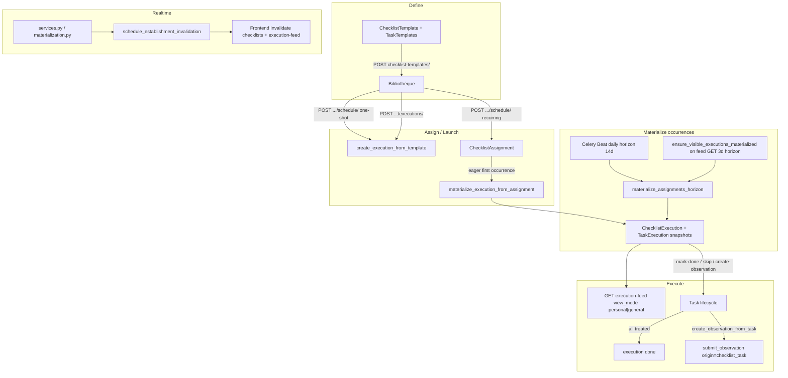

# Checklist Domain Audit

Status: audit report  
Date: 2026-06-24  
Scope: Checklist templates, assignments, materialization, execution lifecycle, RBAC, observation handoff, realtime/cache freshness, frontend bibliothèque — backend `checklists/` app, execution-feed materialization hook, frontend `features/checklists/` + execution-feed integration  
Mode: audit only — no source changes

Related: [Execution Feed Audit](./execution_feed_audit.md) (EF-01/03/04/05/07/08 cross-refs; feed projection not re-audited), [`checklist_domain.md`](../product/domains/checklist_domain.md), [`feed_domain.md`](../product/domains/feed_domain.md)

---

## Inspection manifest

### 1. Files inspected

**Contract and rules**

- `AGENTS.md`, `apps/api/AGENTS.md`, `apps/web/AGENTS.md`
- `.cursor/rules/10-backend-django-drf.mdc`, `80-security-data-integrity.mdc`

**Backend — checklists core**

- `apps/api/houston/checklists/models.py` — `ChecklistTemplate`, `ChecklistTaskTemplate`, `ChecklistAssignment`, `ChecklistExecution`, `ChecklistTaskExecution`; constraints and indexes
- `apps/api/houston/checklists/services.py` — template/assignment CRUD, `create_execution_from_template`, `schedule_checklist_from_template`, task lifecycle, `create_observation_from_task`, assignment sync/cancel
- `apps/api/houston/checklists/materialization.py` — `materialize_execution_from_assignment`, `ensure_visible_executions_materialized`, horizon helpers
- `apps/api/houston/checklists/selectors.py` — catalogue, feed visibility Q objects, detail lookups, `get_active_execution_for_template`
- `apps/api/houston/checklists/permissions.py` — RBAC matrix (Owner/Director/Manager/Staff)
- `apps/api/houston/checklists/permission_hints.py` — UX hints (not authoritative)
- `apps/api/houston/checklists/constants.py` — statuses, `EXECUTION_FEED_STATUSES`, materialization constants
- `apps/api/houston/checklists/feed_serializers.py` — `serialize_checklist_feed_item`
- `apps/api/houston/checklists/tasks.py` — `materialize_checklist_assignments_horizon_task`
- `apps/api/houston/checklists/api/views.py`, `serializers.py`, `urls.py` — 18 REST endpoints

**Backend — cross-domain (checklist coupling only)**

- `apps/api/houston/actions/execution_feed.py` — `ensure_visible_executions_materialized` call on feed build (L213–216)
- `apps/api/houston/observations/services.py` — `submit_observation` + `_validate_checklist_observation_context`
- `apps/api/houston/establishments/membership_scope.py` — `build_checklist_visibility_scope_q`, `build_action_visibility_scope_q`
- `apps/api/houston/realtime/broadcast.py` — establishment invalidation scheduling
- `apps/api/houston/notifications/scheduling.py` — checklist notification producers

**Frontend**

- `apps/web/src/features/checklists/` — pages, hooks, api, lib, components (21 components, 5 pages)
- `apps/web/src/features/execution/components/execution-checklist-card.tsx`, `execution-feed-tabs.tsx`
- `apps/web/src/features/realtime/lib/apply-operational-invalidation.ts`
- `apps/web/src/lib/query-invalidation.ts`
- `apps/web/src/features/auth/lib/bootstrap-permission-hints.ts`, `profile-page.tsx`

**Docs**

- `docs/product/domains/checklist_domain.md` — authoritative checklist contract
- `docs/product/domains/feed_domain.md` — execution feed view modes and merge policy
- `docs/product/event_catalogue_v0.1.md` — granular vs bundled event mismatch
- `docs/audits/execution_feed_audit.md` — upstream feed findings (cross-ref only)

### 2. Tests inspected

| Area | Key files |
|------|-----------|
| RBAC | `checklists/tests/test_permissions.py` |
| Templates | `test_template_services.py`, `test_template_api.py` |
| Assignments | `test_assignment_services.py`, `test_assignment_api.py`, `test_checklist_assignment_scheduling.py` |
| Tasks / lifecycle | `test_task_services.py`, `test_task_api.py` |
| Executions | `test_execution_api.py`, `test_execution_permission_hints_api.py` |
| Schedule API | `test_schedule_api.py` |
| Materialization | `test_materialization_services.py`, `test_horizon_task.py` |
| Execution feed (checklist items) | `test_execution_feed_checklist.py` — visibility, lazy materialization, manager general view (L107+), query baseline |
| Observation handoff | `test_observation_handoff.py` |
| Permission hints | `test_template_assignment_permission_hints_api.py` |
| Selectors | `test_selectors.py` |
| Tenant isolation | `test_tenant_isolation_api.py` |
| Layer boundaries | `test_import_boundaries.py` |
| Realtime | `realtime/tests/test_checklist_invalidation.py`, `test_checklist_materialization_invalidation.py` |
| Notifications | `notifications/tests/test_checklist_notification_producers.py` |
| Frontend lib | 14 test files under `features/checklists/lib/` |
| Frontend pages/components | `checklist-create-page.test.tsx`, `checklist-template-detail-page.test.tsx`, `checklist-execution-detail-page.test.tsx`, `checklist-execution-task-row.test.tsx` |
| Cross-feature | `execution/lib/execution-feed-sections.test.ts`, `realtime/lib/apply-operational-invalidation.test.ts`, `lib/query-invalidation.test.ts`, `checklists/hooks.mutations.test.ts` |

`make backend-test` / `make verify` were not run in this audit pass.

### 3. Docs / rules inspected

- `docs/product/domains/checklist_domain.md` — authoritative (Last reviewed 2026-06-17); materialization §5.7, concurrent executions §5.10, RBAC §9
- `docs/product/domains/feed_domain.md` — Ma vue / Vue globale delegation to backend `view_mode`
- `docs/product/event_catalogue_v0.1.md` — checklist event catalogue vs runtime bundled invalidation
- `apps/api/AGENTS.md` — services/selectors/permissions ownership

### 4. Assumptions or unknowns

- **EF-03 resolved on current branch:** `test_manager_sees_in_scope_checklist_assigned_to_staff_in_general_view` in `test_execution_feed_checklist.py` L107+ covers manager Vue globale checklist visibility.
- Multiple concurrent active template executions are **intentional** per `checklist_domain.md` §5.10 and `test_multiple_active_template_executions_allowed`.
- Production assignment counts, materialization latency, and explain plans not measured.
- Staff reaching the bibliothèque via profile when management section is hidden (feed-only path) not manually verified in browser.
- Execution Feed projection, pagination cursors, and action-card behavior were **not** re-audited except where checklist materialization or visibility affects them.

### Strengths (no action required)

- Clean Template → Assignment → Execution separation with DB constraints (`uniq_checklist_execution_assignment_occurrence`, `checklist_execution_source_shape`).
- RBAC enforced in services; permission hints are UX-only; solid matrix tests including deactivated membership and tenant isolation.
- Materialization idempotency, concurrency, and timezone handling tested; import boundaries enforced (`test_import_boundaries.py`).
- Feed queryset uses `select_related` + progress `Count` annotations; query baseline exists (`EXECUTION_FEED_ONE_CHECKLIST_MAX_QUERIES = 11`).
- Realtime invalidation wired: template/assignment writes → `checklist.updated`; execution lifecycle → `execution.created` / `execution.updated`.
- Observation handoff from task is well-tested end-to-end (`test_observation_handoff.py`).

---

## 1. Current flow

### Define and assign

1. **Templates** — Owner/Director/Manager create `ChecklistTemplate` + `ChecklistTaskTemplate` rows (`business_unit` required). Staff cannot create templates (`can_create_registered_template` → `_MANAGEMENT_ROLES` only in `permissions.py`).
2. **Launch paths:**
   - **One-shot:** `POST .../templates/{id}/executions/` or schedule branch → `create_execution_from_template` (`execution_source=template`).
   - **Recurring:** `POST .../schedule/` or `POST .../assignments/` → `ChecklistAssignment` + eager first occurrence via `materialize_execution_from_assignment` (`execution_source=assignment`).
3. **Snapshots** — On execution create/materialize: `template_title`, `template_description`, `business_unit`, assignee, schedule fields, per-task `task` + `position`.

### Materialize

Three paths documented in `checklist_domain.md` §5.7:

| Path | Trigger | Horizon | Entry |
|------|---------|---------|-------|
| Eager | Assignment create | First occurrence | `create_checklist_assignment` → `materialize_execution_from_assignment` |
| Read-path | Every `build_execution_feed_page` | `min(14, 3)` days; stale gate 30 min | `ensure_visible_executions_materialized` in `execution_feed.py` L213–216 |
| Celery Beat | Daily cron (default 03:00 UTC) | 14 days | `materialize_checklist_assignments_horizon_task` in `tasks.py` |

Read-path scopes assignments via `_assignment_materialization_visibility_q` (`materialization.py` L293–317), mirroring feed visibility for the requesting membership + `view_mode`. Only occurrences where `occurrence_start - VISIBLE_FROM_OFFSET <= now` are materialized.

### Execute and complete

- No `start` endpoint — first task event (`mark_done`, `skip`, `create_observation_from_task`) transitions `assigned` → `in_progress` (`services.py` `_maybe_start_execution`).
- Task treated when status ∈ `{done, skipped, observation_created}`; execution `done` when all tasks treated.
- `create_observation_from_task` → `submit_observation(origin=CHECKLIST_TASK)` → `record_task_observation_created`; observation layer validates assignee + establishment match.

### Ma vue / Vue globale visibility

Frontend label: **Ma vue** / **Vue globale** (`execution-feed-tabs.tsx`). Frontend passes `view_mode` (`personal` | `general`) only — no client-side checklist filtering.

Backend selectors (`selectors.py` L171–218):

- **Ma vue (`personal`):** `assigned_to_id = membership.id`.
- **Vue globale (`general`):**
  - Owner/Director: all establishment executions in feed statuses.
  - Staff: personal only (same as Actions per `feed_domain.md` §7).
  - Manager: personal OR executions whose snapshot `business_unit_id` is in `MembershipScope` (`checklist_general_feed_visibility_q`).

Feed inclusion: `status IN (assigned, in_progress)` AND `visible_from <= now` (or null). Terminal `done`/`canceled` excluded (`EXECUTION_FEED_STATUSES`).

### Permissions (command authority)

| Capability | Owner / Director | Manager | Staff |
|------------|------------------|---------|-------|
| Create template | yes (all BU) | scoped BU | **no** |
| Manage template / tasks | all | scoped BU | **no** |
| Create assignment | yes | scoped BU | **no** |
| Launch execution — self | yes | scoped BU | scoped BU |
| Launch execution — others | yes | scoped BU | **no** |
| Execute tasks | if assignee | if assignee | if assignee |
| View execution (non-assignee) | all | scoped BU | assignee only |
| Cancel execution | all; Manager scoped or assignee | scoped BU or assignee | assignee only |

Hints in API payloads pilot UI buttons; backend rejects unauthorized commands with `403`.

### Realtime / cache

- Writers schedule `schedule_establishment_invalidation` on commit: `subject_type: checklist` (`checklist.updated`) or `execution` (`execution.created` / `execution.updated`).
- Frontend `apply-operational-invalidation.ts` → `invalidateChecklistMutationSurfaces` / `invalidateChecklistExecutionSurfaces` → also invalidates `['actions', 'execution-feed', establishmentId]` prefix (both view modes).
- Mutations in `checklists/hooks.ts` follow the same invalidation pattern. No optimistic patches.

---

## 2. Top findings

### CL-01 — Read-path materialization on every execution-feed GET

- **Severity:** P1
- **Category:** scalability / performance
- **Evidence:** `build_execution_feed_page()` in `apps/api/houston/actions/execution_feed.py` L213–216 calls `ensure_visible_executions_materialized(membership=..., view_mode=...)` unconditionally before checklist or action querysets. Implementation: `materialization.py` L372–428 — loops all visible active assignments, per-assignment existence queries (`_existing_occurrence_dates_for_assignment` L411–414), optional `materialize_execution_from_assignment` per occurrence. Constants: `READ_PATH_MATERIALIZATION_HORIZON_DAYS = 3`, `READ_PATH_MATERIALIZATION_STALE_MINUTES = 30` (`materialization.py` L38–39).
- **Problem:** Every execution feed request triggers synchronous checklist materialization work bounded by assignment count × visible occurrences, not by `page_size`. Runs even when the user only needs action items or the establishment has no matching assignments.
- **Why it matters now:** Feed is the primary operational surface; p95 latency grows unpredictably with recurring assignment volume.
- **Why it will hurt later:** Multi-BU establishments with daily/weekly recurrences will see connection-pool pressure and multi-second feed loads under concurrent users.
- **Recommended fix:** Decouple materialization from the hot read path — options: (A) skip when no active assignments match visibility Q; (B) establishment-scoped beat pre-materialization before `visible_from`; (C) materialize only when checklist cursor phase is needed. Preserve `visible_from` semantics. Cross-ref **EF-01**, **EF-02** in [execution_feed_audit.md](./execution_feed_audit.md).
- **Tests to add/update:** Feed GET with N assignments asserting query count ceiling; action-only establishment skips materialization; latency regression after decoupling.
- **Suggested implementation size:** M–L

### CL-02 — Assignment list N+1 for permission hints

- **Severity:** P2
- **Category:** performance
- **Evidence:** `ChecklistAssignmentListView` (`views.py` L589–611) list-comprehends `serialize_assignment` per row. `serialize_assignment` (`serializers.py` L347–375) calls `build_checklist_assignment_permission_hints` → `get_in_progress_execution_for_assignment` (`permission_hints.py` L122–123, `selectors.py` L55–63) — one query per assignment.
- **Problem:** Management assignment list scales O(N) queries for `can_deactivate` hint accuracy.
- **Why it matters now:** Low impact at pilot assignment counts; list endpoint is management-only (Owner/Director/Manager).
- **Why it will hurt later:** Template detail pages listing many recurring assignments will slow management workflows.
- **Recommended fix:** Prefetch `executions` filtered to `in_progress` on assignment list queryset, or annotate `has_in_progress_execution` in bulk; pass precomputed flag into hint builder.
- **Tests to add/update:** Query-count test on `GET checklist-assignments/` with 10+ assignments.
- **Suggested implementation size:** S

### CL-03 — List vs detail delete hint asymmetry

- **Severity:** P2
- **Category:** ambiguity / API contract
- **Evidence:** `build_checklist_template_list_permission_hints` (`permission_hints.py` L88–97) sets `reflect_delete_conflicts=False`; detail uses `reflect_delete_conflicts=True` (L101–110), gating `can_delete` on `get_active_execution_for_template` (L53–54). Hub delete button uses list hints via `canShowChecklistTemplateDelete` (`checklist-template-section.tsx` L75–76). Tested: `test_owner_list_delete_hint_ignores_active_execution_conflict` in `test_template_assignment_permission_hints_api.py`.
- **Problem:** Bibliothèque list shows delete when RBAC allows, even when an active execution blocks delete; user gets `409` after confirm on detail path.
- **Why it matters now:** Confusing UX on the hub; wastes a round-trip and erodes trust in permission hints.
- **Why it will hurt later:** As concurrent executions are normal (§5.10), false-positive delete affordances increase.
- **Recommended fix:** Align list hints with detail (`reflect_delete_conflicts=True` on list) **or** remove delete from list and keep delete on detail only.
- **Tests to add/update:** Update `test_owner_list_delete_hint_ignores_active_execution_conflict` if product chooses align; frontend hub test for hidden delete when conflict exists.
- **Suggested implementation size:** S

### CL-04 — Lazy materialization visibility and realtime gap

- **Severity:** P2
- **Category:** realtime / scalability
- **Evidence:** Assignment-sourced executions use `visible_from = start_at - 1 hour`. Rows are created lazily via read-path or daily beat (`materialization.py`). `realtime/tests/test_checklist_materialization_invalidation.py` — `execution.created` only on real insert; idempotent `IntegrityError` race emits no invalidation (comment in `materialization.py` ~L228). Cross-ref **EF-08**.
- **Problem:** A recurring execution may not exist in DB (and thus not in any feed) until someone triggers read-path materialization or the daily beat runs. Other users receive no WebSocket invalidation until `execution.created` fires.
- **Why it matters now:** Acceptable for small teams with active feed users; first occurrence is eager on assignment create.
- **Why it will hurt later:** Multi-shift operations expect supervisors to see upcoming checklist work in Vue globale before the assignee's first feed open.
- **Recommended fix:** Strengthen beat frequency or establishment-scoped pre-materialization for assignments entering the `visible_from` window; optional proactive `execution.created` from beat task.
- **Tests to add/update:** Integration test: assignment enters visibility window → beat materializes → manager general feed includes item without assignee opening feed.
- **Suggested implementation size:** M

### CL-05 — Frontend dead API surface and unused schema hints

- **Severity:** P2
- **Category:** maintainability / API contract
- **Evidence:** `createExecutionFromTemplate` (`api.ts` ~L434), `createRegisteredChecklistTemplate` (~L600) — no callers outside `api.ts`. `useActivateChecklistTemplateMutation`, `useDeactivateChecklistTemplateMutation`, `useCreateRegisteredChecklistTemplateMutation`, `useCreateChecklistTaskObservationMutation` in `hooks.ts` — never imported by pages. Generated `ChecklistTemplatePermissionHints` includes `can_activate`, `can_deactivate`, `can_use_template`; `checklist-template-permission-hints.ts` `hasCompleteChecklistTemplatePermissionHints` checks only `can_update`, `can_manage_tasks`, `can_create_assignment`, `can_launch_execution`, `can_delete` — no helpers for activate/deactivate/use.
- **Problem:** Dead code and schema fields suggest capabilities the UI does not expose; increases maintenance cost and confuses contract readers.
- **Why it matters now:** Create flow uses `useCreateChecklistTemplateMutation` + separate assignment/schedule mutations; observation uses `observations/hooks.ts` path.
- **Why it will hurt later:** Regenerating types or refactoring API wrappers risks breaking unused paths silently; new contributors may wire wrong hooks.
- **Recommended fix:** Remove dead exports **or** wire UI (paired with CL-06). If removing, keep OpenAPI endpoints if backend still supports them for future UI.
- **Tests to add/update:** None if dead code removed; mutation tests if wired.
- **Suggested implementation size:** S

### CL-06 — Template activate/deactivate: backend complete, no UI

- **Severity:** P2
- **Category:** ambiguity
- **Evidence:** Endpoints `POST .../activate/`, `POST .../deactivate/` in `urls.py`; services `activate_checklist_template` / `deactivate_checklist_template` in `services.py`; hints `can_activate` / `can_deactivate` in `permission_hints.py` L78–79. `checklist_domain.md` §9.2 lists these as target hint keys. No activate/deactivate buttons on `checklist-template-detail-page.tsx` or hub.
- **Problem:** Product doc and API contract imply template lifecycle management in UI; operators cannot deactivate a template without API/admin access.
- **Why it matters now:** Templates can only be deleted (with active-execution guard) or left active; `inactive` blocks new launches but is unreachable from app.
- **Why it will hurt later:** Operational teams will keep obsolete templates active or delete history-detaching templates instead of deactivating.
- **Recommended fix:** Product decision — (A) add activate/deactivate actions on template detail gated by hints, or (B) document as deferred MVP and remove hints from list responses until UI ships.
- **Tests to add/update:** Template detail page test for activate/deactivate visibility and mutation if UI added.
- **Suggested implementation size:** S (UI) or S (doc trim)

### CL-07 — Manager Vue globale: checklist vs action supervision scope asymmetry

- **Severity:** P2
- **Category:** ambiguity
- **Evidence:** Checklist general feed: `checklist_general_feed_visibility_q` (`selectors.py` L175–190) uses execution snapshot `business_unit_id` via `build_checklist_visibility_scope_q`. Actions general feed: `build_action_visibility_scope_q` (`membership_scope.py`) uses affected ∪ responsible BU scope for linked items. Cross-ref execution_feed_audit §4 ACT/SIG asymmetry note.
- **Problem:** A manager may see an Action in Vue globale because of signal linkage scope but not see a related checklist execution in the same BU context (or vice versa) depending on how BU was snapshotted at materialization time.
- **Why it matters now:** Low confusion at pilot scale if BUs align; both paths are backend-tested independently.
- **Why it will hurt later:** Supervision UX becomes inconsistent as operators compare Actions and Checklists on the same feed surface.
- **Recommended fix:** Product decision — align checklist general visibility with action scope rules **or** document intentional difference in `checklist_domain.md` §9 and `feed_domain.md`.
- **Tests to add/update:** Cross-domain feed test documenting expected manager visibility for paired action + checklist in same establishment.
- **Suggested implementation size:** S (doc) or M (align selectors)

### CL-08 — Global Celery horizon task without sharding

- **Severity:** P2
- **Category:** scalability
- **Evidence:** `materialize_checklist_assignments_horizon_task` (`tasks.py` L15–29) calls `materialize_assignments_horizon` for all active assignments (optional `establishment_id` filter unused by default beat). `max_retries=0`; failure logs and raises.
- **Problem:** Daily job work grows O(all assignments × horizon occurrences) globally; no batching, chunking, or per-establishment task fan-out.
- **Why it matters now:** Fine for dev/pilot establishment counts; read-path is documented as primary safety net.
- **Why it will hurt later:** Beat task timeouts or silent failure (`max_retries=0`) leave establishments dependent on read-path materialization only.
- **Recommended fix:** Fan out per-establishment Celery tasks; add retry with idempotency; monitor task duration.
- **Tests to add/update:** Horizon task with many assignments asserts bounded runtime or chunked processing.
- **Suggested implementation size:** M

### CL-09 — Missing indexes on template FK + status lookups

- **Severity:** P3
- **Category:** performance
- **Evidence:** `get_active_execution_for_template` (`selectors.py` L41–52) filters `checklist_template` + `status__in=ACTIVE_EXECUTION_STATUSES`. Template delete guard (`services.py` L515–517) uses same lookup. `models.py` indexes: `checklist_exec_feed_idx` on `(establishment, status, visible_from, last_activity_at)` — no `(checklist_template_id, status)` or `(checklist_assignment_id, status)`.
- **Problem:** Template-scoped active-execution lookups may seq-scan as execution history grows.
- **Why it matters now:** Low volume in dev; queries are indexed by establishment on feed paths.
- **Why it will hurt later:** Delete hints, conflict checks, and template detail guards slow as terminal executions accumulate.
- **Recommended fix:** Add partial index on `(checklist_template_id)` WHERE `status IN ('assigned','in_progress')` if explain plans confirm.
- **Tests to add/update:** None required; migration only.
- **Suggested implementation size:** S

### CL-10 — Frontend test gaps and unused catalogue filter

- **Severity:** P3
- **Category:** tests / maintainability
- **Evidence:** No `checklist-hub-page.test.tsx`, `checklist-assignment-section.test.tsx`, or `execution-checklist-card.test.tsx`. Hub filters only `created_by_me` (`checklist-hub-page.tsx` L54–59); API supports `business_unit_id` (`selectors.py` L97–98, `ChecklistTemplateListFilters`). Profile nav `canShowChecklistsNav` gated on `activeMembership && role` (`profile-page.tsx` ~L189), not `can_create_checklist_template`.
- **Problem:** Hub permission UX and assignment section behavior lack regression tests; catalogue filter parity with product doc (§5.16 "Filtres bibliothèque : pôle, créées par moi") incomplete.
- **Why it matters now:** Template detail and create flows are well-tested; hub is the management entry for Owner/Manager.
- **Why it will hurt later:** Permission hint or hub filter changes ship without CI signal.
- **Recommended fix:** Add hub smoke tests (staff read-only, create button gated on bootstrap hints); add BU filter when product prioritizes.
- **Tests to add/update:** `checklist-hub-page.test.tsx`; optional assignment section test.
- **Suggested implementation size:** S

### Documented / tested — not reported as bugs

- Concurrent active template executions allowed (`checklist_domain.md` §5.10, `test_multiple_active_template_executions_allowed`).
- Overnight assignment slots forbidden (`end_at > start_at` DB constraint).
- Terminal executions excluded from active feed.
- Observation handoff covered (`test_observation_handoff.py`).
- Assignment update syncs `assigned` executions; blocks deactivate when `in_progress` (`test_deactivate_assignment_blocks_in_progress`).
- Manager general checklist visibility API-tested (**EF-03 closed**).

### Execution Feed follow-ups (reference only — not re-audited here)

| ID | Topic | Checklist link |
|----|-------|----------------|
| EF-01 | Materialization on every feed GET | CL-01 (same root cause) |
| EF-03 | Manager general checklist visibility | **Closed** — test exists L107+ |
| EF-04 | `+` button gated by role not hints | Feed UX; Staff checklist launch path |
| EF-05 | No checklist feed permission hints | Feed cards; detail hints exist |
| EF-07 | Query baseline gaps for mixed feed | Checklist contributes to merge page |
| EF-08 | Items absent until materialization | CL-04 (same root cause) |

---

## 3. Fix now vs later

### Top 3 fixes to do first

1. **CL-01** — Decouple or bound read-path materialization on execution-feed GET (highest scalability impact; originates in Checklist domain).
2. **CL-02** — Batch assignment list in-progress lookup for permission hints (cheap backend win).
3. **CL-05 + CL-06** — Remove dead frontend surface **or** ship activate/deactivate template UI (product decision gates scope).

### Quick wins

- **CL-03:** Align list `can_delete` hint with detail or remove hub delete button.
- **CL-09:** Add template FK + status index if explain plans show seq scans.
- **CL-10:** Add `ChecklistHubPage` staff read-only smoke test.
- Document **EF-03 closed** in execution feed audit when next touching that file.

### Structural issues to plan later

- **CL-04 / EF-08:** Proactive materialization before `visible_from` for multi-shift supervision.
- **CL-07:** Align or document manager supervision scope vs Actions.
- **CL-08:** Sharded establishment-scoped beat tasks.
- Event catalogue granularity vs bundled invalidation (`event_catalogue_v0.1.md` vs runtime `checklist.updated` only).

### Things not worth fixing now

- Concurrent template executions (explicit product decision §5.10).
- `reorder_task_templates` individual `save()` per position at MVP template sizes.
- Vue globale vs Vue générale label (cosmetic; consistent with signal feed).
- Duplicate assignee checks in checklist + observation services (defense in depth).
- Checklist feed permission hints (EF-05) unless product wants inline feed actions.

---

## 4. Product decisions

| Topic | Current state | Decision needed |
|-------|---------------|-----------------|
| Concurrent template executions | Multiple `assigned`/`in_progress` per template allowed | Confirm intentional for overlapping shifts (doc §5.10 says yes) |
| List delete affordance | Hub shows delete when RBAC allows; detail/409 when active execution exists | Hide on list vs align hints with detail |
| Template activate/deactivate | Full backend + hints; no UI | Ship UI or defer and trim hints from contract |
| Manager supervision scope | Checklist Vue globale = BU snapshot; Actions = broader affected∪responsible scope | Align selectors or document intentional difference |
| Checklist feed permission hints | No hints on feed cards (`feed_domain.md` MVP) | Defer inline actions vs add minimal hints (EF-05) |
| Materialization strategy | Read-path primary; daily beat supplementary | Accept lazy visibility vs invest in proactive beat (CL-04) |
| Staff bibliothèque access | Catalogue read scoped BU; profile nav broad | Confirm Staff should reach hub from profile without management hints |

---

## 5. Tests needed

| Priority | Test | File / area |
|----------|------|-------------|
| High | Materialization decoupled from feed (after CL-01) | `test_materialization_services.py`, `test_execution_feed_checklist.py` |
| High | Assignment list query count with N assignments | New test on `ChecklistAssignmentListView` |
| Medium | List delete hint reflects active execution (if product aligns CL-03) | `test_template_assignment_permission_hints_api.py` |
| Medium | Beat materializes before assignee opens feed | `test_horizon_task.py` |
| Medium | Hub staff read-only; no create without bootstrap hint | `checklist-hub-page.test.tsx` (new) |
| Medium | Template activate/deactivate UI (if CL-06 UI shipped) | `checklist-template-detail-page.test.tsx` |
| Low | Hub `business_unit_id` filter (if UI added) | `checklist-hub-page.test.tsx` |
| Low | Manager scope asymmetry checklist vs action | Cross-domain feed test or doc assertion |
| Closed | Manager general checklist visibility | `test_manager_sees_in_scope_checklist_assigned_to_staff_in_general_view` (EF-03) |

---

## 6. Next audit

Recommended follow-ups after Checklist:

1. **Observation domain refresh** — Extend [observation_audit.md](./observation_audit.md) for checklist-origin pipeline: `create_observation_from_task` → AI → Signal aggregation and stuck/orphan paths.
2. **Notification domain** — Checklist producers (`checklist.execution.created`, `checklist.execution.canceled`) delivery matrix and in-app routing ([notification_domain.md](../product/domains/notification_domain.md)).
3. **RBAC / MembershipScope consolidation** — Unify visibility Q builders across checklist, action, and signal feeds ([rbac_security_audit.md](./rbac_security_audit.md)).

---

## Changed

- Created `docs/audits/09_checklist_audit.md` (audit report only).

## Validated

- Code and test inspection across backend `checklists/` app, execution-feed materialization hook, observation handoff, realtime invalidation, and frontend `features/checklists/` + execution feed integration (read-only; no pytest/vitest execution).

## Risks / not verified

- Production assignment volume and feed latency under materialization-on-read not measured.
- Staff hub access via profile when management section hidden not browser-verified.
- Index recommendations (CL-09) not confirmed with EXPLAIN ANALYZE.
