# Checklist — Audit Consolidation

Status: consolidation report  
Date: 2026-06-24  
Mode: consolidation only — no source changes

## Sources

| Audit | File | Findings |
|-------|------|----------|
| Checklist domain | [`checklist_audit.md`](./checklist_audit.md) | CL-01–CL-10 |
| Execution Feed (context + handoff) | [`execution_feed_consolidation.md`](./execution_feed_consolidation.md) | EF-01–EF-10, closed EF-03/04/06 on branch |

**Branch context:** Execution Feed pre–Checklist-audit quick fixes EF-03, EF-04, and EF-06 appear implemented on the current branch. EF-01a (materialization early-exit) remains open and maps to CL-01a below.

---

## 1. Audit read

### Checklist domain audit (2026-06-24)

Audited the Checklist domain end-to-end: `ChecklistTemplate` → `ChecklistAssignment` → `ChecklistExecution` materialization (eager on create, read-path on feed GET, daily Celery beat), task lifecycle and observation handoff, RBAC (Owner/Director/Manager/Staff), Ma vue / Vue globale feed visibility via `view_mode`, permission hints, realtime invalidation, and frontend bibliothèque (`features/checklists/`).

**Findings:** 0 P0, 1 P1, 7 P2, 2 P3 (CL-01–CL-10).

**Strengths (no action):** Clean Template → Assignment → Execution separation with DB constraints. RBAC enforced in services; hints UX-only; solid permission and tenant-isolation tests. Materialization idempotency and concurrency tested. Observation handoff well-covered. Realtime invalidation wired for template/assignment and execution lifecycle. Manager Vue globale checklist visibility API-tested (**EF-03 closed**).

**Main risk themes:** Synchronous read-path materialization on every execution-feed GET (CL-01 = EF-01); assignment list N+1 for permission hints (CL-02); hub list delete hint trap vs detail/409 (CL-03); lazy materialization + WS gap before `visible_from` (CL-04 = EF-08); dead frontend API surface and missing activate/deactivate UI (CL-05/CL-06); manager supervision scope asymmetry vs Actions (CL-07 = SIG-02 echo); global Celery horizon without sharding (CL-08).

### Execution feed consolidation cross-check

| Prior fix-now item | Status on branch |
|--------------------|------------------|
| **EF-03** manager checklist Vue globale test | **Done** — `test_manager_sees_in_scope_checklist_assigned_to_staff_in_general_view` in [`checklists/tests/test_execution_feed_checklist.py`](../../apps/api/houston/checklists/tests/test_execution_feed_checklist.py) L107+ |
| **EF-04** `+` gated by hints | **Done** — [`execution-create-menu.ts`](../../apps/web/src/features/execution/lib/execution-create-menu.ts) `canOpenExecutionCreateMenu`; [`execution-feed-page.tsx`](../../apps/web/src/features/execution/pages/execution-feed-page.tsx) L50–53 |
| **EF-06** feed action `permission_hints` test | **Done** — `test_execution_feed_action_item_includes_permission_hints` in [`actions/tests/test_execution_feed_api.py`](../../apps/api/houston/actions/tests/test_execution_feed_api.py) L420+ |
| **EF-01a** materialization early-exit | **Open** — [`execution_feed.py`](../../apps/api/houston/actions/execution_feed.py) L213–216 calls `ensure_visible_executions_materialized` unconditionally; no `.exists()` short-circuit in [`materialization.py`](../../apps/api/houston/checklists/materialization.py) L388–391 |

```mermaid
flowchart LR
  subgraph closed [Closed_from_EF_consolidation]
    EF03[EF-03_manager_test]
    EF04[EF-04_create_menu_hints]
    EF06[EF-06_feed_hints_test]
  end
  subgraph fixnow [Fix_before_next_audit]
    CL01a["CL-01a / EF-01a early_exit"]
    CL02[CL-02_assignment_N+1]
    CL03[CL-03_delete_hints]
  end
  subgraph product [Product_gate]
    CL06[CL-06_activate_deactivate_UI]
    CL07[CL-07_supervision_scope]
    CL04[CL-04_proactive_materialization]
  end
  subgraph next [Next_audit]
    Obs[Observation_domain_refresh]
  end
  closed --> fixnow
  fixnow --> product
  product --> next
```



---

## 2. Findings to fix now

**Criteria:** P0/P1 **S-sized** slices, or high-ROI **S** fixes that do **not** require product sign-off.

| ID | Severity | Size | Action | Tests |
|----|----------|------|--------|-------|
| **CL-01a / EF-01a** | P1 | S | Add early return in `ensure_visible_executions_materialized` when no active assignments match `_assignment_materialization_visibility_q` (reuse existing Q at [`materialization.py`](../../apps/api/houston/checklists/materialization.py) L384–391 — **do not** duplicate visibility rules in [`execution_feed.py`](../../apps/api/houston/actions/execution_feed.py)). Bounded slice of CL-01/EF-01 only. | `test_ensure_visible_skips_when_no_visible_assignments` in [`test_materialization_services.py`](../../apps/api/houston/checklists/tests/test_materialization_services.py); feed GET on action-only establishment — assert materialization returns 0 / query-count unchanged |
| **CL-02** | P2 | S | Batch in-progress lookup for assignment list hints: prefetch or annotate `has_in_progress_execution` on `active_assignments_for_management` queryset; pass into `build_checklist_assignment_permission_hints` | Query-count test: `GET checklist-assignments/` with 10+ assignments in [`test_assignment_api.py`](../../apps/api/houston/checklists/tests/test_assignment_api.py) or dedicated test module |
| **CL-03** | P2 | S | Align list delete hint with detail: set `reflect_delete_conflicts=True` in `build_checklist_template_list_permission_hints` ([`permission_hints.py`](../../apps/api/houston/checklists/permission_hints.py) L97). Hub delete hidden when active execution exists. **Default: align hints** (no product gate). | Update `test_owner_list_delete_hint_ignores_active_execution_conflict` → assert `can_delete` false when active execution; optional hub test in new `checklist-hub-page.test.tsx` |

**Optional S add-on (no product gate):**

| ID | Action | Tests |
|----|--------|-------|
| **CL-05 (trim only)** | Remove unused exports from [`checklists/api.ts`](../../apps/web/src/features/checklists/api.ts) and dead hooks in [`hooks.ts`](../../apps/web/src/features/checklists/hooks.ts) — **do not** remove backend activate/deactivate endpoints | `npm run typecheck`; existing checklist mutation tests still pass |

**Caution (CL-01a):** The early-exit is a bounded optimization, not a substitute for CL-01/EF-01 full decouple. Implementation must call shared checklist materialization helpers — not inline a second visibility matrix in the actions app.

**Explicitly not in fix-now** (blocked on product, M/L size, or deferred):

- **CL-01 full / EF-01** — decouple materialization from hot read path (M–L)
- **EF-02** — batch per-assignment materialization loop queries (M)
- **CL-04 / EF-08** — proactive pre-`visible_from` materialization (M, product/strategy)
- **CL-05 + CL-06 together** — activate/deactivate UI needs product decision
- **CL-07** — supervision scope alignment (product)
- **CL-08** — Celery sharding (M)
- **CL-09** — indexes until EXPLAIN confirms
- **CL-10** — hub tests and BU filter (P3; optional with CL-03 hub test)
- **EF-07** — mixed/heavy query baselines (S, after materialization work)

---

## 3. Findings needing product decision

| ID | Question | Options | Default recommendation |
|----|----------|---------|------------------------|
| **CL-06** | Ship template activate/deactivate UI or defer? | Wire UI on template detail vs defer | **Defer UI** for MVP; document in [`checklist_domain.md`](../product/domains/checklist_domain.md); keep backend endpoints |
| **CL-05 + CL-06** | Remove dead frontend code only vs wire activate/deactivate? | Trim vs ship UI | **Trim dead code now** (CL-05 optional); **defer UI** (CL-06) |
| **CL-03 (alt)** | Remove hub delete entirely vs align hints? | Hide delete on list vs align `can_delete` | **Align hints** (recommended fix-now path in §2) |
| **CL-07 / SIG-02 echo** | Checklist Vue globale BU snapshot vs Action affected∪responsible scope — intentional? | Align supervision rules vs document as domain difference | **Document** in `checklist_domain.md` + `feed_domain.md` unless product wants alignment (M) |
| **CL-04 / EF-08** | Accept lazy materialization vs invest in proactive beat? | Lazy read-path primary vs pre-`visible_from` beat | **Accept lazy** for pilot; revisit for multi-shift |
| **EF-05** | Add checklist `permission_hints` on execution feed items? | Defer vs minimal feed hints | **Defer** — matches [`feed_domain.md`](../product/domains/feed_domain.md) |
| **EF-10 / ACT-04** | When `sync_signal_after_action_change` mutates a linked Signal, how should cross-surface freshness work? | Backend `signal.updated` vs frontend action invalidation coupling | **Backend emit** — carry from execution feed consolidation |
| **Staff hub access** | Profile « Listes » nav without `can_create_checklist_template`? | Broad nav vs hint-gated | **Confirm** Staff read-only bibliothèque is intentional |

**Tests to add after product decides:**

| ID | Test |
|----|------|
| CL-06 | Template detail page test for activate/deactivate visibility and mutation (if UI shipped) |
| CL-07 | Cross-domain feed test documenting manager visibility for paired action + checklist |
| EF-05 | API contract for checklist feed `permission_hints` shape (if hints added) |
| EF-10 / ACT-04 | Realtime: `sync_signal_after_action_change` emits `signal.updated` when Signal status/pin changes (if option A) |

---

## 4. Findings to defer

| ID | Size | Source | Rationale |
|----|------|--------|-----------|
| **CL-01 / EF-01** (full) | M–L | Checklist + execution feed audit | Move materialization off hot read path; Celery/beat strategy; preserve `visible_from` semantics |
| **EF-02** | M | Execution feed audit | Batch `_existing_occurrence_dates_for_assignment`; pairs with CL-01 |
| **CL-04 / EF-08** | M | Checklist audit | Proactive pre-`visible_from` materialization for multi-shift supervision |
| **CL-07** (align) | M | Checklist audit | Unify manager supervision selectors if product chooses |
| **CL-08** | M | Checklist audit | Per-establishment Celery fan-out + retries |
| **EF-07** | S | Execution feed audit | Mixed/heavy query baselines — measure after materialization work |
| **CL-09** | S | Checklist audit | Partial indexes on `checklist_template_id` + status — after EXPLAIN |
| **CL-10** | S | Checklist audit | Hub `business_unit_id` filter + broader frontend coverage |
| **ACT-03** | M | Action consolidation | Reassign/due-at detail UI; hooks exist, no components |

---

## 5. Findings to ignore for now

- Concurrent template executions — documented [`checklist_domain.md`](../product/domains/checklist_domain.md) §5.10, tested (`test_multiple_active_template_executions_allowed`)
- `reorder_task_templates` 2N individual saves — acceptable at MVP template sizes
- Vue globale vs Vue générale label — cosmetic; consistent with signal feed tabs
- Duplicate assignee checks in checklist + observation services — defense in depth
- Event catalogue granularity vs bundled `checklist.updated` invalidation — doc drift only
- **EF-03, EF-04, EF-06** — closed on branch
- **EF-09** silent drop of unknown statuses in [`execution-feed-sections.ts`](../../apps/web/src/features/execution/lib/execution-feed-sections.ts) — defense-in-depth while backend/frontend status sets align
- Observation handoff — well-tested (`test_observation_handoff.py`); not a consolidation blocker
- Overnight assignment slots forbidden (`end_at > start_at`) — DB constraint by design

---

## 6. Recommended next audit

**Primary: Observation domain refresh** — [`observation_audit.md`](./observation_audit.md)

Scope:

- Checklist-origin path: `create_observation_from_task` → `submit_observation` → AI pipeline → Signal aggregation
- Stuck/orphan recovery sweeps; privacy on checklist surfaces (no raw Observation text)
- Cross-app coupling documented in [`apps/api/AGENTS.md`](../../apps/api/AGENTS.md)

Rationale:

- Checklist audit confirms handoff is tested but thin relative to full pipeline risk.
- Observation is the natural downstream domain after Checklist execution commands are stable.

**Secondary: Notification domain** — checklist producers (`checklist.execution.created`, `checklist.execution.canceled`) vs [`notification_matrix_v0.2.md`](../product/notification_matrix_v0.2.md) (deferred from execution feed + checklist audits).

**Tertiary: RBAC / MembershipScope consolidation** — CL-07 / SIG-02 echo across checklist, action, and signal feeds ([`rbac_security_audit.md`](./rbac_security_audit.md)).

---

## 7. Short Cursor implementation prompt

```
Implement pre–Observation-audit Checklist quick fixes only.
No product RBAC changes. No CL-06 activate/deactivate UI. No CL-07 scope alignment.

1. CL-01a / EF-01a: In ensure_visible_executions_materialized (materialization.py),
   return 0 early when no active assignments match _assignment_materialization_visibility_q.
   Do NOT duplicate visibility rules in execution_feed.py.
   Tests: test_ensure_visible_skips_when_no_visible_assignments in
   test_materialization_services.py + feed query-count on action-only establishment.

2. CL-02: Batch in-progress execution lookup for GET checklist-assignments/ hints
   (prefetch or annotate on active_assignments_for_management queryset).
   Test: query-count with 10+ assignments.

3. CL-03: Set reflect_delete_conflicts=True on build_checklist_template_list_permission_hints.
   Update test_owner_list_delete_hint_ignores_active_execution_conflict accordingly
   (assert can_delete false when active execution exists).
   Optional: checklist-hub-page.test.tsx — delete hidden when can_delete false.

4. Optional CL-05 trim: Remove dead checklist api.ts exports and unused hooks.ts mutations
   (createExecutionFromTemplate, createRegisteredChecklistTemplate, activate/deactivate hooks).
   Do NOT remove backend endpoints.

Do NOT implement CL-01 full decouple, EF-02 batching, CL-04/EF-08 proactive materialization,
CL-06 UI, CL-07 selector alignment, CL-08 Celery sharding, or CL-09 indexes.

Validate: make backend-test on checklists/tests/test_materialization_services.py,
test_assignment_api.py, test_template_assignment_permission_hints_api.py,
test_execution_feed_checklist.py; cd apps/web && npm run typecheck && npm test on
checklists/ and execution-create-menu.test.ts if CL-05 trim.
```

---

## Summary

| Metric | Count |
|--------|-------|
| Source audits referenced | 2 (checklist audit + execution feed consolidation) |
| Checklist findings | 10 (0 P0, 1 P1) |
| EF fix-now closed on branch | 3 (EF-03, EF-04, EF-06) |
| Fix now (no product gate) | 3 required (CL-01a, CL-02, CL-03) + 1 optional (CL-05 trim) |
| Product + architecture decisions | 8 |
| Defer | 9 |
| Ignore | 9 |

**Top 3 before Observation audit:**

1. **CL-01a / EF-01a** — materialization `.exists()` early-exit via existing `_assignment_materialization_visibility_q` (P1 S).
2. **CL-02** — assignment list N+1 fix for `can_deactivate` hints (P2 S).
3. **CL-03** — align hub list `can_delete` hint with detail (P2 S).

---

## Changed

- Created `docs/audits/checklist_consolidation.md`.

## Validated

- Consolidation derived from [`checklist_audit.md`](./checklist_audit.md) and [`execution_feed_consolidation.md`](./execution_feed_consolidation.md); branch status verified for EF-03/04/06 (closed) and EF-01a/CL-02/CL-03 (open). No application source code modified.

## Risks / not verified

- `make backend-test` / `make verify` not executed for this consolidation pass.
- CL-01a `.exists()` short-circuit feasibility confirmed in code review only — implementer should add test before shipping.
- Product confirmation of CL-06, CL-07, CL-04/EF-08, EF-05, EF-10/ACT-04, and Staff hub access not obtained.
