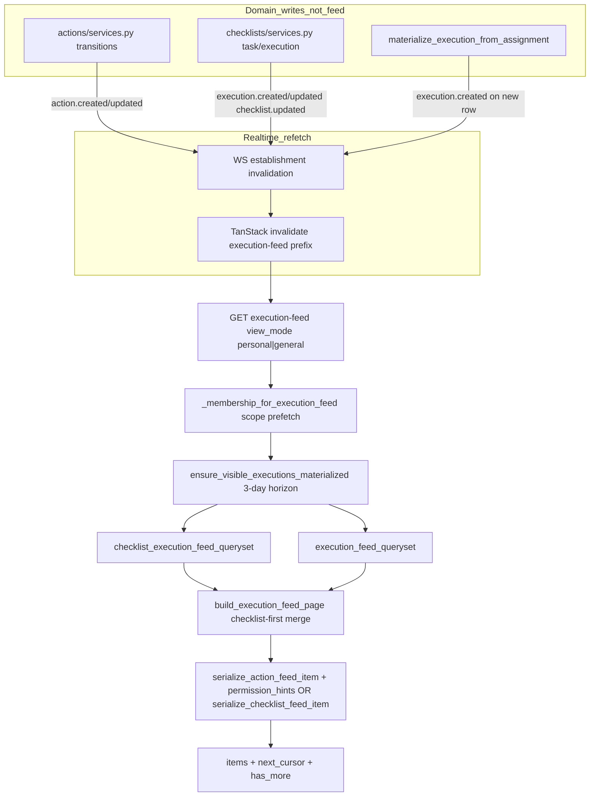

# Execution Feed Audit

Status: audit report  
Date: 2026-06-24  
Scope: Execution Feed read projection (polymorphic Actions + Checklists) — build, permissions, pagination, materialization-on-read, realtime/cache freshness, frontend — backend `actions/execution_feed.py`, `checklists/materialization.py`, related selectors/tests, and frontend `features/execution/` + `features/actions/`  
Mode: audit only — no source changes

Related: [Action Domain Consolidation](./action_consolidation.md) (ACT-01–ACT-10 handoff, ACT-04 deferred here), [Signal + Signal Feed Audit](./signal_feed_audit.md), [Feed Domain](../product/domains/feed_domain.md)

---

## Inspection manifest

### 1. Files inspected

**Contract and rules**

- `AGENTS.md`, `apps/api/AGENTS.md`, `apps/web/AGENTS.md`
- `.cursor/rules/10-backend-django-drf.mdc`, `80-security-data-integrity.mdc`

**Backend — execution feed core**

- `apps/api/houston/actions/api/urls.py` — `GET .../execution-feed/`
- `apps/api/houston/actions/api/views.py` — `ExecutionFeedView.get()`
- `apps/api/houston/actions/api/serializers.py` — `ExecutionFeedResponseSerializer`, `serialize_action_feed_item`, `serialize_action_permission_hints`
- `apps/api/houston/actions/execution_feed.py` — `build_execution_feed_page`, checklist-first merge, `_membership_for_execution_feed`
- `apps/api/houston/actions/execution_feed_cursor.py` — two-phase opaque cursors (checklist → action)
- `apps/api/houston/actions/selectors.py` — `execution_feed_queryset`, `action_personal_feed_q`, `action_general_feed_visibility_q`, `apply_execution_feed_sorting`
- `apps/api/houston/actions/constants.py` — `EXECUTION_FEED_STATUSES`
- `apps/api/houston/actions/permissions.py` — `is_action_assignee` (prefetch-aware), hint helpers

**Backend — checklist feed items**

- `apps/api/houston/checklists/selectors.py` — `checklist_execution_feed_queryset`, `checklist_assigned_to_me_feed_q`, `checklist_general_feed_visibility_q`, `apply_checklist_feed_sorting`
- `apps/api/houston/checklists/feed_serializers.py` — `serialize_checklist_feed_item`, `_progress_counts`
- `apps/api/houston/checklists/materialization.py` — `ensure_visible_executions_materialized`, `materialize_execution_from_assignment`
- `apps/api/houston/checklists/constants.py` — `EXECUTION_FEED_STATUSES`
- `apps/api/houston/checklists/permissions.py` — `build_checklist_visibility_scope_q`

**Backend — cross-domain**

- `apps/api/houston/establishments/membership_scope.py` — `build_action_visibility_scope_q`, `membership_scope_prefetch`
- `apps/api/houston/actions/services.py` — `sync_signal_after_action_change` (ACT-04 context)
- `apps/api/houston/realtime/broadcast.py`, `ws_payloads.py` — establishment invalidation
- `apps/api/houston/checklists/tasks.py` — `materialize_checklist_assignments_horizon_task` (daily beat)
- `apps/api/houston/testing/query_baseline.py` — `EXECUTION_FEED_*_MAX_QUERIES`

**Frontend**

- `apps/web/src/features/execution/pages/execution-feed-page.tsx` — page orchestration, view tabs, pagination UI
- `apps/web/src/features/execution/components/` — `execution-feed-tabs.tsx`, `execution-action-card.tsx`, `execution-checklist-card.tsx`, `execution-create-menu-sheet.tsx`
- `apps/web/src/features/execution/lib/` — `execution-feed-sections.ts`, `execution-action-sections.ts`, `execution-create-menu.ts`, `execution-feed-empty.ts`
- `apps/web/src/features/actions/hooks.ts` — `useExecutionFeedQuery` (infinite query)
- `apps/web/src/features/actions/api.ts` — `fetchExecutionFeed`, `actionsQueryKeys.feed`
- `apps/web/src/features/realtime/lib/apply-operational-invalidation.ts`
- `apps/web/src/lib/query-invalidation.ts` — `invalidateEstablishmentActionQueries`, `invalidateActionMutationSurfaces`

**Docs**

- `docs/product/domains/feed_domain.md` — authoritative feed contract (Execution Feed Phase 5/7)
- `docs/product/domains/action_domain.md` — action feed item rules (referenced)
- `docs/product/domains/checklist_domain.md` — checklist visibility §9 (referenced, not fully audited)
- `docs/audits/action_consolidation.md` — ACT-01 done, ACT-04 product gate

### 2. Tests inspected

| Area | Key files |
|------|-----------|
| Feed API + view modes (actions) | `actions/tests/test_execution_feed_api.py` — staff/manager/owner visibility, terminal exclusion, multi-assignee dedup, query baselines (empty + 3 actions) |
| Feed pagination | `actions/tests/test_execution_feed_pagination.py` — invalid cursor, action-only / checklist-only / mixed pages, phase transition, tie-breakers |
| Feed API (checklists) | `checklists/tests/test_execution_feed_checklist.py` — `visible_from`, overdue, terminal exclusion, merge semantics, Tuesday scenario, query baseline (1 checklist) — **staff/personal only, no manager/general** |
| Tenant isolation | `actions/tests/test_action_tenant_isolation_api.py` — `test_execution_feed_does_not_include_foreign_establishment_action` |
| Checklist selectors | `checklists/tests/test_selectors.py` — `checklist_execution_feed_queryset` unit tests |
| Materialization | `checklists/tests/test_materialization_services.py`, `checklists/tests/test_horizon_task.py` |
| Realtime invalidation | `realtime/tests/test_action_invalidation.py`, `realtime/tests/test_checklist_invalidation.py`, `realtime/tests/test_checklist_materialization_invalidation.py` |
| Query budget | `testing/query_baseline.py` + assertions in feed API tests |
| Frontend page | `execution/pages/execution-feed-page.test.tsx` — pagination UI, empty, load-more |
| Frontend lib | `execution/lib/execution-feed-sections.test.ts`, `execution-action-sections.test.ts`, `execution-create-menu.test.ts`, `execution-feed-empty.test.ts` |
| Frontend action card | `execution/components/execution-action-card.test.tsx` |
| Invalidation | `realtime/lib/apply-operational-invalidation.test.ts`, `lib/query-invalidation.test.ts`, `actions/hooks.mutations.test.ts`, `checklists/hooks.mutations.test.ts` |

Pytest and Vitest were not executed in this audit pass.

### 3. Docs / rules inspected

- `docs/product/domains/feed_domain.md` — merge policy, view modes, permission hints, frontend expectations
- `docs/audits/action_consolidation.md` — ACT-01 (feed N+1), ACT-04 (`signal.updated` cross-domain)
- `apps/api/AGENTS.md` — selectors own feed visibility; services own writes

### 4. Assumptions or unknowns

- **ACT-01 appears fixed** on the current branch: `is_action_assignee()` uses `assignee_links` prefetch when available (`permissions.py` L29–37); query baseline includes `EXECUTION_FEED_THREE_ACTIONS_MAX_QUERIES = 9`.
- Checklist command/detail behavior was **not** fully audited; only feed visibility, materialization, serialization, and invalidation paths were inspected.
- Staff **Ma vue** and **Vue globale** are intentionally identical for execution items (documented in `feed_domain.md` §7).
- `make backend-test` / `make verify` not run in this audit pass.
- Production assignment counts, materialization latency, and feed query explain plans not measured.

### Strengths (no action required)

- Clear layer split: selectors own visibility (`view_mode` + RBAC), `execution_feed.py` owns checklist-first merge and two-phase cursors, view serializes only.
- Strong pagination tests (mixed pages, phase transition checklist→action, tie-breakers).
- Tenant isolation tested on execution feed endpoint.
- Multi-assignee action dedup tested (`test_multi_assignee_action_appears_once_in_feed`).
- Realtime invalidation prefix `['actions', 'execution-feed', establishmentId]` covers both `personal` and `general` view modes.
- Frontend correctly passes `view_mode` to backend; no client-side visibility filtering.
- Action assignee prefetch on feed queryset; checklist progress via `Count` annotations (no per-row task queries when annotations present).

---

## 1. Current Execution Feed flow

### Read path

1. **Gate:** `IsAuthenticated` + `HasActiveMembership` on `ExecutionFeedView`; no dedicated `can_view_execution_feed` helper (active membership suffices).
2. **Materialization (synchronous):** `ensure_visible_executions_materialized` runs on every feed GET before querying — 3-day read horizon, 30-minute freshness gate per assignment.
3. **Visibility** (selectors, before serialization):
   - **Ma vue (`personal`):** Actions where user is `created_by` or assignee (all roles; Owner/Director **not** all establishment actions). Checklists where `assigned_to = me`.
   - **Vue globale (`general`):** Owner/Director → all establishment feed-visible items. Manager → own + scope-visible. Staff → created/assigned actions + assigned checklists only.
4. **Merge:** Checklists consume up to `page_size` slots first (`-last_activity_at`, `-created_at`, `-id`); Actions fill remaining slots (overdue → requires-me → status → `due_at` → `-last_activity_at`). Not a single cross-type interleave.
5. **Pagination:** Two-phase opaque cursor — checklist phase (`"0"`) then action phase (`"1"`) with frozen `as_of` for overdue rank stability.
6. **Response:** Polymorphic items `{ item_type: "action"|"checklist", action?, checklist? }` + `next_cursor` + `has_more`.

### Frontend read path

1. `useExecutionFeedQuery` — `useInfiniteQuery`, key `['actions', 'execution-feed', establishmentId, viewMode]`.
2. Pages flattened → `splitExecutionFeedItems` (checklists + actions) → `groupExecutionActionsBySection` (status buckets).
3. Render: all checklist cards first, then action groups (`pending_validation` → `todo` → `in_progress` → `done` → `canceled`).
4. Manual **Charger plus** → `fetchNextPage()` with opaque cursor.

### Realtime / cache freshness

| WS `subject_type` | Execution feed refetch? |
|-------------------|-------------------------|
| `action` | Yes (+ signal queries via `invalidateActionMutationSurfaces`) |
| `execution` | Yes (via `invalidateChecklistExecutionSurfaces`) |
| `checklist` | Yes (via `invalidateChecklistMutationSurfaces`) |
| `signal` | No (signal feed only) |
| Reconnect | Bulk invalidation includes execution feed |

Global TanStack defaults: `staleTime: 30_000`, `refetchOnWindowFocus: false`.

### Domain ownership assessment

Execution Feed logic is split across `actions/` (orchestration, action selectors, cursors, API view) and `checklists/` (checklist selectors, materialization, checklist serializers). This is intentional for the polymorphic feed — no separate feed Django app. Checklist materialization is the main cross-domain coupling on the read path.

**Overall:** Architecture is sound for MVP. Main risks are synchronous materialization-on-read (latency/scalability), uneven test coverage for manager Vue globale checklist visibility, and frontend create-button vs hints mismatch.

---

## 2. Findings

### EF-01 — Synchronous materialization-on-read on every feed GET

- **Severity:** P1
- **Category:** scalability / performance
- **Evidence:** `build_execution_feed_page()` in `apps/api/houston/actions/execution_feed.py` L213–216 calls `ensure_visible_executions_materialized(membership=..., view_mode=...)` unconditionally before querying action or checklist querysets
- **Problem:** Every execution feed request triggers lazy checklist materialization for all visible assignments in a 3-day horizon (`READ_PATH_MATERIALIZATION_HORIZON_DAYS = 3`, `materialization.py` L38–39), even when the establishment has no checklist assignments or the user only needs action items.
- **Why it matters now:** Feed is the primary operational surface; p95 latency grows with assignment count and is unpredictable per request.
- **Why it will hurt later:** Establishments with many recurring assignments will see multi-second feed loads; materialization work is not bounded by `page_size` and cannot be cached at the HTTP layer.
- **Recommended fix:** Decouple materialization from the hot read path — options: (A) skip when no active assignments match visibility Q; (B) move read-horizon materialization to Celery beat scoped to establishments with recent feed activity; (C) materialize only on first checklist cursor phase, not before action-only pages. Preserve `visible_from` semantics.
- **Tests to add/update:** Latency/integration test with N assignments (e.g. 20 recurring) asserting feed GET query count and response time ceiling; test action-only establishment skips materialization queries.
- **Suggested implementation size:** M–L

### EF-02 — Per-assignment DB work inside materialization loop

- **Severity:** P2
- **Category:** performance
- **Evidence:** `ensure_visible_executions_materialized()` in `checklists/materialization.py` L393–428 — `for assignment in assignments.select_related(...)`: per assignment calls `_existing_occurrence_dates_for_assignment` (L411–414) and possibly `materialize_execution_from_assignment` per occurrence date (L416–422)
- **Problem:** Materialization performs O(assignments × occurrences) database work synchronously inside the feed request, with freshness checks (`_assignment_read_path_materialization_is_fresh`, L404–409) that themselves query existing dates.
- **Why it matters now:** Compounds EF-01; even "fresh" assignments incur existence checks unless the 30-minute gate passes.
- **Why it will hurt later:** Weekly/daily recurring assignments across multiple BUs multiply queries; connection pool pressure under concurrent feed loads.
- **Recommended fix:** Batch `_existing_occurrence_dates_for_assignment` across assignments in one query; defer non-visible-window occurrences; rely more on daily beat (`MATERIALIZATION_HORIZON_DAYS = 14`) for pre-creation.
- **Tests to add/update:** Query-count test for establishment with 5+ active assignments on feed GET; assert flat or bounded query growth after batching.
- **Suggested implementation size:** M

### EF-03 — Manager Vue globale checklist visibility untested at feed API

- **Severity:** P2
- **Category:** tests / ambiguity
- **Evidence:** Actions: `test_manager_sees_free_action_in_responsible_scope_only_in_general_view` in `actions/tests/test_execution_feed_api.py` L153; Checklists: `checklists/tests/test_execution_feed_checklist.py` — grep shows staff/personal scenarios only, **no `general` + manager** cases. Selector logic exists: `checklist_general_feed_visibility_q` in `checklists/selectors.py` L175–190 uses `build_checklist_visibility_scope_q` (BU snapshot on execution).
- **Problem:** Polymorphic feed has asymmetric regression coverage — manager scope rules for actions are API-tested; checklist in-scope execution assigned to another user in Vue globale is not.
- **Why it matters now:** A selector refactor in checklist visibility could break manager supervision view without failing CI.
- **Why it will hurt later:** As checklist adoption grows, manager Vue globale becomes the supervision surface; silent visibility regressions are high-impact.
- **Recommended fix:** Add API test: manager with BU scope sees checklist execution in that BU assigned to staff, in `view_mode=general`; out-of-scope BU execution excluded.
- **Tests to add/update:** `test_manager_sees_in_scope_checklist_assigned_to_staff_in_general_view` in `test_execution_feed_checklist.py` or shared feed test module.
- **Suggested implementation size:** S

### EF-04 — Create `+` button gated by role, menu gated by hints

- **Severity:** P2
- **Category:** ambiguity / API contract
- **Evidence:** `execution-feed-page.tsx` L47–49 — `canCreate = canOpenExecutionCreateMenu(role)`; `execution-create-menu.ts` L57–59 — `canOpenExecutionCreateMenu` returns `Boolean(role)`; sheet uses `getBootstrapPermissionHints` for menu options (L51–62, L72–74). `feed_domain.md` §9 documents target RBAC: Action entry Owner/Director/Manager only; Staff Checklist → « Lancer pour moi » only.
- **Problem:** Any member with a role sees the `+` button; users with `can_create_action: false` still get the affordance and open a sheet that may only offer Checklist.
- **Why it matters now:** Confusing UX — empty or partial create menu after tapping `+`.
- **Why it will hurt later:** As RBAC tightens per establishment, the mismatch between button visibility and authorized create paths will generate support noise.
- **Recommended fix:** Gate `canCreate` on bootstrap hints union: `can_create_action || can_create_checklist_template || can_use_registered_checklist` (exact keys per bootstrap contract); hide `+` when no create path is available.
- **Tests to add/update:** Page or `execution-create-menu` test: staff with all create hints false → no `+` button; manager with `can_create_action` only → `+` visible.
- **Suggested implementation size:** S

### EF-05 — Asymmetric permission hints: Actions yes, Checklists no

- **Severity:** P2
- **Category:** API contract / ambiguity
- **Evidence:** `serialize_action_feed_item` in `actions/api/serializers.py` L288–291 includes `permission_hints` via `serialize_action_permission_hints`; `serialize_checklist_feed_item` in `checklists/feed_serializers.py` — no hints field. `feed_domain.md` L67: "Checklist items use safe summaries without per-item hints in MVP."
- **Problem:** Action cards can show validation-aware copy (`can_validate` in `execution-action-card.tsx` L57); checklist cards have no equivalent feed-level hints for task actions, cancel, or launch affordances.
- **Why it matters now:** Inconsistent UX on the unified execution surface; operators cannot distinguish "I can act" vs "view only" on checklist cards without opening detail.
- **Why it will hurt later:** If inline checklist actions are added to feed cards, hints will need to be retrofitted; detail-page hint logic (`build_checklist_execution_permission_hints`) would need feed-safe subset.
- **Recommended fix:** Product decision — (A) defer and document (current MVP), or (B) add minimal checklist feed hints (`can_mark_task_done`, `can_cancel`) mirroring detail helpers. Keep hints UX-only.
- **Tests to add/update:** If (B): API contract test for checklist feed item `permission_hints` shape; frontend card test for hint-gated labels.
- **Suggested implementation size:** S (document) or M (implement hints)

### EF-06 — No API regression test for action `permission_hints` on execution feed

- **Severity:** P2
- **Category:** tests
- **Evidence:** `permission_hints` tested on transition/detail APIs (`actions/tests/test_action_transitions_api.py` L62–73, L200); no assertion on `GET execution-feed/` response. `execution-feed-page.test.tsx` mocks hints in fixture data but does not validate API contract.
- **Problem:** Feed is the primary surface rendering `permission_hints` on cards; API shape drift would not fail CI.
- **Why it matters now:** Low immediate risk if serializers are stable, but hints drive pending-validation label copy.
- **Why it will hurt later:** Hint key additions/removals for new action commands would ship without feed regression detection.
- **Recommended fix:** Add API test: staff assignee on open action in personal feed → response includes `permission_hints` with expected keys (`can_accept`, `can_mark_done`, `can_validate`, `is_assignee`, etc.).
- **Tests to add/update:** `test_execution_feed_action_item_includes_permission_hints` in `test_execution_feed_api.py`.
- **Suggested implementation size:** S

### EF-07 — Query baseline gaps for realistic feed shapes

- **Severity:** P2
- **Category:** performance / tests
- **Evidence:** `testing/query_baseline.py` L19–26 — ceilings for empty feed (8), 1 checklist (11), 3 actions (9); no mixed checklist+action page, no materialization-heavy establishment, no combined populated feed test after EF-01/EF-02 changes.
- **Problem:** Query budget guards cover narrow fixture shapes; regressions from materialization loop growth or mixed-page serialization would not be caught.
- **Why it matters now:** Baselines exist and are valuable for empty/single-type cases.
- **Why it will hurt later:** As feed complexity grows (more annotations, hints, materialization), silent query inflation degrades production latency without CI signal.
- **Recommended fix:** After EF-01/EF-02 assessment, add baselines for: (1) mixed page (2 checklists + 3 actions), (2) establishment with 5 active assignments (materialization path). Set ceilings from measured pytest output.
- **Tests to add/update:** `test_execution_feed_query_count_mixed_page`, `test_execution_feed_query_count_materialization_heavy` in feed API tests.
- **Suggested implementation size:** S

### EF-08 — Checklist items can be absent until read-path materialization

- **Severity:** P2
- **Category:** scalability / realtime
- **Evidence:** `visible_from = start_at - 1 hour` for assignment-sourced executions (`feed_domain.md` §7); `ensure_visible_executions_materialized` creates rows lazily (`materialization.py` L372–428); daily beat uses 14-day horizon (`MATERIALIZATION_HORIZON_DAYS`); `realtime/tests/test_checklist_materialization_invalidation.py` — `execution.created` only on new row; idempotent path (`IntegrityError`) emits no invalidation (`materialization.py` race comment ~L228).
- **Problem:** A recurring checklist execution may not appear in any user's feed until someone triggers read-path materialization or the daily beat runs. Other users won't receive WS invalidation until `execution.created` fires.
- **Why it matters now:** Acceptable for MVP with small teams and active feed users; edge case for overnight/pre-shift visibility windows.
- **Why it will hurt later:** Multi-shift operations expect checklist items to appear in Vue globale before the assigned user's first feed open; supervisors may not see upcoming work.
- **Recommended fix:** Strengthen beat frequency or establishment-scoped pre-materialization for assignments entering `visible_from` window; optional proactive `execution.created` from beat task (already partially done in horizon task).
- **Tests to add/update:** Integration test: assignment enters visibility window → beat materializes → manager general feed includes item without assignee opening feed.
- **Suggested implementation size:** M

### EF-09 — Frontend silently drops feed items on status drift

- **Severity:** P2
- **Category:** maintainability
- **Evidence:** `splitExecutionFeedItems` in `execution-feed-sections.ts` L20–32 — items excluded when `getChecklistFeedSection` or `getExecutionActionSection` returns `null` (terminal/unknown statuses). Comment L14: "Excludes terminal checklists and unmappable entries."
- **Problem:** If backend adds a new feed-visible status or API contract drifts, items vanish from UI without error state or telemetry.
- **Why it matters now:** Backend and frontend status sets align (`EXECUTION_FEED_STATUSES` on both sides); defense-in-depth is working.
- **Why it will hurt later:** New lifecycle states (e.g. `paused`) would require coordinated backend + frontend updates; silent drop masks partial rollouts.
- **Recommended fix:** In dev/staging, log or surface count mismatch when `feedItems.length !== checklistItems.length + actionItems.length`; or add strict mode test asserting no dropped items for known status sets.
- **Tests to add/update:** Contract test: every API item type/status in `EXECUTION_FEED_STATUSES` maps to a non-null section; unknown status test documents explicit drop behavior.
- **Suggested implementation size:** S

### EF-10 — ACT-04: `sync_signal_after_action_change` omits `signal.updated` (cross-domain freshness)

- **Severity:** P2
- **Category:** ambiguity (product)
- **Evidence:** `sync_signal_after_action_change` in `actions/services.py` L138+ mutates linked Signal (resolve/reopen) with no `_schedule_signal_invalidation`; action transitions schedule `action.updated` only (e.g. L367–368). `invalidateActionMutationSurfaces` in `query-invalidation.ts` L51–57 also invalidates signal queries on action WS events. Documented in `action_consolidation.md` §3 as **ACT-04** — product decision pending.
- **Problem:** Execution Feed is **not directly affected** — action WS events trigger execution feed refetch. Signal Feed clients that listen only to `subject_type: signal` could miss linked-signal status changes when terminal action sync runs without a separate signal invalidation.
- **Why it matters now:** Frontend mitigates via action invalidation coupling; low risk for current Houston UI (users on execution feed see action changes).
- **Why it will hurt later:** WS-only consumers, third-party integrations, or Signal Feed–only views become stale on linked-action terminal transitions.
- **Recommended fix:** Product decision per `action_consolidation.md` — **recommended: backend emit `signal.updated`** from `sync_signal_after_action_change` when Signal status/pin changes. Alternative: document that Signal Feed must also subscribe to `action` invalidation events.
- **Tests to add/update:** `test_sync_signal_after_action_change_emits_signal_updated` in realtime tests (after product sign-off).
- **Suggested implementation size:** S–M

---

## 3. Prioritization

### Top 3 fixes to do first

1. **EF-01** — Bound or decouple materialization from every feed GET (highest scalability impact on the primary operational surface).
2. **EF-03 + EF-06** — Add manager general checklist visibility API test and action `permission_hints` feed contract test (cheap regression guards for polymorphic feed).
3. **EF-04** — Align `+` button visibility with bootstrap permission hints (S-sized frontend fix, matches `feed_domain.md` target).

### Quick wins

- **EF-06:** Single API test asserting `permission_hints` keys on action feed items.
- **EF-04:** Replace `canOpenExecutionCreateMenu(role)` with hints-based gate.
- **EF-07:** Add one mixed-page query baseline after EF-01/02 assessment.

### Structural issues to plan later

- **EF-01 / EF-02:** Move materialization off hot read path (Celery/event-driven, batched existence checks).
- **EF-05:** Checklist feed permission hints if product wants parity with action cards.
- **EF-08:** Proactive materialization before `visible_from` for multi-shift supervision.
- **EF-10 (ACT-04):** Backend `signal.updated` emission strategy for linked-action terminal sync.

### Things not worth fixing now

- Action cursor `as_of` drift between paginated fetches — documented tradeoff in `execution_feed_cursor.py` L3–5; deferred in action consolidation.
- Frontend action re-grouping by status section — intentional Kanban-style UX per `feed_domain.md` §9/§10.
- Broad TanStack prefix invalidation of both view modes — acceptable at MVP scale.
- Duplicate feed rows — low risk; query projection + multi-assignee dedup test exist.
- Label "Vue globale" vs "Vue générale" — cosmetic; consistent with signal feed tabs.
- `execution-feed-empty.test.ts` uses invalid view mode `'establishment'` — type-incorrect fixture, falls through to general message; cleanup when touching tests.

---

## 4. Cross-reference: Action consolidation handoff

| Prior finding | Status in Execution Feed audit |
|---------------|-------------------------------|
| **ACT-01** (feed permission-hint N+1) | **Addressed** — `is_action_assignee()` prefetch-aware; `EXECUTION_FEED_THREE_ACTIONS_MAX_QUERIES = 9` |
| **ACT-04** (`signal.updated` on linked sync) | **EF-10** — product decision pending; execution feed mitigated via action invalidation |
| **ACT-02** (service-layer auth on mark-done/validate) | Out of feed scope; affects detail/commands, not feed projection |
| **SIG-02** (feed scope vs actionability) | Echo risk for manager Vue globale — actions use affected∪responsible scope for linked items (`build_action_visibility_scope_q`); checklists use execution snapshot BU only. Not a feed bug; document asymmetry if product expects identical supervision rules |

---

## Changed

- Created `docs/audits/execution_feed_audit.md` (audit report only).

## Validated

- Code and test inspection across backend execution feed, checklist materialization, realtime invalidation, and frontend execution feed surfaces (read-only; no pytest/vitest execution).

## Risks / not verified

- Runtime query counts and latency under materialization-heavy establishments not measured.
- Product sign-off on EF-05 (checklist hints) and EF-10 (ACT-04) not obtained.
- Full checklist domain command surface not audited beyond feed impact.
