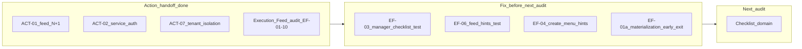

# Execution Feed — Audit Consolidation

Status: consolidation report  
Date: 2026-06-24  
Mode: consolidation only — no source changes

## Sources

| Audit | File | Findings |
|-------|------|----------|
| Execution Feed | [`execution_feed_audit.md`](./execution_feed_audit.md) | EF-01–EF-10 |
| Action domain (context + handoff) | [`action_consolidation.md`](./action_consolidation.md) | ACT-01–ACT-10, Phase 2 status |
| Signal + Signal feed (context) | [`signal_feed_audit.md`](./signal_feed_audit.md) | SIG-01–SIG-10 |

**Branch context:** Action pre-audit quick fixes (ACT-01, ACT-02, ACT-05, ACT-06, ACT-09) and Phase 2 items (ACT-07, ACT-08 minimal) appear implemented on the current branch. Execution Feed audit confirms ACT-01 (prefetch-aware `is_action_assignee`, populated query baseline). ACT-04 was intentionally deferred to this consolidation as EF-10.

---

## 1. Audit read

### Execution Feed audit (2026-06-24)

Audited the polymorphic Execution Feed end-to-end: `build_execution_feed_page` checklist-first merge, two-phase cursor pagination, Action + Checklist visibility (`view_mode=personal|general`), synchronous materialization-on-read (`ensure_visible_executions_materialized`), action `permission_hints` on feed items, realtime/cache invalidation, and frontend `features/execution/` + `features/actions/hooks.ts`.

**Findings:** 0 P0, 1 P1, 9 P2 (EF-01–EF-10).

**Strengths (no action):** Clear layer split — selectors own visibility, `execution_feed.py` owns merge/pagination, view serializes only. Strong pagination and tenant-isolation tests. Multi-assignee action dedup tested. Realtime invalidation prefix `['actions', 'execution-feed', establishmentId]` covers both view modes. Frontend delegates filtering to backend via `view_mode` only. ACT-01 feed N+1 addressed on branch.

**Main risk themes:** Synchronous materialization on every feed GET (EF-01/EF-02); uneven manager checklist visibility test coverage vs actions (EF-03); create `+` gated by `Boolean(role)` instead of capability hints (EF-04); checklist feed items lack per-item hints (EF-05, documented MVP); cross-domain Signal staleness on linked-action terminal sync (EF-10 / ACT-04).

### Action consolidation handoff

| Prior item | Status on branch |
|------------|------------------|
| ACT-01 feed permission-hint N+1 | **Done** — prefetch-aware `is_action_assignee`; `EXECUTION_FEED_THREE_ACTIONS_MAX_QUERIES = 9` |
| ACT-02 service auth (mark-done/validate) | **Done** |
| ACT-05 `sync_signal_after_action_change` tests | **Done** |
| ACT-06 doc sync (assignee semantics) | **Done** |
| ACT-07 Action tenant isolation API suite | **Done** |
| ACT-08 `accepted_by` on feed card | **Partial (minimal)** — footer display only |
| ACT-09 populated feed query baseline | **Done** |
| ACT-03 reassign + due-at UI | **Deferred** |
| ACT-04 `signal.updated` on linked sync | **Deferred** → **EF-10** in execution feed audit |
| ACT-10 dead `ActionPermissionError` | **Closed** — in use after ACT-02 |

Open Signal **product** items (SIG-01 detail scope, SIG-02 feed vs command actionability) remain unresolved. Execution Feed audit notes a SIG-02 echo: manager Vue globale uses different BU rules for Actions (affected ∪ responsible for linked) vs Checklists (execution snapshot BU only).



---

## 2. Findings to fix now

**Criteria:** P0/P1 **S-sized** slices, or high-ROI **S** fixes that do **not** require product sign-off.

| ID | Severity | Size | Action | Tests |
|----|----------|------|--------|-------|
| **EF-03** | P2 | S | API test: manager with BU scope sees in-scope checklist execution assigned to staff in `view_mode=general`; out-of-scope BU execution excluded | `test_manager_sees_in_scope_checklist_assigned_to_staff_in_general_view` in [`checklists/tests/test_execution_feed_checklist.py`](../../apps/api/houston/checklists/tests/test_execution_feed_checklist.py) |
| **EF-06** | P2 | S | API test: action feed item includes `permission_hints` with expected keys | `test_execution_feed_action_item_includes_permission_hints` in [`actions/tests/test_execution_feed_api.py`](../../apps/api/houston/actions/tests/test_execution_feed_api.py) |
| **EF-04** | P2 | S | Gate the `+` menu from backend/bootstrap **capability hints** and the existing checklist-use path — not from `Boolean(role)`. Align [`execution-feed-page.tsx`](../../apps/web/src/features/execution/pages/execution-feed-page.tsx) and [`execution-create-menu.ts`](../../apps/web/src/features/execution/lib/execution-create-menu.ts) with hints already used inside the create sheet; preserve Staff access to « Utiliser une checklist existante » per [`feed_domain.md`](../product/domains/feed_domain.md) §9 | Extend [`execution-create-menu.test.ts`](../../apps/web/src/features/execution/lib/execution-create-menu.test.ts); optional page test |
| **EF-01a** | P1 | S | **Partial EF-01:** skip `ensure_visible_executions_materialized` when no active assignments are visible for the current membership/`view_mode` — **only if** the early-exit can reuse existing checklist visibility/query helpers (e.g. materialization visibility Q or assignment queryset already in [`checklists/materialization.py`](../../apps/api/houston/checklists/materialization.py)). **Do not duplicate** complex checklist visibility rules inside [`execution_feed.py`](../../apps/api/houston/actions/execution_feed.py). If reuse is not possible without copying rules, **defer EF-01a to the Checklist domain audit** | Feed GET on action-only establishment: assert materialization path not entered (query-count or behavioral assertion) |

**Caution (EF-01a):** The early-exit is a bounded optimization, not a substitute for EF-01 full decouple. Implementation must call shared checklist selectors/permissions helpers — not inline a second visibility matrix in the actions app.

**Explicitly not in fix-now** (blocked on product, M/L size, or Checklist audit):

- **EF-01 full** — decouple materialization from hot read path (M–L)
- **EF-02** — batch per-assignment materialization loop queries (M)
- **EF-07** — mixed/heavy query baselines (S, but after EF-01/EF-02 work)
- **ACT-03**, **ACT-04 / EF-10** — product + architecture decisions

---

## 3. Findings needing product decision

| ID | Question | Options | Default recommendation |
|----|----------|---------|------------------------|
| **EF-10 / ACT-04** | When `sync_signal_after_action_change` mutates a linked Signal, how should cross-surface freshness work? | **(A)** Backend emits `signal.updated` (or schedules signal invalidation) when Action sync changes Signal status/pin — **(B)** Frontend relies on `action.updated` invalidation to refresh Signal queries (current Houston coupling via `invalidateActionMutationSurfaces`) | **(A) backend emit** — cleaner realtime contract; fixes WS-only Signal Feed clients that do not subscribe to `action` events. Execution Feed is already mitigated under (B). |
| **EF-05** | Add checklist `permission_hints` on execution feed items? | Defer (documented MVP) vs minimal feed hints (`can_mark_task_done`, `can_cancel`, etc.) | **Defer** — matches [`feed_domain.md`](../product/domains/feed_domain.md) L67 |
| **SIG-02 echo** | Manager Vue globale: action scope (affected ∪ responsible for linked) vs checklist scope (execution snapshot BU only) — intentional asymmetry? | Align supervision rules vs document as domain difference | **Document** unless product wants identical manager supervision semantics |
| **ACT-03** | Ship reassign + due-at UI now or defer? | (carry forward from action consolidation) | **Reassign first** |
| **ACT-08** | Multi-assignee UX beyond minimal `accepted_by` footer on feed cards? | Keep backend model + more surfacing vs single-assignee product change | **Keep backend model** |
| **SIG-01** | Signal detail wider than Ma zone personal feed? | Enforce scope on detail vs deep-link model | **(B) document** — from signal consolidation |

**Tests to add after product decides:**

| ID | Test |
|----|------|
| EF-10 / ACT-04 | Realtime: `sync_signal_after_action_change` emits `signal.updated` when Signal status/pin changes (if option A) |
| EF-05 | API contract for checklist feed `permission_hints` shape (if hints added) |
| ACT-03 | Component tests for hint-gated reassign/due-at; integration reassign flow |
| SIG-01 | API: scoped Manager/Staff reads signal outside personal scope — 200 or 404 per decision |
| SIG-02 | API: manager affected-only scope — feed 200, commands 403; hints false on detail |

---

## 4. Findings to defer

| ID | Size | Source | Rationale |
|----|------|--------|-----------|
| **EF-01** (full) | M–L | Execution feed audit | Move materialization off hot read path; Celery/beat strategy; preserve `visible_from` semantics |
| **EF-01a** | S | Execution feed audit | **Defer to Checklist audit** if early-exit cannot reuse existing visibility helpers without duplicating rules in `execution_feed.py` |
| **EF-02** | M | Execution feed audit | Batch `_existing_occurrence_dates_for_assignment`; pairs with EF-01 |
| **EF-07** | S | Execution feed audit | Mixed/heavy query baselines — measure after materialization work |
| **EF-08** | M | Execution feed audit | Proactive pre-`visible_from` materialization for multi-shift supervision |
| **ACT-03** | M | Action consolidation | Reassign/due-at detail UI; hooks exist, no components |
| **ACT-04 / EF-10** | S–M | Action + execution feed | Product + architecture decision on signal invalidation contract |
| **Checklist domain (full)** | L | Execution feed audit scope | Commands, detail, assignments, permissions beyond feed projection — root cause home for EF-01/EF-02/EF-08 |

---

## 5. Findings to ignore for now

- Action cursor `as_of` drift between paginated fetches — documented tradeoff in [`execution_feed_cursor.py`](../../apps/api/houston/actions/execution_feed_cursor.py); deferred in action consolidation
- Frontend action re-grouping by status section — intentional Kanban-style UX per [`feed_domain.md`](../product/domains/feed_domain.md) §9/§10
- Broad TanStack prefix invalidation of both `personal` and `general` view modes — acceptable at MVP scale
- Duplicate feed rows — low risk; query projection + multi-assignee dedup test exist
- Label « Vue globale » vs « Vue générale » — cosmetic; consistent with signal feed tabs
- `execution-feed-empty.test.ts` invalid `'establishment'` view mode — type-incorrect fixture; cleanup when touching tests
- **EF-09** silent drop of unknown statuses in [`execution-feed-sections.ts`](../../apps/web/src/features/execution/lib/execution-feed-sections.ts) — defense-in-depth while backend/frontend status sets align; optional contract test only if touching sections
- ACT-10 — closed on branch

---

## 6. Recommended next audit

**Primary: Checklist domain** — including checklist materialization services and read-path interaction with Execution Feed.

Scope:

- [`checklists/services.py`](../../apps/api/houston/checklists/services.py) — assignment lifecycle, task commands, execution create/cancel
- [`checklists/materialization.py`](../../apps/api/houston/checklists/materialization.py) — read-path vs beat (`materialize_checklist_assignments_horizon_task`), visibility Q reuse for EF-01a
- [`checklists/permissions.py`](../../apps/api/houston/checklists/permissions.py) — command vs feed visibility parity
- [`checklist_domain.md`](../product/domains/checklist_domain.md) §5–§9 vs implementation
- Manager/staff RBAC for commands vs Vue globale feed visibility (SIG-02 echo)

Rationale:

- Execution Feed audit scoped checklist to feed visibility, materialization side effects, and invalidation only — not commands or detail.
- EF-01, EF-02, EF-08 root causes live in checklist materialization; EF-01a may belong here if early-exit cannot reuse helpers from the actions app.
- EF-03 test gap shows checklist Vue globale needs deeper API coverage beyond feed merge tests.

**Secondary (after Checklist):** Notifications matrix — action + checklist execution lifecycle events vs [`notification_matrix_v0.2.md`](../product/notification_matrix_v0.2.md) (deferred from action consolidation §6).

---

## 7. Short Cursor implementation prompt

```
Implement pre–Checklist-audit Execution Feed quick fixes only.
No product RBAC changes. No ACT-04 / signal.updated work.

1. EF-03: Add test_manager_sees_in_scope_checklist_assigned_to_staff_in_general_view
   in houston/checklists/tests/test_execution_feed_checklist.py
   (manager BU scope, execution assigned to staff, view_mode=general; negative out-of-scope).

2. EF-06: Add test_execution_feed_action_item_includes_permission_hints in
   houston/actions/tests/test_execution_feed_api.py
   (staff assignee, personal feed, assert permission_hints keys).

3. EF-04: Gate the + menu from bootstrap capability hints and the existing
   checklist-use path — not Boolean(role). Update execution-create-menu.ts,
   execution-feed-page.tsx, and execution-create-menu.test.ts.
   Preserve Staff checklist-use affordance per feed_domain.md §9.

4. EF-01a (only if safe): Skip ensure_visible_executions_materialized when no
   active assignments match visibility for membership/view_mode — by reusing
   existing checklist visibility/query helpers from materialization.py or
   selectors. Do NOT duplicate checklist visibility rules in execution_feed.py.
   If reuse is not possible without copying rules, skip EF-01a and note deferral
   to Checklist audit. If implemented, add query-count test for action-only
   establishment.

Do NOT implement EF-01 full decouple, EF-02 batching, EF-05 checklist hints,
or ACT-04 signal.updated invalidation.

Validate: make backend-test on test_execution_feed_api.py,
test_execution_feed_checklist.py; cd apps/web && npm test on
execution-create-menu.test.ts.
```

---

## Summary

| Metric | Count |
|--------|-------|
| Source audits referenced | 3 (execution feed + action consolidation + signal audit context) |
| Execution feed findings | 10 (0 P0, 1 P1) |
| Fix now (no product gate) | 4 (EF-03, EF-04, EF-06, EF-01a conditional) |
| Product + architecture decisions | 6 (EF-10/ACT-04, EF-05, SIG-02 echo, ACT-03, ACT-08, SIG-01) |
| Defer | 8 |
| Ignore | 8 |

**Top 3 before Checklist audit:**

1. **EF-03 + EF-06** — regression tests for manager checklist Vue globale and feed `permission_hints` (S, zero product risk).
2. **EF-04** — gate `+` from capability hints and checklist-use path, not `Boolean(role)` (S frontend).
3. **EF-01a** — materialization early-exit **only** via reused checklist helpers; otherwise defer to Checklist audit (S slice of P1).

---

## Changed

- Created `docs/audits/execution_feed_consolidation.md`.

## Validated

- Consolidation derived from [`execution_feed_audit.md`](./execution_feed_audit.md) and [`action_consolidation.md`](./action_consolidation.md); no application source code modified.

## Risks / not verified

- `make backend-test` / `make verify` not executed for this consolidation pass.
- EF-01a feasibility (helper reuse without rule duplication) not verified in code — implementer must confirm before shipping.
- Product confirmation of EF-10/ACT-04, EF-05, ACT-03, ACT-08, SIG-01, SIG-02 not obtained.
