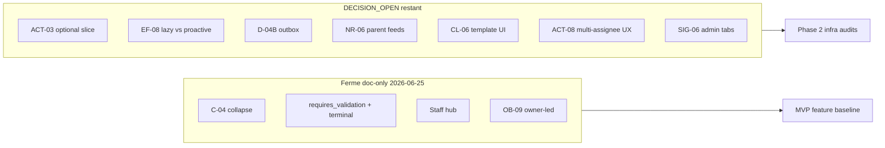

# Feature Audit Decision Pack

Status: decision pack  
Date: 2026-06-25  
Mode: audit only — no source changes  
Last updated: 2026-06-25 (doc-only MVP closures)

## Périmètre et exclusions

Ce document reprend les 12 items `DECISION_OPEN` d’origine du registre [`feature_audit_closure.md`](./feature_audit_closure.md). **5 fermés doc-only** (2026-06-25) ; **7 restent ouverts**.

**Inclus :** problème concret, options, recommandation MVP, impacts, phase de reprise, statut de fermeture.

**Exclu :**
- Items `FIXED`, `WONT_FIX_NOW` — pas de réouverture
- Items `DEFER_PHASE_2` — pas de plan d’implémentation
- Toute modification de code applicatif

Phase dev uniquement — pas d’exigence staging/prod.

## Sources lues

| Catégorie | Fichiers |
|-----------|----------|
| Contrat | [`AGENTS.md`](../../AGENTS.md), [`apps/api/AGENTS.md`](../../apps/api/AGENTS.md), [`apps/web/AGENTS.md`](../../apps/web/AGENTS.md) |
| Registre | [`feature_audit_closure.md`](./feature_audit_closure.md) |
| Domaines produit | [`action_domain.md`](../product/domains/action_domain.md), [`checklist_domain.md`](../product/domains/checklist_domain.md), [`feed_domain.md`](../product/domains/feed_domain.md), [`observation_domain.md`](../product/domains/observation_domain.md), [`ai_observation_pipeline_contract.md`](../product/domains/ai_observation_pipeline_contract.md), [`runtime_config_onboarding_domain.md`](../product/domains/runtime_config_onboarding_domain.md) |

## Hypothèses

- 5/12 décisions fermées **doc-only** le 2026-06-25 ; registre closure aligné (`DECISION_OPEN` = 7).
- Les 7 décisions restantes = défauts consolidations — non validées par produit hors doc.
- Enum `NOT_ACTIONABLE` peut subsister en code — hors scope doc-only.

---

## Décisions fermées (doc-only MVP — 2026-06-25)

| ID | Décision MVP | Doc mis à jour |
|----|--------------|----------------|
| **C-04 / OR-05** | Collapse docs → `no_signal_created` (drift contrat/doc/code, pas feature) | `observation_domain.md` §6, `ai_observation_pipeline_contract.md` |
| **requires_validation** | Immutable après create | `action_domain.md` §2 |
| **Terminal action visibility** | Detail-only ; hors Execution Feed actif | `action_domain.md` §6, `feed_domain.md` §7 |
| **Staff hub checklist** | Nav read-only intentionnelle pour active Staff | `checklist_domain.md` §5.16 |
| **OB-09** | Owner-led draft ; director-led = post-MVP | `runtime_config_onboarding_domain.md` §7 |

---

## Tableau de décisions

| ID | Statut | Problème concret | Recommandation MVP | Phase de reprise |
|----|--------|------------------|-------------------|------------------|
| **C-04 / OR-05** | **DECISION_CLOSED** | Drift enum/docs vs `apply_pipeline_output` | Collapse → `no_signal_created` | Fermé doc 2026-06-25 |
| **requires_validation** | **DECISION_CLOSED** | Flag create sans immutabilité explicite en doc | Immutable après create | Fermé doc 2026-06-25 |
| **Terminal action visibility** | **DECISION_CLOSED** | Exclusion feed actions terminales peu explicite | Detail-only | Fermé doc 2026-06-25 |
| **Staff hub checklist** | **DECISION_CLOSED** | Contrat nav Profil vs RBAC Staff | Read-only bibliothèque active Staff | Fermé doc 2026-06-25 |
| **OB-09** | **DECISION_CLOSED** | Owner-only draft vs director activation | Owner-led draft documenté | Fermé doc 2026-06-25 |
| **ACT-03** | **DECISION_OPEN** | Backend reassign/due-at + hooks ; pas de UI detail | Reassign first ; due-at ensuite | MVP product slice optionnelle ; non requis avant phase 2 |
| **ACT-08** | **DECISION_OPEN** | Multi-assignee ; footer `accepted_by` minimal | Garder footer minimal | Post-MVP polish (S) |
| **CL-06** | **DECISION_OPEN** | activate/deactivate backend ; pas de UI | Defer UI | Post-MVP UI (S) |
| **EF-08 / CL-04** | **DECISION_OPEN** | Lazy materialization pre-`visible_from` | Accepter lazy pilote | Post-MVP / phase 2 infra (R3) |
| **NR-06 / D-02** | **DECISION_OPEN** | `comment.*` n’invalide pas parent feeds | Threads commentaires only | Post-MVP (S) |
| **D-04B** | **DECISION_OPEN** | Pas de retry/outbox notifications | Log only | Phase 2 infra / Lot2 |
| **SIG-06** | **DECISION_OPEN** | Admin Ma zone ≡ Vue globale | Unifier labels ; hide toggle optionnel | Post-MVP polish (S) |

---

## Recommandation par défaut MVP (7 ouvertes)

| ID | Défaut MVP |
|----|------------|
| ACT-03 | Reassign UI first ; due-at defer (slice optionnelle) |
| ACT-08 | Footer minimal |
| CL-06 | Defer UI activate/deactivate |
| EF-08 / CL-04 | Lazy materialization acceptée |
| NR-06 / D-02 | Comment threads only |
| D-04B | Log only (pas outbox) |
| SIG-06 | Unifier labels ; hide admin toggle optionnel post-MVP |

---

## Décisions à trancher avant phase 2

**Aucune** — les 5 gates doc-only MVP sont fermées (2026-06-25). Les 7 décisions restantes peuvent attendre après phase 2 ou slices produit optionnelles (ACT-03).

---

## Décisions qui peuvent attendre après phase 2

1. **ACT-03** — slice produit optionnelle : reassign UI first (M), due-at ensuite
2. **EF-08 / CL-04** — materialization proactive (R3/CL-01)
3. **D-04B** — outbox/retry notifications (Lot2)
4. **NR-06 / D-02** — invalidation parent feeds sur `comment.*`
5. **CL-06** — UI activate/deactivate template
6. **ACT-08** — UX multi-assignee étendue
7. **SIG-06** — masquer tabs admin (cosmétique)

---

## Notes de clôture

**Changed:** Closed 5 doc-only MVP decisions — `observation_domain.md`, `ai_observation_pipeline_contract.md`, `action_domain.md`, `feed_domain.md`, `checklist_domain.md`, `runtime_config_onboarding_domain.md`, `feature_audit_decisions.md`, `feature_audit_closure.md`.

**Validated:** 5 fermées + 7 ouvertes = 12 ; registre closure `DECISION_OPEN` (7), `TODO_NOW` (0) ; cohérence docs/audits relecture manuelle.

**Risks / not verified:** Enum `NOT_ACTIONABLE` peut subsister en code ; nav Staff non vérifiée en browser ; `make verify` non exécuté.
