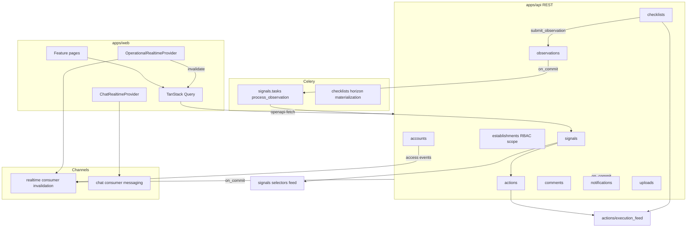
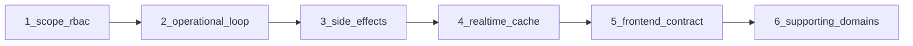

# Houston Global Architecture Mapping Audit

Status: audit report  
Date: 2026-06-23  
Scope: repo-level architecture mapping (read-only)  
Mode: audit only — no source changes

---

## Inspection manifest

### Files inspected

- `AGENTS.md`, `apps/api/AGENTS.md`, `apps/web/AGENTS.md`
- `apps/api/config/urls.py`, `apps/api/config/settings.py`, `apps/api/config/asgi.py`
- `apps/api/houston/core/events.py`, `apps/api/houston/events/apps.py`
- `apps/api/houston/actions/execution_feed.py`, `apps/api/houston/actions/services.py`
- `apps/api/houston/notifications/scheduling.py`, `apps/api/houston/realtime/broadcast.py`
- `apps/api/houston/establishments/permissions.py`, `apps/api/houston/establishments/role_constants.py`
- `apps/api/houston/ai/observation_pipeline.py`
- `apps/web/src/lib/query-invalidation.ts`
- `apps/web/src/features/realtime/lib/apply-operational-invalidation.ts`
- `apps/web/src/features/realtime/lib/apply-realtime-access-events.ts`
- `apps/web/src/features/auth/lib/membership-rbac.ts`, `apps/web/src/features/auth/lib/invitation-rbac.ts`
- `apps/web/src/features/actions/lib/action-display.ts`
- `apps/web/src/features/onboarding/lib/manual-v2-proposal.ts`
- `docker-compose.yml`, `Makefile`
- `docs/README.md`, `docs/product/product_operating_model.md`
- `docs/product/event_catalogue_v0.1.md`, `docs/product/domains/feed_domain.md`
- Frontend `apps/web/src/features/*` module layout

### Tests inspected (sampling)

- Backend: ~150 pytest modules under `apps/api/houston/*/tests/` covering services, permissions, API contracts, lifecycle, realtime, notifications, and pipeline behavior.
- Frontend: 86 Vitest files under `apps/web/src/` — strong coverage on auth bootstrap, query purge, operational realtime invalidation, and feature hooks; weaker on cross-layer RBAC parity with Django.

### Docs / rules inspected

- `.cursor/rules/000-project-contract.mdc`, `01-agent-guardrails.mdc`
- `.cursor/rules/10-backend-django-drf.mdc`, `20-frontend-react-vite-ts.mdc`, `21-mobile-first-pwa.mdc`
- `.cursor/rules/30-docker-orbstack.mdc`, `80-security-data-integrity.mdc`
- `.cursor/commands/audit-mode.md`

### Assumptions / unknowns

- Pytest pass rate and coverage % were not executed in this audit.
- RBAC matrix parity between Django `permissions.py` and frontend mirrors was not line-by-line verified.
- Production load characteristics are unknown (Houston is dev-phase only).
- Shared-dev remote DB operational constraints are documented but not validated here.

---

## 1. Architecture map

### Repo layout

```txt
houston_project/
├── apps/
│   ├── api/          # Django modular monolith (houston/* apps)
│   └── web/          # React/Vite PWA (features/* modules)
├── docs/             # product, architecture, engineering, archive
├── infra/            # Docker images, scripts, dev guards
├── docker-compose.yml
├── Makefile          # canonical backend/frontend commands
└── AGENTS.md         # root contract
```

### Runtime stack

| Layer | Technology | Role |
|-------|------------|------|
| API | Django + DRF + Daphne | Business rules, REST, OpenAPI |
| DB | PostgreSQL | Persisted business truth |
| Async | Celery + Redis broker | Observation pipeline, materialization, purge |
| Realtime | Django Channels + Redis | WS invalidation + chat |
| Web | React + TS + TanStack Query | Mobile-first UI |
| Contract | `apps/api/schema.yml` → `apps/web/src/api/generated/types.ts` | API shape |

### System diagram (core loop + side effects)



### API surface

All product REST is under `api/v1/`; auth is isolated at `api/v1/auth/`. OpenAPI lives at `api/schema/`. There is no `organizations` REST layer — org context flows through establishments.

Source: `apps/api/config/urls.py`

### Infra / dev workflow

- Docker Compose runs `api`, `celery`, `postgres`, `redis`, optional `celery-beat` (scheduler profile).
- Backend commands must go through Make targets or `docker compose exec api` — never native `uv run` on the host.
- Frontend commands run natively from `apps/web`.
- Local dev guards refuse remote DB credentials for destructive targets (`make test`, `make reset-dev-db`).

---

## 2. Main domains and responsibilities

| Domain | Backend app | Primary responsibility | Frontend feature |
|--------|-------------|------------------------|------------------|
| **Core** | `houston/core` | BaseModel, exceptions, observability, health; `EventEnvelope` dataclass (unused in prod) | — |
| **Identity** | `houston/accounts` | User, sessions, tokens, bootstrap, establishment switch | `features/auth` |
| **Tenant** | `houston/organizations` | Org root model only | — |
| **Scope / RBAC** | `houston/establishments` | Establishment, membership, invitations, onboarding, taxonomy (BU, subjects) | `features/onboarding`, `establishment-config`, auth workspace |
| **Raw input** | `houston/observations` | Observation + media + processing status | `features/observations` |
| **AI** | `houston/ai` | Pipeline, transcription, usage logging (no public API app) | embedded in observations/onboarding |
| **Situation** | `houston/signals` | Signal lifecycle, aggregation, signal feed | `features/signals` |
| **Execution** | `houston/actions` | Action lifecycle + unified execution feed (actions + checklists) | `features/actions`, `features/execution` |
| **Routines** | `houston/checklists` | Templates, assignments, materialization, executions | `features/checklists` |
| **Discussion** | `houston/comments` | Threaded comments + mentions | `features/comments` |
| **Attention** | `houston/notifications` | In-app notifications, preferences | `features/notifications` |
| **Realtime** | `houston/realtime` | Generic WS invalidation + access events | `features/realtime` |
| **Chat** | `houston/chat` | Separate messaging domain + dedicated WS | `features/chat` |
| **Media staging** | `houston/uploads` | Temporary uploads, transcription, TTL cleanup | observations flows |
| **Events (stub)** | `houston/events` | Registered in `INSTALLED_APPS`; no implementation | — |

### Feed is a projection pattern, not a Django app

- **Signal feed**: `houston/signals/selectors.py` + signal feed API
- **Execution feed**: `houston/actions/execution_feed.py` — cross-domain merge of actions and checklist executions

### Core product loop

From `AGENTS.md`, aligned with `docs/product/product_operating_model.md`:

```txt
Observation → (AI pipeline) → Signal → Action → Execution → Validation → Feed / notification update
```

Checklists branch in via materialized executions and can submit observations back into the loop (`checklists/services.py` → `observations/services.submit_observation`).

### Side-effect layer (not a persisted event bus)

Significant state changes follow: **persist first → `transaction.on_commit` → side effects**.

| Side effect | Location | Triggered by |
|-------------|----------|--------------|
| In-app notifications | `notifications/scheduling.py` | Domain services after lifecycle transitions |
| Operational WS invalidation | `realtime/broadcast.py` | Domain services + `accounts/services.py` |
| Celery async jobs | `signals/tasks.py`, `checklists/tasks.py`, `chat/tasks.py`, `uploads/tasks.py` | `on_commit` enqueue or Beat schedule |

There are no Django `@receiver` business signals in the codebase. `houston.events` is an empty stub; `EventEnvelope` in `core/events.py` is tested but not used in production paths.

---

## 3. Backend / frontend responsibility boundaries

### Backend owns

- RBAC, establishment isolation, membership status/scope
- All lifecycle transitions (signal, action, checklist, onboarding)
- Feed visibility, sorting, pagination, cursor semantics
- Notification recipient resolution
- Media access rules; no raw observation text in feeds/API where forbidden
- API contract via DRF serializers + OpenAPI (`apps/api/schema.yml`)

### Frontend owns

- Mobile-first UI, loading/empty/error/unauthorized states
- TanStack Query cache + invalidation (`apps/web/src/lib/query-invalidation.ts`)
- Display of backend `permission_hints` (UX only)
- Chat optimistic local message state (documented exception in `apps/web/AGENTS.md`)
- In-memory access token (`apps/web/src/features/auth/session.ts`)

### Contract boundary

```txt
DRF serializers/views → schema.yml → openapi-typescript → features/*/api.ts → hooks.ts → components
```

### Realtime boundary

| Channel | Backend | Frontend |
|---------|---------|----------|
| Operational | `realtime/consumers.py` — invalidation + access events only; payloads are IDs + reasons (`realtime/ws_payloads.py`) | `OperationalRealtimeProvider` → `apply-operational-invalidation.ts`, `apply-realtime-access-events.ts` |
| Chat | `chat/consumers.py` — dedicated messaging protocol | `ChatRealtimeProvider` — WS sends messages; REST is source for history/permissions |

### Known boundary drift (maintenance risk, not security enforcement)

| Area | File | Risk |
|------|------|------|
| RBAC role matrices | `features/auth/lib/membership-rbac.ts`, `invitation-rbac.ts` | UX dropdown filtering mirrors backend hierarchy; can drift |
| Deadline urgency styling | `features/actions/lib/action-display.ts` | Client-side thresholds for visual "critical" state |
| Onboarding proposal assembly | `features/onboarding/lib/manual-v2-proposal.ts` | Substantial client orchestration before server validation |

---

## 4. Existing conventions that must be preserved

From `AGENTS.md`, nested `AGENTS.md` files, and `.cursor/rules/`:

| Convention | Rule |
|------------|------|
| Modular monolith | One Django app per domain; no microservice split |
| Layer ownership | `services` = writes/lifecycle; `selectors` = reads; `permissions` = authz; views/serializers stay thin |
| State first, side effects second | `transaction.atomic` then `transaction.on_commit` for notifications, realtime, Celery enqueue |
| No Django signals for business | Explicit service-side effects |
| Redis = technical only | Never business or authorization truth |
| Celery passes IDs | Reload from DB; idempotent retries |
| OpenAPI is contract | Regenerate types; never hand-edit generated files |
| TanStack Query isolation | Only `auth` root survives establishment switch (`purgeNonAuthQueries`) |
| Mobile-first PWA | Phone layout first; explicit offline/error states |
| Backend commands via Make/Docker | Never native `uv run pytest` on host |
| Docs hierarchy | Code/tests > `schema.yml` > architecture docs > product docs > archive |
| Security | No raw observation text, comment bodies, tokens, or signed URLs in logs/WS/broker |

---

## 5. Top 10 repo-level risks

### R1 — Cross-domain coupling via private imports

- **Severity:** P1
- **Category:** structure / maintainability
- **Evidence:** `_ADMIN_ROLES`, `_MANAGEMENT_ROLES`, `_ACTION_ROLES` imported from `establishments/role_constants.py` in `actions`, `signals`, `chat`, `checklists`, `comments` permissions; `_is_valid_membership` imported from `establishments/permissions.py` in `chat`, `notifications`, `realtime`, `checklists`
- **Problem:** Underscore-prefixed symbols are used as a shared internal API across domains.
- **Why it matters now:** Any RBAC refactor in establishments forces wide ripples.
- **Why it will hurt later:** New domains will copy the pattern; boundaries stay implicit.
- **Recommended fix:** Promote stable scope/RBAC helpers to a documented public surface in `establishments` (or `core`) without underscore prefix; ban cross-app private imports in lint/import-graph tests.
- **Tests to add/update:** Extend `signals/tests/test_import_graph.py` pattern repo-wide.
- **Size:** M

### R2 — Notifications hub knows all producers

- **Severity:** P1
- **Category:** structure / maintainability
- **Evidence:** `notifications/scheduling.py` imports `Action`, `ChecklistExecution`, `Comment`, `Signal` and resolves recipients per domain inline
- **Problem:** Single file is the integration point for every notification-producing domain.
- **Why it matters now:** Adding a notification for a new transition requires editing a central hub.
- **Why it will hurt later:** Recipient bugs and missed notifications become harder to trace; file grows without bound.
- **Recommended fix:** Keep scheduling thin; move per-domain producer functions back into owning apps with a narrow `notifications` registration interface.
- **Tests to add/update:** Per-domain producer tests already exist; add contract test that every `event_key` in notification matrix has a registered producer.
- **Size:** L

### R3 — Execution feed ownership blur

- **Severity:** P1
- **Category:** structure / ambiguity
- **Evidence:** `actions/execution_feed.py` imports `checklists/materialization.ensure_visible_executions_materialized`, checklist selectors, and cursors
- **Problem:** Unified execution feed lives in `actions` but orchestrates checklist domain reads and writes-on-read.
- **Why it matters now:** Feed behavior changes require understanding two domains and merge semantics documented in `feed_domain.md`.
- **Why it will hurt later:** Performance tuning and permission changes split across apps; harder to test in isolation.
- **Recommended fix:** Extract feed merge into a dedicated `execution_feed` module or document `actions` as the intentional feed owner with explicit checklist adapter boundary.
- **Tests to add/update:** Cross-domain integration tests for merge ordering and materialization side effects on read.
- **Size:** M

### R4 — Actions ↔ Signals lifecycle entanglement

- **Severity:** P1
- **Category:** structure
- **Evidence:** `actions/services.py` imports `touch_signal_activity`, `unpin_signal`, `resolve_signal` from `signals/services.py`
- **Problem:** Action transitions directly mutate signal state.
- **Why it matters now:** Signal and action lifecycles cannot evolve independently.
- **Why it will hurt later:** Product changes to "resolve signal when all actions done" vs manual resolve become entangled conditionals.
- **Recommended fix:** Document the coupling as an explicit domain rule in `action_domain.md` / `signal_domain.md`; consider a small `operational_coordination` service if rules multiply.
- **Tests to add/update:** `actions/tests/test_signal_resolve_with_actions.py` — extend for forbidden/partial cases.
- **Size:** M

### R5 — Event architecture doc vs code gap

- **Severity:** P2
- **Category:** ambiguity / structure
- **Evidence:** `EventEnvelope` in `core/events.py` unused in prod; `houston.events` is empty; `docs/product/event_catalogue_v0.1.md` states "documentary only"
- **Problem:** Docs and `INSTALLED_APPS` suggest an event subsystem; implementation is ad-hoc `schedule_*` calls.
- **Why it matters now:** New contributors may build on the wrong abstraction.
- **Why it will hurt later:** If persisted events are needed, retrofitting is expensive.
- **Recommended fix:** Either remove `houston.events` from `INSTALLED_APPS` until implemented, or add a thin `publish_side_effects()` wrapper without persistence. Update `product_operating_model.md` Phase 8C status.
- **Tests to add/update:** None urgent; catalogue already documents intent.
- **Size:** S

### R6 — Frontend RBAC mirrors can drift

- **Severity:** P2
- **Category:** API contract / maintainability
- **Evidence:** `features/auth/lib/membership-rbac.ts`, `invitation-rbac.ts` with tests that validate frontend copies only
- **Problem:** Invite/manage-role UX filters duplicate backend role hierarchy.
- **Why it matters now:** Backend RBAC changes may leave stale UI options (backend still rejects).
- **Why it will hurt later:** Support burden from "option shown but API 403" confusion.
- **Recommended fix:** Prefer bootstrap/API hints for allowed target roles; shrink client matrices.
- **Tests to add/update:** Contract test or snapshot against bootstrap permission hints API.
- **Size:** S

### R7 — AI pipeline complexity + external dependency

- **Severity:** P2
- **Category:** scalability / maintainability
- **Evidence:** `ai/observation_pipeline.py` coupled to signals taxonomy; Celery stuck-observation recovery in Beat schedule; OpenAI smoke tests gated
- **Problem:** Core loop depends on external LLM provider and multi-step async pipeline.
- **Why it matters now:** Pipeline failures block observation → signal path.
- **Why it will hurt later:** Cost, latency, and provider outages directly impact operational throughput.
- **Recommended fix:** Continue investing in recovery/diagnostics tests; keep pipeline versioned (already partially done).
- **Tests to add/update:** Expand non-OpenAI golden tests; monitor recovery task behavior.
- **Size:** M (ongoing)

### R8 — Feed read path triggers writes

- **Severity:** P2
- **Category:** performance / scalability
- **Evidence:** `ensure_visible_executions_materialized` called from `actions/execution_feed.py` on feed read
- **Problem:** Read projection can trigger checklist materialization writes.
- **Why it matters now:** Acceptable at dev scale; adds latency on feed load.
- **Why it will hurt later:** Hot establishments with many assignments see read amplification and lock contention.
- **Recommended fix:** Shift materialization to Beat/Celery horizon job (partially exists); make feed read pure where possible.
- **Tests to add/update:** Load/perf baseline for feed with many pending assignments.
- **Size:** M

### R9 — Establishments as central bottleneck

- **Severity:** P2
- **Category:** structure / scalability
- **Evidence:** Largest API surface, RBAC, onboarding, taxonomy, invitations; referenced by every domain
- **Problem:** `establishments` is the implicit platform layer inside the monolith.
- **Why it matters now:** Most features touch membership scope and taxonomy.
- **Why it will hurt later:** Onboarding + runtime config + RBAC changes become high-risk merges.
- **Recommended fix:** Keep explicit `access.py` / `membership_scope.py` boundaries; resist adding unrelated workflows to establishments views.
- **Tests to add/update:** Scope coverage tests already exist (`test_membership_scope_coverage.py`); maintain as domains grow.
- **Size:** L (organizational discipline)

### R10 — Docs / archive confusion

- **Severity:** P3
- **Category:** ambiguity
- **Evidence:** `docs/archive/codex/` duplicates active `docs/product/domains/`; `product_operating_model.md` lists Phase 8C global realtime as "deferred" while operational realtime is implemented
- **Problem:** Stale phase status and duplicate docs mislead readers.
- **Why it matters now:** Agents and humans may follow wrong doc.
- **Why it will hurt later:** Low — mitigated by `docs/README.md` hierarchy rules.
- **Recommended fix:** Update phase status in `product_operating_model.md`; keep archive clearly labeled.
- **Tests to add/update:** None.
- **Size:** S

### Top 3 fixes to do first

1. **R1** — Stabilize public RBAC/scope helpers; stop cross-app `_` imports
2. **R2** — Decouple notification producers from central scheduling hub
3. **R3 / R4** — Clarify execution feed and action/signal lifecycle ownership in code structure and docs

### Quick wins

- **R5** — Remove or document `houston.events` stub; align phase docs (S)
- **R10** — Update `product_operating_model.md` Phase 8C status (S)
- **R6** — Drive invite/manage role UX from API hints (S)

### Structural issues to plan later

- **R8** — Pure read path for execution feed at scale
- **R9** — Establishments module growth discipline
- **R7** — AI pipeline resilience and cost controls

### Things not worth fixing now

- Persisted event bus / event sourcing (explicitly out of scope per `AGENTS.md`)
- `houston/organizations` expansion (thin pass-through is sufficient)
- Desktop UX polish
- Framework version upgrades

---

## 6. Recommended audit order

Prioritize domains with highest coupling, security surface, and scaling pain.



| Order | Audit focus | Why first |
|-------|-------------|-----------|
| **1** | `establishments` + `accounts` (RBAC, scope, bootstrap, switch) | Every domain depends on scope; tenant isolation failures are P0 |
| **2** | Observation → Signal → Action loop (`observations`, `ai`, `signals`, `actions`) | Core product value; pipeline failures block the loop |
| **3** | Side-effect layer (`notifications/scheduling`, `realtime/broadcast`, Celery tasks) | Cross-cutting; recipient bugs and missed invalidations are user-visible |
| **4** | Execution feed + checklists (`checklists`, `actions/execution_feed`) | Cross-domain merge, materialization-on-read, timezone scheduling |
| **5** | Frontend contract + cache (`query-invalidation`, realtime providers, permission hints) | Establishment switch leaks and stale UI |
| **6** | Chat V1 (separate WS protocol, purge, rate limits) | Isolated but security-sensitive |
| **7** | Uploads/media access + observations media | Sensitive data exposure surface |
| **8** | Onboarding/runtime config | Complex client+server orchestration |
| **9** | Comments + notifications preferences | Lower blast radius |
| **10** | Infra/Makefile/Docker guards, test strategy | Platform hygiene after domain audits |

---

## 7. Areas not worth auditing deeply right now

| Area | Reason |
|------|--------|
| `houston/events` stub | No production code; `event_catalogue_v0.1.md` already documents the gap |
| `houston/organizations` | Single model, no API; thin pass-through |
| `docs/archive/codex/*` | Historical only per `docs/README.md` |
| Desktop-only UX polish | Product is mobile-first; defer layout refinements |
| Billing, analytics, multi-establishment advanced UX | Explicitly out of MVP scope |
| Event sourcing / persisted event bus | Explicitly rejected in `AGENTS.md` unless requested |
| Framework version upgrades | Policy: no upgrades unless requested |
| shadcn/ui primitives | Standard library; audit only if blocking product work |

---

## Summary

Houston is a **scope-centered modular monolith**: `establishments` owns tenant/RBAC/taxonomy; the operational loop runs Observation → Signal → Action/Checklist → feeds; notifications and realtime are cross-cutting reaction layers invoked explicitly after DB commit. The architecture is coherent for MVP dev phase, with clear AGENTS.md contracts and strong per-domain test coverage. The main structural risks are **cross-domain coupling** (private imports, notification hub, execution feed merge, action/signal entanglement) rather than missing layers or framework misuse. Deeper audits should start at scope/RBAC, then follow the core product loop outward.

---

**Changed:** Created `docs/audits/global_architecture_mapping.md`  
**Validated:** Key evidence paths verified via repo search (private imports, action/signal coupling, no `@receiver`, 86 frontend test files)  
**Risks / not verified:** Pytest pass rate, RBAC line-by-line parity, production load
