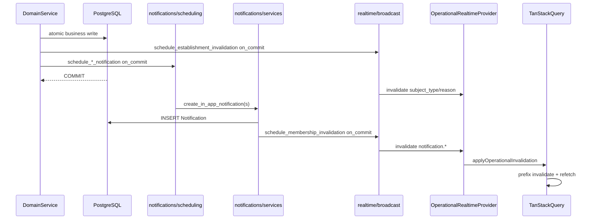

# Notifications / Realtime Audit

Status: audit report  
Date: 2026-06-25  
Scope: Cross-domain freshness — in-app notifications, operational WebSocket invalidation, frontend TanStack Query invalidation matrix, after-commit safety, tenant scoping, doc/code drift  
Mode: audit only — no source changes

Related: [Action Domain Consolidation](./action_consolidation.md) (ACT-04), [Execution Feed Consolidation](./execution_feed_consolidation.md) (EF-10), [Observation Refresh Consolidation](./observation_refresh_consolidation.md) (OR-07), [Notification Domain](../product/domains/notification_domain.md), [Realtime Domain](../product/domains/realtime_domain.md), [Notification Matrix v0.2](../product/notification_matrix_v0.2.md)

---

## Inspection manifest

### 1. Files inspected

**Contract and rules**

- `AGENTS.md`, `apps/api/AGENTS.md`, `apps/web/AGENTS.md`
- `.cursor/rules/10-backend-django-drf.mdc`, `20-frontend-react-vite-ts.mdc`, `80-security-data-integrity.mdc`

**Backend — notifications**

- `apps/api/houston/notifications/scheduling.py` — Lot1 producers, `on_commit`, swallowed post-commit failures
- `apps/api/houston/notifications/services.py` — create, dedupe, membership-scoped WS invalidation, `notifications_enabled` gate
- `apps/api/houston/notifications/constants.py` — `LOT1_EVENT_KEYS` (13 events), copy, dedupe window
- `apps/api/houston/notifications/recipients.py` — recipient resolution per domain
- `apps/api/houston/notifications/permissions.py` — `recipient_can_view_notification_subject`
- `apps/api/houston/notifications/models.py`, `selectors.py`, `notification_cursor.py`
- `apps/api/houston/notifications/api/views.py`, `serializers.py`

**Backend — realtime**

- `apps/api/houston/realtime/broadcast.py` — `schedule_establishment_invalidation`, `schedule_membership_invalidation`, `on_commit`
- `apps/api/houston/realtime/consumers.py`, `ws_payloads.py`, `groups.py`, `ws_access.py`, `permissions.py`, `routing.py`

**Backend — cross-domain producers**

- `apps/api/houston/actions/services.py` — `sync_signal_after_action_change`, `reopen_action`, `_schedule_action_invalidation`
- `apps/api/houston/signals/services.py` — `_schedule_signal_invalidation`, pipeline + manual lifecycle
- `apps/api/houston/checklists/services.py`, `materialization.py`
- `apps/api/houston/comments/services.py`
- `apps/api/houston/observations/services.py` — enqueue only (no direct notification/realtime)

**Frontend**

- `apps/web/src/features/realtime/lib/apply-operational-invalidation.ts` — frontend invalidation matrix
- `apps/web/src/features/realtime/lib/apply-realtime-access-events.ts`
- `apps/web/src/features/realtime/components/operational-realtime-provider.tsx`
- `apps/web/src/features/realtime/hooks/use-operational-realtime-websocket.ts`
- `apps/web/src/lib/query-invalidation.ts` — `invalidateActionMutationSurfaces`, establishment purge helpers
- `apps/web/src/features/notifications/hooks.ts`, `components/notification-center.tsx`
- `apps/web/src/App.tsx` — terrain-only `OperationalRealtimeProvider` mount

**API contract**

- `apps/api/schema.yml` — notification list/mark-read/archive/preferences endpoints; operational ws-ticket

### 2. Tests inspected

| Area | Key files |
|------|-----------|
| Action invalidation (ACT-04 contract) | `realtime/tests/test_action_invalidation.py` |
| Signal / observation pipeline invalidation | `realtime/tests/test_broadcast.py`, `realtime/tests/test_observation_pipeline_invalidation.py` |
| Checklist / comment invalidation | `realtime/tests/test_checklist_invalidation.py`, `realtime/tests/test_checklist_materialization_invalidation.py`, `realtime/tests/test_comment_invalidation.py` |
| Access events | `realtime/tests/test_access_events.py`, `realtime/tests/test_realtime_ws_consumer.py` |
| Notification producers + rollback | `notifications/tests/test_action_notification_producers.py`, `test_signal_notification_producers.py`, `test_checklist_notification_producers.py`, `test_comment_mention_notification_producers.py` |
| Notification WS invalidation | `notifications/tests/test_notification_invalidation.py` |
| Notification API / preferences | `notifications/tests/test_notifications_api.py`, `test_notification_preferences_api.py` |
| Frontend invalidation matrix | `realtime/lib/apply-operational-invalidation.test.ts`, `realtime/lib/apply-realtime-access-events.test.ts` |
| Shared invalidators | `lib/query-invalidation.test.ts` |
| Notification UI / mutations | `notifications/hooks.mutations.test.ts`, `notification-center.test.tsx` |
| Provider (render only) | `realtime/components/operational-realtime-provider.test.tsx` |

Pytest and Vitest were not executed in this audit pass.

### 3. Docs / rules inspected

- `docs/product/domains/notification_domain.md` — claims `not_started`, zero endpoints (stale)
- `docs/product/domains/realtime_domain.md` — authoritative; internal contradictions on notification realtime
- `docs/product/notification_matrix_v0.2.md` — draft matrix vs Lot1 implementation
- `docs/audits/action_consolidation.md` — ACT-04 product gate
- `docs/audits/execution_feed_consolidation.md` — EF-10 handoff
- `docs/audits/observation_refresh_consolidation.md` — OR-07 realtime poll deferral

### 4. Assumptions or unknowns

- Observation, Signal, Action, Checklist, and Execution Feed domain audits are treated as baseline; this audit focuses on the notification/realtime boundary and cross-domain freshness.
- `make backend-test` / `make verify` not run in this audit pass.
- Production WebSocket delivery latency, Channels scaling, and notification delivery failure rates not measured.
- Chat V1 realtime is out of scope except as a boundary note (separate WS contract under `houston/chat/`).
- Push/email channels not implemented; in-app only for Lot1.

### Strengths (no action required)

- No separate event bus — side effects are explicit inline calls from domain services; easy to trace.
- Consistent `transaction.on_commit` for notifications and establishment invalidation; rollback tests across action, signal, checklist, and comment producers.
- Solid tenant scoping: every `Notification` has `establishment_id` + `recipient_membership_id`; recipients filtered to ACTIVE memberships; subject visibility rechecked via RBAC.
- Lot1 notification event keys in code align with `notification_matrix_v0.2.md` §1.1 subset (`LOT1_EVENT_KEYS` in `constants.py`).
- Backend invalidation catalog is well-tested; frontend matrix has thorough unit tests in `apply-operational-invalidation.test.ts`.
- Auto-resolve via `sync_signal_after_action_change` → `resolve_signal()` does fire `signal.resolved` notification to pole members (`test_auto_resolve_with_actor_none_notifies_pole_members`).
- Houston web app compensates for action-driven signal mutations via `invalidateActionMutationSurfaces` (action + signal query prefixes).
- Membership-scoped notification invalidation matches per-recipient delivery model.

---

## 1. Current flow

Houston uses a **two-channel freshness model**: persisted in-app notifications (attention messages) and operational WebSocket invalidation (cache refetch hints). There is no `houston/events` consumer layer — domain services call `notifications/scheduling.py` and `realtime/broadcast.py` directly after business writes.

### Producer map (who emits what)

| Domain | Notifications (Lot1) | Realtime invalidation |
|--------|------------------------|----------------------|
| **Action** | create, reassign, pending_validation, reopened, canceled | `action.created`, `action.updated` |
| **Signal** | created, pinned, urgency→HIGH, resolved, canceled | `signal.created`, `signal.updated` |
| **Checklist** | execution created, execution canceled | `checklist.updated`, `execution.created`, `execution.updated` |
| **Comment** | mention created | `comment.signal.*`, `comment.action.*` |
| **Observation** | — | — (Celery pipeline → signal invalidation in `signals/services.py`) |
| **Notification** | — | `notification.created`, `notification.updated`, `notification.bulk_updated` (membership-scoped) |

### WebSocket scopes

| Scope | Channel group | Used for |
|-------|---------------|----------|
| Establishment | `realtime_est_{establishment_id}` | Signal, action, checklist, execution, comment invalidation |
| Membership | `realtime_est_{establishment_id}_mbr_{membership_id}` | Notification list + unread badge refresh |
| Session | `realtime_session_{session_id}` | `session.revoked`, `establishment.switched` |

### Frontend invalidation matrix

Central dispatch: `apps/web/src/features/realtime/lib/apply-operational-invalidation.ts`

| `subject_type` | Invalidated query prefixes |
|----------------|---------------------------|
| `signal` | `['signals','feed', est]`, `['signals','detail', est]` |
| `action` | actions + signals (`invalidateActionMutationSurfaces`) |
| `checklist` | checklist surfaces + actions (execution feed) |
| `execution` | execution detail + checklist mutation surfaces |
| `comment` | reason-specific comment thread only |
| `notification` | `['notifications','list', est]` (reason allowlist) |

`OperationalRealtimeProvider` mounts on terrain routes only (`App.tsx` → `wrapTerrainWithOperationalRealtime`). Chat uses a separate WebSocket under `houston/chat/`.

### Cross-domain freshness coupling (ACT-04)

When Action lifecycle mutates a linked Signal, backend often emits **only** `action.created` / `action.updated`. Frontend refreshes Signal surfaces because `invalidateActionMutationSurfaces` also calls `invalidateEstablishmentSignalQueries`. This is documented in `realtime_domain.md` §8 and tested in `test_cancel_last_linked_action_reopen_refreshes_via_action_updated_only`.

---

## 2. Top findings

### NR-01 — ACT-04 / EF-10: linked-action terminal sync omits `signal.updated` on reopen path

- **Severity:** P1
- **Category:** API contract / ambiguity
- **Evidence:** `sync_signal_after_action_change` in `apps/api/houston/actions/services.py` L152–168 saves Signal `OPEN` + unpin when all linked actions are canceled, without `_schedule_signal_invalidation`. Resolve path delegates to `resolve_signal()` which does emit `signal.updated` + notification. Contract test: `realtime/tests/test_action_invalidation.py::test_cancel_last_linked_action_reopen_refreshes_via_action_updated_only`.
- **Problem:** Backend realtime contract is asymmetric — resolve emits `signal.updated`; reopen does not.
- **Why it matters now:** Houston web app mitigates via `action.updated` → signal invalidation cascade. Any client listening only to `signal.*` events sees stale Signal status after last linked action cancel.
- **Why it will hurt later:** Third-party integrations, native apps, or a signal-only detail view without action subscription will miss reopen. Contract ambiguity grows as more cross-domain sync paths are added.
- **Recommended fix:** Emit `signal.updated` from `sync_signal_after_action_change` when Signal status/pin changes (option A from prior consolidations). Update contract test to expect dual emission or document permanent frontend coupling.
- **Tests to add/update:** `test_cancel_last_linked_action_reopen_emits_signal_updated` (if option A); cross-client contract doc in `realtime_domain.md`.
- **Suggested implementation size:** S–M

### NR-02 — `reopen_action` mutates linked Signal without `signal.updated`

- **Severity:** P2
- **Category:** ambiguity
- **Evidence:** `reopen_action` in `actions/services.py` L416–421 sets linked Signal `RESOLVED → IN_PROGRESS` inline; only `action.updated` scheduled (L422). Same ACT-04 family as NR-01.
- **Problem:** Signal status change hidden behind action invalidation only.
- **Why it matters now:** Covered by frontend `invalidateActionMutationSurfaces` when user is on terrain with WS connected.
- **Why it will hurt later:** Same WS-only-signal-consumer risk as NR-01; two code paths (`sync_signal_after_action_change` vs inline reopen) with inconsistent invalidation behavior.
- **Recommended fix:** Extract shared helper that mutates Signal + schedules `signal.updated` when status/pin changes; use in both paths.
- **Tests to add/update:** Realtime test for `reopen_action` on linked signal with `RESOLVED` status.
- **Suggested implementation size:** S

### NR-03 — `notification_domain.md` severely stale

- **Severity:** P2
- **Category:** maintainability
- **Evidence:** `docs/product/domains/notification_domain.md` L5–6: `Implementation status: not_started`; L37–38: stub app, no endpoints; L169: "none" implemented. Contradicts `apps/api/schema.yml` notification routes (list, mark-read, archive, preferences) and full `houston/notifications/` package.
- **Problem:** Agents and developers reading product docs will assume notifications are unimplemented and may skip RBAC/invalidation work or re-implement from scratch.
- **Why it matters now:** Misleading during active MVP development; undermines audit trail from prior domain work.
- **Why it will hurt later:** Onboarding cost, duplicate design discussions, unsafe assumptions about missing tests.
- **Recommended fix:** Rewrite `notification_domain.md` to reflect Lot1 implementation: models, services, API surface, WS invalidation, preferences, dedupe, recipient rules. Set `Implementation status: lot1_in_app`.
- **Tests to add/update:** None (docs only); optional doc-status check in CI.
- **Suggested implementation size:** S

### NR-04 — `realtime_domain.md` internal contradictions on notification realtime

- **Severity:** P2
- **Category:** maintainability
- **Evidence:** §2 table (L82–84) lists `notification.created/updated/bulk_updated` as implemented. §8 (L221–223) says "Not emitted today: Notification create / read / archive". §10 (L302) says "Notification Center refetch via realtime not implemented." Code: `notifications/services.py::_schedule_notification_invalidation` + `apply-operational-invalidation.ts` L64–68.
- **Problem:** Same authoritative doc both describes and denies notification realtime.
- **Why it matters now:** Agents following §8/§10 will not wire notification invalidation on new features.
- **Why it will hurt later:** Frontend/backend contract drift on every notification feature addition.
- **Recommended fix:** Remove §8 "Not emitted today" notification bullet; update §10 to state Notification Center refetch is implemented via membership-scoped `notification.*` invalidation.
- **Tests to add/update:** None (docs only).
- **Suggested implementation size:** S

### NR-05 — Post-commit notification delivery failures swallowed

- **Severity:** P2
- **Category:** structure
- **Evidence:** `scheduling._run_notification_after_commit` L39–44 catches all exceptions, logs, and returns — business transaction already committed.
- **Problem:** User completes an action; assignee never receives in-app notification; no retry, no metric, no user-visible degradation.
- **Why it matters now:** Rare in healthy deployments but invisible when it happens (e.g. DB blip during recipient reload).
- **Why it will hurt later:** Operational incidents with no alert path; support cannot distinguish "no notification by design" vs "delivery failed."
- **Recommended fix:** Structured log + counter/metric on failure; optional dead-letter row or Celery retry for notification creation (separate from business txn).
- **Tests to add/update:** Assert logger called on forced failure in deliver callback; metric hook if added.
- **Suggested implementation size:** S

### NR-06 — Comment invalidation does not refresh parent signal/action surfaces

- **Severity:** P2
- **Category:** performance
- **Evidence:** `apply-operational-invalidation.ts` L48–61 invalidates only `['comments','signal', est, id]` or `['comments','action', est, id]` — not signal/action feed or detail queries.
- **Problem:** Comment count, last-activity hints, and feed card metadata can lag until a broader invalidation (e.g. `signal.updated`) arrives.
- **Why it matters now:** Users on signal feed may not see updated comment indicators until manual refresh or unrelated invalidation.
- **Why it will hurt later:** More comment-heavy workflows amplify perceived staleness.
- **Recommended fix:** Product decision: optionally invalidate parent `signals/detail` or `signals/feed` on `comment.signal.created`; same for action comments. Weigh refetch cost vs freshness.
- **Tests to add/update:** `apply-operational-invalidation.test.ts` extension if product approves parent invalidation.
- **Suggested implementation size:** S

### NR-07 — Notification matrix v0.2 draft vs Lot1 code ambiguity

- **Severity:** P3
- **Category:** maintainability
- **Evidence:** `notification_matrix_v0.2.md` §2 lists `action.accepted`, `action.completed`/`action.validated` as candidate events. Code: `test_accept_action_creates_zero_notifications` confirms zero notifications on accept. Lot1 = 13 events in `LOT1_EVENT_KEYS`.
- **Problem:** Draft matrix reads like a near-term contract; implementation deliberately excludes several listed events.
- **Why it matters now:** Product/engineering may expect notifications that were never in Lot1 scope.
- **Why it will hurt later:** Lot2 scope arguments without clear baseline.
- **Recommended fix:** Add "Implemented (Lot1)" column to matrix or split doc into `notification_matrix_lot1.md` (canonical) vs v0.2 future events.
- **Tests to add/update:** None beyond existing producer tests.
- **Suggested implementation size:** S

### NR-08 — Reconnect invalidation omits comments

- **Severity:** P3
- **Category:** performance
- **Evidence:** `applyOperationalReconnectInvalidation` L72–79 invalidates signals, actions, checklists, notifications — not comments. Acknowledged in `realtime_domain.md` §10 L301.
- **Problem:** After disconnect/reconnect, open comment threads may show stale messages until user navigates away.
- **Why it matters now:** Field users on unstable mobile networks.
- **Why it will hurt later:** Low if comment volume stays small; higher if comment threads become primary collaboration surface.
- **Recommended fix:** Add `invalidateEstablishmentCommentQueries` to reconnect sweep (if comment query keys support establishment prefix); or accept documented limitation.
- **Tests to add/update:** Reconnect test in `apply-operational-invalidation.test.ts`.
- **Suggested implementation size:** S

### NR-09 — Reporting/workspace queries never invalidated by operational realtime

- **Severity:** P3
- **Category:** performance
- **Evidence:** `apply-operational-invalidation.ts` has no reporting/workspace branches. `query-invalidation.test.ts` shows `['reporting','kpi', est]` and `['workspace','summary', est]` purged only on establishment switch.
- **Problem:** User on `/reporting` hub sees stale KPIs while signal/action feeds refresh via WS on same session.
- **Why it matters now:** Reporting hub is a terrain route with WS connected but KPI cache not in invalidation matrix.
- **Why it will hurt later:** As reporting surfaces grow, cross-domain staleness becomes more visible.
- **Recommended fix:** Defer to Reporting audit; either add selective invalidation on high-impact events or document "stale until navigate/refocus" UX.
- **Tests to add/update:** Reporting freshness tests when reporting feature matures.
- **Suggested implementation size:** M (when reporting domain is audited)

### NR-10 — Frontend WS integration test gap

- **Severity:** P3
- **Category:** tests
- **Evidence:** `apply-operational-invalidation.test.ts` covers matrix unit tests. `operational-realtime-provider.test.tsx` is render-only. No test: WS `notification.created` → provider callback → `['notifications','list', est]` invalidation → bell unread update.
- **Problem:** Regression risk on provider wiring separate from matrix logic.
- **Why it matters now:** Matrix is stable; provider/hook glue is untested.
- **Why it will hurt later:** Refactors to `useOperationalRealtimeWebSocket` or provider callbacks can break notification bell silently.
- **Recommended fix:** Provider test with mocked WS message dispatching through `handleInvalidate`; optional hook test.
- **Tests to add/update:** `operational-realtime-provider.test.tsx` callback coverage.
- **Suggested implementation size:** S

---

## 3. Fix now vs later

### Fix now (low product risk, S–M)

| Priority | Item | Finding | Size |
|----------|------|---------|------|
| 1 | Reconcile `notification_domain.md` + fix `realtime_domain.md` §8/§10 | NR-03, NR-04 | S |
| 2 | Clarify Lot1 vs v0.2 matrix authority | NR-07 | S |
| 3 | Post-commit notification failure observability (structured log/metric) | NR-05 | S |
| 4 | ACT-04 backend `signal.updated` emit (if product confirms option A) | NR-01, NR-02 | S–M |

### Fix later

- Comment → parent feed/detail invalidation (NR-06) — product noise vs freshness tradeoff
- Observation `subject_type` realtime (OR-07 carryover from observation refresh audit)
- Reconnect comment invalidation (NR-08)
- Reporting/workspace KPI realtime (NR-09) — next audit domain
- Frontend WS provider integration tests (NR-10)
- Push/email channels (out of Lot1 scope)

### Not worth fixing now

- Coarse establishment-wide query prefix invalidation (documented Houston pattern; RBAC-safe refetch)
- Missing notifications for `accept_action`, `validate_action`, `mark_action_done` direct-done (intentional Lot1)
- `channel_layer is None` silent no-op in `broadcast.py` (dev/test edge case)
- Signal aggregation invalidation-only without notification (intentional — visibility via feed)
- Dual observation terminal path (poll + WS signal invalidation) — redundant but safe

---

## 4. Decisions needed

| ID | Question | Options | Prior audit recommendation |
|----|----------|---------|---------------------------|
| **D-01** | ACT-04 / EF-10: emit `signal.updated` when Action sync mutates linked Signal? | **(A)** Backend emit in `sync_signal_after_action_change` + `reopen_action` **(B)** Keep frontend `action.*` cascade only | **(A)** — cleaner realtime contract ([execution_feed_consolidation.md](./execution_feed_consolidation.md) §Decisions) |
| **D-02** | Invalidate parent signal/action feeds on `comment.*`? | **(A)** Extend matrix **(B)** Comment threads only (current) | Product call — freshness vs refetch cost |
| **D-03** | Notification matrix authority | **(A)** Code `LOT1_EVENT_KEYS` canonical **(B)** Finish v0.2 draft events | **(A)** for MVP; v0.2 = future Lot2 backlog |
| **D-04** | Post-commit notification loss handling | **(A)** Log/metric only **(B)** Retry queue/outbox | **(A)** now; **(B)** if delivery SLA becomes product requirement |

---

## 5. Tests needed

| Area | Test | Trigger |
|------|------|---------|
| ACT-04 (if D-01 option A) | `sync_signal_after_action_change` reopen + `reopen_action` emit `signal.updated` | NR-01, NR-02 |
| Notifications | Post-commit deliver failure logs structured error / increments metric | NR-05 |
| Frontend | `OperationalRealtimeProvider` `notification.created` → notification list invalidation | NR-10 |
| Frontend | Optional: `useOperationalRealtimeWebSocket` dispatches invalidate callback | NR-10 |
| Cross-domain | Comment create refreshes parent detail comment count (if D-02 option A) | NR-06 |
| Reconnect | Comment queries included in reconnect sweep (if NR-08 fixed) | NR-08 |
| Docs | `notification_domain.md` status matches `schema.yml` | NR-03 |

Existing coverage to preserve (no regression):

- Rollback: `test_business_rollback_creates_zero_notifications` (action/checklist/signal/comment)
- WS rollback: `test_invalidation_not_emitted_on_transaction_rollback`, `test_create_not_emitted_on_transaction_rollback`
- ACT-04 contract: `test_cancel_last_linked_action_reopen_refreshes_via_action_updated_only`
- Auto-resolve notification: `test_auto_resolve_with_actor_none_notifies_pole_members`
- Intentional zero: `test_accept_action_creates_zero_notifications`

---

## 6. Next audit

**Recommended:** **Reporting / Workspace hub freshness** — operational realtime does not touch `['reporting', …]` or `['workspace', …]` query roots; natural follow-on after this audit (NR-09).

**Alternative:** **Chat ↔ Notifications boundary** — Chat V1 is explicitly out of notification MVP; worth auditing if chat notifications are scoped for Lot2.

**Cross-links from closed domain audits:**

| Prior ID | Topic | Status in this audit |
|----------|-------|---------------------|
| **ACT-04 / EF-10** | Linked-action signal invalidation | NR-01, NR-02 — product decision pending (D-01) |
| **OR-07** | Observation processing-status poll-only | Deferred — no `observation` WS subject |
| **EF-10** | Execution feed mitigated via action invalidation | Confirmed — feed refreshes under current frontend coupling |

---

## Audit summary

### Top 3 fixes to do first

1. **Doc reconciliation** — `notification_domain.md` + `realtime_domain.md` contradictions (NR-03, NR-04)
2. **ACT-04 decision + implementation** — backend `signal.updated` on linked signal mutations (NR-01, NR-02, D-01)
3. **Post-commit notification failure observability** — stop silent loss (NR-05)

### Quick wins

- Mark Lot1 in `notification_matrix_v0.2.md` as implemented reference (NR-07)
- Add provider callback test for notification invalidation (NR-10)
- Document ACT-04 frontend coupling explicitly in `realtime_domain.md` §8 if D-01 option B is chosen

### Structural issues to plan later

- Comment → parent surface invalidation (NR-06)
- Reporting/workspace realtime matrix (NR-09)
- Observation realtime subject (OR-07)
- Notification delivery retry/outbox (D-04 option B)

### Things not worth fixing now

- Establishment-wide coarse invalidation (by design)
- Lot1 notification omissions (`accept`, `validate`, aggregation)
- Push/email channels
- `channel_layer is None` dev guard

---

**Verdict:** Notifications and realtime are **architecturally sound for MVP** — explicit producers, consistent `on_commit`, strong tenant scoping, and a small tested frontend matrix. Residual risk is **cross-domain invalidation contract ambiguity (ACT-04/EF-10)**, **product doc drift**, and **silent post-commit notification loss** — not ownership collapse or missing core infrastructure.

**Changed:** `docs/audits/11_notifications_realtime_audit.md` (created)  
**Validated:** Code paths and tests cited above; pytest/vitest not executed  
**Risks / not verified:** Production WS delivery behavior; notification failure rate; product sign-off on D-01–D-04
