# Notifications / Realtime — Audit Consolidation

Status: consolidation report  
Date: 2026-06-25  
Mode: consolidation only — no source changes

## Sources

| Audit | File | Findings |
|-------|------|----------|
| Notifications / Realtime (latest) | [`notifications_realtime_audit.md`](./notifications_realtime_audit.md) | NR-01–NR-10 |

**Cross-references:** [`action_consolidation.md`](./action_consolidation.md) (ACT-04), [`execution_feed_consolidation.md`](./execution_feed_consolidation.md) (EF-10 / D-01), [`observation_refresh_consolidation.md`](./observation_refresh_consolidation.md) (OR-07), [`checklist_consolidation.md`](./checklist_consolidation.md) (EF-10 echo)

---

## 1. Audit read

### Notifications / Realtime audit (2026-06-25)

Audited cross-domain freshness after Observation, Signal, Action, Checklist, and Execution Feed domain work: in-app notification producers (`notifications/scheduling.py`), operational WebSocket invalidation (`realtime/broadcast.py`), frontend TanStack Query invalidation matrix (`apply-operational-invalidation.ts`), after-commit/rollback safety, tenant scoping, and product doc/code drift.

**Findings:** 0 P0, 1 P1, 5 P2, 4 P3 (NR-01–NR-10).

**Verdict:** Notifications and realtime are **architecturally sound for MVP** — explicit inline producers, consistent `on_commit`, strong tenant scoping, and a small tested frontend matrix. Residual risk is **cross-domain invalidation contract ambiguity (ACT-04/EF-10)**, **product doc drift**, and **silent post-commit notification loss** — not ownership collapse or missing core infrastructure.

**Strengths (no action):** No event bus — side effects traceable from domain services. Rollback tests across action, signal, checklist, and comment producers. Lot1 notification keys align with `LOT1_EVENT_KEYS` in code. Backend invalidation catalog well-tested; frontend matrix has thorough unit tests. Auto-resolve via `sync_signal_after_action_change` → `resolve_signal()` notifies pole members. Houston web mitigates ACT-04 via `invalidateActionMutationSurfaces` (action WS events also invalidate signal queries).

**Main risk themes:** Linked-action Signal mutations omit `signal.updated` on reopen path (NR-01 / ACT-04); severe `notification_domain.md` staleness (NR-03); `realtime_domain.md` internal contradictions on notification realtime (NR-04); post-commit notification failures swallowed (NR-05).

### Prior audit handoff

| Prior ID | Status |
|----------|--------|
| **ACT-04 / EF-10** | **Still open** — carried as NR-01, NR-02; P1 contract ambiguity; Houston web mitigated under current frontend coupling |
| **OR-07** | **Deferred** — no `observation` WS subject; 2s polling adequate at dev volume |
| **EF-10 execution feed** | **Mitigated** — feed refreshes via `action.updated` → `invalidateActionMutationSurfaces` |

```mermaid
flowchart LR
  subgraph mitigated [Mitigated_on_web]
    EF10[EF-10_feed_via_action_invalidation]
    OR07[OR-07_observation_poll]
  end
  subgraph fixnow [Fix_before_next_audit]
    NR03[NR-03_notification_domain_doc]
    NR04[NR-04_realtime_domain_doc]
    NR07[NR-07_matrix_lot1_banner]
    NR05[NR-05_deliver_failure_log]
    NR10[NR-10_provider_callback_test]
  end
  subgraph product [Product_gate]
    D01[D-01_ACT-04_signal_updated]
    D02[D-02_comment_parent_invalidation]
  end
  subgraph defer [Defer]
    NR06[NR-06_comment_feed_staleness]
    NR08[NR-08_reconnect_comments]
    NR09[NR-09_reporting_workspace]
    D04B[D-04_B_notification_outbox]
  end
  subgraph next [Next_audit]
    Reporting[Reporting_Workspace_freshness]
  end
  mitigated --> fixnow
  fixnow --> product
  product --> defer
  defer --> next
```



---

## 2. Findings to fix now

**Criteria:** P0/P1 **S-sized** slices, or high-ROI **S** fixes that do **not** require product sign-off.

The audit has **no P0** findings. **NR-01 is P1** but is **blocked on product** per [`action_consolidation.md`](./action_consolidation.md) (*"Do NOT ship ACT-04 without product approval"*) and [`execution_feed_consolidation.md`](./execution_feed_consolidation.md). NR-01/NR-02 are routed to **product decision (D-01)**, not fix-now.

The selected slice is **docs + observability + one frontend test** — no realtime contract changes unless product pre-approves D-01 option A.

| ID | Severity | Size | Action | Tests |
|----|----------|------|--------|-------|
| **NR-03** | P2 | S | Rewrite [`notification_domain.md`](../product/domains/notification_domain.md): `Implementation status: lot1_in_app`; document models, Lot1 API (`schema.yml`), membership-scoped WS invalidation, preferences, dedupe, recipient rules | Doc-only |
| **NR-04** | P2 | S | Fix [`realtime_domain.md`](../product/domains/realtime_domain.md): remove §8 "Not emitted today: Notification create / read / archive"; update §10 to state Notification Center refetch is implemented via membership-scoped `notification.*` invalidation | Doc-only |
| **NR-07** | P3 | S | Add Lot1 implemented banner + explicit Lot2 backlog section to [`notification_matrix_v0.2.md`](../product/notification_matrix_v0.2.md); point canonical keys to `LOT1_EVENT_KEYS` in [`constants.py`](../../apps/api/houston/notifications/constants.py) | Doc-only |
| **NR-05** | P2 | S | Structured logging on post-commit notification failure in [`scheduling._run_notification_after_commit`](../../apps/api/houston/notifications/scheduling.py) — include `event_key`, `subject_type`, `subject_id`, exception; no retry yet (D-04 option A) | `test_notification_deliver_failure_logs_on_commit` in [`notifications/tests/`](../../apps/api/houston/notifications/tests/) — patch deliver to raise, assert `logger.exception` called |
| **NR-10** | P3 | S | Provider callback test: `notification.created` invalidate event → notification list query invalidation | Extend [`operational-realtime-provider.test.tsx`](../../apps/web/src/features/realtime/components/operational-realtime-provider.test.tsx) |

**Validation after fixes:** `make backend-test` on touched notification test module; `cd apps/web && npm test operational-realtime-provider.test.tsx`; doc review for NR-03/04/07.

**Explicitly not in fix-now** (blocked on product, M size, or deferred):

- **NR-01 / NR-02** — ACT-04 / EF-10; product gate (D-01); S–M code change
- **NR-06** — comment parent feed/detail invalidation; product gate (D-02)
- **NR-08, NR-09** — reconnect comments, reporting/workspace KPI freshness
- **D-04 option B** — notification retry/outbox

**Optional add-on if product pre-approves D-01 option A** (separate implementation pass, not default fix-now):

| ID | Action | Tests |
|----|--------|-------|
| **NR-01 + NR-02** | `_schedule_signal_invalidation` in `sync_signal_after_action_change` reopen path + `reopen_action` linked-signal branch | Update `test_cancel_last_linked_action_reopen_refreshes_via_action_updated_only`; add `test_reopen_action_linked_resolved_signal_emits_signal_updated` in [`test_action_invalidation.py`](../../apps/api/houston/realtime/tests/test_action_invalidation.py) |

---

## 3. Findings needing product decision

| ID | Question | Options | Default recommendation |
|----|----------|---------|------------------------|
| **D-01 / NR-01 / NR-02 / ACT-04 / EF-10** | When Action sync mutates a linked Signal, emit `signal.updated`? | **(A)** Backend emit in `sync_signal_after_action_change` + `reopen_action` **(B)** Frontend relies on `action.*` cascade only (`invalidateActionMutationSurfaces`) | **(A) backend emit** — cleaner realtime contract; fixes WS-only Signal consumers. Execution Feed already mitigated under (B). |
| **D-02 / NR-06** | Invalidate parent signal/action feeds on `comment.*`? | **(A)** Extend frontend matrix **(B)** Comment threads only (current) | Product call — freshness vs refetch cost |
| **D-03 / NR-07** | Notification matrix authority | **(A)** Code `LOT1_EVENT_KEYS` canonical **(B)** Finish v0.2 draft events (`action.accepted`, checklist done, etc.) | **(A)** for MVP; fix-now doc slice implements this |
| **D-04 / NR-05** | Post-commit notification loss handling | **(A)** Log/metric only **(B)** Retry queue/outbox | **(A)** log now (fix-now); **(B)** if delivery SLA becomes product requirement |

**Tests to add after product decides:**

| ID | Test |
|----|------|
| D-01 / ACT-04 | `sync_signal_after_action_change` reopen + `reopen_action` emit `signal.updated` (if option A) |
| D-02 | `apply-operational-invalidation.test.ts` parent feed/detail invalidation on `comment.signal.created` (if option A) |

---

## 4. Findings to defer

| ID | Size | Source | Rationale |
|----|------|--------|-----------|
| **NR-06** | S | NR-06 | Product gate (D-02); live comment threads refresh via `comment.*` during session |
| **NR-08** | S | NR-08 | Reconnect comment sweep; mobile edge case; acknowledged in `realtime_domain.md` §10 |
| **NR-09** | M | NR-09 | Reporting/workspace KPI freshness — primary next audit |
| **OR-07** | M | [`observation_refresh_consolidation.md`](./observation_refresh_consolidation.md) | Observation `subject_type` realtime; 2s polling adequate at dev volume |
| **D-04 B** | M | NR-05 | Notification retry/outbox when delivery SLA is required |

---

## 5. Findings to ignore for now

| ID / topic | Rationale |
|------------|-----------|
| Coarse establishment-wide invalidation | Documented Houston pattern; RBAC-safe refetch |
| Missing `accept` / `validate` / direct-done notifications | Intentional Lot1 — `test_accept_action_creates_zero_notifications` |
| Signal aggregation invalidation-only, no notification | Intentional — visibility via feed refetch |
| `channel_layer is None` silent skip in `broadcast.py` | Dev/test edge case |
| Push / email channels | Out of Lot1 scope |
| Dual observation terminal path (poll + WS signal invalidation) | Redundant but safe (OR-07) |
| `notifications_enabled=false` skips row + WS for that recipient | Correct opt-out behavior |

---

## 6. Recommended next audit

**Prerequisite:** Complete fix-now slice (NR-03, NR-04, NR-07 docs; NR-05 logging test; NR-10 provider test) so the next audit starts from accurate agent docs and locked regression baselines.

### Primary: Reporting / Workspace hub freshness

Operational realtime does not invalidate `['reporting', …]` or `['workspace', …]` query roots on terrain routes (NR-09). User on `/reporting` hub can see stale KPIs while signal/action feeds refresh via WS on the same session.

Focus:

- Which reporting KPIs depend on operational domain changes
- Whether selective invalidation or explicit "stale until navigate" UX is sufficient
- Overlap with workspace summary / bootstrap queries

### Alternative: Chat ↔ Notifications boundary

Chat V1 is explicitly out of notification MVP ([`chat_domain.md`](../product/domains/chat_domain.md)). Worth auditing if chat notifications are scoped for Lot2.

### Do not re-audit

Closed domain internals (Observation intake, Execution Feed merge, Checklist materialization, Signal feed visibility) unless a fix-now test exposes a regression.

---

## 7. Short Cursor implementation prompt

Copy-paste for the default fix-now slice:

```
Notifications/realtime fix-now slice from notifications_realtime_consolidation.md — docs + observability + one frontend test. No ACT-04 code unless product confirmed D-01 option A.

1. docs/product/domains/notification_domain.md
   - Set Implementation status: lot1_in_app
   - Document implemented API (list, mark-read, archive, preferences per schema.yml)
   - Document Lot1 producers, membership-scoped WS invalidation, dedupe, notifications_enabled

2. docs/product/domains/realtime_domain.md
   - Remove §8 bullet "Not emitted today: Notification create/read/archive"
   - Update §10: Notification Center refetch IS implemented via notification.* membership invalidation

3. docs/product/notification_matrix_v0.2.md
   - Mark §1.1 Lot1 subset as implemented (canonical: LOT1_EVENT_KEYS in constants.py)
   - Move action.accepted, action.validated, etc. to explicit Lot2 backlog section

4. apps/api/houston/notifications/scheduling.py
   - Enhance _run_notification_after_commit logging with structured context on failure

5. apps/api/houston/notifications/tests/ (new or existing producer test file)
   - test_notification_deliver_failure_logs_on_commit: force deliver() exception; assert logger.exception

6. apps/web/src/features/realtime/components/operational-realtime-provider.test.tsx
   - Test notification.created invalidate event triggers notification list query invalidation

Run: make backend-test on touched notification tests; cd apps/web && npm test operational-realtime-provider.test.tsx

Do NOT implement sync_signal_after_action_change signal.updated (ACT-04) without explicit product approval.
```

**Optional separate prompt if product approves D-01 option A:**

```
ACT-04 / EF-10 implementation (D-01 option A) — after product sign-off only.

1. apps/api/houston/actions/services.py
   - sync_signal_after_action_change: schedule signal.updated when Signal status/pin changes on reopen path
   - reopen_action: schedule signal.updated when linked Signal RESOLVED → IN_PROGRESS

2. apps/api/houston/realtime/tests/test_action_invalidation.py
   - Update test_cancel_last_linked_action_reopen_* to expect signal.updated
   - Add test_reopen_action_linked_resolved_signal_emits_signal_updated

3. docs/product/domains/realtime_domain.md §8 — update Action lifecycle side-effects section

Run: make backend-test on test_action_invalidation.py
```

---

## NR-* finding map (quick reference)

| ID | Sev | Bucket |
|----|-----|--------|
| NR-01 | P1 | Product (D-01) — optional code if approved |
| NR-02 | P2 | Product (D-01) — bundled with NR-01 |
| NR-03 | P2 | Fix-now |
| NR-04 | P2 | Fix-now |
| NR-05 | P2 | Fix-now |
| NR-06 | P2 | Product + defer |
| NR-07 | P3 | Fix-now |
| NR-08 | P3 | Defer |
| NR-09 | P3 | Defer → next audit |
| NR-10 | P3 | Fix-now |

---

## Summary

| Metric | Count |
|--------|-------|
| Source audits referenced | 1 (+ 4 cross-referenced consolidations) |
| Notifications/realtime findings | 10 (0 P0, 1 P1, 5 P2, 4 P3) |
| Fix now (no product gate) | 5 (NR-03, NR-04, NR-05, NR-07, NR-10) |
| Product decisions pending | 4 (D-01, D-02, D-03 resolved by fix-now docs, D-04 partial) |
| Deferred | 5 (NR-06, NR-08, NR-09, OR-07, D-04 B) |
| Ignored / intentional | 6 topics |

---

**Changed:** Created `docs/audits/notifications_realtime_consolidation.md`  
**Validated:** Read-only consolidation of [`notifications_realtime_audit.md`](./notifications_realtime_audit.md); fix-now excludes NR-01/NR-02 per prior ACT-04 product gate  
**Risks / not verified:** Fix-now items not yet implemented; product confirmation of D-01 (ACT-04) and D-02 not obtained
