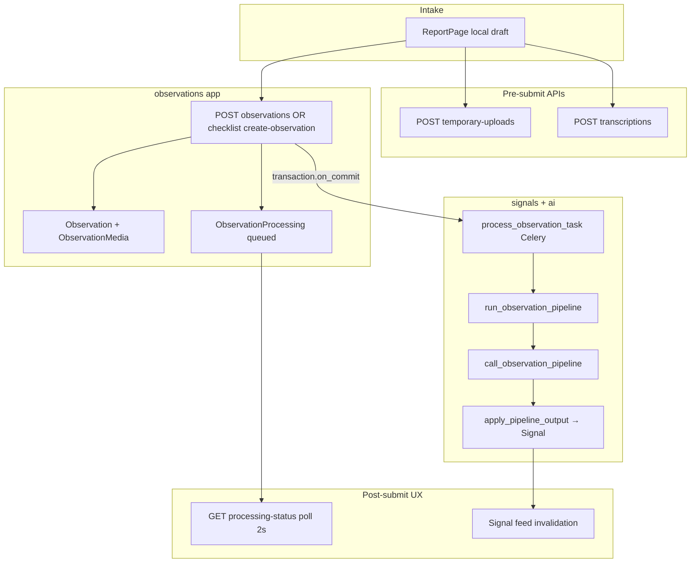

# Observation Domain Audit

Status: audit report  
Date: 2026-06-24  
Scope: Observation intake and lifecycle — models, services, selectors, API, permissions, uploads/media, actor resolution, tests, and related docs  
Mode: audit only — no source changes

Related: [Global Architecture Mapping Audit](./global_architecture_mapping.md), [RBAC Security Audit](./rbac_security_audit.md)

---

## Inspection manifest

### 1. Files inspected

**Contract and rules**

- `AGENTS.md`, `apps/api/AGENTS.md`, `apps/web/AGENTS.md`
- `.cursor/rules/10-backend-django-drf.mdc`, `80-security-data-integrity.mdc`

**Backend — observations core**

- `apps/api/houston/observations/models.py` — `Observation`, `ObservationMedia`, `ObservationProcessing`
- `apps/api/houston/observations/services.py` — `submit_observation`, `validate_observation_text`, `_enqueue_observation_processing`
- `apps/api/houston/observations/selectors.py` — `get_observation_processing_status`, `resolve_ux_status`, signal summaries
- `apps/api/houston/observations/constants.py`
- `apps/api/houston/observations/api/views.py`, `serializers.py`, `urls.py`, `media_views.py`
- `apps/api/houston/observations/media_access.py`, `media_services.py`

**Backend — cross-domain handoff**

- `apps/api/houston/uploads/access.py` — `resolve_observation_actor_membership`
- `apps/api/houston/uploads/permissions.py` — `CanSubmitObservation`
- `apps/api/houston/uploads/api/views.py` — `EstablishmentScopedObservationMixin`, temporary uploads, transcriptions
- `apps/api/houston/signals/services.py` — `run_observation_pipeline`, `apply_pipeline_output`, `recover_stuck_observation_processing_batch`
- `apps/api/houston/signals/tasks.py` — `process_observation_task`
- `apps/api/houston/signals/constants.py` — `FEED_SIGNAL_STATUSES`
- `apps/api/houston/ai/observation_pipeline.py` — `call_observation_pipeline`
- `apps/api/houston/checklists/services.py` — `create_observation_from_task`
- `apps/api/houston/core/observability.py` — log sanitization for `raw_text` / `validated_text`
- `apps/api/houston/establishments/permissions.py` — `can_create_observation`, `is_valid_membership`

**Frontend**

- `apps/web/src/features/observations/` — `report-page.tsx`, `hooks.ts`, `api.ts`, `types.ts`, `processing-status-labels.ts`
- `apps/web/src/features/checklists/hooks.ts` — duplicate checklist observation mutation
- `apps/web/src/features/signals/components/signal-detail-photo-section.tsx`

**Docs**

- `docs/product/domains/observation_domain.md`
- `docs/product/domains/ai_observation_pipeline_contract.md`
- `docs/product/domains/upload_media_domain.md`
- `docs/product/domains/checklist_domain.md` (§3.8 handoff)

### 2. Tests inspected

| Area | Key files |
|------|-----------|
| Submit API + privacy | `observations/tests/test_observation_api.py` |
| Models | `observations/tests/test_models.py` |
| Processing status API | `observations/tests/test_processing_status_api.py` |
| Processing status selectors | `observations/tests/test_processing_status_selectors.py` |
| Enqueue on commit | `observations/tests/test_submit_on_commit_enqueue.py` |
| Checklist handoff | `checklists/tests/test_observation_handoff.py`, `test_task_api.py` |
| Pipeline lifecycle | `signals/tests/test_pipeline_validation.py`, `test_observation_pipeline_recovery.py` |
| Privacy / logs | `ai/tests/test_observation_pipeline_provider.py`, `core/tests/test_observability.py` |
| Realtime no-leak | `realtime/tests/test_observation_pipeline_invalidation.py` |
| Media access | `signals/tests/test_signal_detail_media.py` |
| Signal API no raw text | `signals/tests/test_signal_api_contract.py` |
| Transcription | `uploads/tests/test_transcription_api.py` |
| Frontend | `observations/processing-status-labels.test.ts`, `report-page-success.test.ts` |

Pytest and Vitest were not executed in this audit pass.

### 3. Docs / rules inspected

- `docs/product/domains/observation_domain.md` — authoritative domain doc
- `docs/product/domains/ai_observation_pipeline_contract.md` — AI input/output boundaries
- `docs/product/domains/upload_media_domain.md` — photo lifecycle
- `apps/api/AGENTS.md` — Celery passes IDs only; no raw text in logs
- `.cursor/commands/audit-mode.md`

### 4. Assumptions or unknowns

- Celery broker outage frequency and production load not validated (Houston is dev-phase only).
- OpenAI provider latency/cost at high observation volume not modeled.
- Transcription provider data-retention policy not verified beyond MVP tests.
- Whether processing-status should be submitter-scoped is a product decision, not codified in docs.
- `make backend-test` not run in this audit pass.

---

## 1. Current Observation flow



**Direct path:** `ReportPage` (`/reporting`) → `POST /api/v1/establishments/{id}/observations/` → `submit_observation()` → `Observation` + `ObservationProcessing(status=queued)` + optional `ObservationMedia` → `transaction.on_commit` → Celery `process_observation_task` → `run_observation_pipeline()` in the signals app → `call_observation_pipeline()` (AI) → `apply_pipeline_output()` (Signal creation/aggregation).

**Checklist path:** `POST .../checklist-task-executions/{id}/create-observation/` → `create_observation_from_task()` → same `submit_observation()` with `origin=checklist_task`, checklist FK validation, and assignee check.

**Pre-submit:** Temporary photo uploads (`POST temporary-uploads/`) and voice transcription (`POST transcriptions/`) are establishment-scoped, require `CanSubmitObservation`, and validate uploads belong to the submitting user before link-on-submit.

**Post-submit feedback:** Frontend polls `GET .../observations/{id}/processing-status/` every 2s until terminal; on signal outcome, invalidates establishment signal queries. No observation-specific WebSocket subject exists.

**Intake characteristics:** Thin views, service-owned writes, serializer validation (10–1,000 chars, max 3 photos), no raw text in API responses, uploads scoped to `establishment_id` + `uploaded_by_id`.

---

## 2. Domain ownership assessment

**Answer: Observation is a partially bounded domain — intake is clean; lifecycle and RBAC ownership are split across apps.**

| Concern | Owner today | Assessment |
|---------|-------------|------------|
| Raw input persistence | `houston/observations` | Good — single `submit_observation` entry point |
| Processing lifecycle | `houston/signals` (`run_observation_pipeline`, recovery) | Leaky — observations app enqueues signals Celery task |
| RBAC for intake | `houston/uploads` (`CanSubmitObservation`, mixin, actor resolver) | Misplaced — not in observations |
| Media preview auth | `houston/observations/media_access.py` | Good |
| Media deletion triggers | `houston/signals/services.py` | Cross-domain — signal resolve/cancel drives observation media purge |
| AI contract | `houston/ai` | Correct separation per docs |
| Transcription | `houston/uploads` | Correct per upload domain doc |

The `observations` app has **no `permissions.py`**. All intake authorization lives in `uploads/` and `establishments/`. Docs (`observation_domain.md`) correctly state Observation does not own RBAC internals, but the physical placement in `uploads/` is confusing for maintainers tracing "everything observation."

**Overall:** Intake boundary is solid and test-covered. Post-submit processing is intentionally delegated to signals/ai but creates import coupling (`observations/services.py` → `signals/tasks.py`). Media lifecycle spans observations (storage) and signals (deletion triggers).

---

## 3. Security / privacy risks

**Answer: Input flow is simple and safe for MVP. Raw observation content is well-protected in normal product surfaces; a few edge gaps remain.**

### Strengths (code-evidenced)

| Surface | Protection | Evidence |
|---------|------------|----------|
| Submit API response | No `raw_text` / `text` | `test_observation_api.py` |
| Processing-status API | No raw text; signal summaries only | `test_processing_status_api.py` |
| Signal feed/detail | No observation raw text | `test_signal_api_contract.py` |
| Celery task payload | `observation_id` only | `signals/tasks.py` |
| Logs / observability | `raw_text`, `validated_text` stripped | `core/observability.py`, `test_observability.py` |
| Realtime invalidation | No text in payloads | `test_observation_pipeline_invalidation.py` |
| Frontend draft | Ephemeral React state; cleared on submit; no `localStorage` | `report-page.tsx` |
| Transcription | Audio not persisted | `test_transcription_api.py` |
| Temp uploads | No public URL in API response | `test_observation_api.py` |

### Residual risks

- **Processing-status metadata exposure (OBS-02):** Any active member with `can_create_observation` can poll any observation UUID in their establishment and see derived signal summaries (titles, BU labels, `location_text`). Not raw text, but operational metadata.
- **Media preview token model (OBS-04):** `ObservationMediaPreviewView` uses `AllowAny` + signed token + signal-link gate. No session re-check. URLs embedded in signal detail responses are shareable until TTL expires.
- **Internal raw_text use in pipeline (acceptable):** `call_observation_pipeline` sends `validated_text: observation.raw_text` to AI provider only. `resolve_location_text_for_signal` compares candidate `location_text` against `observation.raw_text` internally — not exposed via API.

### Membership status handling

- `CanSubmitObservation` → `can_create_observation` → `is_valid_membership` (ACTIVE membership, ACTIVE establishment, ACTIVE user).
- `INVITED` and `DEACTIVATED` memberships receive 403 on submit — tested in `test_observation_api.py`.
- Foreign establishment path mismatch returns 403 (permission) or 404 (actor resolution) — tested.

### Establishment isolation

- Observation FK to membership establishment on create.
- Uploads filtered by `establishment_id` + `uploaded_by_id` on link.
- Processing-status selector filters `establishment_id`.
- Signal summaries cross-establishment guard via `result_signal__establishment_id=F("observation__establishment_id")` — tested in `test_processing_status_selectors.py`.

---

## 4. Scalability / query risks

**Answer: Main pain at volume — Celery fan-out, frontend polling, orphan QUEUED rows; DB indexes adequate for current API surface.**

| Risk | Evidence | Impact at scale |
|------|----------|-----------------|
| One Celery task per observation | `process_observation_task.delay` on every submit | Linear broker/worker load; AI latency becomes queue depth |
| Frontend 2s polling | `useObservationProcessingStatusQuery` in `hooks.ts` | N concurrent users × ~0.5 req/s during analysis window |
| No realtime for observations | `OperationalRealtimeInvalidateEvent` has no `observation` subject | Polling is the only post-submit feedback path |
| Indexes adequate today | `(establishment, submitted_at)` on Observation; `(status, queued_at)` on Processing | No list endpoint — low query pressure |
| `media_items.count()` on submit | `views.py` post-create count | Minor — max 3 photos |
| Stuck recovery only for PROCESSING | `recover_stuck_observation_processing_batch` filters `status=processing` | QUEUED orphans not recovered (OBS-01) |

No N+1 on hot paths today (single-observation reads). Volume growth will hit **async pipeline throughput** and **polling** before DB indexes become the bottleneck.

---

## 5. Ambiguities — AI / signals / uploads

**Answer: Upload/media permissions are correctly tied to observation intake. Post-submit media access is signal-gated. Handoff to AI/signals is explicit in code but ownership-split.**

### Explicit handoff (code)

```python
# observations/services.py — after commit
process_observation_task.delay(str(observation_id))

# signals/tasks.py → signals/services.py
run_observation_pipeline(observation_id)
  → call_observation_pipeline(observation)   # houston/ai
  → apply_pipeline_output(observation, output)  # Signal create/aggregate
```

### Upload / media

| Stage | Permission | Notes |
|-------|------------|-------|
| Temp upload | `CanSubmitObservation` + user ownership | Validated before link |
| Link on submit | Service-layer ownership re-check | `TemporaryUpload.Status.VALIDATED` required |
| Preview | Signed token + `CREATED_FROM` signal in `FEED_SIGNAL_STATUSES` | No bearer auth on GET |
| Deletion | Signal resolve/cancel or aggregation without active `CREATED_FROM` | `media_services.delete_all_observation_media` |

### Ambiguities / drift

- **`NOT_ACTIONABLE` outcome** defined in `ObservationProcessing.Outcome` but never assigned in `apply_pipeline_output` — docs list it; code uses `no_signal_created` instead (OBS-05).
- **Doc staleness:** `observation_domain.md` §9 marks `GET processing-status` as "deferred" — implemented and tested (OBS-06).
- **Events:** Domain doc §8 lists candidate `ObservationCreated` etc.; no observation events in code — pipeline emits signal realtime invalidation instead.
- **Frontend duplicate:** `useCreateChecklistTaskObservationMutation` in checklists hooks is unused; `useChecklistReportSubmitMutation` in observations hooks is the active path (OBS-08).
- **Checklist vs direct permissions:** Direct submit uses `can_create_observation`; checklist uses `can_execute_checklist_tasks` + assignee check — correct but undocumented in observation doc (OBS-10).

---

## Findings (10)

### OBS-01 — Celery enqueue failure leaves observation permanently QUEUED

- **Severity:** P1
- **Category:** scalability / maintainability
- **Evidence:** `_enqueue_observation_processing` in `apps/api/houston/observations/services.py`; `recover_stuck_observation_processing_batch` in `apps/api/houston/signals/services.py` (filters `status=processing` only)
- **Problem:** If the Celery broker is unavailable at submit time, the observation persists as `queued` but no task runs. The on-commit callback logs and re-raises, but the transaction is already committed. No recovery job targets orphaned `queued` rows.
- **Why it matters now:** Rare in dev; user sees endless "analysis pending" with no automatic recovery.
- **Why it will hurt later:** Broker blips during peak intake create a silent pipeline backlog invisible to operators.
- **Recommended fix:** Add a Beat job to re-enqueue stale `queued` observations past a threshold; optionally record `enqueue_failed` on processing row. Consider inline retry with backoff before giving up.
- **Tests to add/update:** Simulate `delay()` exception in `test_submit_on_commit_enqueue.py`; assert recovery job re-enqueues orphaned rows.
- **Suggested implementation size:** M

### OBS-02 — Processing-status lacks object-level authorization

- **Severity:** P2
- **Category:** security / ambiguity
- **Evidence:** `ObservationProcessingStatusView` in `apps/api/houston/observations/api/views.py`; `get_observation_processing_status` in `selectors.py` — filters by `establishment_id` only, not `submitted_by_membership`
- **Problem:** Any active member with submit permission can read processing status and signal summaries for any observation UUID in their establishment.
- **Why it matters now:** Low risk in small teams where all staff share operational context.
- **Why it will hurt later:** Cross-team metadata exposure if observation UUIDs leak via screenshots, shared links, or support tickets.
- **Recommended fix:** Product decision required — restrict to submitter + admins, or document establishment-wide visibility as intentional.
- **Tests to add/update:** Member A submits; Member B polls status — assert 404 or 200 per chosen policy in `test_processing_status_api.py`.
- **Suggested implementation size:** S

### OBS-03 — Domain boundary: pipeline lifecycle owned by signals, RBAC by uploads

- **Severity:** P2
- **Category:** structure / maintainability
- **Evidence:** No `observations/permissions.py`; `EstablishmentScopedObservationMixin` and `CanSubmitObservation` in `uploads/`; `run_observation_pipeline` in `signals/services.py`
- **Problem:** Observation-related changes require navigating three apps. No single module map for "everything observation."
- **Why it matters now:** Manageable at MVP codebase size.
- **Why it will hurt later:** Onboarding cost rises; permission updates may be missed when adding observation endpoints.
- **Recommended fix:** Move observation-scoped mixin and permissions into `observations/permissions.py`; keep pipeline in signals but document handoff contract in observations module doc or AGENTS note.
- **Tests to add/update:** Import-path refactor only — existing integration tests suffice.
- **Suggested implementation size:** M

### OBS-04 — Media preview security depends on signed URL + signal link only

- **Severity:** P2
- **Category:** security
- **Evidence:** `ObservationMediaPreviewView` (`AllowAny`) in `api/media_views.py`; `is_observation_media_preview_authorized` in `media_access.py` requires `CREATED_FROM` + `FEED_SIGNAL_STATUSES`
- **Problem:** Bearer-less preview URLs are shareable until TTL. No per-user session re-auth on GET. Security depends on token secrecy and signal visibility rules.
- **Why it matters now:** Acceptable MVP pattern for private media; tests cover invalid token and wrong establishment.
- **Why it will hurt later:** URL forwarding, Referer leakage, or long TTL increase exposure window.
- **Recommended fix:** Review TTL setting; add negative tests for unlinked observation and post-deletion preview; consider session-bound preview for higher assurance.
- **Tests to add/update:** Preview 404 without `CREATED_FROM` link; preview 404 after media deleted on terminal signal resolve — extend `test_signal_detail_media.py`.
- **Suggested implementation size:** S–M

### OBS-05 — `NOT_ACTIONABLE` outcome is dead code / doc drift

- **Severity:** P3
- **Category:** ambiguity
- **Evidence:** `ObservationProcessing.Outcome.NOT_ACTIONABLE` in `models.py`; `apply_pipeline_output` in `signals/services.py` never assigns it
- **Problem:** UX status mapping and domain doc reference an outcome that cannot occur in current pipeline code.
- **Why it matters now:** No user-visible bug; `no_signal_created` covers the practical case.
- **Why it will hurt later:** Confusion when implementing "not actionable" product semantics or analytics on outcomes.
- **Recommended fix:** Either implement in pipeline when AI returns explicit non-actionable result, or remove from model and docs.
- **Tests to add/update:** Pipeline outcome assignment test once product decides.
- **Suggested implementation size:** S

### OBS-06 — Authoritative doc stale on processing-status API

- **Severity:** P3
- **Category:** ambiguity / maintainability
- **Evidence:** `observation_domain.md` §9 lines 166–167 list `GET processing-status` as "deferred"; implemented in `observations/api/urls.py` and tested
- **Problem:** Domain doc contradicts code and OpenAPI schema; misleads agents and developers.
- **Why it matters now:** Causes incorrect assumptions during feature work and audits.
- **Why it will hurt later:** Accumulates distrust in domain docs as source of truth.
- **Recommended fix:** Update §9 to mark endpoint implemented; remove "Phase 3 deferred" note.
- **Tests to add/update:** None — doc-only.
- **Suggested implementation size:** S

### OBS-07 — Frontend polling instead of realtime for observation processing

- **Severity:** P3
- **Category:** performance / scalability
- **Evidence:** `useObservationProcessingStatusQuery` polls every 2s in `apps/web/src/features/observations/hooks.ts`; no `observation` subject in realtime types
- **Problem:** Acceptable for MVP; generates sustained API load during concurrent analysis windows.
- **Why it matters now:** Negligible with low concurrent submit volume.
- **Why it will hurt later:** Peak shift-change reporting could produce hundreds of concurrent polls.
- **Recommended fix:** Defer until volume warrants; optional `observation` realtime invalidation subject to stop polling on terminal state.
- **Tests to add/update:** Realtime integration test if implemented.
- **Suggested implementation size:** L

### OBS-08 — Duplicate unused checklist observation hook

- **Severity:** P3
- **Category:** maintainability
- **Evidence:** `useCreateChecklistTaskObservationMutation` in `apps/web/src/features/checklists/hooks.ts` — zero usages; `useChecklistReportSubmitMutation` in observations hooks is active
- **Problem:** Dead code duplicates the same API call with similar invalidation logic.
- **Why it matters now:** Minor confusion for frontend maintainers.
- **Why it will hurt later:** Risk of divergent invalidation if someone wires the wrong hook.
- **Recommended fix:** Remove unused hook from checklists.
- **Tests to add/update:** None if removal only.
- **Suggested implementation size:** S

### OBS-09 — No dedicated permission unit tests for observation actor resolution

- **Severity:** P3
- **Category:** tests
- **Evidence:** RBAC covered via `test_observation_api.py` (403 foreign/inactive); `resolve_observation_actor_membership` in `uploads/access.py` has no focused unit tests for deactivated establishment or session establishment mismatch edge cases
- **Problem:** Permission regressions may only surface in slower API integration tests.
- **Why it matters now:** Current integration coverage is adequate for MVP.
- **Why it will hurt later:** As permission rules grow, gaps in actor resolution become harder to catch.
- **Recommended fix:** Add `observations/tests/test_permissions.py` or extend `uploads/tests/` with actor resolution matrix.
- **Tests to add/update:** Unit tests for `resolve_observation_actor_membership` with inactive establishment, wrong session establishment, invited membership.
- **Suggested implementation size:** S

### OBS-10 — Checklist vs direct submit permission asymmetry undocumented

- **Severity:** P3
- **Category:** ambiguity
- **Evidence:** Direct path uses `can_create_observation`; checklist path uses `can_execute_checklist_tasks` + assignee check in `checklists/services.py` before calling `submit_observation`
- **Problem:** Two different permission models converge on the same service — correct behavior but easy to miss when extending observation intake.
- **Why it matters now:** No bug; both paths are tested separately.
- **Why it will hurt later:** New intake origin (e.g. action-linked observation) may apply wrong permission gate.
- **Recommended fix:** Document both paths in `observation_domain.md` §7.
- **Tests to add/update:** None — doc-only.
- **Suggested implementation size:** S

---

## Answers to scope questions

| # | Question | Verdict |
|---|----------|---------|
| 1 | Is Observation a clean bounded domain? | **Partially** — intake yes; lifecycle/RBAC spread across signals/uploads |
| 2 | Is the input flow simple and safe? | **Yes** — validated, tenant-scoped, privacy-conscious |
| 3 | Are uploads/media permissions correctly tied to observation access? | **Yes for intake**; post-submit preview is signal-gated signed URLs |
| 4 | Is raw observation content protected from logs, events, frontend storage, async payloads? | **Yes** in normal surfaces; minor metadata leak via processing-status for any submit-capable peer |
| 5 | Is the handoff to downstream AI/signals explicit or ambiguous? | **Explicit in code** (`on_commit` → Celery → `run_observation_pipeline`); **ambiguous in ownership/docs** |
| 6 | What will become painful when observation volume grows? | Celery/AI throughput, frontend polling load, orphan QUEUED rows, no batch intake or admin queue surfacing |

---

## Fix now vs later

### Fix now (P1–P2)

1. **OBS-01** — Orphan QUEUED recovery after Celery enqueue failure
2. **OBS-02** — Clarify or restrict processing-status object-level access
3. **OBS-04** — Add missing media preview negative tests; review TTL
4. **OBS-06** — Doc sync for processing-status endpoint

### Quick wins

- Update `observation_domain.md` §9 (OBS-06)
- Remove dead `useCreateChecklistTaskObservationMutation` (OBS-08)
- Add processing-status cross-member test to lock policy (OBS-02)
- Resolve or remove `NOT_ACTIONABLE` enum (OBS-05)
- Document checklist vs direct permission paths (OBS-10)

### Structural issues to plan later

- Consolidate observation RBAC into `observations/permissions.py` (OBS-03)
- Realtime invalidation for processing-status to replace polling (OBS-07)
- Beat/metrics dashboard for pipeline queue depth and enqueue failures

### Things not worth fixing now

- `media_items.count()` micro-optimization (max 3 items)
- Frontend `useAuth()` no-op calls in observation hooks
- Multipart endpoints using `fetchWithAuthRetry` instead of `apiClient` (consistency only)
- Moving pipeline into observations app (signals ownership is intentional)

---

## Tests required

| Priority | Test | Suggested file |
|----------|------|----------------|
| P1 | Enqueue failure → recovery re-processes QUEUED observation | `observations/tests/test_submit_on_commit_enqueue.py` or new recovery test |
| P2 | Processing-status access policy (submitter vs peer member) | `observations/tests/test_processing_status_api.py` |
| P2 | Preview blocked without `CREATED_FROM` link | `signals/tests/test_signal_detail_media.py` |
| P2 | Preview blocked after media deleted on terminal resolve | extend `test_signal_detail_media.py` |
| P3 | `resolve_observation_actor_membership` unit matrix | new `observations/tests/test_permissions.py` |
| P3 | `NOT_ACTIONABLE` outcome behavior once product decides | `signals/tests/test_pipeline_validation.py` |

---

## Suggested implementation order

1. **OBS-01** — Enqueue failure recovery (data integrity / user-visible stuck state)
2. **OBS-02** — Processing-status authorization policy + regression test
3. **OBS-04** — Media preview negative tests (+ TTL review if needed)
4. **OBS-06 + OBS-05 + OBS-10** — Doc sync and outcome enum cleanup
5. **OBS-08** — Remove dead frontend hook
6. **OBS-03** — Permission module consolidation (when next touching observation API)
7. **OBS-07** — Realtime/polling optimization (when observation volume justifies)

---

## Top 3 fixes to do first

1. **OBS-01** — Add recovery for observations stuck in `queued` after failed Celery enqueue (highest user impact, silent failure mode).
2. **OBS-02** — Decide and enforce processing-status visibility policy (submitter-only vs establishment-wide).
3. **OBS-04** — Close media preview test gaps and review signed URL TTL.

---

## Closing assessment

Houston's Observation domain delivers a **clean, privacy-conscious intake boundary**: single `submit_observation` service, no raw text in product APIs, strong log/event sanitization, and correct establishment isolation on writes. The operational loop handoff to AI and Signals is **explicit and test-covered** via Celery + `run_observation_pipeline`.

The main weaknesses are **operational resilience** (orphan QUEUED rows after enqueue failure), **object-level read policy ambiguity** on processing-status, and **structural sprawl** (RBAC in uploads, lifecycle in signals) that will increase maintenance cost as intake origins and volume grow. None of these block MVP dev work; OBS-01 should be addressed before any production pilot with real concurrent field reporting.

**Changed:** Created `docs/audits/03_observation_audit.md`  
**Validated:** Read-only code/doc inspection; audit-mode format; 10 findings; all required sections  
**Risks / not verified:** `make backend-test` not executed; transcription provider retention policy; production load characteristics
