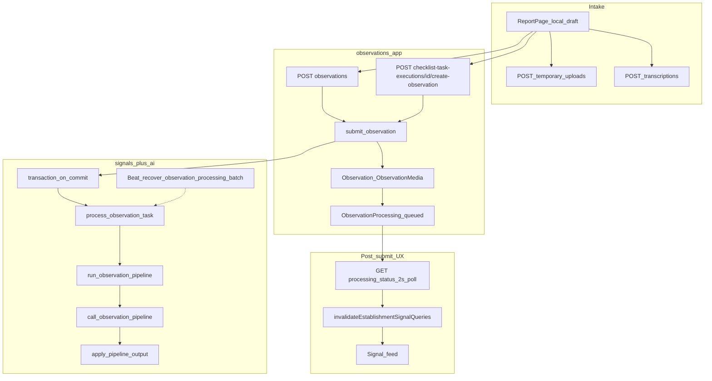

# Observation Refresh Audit

Status: audit report  
Date: 2026-06-25  
Scope: Observation intake boundary after Checklist, Execution Feed, Action, and Signal work — models, services, API, permissions, processing state, uploads/media, AI/Signal handoff, tests, docs  
Mode: audit only — no source changes

Related: [Observation Domain Audit](./observation_audit.md), [Onboarding + Observation + AI Consolidation](./onboarding_observation_ai_consolidation.md), [Checklist Consolidation](./checklist_consolidation.md)

---

## Inspection manifest

### 1. Files inspected

**Contract and rules**

- `AGENTS.md`, `apps/api/AGENTS.md`, `apps/web/AGENTS.md`
- `.cursor/rules/10-backend-django-drf.mdc`, `80-security-data-integrity.mdc`

**Backend — observations core**

- `apps/api/houston/observations/models.py` — `Observation`, `ObservationMedia`, `ObservationProcessing`
- `apps/api/houston/observations/services.py` — `submit_observation`, `validate_observation_text`, `_enqueue_observation_processing`
- `apps/api/houston/observations/selectors.py` — `get_observation_processing_status`, `resolve_ux_status`, signal summaries
- `apps/api/houston/observations/permissions.py` — `can_view_observation_processing_status`
- `apps/api/houston/observations/constants.py`, `exceptions.py`
- `apps/api/houston/observations/api/views.py`, `serializers.py`, `urls.py`, `media_views.py`
- `apps/api/houston/observations/media_access.py`, `media_services.py`

**Backend — cross-domain handoff**

- `apps/api/houston/checklists/services.py` — `create_observation_from_task`, `record_task_observation_created`
- `apps/api/houston/checklists/api/views.py` — `ChecklistTaskExecutionCreateObservationView`
- `apps/api/houston/checklists/permissions.py` — `can_execute_checklist_tasks`
- `apps/api/houston/uploads/access.py` — `resolve_observation_actor_membership`
- `apps/api/houston/uploads/permissions.py` — `CanSubmitObservation`
- `apps/api/houston/uploads/api/views.py` — `EstablishmentScopedObservationMixin`, temporary uploads, transcriptions
- `apps/api/houston/establishments/permissions.py` — `can_create_observation`
- `apps/api/houston/signals/services.py` — `run_observation_pipeline`, `apply_pipeline_output`, recovery sweeps
- `apps/api/houston/signals/tasks.py` — `process_observation_task`, `recover_stuck_observation_processing_task`
- `apps/api/houston/signals/constants.py` — `FEED_SIGNAL_STATUSES`
- `apps/api/houston/signals/api/serializers.py` — `build_observation_media_preview_url`
- `apps/api/houston/ai/observation_pipeline.py` — `call_observation_pipeline`
- `apps/api/config/settings.py` — Beat schedule, stuck-warning thresholds

**Frontend**

- `apps/web/src/features/observations/pages/report-page.tsx`
- `apps/web/src/features/observations/hooks.ts`, `api.ts`, `types.ts`
- `apps/web/src/features/observations/processing-status-labels.ts`, `processing-status-popup.ts`
- `apps/web/src/features/checklists/api.ts` — `createChecklistTaskObservation`

**Docs**

- `docs/product/domains/observation_domain.md`
- `docs/product/domains/ai_observation_pipeline_contract.md`
- `docs/product/domains/checklist_domain.md` (§3.8 handoff)
- `docs/product/domains/upload_media_domain.md`

### 2. Tests inspected

| Area | Key files |
|------|-----------|
| Submit API + privacy | `observations/tests/test_observation_api.py` |
| Models | `observations/tests/test_models.py` |
| Processing status API | `observations/tests/test_processing_status_api.py` |
| Processing status selectors | `observations/tests/test_processing_status_selectors.py` |
| Enqueue on commit + orphan recovery | `observations/tests/test_submit_on_commit_enqueue.py` |
| Checklist handoff | `checklists/tests/test_observation_handoff.py`, `test_task_api.py` |
| Pipeline lifecycle + recovery | `signals/tests/test_observation_pipeline_recovery.py`, `test_pipeline_validation.py` |
| Privacy / feed | `signals/tests/test_signal_feed_reporter.py`, `test_signal_api_contract.py` |
| Media preview | `signals/tests/test_signal_detail_media.py` |
| Realtime no-leak | `realtime/tests/test_observation_pipeline_invalidation.py` |
| Upload link-on-submit | `uploads/tests/test_temporary_upload_api.py` |
| Frontend labels | `observations/processing-status-labels.test.ts`, `report-page-success.test.ts` |

Pytest and Vitest were not executed in this audit pass.

### 3. Docs / rules inspected

- `docs/product/domains/observation_domain.md` — authoritative domain doc (§7 permissions, §9 API)
- `docs/product/domains/ai_observation_pipeline_contract.md` — pipeline outcomes
- `apps/api/AGENTS.md` — Observation → AI → Signal ownership table
- `.cursor/commands/audit-mode.md`

### 4. Assumptions or unknowns

- Celery Beat (`recover-stuck-observation-processing`) assumed running in deployed stacks.
- `HOUSTON_OBSERVATION_PROCESSING_STUCK_WARNING_SECONDS` defaults to `2 × HOUSTON_AI_OBSERVATION_TIMEOUT_SECONDS` — exact orphan latency depends on env.
- OpenAI provider latency/cost at high observation volume not modeled (dev-phase only).
- `make backend-test` not run in this audit pass.

### Resolved since prior audits (not re-opened)

| Prior ID | Resolution |
|----------|------------|
| **OBS-02** / processing-status peer read | `can_view_observation_processing_status` limits reads to submitter + `ADMIN_ROLES` (owner/director). Peer staff/manager 404 tests in `test_processing_status_api.py`. |
| **C-02** / orphan `queued` and `retrying` | `recover_orphaned_observation_processing_batch` re-enqueues stale `queued` and orphan `retrying` rows; stuck `processing` recovery re-enqueues when moved to `retrying`. Beat task in `settings.py`. Covered in `test_observation_pipeline_recovery.py` and `test_submit_on_commit_enqueue.py`. |
| **OBS-06** / processing-status doc drift | `observation_domain.md` §9 now lists processing-status as implemented. |

---

## 1. Current flow

**Direct path:** `ReportPage` (`/reporting`) → `POST /api/v1/establishments/{id}/observations/` → `submit_observation()` → `Observation` + `ObservationProcessing(status=queued)` + optional `ObservationMedia` → `transaction.on_commit` → Celery `process_observation_task` → `run_observation_pipeline()` → `call_observation_pipeline()` (AI) → `apply_pipeline_output()` (Signal create/aggregate).

**Checklist path:** `POST .../checklist-task-executions/{id}/create-observation/` → `create_observation_from_task()` → same `submit_observation()` with `origin=checklist_task`, checklist FKs, and assignee validation → `record_task_observation_created()` updates task to `observation_created` and may complete execution. No synchronous Signal or Action creation.

**Pre-submit:** Temporary photo uploads and voice transcription are establishment-scoped, require `CanSubmitObservation` (→ `can_create_observation` → active membership), and validate uploads belong to the submitting user (`status=validated`) before link-on-submit.

**Post-submit feedback:** Frontend polls `GET .../observations/{id}/processing-status/` every 2s until terminal; on `processed` + signal UX status, invalidates establishment signal queries. Pipeline completion emits signal invalidation via realtime (no observation-specific WS subject).

**Intake characteristics:** Thin views, service-owned writes, serializer validation (10–1,000 chars, max 3 photos), no raw text in API responses, uploads scoped to `establishment_id` + `uploaded_by_id`.

### Domain ownership (refresh assessment)

| Concern | Owner today | Assessment |
|---------|-------------|------------|
| Raw input persistence | `houston/observations` | Good — single `submit_observation` entry point |
| Processing lifecycle | `houston/signals` | Intentional per `apps/api/AGENTS.md`; observations enqueues on commit |
| Processing-status read API | `houston/observations` | Good — selector + submitter/admin gate |
| RBAC for direct intake | `houston/uploads` + `establishments` | Misplaced physically but documented; not regressed by Checklist work |
| Checklist-origin intake | `houston/checklists` → `observations` | Good — lifecycle guards before/after submit |
| Media preview auth | `houston/observations/media_access.py` | Good gate; token model has residual risk (OR-03) |
| Media deletion triggers | `houston/signals/services.py` | Cross-domain by design — signal resolve/cancel drives purge |

**Verdict:** Observation remains a **clean, safe entry point**. Checklist, Execution Feed, Action, and Signal work did not erode the intake boundary. Residual risk is **async handoff reliability, test gaps, and doc/enum drift** — not ownership collapse.

---

## 2. Top findings

### OR-01 — Post-commit enqueue failure invisible to client

- **Severity:** P2
- **Category:** recovery / API contract
- **Evidence:** `observations/services.py` — `_enqueue_observation_processing` (L125–140) logs `observation_processing_enqueue_failed` and re-raises; called only via `transaction.on_commit` after `submit_observation` returns. Recovery: `signals/services.py` — `recover_orphaned_observation_processing_batch`; Beat `recover-stuck-observation-processing` in `config/settings.py` (hourly at minute `:15`). Service test: `test_enqueue_failure_leaves_queued_for_recovery` in `test_submit_on_commit_enqueue.py` — no API-level test.
- **Problem:** If Celery `delay()` fails after the DB transaction commits, the HTTP client has already received `201 Created` with `processing_status: queued`. The observation stays orphaned until the Beat sweep (plus `HOUSTON_OBSERVATION_PROCESSING_STUCK_WARNING_SECONDS` cutoff).
- **Why it matters now:** Reporters see success UI and poll `analysis_queued` indefinitely until recovery or manual ops.
- **Why it will hurt later:** Broker outages or misconfigured workers at scale produce silent backlog; support cannot distinguish “submitted OK” from “never enqueued.”
- **Recommended fix:** Document contract in API schema; add API integration test asserting 201 + orphan `queued` on on_commit failure; optional alert on `observation_processing_enqueue_failed` log event; consider returning `202` or a `handoff_degraded` flag if product accepts contract change.
- **Tests to add/update:** `test_api_submit_201_when_enqueue_fails_on_commit_observation_stays_queued`
- **Suggested implementation size:** S

### OR-02 — LLM retry non-idempotence under divergent output

- **Severity:** P2
- **Category:** idempotence / tests
- **Evidence:** `signals/tasks.py` — `process_observation_task` retries on `ObservationPipelineUnavailableError` / `ObservationPipelineTimeoutError` when status is `retrying`. `signals/tests/test_observation_pipeline_recovery.py` — `test_provider_unavailable_then_retry_completes_without_duplicate_signals` uses a flaky provider that returns **same** output on second call. No test where retry produces different `issue_focus` / aggregation keys.
- **Problem:** Each retry re-invokes `call_observation_pipeline`. If the provider returns a different candidate set, `apply_pipeline_output` may create additional Signals when aggregation keys differ.
- **Why it matters now:** Transient provider failures are expected; idempotence on `PROCESSED` is tested (`test_double_pipeline_on_processed_is_noop`) but not on divergent retry paths.
- **Why it will hurt later:** Duplicate operational Signals from one Observation undermine feed trust and supervisor workload.
- **Recommended fix:** Persist parsed pipeline output before apply on first successful LLM call; or mark processing failed after N divergent retries; add integration test with divergent fake provider.
- **Tests to add/update:** Celery retry test with two different `FakeObservationPipelineProvider` payloads → assert single signal set or explicit `failed`
- **Suggested implementation size:** M

### OR-03 — Media preview token shareability; incomplete negative tests

- **Severity:** P2
- **Category:** security / tests
- **Evidence:** `observations/api/media_views.py` — `ObservationMediaPreviewView` uses `AllowAny`; `media_access.py` — `resolve_observation_media_preview` validates signed token + `is_observation_media_preview_authorized` (`CREATED_FROM` link + `FEED_SIGNAL_STATUSES`). Preview URLs embedded in signal detail (`signals/api/serializers.py`). Tests: `test_preview_rejects_invalid_token`, `test_preview_rejects_wrong_establishment` in `test_signal_detail_media.py`. **Missing:** preview without feed signal link, expired TTL, `no_signal_created` path.
- **Problem:** Anyone with the signed URL can fetch binary media until TTL (`HOUSTON_OBSERVATION_MEDIA_PREVIEW_TTL_SECONDS`, default 3600) without session re-auth.
- **Why it matters now:** MVP accepts operational photo context on Signals; URL forwarding is a realistic leak vector for field photos.
- **Why it will hurt later:** RGPD review will ask for session-bound access or shorter TTL with audit trail.
- **Recommended fix:** Add negative tests for current gates; product decision on session auth vs signed URL; document threat model in `upload_media_domain.md`.
- **Tests to add/update:** `test_preview_404_without_created_from_feed_signal`, `test_preview_404_expired_token`
- **Suggested implementation size:** S (tests); M (session auth, if chosen)

### OR-04 — Intake edge-case regression gaps

- **Severity:** P2
- **Category:** tests
- **Evidence:** `submit_observation` filters uploads with `status=VALIDATED` only — linked uploads return `ObservationUploadNotFoundError` (404) but no dedicated test. `create_observation_from_task` rejects non-`pending` tasks (`checklists/services.py` L1153–1154) but no API test for double `create-observation` on same task. `test_processing_status_owner_can_read_peer_observation` exists; no director variant. Enqueue failure documented at service layer only (OR-01).
- **Problem:** Important guards are implemented but not fully regression-locked at API boundary.
- **Why it matters now:** Upload reuse and checklist double-submit are plausible client bugs (double-tap, retry).
- **Why it will hurt later:** Refactors to submit or checklist handoff can regress without CI signal.
- **Recommended fix:** Add the four S-sized API tests listed in §5.
- **Tests to add/update:** See §5 Tests needed table
- **Suggested implementation size:** S

### OR-05 — `NOT_ACTIONABLE` outcome is dead code / doc drift

- **Severity:** P3
- **Category:** ambiguity / maintainability
- **Evidence:** `observations/models.py` — `ObservationProcessing.Outcome.NOT_ACTIONABLE`; `signals/services.py` — `apply_pipeline_output` never assigns it (empty candidates → `no_signal_created`). `ai_observation_pipeline_contract.md` and `observation_domain.md` §6 still list `not_actionable`.
- **Problem:** Enum and docs imply a distinct business outcome that code never produces.
- **Why it matters now:** Processing-status UX and analytics cannot distinguish “AI declined” from “no candidates.”
- **Why it will hurt later:** Product asks for “not actionable” reporting; engineers grep the enum and assume it works.
- **Recommended fix:** Product decision: implement in `apply_pipeline_output` for explicit AI decline, or remove from model/docs and use `no_signal_created` only.
- **Tests to add/update:** `test_apply_pipeline_sets_not_actionable` or doc-only cleanup
- **Suggested implementation size:** S

### OR-06 — Cross-app enqueue coupling (documented)

- **Severity:** P3
- **Category:** structure
- **Evidence:** `observations/services.py` imports `houston.signals.tasks.process_observation_task`; `apps/api/AGENTS.md` documents this as intentional MVP coupling.
- **Problem:** Observations app depends on signals for post-submit handoff; import graph is inverted vs naive layering.
- **Why it matters now:** Low — documented and tested (`test_submit_on_commit_enqueue.py`).
- **Why it will hurt later:** Extracting observations as a standalone module requires moving enqueue indirection.
- **Recommended fix:** No change until pipeline refactor; optional thin `pipeline` facade if touching imports anyway.
- **Tests to add/update:** Existing import-graph test in `signals/tests/test_import_graph.py`
- **Suggested implementation size:** M (only if refactoring)

### OR-07 — Processing-status polling without realtime subject

- **Severity:** P3
- **Category:** performance / UX
- **Evidence:** `apps/web/src/features/observations/hooks.ts` — `PROCESSING_POLL_INTERVAL_MS = 2000`; `shouldPollProcessingStatus` until terminal. No `observation` WS invalidation subject; signal feed uses generic invalidation after terminal processing.
- **Problem:** Every post-submit reporter polls every 2s until pipeline completes.
- **Why it matters now:** Acceptable for MVP field volume.
- **Why it will hurt later:** Concurrent reporters × polling adds read load; battery use on mobile.
- **Recommended fix:** Defer until generic realtime matures; add `observation.processing` invalidation subject when WS contract stabilizes.
- **Tests to add/update:** Hook test for `refetchInterval` behavior (optional)
- **Suggested implementation size:** M

### OR-08 — Direct vs checklist permission asymmetry under-documented

- **Severity:** P3
- **Category:** ambiguity / permissions
- **Evidence:** Direct: `CanSubmitObservation` → `can_create_observation` → any `is_valid_membership` (`establishments/permissions.py` L49–50). Checklist: `can_execute_checklist_tasks` → assignee only (`checklists/permissions.py` L204–212). `observation_domain.md` §7 references checklist doc §3.8 but does not spell out the asymmetry.
- **Problem:** Engineers may assume checklist and direct paths share the same RBAC rule.
- **Why it matters now:** Behavior is correct; docs are thin.
- **Why it will hurt later:** Support tickets (“why can't manager file checklist observation for assignee?”).
- **Recommended fix:** Add a short permissions table to `observation_domain.md` §7.
- **Tests to add/update:** Existing checklist permission tests suffice
- **Suggested implementation size:** S

### OR-09 — `ReportPage` lacks component/integration tests

- **Severity:** P3
- **Category:** maintainability / tests
- **Evidence:** `report-page.tsx` — dual submit path (`useSubmitObservationMutation` vs `useChecklistReportSubmitMutation`), processing poll, success panel. Tests: `report-page-success.test.ts`, `processing-status-labels.test.ts` — label/helper units only; `lazy-terrain-pages.test.ts` smoke-imports page.
- **Problem:** UI regressions on checklist query-param context, double-submit guard, or processing popup are not caught by CI.
- **Why it matters now:** Page is stable but growing (photos, voice, checklist branch).
- **Why it will hurt later:** Execution Feed → report handoff changes break silently.
- **Recommended fix:** Component test with mocked mutations: checklist context selects checklist API; success shows processing panel.
- **Tests to add/update:** `report-page.test.tsx` (M)
- **Suggested implementation size:** M

### OR-10 — Checklist return UX tied to execution-feed materialization (follow-up)

- **Severity:** P3
- **Category:** follow-up (not Observation defect)
- **Evidence:** [`checklist_consolidation.md`](./checklist_consolidation.md) — CL-01/EF-01: `ensure_visible_executions_materialized` on every execution-feed GET without early-exit. Checklist-origin report returns via execution/checklist UI, not Observation API.
- **Problem:** After checklist submit, user perception of “handoff complete” depends on feed materialization latency — outside Observation ownership.
- **Why it matters now:** Can feel slow returning to execution detail after successful observation.
- **Why it will hurt later:** Scales with assignment volume on feed GET.
- **Recommended fix:** Track under Checklist/Execution Feed audit (CL-01a early-exit).
- **Tests to add/update:** `test_ensure_visible_skips_when_no_visible_assignments` (checklist track)
- **Suggested implementation size:** S (bounded slice)

---

## 3. Fix now vs later

### Fix now (S, no product gate)

| ID | Action |
|----|--------|
| OR-04 | API tests: linked-upload resubmit 404, checklist double `create-observation` 400, director processing-status 200 |
| OR-03 | Partial: `test_preview_404_without_created_from_feed_signal`, expired token test |
| OR-01 | Partial: API test documenting 201 + orphan `queued` on on_commit enqueue failure; optional log alert |

### Fix later (M or product)

| ID | Action |
|----|--------|
| OR-02 | Persist pipeline output before apply, or deterministic retry policy |
| OR-07 | Observation processing realtime invalidation when WS contract matures |
| OR-05 | Product decision on `NOT_ACTIONABLE` |
| OR-06 | Thin orchestrator only if refactoring pipeline |
| OR-10 | Execution feed materialization decouple (checklist track) |

### Not worth fixing now

- OR-06 documented coupling in `apps/api/AGENTS.md`
- OR-08 if product accepts “any active member can direct-report”
- OR-07 polling interval tuning without realtime alternative

---

## 4. Product decisions

1. **Enqueue failure UX:** Should submit return `201` when persistence succeeded but queue handoff failed, or surface degraded state (e.g. `handoff_pending`) to the reporter?
2. **`NOT_ACTIONABLE` vs `no_signal_created`:** Keep distinct outcomes or collapse model/docs?
3. **Media preview model:** Accept shareable signed URLs until TTL, or require session auth on preview GET?
4. **Direct-report permission breadth:** Should `can_create_observation` remain “any active member” or narrow by role?
5. **Admin processing-status:** Confirm owner/director-only (managers receive 404) is intentional for supervisor privacy.

---

## 5. Tests needed

| Priority | Test | Finding |
|----------|------|---------|
| S | `test_submit_rejects_already_linked_upload` — second submit with same `temporary_upload_id` → 404 | OR-04 |
| S | `test_checklist_create_observation_rejects_second_submit_on_same_task` → 400 | OR-04 |
| S | `test_processing_status_director_can_read_peer_observation` | OR-04 |
| S | `test_preview_404_without_created_from_feed_signal` | OR-03 |
| S | `test_preview_404_expired_token` | OR-03 |
| S | `test_api_submit_201_when_enqueue_fails_on_commit_observation_stays_queued` | OR-01 |
| M | Celery retry with **divergent** fake provider outputs → single signal set or explicit failure | OR-02 |
| M | `ReportPage` component test: checklist context, processing panel | OR-09 |

---

## 6. Next audit

Recommended sequencing:

1. **Signal domain refresh** — feed visibility, aggregation keys, action handoff, reporter display (direct consumer of Observation pipeline output)
2. **Upload / Media domain** — temporary upload lifecycle, transcription contract, preview auth threat model
3. **AI pipeline orchestration refresh** — provider cost/latency, prompt versioning, eval corpus drift

---

## Closing summary

### Top 3 fixes to do first

1. **OR-04** — Lock intake edge cases with S-sized API tests (linked upload, checklist double-submit, director processing-status).
2. **OR-03** — Complete media preview negative tests; document token threat model.
3. **OR-01** — API test + optional alert for post-commit enqueue failure (documents silent orphan window).

### Quick wins

- `observation_domain.md` §7 permissions table for direct vs checklist paths (OR-08)
- `NOT_ACTIONABLE` doc/enum alignment once product picks outcome (OR-05)

### Structural issues to plan later

- OR-02 divergent LLM retry idempotence
- OR-07 observation realtime invalidation
- OR-10 execution-feed materialization (checklist track, CL-01/EF-01)

### Things not worth fixing now

- OR-06 cross-app enqueue coupling (documented intentional)
- OR-07 polling interval without realtime alternative
- OR-08 permission breadth if product accepts current model

### Overall assessment

After Checklist, Execution Feed, Action, and Signal work, **Observation is still a clean and safe entry point**: one `submit_observation` service, no raw text in product APIs, atomic checklist handoff with task lifecycle guards, submitter-scoped processing-status (fixed since prior audit), and a recovery suite for orphan `queued`/`retrying` rows (fixed since prior audit). Adjacent domains did not leak business logic into the intake layer. Remaining work is **hardening async handoff observability, closing test gaps, and resolving doc/enum drift** — not re-architecting the boundary.

---

**Changed:** Created `docs/audits/10_observation_refresh_audit.md`  
**Validated:** Read-only code/doc inspection; tests not executed  
**Risks / not verified:** Runtime Beat schedule, broker failure frequency, provider divergent-retry behavior in production
