# Observation Refresh — Audit Consolidation

Status: consolidation report  
Date: 2026-06-25  
Mode: consolidation only — no source changes

## Sources

| Audit | File | Findings |
|-------|------|----------|
| Observation domain (baseline) | [`observation_audit.md`](./observation_audit.md) | OBS-01–OBS-10 |
| Onboarding + Observation + AI | [`onboarding_observation_ai_consolidation.md`](./onboarding_observation_ai_consolidation.md) | C-01–C-09, cross-audit |
| Observation refresh (latest) | [`observation_refresh_audit.md`](./observation_refresh_audit.md) | OR-01–OR-10 |

**Cross-references:** [`checklist_consolidation.md`](./checklist_consolidation.md) (OR-10 / CL-01a), [`signal_feed_audit.md`](./signal_feed_audit.md) (SIG-03 echo for divergent retry)

---

## 1. Audit read

### Observation refresh audit (2026-06-25)

Re-audited the Observation intake boundary after Checklist, Execution Feed, Action, and Signal work: `submit_observation`, direct and checklist-origin paths, `ObservationProcessing` state, uploads/media, AI/Signal handoff, processing-status API, frontend report flow, and cross-domain permissions.

**Findings:** 0 P0, 0 P1, 4 P2, 6 P3 (OR-01–OR-10).

**Verdict:** Observation remains a **clean, safe entry point**. Adjacent domain work did not erode the intake boundary. Residual risk is **async handoff observability, test gaps, and doc/enum drift** — not ownership collapse.

**Strengths (no action):** Single `submit_observation` service; no raw text in product APIs; atomic checklist handoff with task lifecycle guards; submitter-scoped processing-status; orphan `queued`/`retrying` recovery via Beat sweeps; pipeline ownership documented in [`apps/api/AGENTS.md`](../../apps/api/AGENTS.md).

**Main risk themes:** Intake edge-case tests missing at API boundary (OR-04); media preview negative coverage incomplete (OR-03); post-commit enqueue failure invisible to HTTP client (OR-01); divergent LLM retry idempotence untested (OR-02); `NOT_ACTIONABLE` enum/doc drift (OR-05).

### Baseline → refresh cross-check

| Prior ID | Baseline severity | Refresh status |
|----------|-------------------|----------------|
| **OBS-01 / C-02a** orphan `queued` | P1 | **Closed** — `recover_orphaned_observation_processing_batch` + Beat `recover-stuck-observation-processing` |
| **C-02b** stuck → `retrying` without re-enqueue | P1 | **Closed** — `recover_stuck_observation_processing_batch` re-enqueues when status moves to `retrying` |
| **OBS-02** processing-status peer read | P2 | **Closed** — `can_view_observation_processing_status`; peer staff/manager 404 tests |
| **OBS-06** processing-status doc drift | P3 | **Closed** — `observation_domain.md` §9 lists implemented endpoint |
| **C-01 / OBS-03** pipeline ownership split | P1 | **Mitigated** — ownership table in `apps/api/AGENTS.md` |
| **C-03** Celery retry / divergent LLM output | P1 | **Partially open** — same-output retry tested; divergent path carried as **OR-02** |
| **OBS-05 / C-04** `NOT_ACTIONABLE` dead outcome | P2 | **Still open** — carried as **OR-05** (P3) |
| **OBS-04** media preview shareability | P2 | **Still open** — partial negative tests; carried as **OR-03** |
| **OBS-08** dead checklist hook | P3 | **Optional fix-now** — trim if still present |
| **OBS-10** checklist vs direct permissions | P3 | **Still open** — carried as **OR-08** |

```mermaid
flowchart LR
  subgraph closed [Closed_since_baseline]
    C02[C-02_recovery]
    OBS02[OBS-02_privacy]
    OBS06[OBS-06_docs]
    C01doc[C-01_AGENTS_doc]
  end
  subgraph fixnow [Fix_before_next_audit]
    OR04[OR-04_intake_tests]
    OR03[OR-03_preview_tests]
    OR01[OR-01_enqueue_API_test]
    OR08[OR-08_permissions_doc]
  end
  subgraph product [Product_gate]
    OR01ux[OR-01_enqueue_UX]
    OR05[OR-05_NOT_ACTIONABLE]
    OR03auth[OR-03_session_auth]
  end
  subgraph defer [Defer]
    OR02[OR-02_divergent_retry]
    OR07[OR-07_realtime_poll]
    OR09[OR-09_ReportPage_tests]
    OR10[OR-10_CL-01a]
  end
  subgraph next [Next_audit]
    Signal[Signal_domain_refresh]
  end
  closed --> fixnow
  fixnow --> product
  product --> defer
  defer --> next
```



---

## 2. Findings to fix now

**Criteria:** P0/P1 **S-sized** slices, or high-ROI **S** fixes that do **not** require product sign-off.

The refresh audit has **no P0/P1** findings. Prior P1 recovery and privacy items are **closed**. The selected slice is **tests + one doc quick win only** — no behavior changes unless a test exposes a real defect.

| ID | Severity | Size | Action | Tests |
|----|----------|------|--------|-------|
| **OR-04** | P2 | S | Lock intake edge cases at API boundary — **tests only** | `test_submit_rejects_already_linked_upload` in [`test_observation_api.py`](../../apps/api/houston/observations/tests/test_observation_api.py); `test_checklist_create_observation_rejects_second_submit_on_same_task` in [`test_task_api.py`](../../apps/api/houston/checklists/tests/test_task_api.py); `test_processing_status_director_can_read_peer_observation` in [`test_processing_status_api.py`](../../apps/api/houston/observations/tests/test_processing_status_api.py) |
| **OR-03 (partial)** | P2 | S | Complete media preview negative coverage — **tests only** | `test_preview_404_without_created_from_feed_signal`, `test_preview_404_expired_token` in [`test_signal_detail_media.py`](../../apps/api/houston/signals/tests/test_signal_detail_media.py) |
| **OR-01 (partial)** | P2 | S | Document post-commit enqueue contract — **API test only** (no response shape change) | `test_api_submit_201_when_enqueue_fails_on_commit_observation_stays_queued` in [`test_observation_api.py`](../../apps/api/houston/observations/tests/test_observation_api.py) |
| **OR-08** | P3 | S | Add direct vs checklist permissions table to [`observation_domain.md`](../product/domains/observation_domain.md) §7 | Doc-only |

**Optional S add-on (no product gate):**

| ID | Action | Tests |
|----|--------|-------|
| **OBS-08** | Remove dead `useCreateChecklistTaskObservationMutation` if still present in [`checklists/hooks.ts`](../../apps/web/src/features/checklists/hooks.ts) | `npm run typecheck` |

**Validation after fixes:** `make backend-test` on touched modules; `npm run typecheck` if OBS-08 trim included.

**Explicitly not in fix-now** (blocked on product, M/L size, or deferred):

- **OR-02 / C-03** — divergent LLM retry idempotence (M; needs design)
- **OR-01 UX** — `handoff_degraded` response field (product)
- **OR-03 session auth** — preview GET auth model (product)
- **OR-05 / C-04** — `NOT_ACTIONABLE` enum/docs (product)
- **OR-07, OR-09** — frontend realtime / `ReportPage` component tests (M)
- **OR-10 / CL-01a** — execution-feed materialization early-exit (checklist track)
- **OR-06 / C-07** — cross-app enqueue coupling refactor (documented intentional)

---

## 3. Findings needing product decision

| ID | Question | Options | Default recommendation |
|----|----------|---------|------------------------|
| **OR-01** | Submit returns `201` when DB persisted but Celery enqueue failed on_commit? | Keep 201 + rely on Beat recovery vs add `handoff_degraded` / `202` | **Keep 201** for MVP; document in OpenAPI + add API test (fix-now partial) |
| **OR-05 / C-04** | Distinct `not_actionable` outcome? | Implement in `apply_pipeline_output` vs collapse to `no_signal_created` | **Collapse docs** to `no_signal_created` unless product needs analytics split |
| **OR-03** | Media preview auth model? | Signed URL until TTL (current) vs session-required GET | **Keep signed URL** for MVP; complete negative tests (fix-now) |
| **OR-08** | Who may direct-report? | Any active member (current) vs role-scoped | **Keep any active member**; document in §7 table |
| **Admin processing-status** | Managers get 404 on peer observations — intentional? | Submitter + owner/director only (current) vs allow managers | **Confirm current** — matches `observation_domain.md` §7 |

**Tests to add after product decides:**

| ID | Test |
|----|------|
| OR-01 UX | API contract test for `handoff_degraded` or `202` if response shape changes |
| OR-05 | `test_apply_pipeline_sets_not_actionable` or doc-only enum removal |
| OR-03 auth | Session-auth preview GET contract + negative tests if model changes |

---

## 4. Findings to defer

| ID | Size | Source | Rationale |
|----|------|--------|-----------|
| **OR-02 / C-03** | M | Refresh OR-02; consolidation C-03 | Divergent LLM retry may create duplicate signals; needs persisted output or retry policy |
| **OR-07** | M | Refresh OR-07; OBS-07 | Observation realtime invalidation; 2s polling adequate at dev volume |
| **OR-09** | M | Refresh OR-09 | `ReportPage` component/integration tests for dual-path submit + processing panel |
| **OR-10 / CL-01a** | S–M | Refresh OR-10; [`checklist_consolidation.md`](./checklist_consolidation.md) | Execution-feed materialization on every GET; checklist track, not Observation defect |
| **OR-06 / C-07** | M | Refresh OR-06; consolidation C-07 | Cross-app `observations` → `signals.tasks` coupling; documented in AGENTS.md |
| **C-08** | M | Consolidation C-08 | Pipeline domain events documented but not implemented |
| **AI F6** | M | Prior consolidation | Prompt size / taxonomy cache; defer until volume warrants |

---

## 5. Findings to ignore for now

| ID | Rationale |
|----|-----------|
| **OR-06** | Documented intentional coupling in `apps/api/AGENTS.md`; enqueue-on-commit tested |
| **OR-07** polling interval | No realtime alternative; tuning alone has low ROI |
| **OR-08** permission breadth | Acceptable if product keeps “any active member can direct-report” |
| **OBS-09** | `resolve_observation_actor_membership` covered by submit API integration tests |
| **C-05 / AI F10** | Stale onboarding AI metadata; low runtime impact |
| **C-08 events** | Structured logging and signal invalidation substitute today |

---

## 6. Recommended next audit

**Prerequisite:** Complete fix-now test slice (OR-04, OR-03 partial, OR-01 partial, OR-08 doc) so the next audit starts from locked regression baselines.

### Primary: Signal domain refresh

Feed visibility, aggregation keys, action handoff, reporter display — direct consumer of Observation pipeline output.

Partial overlap with [`signal_feed_audit.md`](./signal_feed_audit.md) and [`signal_feed_consolidation.md`](./signal_feed_consolidation.md): do **not** re-audit closed feed items. Focus on:

- Aggregation/idempotence cross-links (**OR-02 / C-03**, **SIG-03** echo)
- `apply_pipeline_output` outcome semantics (**OR-05 / C-04**)
- Media lifecycle on signal resolve/cancel (baseline OBS-04; largely tested)

### Secondary: Upload / Media domain

Preview threat model, transcription contract, temporary upload lifecycle — extends **OR-03**.

### Tertiary: AI pipeline orchestration refresh

Provider cost/latency, prompt versioning, eval corpus drift — extends **OR-02**, **AI F6** from prior consolidation.

---

## 7. Short Cursor implementation prompt

Copy-paste for the fix-now slice:

```
Observation intake regression tests only — no behavior changes unless a test exposes a real bug.

Add backend API tests (S slice from observation_refresh_consolidation.md):

1. observations/tests/test_observation_api.py
   - test_submit_rejects_already_linked_upload: submit once with upload, second submit same temporary_upload_id → 404
   - test_api_submit_201_when_enqueue_fails_on_commit_observation_stays_queued: patch process_observation_task.delay to fail; POST observations → 201; assert ObservationProcessing still queued

2. observations/tests/test_processing_status_api.py
   - test_processing_status_director_can_read_peer_observation: staff submits, director reads → 200

3. checklists/tests/test_task_api.py
   - test_checklist_create_observation_rejects_second_submit_on_same_task: second POST create-observation → 400

4. signals/tests/test_signal_detail_media.py
   - test_preview_404_without_created_from_feed_signal: observation+media but no CREATED_FROM feed signal → preview 404
   - test_preview_404_expired_token: valid URL with expired/mocked TTL → 404

5. docs/product/domains/observation_domain.md §7 — add table: direct submit (any active member) vs checklist submit (assignee only).

Run: make backend-test on touched modules. Do not change API response shapes or enqueue behavior unless a test fails for a real defect.
```

---

## OR-* finding map (quick reference)

| ID | Sev | Bucket |
|----|-----|--------|
| OR-01 | P2 | Fix-now (partial test) + product (UX) |
| OR-02 | P2 | Defer |
| OR-03 | P2 | Fix-now (partial tests) + product (session auth) |
| OR-04 | P2 | Fix-now |
| OR-05 | P3 | Product + defer |
| OR-06 | P3 | Ignore |
| OR-07 | P3 | Defer |
| OR-08 | P3 | Fix-now (doc) + product (breadth) |
| OR-09 | P3 | Defer |
| OR-10 | P3 | Defer (checklist track) |

---

**Changed:** Created `docs/audits/observation_refresh_consolidation.md`  
**Validated:** Read-only consolidation of three source audits  
**Risks / not verified:** Fix-now tests not yet implemented; product decisions pending for OR-01 UX, OR-05, OR-03 auth
