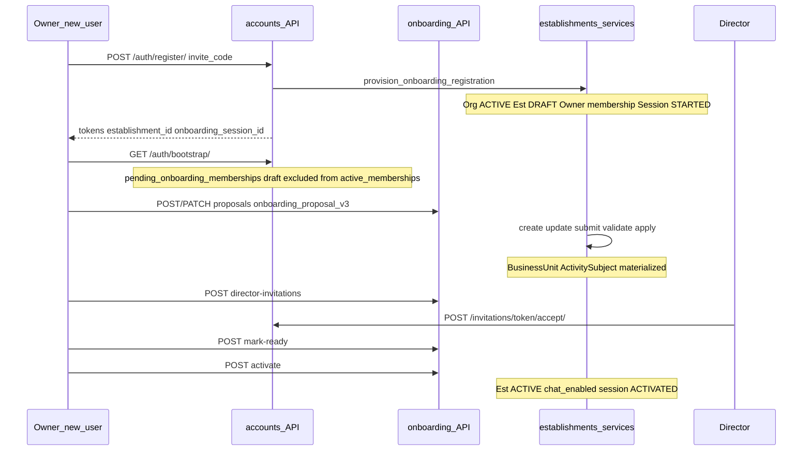

# Onboarding & Establishment Setup Audit

Status: audit report  
Date: 2026-06-24  
Scope: onboarding flow and establishment setup — backend services/views/serializers/selectors, membership/invitation setup, taxonomy/BU configuration, bootstrap data, frontend routes/pages/hooks, API contract usage, tests, product docs  
Mode: audit only — no source changes

Related: [Runtime Config / Onboarding Domain](../product/domains/runtime_config_onboarding_domain.md), [Backend Core Architecture Audit](./backend_core_architecture.md), [RBAC Security Audit](./rbac_security_audit.md), [Global Architecture Mapping](./global_architecture_mapping.md)

---

## Inspection manifest

### 1. Files inspected

**Contract and rules**

- `AGENTS.md`, `apps/api/AGENTS.md`, `apps/web/AGENTS.md`
- `.cursor/rules/10-backend-django-drf.mdc`, `20-frontend-react-vite-ts.mdc`, `21-mobile-first-pwa.mdc`, `80-security-data-integrity.mdc`

**Backend — onboarding core**

- `apps/api/houston/establishments/services.py` (2,545 LOC) — session lifecycle, proposal validation/apply, activation readiness, director/membership invites, runtime BU mutations
- `apps/api/houston/establishments/access.py` — `get_onboarding_access_context`, `_can_configure_runtime_onboarding`, `_ONBOARDING_MANAGEMENT_ROLES`, `_ONBOARDING_CONTINUE_ROLES`
- `apps/api/houston/establishments/api/views.py`, `serializers.py`, `urls.py` — onboarding HTTP surface
- `apps/api/houston/establishments/selectors.py` — actor-scoped session/proposal queries, `get_runtime_config_for_session`
- `apps/api/houston/establishments/permissions.py` — post-activation runtime context (explicit split from onboarding access)
- `apps/api/houston/establishments/role_constants.py` — `ADMIN_ROLES`, `_MANAGEMENT_ROLES`, etc.
- `apps/api/houston/establishments/models.py` — `OnboardingSession`, `OnboardingProposal`, `EstablishmentActivityDescription`, `BusinessUnit`, `ActivitySubject`
- `apps/api/houston/establishments/business_unit_catalog.py`, `catalog_import.py`, `catalog_seed_counts.py`
- `apps/api/houston/establishments/management/commands/import_business_unit_catalog.py`

**Backend — registration and bootstrap**

- `apps/api/houston/accounts/services.py` — `provision_onboarding_registration`, `register_onboarding_owner`, `resolve_or_create_pending_user_for_invite`
- `apps/api/houston/accounts/selectors.py` — `build_bootstrap_payload`, `list_pending_onboarding_memberships`, `_ONBOARDING_CONTINUE_ROLES`
- `apps/api/houston/accounts/api/views.py` — `RegisterView`, `BootstrapView`, `DirectorInvitationAcceptView`

**Frontend — onboarding**

- `apps/web/src/features/onboarding/pages/onboarding-page.tsx` — route orchestration, query-param state
- `apps/web/src/features/onboarding/components/manual-onboarding-v2-wizard.tsx` — 4-step wizard
- `apps/web/src/features/onboarding/components/manual-onboarding-v2-bu-picker-step.tsx`, `manual-onboarding-v2-bu-config-step.tsx`, `manual-onboarding-v2-invitations-step.tsx`
- `apps/web/src/features/onboarding/components/onboarding-registration-card.tsx`, `activation-summary-card.tsx`, `director-invite-card.tsx`
- `apps/web/src/features/onboarding/api.ts`, `hooks.ts`, `types.ts`, `lib/manual-v2-proposal.ts`
- `apps/web/src/features/auth/pages/pending-onboarding-page.tsx`, `lib/pending-onboarding.ts`, `lib/authenticated-landing.ts`
- `apps/web/src/features/invitations/pages/invitation-accept-page.tsx`, `api.ts`
- `apps/web/src/features/establishment-config/pages/operational-config-page.tsx` — post-activation taxonomy edits
- `apps/web/src/app/app-routes.ts`, `App.tsx`

**Test helpers**

- `apps/api/houston/testing/onboarding.py` — `create_onboarding_session`, `valid_manual_v2_payload`, `create_ready_runtime`

### 2. Tests inspected

**Backend (strong coverage)**

| File | Tests | Focus |
|------|-------|-------|
| `establishments/tests/test_onboarding_api.py` | 31 | Session CRUD, description, runtime-config, activation-summary, mark-ready, activate, RBAC denials, bootstrap pending membership, concurrency |
| `establishments/tests/test_onboarding_manual_v2.py` | 21 | Proposal validation (draft/final), apply materialization, activation blockers, catalog FK, director proposal denial |
| `establishments/tests/test_onboarding_proposal_api.py` | 7 | Auth, list/retrieve, concurrent create 409, RBAC, foreign session, reject, apply-unvalidated |
| `establishments/tests/test_director_invitation_api.py` | 12 | Invite rules, mark-ready/activate with invited director, concurrency, reactivation |
| `establishments/tests/test_director_invitation_accept_api.py` | 10 | Accept flow, token security, staff accept with scopes |
| `establishments/tests/test_services.py` | 26 | Service-level activation, readiness, mark-ready, description |
| `establishments/tests/test_access.py` | 16 | `get_onboarding_access_context` matrix, foreign session denial |
| `establishments/tests/test_models.py` | 31 | Session/proposal constraints |
| `establishments/tests/test_selectors.py` | 6 | Actor-scoped session queries |
| `accounts/tests/test_registration_api.py` | 15 | Full registration provisioning chain |
| `establishments/tests/test_catalog_*.py`, `test_business_unit_catalog.py` | — | Catalog import/suggest |

**Backend gaps confirmed**

- No dedicated `test_onboarding_tenant_isolation_api.py` (unlike signals/comments/checklists)
- `test_onboarding_proposal_api.py` has no HTTP happy-path create → update → submit → apply
- No concurrent activate race test
- Staff/manager draft invitation covered at service level only (`test_invitation_manager_with_bu_scopes_after_manual_v2_apply`)

**Frontend (minimal coverage)**

| File | Focus |
|------|-------|
| `features/onboarding/lib/manual-v2-proposal.test.ts` | Draft BU/subject helpers, payload, seeding, config gating |
| `features/onboarding/lib/onboarding-route.test.ts` | Operational-config redirect |
| `features/auth/lib/pending-onboarding.test.ts` | Landing resolution, URL builder |
| `features/auth/lib/authenticated-landing.test.ts` | Post-login paths |
| `app/app-routes.test.ts`, `terrain-routes.test.ts` | Route normalization, membership guard exemptions |
| `app/auth-provider.test.tsx`, `lib/query-invalidation.test.ts` | Onboarding cache purge on logout/switch |

**No tests found for:** `OnboardingPage`, wizard components, `activation-summary-card.tsx`, `onboarding/api.ts`, `hooks.ts`, `business-unit-autocomplete.tsx`, registration card, director/membership invite cards.

### 3. Docs/rules inspected

- `docs/product/domains/runtime_config_onboarding_domain.md` (authoritative, last reviewed 2026-06-07)
- `docs/qa/fresh_install_validation.md` — `make bootstrap-dev` → `import-catalog` prerequisite
- `docs/audits/backend_core_architecture.md` — F1 god-service finding
- `docs/audits/rbac_security_audit.md` — director vs owner onboarding note (partially imprecise; see OB-09)
- `docs/archive/codex/houston_onboarding_domain.md` (stale archive)

### 4. Assumptions or unknowns

- Manual E2E onboarding validated per `fresh_install_validation.md` but not automated in CI.
- Franchise / multi-owner onboarding is out of MVP scope per product doc; this audit assesses extensibility only.
- `HOUSTON_REGISTRATION_INVITE_CODES` is an intentional dev gate; production registration model not evaluated.
- Post-activation `operational-config` flow audited only where it shares onboarding components (`BusinessUnitAutocomplete`).
- AI/template `source_mode` on models is metadata only; no product scope for AI onboarding.

---

## 1. Current onboarding flow

Houston onboarding is the path that provisions an operational workspace before normal product usage. There is no standalone `onboarding/` Django app — sessions, proposals, taxonomy, and invitations live in the `establishments` domain with registration in `accounts`.

**Alternate entry:** `POST /api/v1/onboarding-sessions/` via `start_onboarding_session` for owners with an existing draft establishment (idempotent).

**Session status progression (simplified):**

1. `started` — registration or manual start
2. `description_submitted` / `configuring_runtime` — after description or mid-setup
3. `proposal_ready` — proposal created
4. `validating_sections` — proposal submitted/validated
5. `configuring_runtime` — after proposal applied
6. `ready_for_activation` — explicit `mark-ready`
7. `activated` — explicit `activate`

**Frontend route flow:**

| Route | Role |
|-------|------|
| `/onboarding` | Registration (unauthenticated) + session wizard (authenticated) |
| `/onboarding?establishmentId=&sessionId=` | Deep-link / resume |
| `/pending-onboarding` | Waiting / multi-establishment selection |
| `/invitations/{token}` | Director or membership invitation accept |
| `/app/operational-config` | Post-activation BU/taxonomy edits |

**Activation invariant chain:** proposal validated server-side → applied atomically with row locks → readiness gates (≥1 BU, all BUs have subjects, ≥1 non-owner director invited or active) → explicit `mark-ready` → `activate` with establishment `select_for_update`.

---

## 2. Backend / frontend responsibility assessment

| Concern | Owner | Evidence |
|---------|-------|----------|
| Org/establishment/membership creation | Backend | `provision_onboarding_registration` in `accounts/services.py` |
| Who can continue onboarding | Backend | `can_continue_onboarding` in bootstrap (`accounts/selectors.py`); owner-only |
| Session lifecycle and activation gates | Backend | `compute_activation_readiness`, `mark_onboarding_ready_for_activation`, `activate_onboarding_session` |
| BU/taxonomy proposal validation | Backend | `validate_onboarding_proposal_payload`, draft vs final modes |
| Proposal payload assembly (wizard) | Frontend | `manual-v2-proposal.ts`, `manual-onboarding-v2-wizard.tsx` |
| Wizard step UX sequencing | Frontend | `deriveWizardStepFromState`, local `useState` draft |
| Activation button enablement | Frontend (display) | `ActivationSummaryCard` mirrors `activationSummary.access`, `effective_can_activate`, `readiness` |
| Director/staff invitation forms | Frontend UI | Backend enforces in `invite_director_during_onboarding`, `invite_membership_for_establishment` |
| Permission hints | Backend authoritative | Frontend must not enforce security (`apps/web/AGENTS.md`) |

### Answer: Is onboarding backend-authoritative or too frontend-driven?

**Mostly backend-authoritative.** The frontend cannot activate an establishment without passing server gates: validated applied proposal, readiness blockers cleared, session `ready_for_activation`, and `access.can_activate`. Multi-write paths use `@transaction.atomic` and `select_for_update`.

**Frontend-driven areas (acceptable for UX, risky for multi-client):**

- 4-step wizard orchestration and client-side draft before server persistence
- `canContinueFromConfigStep` and duplicate-label checks as UX gates (backend re-validates on submit/apply)
- Catalog subject bulk seeding via direct `suggestActivitySubjects` call in wizard `useEffect` (bypasses TanStack Query hook)
- Query-param routing via `window.history.replaceState` outside `AppRouteProvider`

**Verdict:** Appropriate split for a single React PWA client today. A second client (native app, franchise portal) would need either to duplicate `manual-v2-proposal.ts` logic or receive a thinner server-driven wizard API.

---

## 3. Data integrity risks

| Risk | Severity | Detail |
|------|----------|--------|
| Doc vs code — activity description | P1 ambiguity | Product doc lists description as activation minimum (`runtime_config_onboarding_domain.md` L60–61, L80–82). `compute_activation_readiness` has no description section. `test_activity_description_does_not_block_readiness` confirms code behavior. |
| Catalog bootstrap dependency | P1 ops | Fresh DB requires `make bootstrap-dev` → `import-catalog`. Proposal `catalog_key` validation fails without imported `CatalogBusinessUnit`/`CatalogActivitySubject`. Not enforced by Django migration alone. |
| DRAFT sticky partial state | P2 | Interrupted onboarding leaves DRAFT establishment + non-terminal session indefinitely. Resume works via `pending_onboarding_memberships`. No cancel/abandon API. |
| Re-proposal after apply | P2 | `managed_by_onboarding_proposal` linkage on runtime objects; limited API tests for re-proposal edge cases. |
| Stale product doc objects | P3 | Doc still describes `RoutingHint`, `RuntimeVocabulary` as onboarding objects; dropped in migration `0016_drop_legacy_taxonomy.py`. Implemented scope is `onboarding_proposal_v3` BU/AS only. |

### Answer: Can onboarding create incomplete or inconsistent establishment state?

**Yes for DRAFT; no for ACTIVE.** Backend gates prevent activating inconsistent state (missing BU, BU without subjects, missing non-owner director). An establishment can remain DRAFT with incomplete taxonomy forever. Product "required activity description" is not enforced at activation — only at PATCH if the client calls it.

Establishment isolation from first setup is sound: registration creates org + draft establishment atomically; onboarding routes are path-scoped to session; foreign session access returns 404 (`test_foreign_onboarding_session_returns_not_found`, `test_onboarding_access_denies_foreign_session`).

---

## 4. RBAC / membership setup risks

| Risk | Severity | Detail |
|------|----------|--------|
| Director cannot drive draft wizard | P2 ambiguity | On DRAFT: director has `can_manage=True` (view session) but `can_configure_runtime=False`, `can_activate=False` (`access.py` `_can_configure_runtime_onboarding`). `can_continue_onboarding` is owner-only in bootstrap. Tested in `test_owner_and_director_draft_onboarding_access`. |
| Duplicated onboarding role constants | P2 | `_ONBOARDING_CONTINUE_ROLES` duplicated in `access.py` and `accounts/selectors.py`. `_ONBOARDING_MANAGEMENT_ROLES` only in `access.py`. Drift risk. |
| Director uniqueness | Positive | DB constraint `unique_active_or_invited_director_per_establishment` + service checks in `invite_director_during_onboarding`. 12 API tests in `test_director_invitation_api.py`. |
| Two authorization paths | P2 | Onboarding: `get_onboarding_access_context`. Post-activation: `can_manage_runtime_context` / `get_api_access_context`. Documented in `permissions.py` but easy to misuse on new endpoints. |
| Staff/manager draft invites | P2 | Service test `test_invitation_manager_with_bu_scopes_after_manual_v2_apply`; no dedicated onboarding API isolation suite. |

### Answer: Are memberships, roles, scopes and invitations initialized safely?

**Yes.** Registration provisions owner membership as ACTIVE in one transaction. Director invitations create PENDING users with unusable passwords, INVITED memberships, and token-digest invitations. Accept flow activates user + membership atomically. Staff/manager invites require BU scopes via `assign_membership_scopes`. Concurrent director invite returns 409.

Director satisfies the activation readiness gate when invited or active but cannot complete the draft wizard — by design, but product copy and `rbac_security_audit.md` ("Director can manage onboarding") are imprecise.

---

## 5. Backend orchestration risks

| Risk | Severity | Detail |
|------|----------|--------|
| Monolithic `establishments/services.py` | P1 | 2,545 LOC mixing onboarding FSM, proposal validation, invites, membership CRUD, runtime BU mutations. Flagged as F1 in `backend_core_architecture.md`. |
| Scattered tenant-isolation tests | P1 | Foreign-session denial exists across `test_onboarding_api`, `test_onboarding_proposal_api`, `test_access`, `test_selectors` — but no consolidated `test_onboarding_tenant_isolation_api.py` like newer domain suites. |
| Missing HTTP proposal lifecycle test | P2 | `test_onboarding_proposal_api.py` tests apply-on-unvalidated only; no HTTP create → update → submit → apply happy path. Service-level coverage exists in `test_onboarding_manual_v2.py`. |
| Reserved AI/template modes | P3 | `OnboardingSession.SourceMode.AI`, `OnboardingProposal.Source.AI_PROPOSED` on models; `test_create_onboarding_session_rejects_ai_source_mode` rejects AI. Template mode stored but no template workflow. |
| Terminal session statuses unused | P3 | `FAILED` / `CANCELED` on `OnboardingSession`; no cancel/fail service or API. |

**Strengths:** Thin views delegating to services; idempotent session start and activate; stable error codes (`activation_readiness_failed`, `director_invitation_already_exists`); row locking on apply/activate.

---

## 6. Frontend orchestration risks

| Risk | Severity | Detail |
|------|----------|--------|
| No component/integration tests | P1 | Only `manual-v2-proposal.test.ts` and routing tests. Wizard, activation card, registration card untested. |
| Unused activity description API | P2 | `useSubmitActivityDescription` / `submitActivityDescription` in `hooks.ts` / `api.ts`; no UI caller. |
| Wizard step vs session status drift | P2 | Hero shows `session.current_step`; wizard uses `deriveWizardStepFromState` locally. |
| Query-param routing outside router | P2 | `window.history.replaceState` in `onboarding-page.tsx` — back button / deep-link edge cases. |
| Auto-start session on revisit | P2 | `autoStartAttemptedRef` fires `startOnboardingSession` when only `establishmentId` present. |
| Shared autocomplete, different APIs | P2 | `BusinessUnitAutocomplete` in onboarding (proposal draft) and `operational-config-page` (runtime CRUD). |
| Duplicated invitation URL builder | P3 | `buildInvitationAcceptUrl` copied in `director-invite-card.tsx` and `membership-invite-card.tsx`. |

**Mobile-first UX:** Onboarding uses `AppShell` (not terrain bottom nav). Wizard uses `flex-col` stacks, full-width `h-11` buttons, debounced catalog search (250ms), explicit loading/error/blocker states. Aligns with `21-mobile-first-pwa.mdc`. French copy in wizard; mixed EN/FR in registration/activation cards.

---

## 7. Scalability and future-client risks

### Answer: Is the onboarding flow easy to evolve for future clients / franchise / multi-owner?

**Adequate for MVP single-owner manual V2; constrained for variants.**

| Future need | Current blocker |
|-------------|-----------------|
| Franchise delegated setup | Owner-only `can_continue_onboarding` and `can_configure_runtime` on DRAFT |
| Director-led onboarding completion | Director can view but not mutate proposals on DRAFT |
| Multi-establishment onboarding UX | Product doc explicitly out of scope; bootstrap supports multiple `pending_onboarding_memberships` but UX is basic |
| Native / alternate client | Proposal assembly in `manual-v2-proposal.ts` (~460 LOC client logic) must be reimplemented or server-driven |
| Self-service catalog | Catalog import is ops-step (`import-catalog` management command), not guaranteed in every deploy path |
| Abandoned DRAFT cleanup | No session cancel API; orphaned DRAFT establishments accumulate |
| AI/template onboarding variants | Metadata on models without workflow invites partial integrations |

### What will become painful when onboarding variants grow?

1. **`establishments/services.py` monolith** — every variant touches the largest backend file.
2. **Client-side wizard state** — each new client reimplements proposal payload rules or needs a server-driven step API.
3. **Duplicated role constants** — franchise/multi-owner role matrices will multiply drift across `access.py` and `accounts/selectors.py`.
4. **Catalog ops dependency** — SaaS-scale onboarding needs catalog availability guaranteed at bootstrap, not as a manual import step.
5. **No abandonment lifecycle** — support and data hygiene for stuck DRAFT establishments.

---

## 8. Top findings (max 10)

### OB-01 — God service: onboarding mixed with runtime and invites

- **Severity:** P1
- **Category:** structure / maintainability
- **Evidence:** `apps/api/houston/establishments/services.py` — 2,545 LOC; `start_onboarding_session`, `apply_onboarding_proposal`, `activate_onboarding_session`, `invite_director_during_onboarding`, `create_runtime_business_unit`, etc.
- **Problem:** Onboarding, membership invites, and post-activation runtime mutations share one module.
- **Why it matters now:** Every onboarding change touches the largest establishments file.
- **Why it will hurt later:** Parallel work on onboarding variants, franchise flows, and runtime config becomes high-conflict; cannot evolve independently.
- **Recommended fix:** Split into `onboarding_services.py`, `membership_invitation_services.py`, `runtime_config_services.py`; re-export from `services.py` for import compatibility.
- **Tests to add/update:** Existing establishments tests should pass unchanged; add import-boundary test.
- **Suggested implementation size:** L

---

### OB-02 — No dedicated onboarding tenant-isolation API suite

- **Severity:** P1
- **Category:** tests / security
- **Evidence:** Scattered foreign-session tests in `test_onboarding_api.py`, `test_onboarding_proposal_api.py`, `test_access.py`. No `test_onboarding_tenant_isolation_api.py` unlike `test_signal_tenant_isolation_api.py`, `test_tenant_isolation_api.py` (comments/checklists).
- **Problem:** Cross-establishment mutation coverage is incomplete and hard to discover.
- **Why it matters now:** Onboarding creates tenant boundaries from first setup; gaps here are high-impact.
- **Why it will hurt later:** New onboarding endpoints may ship without isolation regression tests.
- **Recommended fix:** Add consolidated isolation module covering session read/mutate, proposal CRUD/submit/apply, director invite, mark-ready, activate across establishments.
- **Tests to add/update:** New `test_onboarding_tenant_isolation_api.py`.
- **Suggested implementation size:** M

---

### OB-03 — Frontend onboarding UI largely untested

- **Severity:** P1
- **Category:** tests
- **Evidence:** Only `manual-v2-proposal.test.ts` and `onboarding-route.test.ts` under `features/onboarding/`. No tests for `OnboardingPage`, wizard, `ActivationSummaryCard`, `hooks.ts`, `api.ts`.
- **Problem:** Wizard resume logic, activation button enablement, and mutation error handling can regress silently.
- **Why it matters now:** Wizard is the primary owner setup path.
- **Why it will hurt later:** UI refactors and mobile UX changes lack safety net.
- **Recommended fix:** Add component tests for activation card blocker mirroring, wizard step resume, and `OnboardingPage` routing decisions.
- **Tests to add/update:** `activation-summary-card.test.tsx`, extend `manual-v2-proposal.test.ts`, `onboarding-page.test.tsx`.
- **Suggested implementation size:** M

---

### OB-04 — Product doc requires activity description; backend does not gate activation

- **Severity:** P1
- **Category:** ambiguity / API contract
- **Evidence:** `runtime_config_onboarding_domain.md` L60–61, L80–82 ("required"). `compute_activation_readiness` (`services.py` L1101–1133) has sections for `business_units`, `activity_subjects`, `director` only. `test_activity_description_does_not_block_readiness` in `test_services.py` L320–326.
- **Problem:** Authoritative product doc contradicts implemented activation gates.
- **Why it matters now:** Product, QA, and frontend teams assume description is mandatory.
- **Why it will hurt later:** Inconsistent establishments go live without operational context for AI/routing.
- **Recommended fix:** Product decision: either add description to `compute_activation_readiness` or update doc to "optional at activation, recommended during setup".
- **Tests to add/update:** Align `test_activity_description_does_not_block_readiness` or add activation blocker test.
- **Suggested implementation size:** S

---

### OB-05 — Activity description API exists; no frontend step

- **Severity:** P2
- **Category:** API contract / maintainability
- **Evidence:** `PATCH .../description/` view + `submit_activity_description` service. `useSubmitActivityDescription` in `hooks.ts` L102–107. No component imports or calls it.
- **Problem:** Implemented API surface with no product UI — dead hook or incomplete flow.
- **Why it matters now:** Wastes API contract maintenance; confuses developers.
- **Why it will hurt later:** If description becomes required (OB-04), frontend must be built from scratch.
- **Recommended fix:** Add description step to wizard (before or after BU picker) or remove unused hook until product needs it.
- **Tests to add/update:** Frontend hook test if kept; API tests already exist (`test_description_patch_accepts_valid_description`).
- **Suggested implementation size:** S–M

---

### OB-06 — Duplicated onboarding role constants

- **Severity:** P2
- **Category:** maintainability
- **Evidence:** `_ONBOARDING_CONTINUE_ROLES` in `establishments/access.py` L161–165 and `accounts/selectors.py` L16–20. `_ONBOARDING_MANAGEMENT_ROLES` only in `access.py` L25–30.
- **Problem:** Role sets can drift when onboarding access rules change.
- **Why it matters now:** Recent `ADMIN_ROLES` public export shows active RBAC refactoring — onboarding constants lag behind.
- **Why it will hurt later:** Franchise/multi-owner variants will add more role matrices in more places.
- **Recommended fix:** Export `ONBOARDING_CONTINUE_ROLES`, `ONBOARDING_MANAGEMENT_ROLES` from `role_constants.py` or `access.py`; import in `accounts/selectors.py`.
- **Tests to add/update:** Existing `test_access.py` and bootstrap tests.
- **Suggested implementation size:** S

---

### OB-07 — Client wizard step diverges from server `current_step`

- **Severity:** P2
- **Category:** structure / ambiguity
- **Evidence:** `OnboardingHeroCard` displays `session.current_step`. `ManualOnboardingV2Wizard` uses `deriveWizardStepFromState` (`manual-v2-proposal.ts` L213–235) from local draft + proposal status.
- **Problem:** Two sources of truth for "where am I in onboarding".
- **Why it matters now:** Hero and wizard can show inconsistent progress.
- **Why it will hurt later:** Server-driven onboarding for alternate clients needs a single step authority.
- **Recommended fix:** Either drive wizard step from `session.current_step` after refetch, or stop exposing `current_step` in hero if client-owned.
- **Tests to add/update:** Frontend test for step sync after proposal apply.
- **Suggested implementation size:** S

---

### OB-08 — Staff/manager draft invitations lack API-level isolation tests

- **Severity:** P2
- **Category:** security / tests
- **Evidence:** `test_invitation_manager_with_bu_scopes_after_manual_v2_apply` in `test_onboarding_manual_v2.py` (service level). `test_membership_invitation_api.py` exists but not scoped to onboarding draft flow + cross-establishment denial together.
- **Problem:** Invitation path during DRAFT onboarding is less tested than director path.
- **Why it matters now:** Invites assign BU scopes that seed RBAC for operational use.
- **Why it will hurt later:** Scope leakage during draft setup is hard to detect post-activation.
- **Recommended fix:** Add API tests: manager invite on DRAFT during onboarding, foreign establishment scope rejection, out-of-scope BU denial.
- **Tests to add/update:** Extend `test_onboarding_tenant_isolation_api.py` or `test_membership_invitation_api.py`.
- **Suggested implementation size:** S–M

---

### OB-09 — Owner-only draft configure blocks director-led onboarding variants

- **Severity:** P2
- **Category:** scalability / ambiguity
- **Evidence:** `_can_configure_runtime_onboarding` returns owner-only on DRAFT (`access.py` L177–178). `can_continue_onboarding` owner-only (`accounts/selectors.py` L156). Director `can_manage=True` but cannot mutate proposals.
- **Problem:** Invited director is required for activation but cannot complete setup.
- **Why it matters now:** Owner must finish entire wizard even after director accepts.
- **Why it will hurt later:** Franchise ops, delegated setup, or "director completes onboarding" product variants require access model changes.
- **Recommended fix:** Document as intentional MVP constraint; when variants needed, extend `can_configure_runtime` for director on DRAFT with explicit product rules.
- **Tests to add/update:** E2E test: director accept → bootstrap → owner completes activation (partially covered).
- **Suggested implementation size:** M (when product requests variant)

---

### OB-10 — Stale product doc references legacy taxonomy objects

- **Severity:** P3
- **Category:** ambiguity
- **Evidence:** `runtime_config_onboarding_domain.md` §5 lists `RoutingHint`, `RuntimeVocabulary`, optional units in proposal v3. Migration `0016_drop_legacy_taxonomy.py` drops `RoutingHint`, `RuntimeVocabulary`. Implemented proposal is BU/AS only.
- **Problem:** Doc overstates implemented onboarding scope.
- **Why it matters now:** Misleads implementers about routing/vocabulary setup during onboarding.
- **Why it will hurt later:** Re-introducing dropped concepts without doc cleanup causes duplicate design work.
- **Recommended fix:** Update product doc §3–5 to match v3 BU/AS-only scope; mark legacy objects as removed.
- **Tests to add/update:** None.
- **Suggested implementation size:** S

---

## 9. Fix now vs later

### Fix now (S–M)

1. **Align activity description requirement** — product doc or `compute_activation_readiness` (OB-04, OB-05)
2. **Centralize onboarding role constants** (OB-06)
3. **Add `test_onboarding_tenant_isolation_api.py`** (OB-02, OB-08)
4. **Add HTTP happy-path proposal submit+apply test** (backend confidence gap)
5. **Wire activity description UI or remove unused hook** (product decision)

### Plan later (M–L)

1. **Split `establishments/services.py`** into onboarding / membership / runtime submodules (OB-01)
2. **Server-driven wizard step or sync-state endpoint** for multi-client onboarding (OB-07)
3. **Onboarding session cancel/abandon API** for orphaned DRAFT cleanup
4. **Frontend component test harness** for wizard + activation card (OB-03)
5. **Consolidate invitation URL builder**; document operational-config vs onboarding catalog API split

### Not worth fixing now

- AI/template `source_mode` stubs (no product scope)
- `FAILED`/`CANCELED` session statuses until abandonment UX is product-required
- `OperationalUnit` exposure in `get_runtime_config_for_session` (legacy, low risk)
- Full E2E automation in CI (manual validation sufficient for dev phase)

---

## 10. Tests required

### Backend (priority order)

1. **Cross-establishment isolation suite** — session read/mutate, proposal CRUD/submit/apply, director invite, mark-ready, activate denial for foreign establishment
2. **HTTP lifecycle happy path** — create → update → submit → apply → mark-ready → activate at API layer
3. **Director accept → bootstrap → owner activates** — full invitation + activation chain
4. **Staff/manager invitation on DRAFT** during onboarding with BU scope validation and foreign BU rejection
5. **Concurrent activate race** — mirror `test_concurrent_create_onboarding_session_is_idempotent`
6. **Catalog-missing environment** — proposal validation error shape when catalog not imported

### Frontend (priority order)

1. **`ActivationSummaryCard`** — `canMarkReady` / `canActivate` mirror backend blockers; error blocker display
2. **`deriveWizardStepFromState` + `pickResumeProposal`** — extend existing lib tests for applied/validated/draft resume
3. **`OnboardingPage`** — registration → session params; pending redirect; auto-start guard
4. **Wizard apply mutation** — error handling and `BlockerList` rendering

---

## 11. Suggested implementation order by priority

| Priority | Item | Size | Addresses |
|----------|------|------|-----------|
| 1 | Doc/code alignment on activity description | S | OB-04, OB-05 |
| 2 | Onboarding tenant-isolation API tests | M | OB-02, OB-08 |
| 3 | Centralize onboarding role constants | S | OB-06 |
| 4 | HTTP proposal lifecycle happy-path test | S | Backend gap |
| 5 | Activity description UI or hook cleanup | S–M | OB-05 |
| 6 | Update product doc legacy taxonomy refs | S | OB-10 |
| 7 | Split establishments services module | L | OB-01 |
| 8 | Frontend wizard + activation component tests | M | OB-03 |
| 9 | Wizard step authority (server vs client) | S | OB-07 |
| 10 | Future-variant prep: cancel session, director configure on DRAFT, server-driven steps | M–L | OB-09, scalability |

---

## Summary answers

| Question | Answer |
|----------|--------|
| 1. Backend-authoritative or frontend-driven? | **Backend-authoritative** for persistence, readiness, and activation. Frontend drives wizard UX and proposal payload assembly. |
| 2. Incomplete/inconsistent establishment state? | **DRAFT can be incomplete indefinitely.** ACTIVE requires enforced minimum (BU, subjects, non-owner director). Description not enforced at activation despite doc. |
| 3. Memberships/roles/scopes/invitations safe? | **Yes** — transactions, DB constraints, token-digest invites, scope assignment on staff invites. Director required but cannot complete draft wizard. |
| 4. Taxonomy/BU/routing validated centrally? | **BU/AS yes** via `validate_onboarding_proposal_payload` and catalog_key checks. **Routing hints removed** from implementation; doc stale. |
| 5. Easy to evolve for franchise/multi-owner? | **Not without access model and client-orchestration changes.** Owner-only draft configure is the main constraint. |
| 6. What hurts when variants grow? | God service, client-side proposal assembly, duplicated role constants, catalog ops dependency, no abandonment lifecycle. |

---

## Top 3 fixes to do first

1. **Resolve activity description doc/code mismatch** (OB-04) — single product decision unblocks doc, tests, and frontend.
2. **Add onboarding tenant-isolation API test suite** (OB-02) — establishment boundaries are created here; highest security ROI.
3. **Centralize onboarding role constants** (OB-06) — cheap, prevents drift before franchise/multi-owner work.

## Quick wins

- Update product doc to remove `RoutingHint` / `RuntimeVocabulary` from onboarding scope (OB-10)
- Add HTTP happy-path proposal submit+apply test (one test file addition)
- Extract shared `buildInvitationAcceptUrl` to `features/invitations/lib/`
- Document director draft limitations in product doc (OB-09 clarity)

## Structural issues to plan later

- Split `establishments/services.py` (OB-01)
- Server-driven onboarding steps for multi-client support
- Session cancel/abandon API for DRAFT hygiene
- Frontend component test harness for wizard

## Things not worth fixing now

- AI/template `source_mode` metadata without workflow
- `FAILED`/`CANCELED` session statuses without product abandonment UX
- `OperationalUnit` in runtime-config response
- Full CI E2E onboarding automation (manual validation documented in `fresh_install_validation.md`)
