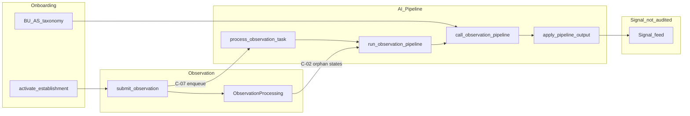

# Onboarding + Observation + AI Pipeline — Audit Consolidation

Status: consolidation report  
Date: 2026-06-24  
Mode: audit only — no source changes

## Sources

| Audit | File | Findings |
|-------|------|----------|
| Onboarding & Establishment Setup | [`onboarding_audit.md`](./onboarding_audit.md) | OB-01–OB-10 |
| Observation Domain | [`observation_audit.md`](./observation_audit.md) | OBS-01–OBS-10 |
| AI Pipeline Orchestration | [`ai_pipeline_audit.md`](./ai_pipeline_audit.md) | F1–F10 |

**Path note:** The observation audit was requested as `03_observation_audit.md`; the file on disk is [`observation_audit.md`](./observation_audit.md) (the observation audit closing section references the alternate name).

**Cross-references:** [`backend_core_architecture.md`](./backend_core_architecture.md) (F1, F2), [`global_architecture_mapping.md`](./global_architecture_mapping.md) (R3, R4, R7, R8, R9).

---

## Scope

This document consolidates findings from three domain audits covering the path from establishment setup through observation intake and AI-driven signal creation. It deduplicates overlapping themes, confirms severity, sequences fixes, and recommends the next audit scope.

---

## 1. Duplicate findings to merge

Overlapping findings from the three audits are merged below. Use the consolidated ID (C-*) when tracking work; retain source IDs for traceability.

| Consolidated ID | Source IDs | Severity (highest) | Category | Unified problem | Key evidence |
|-----------------|------------|-------------------|----------|-----------------|--------------|
| **C-01** Pipeline ownership split | AI F1, OBS-03, backend F2 | P1 | structure / ambiguity | No single module owns Observation → Signal workflow. Orchestration and apply live in `signals/services.py`; provider I/O in `ai/observation_pipeline.py`; Celery task in `signals/tasks.py`; enqueue in `observations/services.py`; version constants in `signals/constants.py`. Cross-app imports in both directions. | `signals/services.py` (`run_observation_pipeline`, `apply_pipeline_output`); `ai/observation_pipeline.py` (`call_observation_pipeline`); `observations/services.py` (`_enqueue_observation_processing`); `signals/tests/test_import_graph.py` |
| **C-02** Pipeline recovery gaps | OBS-01, AI F2 | P1 | scalability / maintainability | Two orphan processing states with no automatic completion: (a) `queued` when Celery `delay()` fails after DB commit; (b) `retrying` when stuck recovery marks rows but never re-enqueues `process_observation_task`. Recovery batch only targets `status=processing`, not `queued`. | `observations/services.py` `_enqueue_observation_processing`; `signals/services.py` `recover_stuck_observation_processing_batch`, `_try_recover_stuck_processing`; `signals/tests/test_observation_pipeline_recovery.py` |
| **C-03** Celery retry / idempotence | AI F3, C-02 | P1 | tests / idempotence | Celery retries on provider timeout/unavailable re-invoke the LLM. Divergent output on retry can create a second Signal if aggregation keys differ. No end-to-end integration test for timeout → `RETRYING` → retry → single Signal set. | `signals/tasks.py` `process_observation_task`; `test_double_pipeline_on_processed_is_noop` (idempotence on `PROCESSED` only) |
| **C-04** `NOT_ACTIONABLE` dead outcome | OBS-05, AI F8 | P2 | ambiguity / maintainability | `ObservationProcessing.Outcome.NOT_ACTIONABLE` defined in model and referenced in contract docs; `apply_pipeline_output` never assigns it. Practical empty-candidate path uses `no_signal_created`. | `observations/models.py`; `signals/services.py` `apply_pipeline_output`; `ai_observation_pipeline_contract.md` |
| **C-05** AI onboarding metadata stubs | OB onboarding §5 P3, AI F10 | P3 | maintainability | Product removed AI onboarding (`ai_domain.md`) but model metadata remains: `OnboardingSession.SourceMode.AI`, `AIUsageLog.Domain.ONBOARDING`, FK fields `onboarding_session` / `onboarding_proposal`. Test rejects AI source mode at API. | `establishments/models.py`; `ai/models.py`; `test_create_onboarding_session_rejects_ai_source_mode` |
| **C-06** `establishments/services.py` monolith | OB-01, backend F1, global R9 | P1 | structure / maintainability | ~2,545 LOC mixing onboarding FSM, proposal validation/apply, activation, director/membership invites, runtime BU mutations. Highest merge-conflict surface in the monolith. | `establishments/services.py`; `backend_core_architecture.md` F1 |
| **C-07** Inverted enqueue dependency | AI F4, OBS-03 | P2 | structure | Observation submit domain imports Signal app Celery task directly, violating intuitive layering (observations should not depend on signals for core submit). | `observations/services.py` → `houston.signals.tasks.process_observation_task`; `observations/tests/test_submit_on_commit_enqueue.py` |
| **C-08** Documented events not implemented | AI F9, OBS §5 events note | P3 | ambiguity | `ai_domain.md` §8 lists `ObservationPipelineStarted`, `ObservationPipelineSucceeded`, etc.; `observation_domain.md` §8 lists candidate observation events. No emitters in `ai/` or `signals/services.py`. Realtime uses signal invalidation instead. | `ai_domain.md`; `observation_domain.md`; `realtime/tests/test_observation_pipeline_invalidation.py` |
| **C-09** Product doc / code drift | OB-04, OB-10, OBS-06, AI F8, C-04 | P1–P3 | ambiguity / API contract | Multiple authoritative docs contradict code: activity description "required" vs not gated at activation; legacy `RoutingHint`/`RuntimeVocabulary` in onboarding doc; processing-status marked "deferred" but implemented; pipeline `NOT_ACTIONABLE` documented but unused. | `runtime_config_onboarding_domain.md`; `observation_domain.md` §9; `test_activity_description_does_not_block_readiness`; `observations/api/urls.py` |

---

## 2. Confirmed P0/P1 findings

**No P0** findings across the three source audits.

**Confirmed P1 (8 items)** — treat as the priority set before the next audit cycle:

| ID | Domain | Finding | Source | Recommended fix (size) |
|----|--------|---------|--------|------------------------|
| C-02a | Observation | `queued` orphans when Celery enqueue fails post-commit; no Beat recovery for stale `queued` rows | OBS-01 | Beat job to re-enqueue stale `queued` observations; test enqueue failure + recovery (M) |
| C-02b | AI | Stuck recovery sets `retrying` without calling `process_observation_task.delay()` | AI F2 | Re-enqueue after recovery sweep (S) |
| C-03 | AI | Provider retry path untested; LLM re-calls non-idempotent | AI F3 | Integration test: timeout → retry → single Signal set (S); optional persisted intermediate output (M) |
| C-01 | Cross | Split pipeline ownership across `signals`, `ai`, `observations` | AI F1, OBS-03 | Document ownership in `apps/api/AGENTS.md` first; optional thin orchestrator module (M) |
| OB-02 | Onboarding | No consolidated `test_onboarding_tenant_isolation_api.py` | OB-02 | New isolation suite covering session, proposal, invite, mark-ready, activate (M) |
| OB-04 | Onboarding | Product doc requires activity description; `compute_activation_readiness` does not | OB-04 | Product decision: gate activation or update doc (S) |
| OB-03 | Onboarding | Frontend wizard, activation card, hooks largely untested | OB-03 | Component tests for activation blockers, wizard resume, routing (M) |
| C-06 | Onboarding / platform | `establishments/services.py` god service | OB-01 | Split into submodules when next touching domain (L) — confirmed risk, defer implementation |

---

## 3. Onboarding-only issues

Findings not duplicated in observation or AI pipeline audits.

| ID | Severity | Category | Problem | Evidence |
|----|----------|----------|---------|----------|
| OB-05 | P2 | API contract / maintainability | Activity description API (`PATCH .../description/`) and `useSubmitActivityDescription` hook exist; no wizard UI calls them | `hooks.ts` L102–107; `test_description_patch_accepts_valid_description` |
| OB-06 | P2 | maintainability | `_ONBOARDING_CONTINUE_ROLES` duplicated in `establishments/access.py` and `accounts/selectors.py` | `access.py` L161–165; `accounts/selectors.py` L16–20 |
| OB-07 | P2 | structure / ambiguity | Wizard uses `deriveWizardStepFromState`; hero shows `session.current_step` — two step authorities | `manual-v2-proposal.ts` L213–235; `OnboardingHeroCard` |
| OB-08 | P2 | security / tests | Staff/manager draft invitations covered at service level only; no API isolation suite for onboarding draft flow | `test_invitation_manager_with_bu_scopes_after_manual_v2_apply` |
| OB-09 | P2 | scalability / ambiguity | Owner-only `can_configure_runtime` on DRAFT; director required for activation but cannot complete wizard | `access.py` `_can_configure_runtime_onboarding`; `accounts/selectors.py` `can_continue_onboarding` |
| OB-10 | P3 | ambiguity | Product doc lists `RoutingHint`, `RuntimeVocabulary`; dropped in migration `0016_drop_legacy_taxonomy.py` | `runtime_config_onboarding_domain.md` §5 |
| Ops | P1 | ops | Fresh DB requires `make bootstrap-dev` → `import-catalog` for proposal `catalog_key` validation | `docs/qa/fresh_install_validation.md`; `validate_onboarding_proposal_payload` |
| Lifecycle | P2 | maintainability | No cancel/abandon API; DRAFT establishments with non-terminal sessions persist indefinitely | `OnboardingSession` `FAILED`/`CANCELED` unused |

**Onboarding strengths (no action):** Backend-authoritative activation gates; atomic proposal apply with row locks; director uniqueness constraint; strong backend API test coverage (31+ tests per area).

---

## 4. Observation-only issues

Findings not duplicated in onboarding or AI pipeline audits.

| ID | Severity | Category | Problem | Evidence |
|----|----------|----------|---------|----------|
| OBS-02 | P2 | security / ambiguity | Processing-status readable by any submit-capable member in establishment; no submitter scoping | `ObservationProcessingStatusView`; `get_observation_processing_status` filters `establishment_id` only |
| OBS-04 | P2 | security | Media preview: `AllowAny` + signed token + signal-link gate; shareable until TTL; missing negative tests | `ObservationMediaPreviewView`; `media_access.py` `is_observation_media_preview_authorized` |
| OBS-06 | P3 | ambiguity | `observation_domain.md` §9 marks `GET processing-status` as deferred; implemented and tested | `observations/api/urls.py`; `test_processing_status_api.py` |
| OBS-07 | P3 | performance / scalability | Frontend polls processing-status every 2s; no `observation` realtime subject | `useObservationProcessingStatusQuery` in `hooks.ts` |
| OBS-08 | P3 | maintainability | Dead `useCreateChecklistTaskObservationMutation` in checklists hooks; active path is `useChecklistReportSubmitMutation` | `checklists/hooks.ts` |
| OBS-09 | P3 | tests | No focused unit tests for `resolve_observation_actor_membership` edge cases | `uploads/access.py`; covered only via `test_observation_api.py` integration |
| OBS-10 | P3 | ambiguity | Checklist path uses `can_execute_checklist_tasks` + assignee; direct path uses `can_create_observation` — undocumented in observation doc | `checklists/services.py` `create_observation_from_task` |

**Observation strengths (no action):** Single `submit_observation` entry point; no raw text in product APIs; log/WS sanitization tested; establishment isolation on writes; Celery passes `observation_id` only.

---

## 5. AI-pipeline-only issues

Findings not duplicated in onboarding or observation audits (excluding merged C-* items).

| ID | Severity | Category | Problem | Evidence |
|----|----------|----------|---------|----------|
| AI F5 | P2 | API contract | `schema_version` is plain `str` in Pydantic; OpenAI const only in provider schema | `observation_pipeline_schema.py`; `observation_pipeline_provider_schema.py` |
| AI F6 | P2 | performance / scalability | Every call sends full establishment taxonomy + up to 20 active signal titles/summaries; large system prompt | `build_pipeline_input`, `_build_active_signals_context`; `MAX_ACTIVE_SIGNALS_CONTEXT = 20` |
| AI F7 | P2 | security | `validated_text` (= `observation.raw_text`) sent to external LLM on every call | `observation_pipeline.py` L133; `OpenAIObservationPipelineProvider.propose` L243 |
| AI F9 | P3 | ambiguity | Pipeline domain events documented in `ai_domain.md` §8; not implemented | No emitters in `ai/` or `signals/services.py` |
| AI F10 | P3 | maintainability | `AIUsageLog.Domain.ONBOARDING` stale after product removal (see also C-05) | `ai/models.py`; `ai_domain.md` |

**AI pipeline strengths (no action):** Golden corpus G01–G11 (`test_pipeline_v4_golden.py`); safe error diagnostics (`test_observation_pipeline_diagnostics.py`); `PROCESSED` idempotence; OpenAI strict JSON schema; input build ≤8 queries; fake provider default under pytest.

---

## 6. Cross-domain ownership ambiguities

| Boundary | Apps involved | Ambiguity | Impact |
|----------|---------------|-----------|--------|
| Observation → Signal pipeline | `observations`, `signals`, `ai` | C-01: orchestration split; version constants in `signals`; `ai` imports `signals.selectors` and `signals.constants` | Every pipeline change requires context in 2–3 apps; no documented owner in `apps/api/AGENTS.md` |
| Observation RBAC | `uploads`, `establishments`, (no `observations/permissions.py`) | OBS-03: `CanSubmitObservation`, `EstablishmentScopedObservationMixin`, `resolve_observation_actor_membership` live in `uploads/` | Tracing "everything observation" spans three apps; permission updates easy to miss on new endpoints |
| Onboarding → runtime taxonomy | `establishments`, `accounts` | Registration in `accounts/services.py`; sessions/proposals in `establishments/`; role constants duplicated (OB-06) | Franchise/multi-owner variants multiply drift |
| Onboarding → AI context | `establishments` taxonomy → `ai.build_pipeline_input` | Activated establishment BU/AS quality depends on onboarding gates; OB-04 description gap may reduce operational context for AI routing | Weak taxonomy at activation propagates to every pipeline call |
| Media lifecycle | `observations`, `signals` | Storage and preview auth in observations; deletion triggers in signal resolve/cancel (`media_services.delete_all_observation_media`) | Signal lifecycle changes affect observation media without a single owner doc |
| Platform bottleneck | `establishments` | global R9: RBAC, onboarding, taxonomy, invitations referenced by every domain | Highest-risk merge surface; resists parallel feature work |
| Notification handoff | `signals`, `notifications` | `create_signal_from_candidate` schedules `schedule_signal_created_notification` inside apply transaction path | Signal creation synchronously triggers notification scheduling — not audited here |

---

## 7. Security / privacy risks

| Risk | Severity | Source(s) | Status | Recommended action |
|------|----------|-----------|--------|-------------------|
| Raw observation text in APIs | — | OBS audit §3 | **Mitigated** — submit and processing-status responses exclude text; `test_observation_api.py`, `test_processing_status_api.py` | None |
| Raw text in logs / WS / Celery payload | — | OBS §3, AI §8 | **Mitigated** — `core/observability.py` allowlists; Celery passes ID only; `test_observation_pipeline_observability.py` | None |
| `validated_text` to external LLM | P2 | AI F7 | **By design** — required for semantic analysis; sub-processor / DPA boundary | Document in security domain; avoid expanding context beyond contract (S) |
| `active_signals_context` in LLM input | P2 | AI F6, F7 | Operational metadata (titles, summaries) leaves trust boundary | Trim to aggregation-relevant fields when volume warrants (M) |
| Processing-status metadata to any submit-capable peer | P2 | OBS-02 | **Gap** — signal summaries visible establishment-wide | Product decision: restrict to submitter + admins or document as intentional (S) |
| Media preview URL shareability | P2 | OBS-04 | **Acceptable MVP** — signed token + signal-link gate; no session re-auth on GET | Review TTL; add negative tests for unlinked/deleted media (S–M) |
| Onboarding tenant isolation test coverage | P1 | OB-02, OB-08 | **Gap** — scattered foreign-session tests; no consolidated suite | `test_onboarding_tenant_isolation_api.py` (M) |
| Transcription audio retention | — | OBS assumptions | **Not verified** — audio not persisted per MVP tests; provider policy not audited | Verify at compliance review |
| OpenAI data retention / training | — | AI assumptions | **Not verified** in-repo | Customer-facing posture + DPA checklist |

---

## 8. Scalability risks

| Risk | Severity | Source(s) | When it hurts | Mitigation direction |
|------|----------|-----------|---------------|---------------------|
| Serial Celery task per observation | P2 | OBS §4, AI §10 | Linear broker/worker load; AI latency becomes queue depth | Monitor queue depth; batching only if volume justifies (L) |
| Orphan `queued` / `retrying` rows | P1 | C-02 | Silent pipeline backlog after broker blips or worker death | C-02 recovery fixes (S–M) |
| Frontend 2s processing-status polling | P3 | OBS-07 | Peak shift-change: hundreds of concurrent polls | Observation realtime subject when volume warrants (L) |
| Prompt size (taxonomy + 20 signals + system prompt) | P2 | AI F6, global R7 | Token cost and p95 latency grow with establishment size and open signal count | Trim context; taxonomy cache per establishment (M) |
| `establishments/services.py` monolith | P1 | C-06, OB-01 | Every onboarding/RBAC variant touches largest file | Submodule split (L) |
| Client-side onboarding proposal assembly (~460 LOC) | P2 | OB audit §7 | Second client or franchise portal must reimplement or need server-driven API | Server-driven wizard step API (M–L) |
| Catalog import ops dependency | P1 | OB audit §3 | SaaS-scale onboarding without guaranteed catalog at bootstrap | Enforce catalog in deploy/bootstrap path (M) |
| No pipeline queue / enqueue-failure metrics | P2 | OBS-01, C-02 | Operators cannot see silent backlog | Metrics on processing status distribution + enqueue failures (M) |
| LLM retry duplicate signals | P1 | C-03 | Higher volume increases duplicate-signal and cost risk on transient failures | Integration tests + optional persisted parsed output (S–M) |
| Read-on-write execution feed | P2 | global R8 | Not in scope of these three audits; flagged for Execution feed audit | Defer to Execution feed + Checklists audit |

---

## 9. Fix before next audit

Ordered by user impact and cross-audit dependency. Sizes: S = small, M = medium, L = large.

| Priority | Item | Size | Addresses | Tests to add/update |
|----------|------|------|-----------|---------------------|
| 1 | **C-02 Pipeline recovery** — Beat job for stale `queued` + re-enqueue on stuck recovery → `retrying` | S–M | OBS-01, AI F2 | `test_recovery_sweep_re_enqueues_pipeline_task`; enqueue failure → recovery in `test_submit_on_commit_enqueue.py` |
| 2 | **C-03 + AI F5** — Celery retry integration test; enforce `schema_version` in Pydantic | S | AI F3, F5 | `test_celery_retry_after_provider_timeout_completes_without_duplicate_signals`; `test_rejects_wrong_schema_version` |
| 3 | **OB-04 product decision** — Align activity description requirement (gate activation or update doc) | S | OB-04, OB-05, C-09 | Align or replace `test_activity_description_does_not_block_readiness` |
| 4 | **OB-02 + OB-08** — `test_onboarding_tenant_isolation_api.py` including staff invite paths | M | OB-02, OB-08 | New consolidated isolation module |
| 5 | **OBS-02 policy** — Decide processing-status visibility; cross-member regression test | S | OBS-02 | `test_processing_status_api.py` — member A submits, member B polls |
| 6 | **C-09 doc sync** — `observation_domain.md` §9, `runtime_config_onboarding_domain.md` taxonomy/description | S | OBS-06, OB-10, C-04 | Doc-only |
| 7 | **C-01 ownership doc** — Document pipeline handoff in `apps/api/AGENTS.md` | S | AI F1, OBS-03 | Extend `test_import_graph.py` with allowed cross-imports |

---

## 10. Defer for later

| Item | Size | Source(s) | Rationale |
|------|------|-----------|-----------|
| C-06 split `establishments/services.py` | L | OB-01, backend F1 | High maintainability value; not blocking next audit; existing tests should pass unchanged |
| OB-03 frontend wizard component tests | M | OB-03 | Important safety net; lower urgency than pipeline recovery |
| OBS-03 move RBAC to `observations/permissions.py` | M | OBS-03 | Import refactor; integration tests suffice for MVP |
| AI F6 prompt trimming / taxonomy cache | M | AI F6 | Dev volume acceptable; needs `input_payload_bytes` p95 metrics |
| OBS-07 observation realtime invalidation | L | OBS-07 | Polling adequate at current scale |
| OB-07 server-driven wizard step | S–M | OB-07 | Multi-client problem; no second client yet |
| OB-09 director-led onboarding | M | OB-09 | Explicit MVP constraint; document in product doc |
| Session cancel/abandon API | M | OB lifecycle | No product abandonment UX |
| C-08 pipeline events implementation | M | AI F9 | Structured logging substitutes today |
| C-05 / AI F10 remove onboarding AI stubs | S | AI F10 | Low runtime impact |
| C-07 move Celery task out of `signals` | S | AI F4 | Coupled to C-01 ownership decision |
| Full CI E2E onboarding | L | OB audit | Manual validation in `fresh_install_validation.md` sufficient for dev phase |
| OBS-08 remove dead checklist hook | S | OBS-08 | Quick win when touching frontend |
| OBS-09 actor resolution unit tests | S | OBS-09 | Integration coverage adequate for MVP |
| Fuzzy `issue_focus` aggregation | — | AI audit | Explicitly rejected in v4 contract |
| Multi-provider / BYOK routing | — | AI audit | Out of MVP scope |

---

## 11. Recommended next audit

**Update (2026-06-24):** Signal + Signal feed audit completed — see [`06_signal_feed_audit.md`](./06_signal_feed_audit.md). Key pipeline cross-links:

| Consolidation ID | Signal audit ID | Notes |
|------------------|-----------------|-------|
| C-01 Pipeline ownership split | (documented, not elevated) | Intentional MVP; `apps/api/AGENTS.md` ownership table |
| C-03 Celery retry / divergent AI output | **SIG-03** (related) | Duplicate active signals if aggregation keys differ on retry; DB race is separate root cause |
| OBS-04 Media deletion on signal resolve | (in scope) | Terminal lifecycle tested; not a finding |

Next recommended audit from signal report: **Actions + Execution feed**.

### Primary: Signal + Signal feed *(completed)*

| Criterion | Signal + Signal feed | Execution feed + Checklists |
|-----------|---------------------|------------------------------|
| Continuity from these 3 audits | **Direct** — AI audit ends at `apply_pipeline_output` → Signal creation/aggregation | Parallel branch — checklist → observation handoff flagged (OBS-10) |
| Unaudited repo-level risks | **R4** Actions↔Signals lifecycle entanglement starts at Signal resolve/cancel | **R3** execution feed ownership blur; **R8** read-triggers-writes on feed load |
| Validates handoff | Closes **Observation → AI → Signal** vertical slice | Closes **Action → Execution** half of core loop |
| Cross-links from this consolidation | OBS-04 media deletion on signal resolve; C-03 duplicate signals; processing-status signal summaries | OBS-10 checklist permissions; checklist materialization side effects |
| Test surface to inspect | Signal API contract, feed visibility, aggregation keys, resolve/cancel lifecycle, tenant isolation, notification scheduling on create | `execution_feed.py` merge semantics, `ensure_visible_executions_materialized`, checklist execution permissions |

**Recommendation:** Audit **Signal + Signal feed** next.

The three source audits stress-tested establishment setup (taxonomy) → observation submit → AI pipeline → signal creation. The natural next step validates whether Signals are correctly created, aggregated, permissioned, surfaced in the signal feed, and how resolve/cancel drives media cleanup (OBS-04 cross-link). This completes the upstream half of Houston's core loop before auditing downstream execution.

**Suggested scope for Signal audit:**

- `houston/signals/` — models, services, selectors, API, permissions, feed queries
- Signal feed frontend — `features/signals/`, feed invalidation, realtime
- Cross-domain: `actions/services.py` signal resolve coupling (global R4)
- Tests: `test_signal_api_contract.py`, `test_signal_tenant_isolation_api.py`, feed and lifecycle suites

### Secondary (after Signal): Execution feed + Checklists

Audit **Execution feed + Checklists** as the follow-on to cover:

- global R3 (execution feed ownership in `actions/execution_feed.py`)
- global R8 (`ensure_visible_executions_materialized` write-on-read)
- OBS-10 checklist vs direct submit permission asymmetry
- Checklist → observation handoff depth (`create_observation_from_task`)
- Materialization horizon, merge ordering, cursor semantics per `feed_domain.md`

---

## Summary

| Metric | Count |
|--------|-------|
| Source audits consolidated | 3 |
| Merged duplicate themes (C-*) | 9 |
| Confirmed P1 findings | 8 |
| Confirmed P0 findings | 0 |
| Fix-before-next-audit items | 7 |
| Defer items | 15+ |

**Top 3 fixes across all three audits:**

1. **C-02** — Pipeline recovery for `queued` and `retrying` orphan states (highest user-visible impact).
2. **C-03 + AI F5** — Celery retry hardening and `schema_version` enforcement (prevents duplicate signals and version ambiguity).
3. **OB-04** — Activity description product decision (unblocks doc, tests, frontend, and AI context clarity).

---

## Changed

- Created `docs/audits/onboarding_observation_ai_consolidation.md`.

## Validated

- Consolidation derived from source audit files at audit time; no application source code modified.

## Risks / not verified

- `make backend-test` / `make verify` not executed for this consolidation pass.
- Production Celery beat schedule, worker concurrency, and OpenAI provider contracts not verified.
- Transcription provider data-retention policy not audited.
