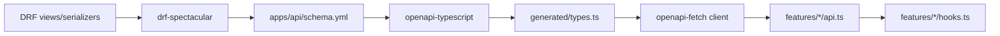

# Phase 2 — API / OpenAPI Contract Audit

Status: audit report  
Date: 2026-06-25  
Mode: audit only — no source changes, no fix plan

## Périmètre

Audit de la fiabilité du contrat backend/frontend :

DRF endpoints → serializers → `schema.yml` → types frontend générés → wrappers/hooks API → tests.

**Contexte :** feature audits fermés — [`feature_audit_closure.md`](./feature_audit_closure.md) indique `TODO_NOW = 0`. Boussole : [`phase_2_audit_backlog.md`](./phase_2_audit_backlog.md) §1 (API / OpenAPI).

**Exclus :** DB, Realtime, Celery, PWA, architecture frontend complète — sauf où nécessaire pour vérifier le contrat API. Items `FIXED`, `WONT_FIX_NOW`, `DECISION_CLOSED` non rouverts sans nouvelle preuve code.

Phase dev uniquement — pas d'exigence staging/prod.

---

## 1. Executive summary

Le pipeline de contrat est **architecturalement sain et majoritairement respecté** :



| Métrique | Valeur |
|----------|--------|
| Paths OpenAPI | 102 |
| Component schemas | 167 |
| Taille `schema.yml` | ~9 089 lignes |
| Gate local | `make backend-schema-check` (dans `make backend-check`) + `make web-api-generate` |
| Feature `types.ts` | 12 fichiers — alias `components['schemas']`, pas d'arbres d'interfaces parallèles |
| Isolation tenant REST | Enforced via resolvers/selectors → **404** (testé actions, signals, checklists, comments, onboarding) |

**Les risques principaux sont l'hygiène du contrat et la prévention de régression**, pas des bypass sécurité connus :

1. **CI n'enforce pas la fraîcheur du schema ni des types générés** — drift possible sur `main`
2. **Drift documenté entre OpenAPI et runtime** sur les enveloppes d'erreur (`DetailResponse` vs `{code, detail}`)
3. **Footgun RBAC structurel** — `HasActiveMembership` ne lie pas l'établissement URL ; compensé par resolvers aujourd'hui
4. **Bootstrap `can_create_action` surévalue les capacités Staff** — hint true + API 400 sur create restreint
5. **Pagination et sémantique d'erreur varient par domaine** — feeds vs notifications vs chat vs comments

Les items backlog §1 (R1, C-06, RBAC-03–05, F4, F5, F8, session cancel, OB-05) ont été **re-validés avec preuve code** — tous restent valides comme dette maintenance/contrat différée, pas comme failles ouvertes.

---

## 2. Scope inspected

### Files inspected

| Layer | Key paths |
|-------|-----------|
| Schema pipeline | [`Makefile`](../Makefile) L101–128, L221–222; [`apps/api/config/settings.py`](../../apps/api/config/settings.py) L301–314; [`apps/api/config/urls.py`](../../apps/api/config/urls.py) |
| Schema artifact | [`apps/api/schema.yml`](../../apps/api/schema.yml) |
| Error contract | [`apps/api/houston/core/api/exceptions.py`](../../apps/api/houston/core/api/exceptions.py); [`docs/architecture/api_error_contract.md`](../architecture/api_error_contract.md) |
| DRF domains | `actions`, `signals`, `checklists`, `comments`, `observations`, `establishments`, `notifications`, `chat`, `realtime`, `uploads`, `accounts` — `api/views.py`, `api/serializers.py`, `permissions.py` |
| Tenancy / RBAC | [`establishments/permissions.py`](../../apps/api/houston/establishments/permissions.py), [`establishments/role_constants.py`](../../apps/api/houston/establishments/role_constants.py), [`establishments/membership_scope.py`](../../apps/api/houston/establishments/membership_scope.py), `*/access.py` resolvers |
| Generated frontend | [`apps/web/src/api/generated/types.ts`](../../apps/web/src/api/generated/types.ts), [`apps/web/src/api/client.ts`](../../apps/web/src/api/client.ts) |
| Feature API layer | 12 `features/*/api.ts`, 10 `hooks.ts`, 12 `types.ts` |
| CI | [`.github/workflows/ci.yml`](../../.github/workflows/ci.yml) |

### Tests inspected

| Category | Files |
|----------|-------|
| Contract / shape | `signals/tests/test_signal_api_contract.py`, `actions/tests/test_execution_feed_api.py`, `core/tests/test_api_exceptions.py`, `checklists/tests/test_template_api.py` (string check on schema.yml) |
| Tenant isolation | `test_*_tenant_isolation_api.py` (actions, signals, checklists, comments, establishments/onboarding) |
| RBAC / hints | `actions/tests/test_action_permissions.py`, `actions/tests/test_action_transitions_api.py`, `establishments/tests/test_permissions.py`, `realtime/tests/test_realtime_ws_ticket_api.py`, `chat/tests/test_ws_ticket_api.py` |
| Frontend hooks | 5 `hooks.mutations.test.ts`, 5 `api*.test.ts`, `api/client.test.ts` |
| Public tenancy exports | `establishments/tests/test_public_tenancy_exports.py` |

### Docs / rules inspected

[`AGENTS.md`](../../AGENTS.md), [`apps/api/AGENTS.md`](../../apps/api/AGENTS.md), [`apps/web/AGENTS.md`](../../apps/web/AGENTS.md), [`.cursor/rules/000-project-contract.mdc`](../../.cursor/rules/000-project-contract.mdc), [`.cursor/rules/10-backend-django-drf.mdc`](../../.cursor/rules/10-backend-django-drf.mdc), [`.cursor/rules/20-frontend-react-vite-ts.mdc`](../../.cursor/rules/20-frontend-react-vite-ts.mdc), [`phase_2_audit_backlog.md`](./phase_2_audit_backlog.md) §1, [`feature_audit_closure.md`](./feature_audit_closure.md), [`feature_audit_decisions.md`](./feature_audit_decisions.md)

### Assumptions / unknowns

- `make verify` / `make backend-check` non exécutés dans cet audit
- Pas d'appel runtime à l'API live — preuve depuis schema commité + tests + analyse statique
- Protocoles WebSocket chat/opérationnel hors scope OpenAPI (intentionnel)
- Coût requêtes DB (F9, SIG-04) reporté à l'audit Database

### Phase 2 backlog §1 — verdicts croisés

| Backlog ID | Verdict audit | Notes |
|------------|---------------|-------|
| **R1 / F3** — imports privés tenancy | **Toujours valide (partiellement amélioré)** | `_ADMIN_ROLES` / `_is_valid_membership` promus ; `_ACTION_ROLES` / `_MANAGEMENT_ROLES` restent importés cross-app → API-O2 |
| **C-06 / F1** — monolithe `establishments/services.py` | **Toujours valide (structure)** | ~2545 LOC ; comportement API couvert par tests onboarding/permissions — pas de bug contrat |
| **RBAC-03** — `HasActiveMembership` | **Toujours valide (footgun)** | Compensé par resolvers sur tous les endpoints audités → API-O4 |
| **RBAC-04** — WS ticket 403 vs 404 | **Toujours valide (polish contrat)** | Enforcement OK ; divergence sémantique documentée → API-O9 |
| **RBAC-05** — resolver establishment dupliqué | **Toujours valide (maintenance)** | 3+ copies alignées aujourd'hui → API-O10 |
| **F4** — validation membership dupliquée | **Toujours valide** | 2 copies non byte-identiques → API-O10 |
| **F5** — règles scope BU parallèles | **Toujours valide** | Primitives centrales existent ; branching dupliqué par domaine → API-O10 |
| **F8** — parité hints ↔ services (actions) | **Toujours valide (réduit post ACT-02)** | Transitions alignées ; gap staff create bootstrap → API-O5 |
| **Session cancel / abandon** | **Toujours valide** | États terminaux modèle ; pas d'endpoint cancel → API-O7 |
| **OB-05** — API description sans wizard | **Toujours valide** | Endpoint + hook existent ; hook mort côté frontend → API-O7 |

---

## 3. API contract findings (max 10)

### API-O1 — CI contract gate missing

| Field | Detail |
|-------|--------|
| **ID** | API-O1 |
| **Severity** | P1 |
| **Category** | API contract / maintainability |
| **Evidence** | [`.github/workflows/ci.yml`](../../.github/workflows/ci.yml) — backend : ruff + pytest ; frontend : lint + test + typecheck ; **aucun** `backend-schema-check`, `web-api-generate`, diff `schema.yml` ou `types.ts`. Gate local : [`Makefile`](../Makefile) `backend-schema-check` → `git diff --exit-code apps/api/schema.yml` |
| **Problem** | Schema OpenAPI et types frontend générés peuvent diverger sur `main` sans échec CI |
| **Why it matters** | OpenAPI = source de vérité déclarée dans AGENTS.md ; drift casse le client typé à la compilation ou silencieusement au runtime |
| **Risk if ignored** | PRs fusionnent des contrats périmés ; typecheck frontend passe jusqu'à régénération manuelle |
| **Suggested direction** | Ajouter en CI les étapes équivalentes à `make backend-schema-check` et optionnellement vérifier la fraîcheur de `types.ts` |
| **Test coverage** | Gate Make local uniquement — **aucun test CI** |
| **Size** | S |

---

### API-O2 — Private tenancy symbols still imported cross-app (R1 / F3 narrowed)

| Field | Detail |
|-------|--------|
| **ID** | API-O2 |
| **Severity** | P1 |
| **Category** | structure / security (drift) |
| **Evidence** | [`chat/permissions.py`](../../apps/api/houston/chat/permissions.py) importe `_ACTION_ROLES`, `ADMIN_ROLES` ; [`checklists/permissions.py`](../../apps/api/houston/checklists/permissions.py) importe `_MANAGEMENT_ROLES`, `ADMIN_ROLES` depuis [`establishments/role_constants.py`](../../apps/api/houston/establishments/role_constants.py). Exports publics promus : `ADMIN_ROLES`, `is_valid_membership` — test [`test_public_tenancy_exports.py`](../../apps/api/houston/establishments/tests/test_public_tenancy_exports.py) |
| **Problem** | Issue originale `_ADMIN_ROLES` / `_is_valid_membership` partiellement corrigée ; deux jeux de symboles privés restent importés cross-app |
| **Why it matters** | Nouveaux domaines peuvent copier des imports privés ; refactor `role_constants.py` a un ripple silencieux |
| **Risk if ignored** | Drift RBAC quand les jeux de rôles évoluent |
| **Suggested direction** | Promouvoir les symboles restants ou consolider les checks rôle dans une API publique tenancy |
| **Test coverage** | `test_public_tenancy_exports.py` — pas de gate import-graph pour symboles privés |
| **Size** | M |

---

### API-O3 — OpenAPI error envelope drift vs runtime

| Field | Detail |
|-------|--------|
| **ID** | API-O3 |
| **Severity** | P2 |
| **Category** | API contract / ambiguity |
| **Evidence** | Handler global [`core/api/exceptions.py`](../../apps/api/houston/core/api/exceptions.py) `api_exception_handler` émet `{code, detail}` ; schema mélange `DetailResponse` (~67 refs) et `ApiErrorResponse` (~100 refs) dans `schema.yml` ; doc explicite [`api_error_contract.md`](../architecture/api_error_contract.md) L74–79 ; bypass manuels : [`notifications/api/views.py`](../../apps/api/houston/notifications/api/views.py) L99–100 `{"detail": "Not found."}` ; chat empty 404 [`chat/api/views.py`](../../apps/api/houston/chat/api/views.py) |
| **Problem** | Types générés et parsing d'erreur frontend ne peuvent pas s'appuyer uniformément sur `code` |
| **Why it matters** | UX incohérente auth/forbidden/not-found ; openapi-typescript peut induire en erreur les intégrateurs |
| **Risk if ignored** | Nouveaux endpoints copient des patterns mixtes ; branches client error handling se multiplient |
| **Suggested direction** | Standardiser `@extend_schema` error responses ; router les 404 manuels via handler ou helper partagé |
| **Test coverage** | [`test_api_exceptions.py`](../../apps/api/houston/core/tests/test_api_exceptions.py) couvre le handler — **pas** les annotations par endpoint ni les réponses manuelles |
| **Size** | M |

---

### API-O4 — `HasActiveMembership` is establishment-agnostic (RBAC-03)

| Field | Detail |
|-------|--------|
| **ID** | API-O4 |
| **Severity** | P2 |
| **Category** | security / structure |
| **Evidence** | [`establishments/permissions.py`](../../apps/api/houston/establishments/permissions.py) L109–114 `HasActiveMembership.has_permission` → `bool(access_context.active_memberships)` ; test explicite [`test_permissions.py`](../../apps/api/houston/establishments/tests/test_permissions.py) L203–229 autorise contexte selection-required ; tous les endpoints opérationnels audités ajoutent un second guard : `resolve_observation_actor_membership` ([`uploads/access.py`](../../apps/api/houston/uploads/access.py)) ou selectors retournant `None` → 404 |
| **Problem** | La permission DRF seule ne lie pas l'`establishment_id` URL à la membership session |
| **Why it matters** | Safe aujourd'hui uniquement parce que chaque view ajoute un resolver ; un nouvel endpoint peut oublier le second guard |
| **Risk if ignored** | Lecture/écriture cross-establishment sur futurs endpoints |
| **Suggested direction** | Mixin permission establishment-scoped par défaut pour routes opérationnelles ; documenter le pattern dans AGENTS.md |
| **Test coverage** | Suites tenant isolation par domaine ; **aucun test** assertant l'échec si resolver omis |
| **Size** | M |

---

### API-O5 — Bootstrap `can_create_action` overstates staff capability (F8 narrowed)

| Field | Detail |
|-------|--------|
| **ID** | API-O5 |
| **Severity** | P2 |
| **Category** | API contract / ambiguity |
| **Evidence** | [`can_create_action`](../../apps/api/houston/establishments/permissions.py) L53–56 retourne `True` pour tout STAFF ; règles service [`actions/services.py`](../../apps/api/houston/actions/services.py) L89–102 `_validate_staff_create_constraints` (self-assign only, pas de linked) ; hints bootstrap via [`accounts/permission_hints.py`](../../apps/api/houston/accounts/permission_hints.py) L19 ; API retourne **400** sur violation — [`test_actions_api.py`](../../apps/api/houston/actions/tests/test_actions_api.py) ; hint linked-create signal correct : `can_create_linked_action` (staff → false) dans [`signals/api/serializers.py`](../../apps/api/houston/signals/api/serializers.py) |
| **Problem** | Hint UX true + API 400 pour staff créant action hors périmètre / linked / autre assignee |
| **Why it matters** | Menus create frontend peuvent afficher des affordances qui échouent au submit |
| **Risk if ignored** | Charge support ; perception de bug RBAC |
| **Suggested direction** | Restreindre le hint bootstrap ou ajouter des hints create granulaires sur feed/bootstrap |
| **Test coverage** | Tests staff create API existent ; **pas** de test parité hint bootstrap |
| **Size** | S |

---

### API-O6 — Pagination and list contract inconsistency

| Field | Detail |
|-------|--------|
| **ID** | API-O6 |
| **Severity** | P2 |
| **Category** | API contract / scalability |
| **Evidence** | Pas de pagination DRF globale ([`settings.py`](../../apps/api/config/settings.py)) ; feeds cursor : `items` + `next_cursor` + `has_more` (execution, signal, notifications) ; chat messages : `items` + `has_more` seulement ([`chat/api/serializers.py`](../../apps/api/houston/chat/api/serializers.py) L84–86) ; param cursor chat documenté avec référence `next_cursor` absent du response schema ; comments : liste complète non paginée ([`comments/api/views.py`](../../apps/api/houston/comments/api/views.py) L46–50) ; `page_size` : clamp silencieux (feeds) vs 400 strict (notifications/chat) |
| **Problem** | Pas de contrat liste unique ; sémantique cursor chat diffère des feeds |
| **Why it matters** | Adaptateurs infinite-query frontend diffèrent par domaine ; threads commentaires peuvent overfetch |
| **Risk if ignored** | Douleur perf sur longs threads ; bugs client si réutilisation helpers pagination feed |
| **Suggested direction** | Documenter matrice pagination par endpoint dans descriptions OpenAPI ; pagination comments en phase ultérieure |
| **Test coverage** | [`test_execution_feed_response_contract`](../../apps/api/houston/actions/tests/test_execution_feed_api.py) ; **aucun** test contrat/taille liste comments |
| **Size** | M (pagination comments = L) |

---

### API-O7 — Onboarding lifecycle API gaps (session cancel + OB-05 dead hook)

| Field | Detail |
|-------|--------|
| **ID** | API-O7 |
| **Severity** | P2 |
| **Category** | API contract / ambiguity |
| **Evidence** | États terminaux `FAILED` / `CANCELED` sur [`establishments/models.py`](../../apps/api/houston/establishments/models.py) ; **aucun** endpoint cancel/abandon dans [`establishments/api/urls.py`](../../apps/api/houston/establishments/api/urls.py) ; endpoint description `PATCH .../description/` avec tests [`test_onboarding_api.py`](../../apps/api/houston/establishments/tests/test_onboarding_api.py) ; frontend [`useSubmitActivityDescription`](../../apps/web/src/features/onboarding/hooks.ts) L102 — **défini mais non importé** par aucun composant |
| **Problem** | API description exposée + hook sans step wizard ; pas d'API pour abandonner sessions DRAFT |
| **Why it matters** | Sessions orphelines en dev ; pipeline AI peut manquer contexte description ; second client ne peut pas cancel |
| **Risk if ignored** | Hygiène données ; confusion contrat/doc (OB-04 fermé doc-only : description optionnelle) |
| **Suggested direction** | Décision produit sur API abandon ; câbler ou retirer hook mort ; documenter deferral intentionnel |
| **Test coverage** | Tests PATCH description existent ; pas de tests cancel API (N/A) |
| **Size** | S (hook/doc) / M (cancel API) |

---

### API-O8 — Sparse API contract regression coverage

| Field | Detail |
|-------|--------|
| **ID** | API-O8 |
| **Severity** | P2 |
| **Category** | tests |
| **Evidence** | 1 seul fichier `test_*_api_contract.py` (signals) ; execution feed vérifie 3 clés seulement ([`test_execution_feed_api.py`](../../apps/api/houston/actions/tests/test_execution_feed_api.py) L67–78) ; checklist OpenAPI = string search sur schema commité ([`test_template_api.py`](../../apps/api/houston/checklists/tests/test_template_api.py) L701+) ; pas de diff schema en CI (voir API-O1) |
| **Problem** | Ruptures contrat peuvent shipper sans `make backend-check` local |
| **Why it matters** | 102 paths — couverture manuelle ne scale pas |
| **Risk if ignored** | Renommage champ serializer casse frontend sans signal test |
| **Suggested direction** | Gate CI schema (API-O1) + tests contrat ciblés payloads à fort trafic (bootstrap, feeds, detail serializers) |
| **Test coverage** | **Gap = finding** |
| **Size** | M |

---

### API-O9 — WS ticket 403 vs REST detail 404 (RBAC-04)

| Field | Detail |
|-------|--------|
| **ID** | API-O9 |
| **Severity** | P3 |
| **Category** | API contract / ambiguity |
| **Evidence** | [`test_realtime_ws_ticket_api.py`](../../apps/api/houston/realtime/tests/test_realtime_ws_ticket_api.py) `test_realtime_ws_ticket_rejects_foreign_establishment` → **403** ; [`test_ws_ticket_api.py`](../../apps/api/houston/chat/tests/test_ws_ticket_api.py) `test_ws_ticket_rejects_foreign_establishment` → **403** + `permission_denied` ; REST tenant : [`test_signal_tenant_isolation_api.py`](../../apps/api/houston/signals/tests/test_signal_tenant_isolation_api.py) → **404** |
| **Problem** | Même scénario "foreign establishment" retourne codes HTTP différents selon transport |
| **Why it matters** | Fuite existence vs cohérence UX ; frontend doit brancher |
| **Risk if ignored** | Debug confus ; disclosure info mineure |
| **Suggested direction** | Documenter comme intentionnel ou aligner sur pattern 404-with-deny REST |
| **Test coverage** | Tests 403 explicites — contrat actuel intentionnel |
| **Size** | S |

---

### API-O10 — Duplicated resolver / validation / scope primitives (RBAC-05, F4, F5)

| Field | Detail |
|-------|--------|
| **ID** | API-O10 |
| **Severity** | P3 |
| **Category** | maintainability / structure |
| **Evidence** | 3 resolvers quasi-identiques : [`uploads/access.py`](../../apps/api/houston/uploads/access.py) `resolve_observation_actor_membership`, [`realtime/access.py`](../../apps/api/houston/realtime/access.py) `resolve_operational_realtime_actor_membership`, [`chat/access.py`](../../apps/api/houston/chat/access.py) `_resolve_establishment_membership` ; `_validate_membership_in_establishment` dupliqué : [`actions/services.py`](../../apps/api/houston/actions/services.py) L49+ (`.select_related`, `ActionValidationError`) vs [`checklists/services.py`](../../apps/api/houston/checklists/services.py) L130+ (`ChecklistValidationError`) ; branching scope BU parallèle dans `signals/permissions.py`, `actions/permissions.py`, `checklists/permissions.py` malgré [`membership_scope.py`](../../apps/api/houston/establishments/membership_scope.py) |
| **Problem** | Duplication maintenance — comportement aligné aujourd'hui |
| **Why it matters** | Fix appliqué dans une copie manqué dans l'autre |
| **Risk if ignored** | Drift scope/validation subtil sur rôles edge |
| **Suggested direction** | Consolider lors de touches endpoints liés — pas de refactor urgent |
| **Test coverage** | Tests permissions par domaine + [`test_membership_scope_coverage.py`](../../apps/api/houston/establishments/tests/test_membership_scope_coverage.py) |
| **Size** | M |

---

## 4. Schema / generated type risks

| Risk | Severity | Evidence | Notes |
|------|----------|----------|-------|
| **CI gap (API-O1)** | P1 | `.github/workflows/ci.yml` | Vecteur drift principal |
| **Single generated file** | — | `apps/web/src/api/generated/types.ts` (~8793 lines) | Bon pattern ; édition manuelle interdite |
| **Frontend type duplication** | P3 | [`realtime/types.ts`](../../apps/web/src/features/realtime/types.ts) `OperationalRealtimeWsTicketResponse` vs generated `RealtimeWsTicketResponse` | Shapes identiques ; pas de lien compile-time |
| **Unused schema endpoints** | P3 | ~8 paths sans caller `features/*/api.ts` | health, observation-media preview, chat admin (settings/leave/participants/promote), notification archive — acceptable MVP |
| **Chat cursor doc bug** | P3 | Param `cursor` description référence `next_cursor` ; response chat n'a pas ce champ | Incohérence schema.yml uniquement |
| **Minimal SPECTACULAR_SETTINGS** | P3 | [`settings.py`](../../apps/api/config/settings.py) L310–314 — title/description/version seulement | Pas de postprocessing hooks, enum overrides |

**Pipeline de génération (référence) :**

```
make schema          → drf-spectacular → apps/api/schema.yml
make web-api-generate → openapi-typescript → apps/web/src/api/generated/types.ts
make backend-schema-check → git diff schema.yml (local gate)
```

---

## 5. Validation / error / status-code risks

| Pattern | Where | Status | Test evidence |
|---------|-------|--------|---------------|
| Cross-establishment REST | Detail, commands, feeds opérationnels | **404** — cohérent | `test_*_tenant_isolation_api.py` |
| Same-establishment RBAC deny | Action transitions, pin, etc. | **403** + `permission_denied` | `test_action_transitions_api.py` |
| Business rule deny (staff create) | Actions API | **400** + message service | `test_actions_api.py` |
| Foreign establishment WS ticket | Realtime, chat | **403** — diverge REST | `test_realtime_ws_ticket_api.py`, `test_ws_ticket_api.py` |
| Invalid `page_size` | Notifications, chat | **400** | Tests notifications |
| Invalid `page_size` | Signal, execution feeds | **Clamp silencieux** | Pas de test divergence explicite |
| Framework errors | Global handler | **Standardisé** `{code, detail}` | `test_api_exceptions.py` |
| Validation errors | Global handler | **`validation_error` + `errors`** | `test_api_exceptions.py` |
| Manual 404 | notifications, establishments, uploads, checklists, signals, chat | **`detail` only ou body vide** | Bypass handler — voir API-O3 |

**Matrice permission_hints (surface OpenAPI) :**

| Domain | Serializer | Source |
|--------|------------|--------|
| Actions | `actions/api/serializers.py` `serialize_action_permission_hints` | `actions/permissions.py` |
| Signals | `signals/api/serializers.py` | `signals/permissions.py` inline |
| Checklists | `checklists/api/serializers.py` | `checklists/permission_hints.py` |
| Comments | `comments/api/serializers.py` | `comments/permissions.py` |
| Bootstrap | `accounts/api/serializers.py` | `accounts/permission_hints.py` |

---

## 6. Frontend contract drift

### Safe (aligned)

- **12 feature `types.ts`** alias `components['schemas']` — pas d'arbres REST parallèles
- **Aucune URL REST hors schema** dans modules `features/*/api.ts`
- **`permission_hints`** consommés depuis payloads API ([`bootstrap-permission-hints.ts`](../../apps/web/src/features/auth/lib/bootstrap-permission-hints.ts)), pas calculés localement
- **Flow standard** : `apiClient` → `api.ts` → `hooks.ts` → components (10 domaines)
- **Transitions action hints** alignées post ACT-02 — services appellent mêmes helpers que serializers

### Bypasses justifiés (dans schema)

| Location | Reason |
|----------|--------|
| [`auth/api.ts`](../../apps/web/src/features/auth/api.ts) L540+ `fetchBusinessUnitTree` | CSRF + `credentials: 'include'` |
| [`observations/api.ts`](../../apps/web/src/features/observations/api.ts) `fetchWithAuthRetry` | Multipart `FormData` uploads |
| [`api/client.ts`](../../apps/web/src/api/client.ts) `fetchWithAuthRetry` | Transport auth retry |

### Gaps

| Gap | Finding |
|-----|---------|
| Hook mort `useSubmitActivityDescription` | API-O7 |
| Type WS ticket manuel realtime | Duplique `RealtimeWsTicketResponse` — drift faible |
| Tests hooks/API sparse | observations, onboarding, chat REST, establishment-config sans suite dédiée |
| Appels directs `api.ts` sans hooks | invitation accept, establishment switch — acceptable one-off flows |

---

## 7. Safe areas already covered

Items **non rouverts** — preuve code actuelle :

| Item | Status closure | Why safe now |
|------|----------------|--------------|
| **ACT-02 / EF-06** | FIXED | Services + hints transitions ; `test_execution_feed_api.py` `test_execution_feed_action_item_includes_permission_hints` |
| **ACT-07** | FIXED | `test_action_tenant_isolation_api.py` |
| **EF-04** | FIXED | `execution-create-menu.ts` + bootstrap hints |
| **CL-03** | FIXED | `reflect_delete_conflicts` + test permission hints |
| **OBS-02** | FIXED | `can_view_observation_processing_status` ; peer 404 |
| **C-04 / OR-05** | DECISION_CLOSED | Collapse docs `no_signal_created` |
| **SIG-03** | FIXED | Unique constraint aggregation key |
| **SIG-05** | FIXED | `can_view_signal_detail` naming |
| **Public tenancy exports** | Partial FIXED | `test_public_tenancy_exports.py` |
| **Frontend type strategy** | — | Feature types alias generated ; pas de duplication REST |
| **RBAC enforcement endpoints existants** | — | Resolvers + selectors compensent RBAC-03 |
| **C-06 monolithe** | DEFER_PHASE_2 | Comportement API testé ; dette structurelle, pas bug contrat |

---

## 8. Deferred questions for later audits

| Domain | Items | Relation contrat API |
|--------|-------|---------------------|
| **Database** | F9 prefetch signal canceled detail ; SIG-04 index agrégation ; coût liste comments | Impact shape serializer / perf read |
| **Realtime** | NR-08 reconnect comment sweep ; NR-09 invalidation reporting/workspace ; payloads WS complets | WS hors OpenAPI |
| **Celery / Async** | C-03 retry policy ; CL-08 horizon sharding | Nouvelle surface API seulement si endpoints ajoutés |
| **Frontend architecture** | OB-03 wizard tests composant ; guards mirroring bootstrap hints | Parité hints UX |
| **Product DECISION_OPEN** | ACT-03/08, CL-06, EF-08, NR-06, SIG-06 | Peuvent ajouter endpoints ou champs schema |

---

## 9. Top priorities

### Top 3 fixes to do first

1. **API-O1** — Gate CI schema + types générés (ROI maximal, S)
2. **API-O3** — Cohérence enveloppe erreur OpenAPI + chemins 404 manuels (M)
3. **API-O4** — Permission establishment-scoped par défaut pour nouveaux endpoints (M)

### Quick wins

- API-O1 (CI gate)
- API-O5 (hint bootstrap staff create)
- Documenter split RBAC-04 403/404
- Câbler ou retirer hook mort OB-05

### Structural issues to plan later

- API-O10 dedup resolvers / validation / scope
- API-O6 pagination comments
- C-06 split monolithe establishments
- API-O7 session cancel API (décision produit)

### Not worth fixing now

- Endpoints chat admin sans UI (settings/leave/participants)
- Chat empty 404 bodies (cosmétique si clients gèrent status code)
- `OperationalRealtimeWsTicketResponse` type manuel (risque drift faible)
- Clamp silencieux `page_size` feeds (comportement stable, documenté suffisant)

---

## Changed

- Created [`docs/audits/phase_2_api_openapi_audit.md`](./phase_2_api_openapi_audit.md) — audit phase 2 API / OpenAPI contract

## Validated

- Relecture statique code + tests ; croisement backlog §1 ([`phase_2_audit_backlog.md`](./phase_2_audit_backlog.md)) ; pipeline CI/Makefile tracé ; 10 findings max avec preuves file/function/test ; items FIXED/WONT_FIX/DECISION_CLOSED non rouverts

## Risks / not verified

- `make verify` / `make backend-check` non exécutés
- Pas d'appels API runtime live
- UX browser pour hint staff create non vérifiée
- Comptages schema.yml (`DetailResponse` / `ApiErrorResponse`) approximatifs via grep — suffisants pour tendance, pas audit ligne par ligne
