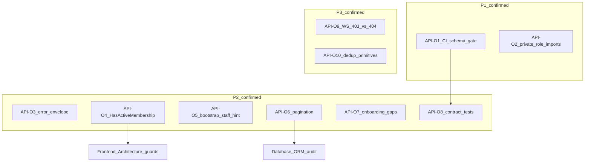
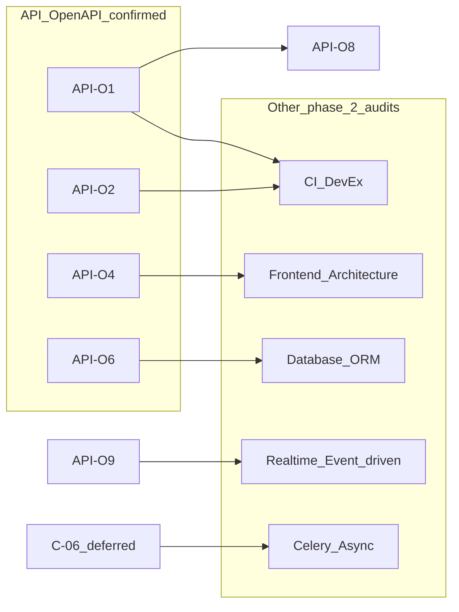

# Phase 2 — API / OpenAPI Consolidation

Status: consolidation report  
Date: 2026-06-26  
Mode: consolidation only — no source changes

## Sources

| Category | Files |
|----------|-------|
| Audit input | [`phase_2_api_openapi_audit.md`](./phase_2_api_openapi_audit.md) (API-O1–O10) |
| Backlog | [`phase_2_audit_backlog.md`](./phase_2_audit_backlog.md) §1 |
| Closure | [`feature_audit_closure.md`](./feature_audit_closure.md) |
| Decisions | [`feature_audit_decisions.md`](./feature_audit_decisions.md) |
| Contract | [`AGENTS.md`](../../AGENTS.md), [`apps/api/AGENTS.md`](../../apps/api/AGENTS.md), [`apps/web/AGENTS.md`](../../apps/web/AGENTS.md) |

**Branch context:** Feature audits closed (`TODO_NOW = 0`). This consolidation challenges each finding from the phase 2 API/OpenAPI audit against backlog §1, closure registry, and spot-check code evidence. No `FIXED`, `WONT_FIX_NOW`, or `DECISION_CLOSED` items reopened without new direct code evidence.

---

## 1. Executive summary

The API/OpenAPI pipeline is **architecturally sound**: DRF → `schema.yml` → generated `types.ts` → `features/*/api.ts` is followed consistently; REST tenant isolation is enforced (404); `permission_hints` are server-sourced. **No security bypass or P0 contract break** was found.

Residual risk is **contract hygiene and regression prevention**, not missing enforcement on existing endpoints:

| Priority | Count | Themes |
|----------|-------|--------|
| **P1** | 2 | CI schema/types gate (API-O1); private tenancy role imports (API-O2 / R1 narrowed) |
| **P2** | 6 | Error envelope drift (API-O3); `HasActiveMembership` footgun (API-O4 / RBAC-03); bootstrap staff create hint (API-O5 / F8); pagination inconsistency (API-O6); onboarding API gaps (API-O7); sparse contract tests (API-O8) |
| **P3** | 2 | WS 403 vs REST 404 (API-O9 / RBAC-04); duplicated resolvers/validation/scope (API-O10 / RBAC-05, F4, F5) |

**Consolidation verdict:** 10 audit findings reviewed → **10 confirmed**, **0 false positives**, **4 duplicate merges** (backlog aliases), **3 deferred/ignored** (section §4 ancillary), **2 needs-more-evidence** (transverse signals not examined in API audit).

---

## 2. Findings reviewed

All 10 findings from [`phase_2_api_openapi_audit.md`](./phase_2_api_openapi_audit.md) §3, plus four ancillary risks from §4 (schema/type risks), cross-checked against [`phase_2_audit_backlog.md`](./phase_2_audit_backlog.md) §1 and [`feature_audit_closure.md`](./feature_audit_closure.md).

| ID | Audit sev | Reclassification | Backlog alias | Consolidation notes |
|----|-----------|------------------|---------------|---------------------|
| **API-O1** | P1 | **CONFIRMED** | — (new; complements CI/DevEx R10) | CI runs ruff + pytest only; `make backend-schema-check` exists locally ([`Makefile`](../../Makefile) L122–128) but absent from [`.github/workflows/ci.yml`](../../.github/workflows/ci.yml) |
| **API-O2** | P1 | **CONFIRMED** (narrowed) | **R1 / F3** | `ADMIN_ROLES` / `is_valid_membership` promoted + [`test_public_tenancy_exports.py`](../../apps/api/houston/establishments/tests/test_public_tenancy_exports.py); `_ACTION_ROLES` / `_MANAGEMENT_ROLES` still private imports in chat/checklists |
| **API-O3** | P2 | **CONFIRMED** | — | Global handler `{code, detail}` vs mixed `DetailResponse` / manual 404 bodies in schema |
| **API-O4** | P2 | **CONFIRMED** | **RBAC-03** | `HasActiveMembership` checks any active membership; compensated by per-view resolvers on audited endpoints |
| **API-O5** | P2 | **CONFIRMED** (narrowed) | **F8** | Hint granularity gap: `can_create_action=true` for Staff does not distinguish free / self-assigned / non-linked constraints; API enforces via 400 — **not** an authorization bypass |
| **API-O6** | P2 | **CONFIRMED** | — (new) | Feeds cursor vs chat `has_more`-only vs unpaginated comments; `page_size` clamp vs 400 |
| **API-O7** | P2 | **CONFIRMED** | Session cancel + **OB-05** | Cancel API: **PRODUCT_DECISION**; dead hook `useSubmitActivityDescription`: confirmed hygiene |
| **API-O8** | P2 | **CONFIRMED** | Partial **DUPLICATE** of API-O1 | Contract test gap real; primary fix vector is API-O1 CI gate + targeted payload tests |
| **API-O9** | P3 | **CONFIRMED** | **RBAC-04** | WS ticket tests assert 403; REST tenant isolation uses 404 |
| **API-O10** | P3 | **CONFIRMED** (merged) | **RBAC-05**, **F4**, **F5** | 3 resolver copies + 2 `_validate_membership_in_establishment` + parallel BU branching despite `membership_scope.py` |
| Chat cursor schema bug | P3 (§4) | **DUPLICATE** of API-O6 | — | OpenAPI param references `next_cursor` absent from chat response — doc-only slice of pagination theme |
| `OperationalRealtimeWsTicketResponse` manual type | P3 (§4) | **IGNORE_NOW** | — | Shape matches generated type; audit explicitly defers |
| Unused schema paths (~8) | P3 (§4) | **IGNORE_NOW** | — | health, admin chat, etc. — acceptable MVP |
| **C-06** monolith | — | **DEFER_PHASE_2** | **C-06 / F1 / R9** | Re-validated in audit §2; not a new finding; behavior tested, structure debt |
| View-layer ORM drift | — | **NEEDS_MORE_EVIDENCE** | Transverse signal | Cited in backlog §Signaux transverses; not examined in API audit |
| Onboarding ORM in views | — | **NEEDS_MORE_EVIDENCE** | Transverse signal | Same — not in audit findings |

**Backlog §1 re-validation:** All 10 deferred themes (R1, C-06, RBAC-03–05, F4, F5, F8, session cancel, OB-05) remain valid as **deferred maintenance**, not open security holes. Partial progress on R1 (`ADMIN_ROLES` promotion) narrows API-O2 scope but does not close it.

---

## 3. Confirmed findings

### API-O1 — CI contract gate missing

| Field | Detail |
|-------|--------|
| **Severity** | P1 |
| **Evidence** | [`.github/workflows/ci.yml`](../../.github/workflows/ci.yml) — backend: ruff + pytest; frontend: lint + test + typecheck; **no** `backend-schema-check`, `web-api-generate`, or diff on `schema.yml` / `types.ts`. Local gate: [`Makefile`](../../Makefile) `backend-schema-check` → `git diff --exit-code apps/api/schema.yml` |
| **Why confirmed** | OpenAPI is declared source of truth in AGENTS.md; CI does not enforce freshness — drift can merge undetected |
| **Risk** | Silent contract breakage on `main`; frontend typecheck passes until manual regeneration |
| **Suggested direction** | Add CI steps equivalent to `make backend-schema-check`; optionally verify generated `types.ts` freshness |
| **Dependencies** | Unblocks ROI of API-O8; relates to CI/DevEx theme (R10 doc hygiene adjacent) |
| **Size** | S |

---

### API-O2 — Private tenancy symbols still imported cross-app (R1 / F3 narrowed)

| Field | Detail |
|-------|--------|
| **Severity** | P1 |
| **Evidence** | [`chat/permissions.py`](../../apps/api/houston/chat/permissions.py) imports `_ACTION_ROLES`, `ADMIN_ROLES`; [`checklists/permissions.py`](../../apps/api/houston/checklists/permissions.py) imports `_MANAGEMENT_ROLES`, `ADMIN_ROLES` from [`role_constants.py`](../../apps/api/houston/establishments/role_constants.py). Public exports: `ADMIN_ROLES`, `is_valid_membership` — [`test_public_tenancy_exports.py`](../../apps/api/houston/establishments/tests/test_public_tenancy_exports.py) |
| **Why confirmed** | Original R1 scope (`_ADMIN_ROLES` / `_is_valid_membership`) partially fixed; two private role sets remain cross-app imports |
| **Risk** | Silent RBAC drift when role sets evolve; refactor `role_constants.py` ripples without test signal |
| **Suggested direction** | Promote remaining role sets or consolidate checks in public tenancy API; optional import-graph gate (`signals/tests/test_import_graph.py` pattern) |
| **Dependencies** | RBAC security theme; touches permissions across chat, checklists, and future domains |
| **Size** | M |

---

### API-O3 — OpenAPI error envelope drift vs runtime

| Field | Detail |
|-------|--------|
| **Severity** | P2 |
| **Evidence** | [`core/api/exceptions.py`](../../apps/api/houston/core/api/exceptions.py) `api_exception_handler` emits `{code, detail}`; `schema.yml` mixes `DetailResponse` (~67 refs) and `ApiErrorResponse` (~100 refs); doc [`api_error_contract.md`](../architecture/api_error_contract.md) L74–79; manual bypasses: [`notifications/api/views.py`](../../apps/api/houston/notifications/api/views.py), [`chat/api/views.py`](../../apps/api/houston/chat/api/views.py) |
| **Why confirmed** | Generated types and frontend error parsing cannot uniformly rely on `code` field |
| **Risk** | New endpoints copy mixed patterns; client error-handling branches multiply |
| **Suggested direction** | Standardize `@extend_schema` error responses; route manual 404s through shared helper or handler |
| **Dependencies** | Frontend error parsing (low impact today — most clients check status code) |
| **Size** | M |

---

### API-O4 — `HasActiveMembership` is establishment-agnostic (RBAC-03)

| Field | Detail |
|-------|--------|
| **Severity** | P2 |
| **Evidence** | [`establishments/permissions.py`](../../apps/api/houston/establishments/permissions.py) L109–114; test [`test_permissions.py`](../../apps/api/houston/establishments/tests/test_permissions.py) L203–229; all operational endpoints audited add second guard via resolvers/selectors → 404 |
| **Why confirmed** | DRF permission alone does not bind URL `establishment_id` to session membership; safe today only because each view adds resolver |
| **Risk** | Cross-establishment read/write on future endpoints that omit second guard |
| **Suggested direction** | Establishment-scoped permission mixin as default for operational routes; document pattern in `apps/api/AGENTS.md` |
| **Dependencies** | **Frontend Architecture** (FE-02/03/04 route guards); future endpoint safety |
| **Size** | M |

---

### API-O5 — Bootstrap `can_create_action` hint lacks Staff create granularity (F8 narrowed)

| Field | Detail |
|-------|--------|
| **Severity** | P2 |
| **Evidence** | [`can_create_action`](../../apps/api/houston/establishments/permissions.py) L53–56 returns `True` for all STAFF; [`_validate_staff_create_constraints`](../../apps/api/houston/actions/services.py) L89–102 (free action, self-assigned only, non-linked); bootstrap hints via [`accounts/permission_hints.py`](../../apps/api/houston/accounts/permission_hints.py); API returns **400** on violation — [`test_actions_api.py`](../../apps/api/houston/actions/tests/test_actions_api.py) |
| **Why confirmed** | Hint granularity gap, not an authorization bypass: `can_create_action=true` does not distinguish Staff free / self-assigned / non-linked constraints; backend authorization is enforced on write (400). Concrete narrow slice of F8 parité hints ↔ services |
| **Risk** | Create menus may show affordances that fail on submit; support burden and perceived RBAC bug — authorization itself is not bypassed |
| **Suggested direction** | Narrow bootstrap hint or add granular create hints on feed/bootstrap (UX contract alignment) |
| **Dependencies** | **Frontend Architecture** (`execution-create-menu.ts`); broader F8 parité hints ↔ services |
| **Size** | S |

---

### API-O6 — Pagination and list contract inconsistency

| Field | Detail |
|-------|--------|
| **Severity** | P2 |
| **Evidence** | No global DRF pagination ([`settings.py`](../../apps/api/config/settings.py)); feeds: `items` + `next_cursor` + `has_more`; chat: `items` + `has_more` only ([`chat/api/serializers.py`](../../apps/api/houston/chat/api/serializers.py) L84–86); chat cursor param doc references `next_cursor` absent from response; comments: full list ([`comments/api/views.py`](../../apps/api/houston/comments/api/views.py)); `page_size`: clamp (feeds) vs 400 (notifications/chat) |
| **Why confirmed** | No single list contract; infinite-query adapters differ per domain; comments can overfetch |
| **Risk** | Perf pain on long comment threads; client bugs if reusing feed pagination helpers for chat |
| **Suggested direction** | Document pagination matrix in OpenAPI descriptions; fix chat cursor doc bug (S); defer comments pagination until scale trigger |
| **Dependencies** | **Database / ORM** audit for comments list SQL cost; chat cursor bug is doc-only slice of this theme |
| **Size** | M (comments pagination = L if pursued) |

---

### API-O7 — Onboarding lifecycle API gaps (session cancel + OB-05)

| Field | Detail |
|-------|--------|
| **Severity** | P2 |
| **Evidence** | Terminal states `FAILED` / `CANCELED` on [`establishments/models.py`](../../apps/api/houston/establishments/models.py); **no** cancel/abandon endpoint in [`establishments/api/urls.py`](../../apps/api/houston/establishments/api/urls.py); `PATCH .../description/` tested in [`test_onboarding_api.py`](../../apps/api/houston/establishments/tests/test_onboarding_api.py); [`useSubmitActivityDescription`](../../apps/web/src/features/onboarding/hooks.ts) L102 — defined, **not imported** by any component |
| **Why confirmed** | Merges backlog session cancel + OB-05; dead hook is hygiene gap; cancel API is product scope |
| **Risk** | Orphan DRAFT sessions in dev; AI pipeline may lack description context; second client cannot cancel |
| **Suggested direction** | **PRODUCT_DECISION** on cancel API; wire or remove dead hook (S); document intentional deferral (OB-04 closed: description optional) |
| **Dependencies** | **Frontend Architecture** OB-03/07; product gate for cancel |
| **Size** | S (hook/doc) / M (cancel API) |

---

### API-O8 — Sparse API contract regression coverage

| Field | Detail |
|-------|--------|
| **Severity** | P2 |
| **Evidence** | Single `test_*_api_contract.py` (signals); execution feed checks 3 keys ([`test_execution_feed_api.py`](../../apps/api/houston/actions/tests/test_execution_feed_api.py) L67–78); checklist OpenAPI = string search on committed schema ([`test_template_api.py`](../../apps/api/houston/checklists/tests/test_template_api.py) L701+); no schema diff in CI (API-O1) |
| **Why confirmed** | 102 OpenAPI paths — manual coverage does not scale; partially overlaps API-O1 (CI gate is primary fix vector) |
| **Risk** | Serializer field renames ship without test signal; frontend breaks at runtime |
| **Suggested direction** | API-O1 CI gate first; then targeted contract tests for bootstrap, feeds, detail serializers |
| **Dependencies** | **API-O1** (primary); complements rather than replaces |
| **Size** | M |

---

### API-O9 — WS ticket 403 vs REST detail 404 (RBAC-04)

| Field | Detail |
|-------|--------|
| **Severity** | P3 |
| **Evidence** | [`test_realtime_ws_ticket_api.py`](../../apps/api/houston/realtime/tests/test_realtime_ws_ticket_api.py) `test_realtime_ws_ticket_rejects_foreign_establishment` → **403**; [`test_ws_ticket_api.py`](../../apps/api/houston/chat/tests/test_ws_ticket_api.py) → **403**; REST: [`test_signal_tenant_isolation_api.py`](../../apps/api/houston/signals/tests/test_signal_tenant_isolation_api.py) → **404** |
| **Why confirmed** | Same "foreign establishment" scenario returns different HTTP codes by transport; enforcement OK, semantics diverge |
| **Risk** | Minor existence disclosure; confusing debug; frontend must branch |
| **Suggested direction** | Document as intentional transport split or align WS ticket to REST 404-with-deny pattern |
| **Dependencies** | **Realtime / Event-driven** audit; frontend error handling |
| **Size** | S |

---

### API-O10 — Duplicated resolver / validation / scope primitives (RBAC-05, F4, F5)

| Field | Detail |
|-------|--------|
| **Severity** | P3 |
| **Evidence** | 3 quasi-identical resolvers: [`uploads/access.py`](../../apps/api/houston/uploads/access.py), [`realtime/access.py`](../../apps/api/houston/realtime/access.py), [`chat/access.py`](../../apps/api/houston/chat/access.py); `_validate_membership_in_establishment` duplicated: [`actions/services.py`](../../apps/api/houston/actions/services.py) L49+ vs [`checklists/services.py`](../../apps/api/houston/checklists/services.py) L130+ (different exceptions, not byte-identical); parallel BU branching in `signals/permissions.py`, `actions/permissions.py`, `checklists/permissions.py` despite [`membership_scope.py`](../../apps/api/houston/establishments/membership_scope.py) |
| **Why confirmed** | Merges three backlog items; behavior aligned today; maintenance drift risk |
| **Risk** | Fix applied in one copy missed in another; subtle scope divergence on edge roles |
| **Suggested direction** | Consolidate on touch — no urgent refactor |
| **Dependencies** | **Database** F9 unrelated; scope centralization aids future RBAC evolution |
| **Size** | M |

---

## 4. Reclassified / duplicate / false-positive findings

### False positives

**None.** All 10 audit findings (API-O1–O10) are backed by code, test, or doc evidence and remain valid in dev phase.

### Duplicates merged

| Canonical ID | Absorbed backlog / audit IDs | Relationship |
|--------------|------------------------------|--------------|
| **API-O2** | R1, F3 | Narrows original R1 after partial `ADMIN_ROLES` / `is_valid_membership` promotion |
| **API-O4** | RBAC-03 | Same finding, phase 2 adds resolver-compensation evidence |
| **API-O5** | F8 (partial) | Hint granularity gap on bootstrap (`can_create_action=true` vs Staff free/self-assigned/non-linked); API authorization intact; F8 broader parité remains |
| **API-O7** | Session cancel, OB-05 | Two backlog themes merged; cancel = PRODUCT_DECISION, dead hook = hygiene |
| **API-O8** | — (partial duplicate of API-O1) | Contract tests complement CI gate; not redundant action |
| **API-O9** | RBAC-04 | Same finding |
| **API-O10** | RBAC-05, F4, F5 | Three backlog themes merged into one maintenance bucket |
| Chat cursor schema bug | API-O6 (slice) | Doc-only pagination inconsistency |

### Deferred (not new findings)

| ID | Status | Notes |
|----|--------|-------|
| **C-06 / F1 / R9** | DEFER_PHASE_2 | ~2545 LOC monolith; API behavior tested; structure debt only |
| View-layer ORM drift | NEEDS_MORE_EVIDENCE | Transverse signal from backlog; not examined in API audit |
| Onboarding ORM in views | NEEDS_MORE_EVIDENCE | Same |

### Ignored now

| Item | Rationale |
|------|-----------|
| `OperationalRealtimeWsTicketResponse` manual type | Matches generated shape; low drift risk |
| Unused schema paths (~8) | health, admin chat, observation-media preview — acceptable MVP |
| Clamp silencieux `page_size` feeds | Stable behavior; document sufficient |
| Chat empty 404 bodies | Cosmetic if clients check status |

### Items explicitly not reopened

| ID | Closure status | Why not reopened |
|----|----------------|------------------|
| ACT-02, EF-06 | FIXED | Services + hints transitions aligned |
| EF-04 | FIXED | execution-create-menu uses bootstrap hints |
| CL-03 | FIXED | `reflect_delete_conflicts` + tests |
| OBS-02 | FIXED | processing-status auth |
| C-04, OR-05, OB-04, OB-09 | DECISION_CLOSED | Doc-only MVP closures |
| SIG-03, SIG-05 | FIXED | Constraint + naming |
| Public tenancy exports | Partial FIXED | Progress narrows R1, does not close API-O2 |

---

## 5. Cross-audit dependencies

| Confirmed item | Depends on / blocks | Other phase 2 audit |
|----------------|---------------------|---------------------|
| **API-O1**, **API-O8** | Mutual — CI gate enables contract test ROI | CI / DevEx |
| **API-O4**, **API-O5**, **API-O10** (F5) | Hint/guard parity with backend | Frontend Architecture |
| **API-O6** (comments list) | Overfetch at scale | Database / ORM |
| **API-O9** | WS vs REST deny semantics | Realtime / Event-driven |
| **API-O7** (cancel) | Session data hygiene | Frontend Architecture + product |
| **C-06** (deferred) | Onboarding API surface, merge conflicts | Celery (activation enqueue) |
| **F9** (not API finding) | Serializer read cost on canceled signal detail | Database / ORM |
| **API-O2** | Import-graph gate adjunct | CI / DevEx |

---

## 6. Top priorities

### P1 — must address before large-scale API evolution

1. **API-O1** — CI schema/types gate (S, highest ROI)
2. **API-O2** — finish public tenancy surface for remaining private role constants (M)

### P2 — important, not blocking MVP

3. **API-O3** — error envelope OpenAPI consistency (M)
4. **API-O4** — establishment-scoped default permission pattern (M)
5. **API-O5** — bootstrap staff create hint alignment (S)
6. **API-O8** — contract regression tests after CI gate (M)
7. **API-O6** — document pagination matrix; plan comments pagination for scale (M)
8. **API-O7** — remove/wire dead `useSubmitActivityDescription` hook (S); cancel API awaits product (M)

### P3 — polish / hygiene

9. **API-O9** — document or align WS 403 vs REST 404 (S)
10. **API-O10** — dedup resolvers/validation/scope on touch (M)

### Quick wins

- API-O1 (CI gate)
- API-O5 (bootstrap staff hint)
- API-O7 dead hook removal (S)
- Document RBAC-04 403/404 split (API-O9)

### Structural issues to plan later

- API-O10 full dedup
- API-O6 comments pagination (L)
- C-06 establishments monolith split
- API-O7 session cancel API (product decision)

---

## 7. What is safe today

- REST cross-establishment access → **404** (actions, signals, checklists, comments, onboarding — `test_*_tenant_isolation_api.py`)
- Same-establishment RBAC deny → **403** + `permission_denied` on command endpoints
- `permission_hints` sourced from backend permissions on actions, signals, checklists, comments, bootstrap — not computed client-side
- ACT-02 / EF-06 action transition hints aligned with services
- 12 feature `types.ts` alias `components['schemas']` — no parallel REST type trees
- No REST URLs outside OpenAPI in `features/*/api.ts`
- Global exception handler standardizes `{code, detail}` for framework errors
- Pipeline: `make schema` → `schema.yml` → `make web-api-generate` → `types.ts` — documented and used
- Backlog §1 deferred themes re-validated — maintenance debt, **not** known security bypasses
- Feature closure registry: `TODO_NOW = 0`; no FIXED/WONT_FIX/DECISION_CLOSED items reopened

---

## 8. What should wait for another audit

| Domain | Items | Relation to API contract |
|--------|-------|--------------------------|
| **Database / ORM** | F9 canceled signal prefetch; SIG-04 aggregation index; comments list SQL cost | Serializer read perf; API-O6 overfetch angle |
| **Realtime / Event-driven** | NR-08 reconnect comments; NR-09 reporting/workspace invalidation; WS payload completeness | WS intentionally outside OpenAPI |
| **Celery / Async** | C-03 divergent LLM retry policy | API surface unchanged unless policy adds endpoints |
| **Frontend Architecture** | OB-03 wizard component tests; FE-02/03/04 route guards; OB-07 dual step authority | Hint/guard parity with API-O4/O5 |
| **CI / DevEx** | Import-graph gate for private symbols | API-O2 adjunct |
| **Transverse (unconfirmed)** | View-layer ORM drift; onboarding ORM in establishments views | Needs dedicated pass — not in API audit scope |

**Recommended next phase 2 audit:** Database / ORM (indexes, prefetch, query cost on feeds and comments).

---

## 9. Open questions

1. Should CI verify `apps/web/src/api/generated/types.ts` freshness in addition to `schema.yml`, or is schema-only gate sufficient?
2. Session cancel/abandon API — does product want an explicit abandon flow, or rely on DRAFT expiry / operational cleanup?
3. WS ticket 403 vs REST 404 — intentional security posture difference (existence leak tradeoff) or align to single deny pattern?
4. Comments pagination — at what thread size / establishment scale does API-O6 escalate from P2 to P1?
5. View-layer ORM drift (`comments/api/views.py`, `checklists/api/views.py`, `establishments/api/views.py`) — confirm in a follow-up API pass or defer to backend architecture review?
6. Should `test_import_graph.py` gate expand to cover `_ACTION_ROLES` / `_MANAGEMENT_ROLES` private imports (API-O2 adjunct)?

---

## Summary

| Metric | Count |
|--------|-------|
| Audit findings reviewed | 10 (API-O1–O10) |
| Confirmed | 10 |
| False positives | 0 |
| Duplicate merges (backlog aliases) | 4 canonical groups |
| Ignored now | 4 (§4 ancillary) |
| Needs more evidence | 2 (transverse signals) |
| P1 confirmed | 2 |
| P2 confirmed | 6 |
| P3 confirmed | 2 |

**Top 3 priorities to plan first:** API-O1 (CI gate) → API-O2 (public tenancy surface) → API-O3 (error envelope consistency).

---

**Changed:** Created `docs/audits/phase_2_api_openapi_consolidation.md`; doc pass — API-O5 nuancé (gap granularité hint, pas bypass auth); « Top 3 fixes first » → « Top 3 priorities to plan first »

**Validated:** Cross-check of `phase_2_api_openapi_audit.md` vs backlog §1, closure registry, decision pack, and spot-check code evidence; no application source files modified; FIXED/WONT_FIX/DECISION_CLOSED items not reopened without new evidence

**Risks / not verified:** `make verify` not run; browser UX affordance mismatch for Staff create hint (API-O5) not checked in browser — authorization enforcement via API 400 assumed from tests; `schema.yml` `DetailResponse` / `ApiErrorResponse` counts approximate; view-layer ORM drift not inspected; live API runtime not exercised
