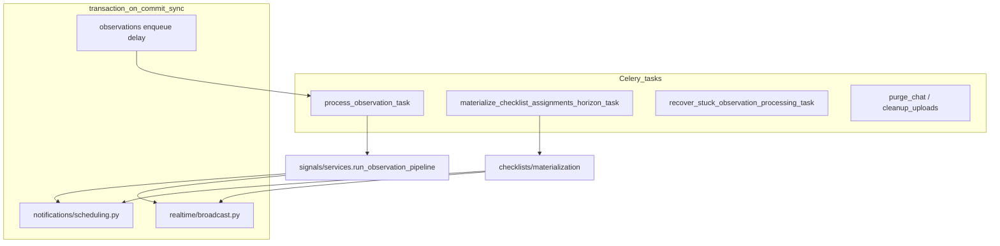

# Phase 2 — Celery / Async Audit

Status: audit report  
Date: 2026-06-26  
Mode: audit only — no source changes, no fix plan

## Sources

| Category | Files |
|----------|-------|
| Contract | [`AGENTS.md`](../AGENTS.md), [`apps/api/AGENTS.md`](../../apps/api/AGENTS.md) |
| Compass | [`phase_2_audit_backlog.md`](./phase_2_audit_backlog.md) §4 |
| Prior consolidations | [`phase_2_realtime_event_driven_consolidation.md`](./phase_2_realtime_event_driven_consolidation.md), [`phase_2_database_orm_consolidation.md`](./phase_2_database_orm_consolidation.md) |
| Domain authority | [`docs/product/domains/checklist_domain.md`](../product/domains/checklist_domain.md) §5.7 |
| Closure | [`feature_audit_closure.md`](./feature_audit_closure.md) |

**Branch context:** Feature audits closed (`TODO_NOW = 0`). API/OpenAPI, Database/ORM, and Realtime/Event-driven phase 2 audits consolidated. This audit traces Celery tasks, beat/scheduler configuration, async service boundaries, transaction/on_commit dispatch, retry/idempotence posture, and test coverage. No `FIXED`, `WONT_FIX_NOW`, or `DECISION_CLOSED` items reopened without new code evidence.

---

## Files inspected

| Layer | Paths |
|-------|-------|
| Celery app | `apps/api/config/celery.py`, `apps/api/houston/__init__.py` |
| Beat schedule | `apps/api/config/settings.py` (`CELERY_BEAT_SCHEDULE`, Celery time limits) |
| Task entrypoints | `checklists/tasks.py`, `signals/tasks.py`, `uploads/tasks.py`, `chat/tasks.py` |
| Async services | `checklists/materialization.py`, `signals/services.py` (`run_observation_pipeline`, recovery sweeps), `observations/services.py` (enqueue), `uploads/services.py`, `chat/purge.py` |
| Feed coupling | `actions/execution_feed.py` |
| Post-commit side effects | `notifications/scheduling.py`, `realtime/broadcast.py`, `chat/ws_notify.py`, `observations/media_services.py` |
| AI provider | `ai/observation_pipeline.py` |
| Infra | `docker-compose.yml`, `docker-compose.shared-dev.yml`, `Makefile`, `infra/scripts/assert-shared-dev-compose.sh` |

## Tests inspected

| Area | Files |
|------|-------|
| Observation pipeline / Celery retry | `signals/tests/test_observation_pipeline_recovery.py`, `ai/tests/test_observation_pipeline_provider.py` |
| Enqueue on commit | `observations/tests/test_submit_on_commit_enqueue.py`, `observations/tests/test_observation_api.py` |
| Checklist materialization / horizon | `checklists/tests/test_horizon_task.py`, `checklists/tests/test_materialization_services.py` |
| Realtime side effects | `realtime/tests/test_checklist_materialization_invalidation.py`, `realtime/tests/test_observation_pipeline_invalidation.py` |
| Retention beat tasks | `uploads/tests/test_cleanup.py`, `chat/tests/test_purge.py` |
| Notifications (on_commit, not Celery) | `notifications/tests/test_scheduling_failure_logging.py`, producer tests under `notifications/tests/` |
| Query baselines | `houston/testing/query_baseline.py`, `actions/tests/test_execution_feed_api.py` |

## Docs / rules inspected

- [`phase_2_audit_backlog.md`](./phase_2_audit_backlog.md) §4 (Celery / Async)
- [`.cursor/rules/10-backend-django-drf.mdc`](../../.cursor/rules/10-backend-django-drf.mdc), [`.cursor/rules/30-docker-orbstack.mdc`](../../.cursor/rules/30-docker-orbstack.mdc), [`.cursor/rules/80-security-data-integrity.mdc`](../../.cursor/rules/80-security-data-integrity.mdc)
- [`docs/engineering/shared_dev_database.md`](../engineering/shared_dev_database.md)
- [`docs/product/domains/checklist_domain.md`](../product/domains/checklist_domain.md) §5.7
- Prior audits: [`ai_pipeline_audit.md`](./ai_pipeline_audit.md), [`checklist_audit.md`](./checklist_audit.md)

## Assumptions / unknowns

- No live broker/worker integration run; all task tests use in-process `.run()` or mocked `.delay`.
- No production `celery-beat` deploy configuration evidenced in-repo (Compose/Makefile only).
- No benchmark of horizon task wall-clock at N≥50 active assignments across establishments.
- Divergent LLM output on observation pipeline retry not exercised in tests.
- Worker pool contention between beat jobs and `process_observation_task` not measured.

---

## 1. Summary

Houston's Celery surface is **small and disciplined for MVP**. Five tasks across four modules act as thin wrappers that pass IDs only and delegate to `services.py` or `materialization.py`, consistent with [`apps/api/AGENTS.md`](../../apps/api/AGENTS.md).

A critical architectural distinction: Houston runs **two async models**, not one. Celery handles batch/background work (observation AI pipeline, checklist horizon, stuck recovery, retention cleanup). In-app notifications and WebSocket invalidation are **post-commit synchronous consumers** via Django Channels — not Celery jobs. The D-04B outbox question applies to the latter path.

Residual async risk clusters in:

1. **Materialization timing ownership** — three paths (sync on assignment create, sync on every execution-feed GET, optional daily beat) with beat off by default in documented dev workflows.
2. **Observation pipeline retry semantics** — LLM re-called on retry without persisting prior output; divergent-output path untested (C-03/OR-02).
3. **Beat scalability and reliability** — global unsharded horizon, `max_retries=0` on all beat tasks, optional scheduler, no in-repo production evidence (CL-08).
4. **Test posture** — in-process `.run()` only; no broker integration or `CELERY_BEAT_SCHEDULE` wiring tests.
5. **Best-effort post-commit delivery** — notifications and WS invalidation are not durable (D-04B product-gated; cross-ref RT-E6).

| Priority | Count | Themes |
|----------|-------|--------|
| **P1** | 1 | Materialization async ownership / timing (CA-E1) |
| **P2** | 8 | LLM retry divergence (CA-E2); global horizon (CA-E3); scheduler dev/prod gap (CA-E4); beat no-retry (CA-E5); dual retry layers (CA-E6); per-assignment loops (CA-E7); post-commit durability (CA-E8); test gaps (CA-E9) |
| **P3** | 1 | Horizon metric overcount (CA-E10) |

---

## 2. Findings

### CA-E1 — Materialization timing split across sync read-path and optional beat

| Field | Detail |
|-------|--------|
| **ID** | CA-E1 |
| **Severity** | P1 |
| **Category** | scalability / ambiguity |
| **Backlog alias** | R3, CL-08, EF-02, EF-08, CL-04 |
| **Evidence** | `build_execution_feed_page` in `actions/execution_feed.py` unconditionally calls `ensure_visible_executions_materialized` before building the page; `checklists/materialization.py` implements three paths — eager on assignment create, read-path (`READ_PATH_MATERIALIZATION_HORIZON_DAYS = 3`, `READ_PATH_MATERIALIZATION_STALE_MINUTES = 30`, `visible_from` gate via `VISIBLE_FROM_OFFSET`), and beat horizon (`MATERIALIZATION_HORIZON_DAYS = 14`, daily 03:00 UTC, no `visible_from` gate); `config/settings.py` L168–169 states lazy read-path materialization is the "primary safety net"; beat requires optional `celery-beat` process |
| **Problem** | Async ownership of checklist execution materialization is ambiguous. Feed GET performs synchronous writes; Celery beat is an optional safety net not started by default dev bootstrap. Supervision freshness and `execution.created` WS timing depend on a user opening the feed or beat catching up. |
| **Risk** | **Now:** Acceptable at dev volume with lazy product default (EF-08/CL-04 DECISION_OPEN). **Later:** Supervision screens stay stale establishment-wide until materialization triggers; latency grows with assignment count; read→write amplification (DB-01, RT-E1). Multi-shift scenarios may show gap before `visible_from` even when beat is healthy. |
| **Suggested direction** | Cross-domain coordination (Celery + Realtime + ORM). Clarify product contract for pre-`visible_from` visibility; measure feed GET cost with N assignments; evaluate beat-only proactive materialization vs read-path decoupling before pilot scale — without reopening CL-01a early-exit. |
| **Test coverage** | Partial — `test_materialization_services.py`, `test_horizon_task.py`, `test_checklist_materialization_invalidation.py`. No multi-shift beat-only freshness test; no WS `execution.created` delivery before any feed GET. |
| **Size** | L |

---

### CA-E2 — Observation pipeline LLM retry re-invokes provider without persisting prior output

| Field | Detail |
|-------|--------|
| **ID** | CA-E2 |
| **Severity** | P1/P2 |
| **Category** | idempotence / retry safety |
| **Backlog alias** | C-03, OR-02 |
| **Evidence** | `run_observation_pipeline` in `signals/services.py` — `call_observation_pipeline` runs outside the state-transition transaction; on `ObservationPipelineUnavailableError` or `ObservationPipelineTimeoutError`, `_mark_processing_retry_or_failed` sets `RETRYING` then re-raises; `process_observation_task` in `signals/tasks.py` calls `self.retry()` only when `processing.status == RETRYING`; no intermediate LLM output persisted before `apply_pipeline_output`; SIG-03 partial unique constraint enforces per aggregation key integrity |
| **Problem** | Retry path re-calls the LLM provider. If a retry produces a different aggregation key than a prior successful-but-unapplied call would have, behavior is undefined at test level. Provider retry is inherently non-idempotent. |
| **Risk** | **Now:** Low at dev volume; same-output retry path tested. **Later:** Potential duplicate active signals if keys diverge across retries (SIG-03 helps per-key, not cross-key); `ObservationProcessing` outcome may not reflect intermediate candidate state. |
| **Suggested direction** | Define explicit retry policy for divergent LLM output (persist draft output, freeze aggregation decision, or accept re-call with documented bounds). Add test for divergent aggregation key on retry. |
| **Test coverage** | Partial — `test_provider_unavailable_then_retry_completes_without_duplicate_signals` and `test_process_observation_task_retries_after_provider_unavailable` use `_FlakyObservationPipelineProvider` returning **same** output on retry. `test_double_pipeline_on_processed_is_noop` covers terminal re-run only. **Divergent-output path absent.** |
| **Size** | M |

---

### CA-E3 — Global unsharded horizon beat processes all establishments sequentially

| Field | Detail |
|-------|--------|
| **ID** | CA-E3 |
| **Severity** | P2 |
| **Category** | scalability |
| **Backlog alias** | CL-08 |
| **Evidence** | `materialize_assignments_horizon` in `checklists/materialization.py` filters all active assignments globally (optional `establishment_id` filter unused by default beat kwargs); iterates assignments × occurrence dates sequentially; `materialize_checklist_assignments_horizon_task` in `checklists/tasks.py` has `max_retries=0`, soft/hard time limits 3300s/3600s; beat schedule passes `establishment_id: None` in `config/settings.py` |
| **Problem** | One establishment's assignment volume blocks all others in the same task. No per-establishment task fan-out or sharding. |
| **Risk** | **Now:** Sufficient for pilot mono-establishment workloads. **Later:** Celery hard timeout; delayed materialization for all tenants; amplifies CA-E1 pre-`visible_from` gap when read-path is not triggered. |
| **Suggested direction** | Measure horizon task duration at realistic assignment counts; consider per-establishment beat fan-out or chunked assignment batches before multi-tenant scale. |
| **Test coverage** | Partial — `test_horizon_task.py` uses single-establishment fixtures. No timeout, sharding, or multi-establishment isolation test. |
| **Size** | M |

---

### CA-E4 — Celery Beat is opt-in in dev; production scheduler not evidenced in-repo

| Field | Detail |
|-------|--------|
| **ID** | CA-E4 |
| **Severity** | P2 |
| **Category** | maintainability / ambiguity |
| **Backlog alias** | — (DevEx / infra) |
| **Evidence** | `make bootstrap-dev`, `make up-backend`, `make shared-dev-up` omit `celery-beat`; `make up-scheduler` and `make shared-dev-up-scheduler` required to start beat; `shared_dev_database.md` documents `make up-scheduler` trap (local `.env` vs shared-dev); `celery-beat` uses Compose profile `scheduler`; `ai_pipeline_audit.md` notes beat "assumed enabled in deployed environments; not verified"; no k8s/terraform/production beat config found in repo |
| **Problem** | Four scheduled jobs — checklist horizon, chat purge, upload cleanup, stuck observation recovery — silently absent unless beat is explicitly started. Production deployment of beat is not evidenced beyond Django settings definition. |
| **Risk** | **Now:** Shared-dev developers may run API+worker without beat against shared remote DB; stuck recovery and horizon maintenance depend on individual discipline. **Later:** Pilot/staging without beat loses scheduled hygiene; observation orphans rely solely on hourly recovery when beat is down. |
| **Suggested direction** | Document scheduler as required for non-dev environments; clarify shared-dev scheduler workflow; evidence production beat deployment in infra config when available. |
| **Test coverage** | None for beat process lifecycle, `CELERY_BEAT_SCHEDULE` wiring, or crontab correctness. |
| **Size** | S (docs/DevEx) to M (prod hardening) |

---

### CA-E5 — All beat-triggered tasks use max_retries=0

| Field | Detail |
|-------|--------|
| **ID** | CA-E5 |
| **Severity** | P2 |
| **Category** | retry safety |
| **Backlog alias** | CL-08 (related) |
| **Evidence** | `max_retries=0` on `materialize_checklist_assignments_horizon_task` (`checklists/tasks.py`), `recover_stuck_observation_processing_task` (`signals/tasks.py` L71–75), `purge_chat_messages_task` (`chat/tasks.py`), `cleanup_expired_uploads_task` (`uploads/tasks.py`); failures log and raise with no Celery-level retry |
| **Problem** | Transient Redis or DB blip during a scheduled run is lost until the next cron tick. |
| **Risk** | **Now:** Low with read-path materialization as checklist fallback. **Later:** Up to 24h gap for horizon materialization (daily beat); up to 1h for stuck observation recovery (hourly at :15); chat purge and upload cleanup similarly delayed. |
| **Suggested direction** | Evaluate limited Celery retry or dead-letter logging for beat tasks; at minimum ensure failure observability parity across all four beat tasks. |
| **Test coverage** | Partial — `test_cleanup_expired_uploads_task_failure_logs_safe_context` in uploads. Checklist and chat beat failure logging **untested**. |
| **Size** | S |

---

### CA-E6 — Observation pipeline has overlapping business and Celery retry layers

| Field | Detail |
|-------|--------|
| **ID** | CA-E6 |
| **Severity** | P2 |
| **Category** | ambiguity / retry safety |
| **Backlog alias** | C-03 (related) |
| **Evidence** | `_MAX_OBSERVATION_PIPELINE_ATTEMPTS = 3` in `signals/services.py`; `attempt_count` incremented at processing start inside `run_observation_pipeline`; `process_observation_task` has `max_retries=3`, `default_retry_delay=30`; Celery `self.retry()` gated on `processing.status == RETRYING` set by `_mark_processing_retry_or_failed`; stuck recovery via `_try_recover_stuck_processing` can also move `PROCESSING` → `RETRYING` |
| **Problem** | Two independent retry budgets (business `attempt_count` and Celery `max_retries`) interact non-obviously. Total attempts across provider failure, timeout, and stuck recovery are hard to reason about without reading multiple code paths. |
| **Risk** | **Now:** Partially tested happy paths. **Later:** Unexpected early `FAILED` or excess LLM calls; `ObservationPipelineTimeoutError` → `self.retry()` path **untested** at task level. |
| **Suggested direction** | Document combined retry semantics in observation domain docs; add timeout-retry and Celery exhaustion tests. |
| **Test coverage** | Partial — unavailable-provider retry and stuck recovery tested at service level; timeout task retry and combined budget exhaustion **absent**. |
| **Size** | M |

---

### CA-E7 — Per-assignment materialization loops without cross-assignment batching

| Field | Detail |
|-------|--------|
| **ID** | CA-E7 |
| **Severity** | P2 |
| **Category** | performance / scalability |
| **Backlog alias** | EF-02, DB-02 |
| **Evidence** | `materialize_assignments_horizon` in `checklists/materialization.py` iterates all active assignments × occurrence dates; `ensure_visible_executions_materialized` iterates visibility-scoped assignments per feed GET; stale path calls `_existing_occurrence_dates_for_assignment` twice — in `_assignment_read_path_materialization_is_fresh` (L365–368) and again in main loop (L411–414); work not bounded by feed `page_size` |
| **Problem** | O(visible assignments) SQL round-trips per feed GET and per beat run. No batch existence check across assignments. |
| **Risk** | **Now:** Low at dev assignment counts. **Later:** Latency amplification at scale; primary ORM cost driver (DB-01); stale assignments pay duplicate SELECT before any write (DB-02). |
| **Suggested direction** | Batch occurrence-date existence lookups across assignments; reuse freshness-check query result in materialization loop (DB-02 quick win); add N-assignment query-count regression test before meaningful EF-07 baselines. |
| **Test coverage** | Partial — query baselines in `query_baseline.py` cover empty and 3-action feeds only. No N-assignment materialization scaling test. |
| **Size** | M (batching); S (DB-02 dedupe) |

---

### CA-E8 — Post-commit notification/realtime delivery is synchronous and non-durable

| Field | Detail |
|-------|--------|
| **ID** | CA-E8 |
| **Severity** | P2 |
| **Category** | retry safety / structure |
| **Backlog alias** | D-04B, RT-E6 |
| **Evidence** | `notifications/scheduling.py` `_run_notification_after_commit` wraps deliver callbacks in `transaction.on_commit` with structured exception logging (NR-05 FIXED); `realtime/broadcast.py` `schedule_establishment_invalidation` and siblings use `transaction.on_commit` then synchronous Channels `group_send`; `get_channel_layer()` no-op when unset; no Celery retry task or outbox table; `realtime_domain.md` §3 excludes guaranteed delivery |
| **Problem** | Not a Celery queue gap — the async side-effect chain for notifications and WS invalidation ends in best-effort synchronous dispatch after commit. Celery audit scope includes this because materialization and pipeline flows schedule these consumers. |
| **Risk** | **Now:** Intentional MVP posture per D-04B default (log only). **Later:** Transient Redis blip causes permanent notification or WS invalidation gap for affected users; relevant if D-04B option B (outbox) approved for Lot2. |
| **Suggested direction** | Document and accept best-effort posture for MVP pilot. Outbox/retry is product-gated on D-04B — not an open engineering action without approval. |
| **Test coverage** | Partial — `test_scheduling_failure_logging.py`; strong producer and dedupe tests. No retry recovery path. |
| **Size** | L (if outbox approved); document-only now |

---

### CA-E9 — Celery test posture is in-process only; beat wiring and broker paths untested

| Field | Detail |
|-------|--------|
| **ID** | CA-E9 |
| **Severity** | P2 |
| **Category** | tests |
| **Backlog alias** | EF-07 (baseline timing related) |
| **Evidence** | All Celery task tests use `.run()` or mock `.delay`; no `CELERY_TASK_ALWAYS_EAGER` in settings or tests; no `@pytest.mark.celery`; `recover_observation_processing_batch()` (combined stuck + orphan sweep used by beat task) never called directly in tests — only sub-functions and task wrapper; `pyproject.toml` markers exclude Celery |
| **Problem** | Retry semantics, beat schedule correctness, serialization, and enqueue→worker handoff unvalidated beyond mocks. Production-only failure modes (worker crash mid-task, broker routing) undetected. |
| **Risk** | **Now:** Acceptable for MVP with strong service-layer tests. **Later:** Regressions in task wiring, beat crontab, or broker config merge undetected until deployment. |
| **Suggested direction** | Add focused tests for `CELERY_BEAT_SCHEDULE` task name resolution; timeout retry at task level; combined `recover_observation_processing_batch`; consider broker integration smoke before pilot hardening. |
| **Test coverage** | Gap — see evidence. Service behavior well covered; Celery infrastructure layer not. |
| **Size** | M |

---

### CA-E10 — Horizon task return value overcounts idempotent materializations

| Field | Detail |
|-------|--------|
| **ID** | CA-E10 |
| **Severity** | P3 |
| **Category** | maintainability |
| **Backlog alias** | — |
| **Evidence** | `materialize_assignments_horizon` returns sum of `len(materialized)` per assignment; `materialize_assignment_occurrences_in_horizon` appends results from `materialize_execution_from_assignment`, which returns existing row on idempotent hit; beat task logs and returns this aggregate count |
| **Problem** | Observability metric counts idempotent returns alongside real creates. DB state remains correct. |
| **Risk** | **Now:** None functionally. **Later:** Misleading ops dashboards and log-based alerting on horizon task throughput. |
| **Suggested direction** | Return create-count separate from idempotent-hit count, or document metric semantics. |
| **Test coverage** | Partial — `test_horizon_task_is_idempotent` asserts DB safety only, not return value accuracy. |
| **Size** | S |

---

## 3. Idempotence / retry risks

| Flow | Idempotence posture | Retry posture | Gap |
|------|---------------------|---------------|-----|
| Checklist materialization | Strong — check-then-create + `IntegrityError` race handling; WS notification and invalidation only on real create | Beat task: `max_retries=0` — no Celery retry | Return metric overcounts idempotent hits (CA-E10) |
| Observation pipeline | Status machine + `select_for_update`; `PROCESSED` re-run is noop; `SignalSourceObservation` get_or_create | Business `_MAX_OBSERVATION_PIPELINE_ATTEMPTS=3` + Celery `max_retries=3`; stuck recovery re-enqueues | Divergent LLM output on retry untested (CA-E2); dual layers complex (CA-E6) |
| Notifications | 5-minute `dedupe_key` window; concurrent create test | N/A — sync `on_commit`, not Celery | No durable retry (CA-E8); D-04B product gate |
| WS invalidation | Generic invalidation payloads — duplicate emit is safe for freshness | N/A — sync `on_commit` | Duplicate callbacks possible; low product impact |
| Upload cleanup | Idempotent double-run tested | Beat: `max_retries=0` | Failure log tested; beat retry absent |
| Chat purge | Service idempotent; task wrapper tested once | Beat: `max_retries=0` | Double-run task safety untested |
| Recovery sweep | `already_enqueued` set dedupes within batch | Hourly beat only (`max_retries=0`) | Combined `recover_observation_processing_batch` untested (CA-E9) |
| Observation enqueue | `on_commit` after `submit_observation`; rollback guard tested | Broker failure → QUEUED + beat recovery | Enqueue failure returns 201 with orphan QUEUED — documented, tested |

---

## 4. Scheduler / dev setup risks

- **Beat not in default stack** — `make up-backend` and `make shared-dev-up` start `api` + `celery` only. Horizon, chat purge, upload cleanup, and stuck observation recovery require `make up-scheduler` or `make shared-dev-up-scheduler`.
- **Shared-dev scheduler trap** — `make up-scheduler` uses local `.env` and would point beat at local Postgres after `shared-dev-up`. Documented in `shared_dev_database.md`; must use `shared-dev-up-scheduler`.
- **Volume permission workaround** — `up-scheduler` runs root `chown` on `celerybeat_data` before start. Fragile if developers bypass Makefile with raw `docker compose`.
- **No container healthchecks** — `celery` and `celery-beat` have no healthchecks. Silent process failure does not block Compose "up" success.
- **Shared-dev broker isolation** — Redis and Celery broker are local per machine. Beat on dev machine A enqueues to A's local Redis; scheduled writes reach shared remote DB only when that dev runs beat + worker.
- **Single worker, default concurrency** — One `celery` container; beat jobs and `process_observation_task` share the same worker pool with no concurrency tuning documented.
- **Beat time limits** — Soft 3300s / hard 3600s shared across beat tasks. Global horizon at scale may approach limits (CA-E3).
- **Production beat deployment** — Not evidenced in-repo beyond `CELERY_BEAT_SCHEDULE` in Django settings and Compose profile. `ai_pipeline_audit.md` flags as unverified.

---

## 5. Business-logic placement risks

| Area | Placement | Assessment |
|------|-----------|------------|
| Celery tasks | Thin delegates in `*/tasks.py` → services/materialization | **Safe** — complies with `apps/api/AGENTS.md`; no business workflows in tasks |
| Observation pipeline | `observations/services.py` intake + enqueue; `signals/services.py` orchestration; `signals/tasks.py` entry; `ai/observation_pipeline.py` provider | **Intentional** cross-app coupling per AGENTS.md; task must not absorb orchestration |
| Checklist materialization | `checklists/materialization.py` owns create logic; triggered from `checklists/services.py`, `execution_feed.py`, beat task | **Correct** service ownership; read-path trigger in `execution_feed.py` blurs async boundary (CA-E1) |
| Notifications | `notifications/scheduling.py` hub reloads subjects by ID in deliver callbacks | **Correct** missing-record handling; hub fan-in is maintainability risk (RT-E2), not misplaced business logic |
| Visibility scope in materialization | `_assignment_materialization_visibility_q` in `materialization.py` | **Acceptable** but parallels feed visibility rules — drift risk if scope rules diverge |
| Post-commit WS | `realtime/broadcast.py` thin hub; domain services call via local `_schedule_*_invalidation` wrappers | **Correct** layering; duplication risk RT-E5, not Celery scope |

No evidence of business rules duplicated inside Celery task bodies. Risk is **trigger placement** (feed GET calling materialization synchronously) rather than logic inside tasks.

---

## 6. Safe areas

Evidence-backed areas that do not need immediate Celery/async change:

| Area | Evidence |
|------|----------|
| **IDs-only Celery args** | All five tasks accept string IDs or optional filters — no ORM objects serialized |
| **DB reload in workers** | `run_observation_pipeline` uses `select_for_update` + `select_related`; notification `schedule_*` deliver callbacks use `_load_*` by ID |
| **Missing-record handling** | Pipeline returns silently when `processing is None`; notification deliver returns when subject deleted; recovery batch skips missing rows |
| **on_commit observation enqueue** | `submit_observation` enqueues via `transaction.on_commit`; rollback and broker-failure paths tested |
| **Checklist materialization idempotence** | Check-then-create + `IntegrityError` race; concurrent materialization test; WS/notification skipped on idempotent return |
| **Notification dedupe** | 5-minute `dedupe_key` window; concurrent create test proves single notification |
| **Thin task wrappers** | All tasks log → delegate → log/raise; business logic in services |
| **Stuck/orphan recovery** | Beat sweep + `already_enqueued` dedupe; sub-batch tests cover stuck and orphan paths separately |
| **Upload cleanup idempotence** | Double-run safe; task failure logging tested |
| **SIG-03 aggregation integrity** | Partial unique constraint on active aggregation key — FIXED, not reopened |
| **NR-05 notification failure observability** | Structured `logger.exception` on post-commit deliver failure — FIXED |
| **Separation of Celery vs Channels** | Notifications and WS are not queued Celery jobs — clear architectural boundary |

---

## 7. Needs more evidence

| Topic | Why deferred |
|-------|--------------|
| Horizon task wall-clock at N≥50 active assignments across establishments | No automated scaling or timeout test; dev volume low |
| Divergent LLM output on observation pipeline retry | No fuzz or production telemetry; only same-output retry tested |
| Production `celery-beat` + worker deployment topology | No infra-as-code in repo |
| Worker pool contention: `process_observation_task` vs daily horizon on same worker | No profiling under concurrent load |
| Multi-shift `visible_from` gap with beat-only path (no feed GET) | No integration test proving WS `execution.created` before any user opens feed |
| End-to-end: Redis broker → worker → DB → Channels | Materialization tests patch `notify_*` in-process |
| `recover_observation_processing_batch` combined stuck + orphan overlap | Sub-batches tested; combined wrapper untested |
| AI pipeline input size / token cost per retry (AI F6/R7) | Relevant to async cost; DB-03 taxonomy prefetch is ORM-owned — measure at pilot volume |
| Chat purge double-run task safety | Service tested; beat task idempotence on second run not asserted |

---

## 8. Top priorities

### P1 — must address before large-scale evolution

1. **CA-E1** — Materialization timing ownership. Coordinate with RT-E1 (realtime freshness), DB-01 (ORM read-path cost), and EF-08/CL-04 (lazy product default). Blocks confidence in supervision freshness at scale.

### P2 — important but not blocking pilot

2. **CA-E2** — Observation pipeline LLM retry divergence policy and test (C-03/OR-02).
3. **CA-E3 + CA-E5** — Horizon scalability and beat retry posture (CL-08).
4. **CA-E4** — Scheduler dev/prod reliability documentation and deployment evidence.
5. **CA-E9** — Test gaps: beat wiring, timeout retry, combined recovery batch.
6. **CA-E7** — Per-assignment batching (EF-02/DB-02); coordinate with ORM audit.
7. **CA-E6** — Clarify dual retry semantics for observation pipeline.
8. **CA-E8** — Accept D-04B default (log only); gate outbox on product approval.

### P3 — polish / hygiene

- **CA-E10** — Horizon return metric semantics (S).

### Quick wins

- **CA-E4** — Document `up-scheduler` vs `shared-dev-up-scheduler` trap prominently (S).
- **CA-E5** — Failure-log parity for checklist/chat beat tasks (S).
- **CA-E10** — Document or fix horizon count metric (S).

### Structural — plan later

- **CA-E1 decouple** — Move materialization off read path (L; coordinates Realtime + ORM).
- **CA-E3 sharding** — Per-establishment horizon fan-out (M).
- **CA-E8 outbox** — Only if D-04B option B approved (L).

### Not worth fixing now

- **CA-E10** alone at dev scale (observability only).
- AI prompt/token size per retry at dev volume (AI F6/R7).
- Full broker/worker integration test suite until pre-pilot hardening.
- Celery retry on beat tasks at current pilot scale (read-path is checklist fallback).

### Cross-audit linkage

| Finding | Related consolidation / backlog IDs |
|---------|-------------------------------------|
| CA-E1 | RT-E1, DB-01, DB-02, EF-08, CL-04 |
| CA-E2 | C-03, OR-02, DB-05/SIG-04 |
| CA-E3 | CL-08, RT-E1 |
| CA-E7 | EF-02, DB-02 |
| CA-E8 | RT-E6, D-04B |
| CA-E9 | EF-07 |

---

## 9. Changed / Validated / Risks

**Changed:** New audit report `docs/audits/phase_2_celery_async_audit.md` only.

**Validated:** Static code, test, and doc review against backlog §4 and prior consolidations (`phase_2_realtime_event_driven_consolidation.md`, `phase_2_database_orm_consolidation.md`). Closed registry items SIG-03, NR-05, ACT-04, CL-01a not reopened. Five Celery tasks inventoried; two async models (Celery vs on_commit Channels) confirmed.

**Risks / not verified:** `make verify` not run; no live beat/worker stack exercised; no production scheduler config reviewed; no load benchmark of horizon task or feed GET materialization at high assignment counts; divergent LLM retry behavior not tested; mobile/field impact of beat-off dev workflows not measured.
