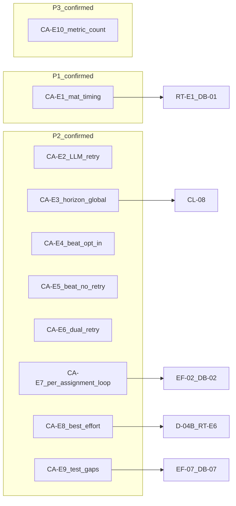
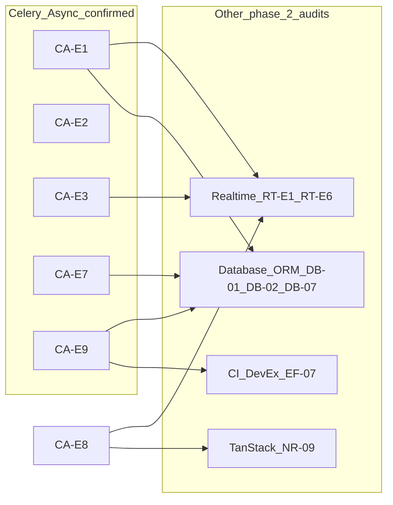

# Phase 2 — Celery / Async Consolidation

Status: consolidation report  
Date: 2026-06-26  
Mode: consolidation only — no source changes

## Sources

| Category | Files |
|----------|-------|
| Audit input | [`phase_2_celery_async_audit.md`](./phase_2_celery_async_audit.md) (CA-E1–CA-E10) |
| Backlog | [`phase_2_audit_backlog.md`](./phase_2_audit_backlog.md) §4 |
| Closure | [`feature_audit_closure.md`](./feature_audit_closure.md) |
| Decisions | [`feature_audit_decisions.md`](./feature_audit_decisions.md) |
| Prior consolidations | [`phase_2_realtime_event_driven_consolidation.md`](./phase_2_realtime_event_driven_consolidation.md), [`phase_2_database_orm_consolidation.md`](./phase_2_database_orm_consolidation.md), [`onboarding_observation_ai_consolidation.md`](./onboarding_observation_ai_consolidation.md), [`execution_feed_consolidation.md`](./execution_feed_consolidation.md), [`checklist_consolidation.md`](./checklist_consolidation.md) |
| Contract | [`AGENTS.md`](../../AGENTS.md), [`apps/api/AGENTS.md`](../../apps/api/AGENTS.md), [`apps/web/AGENTS.md`](../../apps/web/AGENTS.md) |
| Domain authority | [`docs/product/domains/checklist_domain.md`](../product/domains/checklist_domain.md) §5.7, [`docs/engineering/shared_dev_database.md`](../engineering/shared_dev_database.md) |

**Branch context:** Feature audits closed (`TODO_NOW = 0`). API/OpenAPI, Database/ORM, and Realtime/Event-driven phase 2 audits consolidated. This consolidation challenges each finding from the phase 2 Celery / Async audit against backlog §4, closure registry, decision pack, prior consolidations, and spot-check code evidence. No `FIXED`, `WONT_FIX_NOW`, or `DECISION_CLOSED` items reopened without new direct code evidence.

---

## 1. Executive summary

Houston's Celery surface is **small and disciplined for MVP**. Five tasks across four modules act as thin wrappers that pass IDs only and delegate to `services.py` or `materialization.py`, consistent with [`apps/api/AGENTS.md`](../../apps/api/AGENTS.md).

A critical architectural distinction: Houston runs **two async models**, not one. Celery handles batch/background work (observation AI pipeline, checklist horizon, stuck recovery, retention cleanup). In-app notifications and WebSocket invalidation are **post-commit synchronous consumers** via Django Channels — not Celery jobs. The D-04B outbox question applies to the latter path.

Residual async risk clusters in:

1. **Materialization timing ownership** — three paths (sync on assignment create, sync on every execution-feed GET, optional daily beat) with beat off by default in documented dev workflows (CA-E1)
2. **Observation pipeline retry semantics** — LLM re-called on retry without persisting prior output; divergent-output path untested (CA-E2 / C-03)
3. **Beat scalability and reliability** — global unsharded horizon, optional scheduler, no in-repo production evidence (CA-E3, CA-E4); beat `max_retries=0` and failure-log parity (CA-E5 — Celery retry deferrable at pilot scale; observability hygiene remains P2)
4. **Test posture** — in-process `.run()` only; no broker integration or `CELERY_BEAT_SCHEDULE` wiring tests (CA-E9)
5. **Best-effort post-commit delivery** — notifications and WS invalidation are not durable (CA-E8 — outbox half product-gated on D-04B)

**No P0 Celery integrity hole found.** Task boundaries, ID-only args, DB reload in workers, missing-record handling, and checklist materialization idempotence are evidence-backed.

| Priority | Count | Themes |
|----------|-------|--------|
| **P1** | 1 | Materialization async ownership / timing (CA-E1) |
| **P2** | 8 | LLM retry divergence (CA-E2); global horizon (CA-E3); scheduler dev/prod gap (CA-E4); beat no-retry (CA-E5); dual retry layers (CA-E6); per-assignment loops (CA-E7); post-commit durability posture (CA-E8); test gaps (CA-E9) |
| **P3** | 1 | Horizon metric overcount (CA-E10) |

**Consolidation verdict:** 10 audit findings reviewed → **10 evidence-backed confirmations**, of which **8 are engineering-owned / cross-audit candidates to plan later** (CA-E1–CA-E7, CA-E9 — not immediate fix tickets), **1 carries a product-gated slice** (CA-E8 outbox/retry — D-04B), **1 ignore at dev scale for action** (CA-E10), **0 false positives**, **9/10 duplicate merges** to backlog §4 or prior phase 2 consolidations, **3 NEEDS_MORE_EVIDENCE** topics from audit §4 scheduler bullets (healthchecks, worker contention, horizon wall-clock at scale).

*Note:* CA-E8 is **confirmed as an evidence-backed risk posture** (best-effort delivery today). The **outbox/retry slice is not an open engineering action** unless product approves D-04B option B — default MVP remains log-only (NR-05 observability already FIXED).

*Severity adjustment vs audit:* **CA-E2** consolidated from P1/P2 → **P2** — real policy gap with divergent LLM path untested, but low incidence at dev volume and SIG-03 constrains worst-case duplicate active signals per aggregation key.

---

## 2. Findings reviewed

All 10 findings from [`phase_2_celery_async_audit.md`](./phase_2_celery_async_audit.md) §2, cross-checked against [`phase_2_audit_backlog.md`](./phase_2_audit_backlog.md) §4, [`feature_audit_closure.md`](./feature_audit_closure.md), [`feature_audit_decisions.md`](./feature_audit_decisions.md), prior consolidations, and spot-check code evidence.

| ID | Audit sev | Reclassification | Backlog alias | Consolidation notes |
|----|-----------|------------------|---------------|---------------------|
| **CA-E1** | P1 | **CONFIRMED** + **DUPLICATE** | R3, CL-08, EF-02, EF-08, CL-04, RT-E1, DB-01 | Code-verified: [`execution_feed.py`](../../apps/api/houston/actions/execution_feed.py) L213 unconditionally calls `ensure_visible_executions_materialized`; [`materialization.py`](../../apps/api/houston/checklists/materialization.py) implements eager-on-create, read-path (3-day horizon, 30-min stale TTL, `visible_from` gate), and beat horizon (14-day, daily 03:00 UTC, no `visible_from` gate). Same cross-domain theme as RT-E1/DB-01; **primary co-owners Realtime + Celery**. EF-08/CL-04 lazy **DECISION_OPEN** — document cost, do not re-litigate. CL-01a/EF-01a **WONT_FIX_NOW** not reopened. |
| **CA-E2** | P1/P2 | **CONFIRMED** + **DUPLICATE** | C-03, OR-02 | Code-verified: `run_observation_pipeline` calls LLM outside state-transition transaction; `_mark_processing_retry_or_failed` sets `RETRYING` then re-raises; `process_observation_task` retries only when `status == RETRYING`. Same-output retry tested; divergent aggregation key **absent**. **Severity consolidated to P2.** SIG-03 **FIXED** — not reopened. |
| **CA-E3** | P2 | **CONFIRMED** + **DUPLICATE** | CL-08 | Code-verified: `materialize_assignments_horizon` filters all active assignments globally; beat passes `establishment_id: None` in [`settings.py`](../../apps/api/config/settings.py) L177; sequential assignment × occurrence loop; soft/hard limits 3300s/3600s. |
| **CA-E4** | P2 | **CONFIRMED** | — (DevEx; absorbs audit §4 scheduler risks) | Code-verified: `make bootstrap-dev`, `make up-backend`, `make shared-dev-up` omit `celery-beat`; `make up-scheduler` / `make shared-dev-up-scheduler` required; no k8s/terraform beat config in repo. Shared-dev trap documented in `shared_dev_database.md`. Real dev/pilot gap — not false positive. |
| **CA-E5** | P2 | **CONFIRMED** + **DUPLICATE** partial | CL-08 sub-finding | Code-verified: `max_retries=0` on all four beat tasks in `checklists/tasks.py`, `signals/tasks.py` L71–75, `chat/tasks.py`, `uploads/tasks.py`. Uploads failure logging tested; checklist/chat beat failure logging **untested**. **Split:** Celery retry on beat → **IGNORE_NOW** at pilot scale (read-path fallback); failure-log parity / observability → **P2 hygiene** to plan. |
| **CA-E6** | P2 | **CONFIRMED** + **DUPLICATE** partial | C-03 related | Code-verified: `_MAX_OBSERVATION_PIPELINE_ATTEMPTS = 3` in [`signals/services.py`](../../apps/api/houston/signals/services.py); Celery `max_retries=3` on `process_observation_task`; stuck recovery can also move `PROCESSING` → `RETRYING`. Timeout → `self.retry()` path **untested** at task level. |
| **CA-E7** | P2 | **CONFIRMED** + **DUPLICATE** | EF-02, DB-02 | Code-verified: per-assignment loops in `ensure_visible_executions_materialized` L372–428 and `materialize_assignments_horizon` L273–290; duplicate `_existing_occurrence_dates_for_assignment` at L365–368 and L411–414. Work not bounded by feed `page_size`. |
| **CA-E8** | P2 | **CONFIRMED** (split) + **DUPLICATE** | D-04B, RT-E6 | Logging half: NR-05 **FIXED**. Outbox/retry half: **PRODUCT_DECISION** (D-04B **DECISION_OPEN**); default MVP log-only per decision pack. `notifications/scheduling.py` and `realtime/broadcast.py` use sync `on_commit` — not a Celery queue gap but included because materialization and pipeline flows schedule these consumers. |
| **CA-E9** | P2 | **CONFIRMED** + **DUPLICATE** | EF-07 | Code-verified: all Celery task tests use `.run()` or mock `.delay`; `recover_observation_processing_batch()` only called from beat task wrapper — never directly in tests; no `CELERY_BEAT_SCHEDULE` wiring tests. Coordinate with DB-07. |
| **CA-E10** | P3 | **CONFIRMED** + **IGNORE_NOW** for action | — | Code-verified: `materialize_assignments_horizon` sums `len(materialized)` per assignment; `materialize_execution_from_assignment` returns existing row on idempotent hit L169–170. DB state correct; metric misleading. |

**Audit §4 scheduler bullets not promoted to separate CA-E IDs:**

| Topic | Reclassification | Notes |
|-------|------------------|-------|
| Container healthchecks for `celery` / `celery-beat` | **NEEDS_MORE_EVIDENCE** | Absent in Compose; defer to CI/DevEx or pilot ops |
| Worker pool contention (beat vs `process_observation_task`) | **NEEDS_MORE_EVIDENCE** | Single worker, default concurrency; not profiled |
| Horizon wall-clock at N≥50 assignments | **NEEDS_MORE_EVIDENCE** | No automated scaling or timeout test |

**Backlog §4 items not in audit CA-E IDs:** **AI F6/R7** — valid DEFER_PHASE_2 theme; primary ORM evidence in DB-03 (taxonomy prefetch bypass on pipeline input build). Cross-ref only — not a new Celery finding.

**Backlog §4 re-validation:** All 5 deferred Celery / Async themes (C-03, CL-08, EF-02, AI F6/R7, EF-07) remain valid — confirmed with code evidence where audited; AI F6/R7 deferred to pilot volume measurement.

---

## 3. Confirmed findings

### CA-E1 — Materialization timing split across sync read-path and optional beat (R3 / RT-E1 / DB-01 / EF-08)

| Field | Detail |
|-------|--------|
| **Severity** | P1 |
| **Evidence** | `build_execution_feed_page` in [`actions/execution_feed.py`](../../apps/api/houston/actions/execution_feed.py) L213 unconditionally calls `ensure_visible_executions_materialized`; [`materialization.py`](../../apps/api/houston/checklists/materialization.py) — three paths with different horizons and `visible_from` gates; [`settings.py`](../../apps/api/config/settings.py) L168–169 states read-path is "primary safety net"; beat requires optional `celery-beat` process via Compose profile `scheduler` |
| **Why confirmed** | Async ownership of checklist execution materialization is ambiguous. Feed GET performs synchronous writes; Celery beat is an optional safety net not started by default dev bootstrap. Supervision freshness and `execution.created` WS timing depend on a user opening the feed or beat catching up. Not theoretical — unconditional on every feed GET. |
| **Risk** | Acceptable at dev volume with lazy product default (EF-08/CL-04 DECISION_OPEN). At scale: supervision screens stay stale establishment-wide until materialization triggers; latency grows with assignment count; read→write amplification (DB-01, RT-E1). Multi-shift scenarios may show gap before `visible_from` even when beat is healthy. |
| **Suggested direction** | Cross-domain coordination (Celery + Realtime + ORM): clarify product contract for pre-`visible_from` visibility; measure feed GET cost with N assignments; evaluate beat-only proactive materialization vs read-path decoupling before pilot scale — without reopening CL-01a early-exit |
| **Dependencies** | Realtime RT-E1; ORM DB-01, DB-02; EF-08/CL-04 product decision; CL-08 horizon reliability |
| **Size** | L |

---

### CA-E2 — Observation pipeline LLM retry re-invokes provider without persisting prior output (C-03 / OR-02)

| Field | Detail |
|-------|--------|
| **Severity** | P2 |
| **Evidence** | `run_observation_pipeline` in [`signals/services.py`](../../apps/api/houston/signals/services.py) — `call_observation_pipeline` runs outside the state-transition transaction; on `ObservationPipelineUnavailableError` or `ObservationPipelineTimeoutError`, `_mark_processing_retry_or_failed` sets `RETRYING` then re-raises; `process_observation_task` in [`signals/tasks.py`](../../apps/api/houston/signals/tasks.py) calls `self.retry()` only when `processing.status == RETRYING`; no intermediate LLM output persisted before `apply_pipeline_output` |
| **Why confirmed** | Retry path re-calls the LLM provider. Same-output retry tested in `test_observation_pipeline_recovery.py`; divergent aggregation key on retry **absent** from test suite. Provider retry is inherently non-idempotent at the LLM layer. |
| **Risk** | Low at dev volume. At scale: potential duplicate active signals if keys diverge across retries (SIG-03 helps per-key, not cross-key); `ObservationProcessing` outcome may not reflect intermediate candidate state. |
| **Suggested direction** | Define explicit retry policy for divergent LLM output (persist draft output, freeze aggregation decision, or accept re-call with documented bounds); add test for divergent aggregation key on retry; document bounds of SIG-03 protection |
| **Dependencies** | ORM DB-05/SIG-04 (deferred index on aggregation lookup); observation domain docs |
| **Size** | M |

---

### CA-E3 — Global unsharded horizon beat processes all establishments sequentially (CL-08)

| Field | Detail |
|-------|--------|
| **Severity** | P2 |
| **Evidence** | `materialize_assignments_horizon` in [`materialization.py`](../../apps/api/houston/checklists/materialization.py) L273–290 filters all active assignments globally (optional `establishment_id` filter unused by default beat kwargs); iterates assignments × occurrence dates sequentially; `materialize_checklist_assignments_horizon_task` has soft/hard time limits 3300s/3600s |
| **Why confirmed** | One establishment's assignment volume blocks all others in the same task. No per-establishment task fan-out or sharding. |
| **Risk** | Sufficient for pilot mono-establishment workloads. At multi-tenant scale: Celery hard timeout; delayed materialization for all tenants; amplifies CA-E1 pre-`visible_from` gap when read-path is not triggered. |
| **Suggested direction** | Measure horizon task duration at realistic assignment counts; consider per-establishment beat fan-out or chunked assignment batches before multi-tenant scale |
| **Dependencies** | CA-E1 freshness timing; Realtime RT-E1; CA-E5 observability parity |
| **Size** | M |

---

### CA-E4 — Celery Beat is opt-in in dev; production scheduler not evidenced in-repo

| Field | Detail |
|-------|--------|
| **Severity** | P2 |
| **Evidence** | [`Makefile`](../../Makefile) — `bootstrap-dev`, `up-backend`, `shared-dev-up` omit beat; `up-scheduler` / `shared-dev-up-scheduler` start `celery-beat`; [`shared_dev_database.md`](../engineering/shared_dev_database.md) documents `up-scheduler` trap (local `.env` vs shared-dev); no k8s/terraform/production beat config found in repo; `ai_pipeline_audit.md` notes beat "assumed enabled in deployed environments; not verified" |
| **Why confirmed** | Four scheduled jobs — checklist horizon, chat purge, upload cleanup, stuck observation recovery — silently absent unless beat is explicitly started. Production deployment of beat is not evidenced beyond Django settings definition. |
| **Risk** | Shared-dev developers may run API+worker without beat against shared remote DB; stuck recovery and horizon maintenance depend on individual discipline. Pilot/staging without beat loses scheduled hygiene. |
| **Suggested direction** | Document scheduler as required for non-dev environments; clarify shared-dev scheduler workflow prominently (quick win S — content exists in `shared_dev_database.md`); evidence production beat deployment in infra config when available |
| **Dependencies** | CI/DevEx; pilot deployment checklist |
| **Size** | S (docs/DevEx) to M (prod hardening) |

---

### CA-E5 — All beat-triggered tasks use max_retries=0 (CL-08 sub-finding)

| Field | Detail |
|-------|--------|
| **Severity** | P2 (observability hygiene); Celery retry slice deferrable at pilot scale |
| **Evidence** | `max_retries=0` on `materialize_checklist_assignments_horizon_task`, `recover_stuck_observation_processing_task`, `purge_chat_messages_task`, `cleanup_expired_uploads_task`; failures log and raise with no Celery-level retry |
| **Why confirmed** | Two distinct slices: (1) **retry posture** — transient Redis or DB blip during a scheduled run is lost until the next cron tick; acceptable at pilot scale with read-path materialization as checklist fallback. (2) **observability posture** — uploads has failure logging test; checklist and chat beat failure logging **untested**; parity gap is real today regardless of retry policy. |
| **Risk** | **Retry:** low at pilot scale; at multi-tenant scale up to 24h horizon gap (daily beat) or 1h stuck-recovery gap (hourly at :15). **Observability:** silent or uneven beat failure visibility until next cron or manual investigation. |
| **Suggested direction** | **Defer Celery retry evaluation** at pilot scale (read-path is checklist fallback). **P2 hygiene to plan:** ensure failure-log parity across all four beat tasks — mirror uploads' tested pattern for checklist and chat beat wrappers. |
| **Dependencies** | CA-E3 horizon reliability; CA-E4 beat process running |
| **Size** | S (observability parity); M (retry policy, if revisited pre-scale) |

---

### CA-E6 — Observation pipeline has overlapping business and Celery retry layers (C-03 related)

| Field | Detail |
|-------|--------|
| **Severity** | P2 |
| **Evidence** | `_MAX_OBSERVATION_PIPELINE_ATTEMPTS = 3` in [`signals/services.py`](../../apps/api/houston/signals/services.py); `attempt_count` incremented at processing start; `process_observation_task` has `max_retries=3`, `default_retry_delay=30`; Celery `self.retry()` gated on `RETRYING` from `_mark_processing_retry_or_failed`; stuck recovery via `_try_recover_stuck_processing` can also move `PROCESSING` → `RETRYING` |
| **Why confirmed** | Two independent retry budgets interact non-obviously. Total attempts across provider failure, timeout, and stuck recovery are hard to reason about without reading multiple code paths. Timeout → `self.retry()` **untested** at task level. |
| **Risk** | Partially tested happy paths. Unexpected early `FAILED` or excess LLM calls possible under edge combinations of stuck recovery + provider retry + Celery exhaustion. |
| **Suggested direction** | Document combined retry semantics in observation domain docs; add timeout-retry and Celery exhaustion tests |
| **Dependencies** | CA-E2 retry policy; CA-E9 test gaps |
| **Size** | M |

---

### CA-E7 — Per-assignment materialization loops without cross-assignment batching (EF-02 / DB-02)

| Field | Detail |
|-------|--------|
| **Severity** | P2 |
| **Evidence** | `materialize_assignments_horizon` iterates all active assignments × occurrence dates; `ensure_visible_executions_materialized` iterates visibility-scoped assignments per feed GET; stale path calls `_existing_occurrence_dates_for_assignment` twice — L365–368 and L411–414; work not bounded by feed `page_size` |
| **Why confirmed** | O(visible assignments) SQL round-trips per feed GET and per beat run. No batch existence check across assignments. Duplicate SELECT on stale path confirmed (DB-02). |
| **Risk** | Low at dev assignment counts. At scale: latency amplification; primary ORM cost driver (DB-01); stale assignments pay duplicate SELECT before any write. |
| **Suggested direction** | Batch occurrence-date existence lookups across assignments; reuse freshness-check query result in materialization loop (DB-02 quick win S); add N-assignment query-count regression test before meaningful EF-07 baselines |
| **Dependencies** | CA-E1 materialization strategy; ORM DB-01, DB-02, DB-07 |
| **Size** | M (batching); S (DB-02 dedupe) |

---

### CA-E8 — Post-commit notification/realtime delivery is synchronous and non-durable (D-04B / RT-E6)

| Field | Detail |
|-------|--------|
| **Severity** | P2 (posture confirmed; outbox slice product-gated) |
| **Evidence** | [`notifications/scheduling.py`](../../apps/api/houston/notifications/scheduling.py) `_run_notification_after_commit` wraps deliver callbacks in `transaction.on_commit` with structured exception logging (NR-05 FIXED); [`realtime/broadcast.py`](../../apps/api/houston/realtime/broadcast.py) `schedule_establishment_invalidation` and siblings use `transaction.on_commit` then synchronous Channels `group_send`; `get_channel_layer()` no-op when unset; no Celery retry task or outbox table |
| **Why confirmed** | Not a Celery queue gap — the async side-effect chain for notifications and WS invalidation ends in best-effort synchronous dispatch after commit. Materialization and pipeline flows schedule these consumers. Intentional MVP posture per D-04B default. |
| **Risk** | Transient Redis blip causes permanent notification or WS invalidation gap for affected users — relevant if D-04B option B (outbox) approved for Lot2. At MVP: logged, not retried. |
| **Suggested direction** | **Accept best-effort posture for MVP pilot** (D-04B default log-only). Outbox/retry is product-gated — not an open engineering action without approval. Document boundary: Celery owns batch work; Channels owns post-commit fan-out. |
| **Dependencies** | Realtime RT-E6; TanStack Query / Cache NR-09 if outbox approved |
| **Size** | L (if outbox approved); document-only now |

---

### CA-E9 — Celery test posture is in-process only; beat wiring and broker paths untested (EF-07)

| Field | Detail |
|-------|--------|
| **Severity** | P2 |
| **Evidence** | All Celery task tests use `.run()` or mock `.delay`; no `CELERY_TASK_ALWAYS_EAGER` in settings or tests; `recover_observation_processing_batch()` never called directly in tests — only sub-functions and task wrapper; no `CELERY_BEAT_SCHEDULE` task name resolution tests; timeout retry at task level absent |
| **Why confirmed** | Retry semantics, beat schedule correctness, serialization, and enqueue→worker handoff unvalidated beyond mocks. Service behavior well covered; Celery infrastructure layer not. |
| **Risk** | Acceptable for MVP with strong service-layer tests. Regressions in task wiring, beat crontab, or broker config merge undetected until deployment. |
| **Suggested direction** | Add focused tests for `CELERY_BEAT_SCHEDULE` task name resolution; timeout retry at task level; combined `recover_observation_processing_batch`; consider broker integration smoke before pilot hardening |
| **Dependencies** | ORM DB-07/EF-07 baselines (establish after materialization strategy to avoid false positives); CI/DevEx |
| **Size** | M |

---

### CA-E10 — Horizon task return value overcounts idempotent materializations

| Field | Detail |
|-------|--------|
| **Severity** | P3 |
| **Evidence** | `materialize_assignments_horizon` returns sum of `len(materialized)` per assignment; `materialize_execution_from_assignment` returns existing row on idempotent hit L169–170; beat task logs and returns this aggregate count |
| **Why confirmed** | Observability metric counts idempotent returns alongside real creates. DB state remains correct. `test_horizon_task_is_idempotent` asserts DB safety only, not return value accuracy. |
| **Risk** | None functionally at dev scale. Misleading ops dashboards and log-based alerting on horizon task throughput at scale. |
| **Suggested direction** | Return create-count separate from idempotent-hit count, or document metric semantics |
| **Dependencies** | None blocking |
| **Size** | S |

---

## 4. Reclassified / duplicate / false-positive findings

### False positives

None. All 10 audit findings are evidence-backed.

### Duplicate merges (canonical ownership)

| Celery finding | Canonical alias / prior consolidation | Primary owner |
|----------------|-------------------------------------|---------------|
| CA-E1 | RT-E1, DB-01, R3, EF-01, CL-01 | Realtime + Celery (structural) |
| CA-E2 | C-03, OR-02 | Celery / Async |
| CA-E3 | CL-08 | Celery / Async |
| CA-E5 | CL-08 (retry slice) | Celery / Async |
| CA-E6 | C-03 (retry semantics slice) | Celery / Async |
| CA-E7 | EF-02, DB-02 | Celery + ORM (batching) |
| CA-E8 | RT-E6, D-04B | Realtime (delivery posture) |
| CA-E9 | EF-07, DB-07 | CI/DevEx + Celery |

### Product decisions (not open engineering without approval)

| ID | Decision | Default MVP | Engineering action |
|----|----------|-------------|-------------------|
| CA-E8 outbox/retry slice | D-04B **DECISION_OPEN** | Log only (NR-05 FIXED) | None until product approves option B |
| CA-E1 lazy pre-`visible_from` timing | EF-08/CL-04 **DECISION_OPEN** | Accept lazy pilot | Document cost; do not re-litigate |

### Deferred / needs more evidence

| Topic | Why deferred |
|-------|--------------|
| Horizon task wall-clock at N≥50 assignments | No automated scaling or timeout test |
| Divergent LLM output on retry | No fuzz or production telemetry |
| Production `celery-beat` + worker topology | No infra-as-code in repo |
| Worker pool contention | No profiling under concurrent load |
| Container healthchecks for celery/beat | Not in Compose; CI/DevEx scope |
| AI F6/R7 prompt/token cost per retry | Pilot volume measurement; ORM DB-03 adjacent |

### Ignore now (dev scale)

| Item | Rationale |
|------|-----------|
| CA-E10 metric fix alone | Observability only; DB correct |
| Full broker/worker integration test suite | Pre-pilot hardening |
| Celery retry on beat tasks at pilot scale (CA-E5 retry slice) | Read-path is checklist fallback; failure-log parity remains P2 hygiene |
| AI prompt/token size per retry | Dev volume acceptable |

### Items explicitly not reopened

| ID | Closure status | Why not reopened |
|----|----------------|------------------|
| **SIG-03** | FIXED | Partial unique constraint on active aggregation key |
| **NR-05** | FIXED | Structured `logger.exception` on post-commit deliver failure |
| **ACT-04** | FIXED | Dual emission on action reopen/cancel paths |
| **CL-01a** / EF-01a | WONT_FIX_NOW | Early-exit `.exists()` not a gain; cost captured in CA-E1/DB-01 |
| **EF-08 / CL-04** | DECISION_OPEN (lazy accepted) | Product default documented; CA-E1 documents timing cost without re-litigating |

---

## 5. Cross-audit dependencies

| Confirmed item | Depends on / blocks | Other phase 2 audit |
|----------------|---------------------|---------------------|
| **CA-E1** | Materialization strategy, pre-`visible_from` contract | Realtime RT-E1; ORM DB-01, DB-02; EF-08/CL-04 |
| **CA-E2** | Retry policy, aggregation integrity | ORM DB-05/SIG-04 (deferred index) |
| **CA-E3**, **CA-E5** | Horizon timeliness; beat observability parity (retry deferrable at pilot) | Realtime RT-E1 pre-feed gap |
| **CA-E4** | Pilot hygiene, scheduled job presence | CI/DevEx |
| **CA-E7** | Batching after strategy | ORM DB-02 quick win, DB-07 baselines |
| **CA-E8** | Delivery SLA | Realtime RT-E6; TanStack NR-09 if outbox approved |
| **CA-E9** | Regression guards | ORM DB-07; CI/DevEx EF-07 |

**Alignment with prior consolidations:** CA-E1 is the Celery co-owner of RT-E1/DB-01 (same P1, same suggested direction, no contradiction). CA-E7 maps to EF-02/DB-02 per ORM consolidation. CA-E8 mirrors RT-E6 split (NR-05 FIXED + D-04B product gate).

---

## 6. Top priorities

### P1 — must address before large-scale evolution

1. **CA-E1** — Materialization timing ownership. Coordinate with RT-E1 (realtime freshness), DB-01 (ORM read-path cost), and EF-08/CL-04 (lazy product default). Blocks confidence in supervision freshness at scale.

### P2 — important but not blocking pilot

2. **CA-E2** — Observation pipeline LLM retry divergence policy and test (C-03/OR-02)
3. **CA-E3** — Horizon scalability (CL-08). **CA-E5** — Beat failure-log parity / observability (CL-08 sub-finding; Celery retry deferred at pilot scale)
4. **CA-E4** — Scheduler dev/prod reliability documentation and deployment evidence
5. **CA-E9** — Test gaps: beat wiring, timeout retry, combined recovery batch
6. **CA-E7 + DB-02** — Per-assignment batching and duplicate SELECT quick win (EF-02)
7. **CA-E6** — Clarify dual retry semantics for observation pipeline
8. **CA-E8** — Accept D-04B default (log only); gate outbox on product approval

### P3 — polish / hygiene

9. **CA-E10** — Horizon return metric semantics (S)

**Top 3 to plan first:** CA-E1 → CA-E2 → CA-E3+CA-E5

### Quick wins

- **CA-E4** — Prominent docs for `up-scheduler` vs `shared-dev-up-scheduler` trap (S)
- **CA-E5** — Failure-log parity for checklist/chat beat tasks (S; observability hygiene — distinct from deferred Celery retry)
- **CA-E7/DB-02** — Reuse freshness-check query in materialization loop (S)
- **CA-E10** — Document or fix horizon count metric (S)

### Structural — plan later

- **CA-E1 decouple** — Move materialization off read path (L; coordinates Realtime + ORM)
- **CA-E3 sharding** — Per-establishment horizon fan-out (M)
- **CA-E8 outbox** — Only if D-04B option B approved (L)

### Not worth fixing now

- CA-E10 alone at dev scale (observability only)
- AI prompt/token size per retry at dev volume (AI F6/R7)
- Full broker/worker integration test suite until pre-pilot hardening
- Celery retry on beat tasks at current pilot scale (CA-E5 retry slice; read-path is checklist fallback — observability parity is not deferred)

---

## 7. What is safe today

Evidence-backed areas that do not need immediate Celery/async change:

| Area | Evidence |
|------|----------|
| **IDs-only Celery args** | All five tasks accept string IDs or optional filters — no ORM objects serialized |
| **DB reload in workers** | `run_observation_pipeline` uses `select_for_update` + `select_related`; notification `schedule_*` deliver callbacks use `_load_*` by ID |
| **Missing-record handling** | Pipeline returns silently when `processing is None`; notification deliver returns when subject deleted; recovery batch skips missing rows |
| **on_commit observation enqueue** | `submit_observation` enqueues via `transaction.on_commit`; rollback and broker-failure paths tested |
| **Checklist materialization idempotence** | Check-then-create + `IntegrityError` race; concurrent materialization test; WS/notification skipped on idempotent return |
| **Notification dedupe** | 5-minute `dedupe_key` window; concurrent create test proves single notification |
| **Thin task wrappers** | All tasks log → delegate → log/raise; business logic in services |
| **Stuck/orphan recovery** | Beat sweep + `already_enqueued` dedupe; sub-batch tests cover stuck and orphan paths separately |
| **Upload cleanup idempotence** | Double-run safe; task failure logging tested |
| **SIG-03 aggregation integrity** | Partial unique constraint on active aggregation key — FIXED, not reopened |
| **NR-05 notification failure observability** | Structured `logger.exception` on post-commit deliver failure — FIXED |
| **Separation of Celery vs Channels** | Notifications and WS are not queued Celery jobs — clear architectural boundary |
| **Business logic placement** | No business rules duplicated inside Celery task bodies; risk is trigger placement (feed GET calling materialization) not logic inside tasks |

---

## 8. What should wait for another audit

| Domain | Items | Relation to Celery |
|--------|-------|-------------------|
| **Realtime / Event-driven** | RT-E1 structural decouple, RT-E2 hub fan-in | Co-owner CA-E1; RT-E6 delivery posture = CA-E8 |
| **Database / ORM** | DB-01/DB-02/DB-07; DB-03 taxonomy prefetch | ORM cost angle of CA-E1/CA-E7; AI F6/R7 pipeline input cost |
| **CI / DevEx** | EF-07 baseline CI; container healthchecks | CA-E9 test gaps; scheduler ops hardening |
| **TanStack Query / Cache** | NR-09 WS ↔ query-root matrix | If D-04B outbox approved |
| **PWA / Mobile-first** | Beat-off dev workflow field impact | Unmeasured; transverse on CA-E1 freshness |

### Needs more evidence (carry from audit)

| Topic | Why deferred |
|-------|--------------|
| Multi-shift `visible_from` gap with beat-only path | No integration test proving WS `execution.created` before any feed GET |
| End-to-end: Redis broker → worker → DB → Channels | Materialization tests patch `notify_*` in-process |
| `recover_observation_processing_batch` combined stuck + orphan overlap | Sub-batches tested; combined wrapper untested (CA-E9) |
| Chat purge double-run task safety | Service tested; beat task idempotence on second run not asserted |

---

## 9. Open questions

1. At what visible-assignment count does CA-E1 read-path latency become user-visible (N≥20 unbenchmarked)?
2. Should EF-07 baselines land before or after CA-E1 materialization strategy (false-positive risk per backlog)?
3. Is divergent LLM retry a product policy decision or pure engineering guard (CA-E2)?
4. Production beat deployment topology — when will infra-as-code exist to evidence CA-E4?
5. Does EF-08 proactive materialization need revisiting before CL-08 sharding (CA-E3)?
6. Is limited Celery retry on beat tasks worth it if read-path remains primary safety net (CA-E5)?
7. Should a full `notification_matrix_v0.2.md` ↔ `scheduling.py` producer audit be separate or part of Realtime follow-up?

---

## Summary

| Metric | Count |
|--------|-------|
| Audit findings reviewed | 10 (CA-E1–CA-E10) |
| Evidence-backed confirmations | 10 |
| Engineering-owned / cross-audit candidates to plan later | 8 (CA-E1–CA-E7, CA-E9) |
| Product-gated slice | 1 (CA-E8 outbox — D-04B) |
| False positives | 0 |
| Duplicate merges (backlog / prior audit aliases) | 9/10 |
| Needs more evidence (scheduler/scale topics) | 3 |
| Ignore now (dev scale) | CA-E10 action; full broker suite; CA-E5 Celery retry at pilot (observability parity not deferred) |
| P1 confirmed | 1 |
| P2 confirmed | 8 |
| P3 confirmed | 1 |

**Top 3 priorities to plan first:** CA-E1 (materialization timing) → CA-E2 (LLM retry policy) → CA-E3+CA-E5 (horizon scalability + beat reliability).

---

**Changed:** Corrected engineering-owned candidate count (7 → **8**: CA-E1–CA-E7 + CA-E9); reframed verdict and Summary from "actionable fixes" to **engineering-owned / cross-audit candidates to plan later**; split CA-E5 into deferrable Celery retry (pilot scale) vs **P2 observability hygiene** (failure-log parity).

**Validated:** Priorities (P1/P2/P3) unchanged; closed registry items not reopened; cross-audit alignment preserved.

**Risks / not verified:** `make verify` not run; no live beat/worker stack exercised; no production scheduler config reviewed; no load benchmark of horizon task or feed GET materialization at high assignment counts; divergent LLM retry behavior not tested; mobile/field impact of beat-off dev workflows not measured; whether checklist/chat beat failure-log parity gap has caused missed ops incidents not evidenced.
