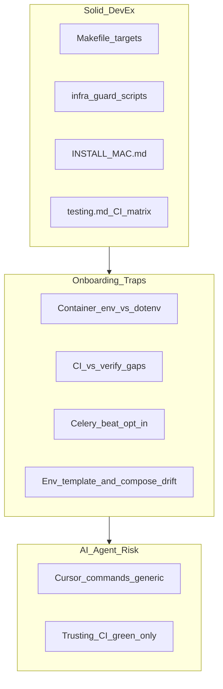

# Phase 2 — CI / DevEx / Docs Audit

Status: audit report  
Date: 2026-06-26  
Mode: audit only — no source changes

## Sources

| Category | Files |
|----------|-------|
| Contract | [`AGENTS.md`](../AGENTS.md), [`apps/api/AGENTS.md`](../../apps/api/AGENTS.md), [`apps/web/AGENTS.md`](../../apps/web/AGENTS.md), [`.cursor/rules/000-project-contract.mdc`](../../.cursor/rules/000-project-contract.mdc), [`.cursor/rules/30-docker-orbstack.mdc`](../../.cursor/rules/30-docker-orbstack.mdc) |
| DevEx spine | [`Makefile`](../../Makefile), [`docker-compose.yml`](../../docker-compose.yml), [`docker-compose.shared-dev.yml`](../../docker-compose.shared-dev.yml), [`infra/scripts/assert-local-dev-db.sh`](../../infra/scripts/assert-local-dev-db.sh), [`infra/scripts/assert-shared-dev-compose.sh`](../../infra/scripts/assert-shared-dev-compose.sh), [`infra/scripts/test-dev-guards.sh`](../../infra/scripts/test-dev-guards.sh) |
| CI | [`.github/workflows/ci.yml`](../../.github/workflows/ci.yml) |
| Env templates | [`.env.example`](../../.env.example), [`.env.shared-dev.example`](../../.env.shared-dev.example) |
| Onboarding docs | [`README.md`](../../README.md), [`INSTALL_MAC.md`](../../INSTALL_MAC.md), [`docs/engineering/testing.md`](../engineering/testing.md), [`docs/engineering/shared_dev_database.md`](../engineering/shared_dev_database.md), [`docs/qa/fresh_install_validation.md`](../qa/fresh_install_validation.md), [`docs/README.md`](../README.md) |
| Agent commands | [`.cursor/commands/`](../../.cursor/commands/) (11 files) |
| Prior consolidations (context) | [`phase_2_api_openapi_consolidation.md`](./phase_2_api_openapi_consolidation.md) API-O1, [`phase_2_pwa_mobile_first_consolidation.md`](./phase_2_pwa_mobile_first_consolidation.md) PWA-E5, [`phase_2_celery_async_consolidation.md`](./phase_2_celery_async_consolidation.md) CA-E4, [`phase_2_database_orm_consolidation.md`](./phase_2_database_orm_consolidation.md) DB-07 |

**Branch context:** Feature and domain Phase 2 audits consolidated. This audit follows repo evidence for CI, developer experience, documentation, and AI-agent guardrails. Prior consolidations used as context, not as a checklist.

---

## Files inspected

| Layer | Paths |
|-------|-------|
| Make / validation | `Makefile` (full), `infra/scripts/assert-local-dev-db.sh`, `assert-shared-dev-compose.sh`, `test-dev-guards.sh` |
| Docker / Compose | `docker-compose.yml`, `docker-compose.shared-dev.yml`, `infra/docker/api/Dockerfile` (image tag reference) |
| CI | `.github/workflows/ci.yml` (sole workflow) |
| Env | `.env.example`, `.env.shared-dev.example` |
| Onboarding | `README.md`, `INSTALL_MAC.md`, `docs/engineering/testing.md`, `docs/engineering/shared_dev_database.md`, `docs/qa/fresh_install_validation.md`, `docs/README.md` |
| Product docs (stale-command sample) | `docs/product/build_plan_mvp/phase_4_ai_pipeline_signal_feed.md`, `docs/engineering/api_pagination_standard.md` |
| Agent surface | `AGENTS.md`, `apps/api/AGENTS.md`, `apps/web/AGENTS.md`, `.cursor/rules/*.mdc`, `.cursor/commands/*.md` |
| Settings cross-check | `apps/api/config/settings.py` (env var usage vs compose passthrough) |

## Tests inspected

| Area | Files / commands |
|------|------------------|
| Guard script tests | `infra/scripts/test-dev-guards.sh` (invoked via `make infra-check`) — 5 cases, no DB |
| CI pytest markers | Same exclusion string as Makefile `PYTEST_MARKERS`: `not openai_observation_smoke and not openai_smoke and not slow` |
| Auth throttle fixture | Documented in `docs/engineering/testing.md`; `houston/conftest.py` referenced in docs |
| EF-07 query baselines | `houston/testing/query_baseline.py` referenced in DB consolidation; not in CI or `make verify` |
| **Explicit absence** | No CI workflow for schema diff, migrations check, frontend build, or generated types freshness |

## Docs / rules inspected

- [`docs/engineering/testing.md`](../engineering/testing.md) — CI vs local gates table (L121–141)
- [`docs/engineering/shared_dev_database.md`](../engineering/shared_dev_database.md) — scheduler split, guard matrix, aligned secrets
- [`docs/qa/fresh_install_validation.md`](../qa/fresh_install_validation.md) — E2E paths, `verify` scope
- `.cursor/rules/000-project-contract.mdc`, `01-agent-guardrails.mdc`, `30-docker-orbstack.mdc`
- `.cursor/commands/backend-fix.md`, `api-contract-change.md`, `review-before-commit.md`, `audit-mode.md`, `event-driven.md`

## Assumptions / unknowns

- `make verify`, `make infra-check`, and live mode-switch reproduction not executed in this pass.
- `.env.example` content confirmed via shell read (Read tool permission denied on dotenv files).
- Postgres 16 (CI) vs 17 (local) divergence not evidenced as causing migration failures yet.
- `fresh_install_validation.md` “vert” status is point-in-time; not re-validated live.
- Whether contributors routinely run `make verify` before merge not measured; all Phase 2 consolidation passes note it was not run.

---

## 1. Summary

Houston has a **strong Makefile-first DevEx core**: guarded local vs shared-dev targets, a clear validation ladder (`backend-check` → `web-check` → `verify`), and honest documentation in `INSTALL_MAC.md`, `shared_dev_database.md`, and `testing.md`. A macOS developer who reads `INSTALL_MAC.md` end-to-end can build, bootstrap, run daily dev, and understand shared-dev limitations.

**Onboarding is not yet safe-by-default** for skimmers of `README.md` alone or for AI agents following generic “run tests” instructions. Three classes of trap dominate:

1. **Environment mismatch** — local DB guards validate `.env` intent, not the running container’s effective database after a mode switch.
2. **CI vs local asymmetry** — GitHub Actions green does not imply `make verify` green (schema, migrations, PWA build ungated in CI; frontend lint ungated in verify).
3. **Documentation drift** — broken audit links, raw `docker compose` examples that bypass guards, and a broken shared-dev env template.

**Onboarding readiness (qualitative):** *workable with caveats* — **68 / 100** for a human who follows `INSTALL_MAC.md`; **~50 / 100** for an agent or README-only joiner without explicit guardrail patches.

---

## 2. Findings

| Priority | Count | Themes |
|----------|-------|--------|
| **P0** | 1 | Running container env ≠ `.env` guard (CI-E1) |
| **P1** | 3 | Compose env passthrough gap (CI-E2); CI/verify parity (CI-E3); broken shared-dev template (CI-E4) |
| **P2** | 5 | Postgres skew (CI-E5); scheduler confusion (CI-E6); stale docs (CI-E7); types.ts ungated (CI-E8); Cursor command gaps (CI-E9) |
| **P3** | 1 | Undocumented guard knobs (CI-E10) |

---

### CI-E1 — Running container env ≠ `.env` guard

| Field | Detail |
|-------|--------|
| **ID** | CI-E1 |
| **Severity** | P0 |
| **Category** | security / ambiguity |
| **Evidence** | `infra/scripts/assert-local-dev-db.sh` L67–101 — validates effective `POSTGRES_HOST` from `docker compose config --env-file .env`, not from the running `api` container. `Makefile` L98–99, L125–126 — `make test` runs guard then `docker compose exec api … uv run pytest`. After `make shared-dev-up`, containers retain remote DB env until recreated. |
| **Problem** | Developer switches `.env` back to local (`POSTGRES_HOST=postgres`) but does not `make down` and restart with the correct target. Guard passes (`.env` looks local); pytest/migrate/check execute against the **still-running shared-dev container** pointing at remote Postgres. |
| **Impact (now)** | Tests or migrations may mutate shared team data on Neon; false “local-only” confidence. |
| **Impact (later)** | As shared-dev adoption grows, one mistaken agent or hurried mode switch corrupts collaborative dev DB; hard to debug because `.env` appears correct. |
| **Suggested direction** | Document mandatory mode-switch procedure: `make down` → correct `make up-backend` or `make shared-dev-up` → never assume `.env` alone retargets running containers. Optionally add a guard comparing container `POSTGRES_HOST` to compose config (direction only — not implemented in this audit). |
| **Tests to add/update** | Extend `infra/scripts/test-dev-guards.sh` with a documented negative scenario or integration note; add `shared_dev_database.md` “mode switch” checklist. |
| **Size** | M (doc) / L (guard enhancement) |

---

### CI-E2 — Many `.env.example` vars ignored in Docker

| Field | Detail |
|-------|--------|
| **ID** | CI-E2 |
| **Severity** | P1 |
| **Category** | ambiguity / maintainability |
| **Evidence** | `docker-compose.yml` `x-api-environment` (L7–32) passes ~25 vars to api/celery. `.env.example` documents `HOUSTON_AUTH_THROTTLE_*`, `HOUSTON_PRIVATE_MEDIA_ROOT`, `HOUSTON_REALTIME_WS_*`, beat schedule overrides, upload limits — **none** appear in compose (grep: zero matches for `HOUSTON_AUTH_THROTTLE`, `HOUSTON_REALTIME`, `HOUSTON_PRIVATE_MEDIA` in `docker-compose.yml`). `README.md` L157–161 and `fresh_install_validation.md` imply `make recreate-backend` reloads `.env`. |
| **Problem** | Developers and agents tune throttle, media, realtime, or beat settings in `.env` expecting Docker to pick them up; only compose-listed vars apply. Django reads `os.environ` inside the container — vars not injected via compose are invisible. |
| **Impact (now)** | Misconfigured local dev (e.g. throttle behavior, media paths); wasted debugging. |
| **Impact (later)** | Env template grows; silent drift between documented vars and effective runtime config; agents copy `.env.example` patterns that never work in Docker. |
| **Suggested direction** | Audit settings.py env consumers vs compose passthrough; mark non-wired vars in `.env.example` with “Docker: not passed via compose” or extend compose `x-api-environment`. Cross-link in `INSTALL_MAC.md`. |
| **Tests to add/update** | Optional lint/script listing settings env keys not in compose (DevEx tooling). |
| **Size** | M |

---

### CI-E3 — CI vs `make verify` asymmetric gates

| Field | Detail |
|-------|--------|
| **ID** | CI-E3 |
| **Severity** | P1 |
| **Category** | tests / API contract / maintainability |
| **Evidence** | `.github/workflows/ci.yml` — `backend-tests`: ruff + pytest only; `frontend-tests`: lint + test + typecheck; **no** Django check, migrations check, schema diff, or `npm run build`. `Makefile` L128, L224–232 — `backend-check` includes check, lint, migrations, schema diff, pytest; `web-check` includes test, typecheck, **build** but **not** lint. `docs/engineering/testing.md` L121–130 documents gap honestly. Cross-ref: API-O1 (schema CI gap), PWA-E5 (build CI gap). |
| **Problem** | PR can pass CI while failing `make verify` (missing migration files, stale `schema.yml`, Vite/PWA build failure). Conversely, `make verify` can pass while CI frontend lint fails. Agents treating CI green as “safe to merge” miss contract and build gates. |
| **Impact (now)** | Schema drift, uncommitted migrations, and PWA build regressions can merge. |
| **Impact (later)** | Frontend/backend contract breaks discovered only at release or local verify; erodes trust in CI for humans and agents. |
| **Suggested direction** | Add CI steps mirroring `backend-schema-check`, `backend-migrations-check`, `manage.py check`, and `npm run build`; add `web-lint` to `web-check` or document that verify requires `make web-lint` too. |
| **Tests to add/update** | CI workflow steps (when implemented); no new product tests required. |
| **Size** | M |

---

### CI-E4 — Broken shared-dev env template

| Field | Detail |
|-------|--------|
| **ID** | CI-E4 |
| **Severity** | P1 |
| **Category** | security / ambiguity |
| **Evidence** | `.env.shared-dev.example` L21: `HOUSTON_AUTH_TOKEN_PEPPER: ${HOUSTON_AUTH_TOKEN_PEPPER:-}` — YAML/Compose interpolation syntax, invalid dotenv (`KEY=VALUE` required). Missing `HOUSTON_AUTH_TOKEN_SALT`, `HOUSTON_CHAT_WS_TICKET_SALT` required per `docs/engineering/shared_dev_database.md` aligned-secrets section. Local `.env.example` includes `HOUSTON_REALTIME_WS_*`; shared-dev template omits them. |
| **Problem** | Copy-paste onboarding for shared-dev produces broken or ignored auth pepper; team salt alignment incomplete in template. |
| **Impact (now)** | Auth/session inconsistencies across shared-dev developers; onboarding friction. |
| **Impact (later)** | Every new team member hits the same template bug; agents generating `.env.shared-dev` from example propagate invalid syntax. |
| **Suggested direction** | Fix pepper line to `HOUSTON_AUTH_TOKEN_PEPPER=replace-me`; add salt vars with 1Password alignment comments. |
| **Tests to add/update** | Optional dotenv syntax check in `make infra-check` or pre-commit. |
| **Size** | S |

---

### CI-E5 — Postgres version skew CI vs local

| Field | Detail |
|-------|--------|
| **ID** | CI-E5 |
| **Severity** | P2 |
| **Category** | maintainability |
| **Evidence** | `.github/workflows/ci.yml` L12 — `postgres:16` service. `docker-compose.yml` L130 — `postgres:17-alpine`. No onboarding doc mentions divergence. |
| **Problem** | Migration or SQL behavior may differ between CI and local Docker without anyone noticing until a edge-case failure. |
| **Impact (now)** | Low if tests are portable; latent risk for PG17-specific features or planner changes. |
| **Impact (later)** | Hard-to-reproduce “passes locally, fails in CI” or vice versa; wasted triage time. |
| **Suggested direction** | Align CI service to `postgres:17-alpine` or document intentional divergence and when to escalate. |
| **Tests to add/update** | None beyond alignment. |
| **Size** | S |

---

### CI-E6 — Celery Beat / scheduler workflow easy to get wrong

| Field | Detail |
|-------|--------|
| **ID** | CI-E6 |
| **Severity** | P2 |
| **Category** | ambiguity |
| **Evidence** | `docker-compose.yml` — `celery-beat` under profile `scheduler`, not default stack. `Makefile` L66–70, L147–150 — beat opt-in via `up-scheduler` / `shared-dev-up-scheduler`; `bootstrap-dev` prints optional reminder only. L68–70 — `up-scheduler` chains `up-backend` with **local** `.env`; L190–192 — `shared-dev-up-scheduler` uses `SHARED_COMPOSE`. Cross-ref: CA-E4 (celery consolidation). |
| **Problem** | Default `make up` / `bootstrap-dev` silently skips scheduled jobs (checklist horizon, chat purge, upload TTL cleanup, stuck observation recovery). After shared-dev, running `make up-scheduler` starts local postgres via `up-backend` — wrong DB pairing documented in `shared_dev_database.md` but not enforced. |
| **Impact (now)** | Dev environments missing beat behave differently from pilot setups with scheduler; “works on my machine” for time-based features. |
| **Impact (later)** | Agents and new devs never start beat; scheduled-path bugs found late; shared-dev + wrong scheduler target causes subtle DB confusion. |
| **Suggested direction** | Prominent callout in README numbered setup and Cursor rules; document beat-off vs beat-on dev expectations; never `up-scheduler` after `shared-dev-up`. |
| **Tests to add/update** | Manual QA checklist item; optional compose profile guard. |
| **Size** | S (docs) / M (guard) |

---

### CI-E7 — Stale / contradictory onboarding docs

| Field | Detail |
|-------|--------|
| **ID** | CI-E7 |
| **Severity** | P2 |
| **Category** | maintainability |
| **Evidence** | Broken links: `README.md` L86 → `docs/audit/chat_v1_technical_debt_2026-06-09.md` (directory `docs/audit/` missing; audits live under `docs/audits/`). `docs/engineering/api_pagination_standard.md` L194–196 — same broken `docs/audit/` paths. `docs/README.md` L21–24 — lists `product/Build_Plan/` and `api/`; actual tree uses `product/build_plan_mvp/`, no `docs/api/`. `Makefile` L42–43 — `make up` is **foreground** (no `-d`); README L123 does not say terminal blocks. `INSTALL_MAC.md` §6.1 — claims `docker compose build` equivalent to `make build-backend`; plain compose build includes `web`, scoped Make target does not. `README.md` numbered setup L137–141 jumps to `make bootstrap-dev` without `make build-backend` in steps 1–3 (verification block L328+ includes build). `phase_4_ai_pipeline_signal_feed.md` — raw `docker compose up`, host `uv run spectacular` contradicts AGENTS.md Make-first policy. |
| **Problem** | Joiners hit 404s, wrong build order, foreground surprise, and guard-bypassing commands from active docs. |
| **Impact (now)** | Failed fresh install, confusion, agents executing deprecated patterns. |
| **Impact (later)** | Doc entropy compounds; trust in docs erodes; every audit rediscovers same broken links. |
| **Suggested direction** | Fix audit paths; reorder README steps; deprecate raw compose in active product/engineering docs; note foreground `make up` vs detached `up-backend`. |
| **Tests to add/update** | Optional markdown link checker in CI (docs hygiene). |
| **Size** | M |

---

### CI-E8 — Generated `types.ts` freshness ungated

| Field | Detail |
|-------|--------|
| **ID** | CI-E8 |
| **Severity** | P2 |
| **Category** | API contract |
| **Evidence** | `Makefile` L221–222 — `web-api-generate` exists; not in `web-check`, `verify`, or CI. API-O1 consolidation — `schema.yml` drift gated locally; `apps/web/src/api/generated/types.ts` drift gated nowhere. |
| **Problem** | Backend API shape can update with committed `schema.yml` but stale generated frontend types; TypeScript may not catch all drift until runtime. |
| **Impact (now)** | Frontend callers out of sync with OpenAPI; manual `make web-api-generate` easy to forget. |
| **Impact (later)** | Contract drift accumulates; agents editing serializers without regen propagate silent bugs. |
| **Suggested direction** | After `backend-schema-check`, run `web-api-generate` and `git diff` on `types.ts` in verify and CI. |
| **Tests to add/update** | CI diff gate; document in `api-contract-change.md` command. |
| **Size** | M |

---

### CI-E9 — Cursor commands lack validation ladder

| Field | Detail |
|-------|--------|
| **ID** | CI-E9 |
| **Severity** | P2 |
| **Category** | maintainability / ambiguity |
| **Evidence** | `.cursor/commands/backend-fix.md` L19 — “run the smallest relevant backend validation” without naming `make backend-test` or `PYTEST_ARGS='path -q'`. `api-contract-change.md` L11 — “run affected backend + frontend checks” without `make schema && make web-api-generate && make backend-schema-check`. `review-before-commit.md` — no default validation matrix. `000-project-contract.mdc` L28–32 lists `make check` (weakest gate) alongside `make verify`. `30-docker-orbstack.mdc` — no scheduler trap or “stack must be up” prerequisite. CI ≠ verify not reflected in any command. |
| **Problem** | AI agents given workflow commands still choose wrong or incomplete validation; may run `make check` and stop, or trust CI-only green. |
| **Impact (now)** | Incomplete validation before commit; schema/types regen skipped. |
| **Impact (later)** | Agent-driven PRs systematically under-validate; human reviewers assume agents followed implicit gates. |
| **Suggested direction** | Add `run-checks.md` command with matrix from `testing.md`; patch `api-contract-change.md`, `backend-fix.md`; extend `30-docker-orbstack.mdc` with scheduler trap + `make up-backend` prerequisite. |
| **Tests to add/update** | None (Cursor metadata only). |
| **Size** | S |

---

### CI-E10 — Undocumented guard knobs and doc index gaps

| Field | Detail |
|-------|--------|
| **ID** | CI-E10 |
| **Severity** | P3 |
| **Category** | maintainability |
| **Evidence** | `HOUSTON_DEV_DB_MODE=local|shared` in `.env.example` / `.env.shared-dev.example`; enforced in `assert-local-dev-db.sh` L40–44 — **zero** markdown explanation in README, INSTALL_MAC, or shared_dev_database. `docs/README.md` omits links to `INSTALL_MAC.md`, `shared_dev_database.md`, `testing.md`, `fresh_install_validation.md`. No `make help` target. `apps/web/package.json` engines `node: 24.15.0`; `INSTALL_MAC.md` says “Node.js 24” only. `make backend-rebuild` (Makefile L130) undocumented in markdown. |
| **Problem** | Developers editing `.env` do not understand why guards fire; doc index does not surface onboarding spine; Node version skew possible. |
| **Impact (now)** | Minor friction, guard confusion, optional Node mismatch. |
| **Impact (later)** | Low unless team grows or non-Mac joiners appear without install guide. |
| **Suggested direction** | Document `HOUSTON_DEV_DB_MODE` and mode-switch; index onboarding docs in `docs/README.md`; optional `.nvmrc`; mention `backend-rebuild` after Dockerfile changes. |
| **Tests to add/update** | None. |
| **Size** | S |

---

## 3. What is already solid

### Makefile as single DevEx surface

- **`bootstrap-dev`** — `up-backend` → migrate → import-catalog → check → catalog-check (L147–150).
- **`reset-dev-db`** — explicit French destructive warning + full volume wipe (L152–159).
- **Shared-dev family** — `shared-dev-up`, `shared-dev-bootstrap`, `shared-dev-migrate`, preflight via `assert-shared-dev-compose.sh` on every target.
- **Frontend wrappers** — `web-install`, `web-dev`, `web-test`, `web-typecheck`, `web-build`, `web-api-generate` from repo root.
- **Validation ladder** — `backend-check` → `web-check` → `verify` with schema diff and migrations check locally.

### Guard scripts

- **`assert-local-dev-db.sh`** — refuses `.env.shared-dev` filename, `HOUSTON_DEV_DB_MODE=shared`, remote effective `POSTGRES_HOST`, shell `POSTGRES_HOST` override.
- **`assert-shared-dev-compose.sh`** — merged compose: workers depend redis-only; remote host enforced.
- **`make infra-check`** — tests guards without DB (`test-dev-guards.sh`).

### Documentation spine

- **`INSTALL_MAC.md`** — best human onboarding: machine neuve vs reset vs quotidien vs shared-dev table, build order, troubleshooting, E2E checklist, no Django admin.
- **`docs/engineering/testing.md`** — honest CI vs local matrix; auth throttle fixture behavior; focused pytest via `make backend-test PYTEST_ARGS='…'`.
- **`docs/engineering/shared_dev_database.md`** — scheduler split, no shared reset, guard table, aligned secrets requirement.
- **`docs/qa/fresh_install_validation.md`** — states `make verify` excludes migrate/catalog; mirrors install sequences.

### Agent contract

- **`AGENTS.md` hierarchy** — backend authority, OpenAPI contract, TanStack Query, no host-native backend pytest.
- **Always-on Cursor rules** — `000-project-contract.mdc` (Docker-only backend), `30-docker-orbstack.mdc` (Make-first, shared-dev safety, schema regen pipeline).
- **`audit-mode.md`** — read-only scope, audits under `docs/audits/` only.

---

## 4. What is confusing or risky

| Area | Risk | Who gets hurt |
|------|------|---------------|
| **Mode switch without `make down`** | Tests/migrate run against wrong DB (CI-E1) | Shared-dev team, agents rerunning `make test` |
| **`.env` vars not in compose** | Tuning throttle/realtime/media has no Docker effect (CI-E2) | Devs debugging auth throttle or media locally |
| **CI green ≠ verify green** | Schema/migration/PWA build drift merges (CI-E3) | Reviewers, release owners, agents |
| **Broken `.env.shared-dev.example`** | Invalid pepper syntax on copy-paste (CI-E4) | New shared-dev joiners |
| **Beat opt-in + wrong scheduler target** | Missing scheduled jobs; local postgres after shared-dev (CI-E6) | Checklist horizon, purge, stuck-observation dev paths |
| **Stale doc links and raw compose** | 404s, guard bypass, wrong build order (CI-E7) | README skimmers, agents reading product docs |
| **`types.ts` ungated** | Frontend/backend contract drift (CI-E8) | API change authors |
| **Generic Cursor commands** | Under-validation, wrong Make target (CI-E9) | AI agents |
| **`make up` foreground** | Terminal appears “hung” (CI-E7) | First-time Docker users |
| **`make lint` backend-only** | Frontend lint skipped if agent runs `make lint` only | Frontend change authors |

---

## 5. Missing CI/local validation gates

| Gate | CI | `make verify` | Neither |
|------|:--:|:-------------:|:-------:|
| Backend ruff | Yes | Yes | — |
| Backend pytest (smoke/slow excluded) | Yes | Yes | — |
| Django `manage.py check` | No | Yes | — |
| Migrations `makemigrations --check` | No | Yes | — |
| OpenAPI `schema.yml` diff | No | Yes | — |
| Frontend eslint | Yes | No (`web-lint` separate) | — |
| Frontend vitest | Yes | Yes | — |
| Frontend typecheck | Yes | Yes | — |
| Frontend production build / PWA artifacts | No | Yes | — |
| Generated `types.ts` diff | No | No | **Yes** |
| EF-07 query baselines | No | No | **Yes** (DB-07) |
| `make infra-check` (guard scripts) | No | No | Optional |
| `docker-verify-security` | No | No | Optional |
| Catalog seed counts (`catalog-check`) | No | No | Optional (bootstrap only) |

**Runtime environment note:** CI runs native `uv` + `npm` on Ubuntu with service containers; local `make verify` requires Docker `api` container up + native Node for frontend. CI uses `DJANGO_DEBUG=0`; local compose defaults `DJANGO_DEBUG=1` — throttle behavior differs (documented in `testing.md`).

---

## 6. Docs or commands to update first

Prioritized documentation and Cursor metadata directions only (no implementation plan):

| Priority | Item | Finding |
|----------|------|---------|
| 1 | Fix `.env.shared-dev.example` pepper line; add aligned salt vars | CI-E4 |
| 2 | Document container vs `.env` mode-switch: `make down` → correct `up-*` | CI-E1 |
| 3 | Repair `docs/audit/` → `docs/audits/` links across README and engineering docs | CI-E7 |
| 4 | README numbered setup: `make build-backend` before `make bootstrap-dev`; note foreground `make up` | CI-E7 |
| 5 | Document `HOUSTON_DEV_DB_MODE` in INSTALL_MAC + shared_dev_database | CI-E10 |
| 6 | Update `phase_4_ai_pipeline_signal_feed.md` to Make targets | CI-E7 |
| 7 | Mark non-compose `.env` vars or extend compose passthrough list | CI-E2 |
| 8 | Extend `.cursor/commands/api-contract-change.md` with explicit Make schema/types chain | CI-E9 |
| 9 | Add scheduler trap to `30-docker-orbstack.mdc` | CI-E6, CI-E9 |
| 10 | Index onboarding spine in `docs/README.md` | CI-E10 |

---

## 7. Cursor guardrail improvements

### Add or extend (high ROI)

1. **Validation ladder command** (`run-checks.md` or enrich `review-before-commit.md`):
   - Prerequisites: `make up-backend` (if `docker compose exec` fails)
   - Backend-only: `make backend-test` or `make backend-test PYTEST_ARGS='path -q'`
   - API contract: `make schema && make web-api-generate && make backend-schema-check`
   - Frontend-only: `make web-test web-typecheck web-lint`; add `web-build` if Vite/PWA config touched
   - Pre-merge: `make verify` (note: stricter than CI; includes schema, migrations, build)
   - CI ≠ verify: explicit one-line warning

2. **`30-docker-orbstack.mdc`** — add 3–5 lines:
   - Never `make up-scheduler` after `make shared-dev-up`; use `make shared-dev-up-scheduler`
   - Beat not started by default; optional for horizon/purge/stuck-observation paths
   - Mode switch requires `make down` before switching local ↔ shared-dev

3. **`api-contract-change.md`** — step 6: name `make backend-schema-check` and `make web-api-generate`; forbid hand-editing generated files.

4. **`backend-fix.md`** — replace generic “run validation” with `make backend-test` and `PYTEST_ARGS` example from `testing.md` L156.

5. **`event-driven.md`** — point agents to live side-effect paths (`realtime/broadcast.py`, `notifications/scheduling.py`); note `houston.events` / `EventEnvelope` as non-runtime scaffolding (realtime consolidation RT-E4).

### Scope or preamble

- **`.agents/skills/neon-postgres/SKILL.md`** — add Houston preamble: shared-dev workflow is `make shared-dev-*` + `docs/engineering/shared_dev_database.md`, not generic Neon MCP init alone.

### Already good — keep

- `000-project-contract.mdc` Docker-only backend policy
- `audit-mode.md` read-only boundary
- Domain commands (`rbac-scope-change.md`, `domain-lifecycle-change.md`, `realtime-ws-change.md`) with explicit test cases

---

## 8. Top priorities

### Top 3 fixes first

1. **CI-E1** — Document and communicate mode-switch procedure (container env vs `.env`); highest data-integrity risk for shared-dev.
2. **CI-E3** — Close CI vs `make verify` gap (schema, migrations, django check, frontend build; align lint with verify).
3. **CI-E4** — Fix shared-dev env template so copy-paste onboarding works.

### Quick wins

- **CI-E4** — dotenv syntax fix (single line + salt vars).
- **CI-E7** — repair broken `docs/audit/` links.
- **CI-E10** — document `HOUSTON_DEV_DB_MODE`.
- **CI-E9** — patch Cursor commands with explicit Make targets (no code change).
- **CI-E5** — align Postgres 16 → 17 in CI or one doc sentence.

### Structural issues to plan later

- **CI-E2** — full compose env passthrough audit vs `settings.py`.
- **CI-E8** — generated `types.ts` diff gate in verify and CI.
- **EF-07 query baselines** in CI (DB-07; after ORM change patterns stabilize).
- **CI-E6** — optional runtime guard blocking `up-scheduler` when shared-dev containers active.
- **`make help`** target or generated target listing.

### Not worth fixing now

- Linux / Windows install guide (macOS + OrbStack is intentional primary path).
- Celery/beat container healthchecks (CA-E4 deferred to pilot ops).
- Full trim of generic Neon skill unless agents routinely misroute.
- `docker-verify-security` in CI (optional hardening, not onboarding blocker).
- Rewriting all historical product docs — prioritize active engineering paths first.

---

## 9. Changed / Validated / Risks

| | |
|-|-|
| **Changed** | New audit report: `docs/audits/phase_2_ci_devex_docs_audit.md` only |
| **Validated** | Makefile targets and validation chain; `docker-compose.yml` env passthrough; guard scripts; `.github/workflows/ci.yml`; env templates; onboarding docs (README, INSTALL_MAC, testing, shared_dev, fresh_install); AGENTS.md and Cursor rules/commands; cross-check against API-O1, PWA-E5, CA-E4, DB-07 from prior consolidations |
| **Risks / not verified** | `make verify` and `make infra-check` not executed; live mode-switch trap not reproduced; Postgres 16 vs 17 skew not tested for migration failures; `fresh_install_validation.md` green status not re-run; agent rule loading order in Cursor not verified |
