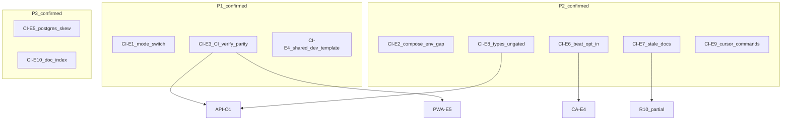
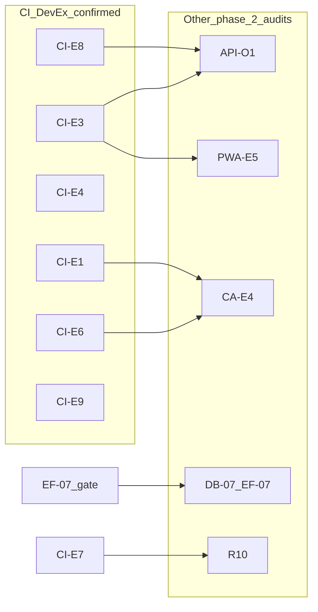

# Phase 2 — CI / DevEx / Docs Consolidation

Status: consolidation report  
Date: 2026-06-26  
Mode: consolidation only — no source changes

> **Post-audit note (2026-06-27):** Wave 0 scoped deliverables landed — see [`phase_2_final_roadmap.md`](./phase_2_final_roadmap.md) § Wave 0 status. Evidence rows below reflect the 2026-06-26 audit snapshot; cross-check CI/DevEx/runtime before citing as current state. **CI-E1**, **CI-E2**, **CI-E8**, **CI-E9** remain open.

## Sources

| Category | Files |
|----------|-------|
| Audit input | [`phase_2_ci_devex_docs_audit.md`](./phase_2_ci_devex_docs_audit.md) (CI-E1–CI-E10) |
| Backlog | [`phase_2_audit_backlog.md`](./phase_2_audit_backlog.md) §8 (R10), §4 (EF-07) |
| Closure | [`feature_audit_closure.md`](./feature_audit_closure.md) |
| Decisions | [`feature_audit_decisions.md`](./feature_audit_decisions.md) |
| Cross-audit | [`phase_2_api_openapi_consolidation.md`](./phase_2_api_openapi_consolidation.md) (API-O1), [`phase_2_pwa_mobile_first_consolidation.md`](./phase_2_pwa_mobile_first_consolidation.md) (PWA-E5), [`phase_2_celery_async_consolidation.md`](./phase_2_celery_async_consolidation.md) (CA-E4), [`phase_2_database_orm_consolidation.md`](./phase_2_database_orm_consolidation.md) (DB-07) |
| Contract | [`AGENTS.md`](../../AGENTS.md), [`apps/api/AGENTS.md`](../../apps/api/AGENTS.md), [`apps/web/AGENTS.md`](../../apps/web/AGENTS.md) |
| DevEx spine | [`Makefile`](../../Makefile), [`docker-compose.yml`](../../docker-compose.yml), [`.github/workflows/ci.yml`](../../.github/workflows/ci.yml), [`docs/engineering/testing.md`](../engineering/testing.md), [`docs/engineering/shared_dev_database.md`](../engineering/shared_dev_database.md), [`INSTALL_MAC.md`](../../INSTALL_MAC.md) |

**Branch context:** Feature audits closed (`TODO_NOW = 0`). All previous Phase 2 domain audits consolidated. Test strategy remains the final transversal audit. This consolidation challenges each finding from the phase 2 CI / DevEx / Docs audit against backlog §8, closure registry, sibling consolidations, and spot-check code evidence. No `FIXED`, `WONT_FIX_NOW`, or `DECISION_CLOSED` items reopened without new direct code evidence.

---

## 1. Executive summary

Houston has a **strong Makefile-first DevEx core**: guarded local vs shared-dev targets, a clear validation ladder (`backend-check` → `web-check` → `verify`), and honest documentation in `INSTALL_MAC.md`, `shared_dev_database.md`, and `testing.md`. A macOS developer who reads `INSTALL_MAC.md` end-to-end can build, bootstrap, run daily dev, and understand shared-dev limitations.

**Onboarding is not yet safe-by-default** for skimmers of `README.md` alone or for AI agents following generic “run tests” instructions. Residual risk clusters in three traps:

1. **Environment mismatch** — running container env can diverge from `.env` after a local ↔ shared-dev mode switch (CI-E1)
2. **CI vs local asymmetry** — GitHub Actions green does not imply `make verify` green; schema, migrations, PWA build, and generated types are ungated in CI (CI-E3, CI-E8; overlaps API-O1, PWA-E5)
3. **Documentation / template drift** — broken audit links, raw `docker compose` examples, broken shared-dev env template, and generic Cursor commands (CI-E4, CI-E7, CI-E9, CI-E10)

**Onboarding readiness (qualitative, from audit):** *workable with caveats* — **68 / 100** for a human following `INSTALL_MAC.md`; **~50 / 100** for an agent or README-only joiner without explicit guardrail patches. Scores retained as qualitative indicators; not re-measured in this consolidation pass.

| Priority | Count | Themes |
|----------|-------|--------|
| **P1** | 3 | Mode-switch container trap (CI-E1); CI vs verify parity (CI-E3); broken shared-dev template (CI-E4) |
| **P2** | 5 | Compose env passthrough gap (CI-E2); beat opt-in confusion (CI-E6); stale onboarding docs (CI-E7); `types.ts` ungated (CI-E8); Cursor command gaps (CI-E9) |
| **P3** | 2 | Postgres version skew (CI-E5); undocumented guard knobs / doc index (CI-E10) |

**Consolidation verdict:** 10 audit findings reviewed → **10 evidence-backed confirmations**, **0 false positives**, **5 duplicate merges** to sibling audits, **1 ancillary gate-matrix row** (EF-07 → DB-07) deferred, **0 FIXED/WONT_FIX_NOW/DECISION_CLOSED items reopened**.

*Severity adjustment vs audit:* **CI-E1** audit P0 → consolidation **P1** because of **shared-dev data-integrity risk** (local-only guards can pass while containers still target remote Postgres). First plausible remediation is **docs/guardrails** (mode-switch checklist); **runtime guard enhancement** is optional and a larger scope.

---

## 2. Findings reviewed

All 10 findings from [`phase_2_ci_devex_docs_audit.md`](./phase_2_ci_devex_docs_audit.md) §2, cross-checked against [`phase_2_audit_backlog.md`](./phase_2_audit_backlog.md) §8, [`feature_audit_closure.md`](./feature_audit_closure.md), sibling phase 2 consolidations, and spot-check code evidence.

| ID | Audit sev | Reclassification | Backlog / sibling alias | Consolidation notes |
|----|-----------|------------------|-------------------------|---------------------|
| **CI-E1** | P0 | **CONFIRMED** | — (unique DevEx/data-integrity) | Code-verified: [`assert-local-dev-db.sh`](../../infra/scripts/assert-local-dev-db.sh) L67–101 validates effective `POSTGRES_HOST` from `docker compose config --env-file .env`, **not** from the running `api` container. After `make shared-dev-up`, containers retain remote DB env until recreated. [`shared_dev_database.md`](../engineering/shared_dev_database.md) documents scheduler trap and guard table but **no** `make down` mode-switch checklist. Consolidation **P1** — shared-dev data-integrity risk; docs/guardrails first; runtime guard optional (larger). |
| **CI-E2** | P1 | **CONFIRMED** | — (unique DevEx) | Code-verified: [`docker-compose.yml`](../../docker-compose.yml) `x-api-environment` L7–32 passes ~25 vars; zero matches for `HOUSTON_AUTH_THROTTLE`, `HOUSTON_REALTIME`, `HOUSTON_PRIVATE_MEDIA`. [`settings.py`](../../apps/api/config/settings.py) L113+, L211, L358+ consume them via `os.environ` inside container. `make recreate-backend` reloads compose-listed vars only. |
| **CI-E3** | P1 | **CONFIRMED** + **DUPLICATE** | **API-O1**, **PWA-E5** | Code-verified: [`.github/workflows/ci.yml`](../../.github/workflows/ci.yml) — backend: ruff + pytest only; frontend: lint + test + typecheck, **no** `npm run build`. [`Makefile`](../../Makefile) L128 `backend-check` includes check, lint, migrations, schema diff, pytest; L224 `web-check` = test + typecheck + build, **no** lint. [`testing.md`](../engineering/testing.md) L121–130 documents gap honestly. Unique CI/DevEx slice: `web-lint` separate from `verify`. |
| **CI-E4** | P1 | **CONFIRMED** | — (unique DevEx) | Shell-verified: [`.env.shared-dev.example`](../../.env.shared-dev.example) L20 `HOUSTON_AUTH_TOKEN_PEPPER: ${HOUSTON_AUTH_TOKEN_PEPPER:-}` — YAML/Compose interpolation, invalid dotenv. No `HOUSTON_AUTH_TOKEN_SALT` or `HOUSTON_CHAT_WS_TICKET_SALT` lines; required per [`shared_dev_database.md`](../engineering/shared_dev_database.md) aligned-secrets section. |
| **CI-E5** | P2 | **CONFIRMED** + **IGNORE_NOW** for urgent fix | — | Code-verified: CI `postgres:16` ([`ci.yml`](../../.github/workflows/ci.yml) L12) vs local `postgres:17-alpine` ([`docker-compose.yml`](../../docker-compose.yml) L130). No onboarding doc mentions divergence; no migration failure evidenced. Real latent risk, not false positive. |
| **CI-E6** | P2 | **CONFIRMED** + **DUPLICATE** | **CA-E4** | Code-verified: `celery-beat` under Compose profile `scheduler`; [`Makefile`](../../Makefile) L66–70 `up-scheduler` chains local `up-backend`; L190–192 `shared-dev-up-scheduler`; `bootstrap-dev` prints optional reminder only. [`shared_dev_database.md`](../engineering/shared_dev_database.md) L112 documents `up-scheduler` trap. Celery consolidation owns beat semantics; CI/DevEx owns docs/guardrails. |
| **CI-E7** | P2 | **CONFIRMED** + partial **DUPLICATE** | **R10** (partial) | Code-verified: broken `docs/audit/` links in [`README.md`](../../README.md) L86, [`api_pagination_standard.md`](../engineering/api_pagination_standard.md) L194–196; stale proposed tree in [`docs/README.md`](../README.md) L21–24; `make up` foreground ([`Makefile`](../../Makefile) L42–43) not noted in README; README numbered setup omits `make build-backend` before `make bootstrap-dev`. R10 covers broader archive/phase-status hygiene; CI-E7 owns broken links + README flow. |
| **CI-E8** | P2 | **CONFIRMED** + **DUPLICATE** | **API-O1** (types slice) | Code-verified: [`Makefile`](../../Makefile) L221–222 `web-api-generate` exists; absent from `web-check`, `verify`, and CI. `schema.yml` drift gated locally via `backend-schema-check`; `apps/web/src/api/generated/types.ts` drift gated nowhere. Unique angle vs API-O1: types also missing from `verify`. |
| **CI-E9** | P2 | **CONFIRMED** | — (unique DevEx/agents) | Code-verified: [`.cursor/commands/api-contract-change.md`](../../.cursor/commands/api-contract-change.md) L11 — “run affected backend + frontend checks” without naming `make schema && make web-api-generate && make backend-schema-check`. [`backend-fix.md`](../../.cursor/commands/backend-fix.md), [`review-before-commit.md`](../../.cursor/commands/review-before-commit.md) lack validation matrix. [`000-project-contract.mdc`](../../.cursor/rules/000-project-contract.mdc) lists `make check` (weakest gate) alongside `make verify`. CI ≠ verify not reflected in any command. |
| **CI-E10** | P3 | **CONFIRMED** | — (unique DevEx) | Code-verified: `HOUSTON_DEV_DB_MODE` enforced in [`assert-local-dev-db.sh`](../../infra/scripts/assert-local-dev-db.sh) L31–41; **zero** markdown explanation in README, INSTALL_MAC, or shared_dev_database. [`docs/README.md`](../README.md) omits links to INSTALL_MAC, shared_dev_database, testing, fresh_install_validation. No `make help` target. `make backend-rebuild` ([`Makefile`](../../Makefile) L130) undocumented in markdown. |

**Ancillary gate-matrix row (audit §5, not a formal CI-E ID):**

| Topic | Reclassification | Notes |
|-------|------------------|-------|
| EF-07 query baselines in CI / `make verify` | **DUPLICATE** + **DEFER_PHASE_2** | **DB-07** / **EF-07** — establish after materialization strategy (R3/CA-E1) to avoid false positives |
| `make lint` backend-only | Absorbed into **CI-E3** | `make lint` → `backend-lint`; frontend lint requires `make web-lint` |
| `make infra-check` / `docker-verify-security` ungated | **IGNORE_NOW** | Optional hardening; not onboarding blocker per audit §8 |

**Backlog §8 re-validation:** **R10** (archive docs / `product_operating_model.md` phase status stale) remains valid — partial overlap with CI-E7; CI-E7 owns actionable broken links and README flow; R10 owns broader archive trim.

**Items explicitly not reopened:** all `FIXED`, `WONT_FIX_NOW`, `DECISION_CLOSED` from [`feature_audit_closure.md`](./feature_audit_closure.md).

---

## 3. Confirmed findings

### CI-E1 — Running container env ≠ `.env` guard after mode switch

| Field | Detail |
|-------|--------|
| **Severity** | P1 |
| **Evidence** | [`assert-local-dev-db.sh`](../../infra/scripts/assert-local-dev-db.sh) L67–101 — validates effective `POSTGRES_HOST` from `docker compose config --env-file .env`, not from running `api` container. [`Makefile`](../../Makefile) L98–99, L125–126 — `make test` runs guard then `docker compose exec api … pytest`. After `make shared-dev-up`, containers retain remote DB env until `make down` + correct restart. |
| **Why confirmed** | Developer switches `.env` back to local (`POSTGRES_HOST=postgres`) but does not recreate containers. Guard passes (compose config looks local); pytest/migrate/check execute against **still-running shared-dev container** pointing at remote Postgres. Not theoretical — guard design explicitly reads compose config, not container runtime env. **P1** because shared-dev data-integrity risk — not a theoretical DevEx polish item. |
| **Risk** | Tests or migrations may mutate shared team data on Neon; false “local-only” confidence. Grows with shared-dev adoption and agent-driven `make test` after mode switch. |
| **Suggested direction** | **First (docs/guardrails):** document mandatory mode-switch procedure — `make down` → correct `make up-backend` or `make shared-dev-up` → never assume `.env` alone retargets running containers; add checklist to `shared_dev_database.md`, INSTALL_MAC, and Cursor rules. **Optional, larger scope:** runtime guard comparing running container `POSTGRES_HOST` to compose config — direction only, not required for initial remediation. |
| **Dependencies** | CA-E4 (shared-dev workflow); no product gate |
| **Size** | S–M (docs/guardrails first) / L (optional runtime guard enhancement) |

---

### CI-E3 — CI vs `make verify` asymmetric gates

| Field | Detail |
|-------|--------|
| **Severity** | P1 |
| **Evidence** | [`.github/workflows/ci.yml`](../../.github/workflows/ci.yml) — `backend-tests`: ruff + pytest only; `frontend-tests`: lint + test + typecheck; **no** Django check, migrations check, schema diff, or `npm run build`. [`Makefile`](../../Makefile) L128 `backend-check` includes check, lint, migrations, schema diff, pytest; L224 `web-check` includes test, typecheck, build but **not** lint. [`testing.md`](../engineering/testing.md) L121–130 documents gap. |
| **Why confirmed** | PR can pass CI while failing `make verify` (missing migration files, stale `schema.yml`, Vite/PWA build failure). Conversely, `make verify` can pass while CI frontend lint fails. Agents treating CI green as “safe to merge” miss contract and build gates. |
| **Risk** | Schema drift, uncommitted migrations, and PWA build regressions can merge. Erodes trust in CI for humans and agents. |
| **Suggested direction** | Add CI steps mirroring `backend-schema-check`, `backend-migrations-check`, `manage.py check`, and `npm run build`; add `web-lint` to `web-check` or document that verify requires `make web-lint` too. Coordinate with API-O1 (backend contract) and PWA-E5 (build/PWA artifacts). |
| **Dependencies** | **API-O1** (schema/migrations/check CI slice); **PWA-E5** (`npm run build` CI slice); **CI-E8** (types.ts diff — separate gate) |
| **Size** | M |

---

### CI-E4 — Broken shared-dev env template

| Field | Detail |
|-------|--------|
| **Severity** | P1 |
| **Evidence** | [`.env.shared-dev.example`](../../.env.shared-dev.example) L20: `HOUSTON_AUTH_TOKEN_PEPPER: ${HOUSTON_AUTH_TOKEN_PEPPER:-}` — YAML/Compose interpolation syntax, invalid dotenv (`KEY=VALUE` required). Missing `HOUSTON_AUTH_TOKEN_SALT`, `HOUSTON_CHAT_WS_TICKET_SALT` required per [`shared_dev_database.md`](../engineering/shared_dev_database.md) aligned-secrets section. Local `.env.example` includes `HOUSTON_REALTIME_WS_*`; shared-dev template omits them. |
| **Why confirmed** | Copy-paste onboarding for shared-dev produces broken or ignored auth pepper; team salt alignment incomplete in template. Shell re-read in consolidation pass confirms L20 syntax. |
| **Risk** | Auth/session inconsistencies across shared-dev developers; onboarding friction. Agents generating `.env.shared-dev` from example propagate invalid syntax. |
| **Suggested direction** | Fix pepper line to `HOUSTON_AUTH_TOKEN_PEPPER=replace-me`; add salt vars with 1Password alignment comments. Optional dotenv syntax check in `make infra-check`. |
| **Dependencies** | None blocking |
| **Size** | S |

---

### CI-E2 — Many `.env.example` vars ignored in Docker

| Field | Detail |
|-------|--------|
| **Severity** | P2 |
| **Evidence** | [`docker-compose.yml`](../../docker-compose.yml) `x-api-environment` L7–32 passes ~25 vars. `.env.example` documents `HOUSTON_AUTH_THROTTLE_*`, `HOUSTON_PRIVATE_MEDIA_ROOT`, `HOUSTON_REALTIME_WS_*`, beat schedule overrides, upload limits — **none** in compose passthrough. [`settings.py`](../../apps/api/config/settings.py) reads them via `os.environ`. [`README.md`](../../README.md) and [`fresh_install_validation.md`](../qa/fresh_install_validation.md) imply `make recreate-backend` reloads `.env`. |
| **Why confirmed** | Developers tune throttle, media, realtime, or beat settings in `.env` expecting Docker to pick them up; only compose-listed vars apply. Silent drift between documented vars and effective runtime config. |
| **Risk** | Misconfigured local dev (throttle behavior, media paths); wasted debugging. Grows as env template expands. |
| **Suggested direction** | Audit `settings.py` env consumers vs compose passthrough; mark non-wired vars in `.env.example` with “Docker: not passed via compose” or extend compose `x-api-environment`. Cross-link in `INSTALL_MAC.md`. |
| **Dependencies** | [`testing.md`](../engineering/testing.md) documents auth throttle fixture behavior — compose gap is separate from test design |
| **Size** | M |

---

### CI-E6 — Celery Beat / scheduler workflow easy to get wrong

| Field | Detail |
|-------|--------|
| **Severity** | P2 |
| **Evidence** | [`docker-compose.yml`](../../docker-compose.yml) — `celery-beat` under profile `scheduler`. [`Makefile`](../../Makefile) L66–70 `up-scheduler` chains local `up-backend`; L190–192 `shared-dev-up-scheduler`; `bootstrap-dev` prints optional reminder only. [`shared_dev_database.md`](../engineering/shared_dev_database.md) L112 — `up-scheduler` after shared-dev starts local postgres. |
| **Why confirmed** | Default `make up` / `bootstrap-dev` silently skips scheduled jobs. Wrong scheduler target after shared-dev is documented but not enforced. Duplicate of CA-E4 beat semantics; CI/DevEx owns onboarding callouts and Cursor guardrails. |
| **Risk** | Dev environments missing beat behave differently from pilot setups; scheduled-path bugs found late; shared-dev + wrong scheduler causes subtle DB confusion. |
| **Suggested direction** | Prominent callout in README numbered setup and Cursor rules; document beat-off vs beat-on dev expectations; never `up-scheduler` after `shared-dev-up`. |
| **Dependencies** | **CA-E4** (Celery owns beat semantics and prod deployment evidence) |
| **Size** | S (docs) / M (optional compose profile guard) |

---

### CI-E7 — Stale / contradictory onboarding docs

| Field | Detail |
|-------|--------|
| **Severity** | P2 |
| **Evidence** | Broken links: [`README.md`](../../README.md) L86 → `docs/audit/chat_v1_technical_debt_2026-06-09.md` (directory missing; audits under `docs/audits/`). [`api_pagination_standard.md`](../engineering/api_pagination_standard.md) L194–196 — same broken paths. [`docs/README.md`](../README.md) L21–24 — lists `product/Build_Plan/` and `api/`; actual tree uses `product/build_plan_mvp/`, no `docs/api/`. `make up` foreground; README setup skips `build-backend` before `bootstrap-dev`. [`phase_4_ai_pipeline_signal_feed.md`](../product/build_plan_mvp/phase_4_ai_pipeline_signal_feed.md) — raw `docker compose up`, host `uv run spectacular` contradicts AGENTS.md Make-first policy. |
| **Why confirmed** | Joiners hit 404s, wrong build order, foreground surprise, and guard-bypassing commands from active docs. Partial overlap with R10 archive hygiene; CI-E7 owns specific broken links and README flow. |
| **Risk** | Failed fresh install, confusion, agents executing deprecated patterns. Doc entropy compounds trust erosion. |
| **Suggested direction** | Fix audit paths; reorder README steps; deprecate raw compose in active product/engineering docs; note foreground `make up` vs detached `up-backend`. Optional markdown link checker in CI. |
| **Dependencies** | **R10** (broader archive/phase-status trim) |
| **Size** | M |

---

### CI-E8 — Generated `types.ts` freshness ungated

| Field | Detail |
|-------|--------|
| **Severity** | P2 |
| **Evidence** | [`Makefile`](../../Makefile) L221–222 — `web-api-generate` exists; not in `web-check`, `verify`, or CI. API-O1 consolidation — `schema.yml` drift gated locally; `apps/web/src/api/generated/types.ts` drift gated nowhere. |
| **Why confirmed** | Backend API shape can update with committed `schema.yml` but stale generated frontend types; TypeScript may not catch all drift until runtime. |
| **Risk** | Frontend callers out of sync with OpenAPI; manual `make web-api-generate` easy to forget. |
| **Suggested direction** | After `backend-schema-check`, run `web-api-generate` and `git diff` on `types.ts` in verify and CI. Document in `api-contract-change.md` command. |
| **Dependencies** | **API-O1** (unified contract CI job); coordinate schema + types gate |
| **Size** | M |

---

### CI-E9 — Cursor commands lack validation ladder

| Field | Detail |
|-------|--------|
| **Severity** | P2 |
| **Evidence** | [`.cursor/commands/api-contract-change.md`](../../.cursor/commands/api-contract-change.md) L11 — generic checks. [`backend-fix.md`](../../.cursor/commands/backend-fix.md) L19 — “run the smallest relevant backend validation” without `make backend-test` or `PYTEST_ARGS`. [`review-before-commit.md`](../../.cursor/commands/review-before-commit.md) — no default validation matrix. [`30-docker-orbstack.mdc`](../../.cursor/rules/30-docker-orbstack.mdc) — no scheduler trap or stack prerequisite. CI ≠ verify not in any command. |
| **Why confirmed** | AI agents given workflow commands still choose wrong or incomplete validation; may run `make check` and stop, or trust CI-only green. |
| **Risk** | Incomplete validation before commit; schema/types regen skipped. Agent-driven PRs systematically under-validate. |
| **Suggested direction** | Add `run-checks.md` command with matrix from `testing.md`; patch `api-contract-change.md`, `backend-fix.md`; extend `30-docker-orbstack.mdc` with scheduler trap + `make up-backend` prerequisite + CI≠verify warning. |
| **Dependencies** | CI-E3 (CI vs verify matrix); CI-E6 (scheduler trap); optional RT-E5 pointer in `event-driven.md` |
| **Size** | S |

---

### CI-E5 — Postgres version skew CI vs local

| Field | Detail |
|-------|--------|
| **Severity** | P3 |
| **Evidence** | [`.github/workflows/ci.yml`](../../.github/workflows/ci.yml) L12 — `postgres:16` service. [`docker-compose.yml`](../../docker-compose.yml) L130 — `postgres:17-alpine`. No onboarding doc mentions divergence. |
| **Why confirmed** | Migration or SQL behavior may differ between CI and local Docker. No failure evidenced in audit or consolidation pass. |
| **Risk** | Latent “passes locally, fails in CI” or vice versa; wasted triage time if PG17-specific behavior emerges. |
| **Suggested direction** | Align CI service to `postgres:17-alpine` or document intentional divergence and when to escalate. |
| **Dependencies** | None blocking |
| **Size** | S |

---

### CI-E10 — Undocumented guard knobs and doc index gaps

| Field | Detail |
|-------|--------|
| **Severity** | P3 |
| **Evidence** | `HOUSTON_DEV_DB_MODE=local|shared` in env templates; enforced in [`assert-local-dev-db.sh`](../../infra/scripts/assert-local-dev-db.sh) L40–44 — **zero** markdown explanation in README, INSTALL_MAC, or shared_dev_database. [`docs/README.md`](../README.md) omits links to INSTALL_MAC, shared_dev_database, testing, fresh_install_validation. No `make help` target. `apps/web/package.json` engines `node: 24.15.0`; `INSTALL_MAC.md` says “Node.js 24” only. `make backend-rebuild` undocumented. |
| **Why confirmed** | Developers editing `.env` do not understand why guards fire; doc index does not surface onboarding spine. |
| **Risk** | Minor friction, guard confusion, optional Node mismatch. Low unless team grows or non-Mac joiners appear without install guide. |
| **Suggested direction** | Document `HOUSTON_DEV_DB_MODE` and mode-switch; index onboarding docs in `docs/README.md`; optional `.nvmrc`; mention `backend-rebuild` after Dockerfile changes. |
| **Dependencies** | CI-E1 (mode-switch docs) |
| **Size** | S |

---

## 4. Reclassified / duplicate / false-positive findings

| ID / topic | Disposition | Notes |
|------------|-------------|-------|
| **CI-E3** | **CONFIRMED** + **DUPLICATE** | Backend gates → **API-O1**; frontend build → **PWA-E5**; unique verify lint gap remains CI/DevEx-owned |
| **CI-E6** | **CONFIRMED** + **DUPLICATE** | **CA-E4** owns beat semantics and prod scheduler evidence; CI/DevEx owns docs/guardrails slice |
| **CI-E7** | **CONFIRMED** + partial **DUPLICATE** | **R10** owns archive/phase-status hygiene; CI-E7 owns broken links + README flow |
| **CI-E8** | **CONFIRMED** + **DUPLICATE** | **API-O1** types slice; unique angle = also absent from `verify` |
| **CI-E5** | **CONFIRMED** + **IGNORE_NOW** for urgent fix | Version skew real; no failure evidenced — align or document when convenient |
| **EF-07 row** | **DUPLICATE** + **DEFER_PHASE_2** | **DB-07** — query baseline CI after materialization stabilizes |
| Linux / Windows install guide | **IGNORE_NOW** | macOS + OrbStack is intentional primary path (audit §8) |
| Celery/beat container healthchecks | **IGNORE_NOW** | **CA-E4** deferred to pilot ops |
| `docker-verify-security` in CI | **IGNORE_NOW** | Optional hardening, not onboarding blocker |
| Full trim of historical product docs | **IGNORE_NOW** | Prioritize active engineering paths (audit §8) |
| Full trim generic Neon skill | **IGNORE_NOW** | Unless agents routinely misroute |
| **FALSE_POSITIVE** | **0 / 10** | All audit findings have direct repo evidence |

### Items explicitly not reopened

| ID | Closure status | Why not reopened |
|----|----------------|------------------|
| NR-05, SIG-03, ACT-02, etc. | FIXED | No new code evidence in CI/DevEx audit |
| CL-01a, dual poll+WS | WONT_FIX_NOW | Not CI/DevEx findings |
| C-04, OB-09, requires_validation | DECISION_CLOSED | Doc-only MVP closures |
| Ops catalog bootstrap | DECISION_CLOSED | `make bootstrap-dev` + import-catalog documented |

---

## 5. Cross-audit dependencies

| CI/DevEx item | Sibling audit | Relationship |
|---------------|---------------|--------------|
| **CI-E3** backend gates | **API-O1** | Same CI gap; API consolidation primary for contract/regression angle |
| **CI-E3** frontend build | **PWA-E5** | PWA install trust; CI/DevEx owns verify parity matrix |
| **CI-E8** `types.ts` | **API-O1** | Schema gated locally; types ungated everywhere — unified contract CI job |
| **CI-E6** scheduler | **CA-E4** | Celery owns beat semantics; CI/DevEx owns docs/guardrails |
| **EF-07 baselines** | **DB-07** | Timing after materialization (R3/CA-E1) |
| **CI-E9** commands | **RT-E5** (optional) | `event-driven.md` agent pointer; validation ladder is CI/DevEx-owned |
| **CI-E2** throttle vars | **testing.md** | Auth throttle fixture docs exist; compose passthrough gap is DevEx |
| **CI-E7** stale docs | **R10** | R10 broader; CI-E7 actionable link/README fixes |

---

## 6. Top priorities

### P1 — must address before large-scale evolution

1. **CI-E1** — Shared-dev data-integrity risk (container env vs `.env`); **first remediation: docs/guardrails** (mode-switch checklist); optional runtime guard is larger scope
2. **CI-E3** — Close CI vs `make verify` gap (schema, migrations, django check, frontend build; align lint with verify) — coordinate **API-O1** + **PWA-E5**
3. **CI-E4** — Fix shared-dev env template so copy-paste onboarding works

### P2 — important, not blocking pilot

4. **CI-E7** — Doc hygiene: broken links, README build order, foreground `make up` note
5. **CI-E9** — Cursor command validation matrix + CI≠verify warning
6. **CI-E8** — `types.ts` diff gate in verify and CI (after **API-O1**)
7. **CI-E2** — Compose/settings env passthrough audit or `.env.example` labels
8. **CI-E6** — Beat opt-in callouts (**CA-E4** docs slice)

### P3 — polish / hygiene

9. **CI-E5** — Align Postgres 16 → 17 in CI or one doc sentence
10. **CI-E10** — Document `HOUSTON_DEV_DB_MODE`; index onboarding spine in `docs/README.md`

**Top 3 to plan first:** CI-E1 → CI-E3 (+ API-O1/PWA-E5) → CI-E4

### Small remediation candidates to plan later

- **CI-E4** — dotenv syntax fix + salt vars (S)
- **CI-E7** — repair broken `docs/audit/` links (S)
- **CI-E10** — document `HOUSTON_DEV_DB_MODE` (S)
- **CI-E9** — patch Cursor commands with explicit Make targets (S)
- **CI-E5** — align Postgres 16 → 17 in CI or one doc sentence (S)
- **CI-E6** — scheduler trap callout in README / `30-docker-orbstack.mdc` (S)
- **CI-E1** — mode-switch docs/guardrails checklist in `shared_dev_database.md` / INSTALL_MAC (S–M)

### Structural issues to plan later

- **CI-E2** — full compose env passthrough audit vs `settings.py` (M)
- **CI-E8** + **API-O1** — unified contract CI job including `types.ts` diff (M)
- **CI-E1** — optional runtime guard comparing container vs compose `POSTGRES_HOST` (L; larger than docs/guardrails-first remediation)
- **EF-07** / **DB-07** — query baselines in CI after materialization path stabilizes
- **`make help`** target or generated target listing (S)

### Not worth fixing now

- Linux / Windows install guide (macOS + OrbStack intentional)
- Celery/beat container healthchecks (**CA-E4** pilot ops)
- `docker-verify-security` in CI
- Full rewrite of all historical product docs — active engineering paths first
- Full trim of generic Neon skill unless agents routinely misroute

---

## 7. What is safe today

Evidence-backed DevEx areas that do not need immediate change:

| Area | Evidence |
|------|----------|
| **Makefile as single DevEx surface** | `bootstrap-dev`, `reset-dev-db` (destructive warning), shared-dev family with preflight, frontend wrappers, validation ladder `backend-check` → `web-check` → `verify` ([`Makefile`](../../Makefile)) |
| **Guard scripts** | `assert-local-dev-db.sh` refuses `.env.shared-dev`, `HOUSTON_DEV_DB_MODE=shared`, remote effective `POSTGRES_HOST`, shell override; `assert-shared-dev-compose.sh` enforces remote host; `make infra-check` tests guards without DB |
| **Documentation spine** | `INSTALL_MAC.md` — best human onboarding; `testing.md` — honest CI vs local matrix; `shared_dev_database.md` — scheduler split, guard table, aligned secrets; `fresh_install_validation.md` — `verify` scope |
| **Agent contract** | `AGENTS.md` hierarchy — backend authority, OpenAPI contract, TanStack Query, no host-native backend pytest |
| **Always-on Cursor rules** | `000-project-contract.mdc` (Docker-only backend), `30-docker-orbstack.mdc` (Make-first, shared-dev safety, schema regen pipeline) |
| **Audit mode boundary** | `audit-mode.md` — read-only scope, audits under `docs/audits/` only |
| **CI smoke/slow exclusion** | Same `PYTEST_MARKERS` string in Makefile and CI workflow |
| **Feature closure** | `TODO_NOW = 0`; no security bypass introduced by DevEx gaps |

---

## 8. What should wait for another audit

| Domain | Items | Relation to CI/DevEx |
|--------|-------|-------------------|
| **Database / ORM** | **DB-07** / **EF-07** query baselines | CI integration after materialization strategy (R3/CA-E1) |
| **API / OpenAPI** | **API-O2** private imports, **API-O3–O10** | Contract hygiene beyond CI gate |
| **Celery / Async** | **CA-E1** materialization timing, **CA-E3** horizon | Beat-off dev workflow field impact unmeasured |
| **PWA / Mobile-first** | **PWA-E3** install assets/SW UI | Separate from **PWA-E5** CI build gate |
| **Realtime** | **R5** `houston.events` stub | Doc hygiene in Realtime consolidation |
| **Frontend Architecture** | **OR-09** ReportPage tests | Page-level gaps, not DevEx |
| **Doc hygiene (broader)** | **R10** archive / `product_operating_model.md` | Beyond CI-E7 link fixes |

### Needs more evidence (carry from audit)

| Topic | Why deferred |
|-------|--------------|
| CI-E1 live trap reproduction | Audit did not execute mode-switch scenario |
| Postgres 16 vs 17 migration failures | No edge-case failure evidenced |
| Contributor `make verify` habit before merge | Not measured |
| `make verify` / `make infra-check` execution | Not run in audit or consolidation pass |
| Agent rule loading order in Cursor | Not verified |

---

## 9. Open questions

1. For **CI-E1**, is docs/guardrails-first sufficient for shared-dev MVP, or is runtime guard enhancement required before wider team adoption?
2. Should **CI-E3** unify `web-lint` into `web-check`/`verify`, or keep separate with explicit pre-merge checklist?
3. Should **CI-E8** gate run `web-api-generate` in CI natively (no Docker api) or only in a composite verify job?
4. When will production beat deployment be evidenced in infra config (**CA-E4** complement)?
5. Who owns running `fresh_install_validation.md` E2E before the next team joiner?
6. Is a markdown link checker in CI worth the maintenance cost for **CI-E7**?

---

**Changed:** `docs/audits/phase_2_ci_devex_docs_consolidation.md` — branch context (test strategy transversal audit pending); “Quick wins” → “Small remediation candidates to plan later”; CI-E1 clarified (P1 shared-dev data-integrity; docs/guardrails first; optional runtime guard larger scope)  
**Validated:** Prior consolidation content unchanged except targeted edits; priorities unchanged; no closure items reopened  
**Risks / not verified:** `make verify` and `make infra-check` not executed; CI-E1 mode-switch trap not live-reproduced; Postgres 16 vs 17 skew not tested for migration failures; contributor verify habit not measured; CI-E1 docs-first vs runtime-guard tradeoff not product-validated
