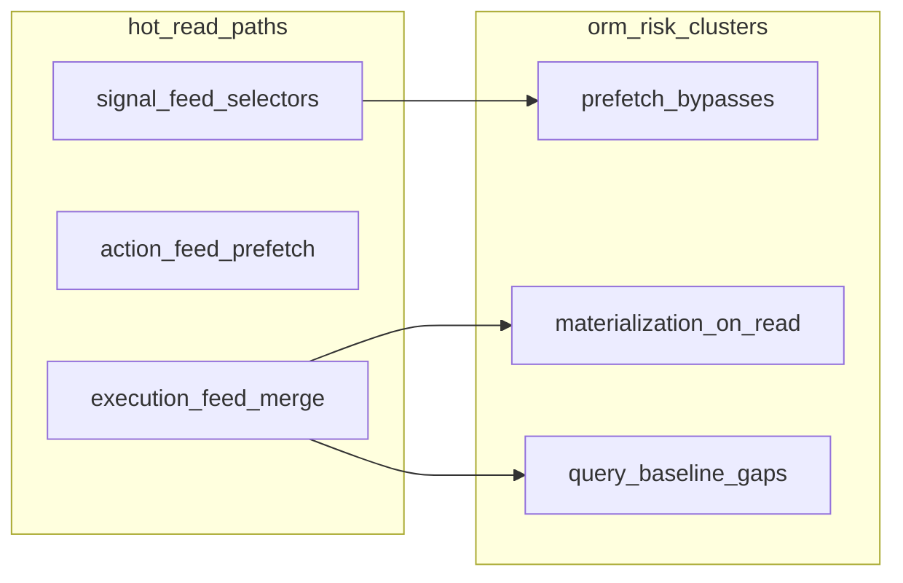

# Phase 2 — Database / ORM Audit

Status: audit report  
Date: 2026-06-26  
Mode: audit only — no source changes

## Sources

| Category | Files |
|----------|-------|
| Contract | [`AGENTS.md`](../AGENTS.md), [`apps/api/AGENTS.md`](../../apps/api/AGENTS.md), [`.cursor/rules/`](../.cursor/rules/) |
| Compass | [`phase_2_audit_backlog.md`](./phase_2_audit_backlog.md) §2, [`phase_2_api_openapi_consolidation.md`](./phase_2_api_openapi_consolidation.md) |
| Closure | [`feature_audit_closure.md`](./feature_audit_closure.md) |
| Prior domain audits | [`execution_feed_consolidation.md`](./execution_feed_consolidation.md), [`signal_feed_audit.md`](./signal_feed_audit.md), [`checklist_audit.md`](./checklist_audit.md) |

**Branch context:** Feature audits closed (`TODO_NOW = 0`). API/OpenAPI consolidation complete. This audit follows code evidence for the backend data layer. No `FIXED`, `WONT_FIX_NOW`, or `DECISION_CLOSED` items reopened (`SIG-03`, `ACT-01`, `CL-02`, `CL-01a` are context only).

---

## Files inspected

| Layer | Paths |
|-------|-------|
| Models / indexes | All 13 `apps/api/houston/*/models.py`; migrations `signals/0006`, `checklists/0001`, `actions/0005` |
| Selectors | 9 `selectors.py` modules; `establishments/taxonomy_snapshot.py` |
| Hot paths | `actions/execution_feed.py`, `checklists/materialization.py`, `signals/services.py` (`find_active_signal_for_aggregation`), `signals/selectors.py`, `signals/reporter_display.py` |
| Serializers | `checklists/api/serializers.py`, `checklists/feed_serializers.py`, `actions/api/serializers.py` |
| Query baselines | `houston/testing/query_baseline.py` |

## Tests inspected

| Area | Files |
|------|-------|
| Execution feed | `actions/tests/test_execution_feed_api.py`, `checklists/tests/test_execution_feed_checklist.py` |
| Signal feed / detail | `signals/tests/test_signal_feed_api.py`, `signals/tests/test_signal_canceled_detail.py` |
| Checklists | `checklists/tests/test_assignment_api.py`, `checklists/tests/test_materialization_services.py` |
| Chat / pipeline | `chat/tests/test_rest_api.py`, `ai/tests/test_observation_pipeline_input_queries.py` |
| Comments | `comments/tests/test_selectors.py`, `comments/tests/test_signal_comments_api.py` |
| Aggregation | `signals/tests/test_observation_pipeline_aggregation_concurrency.py` |

## Docs / rules inspected

- [`phase_2_audit_backlog.md`](./phase_2_audit_backlog.md) §2 (SIG-04, CL-09, F9)
- [`phase_2_api_openapi_consolidation.md`](./phase_2_api_openapi_consolidation.md) §4 (F9, API-O6 comments angle)
- `.cursor/rules/10-backend-django-drf.mdc`, `01-agent-guardrails.mdc`

## Assumptions / unknowns

- No runtime `EXPLAIN ANALYZE` or production assignment-volume profiling performed.
- Referenced doc `docs/audit/db_scalability_phase_l_2026-06-11.md` is cited in `query_baseline.py` but **not present** in the repo.
- Query-count baselines are ceiling assertions from fixture-scale pytest runs, not live p95 measurements.

---

## 1. Summary

The ORM layer is **well-structured for MVP hot reads** where query-count baselines exist: signal feed, action feed, chat, and checklist assignment list all show deliberate `select_related` / `Prefetch` / annotation patterns in selectors, with serializers mostly consuming prefetched caches. Ownership (`selectors` for reads, `services` for writes, serializers for representation) is largely respected.

Residual risk clusters in three areas:

1. **Read-path write amplification** — every execution-feed GET unconditionally calls `ensure_visible_executions_materialized` before building the page (`actions/execution_feed.py` → `checklists/materialization.py`).
2. **Prefetch discipline gaps** — canceled signal detail, taxonomy snapshot, and checklist detail serializers defeat existing prefetch in predictable ways.
3. **Regression guards** — `query_baseline.py` covers ~8 fixture shapes; signal detail, comments, mixed feed, and N-assignment materialization paths are unguarded.

No P0 data-integrity hole found. Index posture is strong on feed sort paths (`action_exec_feed_sort_idx`, `checklist_exec_feed_idx`, `signal_feed_sort_idx`). Aggregation lookup (SIG-04) and template guard lookups (CL-09) remain **deferred, evidence-confirmed** gaps from the feature audit backlog.

| Priority | Count | Themes |
|----------|-------|--------|
| **P1** | 1 | Materialization-on-read per-assignment loop (DB-01) |
| **P2** | 6 | Duplicate materialization SELECT (DB-02); taxonomy prefetch bypass (DB-03); canceled signal prefetch (DB-04 / F9); aggregation index (DB-05 / SIG-04); checklist serializer prefetch bypass (DB-06); query baseline gaps (DB-07 / EF-07) |
| **P3** | 3 | Template+status index (DB-08 / CL-09); duplicate observation poll query (DB-09); comments unpaginated + no baseline (DB-10) |

---

## 2. Findings

### DB-01 — Materialization-on-read: per-assignment query/write loop on every execution-feed GET

| Field | Detail |
|-------|--------|
| **ID** | DB-01 |
| **Severity** | P1 |
| **Category** | scalability / performance |
| **Backlog alias** | R3 / EF-01 / CL-01 (ORM angle; CL-01a not reopened) |
| **Evidence** | `build_execution_feed_page` in `actions/execution_feed.py` calls `ensure_visible_executions_materialized` unconditionally; `ensure_visible_executions_materialized` in `checklists/materialization.py` (L388–428) iterates all visible active assignments; per stale assignment: `_existing_occurrence_dates_for_assignment` SELECT + optional `materialize_execution_from_assignment` writes (execution INSERT + task snapshot `bulk_create`) |
| **Problem** | Feed GET is O(visible assignments) in SQL round-trips and can trigger synchronous INSERTs before the feed page is built. Work is not bounded by `page_size`. |
| **Risk** | Latency grows with assignment library size; read requests become write-heavy when `last_materialized_at` is stale (30-min TTL, `READ_PATH_MATERIALIZATION_STALE_MINUTES`). |
| **Suggested direction** | Cross-domain concern (Realtime/Celery primary owner). From ORM view: batch existence checks across assignments, reduce duplicate SELECTs (see DB-02), add N-assignment query-count regression test — without re-litigating lazy materialization product decision. |
| **Test coverage** | Partial — `test_execution_feed_query_count_baseline_empty`, `test_execution_feed_checklist_query_count_baseline`; `test_ensure_visible_skips_recently_materialized_assignments` (behavioral). **No** N-assignment scaling test. |
| **Size** | L |

---

### DB-02 — Duplicate occurrence-date SELECT when freshness check fails

| Field | Detail |
|-------|--------|
| **ID** | DB-02 |
| **Severity** | P2 |
| **Category** | performance |
| **Evidence** | `_assignment_read_path_materialization_is_fresh` in `checklists/materialization.py` (L365–368) calls `_existing_occurrence_dates_for_assignment`; when it returns `False`, the main loop at L411–414 queries the same dates again before materializing |
| **Problem** | Stale assignments pay 2× identical SELECT on visible occurrence dates before any write. |
| **Risk** | Amplifies DB-01 cost on every feed refresh after TTL expiry. |
| **Suggested direction** | Reuse freshness-check query result in the materialization loop, or batch existence lookups across assignments. |
| **Test coverage** | `test_ensure_visible_skips_recently_materialized_assignments` covers fresh skip; no query-count assertion on stale path. |
| **Size** | S |

---

### DB-03 — Taxonomy snapshot defeats `prefetch_related` (per-BU query in pipeline)

| Field | Detail |
|-------|--------|
| **ID** | DB-03 |
| **Severity** | P2 |
| **Category** | performance / maintainability |
| **Evidence** | `build_establishment_taxonomy_snapshot` in `establishments/taxonomy_snapshot.py` (L18–35) prefetches `activity_subjects` on the business-unit queryset, then calls `.filter(active=True).order_by("normalized_name")` on each unit's related manager in the loop |
| **Problem** | Django does not use the prefetch cache when `.filter().order_by()` is chained on the related manager — 1 extra query per active business unit on every snapshot build. |
| **Risk** | Observation AI pipeline input latency scales with establishment taxonomy size (BU count). |
| **Suggested direction** | Filter and sort prefetched subjects in Python, or use a filtered `Prefetch` queryset with ordering baked in. |
| **Test coverage** | `test_build_pipeline_input_query_count_baseline` caps total at 8 (`OBSERVATION_PIPELINE_INPUT_BUILD_MAX_QUERIES`) — masks per-BU growth when fixture BU count stays low. |
| **Size** | S |

---

### DB-04 — Canceled signal detail: asymmetric prefetch vs active feed path (F9)

| Field | Detail |
|-------|--------|
| **ID** | DB-04 |
| **Severity** | P2 |
| **Category** | performance / maintainability |
| **Backlog alias** | F9 |
| **Evidence** | `get_signal_for_detail` in `signals/selectors.py` — active path uses `feed_signals_for_establishment` prefetch bundle; canceled fallback branch (L143–154) omits `_SIGNAL_LIST_PREFETCH`, `activity_subject`, `operational_unit`. `created_from_source_observation_link` in `signals/reporter_display.py` (L45–58) falls back to live query on `source_observation_links` when `created_from_source_links` prefetch attr is absent |
| **Problem** | Canceled signal detail triggers 2–4 extra queries (source link, media count/items) compared to the prefetch-aware active path. |
| **Risk** | Manager review of canceled/archived signals degrades at scale; asymmetry is easy to miss when extending the detail serializer. |
| **Suggested direction** | Share the feed prefetch bundle (`_SIGNAL_LIST_PREFETCH` + reporter/media prefetches) for the canceled fallback branch. |
| **Test coverage** | `test_signal_canceled_detail.py` — contract and RBAC only; **no** query-count test. |
| **Size** | S |

---

### DB-05 — Aggregation lookup lacks dedicated composite index (SIG-04)

| Field | Detail |
|-------|--------|
| **ID** | DB-05 |
| **Severity** | P2 |
| **Category** | scalability / performance |
| **Backlog alias** | SIG-04 |
| **Evidence** | `find_active_signal_for_aggregation` in `signals/services.py` filters `establishment_id` + four taxonomy FKs + `issue_focus` + `status__in=ACTIVE` + `order_by(-last_activity_at).first()`. `Signal.Meta` in `signals/models.py` has per-dimension indexes (`signal_est_affected_bu_idx`, etc.), feed sort index (`signal_feed_sort_idx`), and partial unique constraint `signal_unique_active_aggregation_key` (migration `0006`) — integrity FIXED (SIG-03), lookup performance deferred |
| **Problem** | Pipeline hot path may not use an index aligned to the full equality filter plus sort. Partial unique constraint primarily enforces integrity; read latency benefit unvalidated. |
| **Risk** | Aggregation latency and `select_for_update` lock contention on busy establishments as active signal count grows. |
| **Suggested direction** | Validate with `EXPLAIN ANALYZE` at pilot volume before any migration; consider a dedicated partial composite index on aggregation key columns WHERE active statuses. |
| **Test coverage** | `test_observation_pipeline_aggregation_concurrency.py`, lifecycle service tests — behavior and race safety, not query plans. |
| **Size** | M |

---

### DB-06 — Checklist detail serializers bypass prefetched relations via `.order_by()`

| Field | Detail |
|-------|--------|
| **ID** | DB-06 |
| **Severity** | P2 |
| **Category** | performance / maintainability |
| **Evidence** | Selectors prefetch: `get_checklist_template_for_detail` (`checklists/selectors.py` L271, `prefetch_related("task_templates")`), `get_checklist_execution_for_detail` (L180, `prefetch_related("task_executions")`). Serializers re-query: `serialize_template_detail` and `serialize_execution_detail` in `checklists/api/serializers.py` (L342, L430) chain `.order_by("position", "created_at")` on the related manager |
| **Problem** | Django does not use the prefetch cache when `.order_by()` is chained on a related manager — +1 query per template or execution detail response. |
| **Risk** | Template/execution detail pages regress silently as task count grows; prefetch investment in selectors is wasted. |
| **Suggested direction** | Sort in Python from the prefetched cache, or encode ordering in the `Prefetch` queryset in selectors. |
| **Test coverage** | Checklist detail API tests — contract and permissions; no query-count guards. |
| **Size** | S |

---

### DB-07 — Query-count baseline coverage gaps (EF-07 and beyond)

| Field | Detail |
|-------|--------|
| **ID** | DB-07 |
| **Severity** | P2 |
| **Category** | tests / maintainability |
| **Backlog alias** | EF-07 (partial); CI/DevEx R10 adjacent |
| **Evidence** | `houston/testing/query_baseline.py` — 10 ceiling constants. Covered: signal feed (2 items + flat-growth), execution feed (empty / 3 actions / 1 checklist), checklist assignment list (12 items), chat conversations/messages, `build_pipeline_input`. **Missing:** mixed action+checklist feed page, N-assignment materialization scaling, signal detail/commands, comments list, notifications list, action detail |
| **Problem** | CI catches only narrow fixture shapes; per-assignment loop growth (DB-01/DB-02) and serializer prefetch regressions (DB-04/DB-06) would merge undetected. |
| **Risk** | Silent query inflation on `main` as domains evolve. |
| **Suggested direction** | Extend baselines for highest-traffic unguarded paths first: materialization scaling, signal detail, comments multi-item fixture. |
| **Test coverage** | Meta-finding — the gap itself. |
| **Size** | S–M |

---

### DB-08 — Checklist template + status lookup: no composite index (CL-09)

| Field | Detail |
|-------|--------|
| **ID** | DB-08 |
| **Severity** | P3 |
| **Category** | scalability / performance |
| **Backlog alias** | CL-09 |
| **Evidence** | `get_active_execution_for_template` in `checklists/selectors.py` (L41–52) filters `checklist_template` + `status__in=ACTIVE_EXECUTION_STATUSES`. `ChecklistExecution.Meta` has `checklist_exec_feed_idx` (establishment-scoped feed) and FK auto-index on `checklist_template_id` only — no `(checklist_template_id, status)` composite. Partial unique `uniq_active_personal_execution_per_template` was removed in migration `0007` |
| **Problem** | Template delete guard and permission hints may filter on status without a template+status-aligned index. |
| **Risk** | Template library growth slows management list and delete-guard paths. |
| **Suggested direction** | `EXPLAIN` at realistic volume before migration; partial index on `(checklist_template_id)` WHERE active statuses if justified. |
| **Test coverage** | `test_materialization_services.py`, assignment API tests — no explain or query-count on template guard path. |
| **Size** | S |

---

### DB-09 — Observation processing status: duplicate signal-ID query

| Field | Detail |
|-------|--------|
| **ID** | DB-09 |
| **Severity** | P3 |
| **Category** | performance |
| **Evidence** | `get_observation_processing_status` in `observations/selectors.py` (L173–174) calls `signal_ids_for_observation` then `signal_summaries_for_observation`; the latter re-calls `signal_ids_for_observation` internally (L87) |
| **Problem** | Polling endpoint runs the identical `CandidateSignal` ID lookup twice per request. |
| **Risk** | Low today (single-observation poll); compounds under concurrent client polling. |
| **Suggested direction** | Compute signal IDs once and pass them into the summary builder. |
| **Test coverage** | Processing status API tests — no query-count assertion. |
| **Size** | S |

---

### DB-10 — Comments list: sound prefetch, unpaginated, no query budget

| Field | Detail |
|-------|--------|
| **ID** | DB-10 |
| **Severity** | P3 |
| **Category** | scalability / tests |
| **Evidence** | `_comments_queryset` in `comments/selectors.py` uses nested `Prefetch` for mentions and replies. Views in `comments/api/views.py` serialize all comments in a Python loop with no pagination (API-O6 cross-ref in [`phase_2_api_openapi_consolidation.md`](./phase_2_api_openapi_consolidation.md)). No `query_baseline` import in comments test modules |
| **Problem** | ORM structure avoids N+1, but the endpoint fetches and serializes an unbounded comment tree with no regression guard. |
| **Risk** | High-comment signals or action threads become heavy reads without CI signal. |
| **Suggested direction** | Add query-count baseline for a multi-comment / multi-reply fixture; pagination is an API contract concern — note overfetch separately from N+1. |
| **Test coverage** | `comments/tests/test_selectors.py` (behavior); `test_signal_comments_api.py` (contract) — no query ceiling. |
| **Size** | S |

---

**Intentionally excluded from findings (not worth reopening now):**

- `aggregation_eval.py` eval N+1 — offline/metrics path only
- Notification validator O(n) membership scan in `notifications/recipients.py` — async write path; needs production traffic evidence
- `CL-01a` materialization early-exit — `WONT_FIX_NOW`; ORM cost captured in DB-01
- Dual `Prefetch` on `source_observation_links` in signal feed — deliberate tradeoff for different `to_attr` filters

---

## 3. Safe areas

- **Signal feed reads** — `feed_signals_for_establishment` with dual `Prefetch` + `aggregation_count` annotation; baseline ≤8 queries for 2 items with flat-growth guard (`test_signal_feed_query_count_grows_with_item_count`).
- **Action feed reads** — `_ACTION_ASSIGNEE_PREFETCH` + `select_related` on list/detail paths; execution feed baseline ≤9 for 3 actions (`EXECUTION_FEED_THREE_ACTIONS_MAX_QUERIES`).
- **Checklist feed reads** — `checklist_execution_feed_queryset` with `Count` annotations for progress; `_progress_counts` in `feed_serializers.py` consumes annotations on feed path.
- **Checklist assignment list** — `Exists`/`Count` annotations + in-progress execution prefetch; baseline ≤7 for 12 assignments (`CHECKLIST_ASSIGNMENT_LIST_TWELVE_ASSIGNMENTS_MAX_QUERIES`).
- **Chat list** — batched latest messages via `get_latest_messages_by_conversation_ids`; flat-growth guard on conversations.
- **Execution feed indexes** — `action_exec_feed_sort_idx`, `checklist_exec_feed_idx`, `action_assignee_member_idx` align with visibility and sort filters used in selectors.
- **Materialization integrity** — partial unique on `(checklist_assignment, occurrence_date)`; `last_materialized_at` freshness skip tested in `test_ensure_visible_skips_recently_materialized_assignments`.
- **Comments selector structure** — nested prefetch design in `_comments_queryset` is correct; N+1 avoided even though pagination is absent.
- **Selector boundary** — `checklists/selectors.py` does not import materialization (`test_checklists_selectors_does_not_import_services_or_materialization`).

---

## 4. Needs more evidence

| Topic | Why deferred |
|-------|--------------|
| SIG-04 / CL-09 index migrations | Require `EXPLAIN ANALYZE` at realistic row counts — backlog §2 explicitly defers |
| Materialization latency at N≥20 assignments | No automated scaling test; dev volume low |
| Checklist feed `Count` annotation cost | GROUP BY overhead vs plain select — no explain captured |
| Pipeline `apply_pipeline_output` total query budget | Async path; per-candidate taxonomy resolution not baselined beyond `build_pipeline_input` |
| View-layer ORM drift (`comments/api/views.py`, `establishments/api/views.py`) | Transverse signal from backlog §Signaux transverses — not inspected deeply in this pass |
| Notification list `count_unread_notifications` extra COUNT | Minor; needs traffic evidence |
| Production assignment counts / feed p95 | Not measurable in dev audit |

---

## 5. Top priorities

### Do first

1. **DB-01 + DB-02** — Materialization-on-read ORM cost (highest user-facing read-path risk)
2. **DB-07** — Extend query-count baselines to guard DB-01, DB-04, DB-06 regressions
3. **DB-03** — Taxonomy snapshot prefetch bypass (pipeline path, clear evidence)
4. **DB-04** — F9 canceled signal prefetch parity
5. **DB-05** — SIG-04 index validation (after `EXPLAIN`, not before)

### Quick wins (S)

DB-02, DB-03, DB-04, DB-06, DB-09

### Structural (plan later)

- **DB-01** decoupling — cross-domain L; primary owner Realtime/Celery audit
- **DB-05** index strategy — M, evidence-gated

### Not worth fixing now

- `aggregation_eval` N+1 (offline only)
- Dual signal-link prefetch tradeoff on feed
- Notification unread COUNT on list endpoint
- CL-09 / DB-08 until `EXPLAIN` confirms seq scan

---

## Changed

- Created `docs/audits/phase_2_database_orm_audit.md` (audit report only).

## Validated

- Static code review across models, selectors, materialization, serializers, and query-baseline tests.
- Backlog §2 themes (SIG-04, CL-09, F9) cross-checked against current code.
- Closed feature items not reopened.

## Risks / not verified

- No runtime `EXPLAIN ANALYZE` or production load profiling.
- Query-count baseline numbers not re-measured during this audit.
- Materialization cost at high assignment counts inferred from code structure, not benchmarked.
