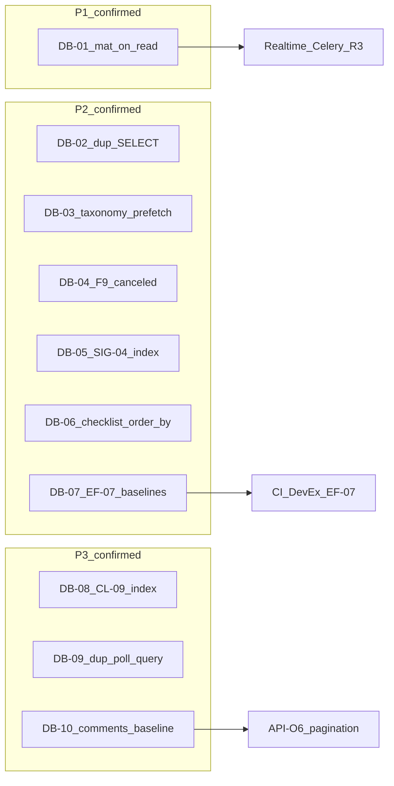
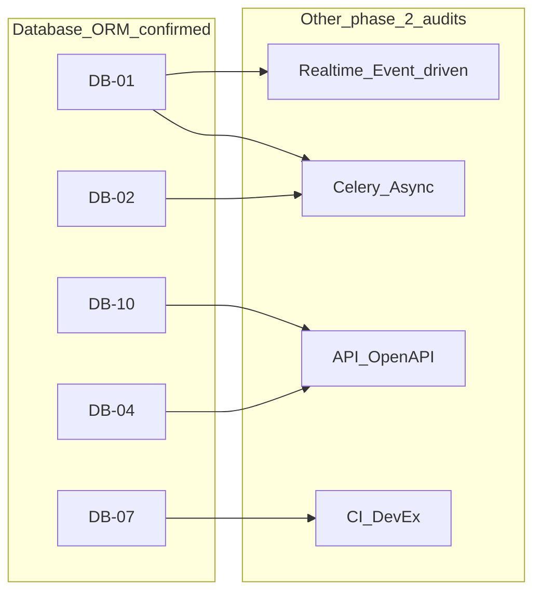

# Phase 2 — Database / ORM Consolidation

> **Post-audit note (2026-06-27):** Wave 1 scoped deliverables landed — see [`phase_2_final_roadmap.md`](./phase_2_final_roadmap.md) § Wave 1 status. **ORM-QW-01** done scoped (ROADMAP-11 DB-02/03/04/06); **MAT-01** / **DB-01**, **TS-E1**, **INDEX-01** remain open. Evidence rows below reflect the 2026-06-26 audit snapshot.

Status: consolidation report  
Date: 2026-06-26  
Mode: consolidation only — no source changes

## Sources

| Category | Files |
|----------|-------|
| Audit input | [`phase_2_database_orm_audit.md`](./phase_2_database_orm_audit.md) (DB-01–DB-10) |
| Backlog | [`phase_2_audit_backlog.md`](./phase_2_audit_backlog.md) §2 |
| Closure | [`feature_audit_closure.md`](./feature_audit_closure.md) |
| Decisions | [`feature_audit_decisions.md`](./feature_audit_decisions.md) |
| Cross-audit | [`phase_2_api_openapi_consolidation.md`](./phase_2_api_openapi_consolidation.md) (API-O6 comments angle) |
| Contract | [`AGENTS.md`](../../AGENTS.md), [`apps/api/AGENTS.md`](../../apps/api/AGENTS.md), [`apps/web/AGENTS.md`](../../apps/web/AGENTS.md) |

**Branch context:** Feature audits closed (`TODO_NOW = 0`). API/OpenAPI consolidation complete. This consolidation challenges each finding from the phase 2 Database/ORM audit against backlog §2, closure registry, decision pack, and spot-check code evidence. No `FIXED`, `WONT_FIX_NOW`, or `DECISION_CLOSED` items reopened without new direct code evidence.

---

## 1. Executive summary

The ORM layer is **MVP-ready on guarded hot reads** — signal feed, action feed, checklist feed/assignment list, and chat all show deliberate `select_related` / `Prefetch` / annotation patterns in selectors, with `query_baseline.py` ceilings on the busiest paths.

Residual risk clusters in three areas:

1. **Read-path write amplification** — every execution-feed GET unconditionally calls `ensure_visible_executions_materialized` before building the page (DB-01)
2. **Prefetch discipline gaps** — taxonomy snapshot, canceled signal detail, and checklist detail serializers defeat existing prefetch in predictable ways (DB-03, DB-04, DB-06)
3. **Regression guards** — `query_baseline.py` covers ~8 fixture shapes; signal detail, comments, mixed feed, and N-assignment materialization paths are unguarded (DB-07)

**No P0 data-integrity hole found.** Index posture is strong on feed sort paths. Aggregation integrity is FIXED (SIG-03). Index migrations for aggregation lookup (SIG-04) and template+status (CL-09) remain **deferred, evidence-confirmed** gaps from the feature audit backlog.

| Priority | Count | Themes |
|----------|-------|--------|
| **P1** | 1 | Materialization-on-read per-assignment loop (DB-01) |
| **P2** | 6 | Duplicate materialization SELECT (DB-02); taxonomy prefetch bypass (DB-03); canceled signal prefetch (DB-04 / F9); aggregation index (DB-05 / SIG-04); checklist serializer prefetch bypass (DB-06); query baseline gaps (DB-07 / EF-07) |
| **P3** | 3 | Template+status index (DB-08 / CL-09); duplicate observation poll query (DB-09); comments unpaginated + no baseline (DB-10) |

**Consolidation verdict:** 10 audit findings reviewed → **10 confirmed**, **0 false positives**, **6 duplicate merges** (backlog/API aliases), **2 deferred** (index migrations evidence-gated), **4 ignored** (intentionally excluded audit items).

---

## 2. Findings reviewed

All 10 findings from [`phase_2_database_orm_audit.md`](./phase_2_database_orm_audit.md) §2, cross-checked against [`phase_2_audit_backlog.md`](./phase_2_audit_backlog.md) §2, [`feature_audit_closure.md`](./feature_audit_closure.md), and spot-check code evidence.

| ID | Audit sev | Reclassification | Backlog alias | Consolidation notes |
|----|-----------|------------------|---------------|---------------------|
| **DB-01** | P1 | **CONFIRMED** + **DUPLICATE** | **R3 / EF-01 / CL-01 / EF-02 / OR-10** | Code-verified: [`execution_feed.py`](../../apps/api/houston/actions/execution_feed.py) L213 → [`materialization.py`](../../apps/api/houston/checklists/materialization.py) L372–428 per-assignment loop. ORM angle of cross-domain theme; **primary owner Realtime/Celery**, not ORM-only fix. EF-08/CL-04 lazy decision accepted — cost remains real. |
| **DB-02** | P2 | **CONFIRMED** | **EF-02** (sub-finding) | Code-verified: freshness check L365–368 and materialization loop L411–414 both call `_existing_occurrence_dates_for_assignment`. Distinct **S** quick win within DB-01 cluster. |
| **DB-03** | P2 | **CONFIRMED** | AI F6 / R7 adjacent | Code-verified: [`taxonomy_snapshot.py`](../../apps/api/houston/establishments/taxonomy_snapshot.py) L23–35 — `.filter().order_by()` on prefetched manager. Not a backlog duplicate; new ORM-specific finding. |
| **DB-04** | P2 | **CONFIRMED** + **DUPLICATE** | **F9** | Code-verified: [`signals/selectors.py`](../../apps/api/houston/signals/selectors.py) L143–154 canceled branch omits `_SIGNAL_LIST_PREFETCH`. Backlog §2 F9 confirmed with direct evidence. |
| **DB-05** | P2 | **CONFIRMED** + **DEFER_PHASE_2** | **SIG-04** | Lookup path confirmed in `signals/services.py`; index migration **deferred until EXPLAIN** per backlog/closure. Finding confirmed; **action evidence-gated**. |
| **DB-06** | P2 | **CONFIRMED** | — (new pattern) | Code-verified: [`checklists/api/serializers.py`](../../apps/api/houston/checklists/api/serializers.py) L342, L430 `.order_by()` defeats selector prefetch. Same anti-pattern as DB-03. |
| **DB-07** | P2 | **CONFIRMED** + **DUPLICATE** | **EF-07** | [`query_baseline.py`](../../apps/api/houston/testing/query_baseline.py) — 10 ceilings, gaps on mixed feed, N-assignment scaling, signal detail, comments. Backlog notes: establish **after** materialization strategy to avoid false positives. |
| **DB-08** | P3 | **CONFIRMED** + **DEFER_PHASE_2** | **CL-09** | `get_active_execution_for_template` confirmed; no `(template_id, status)` composite. Action deferred until EXPLAIN. |
| **DB-09** | P3 | **CONFIRMED** | — (new) | Code-verified: [`observations/selectors.py`](../../apps/api/houston/observations/selectors.py) L173–174 double `signal_ids_for_observation`. Low traffic today; compounds with OR-07 poll. |
| **DB-10** | P3 | **CONFIRMED** (split) + **DUPLICATE** partial | **API-O6** | ORM selector structure sound (`_comments_queryset` nested Prefetch). **Unpaginated fetch = API contract concern (API-O6 DUPLICATE).** ORM-specific angle: missing query-count baseline only. |

**Backlog §2 re-validation:** All 3 deferred Database/ORM themes (SIG-04, CL-09, F9) remain valid — F9 and SIG-04/CL-09 confirmed with code evidence; index actions remain evidence-gated per closure registry.

---

## 3. Confirmed findings

### DB-01 — Materialization-on-read per-assignment loop (R3 / EF-01 / CL-01)

| Field | Detail |
|-------|--------|
| **Severity** | P1 |
| **Evidence** | `build_execution_feed_page` in [`actions/execution_feed.py`](../../apps/api/houston/actions/execution_feed.py) calls `ensure_visible_executions_materialized` unconditionally; [`materialization.py`](../../apps/api/houston/checklists/materialization.py) L372–428 iterates all visible active assignments; per stale assignment: `_existing_occurrence_dates_for_assignment` SELECT + optional `materialize_execution_from_assignment` writes |
| **Why confirmed** | Feed GET is O(visible assignments) in SQL round-trips and can trigger synchronous INSERTs before the feed page is built. Work is not bounded by `page_size`. Cross-domain concern with primary owner Realtime/Celery (R3). |
| **Risk** | Latency grows with assignment library size; read requests become write-heavy when `last_materialized_at` is stale (30-min TTL) |
| **Suggested direction** | Cross-domain: batch existence checks across assignments, reduce duplicate SELECTs (DB-02), add N-assignment query-count regression test — without re-litigating lazy materialization product decision (EF-08 accepted) |
| **Dependencies** | Realtime / Event-driven (R3, CL-08); Celery / Async (EF-02); blocks meaningful EF-07 baselines |
| **Size** | L (structural decouple); ORM-only mitigations S–M |

---

### DB-02 — Duplicate occurrence-date SELECT on stale path (EF-02 sub-finding)

| Field | Detail |
|-------|--------|
| **Severity** | P2 |
| **Evidence** | [`materialization.py`](../../apps/api/houston/checklists/materialization.py) L365–368 (`_assignment_read_path_materialization_is_fresh`) and L411–414 (main loop) both call `_existing_occurrence_dates_for_assignment` |
| **Why confirmed** | Stale assignments pay 2× identical SELECT on visible occurrence dates before any write |
| **Risk** | Amplifies DB-01 cost on every feed refresh after TTL expiry |
| **Suggested direction** | Reuse freshness-check query result in the materialization loop, or batch existence lookups across assignments |
| **Dependencies** | DB-01; EF-02 |
| **Size** | S |

---

### DB-03 — Taxonomy snapshot defeats `prefetch_related`

| Field | Detail |
|-------|--------|
| **Severity** | P2 |
| **Evidence** | [`establishments/taxonomy_snapshot.py`](../../apps/api/houston/establishments/taxonomy_snapshot.py) L18–35 prefetches `activity_subjects`, then calls `.filter(active=True).order_by("normalized_name")` on each unit's related manager in the loop |
| **Why confirmed** | Django does not use the prefetch cache when `.filter().order_by()` is chained on the related manager — 1 extra query per active business unit |
| **Risk** | Observation AI pipeline input latency scales with establishment taxonomy size (BU count) |
| **Suggested direction** | Filter and sort prefetched subjects in Python, or use a filtered `Prefetch` queryset with ordering baked in |
| **Dependencies** | Celery / Async (AI F6 / R7 pipeline input build) |
| **Size** | S |

---

### DB-04 — Canceled signal detail prefetch asymmetry (F9)

| Field | Detail |
|-------|--------|
| **Severity** | P2 |
| **Evidence** | [`signals/selectors.py`](../../apps/api/houston/signals/selectors.py) — active path uses `feed_signals_for_establishment` prefetch bundle; canceled fallback branch L143–154 omits `_SIGNAL_LIST_PREFETCH`, `activity_subject`, `operational_unit`. [`signals/reporter_display.py`](../../apps/api/houston/signals/reporter_display.py) L45–58 falls back to live query on `source_observation_links` when prefetch attr absent |
| **Why confirmed** | Canceled signal detail triggers 2–4 extra queries compared to the prefetch-aware active path. Backlog F9 confirmed with direct code evidence. |
| **Risk** | Manager review of canceled/archived signals degrades at scale; asymmetry easy to miss when extending detail serializer |
| **Suggested direction** | Share the feed prefetch bundle (`_SIGNAL_LIST_PREFETCH` + reporter/media prefetches) for the canceled fallback branch |
| **Dependencies** | API / OpenAPI (detail serializer contract unchanged) |
| **Size** | S |

---

### DB-05 — Aggregation lookup lacks dedicated composite index (SIG-04)

| Field | Detail |
|-------|--------|
| **Severity** | P2 (action deferred) |
| **Evidence** | `find_active_signal_for_aggregation` in [`signals/services.py`](../../apps/api/houston/signals/services.py) filters `establishment_id` + four taxonomy FKs + `issue_focus` + `status__in=ACTIVE` + `order_by(-last_activity_at).first()`. `Signal.Meta` has per-dimension indexes and partial unique constraint `signal_unique_active_aggregation_key` (SIG-03 FIXED) |
| **Why confirmed** | Pipeline hot path may not use an index aligned to the full equality filter plus sort. Partial unique constraint primarily enforces integrity; read latency benefit unvalidated. |
| **Risk** | Aggregation latency and `select_for_update` lock contention on busy establishments as active signal count grows |
| **Suggested direction** | Validate with `EXPLAIN ANALYZE` at pilot volume **before** any migration; consider dedicated partial composite index on aggregation key columns WHERE active statuses |
| **Dependencies** | Celery / Async (C-03 retry policy); SIG-03 integrity constraint |
| **Size** | M (evidence-gated) |

---

### DB-06 — Checklist detail serializers bypass prefetched relations via `.order_by()`

| Field | Detail |
|-------|--------|
| **Severity** | P2 |
| **Evidence** | Selectors prefetch: `get_checklist_template_for_detail` ([`checklists/selectors.py`](../../apps/api/houston/checklists/selectors.py) L271), `get_checklist_execution_for_detail` (L180). Serializers re-query: [`checklists/api/serializers.py`](../../apps/api/houston/checklists/api/serializers.py) L342, L430 chain `.order_by("position", "created_at")` on related managers |
| **Why confirmed** | Django does not use the prefetch cache when `.order_by()` is chained — +1 query per template or execution detail response. Same anti-pattern as DB-03. |
| **Risk** | Template/execution detail pages regress silently as task count grows; prefetch investment in selectors is wasted |
| **Suggested direction** | Sort in Python from the prefetched cache, or encode ordering in the `Prefetch` queryset in selectors |
| **Dependencies** | None |
| **Size** | S |

---

### DB-07 — Query-count baseline coverage gaps (EF-07)

| Field | Detail |
|-------|--------|
| **Severity** | P2 |
| **Evidence** | [`houston/testing/query_baseline.py`](../../apps/api/houston/testing/query_baseline.py) — 10 ceiling constants. Covered: signal feed, execution feed (empty / 3 actions / 1 checklist), checklist assignment list, chat, `build_pipeline_input`. **Missing:** mixed action+checklist feed page, N-assignment materialization scaling, signal detail/commands, comments list, notifications list, action detail |
| **Why confirmed** | CI catches only narrow fixture shapes; per-assignment loop growth (DB-01/DB-02) and serializer prefetch regressions (DB-04/DB-06) would merge undetected |
| **Risk** | Silent query inflation on `main` as domains evolve |
| **Suggested direction** | Extend baselines for highest-traffic unguarded paths first: materialization scaling, signal detail, comments multi-item fixture. Coordinate timing with materialization strategy (backlog EF-07 note) |
| **Dependencies** | DB-01 strategy; CI / DevEx |
| **Size** | S–M |

---

### DB-08 — Checklist template + status lookup: no composite index (CL-09)

| Field | Detail |
|-------|--------|
| **Severity** | P3 (action deferred) |
| **Evidence** | `get_active_execution_for_template` in [`checklists/selectors.py`](../../apps/api/houston/checklists/selectors.py) L41–52 filters `checklist_template` + `status__in=ACTIVE_EXECUTION_STATUSES`. `ChecklistExecution.Meta` has `checklist_exec_feed_idx` and FK auto-index on `checklist_template_id` only |
| **Why confirmed** | Template delete guard and permission hints filter on status without a template+status-aligned index |
| **Risk** | Template library growth slows management list and delete-guard paths |
| **Suggested direction** | `EXPLAIN` at realistic volume before migration; partial index on `(checklist_template_id)` WHERE active statuses if justified |
| **Dependencies** | None |
| **Size** | S (evidence-gated) |

---

### DB-09 — Observation processing status: duplicate signal-ID query

| Field | Detail |
|-------|--------|
| **Severity** | P3 |
| **Evidence** | [`observations/selectors.py`](../../apps/api/houston/observations/selectors.py) L173–174: `get_observation_processing_status` calls `signal_ids_for_observation`, then `signal_summaries_for_observation` re-calls it internally (L87) |
| **Why confirmed** | Polling endpoint runs the identical `CandidateSignal` ID lookup twice per request |
| **Risk** | Low today (single-observation poll); compounds under concurrent client polling (OR-07) |
| **Suggested direction** | Compute signal IDs once and pass them into the summary builder |
| **Dependencies** | Realtime / Event-driven (OR-07 poll frequency) |
| **Size** | S |

---

### DB-10 — Comments list: sound prefetch, unpaginated, no query budget

| Field | Detail |
|-------|--------|
| **Severity** | P3 |
| **Evidence** | `_comments_queryset` in [`comments/selectors.py`](../../apps/api/houston/comments/selectors.py) uses nested `Prefetch` for mentions and replies. Views in [`comments/api/views.py`](../../apps/api/houston/comments/api/views.py) serialize all comments with no pagination (API-O6 cross-ref). No `query_baseline` import in comments test modules |
| **Why confirmed** | ORM structure avoids N+1, but endpoint fetches unbounded comment tree with no regression guard. Unpaginated overfetch is API-O6; missing baseline is ORM-specific. |
| **Risk** | High-comment signals or action threads become heavy reads without CI signal |
| **Suggested direction** | Add query-count baseline for multi-comment / multi-reply fixture; pagination is API contract concern — coordinate with API-O6 |
| **Dependencies** | API / OpenAPI (API-O6) |
| **Size** | S (baseline); pagination L (API domain) |

---

## 4. Reclassified / duplicate / false-positive findings

### False positives

**None.** All 10 audit findings (DB-01–DB-10) are backed by code evidence verified in this consolidation pass.

### Duplicates merged

| Canonical ID | Absorbed backlog / audit IDs | Relationship |
|--------------|------------------------------|--------------|
| **DB-01** | R3, EF-01, CL-01, EF-02, OR-10 | ORM angle of materialization-on-read; primary owner Realtime/Celery |
| **DB-02** | EF-02 (sub) | Per-assignment duplicate SELECT within DB-01 cluster |
| **DB-04** | F9 | Same finding; backlog §2 confirmed with selector evidence |
| **DB-05** | SIG-04 | Same finding; index action deferred until EXPLAIN |
| **DB-07** | EF-07 | Same finding; baseline timing tied to materialization strategy |
| **DB-08** | CL-09 | Same finding; index action deferred until EXPLAIN |
| **DB-10** (pagination) | API-O6 | Unpaginated overfetch is API contract; ORM baseline is distinct slice |

### Deferred (confirmed gap, action waits)

| ID | Status | Notes |
|----|--------|-------|
| **DB-05 / SIG-04** | DEFER_PHASE_2 | Index migration requires `EXPLAIN ANALYZE` at pilot volume — backlog §2 explicit defer |
| **DB-08 / CL-09** | DEFER_PHASE_2 | Same — volume dev faible, decision index after EXPLAIN |

### Needs more evidence

| Topic | Why deferred |
|-------|--------------|
| Materialization latency at N≥20 assignments | No automated scaling test; dev volume low |
| SIG-04 / CL-09 index benefit | No `EXPLAIN ANALYZE` captured |
| Checklist feed `Count` annotation cost | GROUP BY overhead vs plain select — no explain captured |
| `apply_pipeline_output` total query budget | Async path; Celery audit scope |
| View-layer ORM drift | Transverse signal from backlog §Signaux transverses; API consolidation flagged NEEDS_MORE_EVIDENCE |
| Production assignment counts / feed p95 | Not measurable in dev audit |

### Ignored now

| Item | Rationale |
|------|-----------|
| `aggregation_eval.py` eval N+1 | Offline/metrics path only |
| Notification validator O(n) in `recipients.py` | Async write path; needs production traffic evidence |
| Dual `Prefetch` on `source_observation_links` in signal feed | Deliberate tradeoff for different `to_attr` filters |
| Notification list `count_unread_notifications` extra COUNT | Minor; needs traffic evidence |

### Items explicitly not reopened

| ID | Closure status | Why not reopened |
|----|----------------|------------------|
| **CL-01a** / EF-01a | WONT_FIX_NOW | Early-exit `.exists()` not a gain; ORM cost captured in DB-01 |
| **SIG-03** | FIXED | Partial unique constraint on active aggregation key |
| **ACT-01** | FIXED | Action feed assignee prefetch + query baseline |
| **CL-02** | FIXED | Assignment list prefetch + baseline |
| **EF-08 / CL-04** | DECISION_OPEN (lazy accepted) | Product default: lazy materialization; DB-01 documents ORM cost without re-litigating |
| **EF-09** | WONT_FIX_NOW | Defense-in-depth feed section drop |

---

## 5. Cross-audit dependencies

| Confirmed item | Depends on / blocks | Other phase 2 audit |
|----------------|---------------------|---------------------|
| **DB-01**, **DB-02** | Materialization strategy, batching | Realtime / Event-driven (R3), Celery (EF-02, CL-08) |
| **DB-07** | Meaningful baselines after materialization path stabilizes | CI / DevEx (EF-07) |
| **DB-03** | Pipeline input build cost | Celery / Async (AI F6/R7) |
| **DB-05** | Pipeline write hot path | Celery / Async (C-03) |
| **DB-04** | Detail serializer read cost | API / OpenAPI (F9 cross-ref) |
| **DB-10** | Unpaginated overfetch | API / OpenAPI (API-O6) |
| **DB-09** | Poll amplification | Realtime (OR-07) |

**Recommended next phase 2 audit:** Realtime / Event-driven — R3 materialization decoupling is primary owner for DB-01 structural fix.

---

## 6. Top priorities

### P1 — must address before large-scale evolution

1. **DB-01** — materialization-on-read ORM cost (coordinate with Realtime/Celery; ORM mitigations + scaling test in parallel)

### P2 — important, not blocking MVP

2. **DB-07** — extend query-count baselines (after or in parallel with DB-01 mitigations)
3. **DB-02** — eliminate duplicate SELECT on stale path (quick win)
4. **DB-03** — taxonomy snapshot prefetch remediation candidate
5. **DB-04 / F9** — canceled signal prefetch parity
6. **DB-06** — checklist detail serializer prefetch remediation candidate
7. **DB-05 / SIG-04** — EXPLAIN then decide index (evidence-gated)

### P3 — polish / hygiene

8. **DB-09** — dedupe poll query (S)
9. **DB-10** — comments query baseline (S); pagination via API-O6
10. **DB-08 / CL-09** — EXPLAIN then decide index (evidence-gated)

**Top 3 to plan first:** DB-01 (+ DB-02 quick win) → DB-07 baselines → DB-03/DB-04/DB-06 prefetch remediation candidates (batchable S items).

### Quick wins

DB-02, DB-03, DB-04, DB-06, DB-09

### Structural issues to plan later

- DB-01 decoupling — Realtime/Celery L; primary owner not ORM-only
- DB-05 index strategy — M, evidence-gated
- DB-10 comments pagination — L, API-O6 domain

### Not worth fixing now

- `aggregation_eval` N+1 (offline only)
- Dual signal-link prefetch tradeoff on feed
- Notification unread COUNT on list endpoint
- CL-09 / DB-08 until `EXPLAIN` confirms seq scan

---

## 7. What is safe today

- **Signal feed reads** — `feed_signals_for_establishment` with dual `Prefetch` + `aggregation_count` annotation; baseline ≤8 queries for 2 items with flat-growth guard
- **Action feed reads** — `_ACTION_ASSIGNEE_PREFETCH` + `select_related` on list/detail paths; execution feed baseline ≤9 for 3 actions
- **Checklist feed reads** — `checklist_execution_feed_queryset` with `Count` annotations; `_progress_counts` in feed serializers consumes annotations
- **Checklist assignment list** — `Exists`/`Count` annotations + in-progress execution prefetch; baseline ≤7 for 12 assignments
- **Chat list** — batched latest messages via `get_latest_messages_by_conversation_ids`; flat-growth guard on conversations
- **Execution feed indexes** — `action_exec_feed_sort_idx`, `checklist_exec_feed_idx`, `action_assignee_member_idx` align with visibility and sort filters
- **Materialization integrity** — partial unique on `(checklist_assignment, occurrence_date)`; `last_materialized_at` freshness skip tested
- **Comments selector structure** — nested prefetch design in `_comments_queryset` avoids N+1 even though pagination is absent
- **Selector boundary** — `checklists/selectors.py` does not import materialization
- **Aggregation integrity** — SIG-03 partial unique constraint FIXED
- Feature closure registry: `TODO_NOW = 0`; CL-01a not reopened

---

## 8. What should wait for another audit

| Domain | Items | Relation to ORM |
|--------|-------|-----------------|
| **Realtime / Event-driven** | R3 decouple, EF-08 lazy vs proactive | Primary owner for DB-01 structural fix |
| **Celery / Async** | CL-08 horizon sharding, EF-02 batching, C-03 retry | Materialization timing, pipeline writes |
| **API / OpenAPI** | API-O6 comments pagination | DB-10 overfetch angle |
| **CI / DevEx** | EF-07 baseline CI integration | DB-07 enforcement |
| **Transverse** | View-layer ORM drift | Not examined in DB audit; API consolidation flagged NEEDS_MORE_EVIDENCE |

---

## 9. Open questions

1. At what visible-assignment count does DB-01 become user-visible latency (N≥20 unbenchmarked)?
2. Should EF-07 baselines be added before materialization decoupling, or after to avoid churn/false positives?
3. SIG-04 / CL-09 — what row counts trigger mandatory `EXPLAIN ANALYZE` in pilot?
4. DB-10 — ORM baseline only now, or coordinate pagination with API-O6 first?
5. Does partial unique constraint `signal_unique_active_aggregation_key` already serve read path adequately (DB-05)?
6. View-layer ORM drift (`comments/api/views.py`, `checklists/api/views.py`, `establishments/api/views.py`) — confirm in API follow-up or backend architecture pass?

---

## Summary

| Metric | Count |
|--------|-------|
| Audit findings reviewed | 10 (DB-01–DB-10) |
| Confirmed | 10 |
| False positives | 0 |
| Duplicate merges (backlog/API aliases) | 6 canonical groups |
| Deferred (action evidence-gated) | 2 (DB-05, DB-08) |
| Ignored now | 4 |
| Needs more evidence | 6 topics |
| P1 confirmed | 1 |
| P2 confirmed | 6 |
| P3 confirmed | 3 |

**Top 3 priorities to plan first:** DB-01 (+ DB-02) → DB-07 baselines → DB-03/DB-04/DB-06 prefetch remediation candidates.

---

**Changed:** Renamed `docs/audits/phase_2_data_ormi_consolidation.md` → `docs/audits/phase_2_database_orm_consolidation.md`; replaced implementation-oriented “prefetch fix(es)” wording with audit-only “prefetch remediation candidate(s)” in §6 and Summary

**Validated:** Findings, priorities, and reclassification statuses unchanged; no application source files modified; closed registry items not reopened

**Risks / not verified:** `make verify` not run; no runtime `EXPLAIN ANALYZE` or production load profiling; query-count baseline numbers not re-measured; materialization cost at high assignment counts inferred from code structure, not benchmarked
