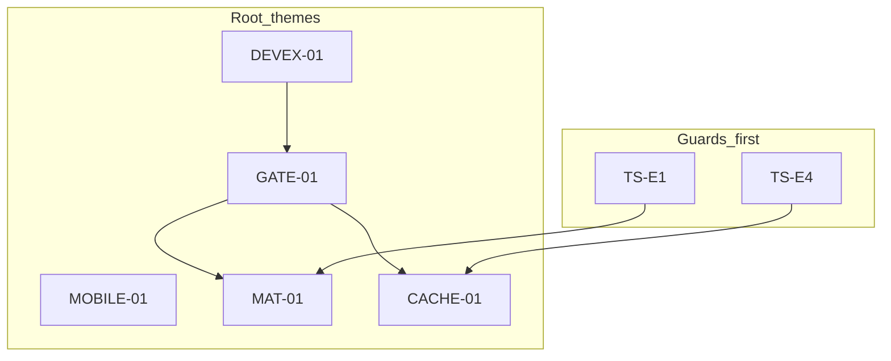
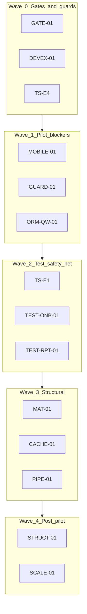

# Phase 2 Final Roadmap

Status: consolidated roadmap (living — Wave 0 scoped deliverables complete)  
Date: 2026-06-26 (Wave 0 closure pass: 2026-06-27)  
Mode: audit consolidation + Wave 0 status tracking

## Sources

| Category | Files |
|----------|-------|
| Consolidations | All nine `phase_2_*_consolidation.md` under `docs/audits/` |
| Closure / decisions | [`feature_audit_closure.md`](./feature_audit_closure.md), [`feature_audit_decisions.md`](./feature_audit_decisions.md) |
| Backlog | [`phase_2_audit_backlog.md`](./phase_2_audit_backlog.md) |
| Contract | [`AGENTS.md`](../AGENTS.md), [`apps/api/AGENTS.md`](../../apps/api/AGENTS.md), [`apps/web/AGENTS.md`](../../apps/web/AGENTS.md) |

**Method:** Deduplicated findings from Phase 2 consolidations only. No re-audit. Spot-check code only where consolidations were unclear — none contradicted.

## Wave 0 status (2026-06-27)

**Wave 0 scoped deliverables complete** — not “Wave 0 fully safe.” Landed: ROADMAP-01 (GATE-01 core CI gates), ROADMAP-02/03 (DEVEX-01a docs checklist, DEVEX-01b env template), ROADMAP-04 (TS-E4 invalidation guards + operational contract).

**Still open (explicit — do not treat as Wave 0 closure):** **CI-E1** runtime mode-switch trap; **CI-E2** compose env passthrough; **CI-E6** / **CA-E4** beat opt-in; **CI-E8** `types.ts` gate; **CI-E9** lint vs `verify` asymmetry; **CACHE-01** (Wave 3 architecture). Shared-dev remains **discipline-sensitive, not team-safe**.

**Next:** Wave 1 — **MOBILE-01**, **GUARD-01**, **ORM-QW-01**. Wave 2 guard **TS-E1** before MAT-01 decouple work.

---

## 1. Executive summary

Houston Phase 2 audits confirm the **operational core is MVP-sound**: REST tenant isolation (404), backend RBAC enforcement, post-commit realtime/notifications, TanStack establishment purge, and thin Celery task boundaries. Feature audit closure is complete (`TODO_NOW = 0`). **No P0 security bypass** was found across API, database, realtime, Celery, cache, frontend, PWA, CI/DevEx, or test-strategy audits.

Residual work is **not** 90+ independent tasks. It clusters into **five root themes** that drove most duplicate findings across consolidations:

| Root theme | Canonical ID | Consolidated from | Pilot impact |
|------------|--------------|-------------------|--------------|
| Materialization-on-read | **MAT-01** | RT-E1, CA-E1, DB-01, EF-02, EF-07, OR-10 | Supervision freshness + feed latency at scale |
| CI / contract gates | **GATE-01** | API-O1, CI-E3, CI-E8, PWA-E5, TS-E2, API-O8 | Green CI ≠ safe merge during Phase 2 fixes |
| Cache / WS invalidation drift | **CACHE-01** | TQ-E1, TQ-E2, RT-E5, NR-09, TS-E4 | Silent stale UI after refactors |
| Field mobile readiness | **MOBILE-01** | PWA-E1–E8, FE-E5 | Connected browser OK; multi-site + long forms fragile |
| DevEx / shared-dev traps | **DEVEX-01** | CI-E1, CI-E4, CI-E6, CA-E4 | Remote DB mutation risk; beat silently off |

Secondary themes (P2, incremental or post-pilot): onboarding test gap (**TEST-ONB-01**), report flow tests (**TEST-RPT-01**), permission hint / route guard UX (**GUARD-01**), ORM prefetch quick wins (**ORM-QW-01**), LLM retry policy (**PIPE-01**), backend structural debt (**STRUCT-01**).

**Top 7 priorities** (Wave 0 scoped items done — active ordering from Wave 1 onward):

1. ~~**GATE-01**~~ **Done (scoped)** — core CI gates landed; follow-ups **CI-E8**, **CI-E9** open
2. ~~**DEVEX-01** (01a/01b)~~ **Done (scoped)** — mode-switch checklist + env template; **CI-E1** runtime, **CI-E6** / **CA-E4** open
3. ~~**TS-E4**~~ **Done** — parity guards + operational contract; **TS-E1** remains Wave 2 before MAT-01
4. **MOBILE-01** — **Next active P1** — field blockers: offline UX, Profile establishment switch, sticky CTAs, ErrorBoundary
5. **TEST-ONB-01** — Onboarding wizard smoke tests before OB-07 / wizard refactors
6. **MAT-01** — Materialization timing strategy (measure → decide lazy vs decouple)
7. **CACHE-01** — Invalidation registry + key single source of truth (Wave 3; TS-E4 guard landed, architecture open)

---

## 2. Final readiness verdict

**Product pilot (connected mobile browser, mono-establishment):** Yes, with documented gaps (MOBILE-01, scale).

**Developer experience (local workflow, CI, shared-dev):** Workable with caveats — **Wave 0 scoped deliverables complete, not team-safe-by-default**. A developer who follows [`INSTALL_MAC.md`](../../INSTALL_MAC.md) end-to-end on local Docker can work productively; README-only joiners and agents still need explicit guardrails. **Shared-dev is not team-safe:** the runtime mode-switch trap (**CI-E1**) can leave running containers on remote Postgres while compose guards pass; Celery beat is opt-in (**CI-E6** / **CA-E4**). Wave 0 landed docs checklist (DEVEX-01a) and fixed env template (DEVEX-01b / CI-E4) — runtime guard and scheduler discipline remain open.

| Dimension | Verdict | Evidence |
|-----------|---------|----------|
| Security / RBAC (runtime) | **Ready** | `TODO_NOW = 0`; `test_*_tenant_isolation_api.py` suites; hints server-sourced |
| Operational loop (observe → signal → action → feed) | **Ready at dev volume** | Post-commit WS; materialization idempotence tested |
| DevEx / shared-dev | **Workable, discipline-sensitive** | Mode-switch checklist + fixed `.env.shared-dev.example` (Wave 0); **CI-E1** runtime trap open; **CI-E6** / **CA-E4** beat off by default — **not team-safe** |
| CI merge confidence | **Partially ready** | GATE-01 core: Django check, migrations, schema diff, `npm run build` in CI; **CI-E8** `types.ts` ungated; **CI-E9** lint vs `verify` asymmetry |
| Multi-establishment field use | **Gap** | No Profile establishment switch (PWA-E2) |
| Patchy network UX | **Gap** | No offline/network banner (PWA-E1) |
| Installed PWA | **Defer** | Favicon/SW update UI incomplete; PNG/Apple meta product-gated |
| Scale (N assignments, multi-tenant beat) | **Defer** | MAT-01 acceptable at pilot mono-shift per EF-08 default |

Qualitative scores retained from consolidations (not re-measured): PWA **64/100** pilot band; DevEx **68/100** following `INSTALL_MAC.md` / **~50/100** for README-only joiners. These scores describe onboarding friction, not shared-dev safety — shared-dev remains discipline-sensitive and **not team-safe** even after Wave 0 scoped deliverables.

**What is pilot-ready today (product):** connected mobile browser for mono-establishment field use; backend-enforced RBAC; operational realtime spine; lazy materialization with read-path safety net; Lot1 in-app notifications.

**What is workable but not safe-by-default (DevEx):** local dev on Docker when `INSTALL_MAC.md` is followed; shared-dev only with explicit mode-switch procedure (`make down` then correct up target), aligned secrets, and scheduler discipline — partial guardrails exist (`assert-local-dev-db.sh`, `shared_dev_database.md`) but **CI-E1** runtime trap and beat opt-in remain.

**What is not safe to assume:** CI green implies full contract parity (**CI-E8** `types.ts` still ungated); shared-dev is team-safe; multi-site staff without Profile switch; structural materialization changes without **TS-E1** baselines; **CACHE-01** resolved because **TS-E4** guards landed.

---

## 3. Top consolidated priorities

| Rank | ID | Why first | Wave | Status |
|------|-----|-----------|------|--------|
| 1 | **GATE-01** | Every Phase 2 fix touches API, types, or build artifacts | 0 | Done (scoped); CI-E8/E9 open |
| 2 | **DEVEX-01** | Data-integrity risk on shared Neon if ignored | 0 | 01a/01b done; CI-E1/E6 open |
| 3 | **TS-E4** + **TS-E1** | Cheap guards before expensive MAT-01 / CACHE-01 refactors | 0–2 | TS-E4 done; TS-E1 Wave 2 |
| 4 | **MOBILE-01** | Field pilot blockers unrelated to backend scale | 1 | **Next** |
| 5 | **TEST-ONB-01** | Largest untested user journey | 2 | Open |
| 6 | **MAT-01** | Highest cross-audit structural risk; needs measurement first | 3 | Open |
| 7 | **CACHE-01** | Blocks safe frontend evolution after guards land | 3 | Open (TS-E4 guard only) |

---

## 4. Roadmap by waves

### Wave 0 — Gates and guards (before risky code changes)

Wave 0 scoped deliverables complete (2026-06-27). Follow-ups **CI-E1**, **CI-E2**, **CI-E8**, **CI-E9**, **CI-E6** / **CA-E4**, and **CACHE-01** remain open — not Wave 1 blockers unless noted on a card.

---

### ROADMAP-01 — GATE-01: CI contract and build parity

- **Priority:** P1
- **Source findings:** API-O1, CI-E3, CI-E8, PWA-E5, TS-E2, API-O8
- **Root problem:** GitHub Actions runs ruff + pytest + frontend lint/test/typecheck only. `make verify` additionally checks Django check, migrations, `schema.yml` diff, and `npm run build`. Generated `types.ts` is ungated everywhere.
- **Why it matters:** Phase 2 refactors can merge with stale OpenAPI, broken migrations, or PWA build failures while CI stays green.
- **Suggested direction:** Add CI steps mirroring `backend-migrations-check`, `backend-schema-check`, `manage.py check`, `npm run build`; optionally `web-api-generate` + `git diff` on `types.ts`. Unify `web-lint` into verify or document explicit pre-merge checklist.
- **Dependencies:** None — blocks ROI of API-O8 contract tests and all CACHE-01 work
- **Tests or gates needed first:** None
- **Size:** M
- **Recommended wave:** 0
- **Status:** Done (Wave 0, 2026-06-26)
- **Changed:** `.github/workflows/ci.yml` (+5 steps: Django check, migrations check, OpenAPI schema diff, frontend build); `docs/engineering/testing.md` CI vs local gates table
- **Validated:** `npm run build` OK; `make web-lint web-test web-typecheck` OK; `make backend-check` OK (check, migrations, schema diff, pytest via Docker)
- **Risks:** `web-lint` asymmetry (CI runs lint, `verify` does not — CI-E9); `types.ts` still ungated (CI-E8); Postgres 16 (CI) vs 17 (local — CI-E5)
- **Follow-up:** CI-E8 — gate `types.ts` in frontend CI job; CI-E9 — lint vs verify documentation / optional `web-check` alignment

---

### ROADMAP-02 — DEVEX-01a: Shared-dev mode-switch trap

- **Status:** **Done** (Wave 0 — docs/guardrails only; runtime trap not closed)
- **Priority:** P1
- **Source findings:** CI-E1
- **Root problem:** `assert-local-dev-db.sh` validates compose config from `.env`, not running container env. After `make shared-dev-up`, switching `.env` back to local without `make down` + recreate leaves containers on remote Postgres while guards pass.
- **Why it matters:** Tests/migrations may mutate shared team data on Neon with false local-only confidence.
- **Suggested direction:** Docs/guardrails first: mandatory mode-switch checklist in `shared_dev_database.md`, `INSTALL_MAC.md`, and Cursor rules (`30-docker-orbstack.mdc`). Optional later: runtime guard comparing container vs compose `POSTGRES_HOST`.
- **Dependencies:** None
- **Tests or gates needed first:** None
- **Size:** S–M (docs first) / L (optional runtime guard)
- **Recommended wave:** 0
- **Changed:** Mode-switch checklist + guard-limit note in [`shared_dev_database.md`](../../docs/engineering/shared_dev_database.md); callout in [`INSTALL_MAC.md`](../../INSTALL_MAC.md); guardrails in [`.cursor/rules/30-docker-orbstack.mdc`](../../.cursor/rules/30-docker-orbstack.mdc).
- **Validated:** Docs links/commands reviewed against Makefile and AGENTS/Cursor rules; `make infra-check` sanity (guard scripts unchanged).
- **Risks / follow-up:** Runtime trap still possible if checklist ignored; optional runtime guard still open — shared-dev onboarding template fixed in DEVEX-01b.

---

### ROADMAP-03 — DEVEX-01b: Broken shared-dev env template

- **Status:** **Done** (Wave 0 — template fix only)
- **Priority:** P1
- **Source findings:** CI-E4
- **Root problem:** `.env.shared-dev.example` uses invalid YAML interpolation for `HOUSTON_AUTH_TOKEN_PEPPER`; missing salt vars required by `shared_dev_database.md`.
- **Why it matters:** Copy-paste onboarding for shared-dev produces broken auth config; agents propagate invalid syntax.
- **Suggested direction:** Fix pepper line to dotenv `KEY=value`; add salt vars with alignment comments.
- **Dependencies:** None
- **Size:** S
- **Recommended wave:** 0
- **Changed:** Fixed dotenv syntax for `HOUSTON_AUTH_TOKEN_PEPPER`; added `HOUSTON_AUTH_TOKEN_SALT` and `HOUSTON_CHAT_WS_TICKET_SALT` with 1Password alignment comments in [`.env.shared-dev.example`](../../.env.shared-dev.example).
- **Validated:** `make infra-check`; `docker compose --env-file .env.shared-dev.example` merged config; `assert-shared-dev-compose.sh` on template copy; no `KEY: ${` lines remain.
- **Risks / follow-up:** CI-E2 compose passthrough gap (`HOUSTON_REALTIME_WS_*`, throttle, beat schedules) unchanged; devs with existing broken `.env.shared-dev` must fix pepper line manually; CI-E1 runtime trap still open (DEVEX-01a docs only).

---

### ROADMAP-04 — TS-E4: Invalidation key parity guard

- **Priority:** P1
- **Status:** **CLOSED** (Wave 0)
- **Source findings:** TQ-E1, TQ-E2, RT-E5, TS-E4
- **Root problem:** `query-invalidation.ts` hardcodes key arrays; `*QueryKeys` factories in `features/*/api.ts` are not imported. Tests lock literals, not factory parity. No machine-readable link between backend emitters and frontend handlers.
- **Why it matters:** Any CACHE-01 refactor can cause silent stale UI — mutations succeed, mounted queries never invalidate.
- **Suggested direction:** Parity test importing `*QueryKeys` factories and asserting invalidation helper prefixes match. Add before any invalidation key refactor.
- **Dependencies:** None — prerequisite for CACHE-01
- **Tests or gates needed first:** This *is* the guard
- **Size:** S
- **Recommended wave:** 0
- **Changed:** Added [`contracts/operational-realtime-invalidation.json`](../../contracts/operational-realtime-invalidation.json) (15 operational events); [`operational_invalidation_events.py`](../../apps/api/houston/realtime/operational_invalidation_events.py); frontend loader [`operational-invalidation-contract.ts`](../../apps/web/src/features/realtime/lib/operational-invalidation-contract.ts) with `@contracts` alias (Vite + tsconfig); triple guard tests — `query-invalidation-parity.test.ts`, `operational-invalidation-contract.test.ts`, `test_operational_invalidation_registry.py`, `test_operational_invalidation_emitter_parity.py` (AST emitters → contract); notification constants aligned via realtime loader; doc pointer in `realtime_domain.md`.
- **Validated:** Targeted frontend tests + `npm run typecheck`; backend `test_operational_invalidation_registry.py` + `test_operational_invalidation_emitter_parity.py`.
- **Risks / follow-up:** Handler runtime unchanged (`apply-operational-invalidation.ts`); CACHE-01 (derive keys from factories + domain wrappers from registry) remains Wave 3. AST emitter scan covers string literals and known notification constants only — dynamic reason variables outside wrapper call sites would not be detected.

---

### Wave 1 — Pilot blockers and quick wins

---

### ROADMAP-05 — MOBILE-01a: Offline and network-failure UX

- **Priority:** P1
- **Source findings:** PWA-E1
- **Root problem:** No `navigator.onLine` listeners, no global offline banner. `apps/web/AGENTS.md` and rule 21 require explicit offline/network states. Processing poll continues on network loss with generic API errors only.
- **Why it matters:** Field teams on patchy connectivity see opaque failures; violates stated mobile/PWA contract. Not an authorization issue — a trust issue.
- **Suggested direction:** Global network-state layer (banner/chip) wired to `navigator.onLine` and failed query/mutation detection; field-friendly `TerrainErrorState` copy. **No** durable offline mutation queue without product approval.
- **Dependencies:** Independent; TS-E10 PWA tests defer until this exists
- **Tests or gates needed first:** None
- **Size:** M
- **Recommended wave:** 1

---

### ROADMAP-06 — MOBILE-01b: Profile establishment switch

- **Priority:** P1
- **Source findings:** PWA-E2, FE-E5
- **Root problem:** `switchEstablishment` exists on `/select-establishment` and `/app` workspace only. Terrain Profile displays establishment name with no switch entry.
- **Why it matters:** Multi-site field staff cannot discoverably change establishment from daily terrain UI.
- **Suggested direction:** Add Profile entry routing to existing selector; reuse `switchEstablishment` + `purgeNonAuthQueries`. Coordinate establishment-scoped remount or local state reset (FE-E5).
- **Dependencies:** TQ-E9 bootstrap parity on cross-tab switch
- **Tests or gates needed first:** None
- **Size:** S
- **Recommended wave:** 1

---

### ROADMAP-07 — MOBILE-01c: Terrain ErrorBoundary

- **Priority:** P2
- **Source findings:** PWA-E7
- **Root problem:** No React ErrorBoundary on terrain shell. Uncaught render errors produce white screen with no recovery.
- **Why it matters:** Field-usage production blocker — not installability. Any bad data shape blocks the shift until force-refresh.
- **Suggested direction:** Wrap terrain shell with ErrorBoundary rendering `TerrainErrorState`-style recovery (reload / home).
- **Dependencies:** None
- **Size:** S
- **Recommended wave:** 1

---

### ROADMAP-08 — MOBILE-01d: Sticky primary actions on report and checklist

- **Priority:** P2
- **Source findings:** PWA-E8
- **Root problem:** Report submit and checklist cancel scroll off-screen on long forms/lists. Action create already uses `TerrainStickyFooter`.
- **Why it matters:** Field-usage production blocker for long observation reports and large checklists.
- **Suggested direction:** Move report submit to `TerrainStickyFooter`; pin checklist cancel above safe-area inset. Reference `action-create-page.tsx` pattern.
- **Dependencies:** TEST-RPT-01 when touching report layout
- **Size:** S
- **Recommended wave:** 1

---

### ROADMAP-09 — MOBILE-01e: PWA install trust + reconnect visibility

- **Priority:** P2
- **Source findings:** PWA-E3 (engineering slice), PWA-E4 (banner slice)
- **Root problem:** Broken favicon reference; silent SW updates; operational WS reconnects with no user feedback (chat has banner).
- **Why it matters:** Trust erosion even in browser-first pilot; users unsure if data is fresh after background tab.
- **Suggested direction:** Fix favicon; wire `registerSW` update prompt; add terrain reconnect chip mirroring chat. **Product-gated:** PNG/Apple meta when home-screen install is required. **Separate:** comment reconnect sweep (NR-08/TQ-E4) — do not bundle.
- **Dependencies:** GATE-01 for build CI (PWA-E5)
- **Size:** S
- **Recommended wave:** 1

---

### ROADMAP-10 — GUARD-01: Route guards and hint UX alignment

- **Priority:** P2
- **Source findings:** FE-E3, FE-E4 (route slice), API-O5, F8, FE-E8, FE-02, FE-03, TS-E9
- **Root problem:** `/checklists/new` and `/team` reachable without bootstrap hint guards; Staff `can_create_action=true` does not reflect free/self-assigned/non-linked constraints (API enforces via 400).
- **Why it matters:** Not security bypass — UX frustration and support burden. Inconsistent with action-create and execution-create-menu patterns.
- **Suggested direction:** Page guards mirroring `action-create-page` / `team-invite-page` patterns. Backend-first finer bootstrap hints (API-O5); interim friendly 400 mapping on create pages. Denied-case page tests (TS-E9) before guard PRs.
- **Dependencies:** TS-E9 denied-case tests recommended first
- **Size:** S (route guards) / M (backend hints)
- **Recommended wave:** 1

---

### ROADMAP-11 — ORM-QW-01: Prefetch and duplicate SELECT quick wins

- **Priority:** P2
- **Source findings:** DB-02, DB-03, DB-04/F9, DB-06
- **Root problem:** Materialization stale path runs duplicate `_existing_occurrence_dates_for_assignment` SELECT; taxonomy snapshot and checklist serializers defeat prefetch via `.filter().order_by()` on related managers; canceled signal detail omits prefetch bundle.
- **Why it matters:** Amplifies MAT-01 cost; wasted prefetch investment; manager review of canceled signals degrades.
- **Suggested direction:** Reuse freshness-check query in materialization loop (DB-02); filter/sort in Python or filtered `Prefetch` (DB-03, DB-06); share feed prefetch bundle for canceled signal detail (DB-04).
- **Dependencies:** Independent of MAT-01 strategy — safe incremental wins
- **Size:** S each
- **Recommended wave:** 1

---

### ROADMAP-12 — HYGIENE-01: Docs, dead code, agent guardrails

- **Priority:** P2
- **Source findings:** API-O7/OB-05, CI-E7, CI-E9, CI-E6, RT-E4/R5, R10
- **Root problem:** Dead `useSubmitActivityDescription` hook; broken `docs/audit/` links; Cursor commands lack validation matrix; scheduler trap under-documented; `houston.events` stub confuses contributors.
- **Why it matters:** Onboarding friction, agent under-validation, silent beat-off dev environments.
- **Suggested direction:** Remove or wire dead hook; fix README links and build order; patch Cursor commands with explicit Make targets; scheduler callouts in README and `30-docker-orbstack.mdc`; doc hygiene for events stub pointing to live hubs.
- **Dependencies:** None
- **Size:** S
- **Recommended wave:** 1

---

### ROADMAP-13 — AUTH-CACHE-01: Bootstrap and login cache parity

- **Priority:** P2
- **Source findings:** TQ-E9, TQ-E10
- **Root problem:** Realtime `establishment.switched` invalidates bootstrap instead of rewriting it; login/register do not purge non-auth cache (switch does).
- **Why it matters:** Transient wrong-establishment UI after cross-tab switch or edge login paths — not durable tenant leak.
- **Suggested direction:** Align realtime path with REST switch (bootstrap in access event or refetch-and-set); defensive `purgeNonAuthQueries` on login/register.
- **Dependencies:** MOBILE-01b establishment switch
- **Size:** S
- **Recommended wave:** 1

---

### ROADMAP-14 — TQ-E8: Checklist template key normalization

- **Priority:** P2
- **Source findings:** TQ-E8
- **Root problem:** `checklistsQueryKeys.templates` embeds raw filter objects without normalization (signals already normalize).
- **Why it matters:** Duplicate cache entries for same logical filter; localized to checklist hub.
- **Suggested direction:** `normalizeChecklistTemplateFilters` mirroring signal pattern.
- **Dependencies:** None
- **Size:** S
- **Recommended wave:** 1

---

### Wave 2 — Test safety net (before structural refactors)

---

### ROADMAP-15 — TS-E1: Materialization scaling regression guard

- **Priority:** P1
- **Source findings:** TS-E1, RT-E1, CA-E1, DB-01, EF-07, DB-07
- **Root problem:** Query baselines cover empty feed and three actions only. No N-assignment scaling test. No test proving `execution.created` WS when beat materializes without prior feed GET.
- **Why it matters:** MAT-01 decouple work can regress latency, query count, or WS timing without failing CI.
- **Suggested direction:** N=20 visible-assignment query-count ceiling; integration test for beat-only materialization → WS emission. **Add before** MAT-01 decouple PR.
- **Dependencies:** GATE-01 for CI to catch regressions
- **Tests or gates needed first:** This *is* the guard
- **Size:** M
- **Recommended wave:** 2

---

### ROADMAP-16 — TEST-ONB-01: Onboarding wizard smoke tests

- **Priority:** P1
- **Source findings:** FE-E1, OB-03, TS-E3
- **Root problem:** ~569 LOC wizard + ~326 LOC page with zero Vitest component/integration tests. Backend onboarding API well covered (OB-02 FIXED).
- **Why it matters:** Largest untested user journey; activation path breaks silently during refactors.
- **Suggested direction:** jsdom smoke tests: step transitions, activation mutation + invalidation, error/loading guards. **Before** FE-E2 / OB-07 authority refactors.
- **Dependencies:** None
- **Size:** M
- **Recommended wave:** 2

---

### ROADMAP-17 — TEST-RPT-01: Report flow mutation and page tests

- **Priority:** P2
- **Source findings:** OR-09, FE-E9, TS-E5, PWA-E6 slice
- **Root problem:** `useSubmitObservationMutation` and processing-status hooks untested; `report-page-success.test.ts` covers lib helpers only.
- **Why it matters:** Core field workflow (submit → processing → navigation) lacks frontend regression signal.
- **Suggested direction:** `hooks.mutations.test.ts` for submit + invalidation; minimal page test for loading/error/success. Add when touching MOBILE-01d or report refactors.
- **Dependencies:** None
- **Size:** M
- **Recommended wave:** 2

---

### ROADMAP-18 — TS-E6: Celery beat wiring guard

- **Priority:** P2
- **Source findings:** CA-E9, CA-E4, CA-E5
- **Root problem:** No test references `CELERY_BEAT_SCHEDULE`; beat failure logging untested for checklist/chat tasks.
- **Why it matters:** Scheduled jobs silently absent in dev; beat-only materialization path untested.
- **Suggested direction:** Static assertion of expected task names in beat schedule; failure-log parity mirroring uploads cleanup pattern.
- **Dependencies:** DEVEX-01 scheduler docs
- **Size:** S
- **Recommended wave:** 2

---

### ROADMAP-19 — TS-E9: Permission-denied page tests

- **Priority:** P2
- **Source findings:** TS-E9, FE-E3, FE-E4
- **Root problem:** `checklist-create-page.test.tsx` and `action-create-page.test.tsx` cover happy paths only.
- **Why it matters:** Guard refactors (GUARD-01) need denied-case regression signal.
- **Suggested direction:** Denied-case tests for `/checklists/new`, `/actions/new`, `/team` using bootstrap hint mocks.
- **Dependencies:** Recommended before GUARD-01 route guard PRs
- **Size:** S
- **Recommended wave:** 2

---

### Wave 3 — Structural (coordinate cross-domain)

---

### ROADMAP-20 — MAT-01: Materialization timing ownership

- **Priority:** P1
- **Source findings:** RT-E1, CA-E1, DB-01, EF-02, EF-07, R3, CL-01, OR-10
- **Root problem:** Three paths (sync on assignment create, sync on every execution-feed GET, optional daily beat) with beat off by default in documented dev workflows. Read-path writes are O(visible assignments); `execution.created` WS timing tied to feed open or beat catch-up.
- **Why it matters:** Acceptable at pilot mono-shift (EF-08 default). At scale: supervision staleness, latency, read→write amplification. Cross-domain — primary owners Realtime + Celery + ORM.
- **Suggested direction:** Measure feed GET cost at N assignments (TS-E1 baseline); document lazy contract; evaluate beat-only proactive vs read-path decouple. Do not reopen CL-01a `.exists()` early-exit.
- **Dependencies:** TS-E1 guard; EF-08/CL-04 product default (lazy accepted); TS-E6 if beat-only path
- **Tests or gates needed first:** TS-E1, GATE-01
- **Size:** L
- **Recommended wave:** 3

---

### ROADMAP-21 — CACHE-01: Invalidation registry and key single source of truth

- **Priority:** P1
- **Source findings:** TQ-E1, TQ-E2, RT-E5, NR-09, TS-E4
- **Root problem:** Dual sources of truth for query keys and WS `reason` strings across five domain wrappers, `query-invalidation.ts`, and `apply-operational-invalidation.ts`.
- **Why it matters:** Blocks safe large-scale frontend evolution; typo → silent no-op on new reasons.
- **Suggested direction:** Derive invalidation prefixes from `*QueryKeys` factories; document or codegen WS ↔ query-root matrix (NR-09 ownership). Optional shared reason constants backend↔frontend.
- **Dependencies:** TS-E4 parity guard first
- **Tests or gates needed first:** TS-E4
- **Size:** S–M
- **Recommended wave:** 3

---

### ROADMAP-22 — PIPE-01: Observation pipeline LLM retry policy

- **Priority:** P2
- **Source findings:** CA-E2, C-03, OR-02, CA-E6
- **Root problem:** Retry re-calls LLM without persisting prior output; divergent aggregation key path untested. Overlapping business + Celery retry budgets.
- **Why it matters:** Low at dev volume; SIG-03 constrains per-key duplicates. Risk grows at scale.
- **Suggested direction:** Define explicit retry policy for divergent output; add divergent-key test; document combined retry semantics.
- **Dependencies:** None blocking pilot
- **Size:** M
- **Recommended wave:** 3

---

### ROADMAP-23 — API-O2: Public tenancy surface for role constants

- **Priority:** P1
- **Source findings:** R1, F3, API-O2
- **Root problem:** `_ACTION_ROLES`, `_MANAGEMENT_ROLES` still imported cross-app from `role_constants.py` despite partial promotion of `ADMIN_ROLES` / `is_valid_membership`.
- **Why it matters:** Silent RBAC drift when role sets evolve; refactor ripples without test signal.
- **Suggested direction:** Promote remaining role sets or consolidate checks in public tenancy API; optional import-graph gate expansion.
- **Dependencies:** GATE-01
- **Size:** M
- **Recommended wave:** 3

---

### ROADMAP-24 — API-O4: Establishment-scoped default permission pattern

- **Priority:** P2
- **Source findings:** RBAC-03, API-O4
- **Root problem:** `HasActiveMembership` checks any active membership; safe today only because each view adds establishment resolver.
- **Why it matters:** Footgun for future endpoints omitting second guard.
- **Suggested direction:** Establishment-scoped permission mixin as default for operational routes; document in `apps/api/AGENTS.md`.
- **Dependencies:** GUARD-01 frontend parity
- **Size:** M
- **Recommended wave:** 3

---

### ROADMAP-25 — DB-07: Incremental query baselines

- **Priority:** P2
- **Source findings:** EF-07, DB-07, TS-E7
- **Root problem:** `query_baseline.py` covers ~8 fixture shapes; gaps on mixed feed, signal detail, comments, N-assignment scaling.
- **Why it matters:** Silent query inflation merges undetected.
- **Suggested direction:** Extend baselines incrementally per touched endpoint during Phase 2 fixes. **Do not** expand full matrix until MAT-01 direction chosen (false-positive risk).
- **Dependencies:** MAT-01 direction; TS-E1 for materialization path
- **Size:** S–M
- **Recommended wave:** 3

---

### Wave 4 — Post-pilot / scale (planning only)

| ID | Priority | Sources | Root problem | Size |
|----|----------|---------|--------------|------|
| **STRUCT-01a** | P2 | C-06, F1, R9 | `establishments/services.py` ~2545 LOC monolith | L |
| **STRUCT-01b** | P2 | R2, F6, RT-E2 | Notification scheduling hub fan-in (~608 LOC) | L |
| **STRUCT-01c** | P2 | R4, F7, RT-E3 | Action↔signal lifecycle coupling in `sync_signal_after_action_change` | M |
| **SCALE-01** | P2 | CL-08, CA-E3 | Global unsharded horizon beat | M |
| **INDEX-01** | P2/P3 | SIG-04, CL-09, DB-05, DB-08 | Indexes — EXPLAIN-gated only | M |
| **API-O10** | P3 | RBAC-05, F4, F5 | Duplicated resolvers, validation, BU scope rules | M |
| **API-O3** | P2 | API-O3 | OpenAPI error envelope drift | M |
| **API-O6** | P2 | API-O6, DB-10 | Comments unpaginated; pagination at scale | L |
| **FE-E6** | P2 defer | FE-E6 | Oversized orchestrators — incremental extraction only | M |
| **RT-E2** | P2 | — | Notification producer matrix audit at scale | M |

---

## 5. What to do before coding fixes

Pre-flight checklist — complete in order before Wave 3 structural PRs:

1. Run `make verify` locally once to establish baseline (not executed during audits).
2. ~~**GATE-01**~~ **Done** — CI steps landed: Django check, migrations check, OpenAPI schema diff, `npm run build`. Follow-up: `types.ts` diff gate (CI-E8).
3. ~~**DEVEX-01a**~~ **Done** — mode-switch checklist in `shared_dev_database.md`, `INSTALL_MAC.md`, `30-docker-orbstack.mdc` (docs/guardrails; runtime trap not closed).
4. ~~**DEVEX-01b**~~ **Done** — fixed `.env.shared-dev.example` pepper dotenv + aligned salt vars (ROADMAP-03 / CI-E4).
5. ~~**TS-E4**~~ **Done** — parity guards + operational contract (ROADMAP-04). **CACHE-01** architecture remains Wave 3.
6. **TS-E1** — Land N=20 assignment query-count ceiling **before** any MAT-01 decouple PR.
7. **Do not** expand EF-07/DB-07 full baseline matrix until MAT-01 direction is chosen.

**Already sufficient — fix without new tests first:**

- REST tenant isolation refactors (`test_*_tenant_isolation_api.py`)
- Realtime rollback guards (`test_*_invalidation.py` rollback pattern)
- TanStack establishment-switch purge (`query-invalidation.test.ts`)
- Checklist materialization idempotence (`test_materialization_services.py`)
- ACT-04 dual emission (`test_action_invalidation.py`)

---

## 6. Quick wins

All Size **S** unless noted. Group by domain; safe to batch in small PRs.

| Item | Source | Action |
|------|--------|--------|
| Broken audit doc links | CI-E7 | Repair `docs/audit/` → `docs/audits/` paths in README |
| Scheduler trap callout | CI-E6, CA-E4 | README + `30-docker-orbstack.mdc` |
| Cursor validation matrix | CI-E9 | Patch `api-contract-change.md`, `backend-fix.md` |
| Dead onboarding hook | API-O7, OB-05 | Remove `useSubmitActivityDescription` |
| Duplicate materialization SELECT | DB-02 | Reuse freshness-check query in loop |
| Taxonomy prefetch bypass | DB-03 | Filter/sort in Python |
| Canceled signal prefetch | DB-04, F9 | Share feed prefetch bundle |
| Checklist serializer prefetch | DB-06 | Sort in Python from prefetch cache |
| Checklist create guard | FE-E3 | Mirror action-create `TerrainErrorState` |
| Team route guard | FE-E4 | Redirect or invite-style unauthorized card |
| Checklist filter keys | TQ-E8 | Normalize template list filters |
| Bootstrap/login cache | TQ-E9, TQ-E10 | Purge parity on login; rewrite bootstrap on WS switch |
| Profile switch link | PWA-E2 | "Changer d'établissement" on Profile |
| ErrorBoundary | PWA-E7 | Wrap terrain shell |
| Sticky footers | PWA-E8 | Report submit + checklist cancel |
| Events stub doc | RT-E4, R5 | Point contributors to live hubs |
| Beat failure-log parity | CA-E5 | Mirror uploads pattern for checklist/chat |
| Horizon metric semantics | CA-E10 | Document or split create vs idempotent counts |
| `HOUSTON_DEV_DB_MODE` doc | CI-E10 | Explain guard knob in onboarding spine |
| Postgres CI version | CI-E5 | Align CI to 17 or document divergence |

---

## 7. Structural work

Plan later — not pilot-blocking. Coordinate owners before starting.

| Theme | ID | Why defer | Co-owners |
|-------|-----|-----------|-----------|
| Materialization decouple | MAT-01 | Needs measurement + product contract (EF-08) | Realtime, Celery, ORM |
| Establishments monolith split | STRUCT-01a | ~2545 LOC; behavior tested | API, Celery (onboarding enqueue) |
| Notification hub decentralize | STRUCT-01b | Fan-in maintainability | Realtime, all domains |
| Action↔signal coupling | STRUCT-01c | Intentional MVP; document first | Actions, Signals |
| Horizon sharding | SCALE-01 | Pilot mono-establishment sufficient | Celery, Realtime |
| Full WS ↔ query matrix | CACHE-01 + NR-09 | Low pain until workspace KPIs live | TanStack, Realtime |
| Error envelope consistency | API-O3 | Low runtime impact today | API, frontend errors |
| Comments pagination | API-O6 | Scale trigger needed | API, ORM |
| Orchestrator extraction | FE-E6 | Incremental only; no one-pass refactor | Frontend |
| Notification outbox | D-04B | Product-gated; log-only MVP | Celery, Realtime |

---

## 8. Product-gated decisions

From [`feature_audit_decisions.md`](./feature_audit_decisions.md). **No engineering ticket without product approval** — defaults are acceptable for pilot.

| ID | Default MVP | Roadmap treatment |
|----|-------------|-------------------|
| **ACT-03** | Reassign UI optional; due-at defer | Optional slice; not Wave 0–2 |
| **ACT-08** | Footer minimal `accepted_by` | Defer |
| **CL-06** | Defer activate/deactivate template UI | Defer |
| **EF-08 / CL-04** | Lazy materialization accepted | Informs MAT-01; do not re-litigate |
| **NR-06 / D-02** | Comment threads only invalidation | Defer parent-feed invalidation |
| **D-04B** | Log only, no outbox | Defer unless Lot2 SLA |
| **SIG-06** | Unify admin tab labels; hide toggle optional | Cosmetic defer |

**Additional PRODUCT_DECISION engineering items:**

| Item | Source | Default |
|------|--------|---------|
| Session cancel/abandon API | API-O7 | No abandon UX; DRAFT orphans acceptable in dev |
| PWA PNG/Apple install polish | PWA-E3 product slice | Browser-first pilot OK |
| Durable offline mutation queue | PWA-E1 | Explicitly out of scope per `apps/web/AGENTS.md` |
| Onboarding description wizard step | OB-05 | Description optional (OB-04 closed) |

---

## 9. Defer / ignore for pilot

### Defer (document; do not task for pilot)

| Item | Source | Rationale |
|------|--------|-----------|
| Feed DOM virtualization | PWA-E9 | Pilot establishment sizes tolerable |
| Comment reconnect sweep | NR-08, TQ-E4, RT-E8 | Edge-case mobile; S when refetch cost accepted |
| Workspace/reporting WS invalidation | NR-09, TQ-E5, TQ-E6 | No production KPI hooks yet |
| Observation WS subject | OR-07, RT-E9 | Poll + signal invalidation safe at pilot volume |
| WS 403 vs REST 404 | RBAC-04, API-O9 | Enforcement OK; polish only |
| Aggregation/template indexes | SIG-04, CL-09 | EXPLAIN-gated |
| Hub BU filter | CL-10 | Hub works without explicit filter |
| Description wizard step | OB-05 | API exists; optional MVP |
| Backend continue-roles duplication | OB-06 | No frontend drift |
| AI prompt/token cost | AI F6, R7 | Dev volume acceptable |
| PWA behavioral tests | TS-E10 | Defer until PWA-E1 network UX exists |
| Fixture hygiene blanket | TS-E8 | Incremental when touching conftest |
| Wizard dual authority runtime proof | FE-E2, OB-07 | Needs E2E; design risk documented |
| Oversized file one-pass refactor | FE-E6 | Incremental extraction only |

### Ignore / WONT_FIX_NOW (closure registry)

| Item | Closure ref |
|------|-------------|
| CL-01a `.exists()` early-exit | WONT_FIX_NOW — cost in MAT-01 |
| Dual poll+WS observation | WONT_FIX_NOW |
| Coarse establishment-wide invalidation | WONT_FIX_NOW |
| `channel_layer` None skip | WONT_FIX_NOW |
| Lot1 notification subset | WONT_FIX_NOW |
| Push/email notifications | WONT_FIX_NOW |
| Zustand unused in `package.json` | IGNORE_NOW |
| FE-E10 deadline bar client animation | IGNORE_NOW when API `is_overdue` drives labels |
| Full broker → Channels → browser E2E | Defer pre-pilot |
| Linux/Windows install guide | macOS + OrbStack intentional primary path |
| `organizations` / `provisioning` test debt | Documented voluntary |
| Import-graph expansion beyond existing gates | IGNORE_NOW |

---

## 10. Duplicate findings merged

Canonical map — use these IDs in planning; do not open parallel tickets for absorbed aliases.

| Canonical | Merged IDs (aliases) | Primary owner |
|-----------|----------------------|---------------|
| **MAT-01** | R3, R8, RT-E1, CA-E1, DB-01, EF-01, EF-02, CL-01, OR-10, EF-07 timing | Realtime + Celery + ORM |
| **GATE-01** | API-O1, CI-E3, CI-E8, PWA-E5, TS-E2, API-O8 | CI / DevEx + API |
| **CACHE-01** | TQ-E1, TQ-E2, RT-E5, NR-09, TS-E4 | TanStack + Realtime |
| **DEVEX-01** | CI-E1, CI-E4, CI-E6, CA-E4 | CI / DevEx + Celery |
| **MOBILE-01** | PWA-E1–E8, FE-E5 (complement) | PWA + Frontend |
| **GUARD-01** | API-O5, F8, FE-E3, FE-E4, FE-E8, FE-02, FE-03, FE-04, TS-E9 | API + Frontend |
| **TEST-ONB-01** | OB-03, FE-E1, TS-E3 | Frontend + Test strategy |
| **TEST-RPT-01** | OR-09, FE-E9, TS-E5, PWA-E6 slice | Frontend + Test strategy |
| **ORM-QW-01** | DB-02, DB-03, DB-04, F9, DB-06 | Database / ORM |
| **PIPE-01** | C-03, OR-02, CA-E2, CA-E6 | Celery / Async |
| **STRUCT-01** | C-06, F1, R9, R2, F6, R4, F7, API-O10, RBAC-05, F4, F5 | API + Realtime |
| **HYGIENE-01** | API-O7, OB-05, R5, RT-E4, R10, CI-E7, CI-E9 | CI / DevEx + API |
| **AUTH-CACHE-01** | TQ-E9, TQ-E10 | TanStack |
| **SCALE-01** | CL-08, CA-E3, CA-E5 retry slice | Celery |
| **INDEX-01** | SIG-04, CL-09, DB-05, DB-08 | Database / ORM |

**Cross-audit ownership rules (no contradictions):**

- MAT-01: Realtime + Celery co-own timing; ORM owns query cost; product EF-08 sets lazy default.
- GATE-01: CI/DevEx owns verify parity; API owns contract regression angle; PWA owns build slice.
- CACHE-01: TanStack owns frontend keys; RT-E5 owns backend wrapper duplication; TS-E4 is the guard.
- FE-E5 complements TQ-E9/TQ-E10 — TanStack owns cache parity; Frontend owns component remount/reset.
- PWA-E4 banner slice unique; comment reconnect slice owned by TQ-E4/NR-08 (do not double-count).

---

## 11. Risks if ignored

| If ignored | Risk | Affected pilot scenario |
|------------|------|-------------------------|
| **GATE-01** | Schema/types drift merges; Phase 2 refactors break frontend silently | Any API or serializer change |
| **DEVEX-01** | `make test` mutates shared Neon after mode switch | Shared-dev team |
| **TS-E4 / TS-E1** | Structural refactors regress without CI signal | MAT-01, CACHE-01 PRs |
| **MOBILE-01** | Field teams blocked on patchy network, multi-site, long forms | Multi-establishment field shift |
| **TEST-ONB-01** | Onboarding activation breaks undetected | Director onboarding |
| **MAT-01 at scale** | Feed latency, stale supervision, read→write amplification | Multi-assignment establishments |
| **CACHE-01** | Silent stale feeds/details after refactors | All operational UI |
| **PIPE-01** | Divergent LLM retry → duplicate signals (SIG-03 mitigates per-key) | High observation volume |
| **GUARD-01** | Form-filled-then-403 UX; perceived RBAC bugs | Staff/manager daily use |
| **STRUCT-01** | Merge conflicts, missed notifications, lifecycle coupling pain | Post-pilot evolution |

---

## 12. Changed / Validated / Risks

**Changed:** Wave 0 closure pass (2026-06-27) — added § Wave 0 status; updated §1 top priorities, §2 readiness verdict, §3 status column, §5 pre-flight checklist (TS-E4 done), §6 quick wins (removed done CI-E4 row); Wave 0 header note. Prior pass (2026-06-26) created this file from nine Phase 2 consolidation reports and landed ROADMAP-01..04 implementation notes.

**Validated:** Spot-check of `.github/workflows/ci.yml` (GATE-01 steps), `.env.shared-dev.example` (DEVEX-01b dotenv), TS-E4 guard tests + `contracts/operational-realtime-invalidation.json`, `docs/engineering/testing.md` CI table, mode-switch docs in `shared_dev_database.md` / `INSTALL_MAC.md` / `30-docker-orbstack.mdc`. Consolidation snapshots get post-audit banners only — evidence rows not rewritten.

**Risks / not verified:** `make verify` not run in this docs pass; CI-E1 runtime mode-switch trap not live-reproduced; devs with legacy broken `.env.shared-dev` must fix pepper line manually; consolidation audit tables remain 2026-06-26 snapshots; pilot/DevEx scores qualitative; MAT-01 N=20 threshold not benchmarked; shared-dev explicitly **not** validated as team-safe.
