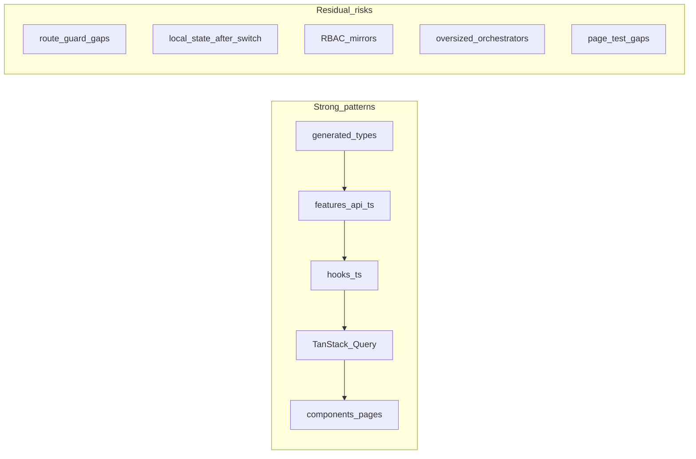

# Phase 2 — Frontend Architecture Audit

Status: audit report  
Date: 2026-06-26  
Mode: audit only — no source changes

## Sources

| Category | Files |
|----------|-------|
| Contract | [`AGENTS.md`](../AGENTS.md), [`apps/web/AGENTS.md`](../../apps/web/AGENTS.md), [`.cursor/rules/`](../.cursor/rules/) |
| Compass | [`phase_2_audit_backlog.md`](./phase_2_audit_backlog.md) §6 (Frontend Architecture), §9 (decisions), signaux transverses |
| Prior consolidations | [`phase_2_tanstack_query_cache_consolidation.md`](./phase_2_tanstack_query_cache_consolidation.md), [`phase_2_api_openapi_consolidation.md`](./phase_2_api_openapi_consolidation.md) |
| Feature consolidations | [`onboarding_observation_ai_consolidation.md`](./onboarding_observation_ai_consolidation.md), [`checklist_consolidation.md`](./checklist_consolidation.md), [`signal_feed_consolidation.md`](./signal_feed_consolidation.md), [`observation_refresh_consolidation.md`](./observation_refresh_consolidation.md) |

**Branch context:** Feature audits closed (`TODO_NOW = 0`). API/OpenAPI, Database/ORM, Realtime/Event-driven, Celery/Async, and TanStack Query/Cache phase 2 audits consolidated. This audit follows code evidence for React/TypeScript structure, responsibility boundaries, guards, UI architecture, and frontend tests. No `FIXED`, `WONT_FIX_NOW`, or `DECISION_CLOSED` items reopened without new direct code evidence.

---

## Files inspected

| Layer | Paths |
|-------|-------|
| App shell / routing | `apps/web/src/App.tsx`, `apps/web/src/app/app-routes.ts`, `apps/web/src/app/terrain-routes.ts`, `apps/web/src/app/auth-provider.tsx`, `apps/web/src/app/lazy-terrain-pages.tsx` |
| API flow | `apps/web/src/api/client.ts`, `apps/web/src/api/generated/types.ts`, all `apps/web/src/features/*/api.ts` (13 feature modules) |
| Hooks | `features/{actions,signals,checklists,onboarding,observations,auth,chat,comments,notifications,realtime}/hooks.ts`, `features/checklists/hooks/use-checklist-create-submit.ts`, `features/auth/hooks/use-app-page-workspace.ts` |
| Permission / RBAC UX | `features/auth/lib/bootstrap-permission-hints.ts`, `membership-rbac.ts`, `invitation-rbac.ts`, `features/checklists/lib/checklist-management-access.ts`, entity hint libs under `features/{actions,signals,checklists}/lib/*-permission-hints.ts` |
| Houston focus areas | `features/onboarding/` (pages, components, `lib/manual-v2-proposal.ts`), `features/auth/pages/team-page.tsx`, `team-invite-page.tsx`, `features/execution/lib/execution-create-menu.ts`, `features/actions/pages/action-detail-page.tsx`, `features/signals/pages/signal-feed-page.tsx`, `features/observations/pages/report-page.tsx`, `features/checklists/pages/checklist-hub-page.tsx` |
| Shared UI | `apps/web/src/components/layout/`, `apps/web/src/components/ui/terrain/` |
| State / cache interaction | `apps/web/src/lib/query-invalidation.ts`, `features/auth/api.ts` (login, switch, logout paths) |

## Tests inspected

| Area | Files (representative) |
|------|------------------------|
| Routing / guards | `app/app-routes.test.ts`, `app/terrain-routes.test.ts`, `app/auth-provider.test.tsx`, `app/lazy-terrain-pages.test.ts` |
| Auth / RBAC mirrors | `features/auth/lib/bootstrap-permission-hints.test.ts`, `membership-rbac.test.ts`, `invitation-rbac.test.ts`, `authenticated-landing.test.ts`, `pages/profile-page.test.tsx`, `pages/team-page.test.tsx` |
| Onboarding | `features/onboarding/lib/manual-v2-proposal.test.ts`, `lib/onboarding-route.test.ts` only — no wizard/page tests |
| Actions / execution | `features/actions/pages/action-detail-page.test.tsx`, `action-create-page.test.tsx`, `hooks.mutations.test.ts`, `features/execution/lib/execution-create-menu.test.ts`, `execution-feed-page.test.tsx` |
| Signals | `signal-detail-page.test.tsx`, `signal-card.test.tsx`, `hooks.mutations.test.ts`, `lib/signal-feed-filters.test.ts` — no `signal-feed-page` test |
| Checklists | 18 test files under `features/checklists/` (heavy lib coverage); `checklist-create-page.test.tsx`, detail/execution page tests — no `checklist-hub-page` test |
| Observations / reporting | `report-page-success.test.ts`, `processing-status-labels.test.ts`, `processing-status-popup.test.ts` — no full `report-page` integration test |
| Realtime / cache (cross-ref) | `lib/query-invalidation.test.ts`, `features/realtime/lib/apply-operational-invalidation.test.ts` |
| **Inventory** | 87 Vitest files under `apps/web/src/` |

## Docs / rules inspected

- [`phase_2_audit_backlog.md`](./phase_2_audit_backlog.md) §6 (OB-03, OB-06, OB-07, FE-02, FE-03, FE-04, OR-09, CL-10), §9 (ACT-03, ACT-08, SIG-06), signaux transverses (deadline client drift, RBAC parity)
- [`phase_2_tanstack_query_cache_consolidation.md`](./phase_2_tanstack_query_cache_consolidation.md) — TQ-E9, TQ-E10 (auth-path parity; local state interaction with purge)
- [`phase_2_api_openapi_consolidation.md`](./phase_2_api_openapi_consolidation.md) — API-O5 (bootstrap Staff create hint granularity), OB-05 (dead hook)
- `.cursor/rules/20-frontend-react-vite-ts.mdc`, `21-mobile-first-pwa.mdc`, `01-agent-guardrails.mdc`

## Assumptions / unknowns

- Line-by-line RBAC parity between Django `permissions.py` / `establishments/services.py` and `membership-rbac.ts` / `invitation-rbac.ts` not exhaustively diffed (backlog signaux transverses).
- Whether `session.current_step` and client wizard step diverge in production refresh scenarios not exercised in browser (needs integration/E2E).
- Manager scoped checklist hub without `business_unit_id` filter (CL-10) — API supports filter; UI impact at scale unknown.
- PWA/mobile transversal pass (backlog §7) limited to spot-check of focus pages, not full viewport audit.
- Frequency and user impact of stale component state after establishment switch not measured in runtime.
- `npm test` / `npm run typecheck` not executed in this audit pass.
- OB-06 (`_ONBOARDING_CONTINUE_ROLES` backend duplication) confirmed deferred in backlog; frontend consumes `can_continue_onboarding` from bootstrap/API — not promoted to a frontend finding without drift evidence.

---

## 1. Summary

Frontend React/TypeScript architecture is **disciplined at MVP scale**. The intended flow — generated OpenAPI types → `features/*/api.ts` wrappers → TanStack Query hooks → components — is followed consistently across operational domains (actions, signals, checklists, execution, observations, chat, notifications). Permission hints for lifecycle and create UX are server-sourced; components do not encode lifecycle transition graphs. Direct `fetch()` does not appear in feature components; exceptions are isolated to multipart observation uploads and one raw business-unit tree call in auth.

Residual risk clusters in six areas — none of which represent a security bypass on existing surfaces:

1. **Onboarding wizard test gap** — largest untested UI orchestrator (OB-03, P1).
2. **Route/guard polish** — checklist create and team routes reachable without the hint-based guards used elsewhere (FE-02, FE-03).
3. **Frontend RBAC mirrors** — invite/membership role matrices duplicated client-side (FE-04, R6).
4. **Local UI state after tenant switch** — query cache purges correctly (TanStack consolidation) but component `useState` persists (new finding; pairs with TQ-E9/TQ-E10).
5. **Oversized orchestrators** — `App.tsx`, onboarding wizard, report page combine routing, auth, mutations, and form state (maintainability).
6. **Uneven page-level tests and UX consistency** — strong lib/hook coverage in checklists; weak page tests for report, signal feed, checklist hub; mixed loading/error patterns.

**No P0 frontend security bypass found.** Backend enforcement remains authoritative; frontend gaps are UX, maintainability, and regression-prevention.

| Priority | Count | Themes |
|----------|-------|--------|
| **P1** | 1 | Onboarding wizard/page test gap (FE-E1 / OB-03) |
| **P2** | 7 | Wizard dual authority (FE-E2); route guards (FE-E3, FE-E4); local state after switch (FE-E5); oversized orchestrators (FE-E6); inconsistent error UX (FE-E7); bootstrap hint granularity (FE-E8) |
| **P3** | 2 | Page test gaps (FE-E9); client deadline display + signal tabs cosmetic (FE-E10) |

### Backlog mapping (§6 compass)

| Finding | Backlog ID | Status |
|---------|------------|--------|
| FE-E1 | OB-03 | **Confirmed** |
| FE-E2 | OB-07 | **Confirmed** |
| FE-E3 | FE-02 | **Confirmed** |
| FE-E4 | FE-03, FE-04, R6 | **Confirmed** (merged card) |
| FE-E5 | — | **New** (cross-ref TanStack TQ-E9/TQ-E10) |
| FE-E6 | — | **New** |
| FE-E7 | — | **New** (partial PWA overlap OB-03/OR-09) |
| FE-E8 | API-O5 / F8 | **Confirmed** (frontend UX slice) |
| FE-E9 | OR-09, CL-10, ACT-03 | **Confirmed** (partial CL-10 filter slice deferred) |
| FE-E10 | SIG-06, signaux transverses | **Confirmed** (deadline drift partial; tabs cosmetic) |
| OB-06 | — | **Not reopened** — backend duplication; frontend uses API `can_continue_onboarding` |
| OB-05 | — | **Ancillary** — dead hook cited under FE-E9, not standalone finding |

---

## 2. Findings

### FE-E1 — Onboarding wizard and page lack component tests

| Field | Detail |
|-------|--------|
| **ID** | FE-E1 |
| **Severity** | P1 |
| **Category** | tests |
| **Backlog** | OB-03 (**confirmed**) |
| **Evidence** | `features/onboarding/components/manual-onboarding-v2-wizard.tsx` (~569 LOC) orchestrates step machine, draft state, 4+ mutations, catalog seeding, and proposal persistence. `features/onboarding/pages/onboarding-page.tsx` (~326 LOC) handles auth guards, URL params, session/runtime/activation queries. Onboarding Vitest coverage is limited to `lib/manual-v2-proposal.test.ts` and `lib/onboarding-route.test.ts` — no wizard, page, registration card, or activation card tests. |
| **Problem** | The highest-complexity frontend flow has no component or integration tests. API onboarding tests are fixed (OB-02 closure); UI regressions (routing, step blocking, activation readiness) would not be caught by CI. |
| **Risk** | Silent breakage of onboarding activation path during wizard refactors; blocked directors undetected until manual QA. |
| **Suggested direction** | Add Vitest component tests for wizard resume/step transitions, error/loading states, and onboarding-page routing guards; prioritize activation-blocking paths. |
| **Test coverage** | Lib-only today; backend onboarding API tests exist but do not cover React orchestration. |
| **Size** | M |

---

### FE-E2 — Wizard step authority split between client derivation and server session

| Field | Detail |
|-------|--------|
| **ID** | FE-E2 |
| **Severity** | P2 |
| **Category** | ambiguity / maintainability |
| **Backlog** | OB-07 (**confirmed**) |
| **Evidence** | `features/onboarding/lib/manual-v2-proposal.ts` — `deriveWizardStepFromState()` computes resume step from draft payload, proposal status, and runtime-applied flag. `manual-onboarding-v2-wizard.tsx` holds local `step` / `setStep` (initialized once from derivation on hydrate). `onboarding-hero-card.tsx` displays `session.current_step` from API independently. No ongoing sync between client step state and server `current_step` after initial hydrate. |
| **Problem** | Two authorities for "where am I in onboarding?" — client draft-derived step vs server session field. Divergence possible after refresh, partial save, or concurrent tab. |
| **Risk** | User sees inconsistent step labels; wizard allows navigation client-side that server has not validated; harder to add second client (native) later. |
| **Suggested direction** | Treat server session step as display authority where available; constrain client navigation to server-validated transitions; add tests for refresh/resume parity. |
| **Test coverage** | `manual-v2-proposal.test.ts` covers derivation logic only; no component test for server/client divergence (links FE-E1). |
| **Size** | M |

---

### FE-E3 — Checklist template create route lacks permission page guard

| Field | Detail |
|-------|--------|
| **ID** | FE-E3 |
| **Severity** | P2 |
| **Category** | ambiguity / API contract |
| **Backlog** | FE-02 (**confirmed**) |
| **Evidence** | `features/actions/pages/action-create-page.tsx` returns `TerrainErrorState` when `canCreateActionFromBootstrapHints` is false. `features/checklists/pages/checklist-create-page.tsx` only guards on `establishmentId` / `membershipId` (returns null if missing). `checklist-hub-page.tsx` hides create button when `canCreateChecklistTemplateFromBootstrapHints` is false, but `/checklists/new` deep link renders full form. `checklist-create-page.test.tsx` has no permission-denied cases. |
| **Problem** | Inconsistent guard pattern vs action create and vs hub UX. Unauthorized users can reach create form; API returns 403 on submit. |
| **Risk** | Frustrating UX (form filled then rejected); inconsistent with established bootstrap-hint pattern in execution create menu. |
| **Suggested direction** | Add page-level guard mirroring `action-create-page` using `canCreateChecklistTemplateFromBootstrapHints`; add routing test. |
| **Test coverage** | `execution-create-menu.test.ts` validates hint-driven menu; checklist create page lacks equivalent. |
| **Size** | S |

---

### FE-E4 — Team route reachable without management gate; frontend RBAC mirrors duplicate backend

| Field | Detail |
|-------|--------|
| **ID** | FE-E4 |
| **Severity** | P2 |
| **Category** | structure / maintainability |
| **Backlog** | FE-03, FE-04, R6 (**confirmed**, merged) |
| **Evidence** | **Route:** `/team` in `terrain-routes.ts` requires active membership only. `team-page.tsx` shows `TerrainComingSoonState` for all roles; invite entry only if `can_invite`. Contrast `team-invite-page.tsx` which blocks with explicit unauthorized card when `can_invite` is false. Profile team nav is inside `canAccessManagementSpace` block (`profile-page.tsx`) but direct URL navigation bypasses that. **RBAC mirrors:** `membership-rbac.ts` — `MANAGEABLE_TARGET_ROLES_BY_ACTOR` matrix; `invitation-rbac.ts` — `getAllowedInviteTargetRoles()`. Used by `membership-management-card.tsx`, `membership-invite-card.tsx`, `use-app-page-workspace.ts`. Tests (`membership-rbac.test.ts`, `invitation-rbac.test.ts`) validate frontend copies only, not backend parity. |
| **Problem** | Team surface reachable by any active member (placeholder UX, wasted navigation). Frontend encodes invite/manage role rules that backend also enforces — drift maintenance burden. Manager matrix empty in `membership-rbac.ts` while invite path allows manager→staff. |
| **Risk** | UI shows invite/manage options that API rejects (403); support burden; silent drift when backend role rules change. |
| **Suggested direction** | Apply team-invite-style guard or redirect on `/team` using bootstrap hints; reduce mirror surface by deriving invite targets from API/bootstrap where possible. |
| **Test coverage** | `team-page.test.tsx` covers invite visibility; no test for unauthorized direct navigation. RBAC tests self-referential. |
| **Size** | S (route guard) / M (RBAC mirror reduction) |

---

### FE-E5 — Component local state survives establishment switch

| Field | Detail |
|-------|--------|
| **ID** | FE-E5 |
| **Severity** | P2 |
| **Category** | maintainability / ambiguity |
| **Backlog** | **New** — cross-ref TanStack consolidation TQ-E9, TQ-E10 |
| **Evidence** | `switchEstablishment()` in `features/auth/api.ts` calls `purgeNonAuthQueries()` — query cache for operational data is removed. No `key={establishmentId}` remount pattern on form/list pages. Local `useState` persists in: `report-page.tsx` (text, photos, form errors, submitted id), `signal-feed-page.tsx` (viewMode, filters), `execution-feed-page.tsx` (viewMode, create menu open), `action-create-page.tsx` (full form), `manual-onboarding-v2-wizard.tsx` (step, drafts). Counterexample: `use-app-page-workspace.ts` resets membership editor state on switch. Logout path uses `clearAuthenticatedQueryCache()` (full wipe) but same remount gap if user re-authenticates without full page reload. |
| **Problem** | Server state isolation is correct at TanStack layer; client UI state is not scoped to establishment. User switching tenant on same route may briefly see prior establishment's form content or tab/filter selection until navigation changes. |
| **Risk** | Wrong-establishment data submitted if user switches mid-form (API should reject, but UX is dangerous); filter/tab confusion after switch. Not a durable cross-tenant cache leak (query purge prevents that). |
| **Suggested direction** | Remount form/hub pages on `establishmentId` change via route key or explicit reset effect; align with TanStack auth-path parity work (TQ-E9/TQ-E10). |
| **Test coverage** | `query-invalidation.test.ts`, `auth-provider.test.tsx` cover cache purge; no test for component state after switch. |
| **Size** | S |

---

### FE-E6 — Oversized orchestrators concentrate routing, auth, and domain logic

| Field | Detail |
|-------|--------|
| **ID** | FE-E6 |
| **Severity** | P2 |
| **Category** | structure / maintainability |
| **Backlog** | **New** |
| **Evidence** | Largest files by LOC: `App.tsx` (~653) — auth redirect effects, chat availability, lazy route map, realtime provider wiring, terrain shell composition; `manual-onboarding-v2-wizard.tsx` (~569) — mutations + step machine + draft + catalog seeding; `report-page.tsx` (~385) — photos, voice, transcribe, submit, checklist context, processing poll; `action-create-page.tsx` (~351) — form state + staff assignee logic + linked signal mode. Hooks in `features/*/hooks.ts` are mostly thin; orchestration sits in pages and large components. |
| **Problem** | Single files own multiple concerns (routing guards + provider nesting + feature rendering in App; full reporting workflow in one page). Increases merge conflict risk and makes behavior-focused testing harder. |
| **Risk** | Regressions in unrelated concerns bundled in same diff; new features extend already-large files instead of extracting focused modules. |
| **Suggested direction** | Incremental extraction: App route effects vs provider tree vs route content map; wizard step machine module; report submit sub-flow hooks/components. |
| **Test coverage** | App routing partially tested (`app-routes`, `terrain-routes`, `auth-provider`); large pages under-tested (see FE-E1, FE-E9). |
| **Size** | M (App) / L (wizard+report, if done together) |

---

### FE-E7 — Inconsistent loading, error, and empty state patterns

| Field | Detail |
|-------|--------|
| **ID** | FE-E7 |
| **Severity** | P2 |
| **Category** | maintainability / ambiguity |
| **Backlog** | **New** (partial overlap OB-03 mobile states, OR-09 report states) |
| **Evidence** | **Terrain standard:** action/signal/execution detail and feed pages use `LoaderCircle` + `TerrainErrorState` with retry via `resolveApiErrorMessage`. **Deviations:** `checklist-hub-page.tsx` — plain text "Chargement..."; inline 403 card without retry (L84–96). `checklist-template-section.tsx` — static error text in card. Onboarding — separate `OnboardingLoadingState` / `OnboardingErrorState` in `onboarding-state.tsx`. Team invite — legacy `Card`/`Badge` shell vs terrain detail pages. Missing establishment — mix of inline `
` vs `null` return across pages. |
| **Problem** | No single convention for operational loading/error/empty across all Houston surfaces. Mobile-first rule requires explicit states; half the checklist hub path meets that bar. |
| **Risk** | Users on failed hub load get no retry; inconsistent polish undermines field-team clarity; new pages copy nearest neighbor and perpetuate split. |
| **Suggested direction** | Align checklist hub and template section with terrain error/loading primitives; document onboarding/legacy invite as intentional exceptions or migrate when touched. |
| **Test coverage** | Action/signal detail pages tested for states; hub/report/onboarding pages not. |
| **Size** | S |

---

### FE-E8 — Bootstrap `can_create_action` hint lacks Staff create constraint granularity

| Field | Detail |
|-------|--------|
| **ID** | FE-E8 |
| **Severity** | P2 |
| **Category** | API contract / ambiguity |
| **Backlog** | API-O5 / F8 (**confirmed**, frontend UX slice) |
| **Evidence** | `bootstrap-permission-hints.ts` — `canCreateActionFromBootstrapHints` returns true when `can_create_action === true`. API consolidation (API-O5): bootstrap returns `can_create_action=true` for all Staff; backend `_validate_staff_create_constraints` enforces free/self-assigned/non-linked rules via 400. `execution-create-menu.ts` exposes create entry from bootstrap hint. `action-create-page.tsx` gates on same hint; Staff self-assignee default built from `activeMembership.role === 'staff'`. |
| **Problem** | Frontend cannot distinguish Staff who may create free/self-assigned actions from contexts where create will fail. Hint is coarser than enforcement. |
| **Risk** | Staff sees create menu, fills form, receives 400 — UX frustration, not authorization bypass. Worsens if new Staff constraints added server-side without hint update. |
| **Suggested direction** | Finer bootstrap hints or entity-level pre-checks when backend adds them; until then, map known 400 codes to friendly messages on create page. |
| **Test coverage** | `execution-create-menu.test.ts`, `bootstrap-permission-hints.test.ts`; backend `test_actions_api.py` covers enforcement. |
| **Size** | M (backend hint) / S (error message mapping only) |

---

### FE-E9 — Key operational pages lack page-level tests; dead hook and unwired mutations

| Field | Detail |
|-------|--------|
| **ID** | FE-E9 |
| **Severity** | P3 |
| **Category** | tests |
| **Backlog** | OR-09, CL-10 (**confirmed**, partial), ACT-03 (product decision), OB-05 (ancillary) |
| **Evidence** | **Missing page tests:** `report-page.tsx` — only `report-page-success.test.ts` (lib helper); no integration test for dual-path submit, checklist context URL, processing panel. `signal-feed-page.tsx` — no Vitest; hooks/filters tested separately. `checklist-hub-page.tsx` — no Vitest; 18 checklist lib tests exist. **Unwired hooks:** `useReassignActionMutation`, `useUpdateActionDueAtMutation` in `actions/hooks.ts` — no detail UI (ACT-03 MVP default). **Dead hook:** `useSubmitActivityDescription` in `onboarding/hooks.ts` — defined, never imported (OB-05 / API-O7). **CL-10 slice:** hub filter omits `business_unit_id` API param — deferred product polish. |
| **Problem** | Core field workflows (report, signal feed browse, checklist hub) rely on lib tests and manual QA. Shipped hooks without UI increase dead-code surface. |
| **Risk** | Regressions in report submit flow or hub delete/recovery path undetected; developers assume hooks imply UI exists. |
| **Suggested direction** | Prioritize `report-page` and `checklist-hub-page` smoke tests for loading/error/submit paths; remove or wire dead onboarding hook. |
| **Test coverage** | Backend observation API tests exist; frontend page gap documented. |
| **Size** | M |

---

### FE-E10 — Client-side deadline/overdue display and signal feed tab cosmetic drift

| Field | Detail |
|-------|--------|
| **ID** | FE-E10 |
| **Severity** | P3 |
| **Category** | ambiguity / maintainability |
| **Backlog** | SIG-06 (**confirmed**, cosmetic), signaux transverses deadline drift (**partial**) |
| **Evidence** | `action-display.ts` — `formatActionRemainingTimeLabel`, `isActionDeadlineCritical`, `getActionDeadlineRemainingPercent` use `Date.now()` for remaining time and bar fill. `checklist-display.ts` — `isChecklistExecutionOverdue()` compares `Date.parse(endAt)` to client clock. Feed/detail cards prefer API `is_overdue` where provided (`execution-action-card.tsx`, `action-detail-deadline-card.tsx`). `signal-feed-tabs.tsx` — always renders "Ma zone" / "Vue globale" for all roles (SIG-06: admin tabs may be equivalent). |
| **Problem** | Display-only deadline urgency computed client-side may diverge from server `is_overdue` near boundaries (clock skew, timezone). Signal tabs may confuse admins when both modes return identical data. |
| **Risk** | Low — cosmetic/status label drift, not security. Minor user confusion on tab labels. |
| **Suggested direction** | Prefer server `is_overdue` for labels when present; client math only for bar animation. SIG-06: hide or unify tabs when role/data identical — product gate. |
| **Test coverage** | `action-display.test.ts`, `checklist-display.test.ts` validate client math; no clock-skew integration test. |
| **Size** | S |

---

## 3. Responsibility boundary issues

| Boundary | Assessment |
|----------|------------|
| **Lifecycle transitions** | **Good.** Actions, signals, checklists use API commands + `permission_hints`; no frontend transition graphs. |
| **Create permissions** | **Mostly good.** Bootstrap hints drive execution create menu and action create guard. Gap: checklist create route (FE-E3); Staff hint granularity (FE-E8). |
| **Team invite/manage** | **Drift.** `membership-rbac.ts` and `invitation-rbac.ts` duplicate backend rules (FE-E4). Tests validate copies, not parity. |
| **Checklist library access** | **Drift.** `canAccessChecklistLibrary()` checks membership presence only; API enforces real access (403 in hub). |
| **Staff assignee default** | **Drift.** `action-create-page.tsx` derives self-assign from `role === 'staff'` — UX convenience; backend must enforce. |
| **API layer** | **Mostly good.** `apiClient` confined to `features/*/api.ts`. Bypasses: wizard direct `suggestActivitySubjects` call despite `useActivitySubjectSuggestions` hook; auth pages inline `useMutation` + direct api; `fetchBusinessUnitTree` raw fetch. |
| **Cross-feature coupling** | **Present.** `observations/hooks.ts` imports checklist api for reporting-context task observation submit. |
| **Server state in local state** | **Good for Query.** No operational data in Zustand (unused). Risk at component `useState` after switch (FE-E5). |

---

## 4. Route / guard / RBAC UX risks

| Route / surface | Guard today | Gap | Reference pattern |
|-----------------|-------------|-----|-------------------|
| `/checklists/new` | Active membership | No `can_create_checklist_template` page guard | `action-create-page` |
| `/team` | Active membership | No management hint redirect; placeholder for all | `team-invite-page` |
| `/team/invite` | `can_invite` bootstrap | **Good** — explicit unauthorized state | Replicate elsewhere |
| `/actions/new`, linked create | Bootstrap + signal hints | **Good** | — |
| `/onboarding` | Unauthenticated allowed | Complex query params; wizard untested | — |
| Execution create menu | Bootstrap hints in sheet | **Good**; tested | — |
| `/reporting` | Operational access via App | No role-specific guard needed | — |
| `/signals`, `/execution` | Operational access | Feed tabs/filters local state (FE-E5) | — |
| Profile → Team nav | `canAccessManagementSpace` | Direct `/team` URL bypasses nav gate | — |

**Global:** `App.tsx` + `authenticated-landing.ts` handle session, bootstrap landing, and operational access. There is **no fine-grained RBAC route matrix** — acceptable for MVP if page-level hints align (gaps above).

---

## 5. Component and hook simplification opportunities

| Target | Opportunity |
|--------|-------------|
| `App.tsx` | Split auth redirect effects, provider composition, and route content map into focused modules. |
| `manual-onboarding-v2-wizard.tsx` | Extract step machine, draft persistence, and catalog seeding into hooks/lib; route API calls through existing hooks. |
| `report-page.tsx` | Extract photo/voice/submit/processing into sub-components or dedicated hooks. |
| Auth mutations | Consolidate login/switch/invite/register inline `useMutation` from `auth-provider.tsx`, `select-establishment-page.tsx`, registration/invite components into `features/auth/hooks.ts`. |
| Checklist hub | Adopt terrain loading/error; optional `business_unit_id` filter when product requires (CL-10). |
| Form pages | Thin `establishmentId` route key or reset hook for switch isolation (FE-E5). |
| Dead code | Remove or wire `useSubmitActivityDescription` (OB-05). |

---

## 6. State management risks

| Mechanism | Role | Risk |
|-----------|------|------|
| **TanStack Query** | Server state, cache, invalidation | **Low** — disciplined per TanStack consolidation. Purge on switch/logout correct. Cross-ref TQ-E9/TQ-E10 for auth-path parity gaps (bootstrap rewrite on realtime switch; login defensive purge). |
| **Zustand** | Documented for UI state | **None operational** — dependency in `package.json`, zero imports in `src/`. Minor doc/dependency drift only. |
| **React Context** | Auth session, routing | **Appropriate** — `AuthProvider`, `AppRouteProvider`. |
| **Component `useState`** | Forms, tabs, filters, wizard drafts | **Medium** — not cleared on establishment switch (FE-E5). Logout clears query cache but does not remount mounted components. |
| **localStorage / sessionStorage** | — | **None found** in `apps/web/src`. |

---

## 7. Safe areas

- **Generated types pipeline:** Feature `types.ts` files re-export OpenAPI schemas; no manual duplication of API shapes.
- **No component-level fetch:** Multipart and BU-tree exceptions isolated in api layer.
- **Entity permission hints:** Action, signal, checklist lifecycle/create UI driven by server `permission_hints` — display only, not enforcement.
- **Execution create menu:** `execution-create-menu.ts` + tests — reference bootstrap-hint pattern.
- **Detail pages:** Action, signal, checklist execution/template details follow terrain loading/error conventions and have page tests.
- **Route infrastructure:** `parseAppRoute`, terrain config, protected-route helpers well tested.
- **Checklist domain lib tests:** 18 files — payloads, hints, delete flow, mutations — strong regression net for business-adjacent logic.
- **Chat realtime:** Integration tests for nav availability and unread; acceptable coverage for complex surface.
- **Comments, notifications:** Hook mutation tests and component tests present.

---

## 8. Needs more evidence

| Topic | Why |
|-------|-----|
| Django ↔ frontend RBAC line diff | Backlog signaux transverses; matrices look aligned but not formally verified |
| Wizard step divergence after refresh | Requires integration/E2E; static audit shows dual authority design |
| CL-10 manager scoped hub without BU filter | API supports filter; operational pain at scale unmeasured |
| PWA viewport / offline on wizard and report | Backlog §7 transversal — spot-check only in this audit |
| Stale form state after switch — user frequency | Edge case; API rejection likely prevents bad writes |
| OB-06 backend role list duplication | Deferred; frontend consumes `can_continue_onboarding` from API without local copy |
| Reassign/due-at UI gap severity | ACT-03 product decision; hooks exist, MVP default defer |

---

## 9. Top priorities

### Do first

1. **FE-E1** — Onboarding wizard component tests (P1, highest regression risk on untested orchestrator).
2. **FE-E3 + FE-E4 (route slice)** — Align `/checklists/new` and `/team` guards with action-create and team-invite patterns (S, quick UX wins).
3. **FE-E5** — Establishment-switch local state isolation on form/hub pages (S; pairs with TanStack TQ-E9/TQ-E10).

### Quick wins

- FE-E3 page guard for checklist create.
- FE-E7 checklist hub terrain loading/error parity.
- Remove or wire dead `useSubmitActivityDescription` (FE-E9 / OB-05).
- `key={establishmentId}` remount on report, action-create, signal-feed pages.

### Structural (plan later)

- FE-E6 App.tsx and wizard decomposition.
- FE-E2 server-authoritative wizard step model.
- FE-E4 RBAC mirror reduction via bootstrap/API-driven invite targets.

### Not worth fixing now

- Zustand unused dependency (no runtime effect).
- FE-E10 SIG-06 tab label unification (cosmetic, product-gated).
- Client deadline bar animation math when API `is_overdue` drives primary labels.
- Chat page unit tests (integration coverage exists).
- Full App.tsx split in one pass (incremental preferred).

---

## 10. Changed / Validated / Risks

**Changed:** Created `docs/audits/phase_2_frontend_architecture_audit.md` — Phase 2 Frontend Architecture audit report.

**Validated:** Code inspection across 13 feature modules under `apps/web/src/features/`, 87 Vitest files, app shell and shared components; backlog §6 items OB-03, OB-07, FE-02, FE-03, FE-04, OR-09, CL-10 and decisions ACT-03, SIG-06 cross-checked; TanStack and API consolidation findings referenced where frontend intersects (FE-E5 ↔ TQ-E9/TQ-E10; FE-E8 ↔ API-O5). Deferred items OB-06 not reopened without drift evidence.

**Risks / not verified:** No browser runtime or mobile viewport testing; `npm test` not executed; RBAC parity not line-diffed against Django; PWA transversal (backlog §7) incomplete; severity of establishment-switch stale UI unmeasured in production flows.
