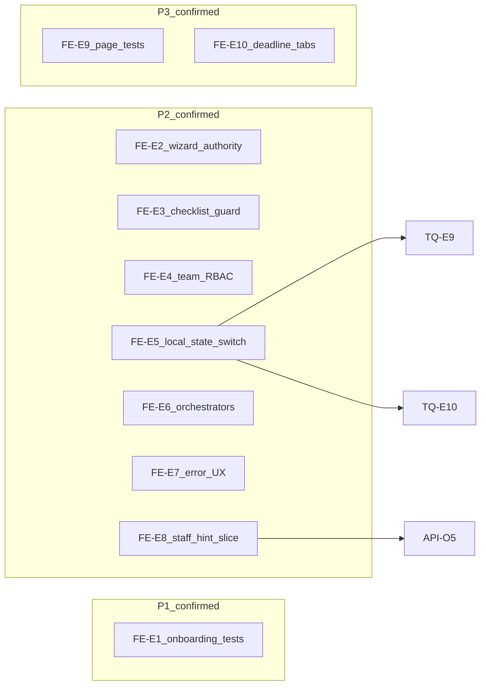
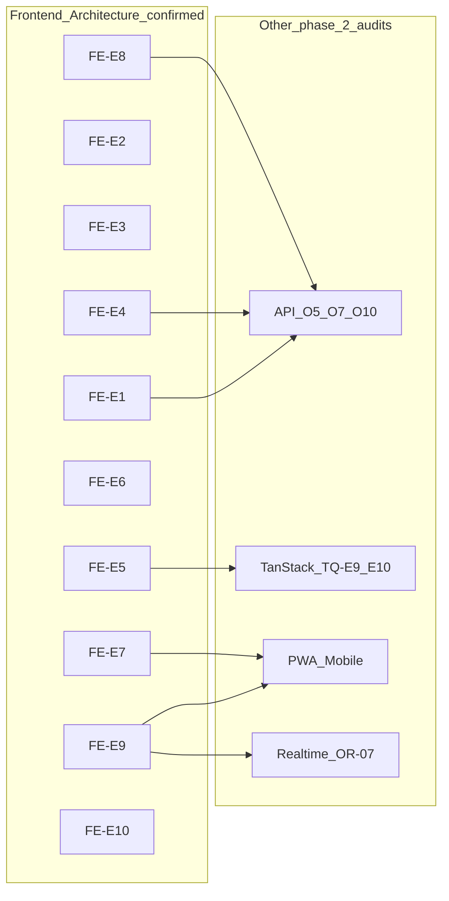

# Phase 2 — Frontend Architecture Consolidation

> **Post-audit note (2026-06-27):** Wave 1 scoped deliverables landed — see [`phase_2_final_roadmap.md`](./phase_2_final_roadmap.md) § Wave 1 status. **GUARD-01** Option A done scoped (ROADMAP-10); **GUARD-01** parent theme remains open (**API-O5**, **FE-E8**, GUARD-01-FU-1/FU-2, TS-E9 remainder). Evidence rows below reflect the 2026-06-26 audit snapshot.

Status: consolidation report  
Date: 2026-06-26  
Mode: consolidation only — no source changes

## Sources

| Category | Files |
|----------|-------|
| Audit input | [`phase_2_frontend_architecture_audit.md`](./phase_2_frontend_architecture_audit.md) (FE-E1–FE-E10) |
| Backlog | [`phase_2_audit_backlog.md`](./phase_2_audit_backlog.md) §6 (Frontend Architecture), §7 (PWA transversal), §9 (decisions) |
| Closure | [`feature_audit_closure.md`](./feature_audit_closure.md) |
| Decisions | [`feature_audit_decisions.md`](./feature_audit_decisions.md) |
| Cross-audit | [`phase_2_api_openapi_consolidation.md`](./phase_2_api_openapi_consolidation.md) (API-O5, API-O7, API-O10), [`phase_2_tanstack_query_cache_consolidation.md`](./phase_2_tanstack_query_cache_consolidation.md) (TQ-E9, TQ-E10) |
| Contract | [`AGENTS.md`](../../AGENTS.md), [`apps/web/AGENTS.md`](../../apps/web/AGENTS.md) |

**Branch context:** Feature audits closed (`TODO_NOW = 0`). API/OpenAPI, Database/ORM, Realtime/Event-driven, Celery/Async, and TanStack Query/Cache phase 2 audits consolidated. This consolidation challenges each finding from the phase 2 Frontend Architecture audit against backlog §6, closure registry, decision pack, sibling consolidations, and spot-check code evidence. No `FIXED`, `WONT_FIX_NOW`, or `DECISION_CLOSED` items reopened without new direct code evidence.

---

## 1. Executive summary

Frontend React/TypeScript architecture is **disciplined at MVP scale**. The intended flow — generated OpenAPI types → `features/*/api.ts` wrappers → TanStack Query hooks → components — is followed consistently across operational domains. Permission hints for lifecycle and create UX are server-sourced; components do not encode lifecycle transition graphs. Backend enforcement remains authoritative on all audited surfaces.

Residual risk is **not** a frontend security bypass. It clusters in:

1. **Onboarding wizard test gap** — largest untested UI orchestrator (FE-E1 / OB-03, P1)
2. **Route/guard polish** — checklist create and team routes reachable without hint-based page guards (FE-E3, FE-E4 route slice, P2)
3. **Frontend RBAC mirrors** — invite/membership role matrices duplicated client-side (FE-E4 RBAC slice, P2)
4. **Local UI state after tenant switch** — query cache purges correctly (TanStack consolidation) but component `useState` persists (FE-E5, P2; complements TQ-E9/TQ-E10)
5. **Oversized orchestrators** — confirmed maintainability debt in `App.tsx`, wizard, report page; incremental extraction deferred, no one-pass refactor (FE-E6, P2 defer)
6. **Uneven page-level tests and UX consistency** — strong lib/hook coverage in checklists; weak page tests for report, signal feed, checklist hub; mixed loading/error patterns (FE-E7, FE-E9, FE-E10, P2/P3)

**No P0 frontend security bypass found.**

| Priority | Count | Themes |
|----------|-------|--------|
| **P1** | 1 | Onboarding wizard/page component tests (FE-E1) |
| **P2** | 7 | Wizard dual authority (FE-E2); route guards (FE-E3, FE-E4); local state after switch (FE-E5); oversized orchestrators (FE-E6); inconsistent error UX (FE-E7); bootstrap hint granularity UX slice (FE-E8) |
| **P3** | 2 | Page test gaps + dead hook (FE-E9); deadline display + signal tabs cosmetic (FE-E10) |

**Consolidation verdict:** 10 audit findings reviewed → **10 evidence-backed confirmations**, including **8 engineering-owned findings or slices: FE-E1–FE-E8**; **FE-E9** and **FE-E10** remain confirmed findings with product-gated or deferred slices (ACT-03, SIG-06, CL-10 within FE-E9/E10), **0 false positives**, **2 duplicate merges** to API consolidation (FE-E8 → API-O5; FE-E9 OB-05 → API-O7), **FE-E5 complements** (not duplicates) TanStack TQ-E9/TQ-E10.

---

## 2. Findings reviewed

All 10 findings from [`phase_2_frontend_architecture_audit.md`](./phase_2_frontend_architecture_audit.md) §2, cross-checked against [`phase_2_audit_backlog.md`](./phase_2_audit_backlog.md) §6, [`feature_audit_closure.md`](./feature_audit_closure.md), [`feature_audit_decisions.md`](./feature_audit_decisions.md), sibling consolidations, and spot-check code evidence.

| ID | Audit sev | Reclassification | Backlog alias | Consolidation notes |
|----|-----------|------------------|---------------|---------------------|
| **FE-E1** | P1 | **CONFIRMED** | OB-03 | Code-verified: zero Vitest files reference `manual-onboarding-v2-wizard` or `onboarding-page`; only `lib/manual-v2-proposal.test.ts` and `lib/onboarding-route.test.ts`. Wizard ~569 LOC; page ~326 LOC. Backend onboarding API tests exist (OB-02 FIXED); React orchestration uncovered. |
| **FE-E2** | P2 | **CONFIRMED** + **NEEDS_MORE_EVIDENCE** (runtime divergence) | OB-07 | Code-verified: `deriveWizardStepFromState()` in [`manual-v2-proposal.ts`](../../apps/web/src/features/onboarding/lib/manual-v2-proposal.ts); local `useState` step in [`manual-onboarding-v2-wizard.tsx`](../../apps/web/src/features/onboarding/components/manual-onboarding-v2-wizard.tsx) L77/L113–128; [`onboarding-hero-card.tsx`](../../apps/web/src/features/onboarding/components/onboarding-hero-card.tsx) displays `session.current_step` independently. Dual-authority design is real; production refresh divergence not exercised in browser/E2E. |
| **FE-E3** | P2 | **CONFIRMED** | FE-02 | Code-verified: [`checklist-create-page.tsx`](../../apps/web/src/features/checklists/pages/checklist-create-page.tsx) L87–88 returns `null` only when `!establishmentId \|\| !membershipId`; no `canCreateChecklistTemplateFromBootstrapHints`. Contrast [`action-create-page.tsx`](../../apps/web/src/features/actions/pages/action-create-page.tsx) L211–218 `TerrainErrorState`. Hub hides create button; `/checklists/new` deep link renders full form. |
| **FE-E4** | P2 | **CONFIRMED** (merged card) | FE-03, FE-04, R6 | **Route slice:** [`team-page.tsx`](../../apps/web/src/features/auth/pages/team-page.tsx) shows placeholder for all active members; profile nav gated by `canAccessManagementSpace` but direct `/team` URL bypasses. Contrast [`team-invite-page.tsx`](../../apps/web/src/features/auth/pages/team-invite-page.tsx) unauthorized card. **RBAC slice:** [`membership-rbac.ts`](../../apps/web/src/features/auth/lib/membership-rbac.ts) manager matrix `[]` vs [`invitation-rbac.ts`](../../apps/web/src/features/auth/lib/invitation-rbac.ts) manager→staff; tests validate frontend copies only. |
| **FE-E5** | P2 | **CONFIRMED** (unique to Frontend audit; complements TanStack) | — | Code-verified: `switchEstablishment()` in [`auth/api.ts`](../../apps/web/src/features/auth/api.ts) L368 calls `purgeNonAuthQueries`; no establishment-scoped remount or explicit local state reset pattern observed in `apps/web/src`. Local `useState` persists on report, feed, create, wizard pages. **Not a duplicate** of TQ-E9/TQ-E10 — those own query-cache parity; FE-E5 owns component remount/reset. |
| **FE-E6** | P2 | **CONFIRMED** + **DEFER_PHASE_2** (incremental) | — | Code-verified LOC: `App.tsx` 653, wizard 569, `report-page.tsx` 385, `action-create-page.tsx` 351. Confirmed maintainability debt; hooks in `features/*/hooks.ts` are mostly thin — orchestration sits in pages. Incremental extraction deferred; no one-pass refactor. |
| **FE-E7** | P2 | **CONFIRMED** | — (partial PWA §7) | Code-verified: [`checklist-hub-page.tsx`](../../apps/web/src/features/checklists/pages/checklist-hub-page.tsx) plain "Chargement..." (L69), inline 403 card without retry (L84–96); action/signal/execution detail pages use `LoaderCircle` + `TerrainErrorState`. Full mobile viewport pass deferred to PWA audit. |
| **FE-E8** | P2 | **CONFIRMED** + **DUPLICATE** (frontend UX slice) | API-O5 / F8 | Code-verified: [`bootstrap-permission-hints.ts`](../../apps/web/src/features/auth/lib/bootstrap-permission-hints.ts) — `canCreateActionFromBootstrapHints` is boolean on `can_create_action`. **Primary owner: API-O5** (backend hint granularity). Frontend slice: friendlier 400 mapping on create page until hints improve. |
| **FE-E9** | P3 | **CONFIRMED** (merged themes) | OR-09, CL-10, ACT-03, OB-05 | **OR-09:** no Vitest for `signal-feed-page`, `checklist-hub-page`; `report-page` only lib helper test. **OB-05:** `useSubmitActivityDescription` in [`onboarding/hooks.ts`](../../apps/web/src/features/onboarding/hooks.ts) L102 — defined, never imported — **DUPLICATE** of API-O7 hygiene. **ACT-03:** `useReassignActionMutation` / `useUpdateActionDueAtMutation` unwired — **PRODUCT_DECISION**. **CL-10:** hub omits `business_unit_id` filter — **DEFER_PHASE_2** polish. |
| **FE-E10** | P3 | **CONFIRMED** + **PRODUCT_DECISION** slice | SIG-06, signaux transverses | Code-verified: [`signal-feed-tabs.tsx`](../../apps/web/src/features/signals/components/signal-feed-tabs.tsx) always shows "Ma zone" / "Vue globale"; [`action-display.ts`](../../apps/web/src/features/actions/lib/action-display.ts) client `Date.now()` math vs API `is_overdue` on detail cards. Tabs = SIG-06 **DECISION_OPEN**; deadline bar animation = **IGNORE_NOW** when API field drives primary labels. |

**Ancillary notes from audit §3** (not promoted to formal findings):

| Note | Disposition |
|------|-------------|
| `canAccessChecklistLibrary()` checks membership presence only | Sub-slice of FE-E3/FE-E7 — API enforces real access (403 in hub) |
| Wizard direct `suggestActivitySubjects` vs `useActivitySubjectSuggestions` hook | **IGNORE_NOW** — hook used in BU config step; wizard has one direct call |
| Zustand in `package.json`, zero imports in `src/` | **IGNORE_NOW** — doc/dependency drift only |
| Cross-feature `observations/hooks.ts` → checklist api | Structural note under FE-E6; no action now |
| OB-06 `_ONBOARDING_CONTINUE_ROLES` backend duplication | **Not reopened** — frontend uses `can_continue_onboarding` from API without local copy |

**Backlog §6 re-validation:** OB-03, OB-07, FE-02, FE-03, FE-04, OR-09, CL-10 remain valid as deferred frontend themes. OB-06 not promoted — backend-only, no frontend drift evidence.

---

## 3. Confirmed findings

Full cards below cover findings with **engineering priority** (FE-E1–FE-E8). **FE-E9** and **FE-E10** are also **confirmed** at finding level but documented in [§4](#4-reclassified--duplicate--false-positive-findings) for product-gated and deferred slices.

### FE-E1 — Onboarding wizard and page lack component tests

| Field | Detail |
|-------|--------|
| **Severity** | P1 |
| **Evidence** | [`manual-onboarding-v2-wizard.tsx`](../../apps/web/src/features/onboarding/components/manual-onboarding-v2-wizard.tsx) (~569 LOC) — step machine, draft state, 4+ mutations, catalog seeding, proposal persistence. [`onboarding-page.tsx`](../../apps/web/src/features/onboarding/pages/onboarding-page.tsx) (~326 LOC) — auth guards, URL params, session/runtime/activation queries. Vitest: only [`manual-v2-proposal.test.ts`](../../apps/web/src/features/onboarding/lib/manual-v2-proposal.test.ts), [`onboarding-route.test.ts`](../../apps/web/src/features/onboarding/lib/onboarding-route.test.ts). |
| **Why confirmed** | Highest-complexity frontend flow has no component or integration tests. Grep finds zero test files importing wizard or page components. API onboarding tests (OB-02 FIXED) do not cover React orchestration. |
| **Risk** | Silent breakage of onboarding activation path during wizard refactors; blocked directors undetected until manual QA. Blocks safe large-scale onboarding evolution. |
| **Suggested direction** | Add Vitest component tests for wizard resume/step transitions, error/loading states, and onboarding-page routing guards; prioritize activation-blocking paths. |
| **Dependencies** | OB-03; pairs with FE-E2 (wizard authority); PWA §7 mobile states on wizard |
| **Size** | M |

---

### FE-E2 — Wizard step authority split between client derivation and server session

| Field | Detail |
|-------|--------|
| **Severity** | P2 |
| **Evidence** | [`manual-v2-proposal.ts`](../../apps/web/src/features/onboarding/lib/manual-v2-proposal.ts) — `deriveWizardStepFromState()`. [`manual-onboarding-v2-wizard.tsx`](../../apps/web/src/features/onboarding/components/manual-onboarding-v2-wizard.tsx) — local `step` / `setStep` initialized once from derivation on hydrate. [`onboarding-hero-card.tsx`](../../apps/web/src/features/onboarding/components/onboarding-hero-card.tsx) — displays `session.current_step` from API independently. No ongoing sync after initial hydrate. |
| **Why confirmed** | Two authorities for "where am I in onboarding?" — client draft-derived step vs server session field. Design is intentional for resume but creates divergence surface after refresh, partial save, or concurrent tab. **NEEDS_MORE_EVIDENCE** for production impact severity. |
| **Risk** | Inconsistent step labels; wizard allows client navigation server has not validated; harder to add second client (native) later. |
| **Suggested direction** | Treat server session step as display authority where available; constrain client navigation to server-validated transitions; add tests for refresh/resume parity (links FE-E1). |
| **Dependencies** | OB-07; API onboarding session contract; FE-E1 tests |
| **Size** | M |

---

### FE-E3 — Checklist template create route lacks permission page guard

| Field | Detail |
|-------|--------|
| **Severity** | P2 |
| **Evidence** | [`action-create-page.tsx`](../../apps/web/src/features/actions/pages/action-create-page.tsx) L211–218 — `TerrainErrorState` when `canCreateActionFromBootstrapHints` is false. [`checklist-create-page.tsx`](../../apps/web/src/features/checklists/pages/checklist-create-page.tsx) L87–88 — guards on `establishmentId` / `membershipId` only. [`checklist-hub-page.tsx`](../../apps/web/src/features/checklists/pages/checklist-hub-page.tsx) L46–48 hides create button when hint false; `/checklists/new` deep link renders full form. [`checklist-create-page.test.tsx`](../../apps/web/src/features/checklists/pages/checklist-create-page.test.tsx) — no permission-denied cases. |
| **Why confirmed** | Inconsistent guard pattern vs action create and vs hub UX. Unauthorized users reach create form; API returns 403 on submit — UX frustration, not security bypass. |
| **Risk** | Form filled then rejected; inconsistent with established bootstrap-hint pattern in [`execution-create-menu.ts`](../../apps/web/src/features/execution/lib/execution-create-menu.ts). |
| **Suggested direction** | Add page-level guard mirroring action-create using `canCreateChecklistTemplateFromBootstrapHints`; add routing test. |
| **Dependencies** | FE-02; EF-04 FIXED (execution create menu is reference pattern) |
| **Size** | S |

---

### FE-E4 — Team route reachable without management gate; frontend RBAC mirrors duplicate backend

| Field | Detail |
|-------|--------|
| **Severity** | P2 |
| **Evidence** | **Route:** `/team` in [`terrain-routes.ts`](../../apps/web/src/app/terrain-routes.ts) requires active membership only. [`team-page.tsx`](../../apps/web/src/features/auth/pages/team-page.tsx) — `TerrainComingSoonState` for all roles; invite entry only if `can_invite`. [`profile-page.tsx`](../../apps/web/src/features/auth/pages/profile-page.tsx) — team nav inside `canAccessManagementSpace` block; direct URL bypasses. **RBAC:** [`membership-rbac.ts`](../../apps/web/src/features/auth/lib/membership-rbac.ts) — `MANAGEABLE_TARGET_ROLES_BY_ACTOR` (manager `[]`); [`invitation-rbac.ts`](../../apps/web/src/features/auth/lib/invitation-rbac.ts) — manager→staff. Used by membership/invite cards and [`use-app-page-workspace.ts`](../../apps/web/src/features/auth/hooks/use-app-page-workspace.ts). |
| **Why confirmed** | Team surface reachable by any active member (placeholder UX). Frontend encodes invite/manage role rules backend also enforces — drift maintenance burden. Manager matrix asymmetry between membership and invite paths is code-verified. |
| **Risk** | UI shows invite/manage options API rejects (403); support burden; silent drift when backend role rules change. |
| **Suggested direction** | **Route slice (S):** Apply team-invite-style guard or redirect on `/team` using bootstrap hints. **RBAC slice (M):** Reduce mirror surface by deriving invite targets from API/bootstrap where possible. |
| **Dependencies** | FE-03, R6; API-O10 / F5 (backend role rules source of truth) |
| **Size** | S (route guard) / M (RBAC mirror reduction) |

---

### FE-E5 — Component local state survives establishment switch

| Field | Detail |
|-------|--------|
| **Severity** | P2 |
| **Evidence** | `switchEstablishment()` in [`auth/api.ts`](../../apps/web/src/features/auth/api.ts) L368 — `purgeNonAuthQueries()`. No establishment-scoped remount or explicit local state reset pattern in `apps/web/src`. Local `useState` in: [`report-page.tsx`](../../apps/web/src/features/observations/pages/report-page.tsx), [`signal-feed-page.tsx`](../../apps/web/src/features/signals/pages/signal-feed-page.tsx), [`execution-feed-page.tsx`](../../apps/web/src/features/execution/pages/execution-feed-page.tsx), [`action-create-page.tsx`](../../apps/web/src/features/actions/pages/action-create-page.tsx), [`manual-onboarding-v2-wizard.tsx`](../../apps/web/src/features/onboarding/components/manual-onboarding-v2-wizard.tsx). Counterexample: [`use-app-page-workspace.ts`](../../apps/web/src/features/auth/hooks/use-app-page-workspace.ts) resets membership editor on switch. |
| **Why confirmed** | Server state isolation correct at TanStack layer (per TanStack consolidation). Client UI state not scoped to establishment. Complements TQ-E9/TQ-E10 — those address query-cache auth-path parity; this finding owns establishment-scoped remount or explicit local state reset. |
| **Risk** | Wrong-establishment form content or filter/tab selection after switch until navigation changes. API should reject bad writes; UX is dangerous, not durable cross-tenant cache leak. |
| **Suggested direction** | Apply establishment-scoped remount or explicit local state reset on form/hub pages when establishment changes; align timing with TanStack auth-path parity work (TQ-E9/TQ-E10). |
| **Dependencies** | TQ-E9, TQ-E10; consider documenting in `apps/web/AGENTS.md` |
| **Size** | S |

---

### FE-E6 — Oversized orchestrators concentrate routing, auth, and domain logic

| Field | Detail |
|-------|--------|
| **Severity** | P2 |
| **Evidence** | Largest files: [`App.tsx`](../../apps/web/src/App.tsx) (~653 LOC) — auth redirect effects, chat availability, lazy route map, realtime provider, terrain shell; wizard (~569); [`report-page.tsx`](../../apps/web/src/features/observations/pages/report-page.tsx) (~385); [`action-create-page.tsx`](../../apps/web/src/features/actions/pages/action-create-page.tsx) (~351). Hooks in `features/*/hooks.ts` mostly thin. |
| **Why confirmed** | Confirmed maintainability debt: single files own multiple concerns. Increases merge conflict risk and makes behavior-focused testing harder (links FE-E1, FE-E9). Not blocking pilot. Consolidation treats remediation as **incremental and deferred** — not a one-pass refactor. |
| **Risk** | Regressions in unrelated concerns bundled in same diff; new features extend already-large files. |
| **Suggested direction** | Incremental extraction only: App route effects vs provider tree vs route content map; wizard step machine module; report submit sub-flow hooks/components. Defer bulk refactor; no one-pass split. |
| **Dependencies** | FE-E1 tests reduce risk before wizard split; PWA audit for report mobile sub-flows |
| **Size** | M (App, incremental) / L (wizard+report, only if batched — not recommended as one pass) |

---

### FE-E7 — Inconsistent loading, error, and empty state patterns

| Field | Detail |
|-------|--------|
| **Severity** | P2 |
| **Evidence** | **Terrain standard:** action/signal/execution detail and feed pages use `LoaderCircle` + `TerrainErrorState` with retry via `resolveApiErrorMessage`. **Deviations:** [`checklist-hub-page.tsx`](../../apps/web/src/features/checklists/pages/checklist-hub-page.tsx) — plain "Chargement..."; inline 403 card without retry. [`checklist-template-section.tsx`](../../apps/web/src/features/checklists/components/checklist-template-section.tsx) — static error text. Onboarding — separate `OnboardingLoadingState` / `OnboardingErrorState`. Team invite — legacy `Card`/`Badge` shell vs terrain detail pages. |
| **Why confirmed** | No single convention for operational loading/error/empty across all Houston surfaces. Mobile-first rule requires explicit states; checklist hub path partially meets bar. |
| **Risk** | Users on failed hub load get no retry; inconsistent polish undermines field-team clarity; new pages copy nearest neighbor and perpetuate split. |
| **Suggested direction** | Align checklist hub and template section with terrain error/loading primitives; document onboarding/legacy invite as intentional exceptions or migrate when touched. |
| **Dependencies** | PWA §7 (OB-03, OR-09 mobile states); partial overlap with OR-09 report states |
| **Size** | S |

---

### FE-E8 — Bootstrap `can_create_action` hint lacks Staff create constraint granularity (frontend UX slice)

| Field | Detail |
|-------|--------|
| **Severity** | P2 |
| **Evidence** | [`bootstrap-permission-hints.ts`](../../apps/web/src/features/auth/lib/bootstrap-permission-hints.ts) — `canCreateActionFromBootstrapHints` returns true when `can_create_action === true`. API consolidation (API-O5): bootstrap returns `can_create_action=true` for all Staff; backend `_validate_staff_create_constraints` enforces free/self-assigned/non-linked via 400. [`execution-create-menu.ts`](../../apps/web/src/features/execution/lib/execution-create-menu.ts) and [`action-create-page.tsx`](../../apps/web/src/features/actions/pages/action-create-page.tsx) gate on same hint. |
| **Why confirmed** | **DUPLICATE** of API-O5 / F8 — primary owner is backend hint granularity. Frontend cannot distinguish Staff contexts where create will fail. Not authorization bypass. |
| **Risk** | Staff sees create menu, fills form, receives 400 — UX frustration. Worsens if new Staff constraints added server-side without hint update. |
| **Suggested direction** | **Backend-first (API-O5):** finer bootstrap hints. **Frontend interim (S):** map known 400 codes to friendly messages on create page. |
| **Dependencies** | API-O5 / F8; `execution-create-menu.test.ts`, `bootstrap-permission-hints.test.ts` |
| **Size** | S (frontend error mapping) / M (backend hint) |

---

## 4. Reclassified / duplicate / false-positive findings

### False positives

**None** at finding level. All 10 audit findings (FE-E1–FE-E10) are backed by code evidence verified in this consolidation pass.

### Product decisions (confirmed intentional behavior — no code change without gate)

| ID | Decision | Default MVP | Closure ref |
|----|----------|-------------|-------------|
| **FE-E9 slice** | Reassign/due-at hooks without detail UI | Reassign first optional slice; due-at defer | ACT-03 **DECISION_OPEN** |
| **FE-E9 slice** | Hub omits `business_unit_id` API filter | Hub works without explicit BU filter | CL-10 **DEFER_PHASE_2** |
| **FE-E10 slice** | Signal feed tabs "Ma zone" / "Vue globale" for all roles | Unify labels; hide toggle optional | SIG-06 **DECISION_OPEN** |

### Duplicates merged

| Canonical ID | Absorbed backlog / audit IDs | Relationship |
|--------------|------------------------------|--------------|
| **FE-E8** | API-O5, F8 | Bootstrap staff create hint — backend primary; frontend UX slice secondary |
| **FE-E9 (OB-05 slice)** | API-O7, OB-05 | Dead hook `useSubmitActivityDescription` — hygiene gap |
| **FE-E5** | TQ-E9, TQ-E10 | **Complements** (not duplicate): TanStack owns query-cache auth-path; Frontend owns establishment-scoped remount or explicit local state reset |

### Deferred / ignore now

| ID | Status | Notes |
|----|--------|-------|
| **FE-E6** | DEFER_PHASE_2 | Confirmed maintainability debt; incremental orchestrator extraction deferred; no one-pass refactor |
| **FE-E7 (full mobile)** | DEFER_PHASE_2 | PWA §7 transversal — spot-check only in frontend audit |
| **FE-E9 (CL-10 slice)** | DEFER_PHASE_2 | Manager scoped hub without BU filter — product polish |
| **FE-E10 (deadline bar)** | IGNORE_NOW | Client math for bar animation when API `is_overdue` drives primary labels |
| **Zustand unused** | IGNORE_NOW | Zero runtime imports; doc/dependency drift only |
| **Wizard direct API call** | IGNORE_NOW | One `suggestActivitySubjects` call; hook used elsewhere |

### P3 confirmed findings (documented here, not duplicated in §3 cards)

| ID | Severity | Summary | Suggested direction | Size |
|----|----------|---------|---------------------|------|
| **FE-E9** | P3 | Missing page tests for report, signal feed, checklist hub; dead onboarding hook; unwired action hooks (ACT-03) | Prioritize report + hub smoke tests; remove dead hook (S); defer ACT-03 UI | M (tests) / S (hook) |
| **FE-E10** | P3 | Client deadline display near boundaries; signal tabs cosmetic for admins | Prefer server `is_overdue` for labels; SIG-06 product gate on tabs | S |

### Items explicitly not reopened

| ID | Closure status | Why not reopened |
|----|----------------|------------------|
| **OB-06** | DEFER_PHASE_2 | Backend `_ONBOARDING_CONTINUE_ROLES` duplication; frontend consumes `can_continue_onboarding` from API |
| **OB-09** | DECISION_CLOSED | Owner-led draft documented |
| **Staff hub checklist** | DECISION_CLOSED | Nav read-only for Staff intentional |
| **EF-04** | FIXED | Execution create menu hint-driven |
| **OB-02** | FIXED | Onboarding API tenant isolation tests |
| **ACT-03** | DECISION_OPEN | Unwired hooks are MVP default, not regression |

---

## 5. Cross-audit dependencies

| Frontend finding | Depends on / blocks | Other phase 2 audit |
|------------------|---------------------|---------------------|
| **FE-E5** | Query purge correct; establishment-scoped remount or explicit local state reset needed | TanStack TQ-E9, TQ-E10 — **Frontend owns remount/reset**; TanStack owns cache parity |
| **FE-E8** | Bootstrap hint granularity | API-O5 / F8 — **API primary owner** |
| **FE-E4 RBAC mirrors** | Backend role rules source of truth | API-O10 / F5 — formal Django↔TS diff not done |
| **FE-E2** | Server `current_step` vs client derivation | API onboarding session contract |
| **FE-E3, FE-E4 route** | Bootstrap hints exploitable for guards | API-O4 RBAC-03 footgun on future endpoints |
| **FE-E7, FE-E9 OR-09** | Mobile viewport, offline, explicit states | PWA §7 |
| **FE-E9 report processing** | Poll 2s processing-status | Realtime OR-07 / RT-E9 — PWA scope |
| **FE-E1, FE-E2** | React orchestration untested | Onboarding API (OB-02 FIXED) covers backend only |
| **FE-E9 dead hook** | Hook hygiene | API-O7 |

**Recommended next phase 2 audit:** PWA / Mobile-first — transversal re-read of poll/reconnect/mobile states on items from Frontend, TanStack, and Realtime consolidations (backlog §7).

---

## 6. Top priorities

### P1 — must address before large-scale evolution

1. **FE-E1** — Onboarding wizard/page Vitest coverage (highest untested orchestrator; blocks safe onboarding refactors).

### P2 — important but not blocking pilot

2. **FE-E3 + FE-E4 (route slice)** — Align `/checklists/new` and `/team` guards with action-create and team-invite patterns (S).
3. **FE-E5** — Establishment-scoped remount or explicit local state reset on form/hub pages; coordinate with TQ-E9/TQ-E10 auth-path work (S).
4. **FE-E7** — Checklist hub terrain loading/error parity (S quick win).
5. **FE-E8** — Frontend 400 message mapping until API-O5 hints land (S).

### P3 — polish / hygiene

- **FE-E9** — Page smoke tests (report, hub, signal feed); remove dead `useSubmitActivityDescription` (S).
- **FE-E10** — Prefer server `is_overdue` for labels; SIG-06 tab unification when product decides.

### Small remediation candidates to plan later

- Checklist create page guard (FE-E3, size S)
- Team route guard (FE-E4 route slice, size S)
- Establishment-scoped remount or explicit local state reset on report, action-create, signal-feed pages (FE-E5, size S)
- Remove dead onboarding hook (FE-E9 / API-O7, size S)
- Checklist hub terrain error states (FE-E7, size S)

### Structural — plan later

- FE-E6 App/wizard/report decomposition — confirmed debt; incremental only, deferred (M/L if batched; no one-pass refactor)
- FE-E2 server-authoritative wizard step model (M)
- FE-E4 RBAC mirror reduction via bootstrap/API-driven invite targets (M)

### Not worth fixing now

- Zustand unused dependency (no runtime effect)
- FE-E10 SIG-06 tab label unification (cosmetic, product-gated)
- Client deadline bar animation math when API `is_overdue` drives primary labels
- Chat page unit tests (integration coverage exists)
- Full App.tsx split in one pass (incremental preferred)
- CL-10 hub `business_unit_id` filter until manager scoped pain measured

---

## 7. What is safe today

Evidence-backed areas that do not need immediate change:

| Area | Evidence |
|------|----------|
| **Generated types pipeline** | Feature `types.ts` files re-export OpenAPI schemas; no manual duplication of API shapes |
| **No component-level fetch** | Multipart observation uploads and BU-tree raw fetch isolated in api layer |
| **Entity permission hints** | Action, signal, checklist lifecycle/create UI driven by server `permission_hints` — display only, not enforcement |
| **No frontend lifecycle graphs** | Transitions via API commands + hints; no client-side state machines for operational entities |
| **Execution create menu** | [`execution-create-menu.ts`](../../apps/web/src/features/execution/lib/execution-create-menu.ts) + tests — reference bootstrap-hint pattern (EF-04 FIXED) |
| **Detail pages** | Action, signal, checklist execution/template details follow terrain loading/error conventions and have page tests |
| **Route infrastructure** | `parseAppRoute`, terrain config, protected-route helpers well tested (`app-routes.test.ts`, `terrain-routes.test.ts`, `auth-provider.test.tsx`) |
| **Checklist domain lib tests** | 18 Vitest files — payloads, hints, delete flow, mutations |
| **TanStack tenant isolation** | `purgeNonAuthQueries` / `clearAuthenticatedQueryCache` per TanStack consolidation — no durable cross-tenant query leak |
| **Chat realtime** | Integration tests for nav availability and unread |
| **Comments, notifications** | Hook mutation tests and component tests present |
| **No localStorage operational cache** | No durable client storage of sensitive business data in `apps/web/src` |

**Security verdict:** Backend enforcement remains authoritative. Frontend gaps are UX, maintainability, and regression-prevention — not authorization bypass on existing surfaces.

---

## 8. What should wait for another audit

| Topic | Owner audit | Why defer |
|-------|-------------|-----------|
| PWA viewport / offline on wizard and report | PWA §7 | OB-03, OR-09 mobile layout; poll battery OR-07 |
| Django ↔ frontend RBAC line diff | API-O10 / signaux transverses | Matrices look aligned; not formally verified |
| Wizard step divergence after refresh | E2E / integration | FE-E2 design confirmed; runtime impact unmeasured |
| CL-10 manager scoped hub without BU filter | Product + checklist domain | API supports filter; operational pain at scale unmeasured |
| Stale form state after switch — user frequency | Runtime measurement | Edge case; API rejection likely prevents bad writes |
| Observation 2s poll battery impact | PWA / Realtime OR-07 | Not Frontend architecture scope |
| Duplicated user-search query roots | TanStack audit ancillary | Deferred to future frontend hygiene pass |

---

## 9. Open questions

1. Should establishment-scoped remount or explicit local state reset become an explicit contract in [`apps/web/AGENTS.md`](../../apps/web/AGENTS.md) (pairs with TQ-E10 login defensive purge)?
2. Server-authoritative wizard step vs client derivation — product preference before native second client?
3. Can bootstrap expose invite target roles to replace `invitation-rbac.ts` / `membership-rbac.ts` mirrors?
4. Finer `can_create_action` hints (API-O5) vs frontend-only 400 mapping — which ships first?
5. SIG-06: hide admin tabs vs unify labels — product gate timing?
6. Formal RBAC parity test (Django permissions ↔ TS mirrors) — CI scope or manual checklist?

---

## Changed / Validated / Risks

**Changed**

- Created `docs/audits/phase_2_frontend_architecture_consolidation.md` (consolidation report only).
- Doc pass: consolidation verdict counting aligned to **8 engineering-owned findings or slices (FE-E1–FE-E8)**; FE-E9/FE-E10 framed as confirmed with product-gated/deferred slices; FE-E6 nuance (confirmed debt, incremental/deferred, no one-pass refactor); replaced `key={establishmentId}` wording with establishment-scoped remount or explicit local state reset.

**Validated**

- All 10 findings (FE-E1–FE-E10) from [`phase_2_frontend_architecture_audit.md`](./phase_2_frontend_architecture_audit.md) challenged against code spot-checks in `checklist-create-page.tsx`, `action-create-page.tsx`, `team-page.tsx`, `team-invite-page.tsx`, `checklist-hub-page.tsx`, `membership-rbac.ts`, `invitation-rbac.ts`, `manual-onboarding-v2-wizard.tsx`, `onboarding/hooks.ts`, `auth/api.ts`.
- Cross-check with [`phase_2_audit_backlog.md`](./phase_2_audit_backlog.md) §6, [`feature_audit_closure.md`](./feature_audit_closure.md), [`feature_audit_decisions.md`](./feature_audit_decisions.md).
- Sibling consolidations: API-O5, API-O7, TQ-E9, TQ-E10 alignment verified against [`phase_2_api_openapi_consolidation.md`](./phase_2_api_openapi_consolidation.md) and [`phase_2_tanstack_query_cache_consolidation.md`](./phase_2_tanstack_query_cache_consolidation.md).
- Grep confirms: no wizard/page Vitest files; no establishment-scoped remount or explicit local state reset pattern observed; no Zustand imports; `useSubmitActivityDescription` defined but never imported.
- `FIXED` / `WONT_FIX_NOW` / `DECISION_CLOSED` items not reopened (OB-06, OB-09, Staff hub, EF-04, OB-02, ACT-03 as product default).

**Risks / not verified**

- `npm test` / `npm run typecheck` not executed for this consolidation pass.
- No browser runtime or mobile viewport testing; PWA transversal (backlog §7) incomplete.
- RBAC parity not line-diffed against Django permissions.
- Wizard step divergence after refresh not exercised in E2E.
- Severity of establishment-switch stale UI unmeasured in production flows.
- `make verify` not run.
