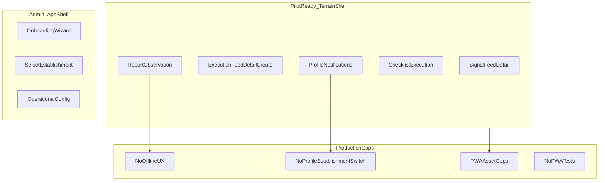

# Phase 2 — PWA / Mobile-first Audit

Status: audit report  
Date: 2026-06-26  
Mode: audit only — no source changes

## Sources

| Category | Files |
|----------|-------|
| Contract | [`AGENTS.md`](../AGENTS.md), [`apps/web/AGENTS.md`](../../apps/web/AGENTS.md), [`.cursor/rules/21-mobile-first-pwa.mdc`](../../.cursor/rules/21-mobile-first-pwa.mdc) |
| Compass | [`phase_2_audit_backlog.md`](./phase_2_audit_backlog.md) §7 (PWA transversal), §3 (NR-08, OR-07), §6 (OB-03, OR-09) |
| Prior consolidations | [`phase_2_frontend_architecture_consolidation.md`](./phase_2_frontend_architecture_consolidation.md), [`phase_2_tanstack_query_cache_consolidation.md`](./phase_2_tanstack_query_cache_consolidation.md), [`phase_2_realtime_event_driven_consolidation.md`](./phase_2_realtime_event_driven_consolidation.md), [`observation_refresh_consolidation.md`](./observation_refresh_consolidation.md), [`onboarding_observation_ai_consolidation.md`](./onboarding_observation_ai_consolidation.md) |
| Feature consolidations | [`signal_feed_consolidation.md`](./signal_feed_consolidation.md), [`execution_feed_consolidation.md`](./execution_feed_consolidation.md), [`checklist_consolidation.md`](./checklist_consolidation.md), [`notifications_realtime_consolidation.md`](./notifications_realtime_consolidation.md) |

**Branch context:** Feature audits closed (`TODO_NOW = 0`). API/OpenAPI, Database/ORM, Realtime/Event-driven, Celery/Async, TanStack Query/Cache, and Frontend Architecture phase 2 audits consolidated. This audit follows code evidence and actual UX for phone-first PWA readiness. Prior consolidations used as context, not as a checklist. No `FIXED`, `WONT_FIX_NOW`, or `DECISION_CLOSED` items reopened without new direct code evidence.

---

## Files inspected

| Layer | Paths |
|-------|-------|
| PWA / build | `apps/web/vite.config.ts`, `apps/web/src/main.tsx`, `apps/web/index.html`, `apps/web/public/pwa-icon.svg` |
| App shell / routing | `apps/web/src/App.tsx`, `apps/web/src/app/terrain-routes.ts`, `apps/web/src/app/lazy-terrain-pages.tsx`, `apps/web/src/components/layout/terrain-shell.tsx`, `apps/web/src/components/layout/bottom-mobile-nav.tsx`, `apps/web/src/components/app-shell.tsx` |
| Shared terrain UI | `apps/web/src/components/ui/terrain/terrain-sticky-footer.tsx`, `terrain-bottom-sheet.tsx`, `terrain-error-state.tsx`, `terrain-empty-state.tsx`, `apps/web/src/lib/terrain-styles.ts` |
| Houston focus flows | `features/signals/pages/signal-feed-page.tsx`, `signal-detail-page.tsx`, `features/execution/pages/execution-feed-page.tsx`, `features/actions/pages/action-detail-page.tsx`, `action-create-page.tsx`, `features/observations/pages/report-page.tsx`, `features/checklists/pages/checklist-execution-detail-page.tsx`, `checklist-hub-page.tsx`, `features/notifications/components/notification-center.tsx`, `notification-center-panel.tsx`, `features/auth/pages/profile-page.tsx`, `select-establishment-page.tsx`, `features/onboarding/pages/onboarding-page.tsx` |
| Realtime / reconnect | `features/realtime/components/operational-realtime-provider.tsx`, `features/realtime/lib/apply-operational-invalidation.ts`, `features/chat/components/chat-reconnect-banner.tsx`, `apps/web/src/lib/query-client.ts` |
| State / tenant switch | `features/auth/api.ts` (`switchEstablishment`, `purgeNonAuthQueries`) |
| CI | `.github/workflows/ci.yml` |

## Tests inspected

| Area | Files (representative) |
|------|------------------------|
| Feed / pagination | `features/execution/pages/execution-feed-page.test.tsx` |
| Sticky footer / detail | `features/actions/pages/action-detail-page.test.tsx`, `features/signals/pages/signal-detail-page.test.tsx` |
| WebSocket reconnect | `features/chat/hooks/use-chat-websocket.test.ts`, `features/realtime/lib/apply-operational-invalidation.test.ts`, `features/realtime/components/operational-realtime-provider.test.tsx` |
| Profile / nav | `features/auth/pages/profile-page.test.tsx`, `features/chat/chat-terrain-unread.integration.test.tsx` |
| Report (lib only) | `features/observations/report-page-success.test.ts`, `processing-status-labels.test.ts` |
| **Explicit absence** | Zero Vitest files reference `pwa`, `serviceWorker`, `registerSW`, `manifest`, `workbox`, `navigator.onLine`, or safe-area rendering |
| **Inventory** | 87 Vitest files under `apps/web/src/` |

## Docs / rules inspected

- [`phase_2_audit_backlog.md`](./phase_2_audit_backlog.md) §7 — PWA transversal (OR-07/OBS-07, NR-08, OB-03, OR-09)
- [`phase_2_frontend_architecture_consolidation.md`](./phase_2_frontend_architecture_consolidation.md) — FE-E5, FE-E7, FE-E1 (OB-03 mobile slice)
- [`phase_2_tanstack_query_cache_consolidation.md`](./phase_2_tanstack_query_cache_consolidation.md) — TQ-E4 / NR-08
- [`phase_2_realtime_event_driven_consolidation.md`](./phase_2_realtime_event_driven_consolidation.md) — RT-E8 / NR-08, RT-E9 / OR-07
- `.cursor/rules/21-mobile-first-pwa.mdc`, `20-frontend-react-vite-ts.mdc`, `01-agent-guardrails.mdc`

## Assumptions / unknowns

- No physical device profiling (battery drain, iOS standalone quirks, install prompt behavior on Chrome/Safari).
- `npm run build` not executed in this pass; prior QA report notes Vite chunk > 500 kB warning (`docs/qa/ticket_8_validation_report.md`).
- Establishment-switch frequency for pilot cohort unknown.
- Full viewport audit of every terrain page not line-by-line; focus flows per Houston field-team list.
- Whether `session.current_step` and client wizard step diverge on mobile refresh not exercised in browser (OB-07 / FE-E2 — onboarding scope, pilot-acceptable).
- `make verify` not run in this audit pass.

---

## 1. PWA readiness verdict

Houston is **pilot-ready in mobile browser** for **connected** field workflows. The operational terrain shell is intentionally phone-first: fixed `max-w-md` column, bottom navigation, safe-area padding, sticky lifecycle footers on signal/action detail, and bottom sheets for filters and create flows.

Houston is **not production-ready as an installed PWA** for field teams until:

1. Explicit offline/network-failure UX exists (project contract requires it; code has none).
2. Multi-establishment users can switch sites from terrain Profile without knowing `/select-establishment`.
3. PWA install assets and CI production-build verification close the gap between “SW exists in prod” and “installable app teams can trust.”
4. Mobile regression coverage exists for reconnect, sticky actions, and network edge cases.

**Security note:** No P0 mobile security bypass found. Residual risk is field UX friction, stale UI after tenant switch (FE-E5), and missing network-state communication — not RBAC bypass.

---

## 2. Readiness score

**64 / 100**

| Band | Points | Rationale |
|------|--------|-----------|
| Terrain core UX (shell, nav, critical flows) | +38 | Strong intentional mobile-first design across signal, execution, report, checklist execution, notifications, profile |
| PWA foundation (manifest, prod SW, lazy routes) | +12 | `vite-plugin-pwa` present; conservative `runtimeCaching: []`; route-level `React.lazy()` — but install polish and CI build gate incomplete |
| Realtime reconnect (WS + query invalidation) | +8 | Operational and chat WebSocket backoff; reconnect sweep for signals/actions/checklists/notifications; TanStack default `refetchOnReconnect` |
| Gaps vs project contract (offline states, tests, CI build) | −14 | AGENTS.md and rule 21 require explicit offline states; zero PWA tests; CI skips `npm run build` |
| Field ops friction (establishment switch, sticky CTAs, ErrorBoundary) | −10 | No Profile switch; report submit and checklist cancel not sticky; no ErrorBoundary |

| Tier | Score band | Meaning |
|------|------------|---------|
| Pilot (connected mobile browser) | 55–70 | **Current band** — daily field ops usable with known gaps |
| Installed PWA production | 80+ | Requires §5 blockers addressed |
| Offline-capable field PWA | 90+ | Explicitly out of current scope per `apps/web/AGENTS.md` (no durable offline mutation queue) |

---

## 3. What is already ready

### Terrain shell and navigation

- **`TerrainShell`** (`terrain-shell.tsx`) — `h-dvh max-w-md`, fixed topbar, scrollable main, optional bottom nav; `useReducedMotion()` respected.
- **Bottom nav** (`bottom-mobile-nav.tsx`, `terrain-routes.ts`) — Signaux, Exécution, Reporting (+), Chat, Profil; detail/create routes set `showBottomNav: false` with explicit `backPath`.
- **Safe-area insets** — `pb-[max(...,env(safe-area-inset-bottom))]` on bottom nav, sticky footers, bottom sheets, chat composer.
- **Back behavior** — `TerrainTopbar` navigates to `backPath`; `app-routes.ts` handles `popstate`.

### Critical field flows (terrain shell)

| Flow | Evidence | Mobile readiness |
|------|----------|------------------|
| **Signal feed/detail** | `signal-feed-page.tsx` — hub subheader, filters via bottom sheets, `TerrainErrorState` / `TerrainEmptyState`, infinite query + “Charger plus”; `signal-detail-page.tsx` — `signal-detail-sticky-footer.tsx` → `TerrainStickyFooter` (resolve/cancel, plan d'action, `h-11`) | Ready |
| **Action feed/detail/create** | `execution-feed-page.tsx` — create via `execution-create-menu-sheet.tsx`; `action-detail-page.tsx` — sticky footer on Détails tab only; `action-create-page.tsx` — `TerrainStickyFooter` submit, deadline bottom sheets | Ready |
| **Checklist execution** | `checklist-execution-detail-page.tsx` — `checklist-execution-task-row.tsx` task controls `h-11 w-11`; skip via `ChecklistExecutionSkipSheet`; report bridge via `buildChecklistReportingHref` | Ready (cancel placement gap — see PWA-E8) |
| **Notifications** | `notification-center.tsx` / `notification-center-panel.tsx` — hub popover `max-h-[min(70dvh,28rem)]`, infinite query, retry, bell `h-10 w-10` | Ready |
| **Report / observation** | `report-page.tsx` — voice `getUserMedia` + 100×100px mic (`report-voice-section.tsx`); photos via `report-photos-section.tsx` (HEIC/HEIF); processing poll with UX labels; success panel with full-width CTAs | Ready (submit stickiness gap — see PWA-E8) |
| **Profile / settings** | `profile-page.tsx` — `min-h-11` rows, notification preference toggle, management links gated by bootstrap hints | Ready (no establishment switch — see PWA-E2) |

### PWA and performance baseline

- **`vite-plugin-pwa`** (`vite.config.ts`) — `display: 'standalone'`, `theme_color: '#0f3b48'`, `runtimeCaching: []` (no authenticated API caching — aligns with project policy).
- **Prod SW registration** (`main.tsx`) — `registerSW({ immediate: false })` in production only; dev SW disabled.
- **Route code splitting** (`lazy-terrain-pages.tsx`) — 14 lazy terrain pages inside `<Suspense fallback={<RoutePageLoading />}>`.
- **Reconnect** — `operational-realtime-provider.tsx` calls `applyOperationalReconnectInvalidation` on WS reconnect; chat shows `ChatReconnectBanner`.

### Adjacent automated coverage

- Execution feed “Charger plus” pagination tested (`execution-feed-page.test.tsx`).
- Action detail sticky footer behavior tested (`action-detail-page.test.tsx`).
- WS reconnect and operational invalidation unit tests exist.

---

## 4. What is pilot-acceptable

Items below are imperfect but tolerable for a **connected** field pilot. Cross-referenced to backlog §7 and prior consolidations without reopening them as standalone findings.

| Item | Backlog / prior audit | Assessment |
|------|----------------------|------------|
| **2s processing-status poll** | OR-07, OBS-07, RT-E9 | `PROCESSING_POLL_INTERVAL_MS = 2000` in `observations/hooks.ts`; redundant with WS `signal.*` invalidation; safe at pilot volume; not profiled for battery |
| **Manual “Charger plus” pagination** | — | Signal, execution, notification feeds; no `IntersectionObserver`; tested on execution feed |
| **No list virtualization** | — | All loaded infinite-query pages rendered in DOM; OK for typical establishment sizes at pilot |
| **Onboarding in AppShell** | OB-03, FE-E1 | `onboarding-page.tsx` uses desktop-oriented `AppShell`; directors-only path, not daily field workflow |
| **Profile → `/app/operational-config`** | — | Exits terrain into admin layout; acceptable for manager/director pilot users |
| **Notification center as popover** | — | No dedicated `/notifications` route; panel fits phone viewport |
| **Inconsistent loading UX** | FE-E7 | Checklist hub plain “Chargement...” (`checklist-hub-page.tsx` L69) vs `LoaderCircle` on other terrain pages |
| **Comment staleness after reconnect** | NR-08, TQ-E4, RT-E8 | `applyOperationalReconnectInvalidation` omits comment query roots; edge case when tab backgrounded |
| **Hover on feed cards** | — | `terrain-styles.ts` L57 `hover:border-*` on tappable cards; cosmetic — cards remain tappable |
| **ACT-03 unwired reassign/due-at** | product decision | Hooks exist; no mobile-specific blocker for pilot |

---

## 5. What blocks production PWA usage

These gaps block recommending Houston as a **production installed PWA** for field teams (distinct from “usable in mobile Safari/Chrome with connectivity”).

1. **No explicit offline/network-failure UX** — `navigator.onLine`, `online`/`offline` events, and global offline banner absent across `apps/web/src`. Violates `apps/web/AGENTS.md` L44 and `.cursor/rules/21-mobile-first-pwa.mdc` L27–28. Field users on patchy connectivity see generic API errors only (`TerrainErrorState`).
2. **Establishment switch unreachable from Profile** — `switchEstablishment` API wired in `select-establishment-page.tsx` and `/app` workspace only. `profile-page.tsx` displays establishment name but offers no “Changer d'établissement”. Multi-site field staff must know `/select-establishment` URL.
3. **PWA install polish incomplete** — `index.html` references `/favicon.svg` (file missing; only `public/pwa-icon.svg` exists). Manifest has SVG icon only (no PNG 192/512). No Apple `apple-mobile-web-app-*` or `apple-touch-icon`. `registerType: 'prompt'` but no `onNeedRefresh` / install prompt UI in app code.
4. **CI does not verify production PWA build** — `.github/workflows/ci.yml` runs lint, test, typecheck only; no `npm run build`. PWA manifest/SW artifact path unguarded in CI.
5. **Zero PWA/mobile automated regression tests** — no coverage for SW registration, manifest, offline banner, safe-area, or install flow.
6. **No React ErrorBoundary** — grep finds no `ErrorBoundary` in `apps/web/src`; runtime errors on terrain routes likely white-screen with no recovery.
7. **Local UI state survives establishment switch** (FE-E5) — `purgeNonAuthQueries` in `auth/api.ts` clears query cache; component `useState` on report, feeds, create, wizard pages not reset. Risky when switching sites mid-flow on phone.
8. **Critical actions not always sticky** — report submit is inline `h-12` at page bottom (`report-page.tsx`); checklist cancel is inline after task list (`checklist-execution-detail-page.tsx` L175–185), scrolls off on long checklists despite `pb-28` padding.

---

## 6. Findings

### Backlog §7 mapping

| Finding | Backlog / prior audit | Disposition |
|---------|----------------------|-------------|
| PWA-E1 | §7 offline processing (OR-07/OBS-07 angle) | **New** — primary offline UX gap |
| PWA-E2 | — | **New** |
| PWA-E3, PWA-E5 | — | **New** |
| PWA-E4 | NR-08, RT-E8, TQ-E4 | **New** (reconnect visibility); NR-08 comment sweep remains deferred quick win |
| PWA-E6, PWA-E7 | OR-09 (page test gap slice) | **New** |
| PWA-E8 | OR-09 mobile layout slice | **New** |
| PWA-E9, PWA-E10 | — | **New** |
| OR-07 poll | RT-E9 | **Pilot-acceptable** — not promoted |
| OB-03 wizard tests/layout | FE-E1 | **Referenced** — onboarding not field-daily |
| FE-E5 local state | Frontend consolidation | **Incorporated** in §5 blocker 7 |
| FE-E7 loading UX | Frontend consolidation | **Pilot-acceptable** in §4 |

| Priority | Count | Themes |
|----------|-------|--------|
| **P1** | 2 | Offline/network UX (PWA-E1); Profile establishment switch (PWA-E2) |
| **P2** | 6 | PWA assets (PWA-E3); reconnect indicator (PWA-E4); CI build (PWA-E5); PWA tests (PWA-E6); ErrorBoundary (PWA-E7); sticky CTAs (PWA-E8) |
| **P3** | 2 | Feed scaling (PWA-E9); touch targets / hover (PWA-E10) |

---

### PWA-E1 — Offline and network-failure states absent

| Field | Detail |
|-------|--------|
| **ID** | PWA-E1 |
| **Severity** | P1 |
| **Category** | ambiguity / maintainability |
| **Evidence** | Grep across `apps/web/src`: no `navigator.onLine`, no `online`/`offline` event listeners, no global offline banner. `query-client.ts` sets `retry: 1` only; `api/client.ts` `withAuthRetry` handles 401 refresh, not network loss. `TerrainErrorState` shows generic API messages. `apps/web/AGENTS.md` L44 and `.cursor/rules/21-mobile-first-pwa.mdc` L27–28 require explicit offline/network failure states. Chat has `ChatReconnectBanner` for WS only. |
| **Problem** | Field teams on patchy mobile connectivity have no app-level signal that the network is down. Failed fetches and mutations surface as opaque errors; processing poll (`observations/hooks.ts`) continues until terminal status with no offline-specific copy. |
| **User impact** | Users retry blindly, assume the app is broken, or abandon reports mid-submit. Processing screen during observation analysis gives no “hors ligne” guidance if poll fails. |
| **Suggested direction** | Add a global network-state layer (banner or topbar chip) wired to `navigator.onLine` and failed query/mutation detection; map `TerrainErrorState` network failures to field-friendly copy. Do not add API caching or offline mutation queue without explicit product approval. |
| **Test / manual-check coverage** | None automated. Manual: airplane mode mid-report (§7 check 7). |
| **Size** | M |

---

### PWA-E2 — Establishment switch unreachable from terrain Profile

| Field | Detail |
|-------|--------|
| **ID** | PWA-E2 |
| **Severity** | P1 |
| **Category** | structure |
| **Evidence** | `profile-page.tsx` — displays `establishment_name` via `buildRoleEstablishmentLine` (L79–92, L194–196); no link to `/select-establishment` or inline switch. `select-establishment-page.tsx` + `establishment-selector-card.tsx` — post-login switch UI with `switchEstablishment` mutation. `use-app-page-workspace.ts` — same API on `/app` (AppShell). `auth/api.ts` L368 — `purgeNonAuthQueries` on switch. |
| **Problem** | Multi-establishment field users who need to change site during a shift have no discoverable path from the terrain Profile screen. Switch UI exists only at login selection and admin workspace. |
| **User impact** | Staff covering multiple sites must bookmark `/select-establishment`, sign out/in, or use desktop admin — friction that blocks same-day multi-site field usage. |
| **Suggested direction** | Add Profile entry “Changer d'établissement” routing to existing selector or inline sheet; reuse `switchEstablishment` + cache purge. Consider remount/reset pattern for FE-E5 local state on switch. |
| **Test / manual-check coverage** | `profile-page.test.tsx` — no switch entry tested. Manual: §7 check 9. |
| **Size** | S |

---

### PWA-E3 — PWA install assets and update UI incomplete

| Field | Detail |
|-------|--------|
| **ID** | PWA-E3 |
| **Severity** | P2 |
| **Category** | structure |
| **Evidence** | `index.html` L5 — `<link rel="icon" href="/favicon.svg" />`; `public/` contains only `pwa-icon.svg`. `vite.config.ts` manifest — single SVG icon, no PNG 192/512, no `scope`/`description`/`orientation`. No `apple-mobile-web-app-capable`, `apple-touch-icon`, or `viewport-fit=cover` in `index.html`. `main.tsx` — `registerSW({ immediate: false })` with `registerType: 'prompt'` but no `onNeedRefresh` handler or install prompt UI in codebase. |
| **Problem** | Installed PWA may show broken favicon, generic home-screen icon on iOS, and no user-visible SW update flow. Android installability may pass with SVG-only icon but iOS polish is weak. |
| **User impact** | Field teams installing to home screen get inconsistent branding; silent SW updates or stale shell without user prompt; trust erosion for “official app” rollout. |
| **Suggested direction** | Add favicon + PNG icons + Apple meta tags; wire `registerSW` callbacks for update prompt. Keep conservative `runtimeCaching: []`. |
| **Test / manual-check coverage** | None automated. Manual: §7 checks 1–2. |
| **Size** | S |

---

### PWA-E4 — No global operational reconnect indicator

| Field | Detail |
|-------|--------|
| **ID** | PWA-E4 |
| **Severity** | P2 |
| **Category** | maintainability |
| **Evidence** | `operational-realtime-provider.tsx` — reconnect triggers `applyOperationalReconnectInvalidation` silently (L59–64). `chat-reconnect-banner.tsx` — visible banner for chat WS only (“Connexion / Reconnexion / déconnecté”). `apply-operational-invalidation.ts` L72–79 — reconnect sweep covers signals, actions, checklists, notifications; **not** comments (NR-08 / RT-E8). No operational connection status exposed to terrain UI. |
| **Problem** | After background tab, tunnel, or transient WS drop, operational feeds refetch in background with no user feedback. Comment threads may stay stale until navigation (NR-08). |
| **User impact** | Field user returns from break unsure if data is fresh; may act on stale signal/action state; open comment threads on detail pages can show outdated replies. |
| **Suggested direction** | Add terrain-level reconnect chip or brief banner mirroring chat pattern; optionally extend reconnect sweep to comment roots when refetch cost accepted (NR-08, size S per TanStack consolidation). |
| **Test / manual-check coverage** | `apply-operational-invalidation.test.ts` — reconnect invalidation logic only, no UI. Manual: §7 check 8. |
| **Size** | S (banner) / S (NR-08 comment sweep) |

---

### PWA-E5 — CI skips production build; PWA artifacts unverified

| Field | Detail |
|-------|--------|
| **ID** | PWA-E5 |
| **Severity** | P2 |
| **Category** | tests |
| **Evidence** | `.github/workflows/ci.yml` — `frontend-tests` job: `npm ci`, `npm run lint`, `npm test`, `npm run typecheck`; **no** `npm run build`. `vite-plugin-pwa` generates manifest + SW only at build time. Prior QA (`docs/qa/ticket_8_validation_report.md`) notes chunk > 500 kB warning on manual build. |
| **Problem** | PWA manifest injection, Workbox precache manifest, and production bundle regressions are not caught in CI. |
| **User impact** | Broken install or failed SW registration could reach field pilot without automated detection. |
| **Suggested direction** | Add `npm run build` to CI frontend job; optionally assert manifest/SW files exist in `dist/`. |
| **Test / manual-check coverage** | Manual build only outside CI. |
| **Size** | S |

---

### PWA-E6 — No automated PWA or mobile regression tests

| Field | Detail |
|-------|--------|
| **ID** | PWA-E6 |
| **Severity** | P2 |
| **Category** | tests |
| **Evidence** | Grep `*.{test,spec}.{ts,tsx}` for `pwa`, `serviceWorker`, `registerSW`, `manifest`, `workbox`, `safe-area`, `navigator.onLine` → zero matches. Rule 21-mobile-first-pwa.mdc L44–45: “When changing mobile/PWA behavior, cover route, nav, sticky action, form state, offline/error state.” 87 Vitest files exist; mobile coverage is incidental (sticky footer, feed pagination, WS reconnect). |
| **Problem** | PWA installability, offline banner, safe-area layout, and establishment-switch UX have no regression gate. |
| **User impact** | Mobile regressions ship silently; field pilot QA burden falls entirely on manual phone checks. |
| **Suggested direction** | Add focused Vitest/RTL tests for network banner, Profile switch entry, sticky footers on report/checklist; optional build-step smoke for manifest presence. |
| **Test / manual-check coverage** | Adjacent only — see Tests inspected section. |
| **Size** | M |

---

### PWA-E7 — No ErrorBoundary on terrain shell

| Field | Detail |
|-------|--------|
| **ID** | PWA-E7 |
| **Severity** | P2 |
| **Category** | maintainability |
| **Evidence** | Grep `ErrorBoundary` / `error boundary` in `apps/web/src` → no matches. `App.tsx` wraps terrain routes in `TerrainShell` + `Suspense` only. Uncaught render errors propagate to blank root. |
| **Problem** | Any unhandled React error on a field route (bad data shape, hook throw) produces white screen with no recovery path on phone. |
| **User impact** | Field user stuck until force-refresh or reinstall; no “Réessayer” or navigate-home fallback. |
| **Suggested direction** | Wrap terrain shell (or per-route) with ErrorBoundary rendering `TerrainErrorState`-style recovery with reload / home navigation. |
| **Test / manual-check coverage** | None. |
| **Size** | S |

---

### PWA-E8 — Report submit and checklist cancel not sticky

| Field | Detail |
|-------|--------|
| **ID** | PWA-E8 |
| **Severity** | P2 |
| **Category** | structure |
| **Evidence** | `report-page.tsx` L368 — submit `Button` `h-12 w-full` inline at form bottom; no `TerrainStickyFooter`. Contrast `action-create-page.tsx` sticky submit. `checklist-execution-detail-page.tsx` L139 `pb-28` padding but cancel `Button` L175–185 is inline after full task list — scrolls off on long checklists. Rule 21: “Prefer sticky bottom primary actions for field workflows.” |
| **Problem** | Primary field actions require scroll to reach on long forms or long checklists. |
| **User impact** | Report submit hidden below keyboard or long photo list; cancel execution unreachable without scrolling past all tasks on large checklists. |
| **Suggested direction** | Move report submit to `TerrainStickyFooter`; pin checklist cancel (or progress + cancel bar) sticky above safe-area inset. |
| **Test / manual-check coverage** | `action-detail-page.test.tsx` tests sticky footer; no report/checklist sticky tests. Manual: §7 checks 5–6. |
| **Size** | S |

---

### PWA-E9 — Feeds render all loaded pages; manual pagination only

| Field | Detail |
|-------|--------|
| **ID** | PWA-E9 |
| **Severity** | P3 |
| **Category** | performance |
| **Evidence** | `signal-feed-page.tsx`, `execution-feed-page.tsx`, `notification-center-panel.tsx` — `useInfiniteQuery` flattens all pages into DOM; “Charger plus” button (no `IntersectionObserver`, no virtualization library). `terrain-routes.ts` — hub routes use `mainScroll: 'hidden'` with inner scroll regions. |
| **Problem** | Heavy “load more” usage accumulates DOM nodes and memory on mid-tier phones. |
| **User impact** | Scroll jank and battery drain during long shifts browsing signals/execution on older devices; not acute at pilot establishment sizes. |
| **Suggested direction** | Defer until pilot scale proves pain; then windowing or virtual list for feed cards, or cap retained pages. |
| **Test / manual-check coverage** | `execution-feed-page.test.tsx` — pagination button behavior only. |
| **Size** | L (virtualization) |

---

### PWA-E10 — Sub-44px touch targets and hover-dependent card styles

| Field | Detail |
|-------|--------|
| **ID** | PWA-E10 |
| **Severity** | P3 |
| **Category** | structure |
| **Evidence** | `report-photos-section.tsx` L72–83 — remove photo button `h-6 w-6` (~24px). `signal-feed-filters-bar.tsx` — filter slots compact `py-1.5`; “Effacer les filtres” small text link. `terrain-styles.ts` L57 — `hover:border-*` on feed interactive cards. `establishment-selector-card.tsx` — `hover:` border styles on tappable rows. Rule 21: “No hover-only interaction”; “Keep tap targets comfortable.” |
| **Problem** | Some interactive elements fall below comfortable mobile tap size; hover styles are inert on touch but violate project mobile rules cosmetically. |
| **User impact** | Occasional mis-taps removing photos; filter clear harder to hit with gloves or on bumpy sites. Low severity vs sticky/offline gaps. |
| **Suggested direction** | Enlarge photo remove hit area (min 44px); promote filter clear to button; replace hover-only affordances with active/focus states. |
| **Test / manual-check coverage** | None. Manual: §7 check 5 (photo remove). |
| **Size** | S |

---

## 7. Manual phone checks to run

Run on at least one **iOS Safari** and one **Android Chrome** device before field pilot or PWA install rollout.

| # | Check | Pass criteria | Related finding |
|---|-------|---------------|-----------------|
| 1 | **Install flow** | Add to Home Screen; icon visible; opens standalone without browser chrome; theme color on status bar | PWA-E3 |
| 2 | **Safe area** | Bottom nav, sticky footers, chat composer not clipped on notched iPhone | — |
| 3 | **Signal flow** | Feed filters → detail → sticky resolve / plan d'action → back | — |
| 4 | **Execution flow** | Create via `+` sheet → detail lifecycle footer on Détails tab only | — |
| 5 | **Report flow** | Voice permission; photo picker (HEIC); submit; processing labels; success navigation | PWA-E8, PWA-E10 |
| 6 | **Checklist execution** | Long checklist: cancel button reachability without excessive scroll; skip sheet keyboard | PWA-E8 |
| 7 | **Airplane mode** | Toggle mid-session: note absence/presence of offline banner; error copy quality on feed and report | PWA-E1 |
| 8 | **Reconnect** | Background tab 5+ min; return — feed freshness; open comment thread on signal/action detail | PWA-E4, NR-08 |
| 9 | **Establishment switch** | Multi-membership user: can switch site from Profile without knowing URL | PWA-E2 |
| 10 | **Keyboard** | Action create / report textarea: no horizontal scroll; submit reachable | PWA-E8 |

Additional spot checks:

- **SW update** — deploy new build; confirm whether user sees update prompt (expect gap today — PWA-E3).
- **Establishment switch mid-flow** — start report, switch establishment via `/select-establishment`; confirm no stale draft bleed (FE-E5).
- **Chat reconnect banner** — toggle airplane mode; confirm chat banner appears while operational feeds do not (PWA-E4).

---

## 8. Top priorities

### Top 3 fixes first

1. **PWA-E1** — Global offline/network banner + field-friendly error copy for failed queries/mutations.
2. **PWA-E2** — “Changer d'établissement” on Profile using existing `switchEstablishment` API; pair with FE-E5 local-state reset consideration.
3. **PWA-E3 + PWA-E5** — PWA asset polish (favicon, PNG/Apple icons) and CI `npm run build` gate.

### Quick wins

- **PWA-E4** — Operational reconnect banner (mirror chat pattern).
- **PWA-E8** — Sticky report submit footer.
- **NR-08** — Comment prefix in reconnect sweep (S, per TanStack consolidation — complements PWA-E4).

### Structural issues to plan later

- **PWA-E9** — Feed virtualization or page retention cap at scale.
- **FE-E5** — Establishment-scoped remount or explicit local state reset across terrain pages.
- **Durable offline mutation queue** — explicitly out of scope per `apps/web/AGENTS.md` unless product approves.
- **Onboarding terrain shell** — OB-03 / FE-E1; directors path, not field-daily.

### Not worth fixing now

- **OR-07** — 2s processing poll interval tuning without observation WS subject.
- **SIG-06** — Signal feed tab labels (“Ma zone” / “Vue globale”) cosmetic.
- **Hover polish alone** on feed cards when tappability works.
- **PNG icons** if pilot stays browser-first and install is deferred.

---

## Changed / Validated / Risks

| | |
|-|-|
| **Changed** | New audit report: `docs/audits/phase_2_pwa_mobile_first_audit.md` only |
| **Validated** | Code evidence from `apps/web` (PWA config, terrain shell, 8 focus flows, reconnect, CI); cross-check against phase 2 consolidations (Frontend, TanStack, Realtime) and backlog §7 transversal items |
| **Risks / not verified** | `make verify` not run; no physical device testing; production PWA install on iOS/Android not exercised; battery impact of 2s poll not profiled; chunk size not measured in this pass |
