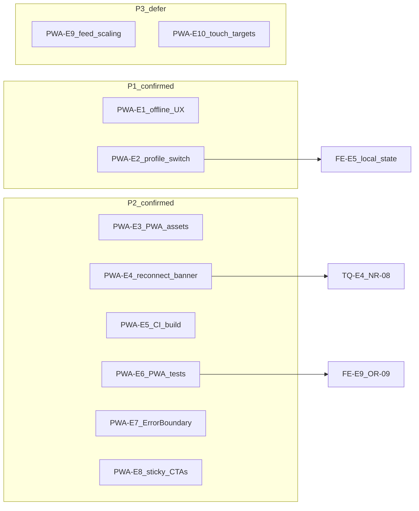
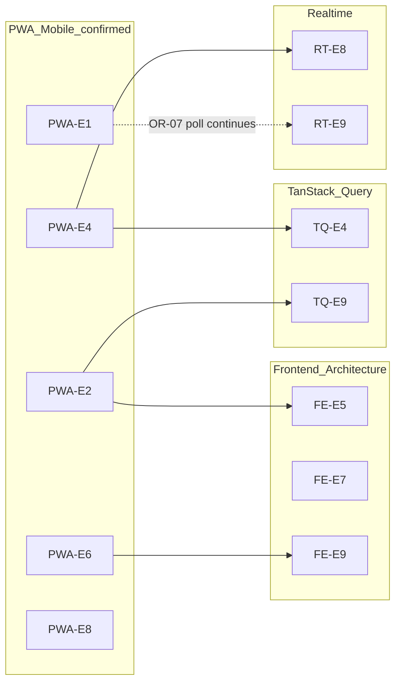

# Phase 2 — PWA / Mobile-first Consolidation

> **Post-audit note (2026-06-27):** Wave 1 scoped deliverables landed — see [`phase_2_final_roadmap.md`](./phase_2_final_roadmap.md) § Wave 1 status. **MOBILE-01** 01a–01e done scoped (ROADMAP-05..09); **MOBILE-01** parent theme remains open (**FE-E5**, **TEST-RPT-01**, PWA-E5–E8, PNG/Apple, device QA). Evidence rows below reflect the 2026-06-26 audit snapshot.

Status: consolidation report  
Date: 2026-06-26  
Mode: consolidation only — no source changes

## Sources

| Category | Files |
|----------|-------|
| Audit input | [`phase_2_pwa_mobile_first_audit.md`](./phase_2_pwa_mobile_first_audit.md) (PWA-E1–PWA-E10) |
| Backlog | [`phase_2_audit_backlog.md`](./phase_2_audit_backlog.md) §7 (PWA transversal), §3 (NR-08, OR-07), §6 (OB-03, OR-09) |
| Closure | [`feature_audit_closure.md`](./feature_audit_closure.md) |
| Decisions | [`feature_audit_decisions.md`](./feature_audit_decisions.md) |
| Cross-audit | [`phase_2_frontend_architecture_consolidation.md`](./phase_2_frontend_architecture_consolidation.md) (FE-E5, FE-E7, FE-E9), [`phase_2_tanstack_query_cache_consolidation.md`](./phase_2_tanstack_query_cache_consolidation.md) (TQ-E4, TQ-E9), [`phase_2_realtime_event_driven_consolidation.md`](./phase_2_realtime_event_driven_consolidation.md) (RT-E8, RT-E9) |
| Contract | [`AGENTS.md`](../../AGENTS.md), [`apps/web/AGENTS.md`](../../apps/web/AGENTS.md), [`.cursor/rules/21-mobile-first-pwa.mdc`](../../.cursor/rules/21-mobile-first-pwa.mdc) |

**Branch context:** Feature audits closed (`TODO_NOW = 0`). API/OpenAPI, Database/ORM, Realtime/Event-driven, Celery/Async, TanStack Query/Cache, and Frontend Architecture phase 2 audits consolidated. This consolidation challenges each finding from the phase 2 PWA / Mobile-first audit against backlog §7, closure registry, decision pack, sibling consolidations, and spot-check code evidence. No `FIXED`, `WONT_FIX_NOW`, or `DECISION_CLOSED` items reopened without new direct code evidence.

---

## 1. Executive summary

Houston is **pilot-ready for connected mobile browser** field workflows. The operational terrain shell is intentionally phone-first: fixed `max-w-md` column, bottom navigation, safe-area padding, sticky lifecycle footers on signal/action detail, lazy routes, and production service-worker registration with conservative `runtimeCaching: []`.

Houston is **not production-ready as an installed PWA** for field teams until **PWA installability blockers** are addressed: offline/network UX (PWA-E1), Profile establishment switch discoverability (PWA-E2), and install/CI polish (PWA-E3 engineering slice, PWA-E5).

Separately, **field-usage production blockers** remain even when install is not in scope: terrain ErrorBoundary (PWA-E7) and sticky primary actions on report/checklist (PWA-E8) affect daily terrain reliability — they are not installability blockers, but they block recommending Houston for production field shifts without known recovery/layout gaps.

**Readiness score from audit: 64 / 100** — retained as a qualitative pilot-band indicator (55–70 = connected mobile browser usable with known gaps). Not re-measured in this consolidation pass.

Residual risk is **not** a mobile security bypass. It clusters in:

1. **Offline/network communication gap** — project contract requires explicit offline states; code has none (PWA-E1, P1)
2. **Establishment switch discoverability** — multi-site field staff cannot switch from terrain Profile (PWA-E2, P1)
3. **Install and CI trust gaps** — engineering-owned: missing favicon, no SW update UI, basic install trust (PWA-E3); CI skips production build (PWA-E5, P2). PNG/Apple home-screen polish is product-gated/deferable if pilot stays browser-first.
4. **Mobile regression prevention** — zero PWA-specific automated tests (PWA-E6, P2); terrain ErrorBoundary absent — field-usage production blocker, not installability (PWA-E7, P2)
5. **Sticky primary actions** — report submit and checklist cancel scroll off on long flows; field-usage production blocker, not installability (PWA-E8, P2)
6. **Reconnect visibility** — operational WS reconnect is silent; chat has a banner (PWA-E4 banner slice, P2)

**No P0 mobile security bypass found.**

| Priority | Count | Themes |
|----------|-------|--------|
| **P1** | 2 | Offline/network UX (PWA-E1); Profile establishment switch (PWA-E2) |
| **P2** | 6 | PWA assets (PWA-E3); reconnect visibility (PWA-E4); CI build (PWA-E5); PWA tests (PWA-E6); ErrorBoundary (PWA-E7); sticky CTAs (PWA-E8) |
| **P3** | 2 | Feed DOM scaling (PWA-E9 — defer); touch targets / hover polish (PWA-E10 — partial ignore) |

**Consolidation verdict:** 10 audit findings reviewed → **8 engineering-owned confirmations (PWA-E1–E8)**, **2 confirmed but deferred/polish (PWA-E9–E10)**, **0 full false positives**, **4 duplicate slices** to sibling audits, **1 product-gated out-of-scope item** (durable offline mutation queue).

---

## 2. Findings reviewed

All 10 findings from [`phase_2_pwa_mobile_first_audit.md`](./phase_2_pwa_mobile_first_audit.md) §6, cross-checked against [`phase_2_audit_backlog.md`](./phase_2_audit_backlog.md) §7, [`feature_audit_closure.md`](./feature_audit_closure.md), [`feature_audit_decisions.md`](./feature_audit_decisions.md), sibling consolidations, and spot-check code evidence.

| ID | Audit sev | Reclassification | Backlog / prior alias | Consolidation notes |
|----|-----------|------------------|----------------------|---------------------|
| **PWA-E1** | P1 | **CONFIRMED** | §7 OR-07/OBS-07 angle (offline only) | Contract gap: [`apps/web/AGENTS.md`](../../apps/web/AGENTS.md) L44 and rule 21 require explicit offline states; grep finds zero `navigator.onLine` / `online`/`offline` listeners in `apps/web/src`. OR-07 poll continues on network loss — related but distinct (poll ≠ offline UX). Not duplicate. |
| **PWA-E2** | P1 | **CONFIRMED** | — (new) | `switchEstablishment` wired in [`select-establishment-page.tsx`](../../apps/web/src/features/auth/pages/select-establishment-page.tsx) and `/app` workspace only. [`profile-page.tsx`](../../apps/web/src/features/auth/pages/profile-page.tsx) displays establishment name but offers no switch entry. **Pairs with FE-E5** (local state reset) — complement, not duplicate. |
| **PWA-E3** | P2 | **CONFIRMED** + **PRODUCT_DECISION** slice | — | **Engineering-owned (P2):** missing favicon ([`index.html`](../../apps/web/index.html) → `/favicon.svg` absent; `public/` has only `pwa-icon.svg`); no SW update UI (`registerSW` without `onNeedRefresh`); basic install trust gap. **Product-gated/deferable:** PNG 192/512, `apple-mobile-web-app-*`, `apple-touch-icon`, `viewport-fit=cover` — if pilot stays browser-first. |
| **PWA-E4** | P2 | **CONFIRMED** (banner) + **DUPLICATE** (comment slice) | NR-08, RT-E8, TQ-E4 | **Unique:** no operational reconnect indicator ([`operational-realtime-provider.tsx`](../../apps/web/src/features/realtime/components/operational-realtime-provider.tsx) reconnects silently; chat has [`ChatReconnectBanner`](../../apps/web/src/features/chat/components/chat-reconnect-banner.tsx)). **Duplicate slice:** comment thread staleness after reconnect — owned by TQ-E4/NR-08 (DEFER_PHASE_2, size S). Do not double-count. |
| **PWA-E5** | P2 | **CONFIRMED** | — (CI/DevEx adjacent) | [`.github/workflows/ci.yml`](../../.github/workflows/ci.yml) frontend job: lint, test, typecheck — **no** `npm run build`. PWA manifest/SW generated only at build. Not covered by R10 (docs hygiene). |
| **PWA-E6** | P2 | **CONFIRMED** + **DUPLICATE** slice | OR-09, FE-E9 | **Unique:** zero Vitest files reference `pwa`, `serviceWorker`, `manifest`, `safe-area`, or `navigator.onLine`. **Duplicate slice:** report-page component tests — OR-09 already in FE-E9; PWA-E6 references, does not re-own. Adjacent sticky-footer tests exist (action/signal detail). |
| **PWA-E7** | P2 | **CONFIRMED** | — (not in FE consolidation) | Grep `ErrorBoundary` in `apps/web/src` → zero matches. [`App.tsx`](../../apps/web/src/App.tsx) wraps terrain in `TerrainShell` + `Suspense` only. White-screen risk on unhandled render errors. |
| **PWA-E8** | P2 | **CONFIRMED** | OR-09 (layout slice only) | [`report-page.tsx`](../../apps/web/src/features/observations/pages/report-page.tsx) L368 — inline submit `h-12 w-full`, no `TerrainStickyFooter`. [`checklist-execution-detail-page.tsx`](../../apps/web/src/features/checklists/pages/checklist-execution-detail-page.tsx) L139 `pb-28`, cancel L175–185 inline after task list. OR-09 owns **tests**, not layout. |
| **PWA-E9** | P3 | **CONFIRMED** + **DEFER_PHASE_2** + **IGNORE_NOW** (pilot) | — | Signal, execution, notification feeds flatten all infinite-query pages into DOM; manual "Charger plus" only. Real at scale; pilot establishment sizes tolerable per audit §4. |
| **PWA-E10** | P3 | **CONFIRMED** (photo remove) + **IGNORE_NOW** (hover slice) | — | [`report-photos-section.tsx`](../../apps/web/src/features/observations/components/report-photos-section.tsx) remove button `h-6 w-6` (~24px). [`terrain-styles.ts`](../../apps/web/src/lib/terrain-styles.ts) L57 `hover:border-*` on tappable cards — cosmetic; cards remain tappable. |

### Pilot-acceptable items (not promoted to standalone findings)

| Item | Prior audit / closure | Disposition |
|------|----------------------|-------------|
| 2s processing-status poll | OR-07, RT-E9, **WONT_FIX_NOW** echo | **IGNORE_NOW** — redundant with WS but safe at pilot volume |
| Manual "Charger plus" pagination | — | **IGNORE_NOW** — tested on execution feed |
| No list virtualization | PWA-E9 defer | **DEFER_PHASE_2** |
| Onboarding in AppShell | OB-03, FE-E1 | **DEFER_PHASE_2** — directors path, not field-daily |
| Inconsistent loading UX | FE-E7 | **DUPLICATE** — owned by Frontend consolidation |
| Comment staleness on reconnect | NR-08, TQ-E4 | **DUPLICATE** — slice of PWA-E4 |
| Local UI state after switch | FE-E5 | **CONFIRMED elsewhere** — audit §5 blocker 7; PWA-E2 dependency |
| ACT-03 unwired reassign/due-at | **DECISION_OPEN** | **PRODUCT_DECISION** — not mobile blocker |
| Hover on feed cards | — | **IGNORE_NOW** |

### Out-of-scope product gate (not a finding)

**Durable offline mutation queue** — explicitly excluded by [`apps/web/AGENTS.md`](../../apps/web/AGENTS.md) L46. PWA-E1 addresses **UX communication only** (banner, copy, query/mutation failure surfacing), not offline writes.

**Backlog §7 re-validation:** OR-07 (poll battery), NR-08 (reconnect comment sweep), OB-03 (wizard mobile), OR-09 (ReportPage tests) remain valid as transversal themes. PWA audit adds new findings (PWA-E1–E3, E5, E7) not previously in DEFER registry.

---

## 3. Confirmed findings

Full cards below cover findings with **engineering priority** (PWA-E1–PWA-E8). **PWA-E9** and **PWA-E10** are also **confirmed** at finding level but documented in [§4](#4-reclassified--duplicate--false-positive-findings) as deferred/polish.

### PWA-E1 — Offline and network-failure states absent

| Field | Detail |
|-------|--------|
| **Severity** | P1 |
| **Evidence** | Grep across `apps/web/src`: no `navigator.onLine`, no `online`/`offline` event listeners, no global offline banner. [`query-client.ts`](../../apps/web/src/lib/query-client.ts) sets `retry: 1` only; [`api/client.ts`](../../apps/web/src/lib/api/client.ts) `withAuthRetry` handles 401 refresh, not network loss. [`TerrainErrorState`](../../apps/web/src/components/ui/terrain/terrain-error-state.tsx) shows generic API messages. [`apps/web/AGENTS.md`](../../apps/web/AGENTS.md) L44 and [`.cursor/rules/21-mobile-first-pwa.mdc`](../../.cursor/rules/21-mobile-first-pwa.mdc) L27–28, L42 require explicit offline/network failure states. Chat has `ChatReconnectBanner` for WS only. |
| **Why confirmed** | Contract violation with direct code evidence. Field teams on patchy connectivity see opaque API errors only; processing poll (`observations/hooks.ts` `PROCESSING_POLL_INTERVAL_MS = 2000`) continues with no offline-specific copy. |
| **Risk** | Users retry blindly, assume the app is broken, or abandon reports mid-submit. Blocks trustworthy field use on patchy mobile networks and violates stated project mobile/PWA contract. |
| **Suggested direction** | Add a global network-state layer (banner or topbar chip) wired to `navigator.onLine` and failed query/mutation detection; map `TerrainErrorState` network failures to field-friendly copy. Do not add API caching or offline mutation queue without explicit product approval. |
| **Dependencies** | Independent; complementary to OR-07/RT-E9 (poll continues on loss — separate concern) |
| **Size** | M |

---

### PWA-E2 — Establishment switch unreachable from terrain Profile

| Field | Detail |
|-------|--------|
| **Severity** | P1 |
| **Evidence** | [`profile-page.tsx`](../../apps/web/src/features/auth/pages/profile-page.tsx) — displays `establishment_name` via `buildRoleEstablishmentLine` (L79–92, L194–196); no link to `/select-establishment` or inline switch. [`select-establishment-page.tsx`](../../apps/web/src/features/auth/pages/select-establishment-page.tsx) + [`establishment-selector-card.tsx`](../../apps/web/src/features/auth/components/establishment-selector-card.tsx) — post-login switch UI with `switchEstablishment` mutation. [`use-app-page-workspace.ts`](../../apps/web/src/features/auth/hooks/use-app-page-workspace.ts) — same API on `/app` (AppShell). [`auth/api.ts`](../../apps/web/src/features/auth/api.ts) L368 — `purgeNonAuthQueries` on switch. |
| **Why confirmed** | Multi-establishment field users have no discoverable path from the terrain Profile screen. Switch UI exists only at login selection and admin workspace. Grep confirms zero switch references in profile page. |
| **Risk** | Staff covering multiple sites must bookmark `/select-establishment`, sign out/in, or use desktop admin — friction that blocks same-day multi-site field usage. |
| **Suggested direction** | Add Profile entry "Changer d'établissement" routing to existing selector or inline sheet; reuse `switchEstablishment` + cache purge. Coordinate establishment-scoped remount or explicit local state reset per FE-E5. |
| **Dependencies** | FE-E5 (component `useState` persists after switch); TQ-E9 (bootstrap parity on cross-tab switch) |
| **Size** | S |

---

### PWA-E3 — PWA install assets and update UI incomplete

| Field | Detail |
|-------|--------|
| **Severity** | P2 |
| **Evidence** | [`index.html`](../../apps/web/index.html) L5 — `<link rel="icon" href="/favicon.svg" />`; `public/` contains only `pwa-icon.svg`. [`vite.config.ts`](../../apps/web/vite.config.ts) manifest — single SVG icon, no PNG 192/512, no `scope`/`description`/`orientation`. No `apple-mobile-web-app-capable`, `apple-touch-icon`, or `viewport-fit=cover` in `index.html`. [`main.tsx`](../../apps/web/src/main.tsx) — `registerSW({ immediate: false })` with `registerType: 'prompt'` but no `onNeedRefresh` handler or install prompt UI. |
| **Why confirmed** | **Engineering-owned:** broken favicon reference, silent SW updates, and missing update prompt undermine basic install trust regardless of pilot mode. **Product-gated/deferable:** PNG/Apple home-screen polish affects iOS branding quality but can wait if pilot stays browser-first. |
| **Risk** | Engineering slice: users see broken tab icon and stale shell without prompt — trust erosion even in browser. Product slice: generic home-screen icon on iOS when install is pursued. |
| **Suggested direction** | **Engineering (P2):** fix favicon; wire `registerSW` callbacks for update prompt; keep conservative `runtimeCaching: []`. **Product gate:** add PNG icons + Apple meta tags when home-screen install is a pilot requirement. |
| **Dependencies** | Pairs with PWA-E5 for install trust; independent of backend |
| **Size** | S |

---

### PWA-E4 — No global operational reconnect indicator

| Field | Detail |
|-------|--------|
| **Severity** | P2 |
| **Evidence** | [`operational-realtime-provider.tsx`](../../apps/web/src/features/realtime/components/operational-realtime-provider.tsx) — reconnect triggers `applyOperationalReconnectInvalidation` silently (L59–64). [`chat-reconnect-banner.tsx`](../../apps/web/src/features/chat/components/chat-reconnect-banner.tsx) — visible banner for chat WS only. [`apply-operational-invalidation.ts`](../../apps/web/src/features/realtime/lib/apply-operational-invalidation.ts) L72–79 — reconnect sweep covers signals, actions, checklists, notifications; **not** comments (NR-08 / TQ-E4). |
| **Why confirmed** | **Banner slice (unique to PWA):** operational feeds refetch in background with no user feedback after background tab, tunnel, or transient WS drop. **Comment slice (duplicate):** open comment threads may stay stale until navigation — already owned by TQ-E4/NR-08/RT-E8. |
| **Risk** | Field user returns from break unsure if data is fresh; may act on stale signal/action state. Comment staleness is edge-case mobile pain (deferred). |
| **Suggested direction** | Add terrain-level reconnect chip or brief banner mirroring chat pattern. **Separately:** extend reconnect sweep to comment roots when refetch cost accepted (TQ-E4/NR-08, size S) — do not bundle as one ticket. |
| **Dependencies** | TQ-E4, RT-E8, NR-08 (comment sweep — deferred); independent for banner slice |
| **Size** | S (banner) / S (NR-08 comment sweep — sibling owner) |

---

### PWA-E5 — CI skips production build; PWA artifacts unverified

| Field | Detail |
|-------|--------|
| **Severity** | P2 |
| **Evidence** | [`.github/workflows/ci.yml`](../../.github/workflows/ci.yml) — `frontend-tests` job: `npm ci`, `npm run lint`, `npm test`, `npm run typecheck`; **no** `npm run build`. `vite-plugin-pwa` generates manifest + SW only at build time. Prior QA ([`docs/qa/ticket_8_validation_report.md`](../qa/ticket_8_validation_report.md)) notes chunk > 500 kB warning on manual build. |
| **Why confirmed** | PWA manifest injection, Workbox precache manifest, and production bundle regressions are not caught in CI. |
| **Risk** | Broken install or failed SW registration could reach field pilot without automated detection. |
| **Suggested direction** | Add `npm run build` to CI frontend job; optionally assert manifest/SW files exist in `dist/`. |
| **Dependencies** | Feeds CI / DevEx §8 backlog; independent of backend |
| **Size** | S |

---

### PWA-E6 — No automated PWA or mobile regression tests

| Field | Detail |
|-------|--------|
| **Severity** | P2 |
| **Evidence** | Grep `*.{test,spec}.{ts,tsx}` for `pwa`, `serviceWorker`, `registerSW`, `manifest`, `workbox`, `safe-area`, `navigator.onLine` → zero matches. Rule 21 L44–45: "When changing mobile/PWA behavior, cover route, nav, sticky action, form state, offline/error state." 87 Vitest files exist; mobile coverage is incidental (sticky footer, feed pagination, WS reconnect). |
| **Why confirmed** | PWA installability, offline banner, safe-area layout, and establishment-switch UX have no regression gate. Report-page component tests are a separate gap owned by FE-E9/OR-09. |
| **Risk** | Mobile regressions ship silently; field pilot QA burden falls entirely on manual phone checks (audit §7). |
| **Suggested direction** | Add focused Vitest/RTL tests for network banner, Profile switch entry, sticky footers on report/checklist; optional build-step smoke for manifest presence. Coordinate with FE-E9 for report page scope — do not duplicate. |
| **Dependencies** | FE-E9, OR-09 (report page test slice); PWA-E1, PWA-E2, PWA-E8 (targets for new tests) |
| **Size** | M |

---

### PWA-E7 — No ErrorBoundary on terrain shell

| Field | Detail |
|-------|--------|
| **Severity** | P2 |
| **Evidence** | Grep `ErrorBoundary` / `error boundary` in `apps/web/src` → no matches. [`App.tsx`](../../apps/web/src/App.tsx) wraps terrain routes in `TerrainShell` + `Suspense` only. Uncaught render errors propagate to blank root. |
| **Why confirmed** | Any unhandled React error on a field route (bad data shape, hook throw) produces white screen with no recovery path on phone. Not covered by Frontend Architecture consolidation. |
| **Risk** | Field user stuck until force-refresh or reinstall; no "Réessayer" or navigate-home fallback. **Field-usage production blocker** — not an installability blocker.
| **Suggested direction** | Wrap terrain shell (or per-route) with ErrorBoundary rendering `TerrainErrorState`-style recovery with reload / home navigation. |
| **Dependencies** | Independent |
| **Size** | S |

---

### PWA-E8 — Report submit and checklist cancel not sticky

| Field | Detail |
|-------|--------|
| **Severity** | P2 |
| **Evidence** | [`report-page.tsx`](../../apps/web/src/features/observations/pages/report-page.tsx) L368 — submit `Button` `h-12 w-full` inline at form bottom; no `TerrainStickyFooter`. Contrast [`action-create-page.tsx`](../../apps/web/src/features/actions/pages/action-create-page.tsx) sticky submit. [`checklist-execution-detail-page.tsx`](../../apps/web/src/features/checklists/pages/checklist-execution-detail-page.tsx) L139 `pb-28` padding but cancel `Button` L175–185 inline after full task list. Rule 21: "Prefer sticky bottom primary actions for field workflows." |
| **Why confirmed** | Primary field actions require scroll to reach on long forms or long checklists. Violates project mobile-first rule. |
| **Risk** | Report submit hidden below keyboard or long photo list; cancel execution unreachable without scrolling past all tasks on large checklists. **Field-usage production blocker** — not an installability blocker.
| **Suggested direction** | Move report submit to `TerrainStickyFooter`; pin checklist cancel (or progress + cancel bar) sticky above safe-area inset. Reference `action-create-page.tsx` pattern. |
| **Dependencies** | OR-09 owns tests, not layout; independent engineering fix |
| **Size** | S |

---

## 4. Reclassified / duplicate / false-positive findings

### False positives

**None** at finding level. All 10 audit findings (PWA-E1–PWA-E10) are backed by code evidence verified in this consolidation pass.

### Product decisions (confirmed intentional behavior — no code change without gate)

| ID | Decision | Default MVP | Closure ref |
|----|----------|-------------|-------------|
| **Durable offline queue** | No offline mutation queue unless explicitly implemented | Banner + copy only for PWA-E1 | [`apps/web/AGENTS.md`](../../apps/web/AGENTS.md) L46 |
| **PWA-E3** (product slice) | PNG/Apple home-screen polish and install rollout timing | Engineering slice (favicon, SW update UI) ships at P2; PNG/Apple deferrable if browser-first pilot | Product gate on home-screen slice only |
| **ACT-03** | Reassign/due-at hooks unwired on mobile detail | Reassign first optional slice | **DECISION_OPEN** |

### Duplicates merged

| Canonical ID | Absorbed backlog / audit IDs | Relationship |
|--------------|------------------------------|--------------|
| **PWA-E4** (comment slice) | TQ-E4, RT-E8, NR-08 | Comment thread staleness after reconnect — sibling owner |
| **PWA-E6** (report-test slice) | OR-09, FE-E9 | Report page component tests — Frontend consolidation owner |
| **FE-E7** | — | Inconsistent loading UX — pilot-acceptable, Frontend owner |
| **FE-E5** | — | Local UI state after switch — referenced by PWA-E2, not re-owned |

### Deferred / ignore now

| ID | Status | Notes |
|----|--------|-------|
| **PWA-E9** | DEFER_PHASE_2 + IGNORE_NOW (pilot) | Feed virtualization or page retention cap — L when scale proves pain |
| **PWA-E10** (hover slice) | IGNORE_NOW | `terrain-styles.ts` hover borders — cards remain tappable |
| **NR-08** / **TQ-E4** | DEFER_PHASE_2 | Reconnect comment sweep — S when refetch cost accepted |
| **FE-E5** | DEFER_PHASE_2 | Establishment-scoped remount contract — edge case frequency unmeasured |
| **OB-03** / **FE-E1** | DEFER_PHASE_2 | Onboarding wizard mobile — directors path |
| **OR-07** / **RT-E9** | IGNORE_NOW | 2s processing poll — safe redundancy at pilot volume |

### Items explicitly not reopened

| ID | Closure status | Why not reopened |
|----|----------------|------------------|
| **OR-07** | DEFER_PHASE_2 / WONT_FIX_NOW echo | Poll redundancy acceptable at pilot — not promoted as PWA blocker |
| **OB-03** | DEFER_PHASE_2 | Onboarding not field-daily — pilot-acceptable per audit §4 |
| **ACT-03** | DECISION_OPEN | Unwired reassign — product slice, not mobile blocker |
| **Dual poll+WS observation** | WONT_FIX_NOW | Closure Groupe H — safe at MVP volume |
| **SIG-06** | DECISION_OPEN | Admin tab labels cosmetic — audit §8 not worth fixing now |

### PWA-E9 — Feeds render all loaded pages (deferred)

| Field | Detail |
|-------|--------|
| **Severity** | P3 |
| **Evidence** | [`signal-feed-page.tsx`](../../apps/web/src/features/signals/pages/signal-feed-page.tsx), [`execution-feed-page.tsx`](../../apps/web/src/features/execution/pages/execution-feed-page.tsx), [`notification-center-panel.tsx`](../../apps/web/src/features/notifications/components/notification-center-panel.tsx) — `useInfiniteQuery` flattens all pages into DOM; "Charger plus" button only. |
| **Why confirmed** | Heavy "load more" usage accumulates DOM nodes on mid-tier phones. Not acute at pilot establishment sizes. |
| **Risk** | Scroll jank and battery drain during long shifts on older devices — future scale pain. |
| **Suggested direction** | Defer until pilot scale proves pain; then windowing, virtual list, or cap retained pages. |
| **Dependencies** | Performance profiling; independent of other phase 2 audits at pilot scale |
| **Size** | L (virtualization) |

### PWA-E10 — Sub-44px touch targets (partial)

| Field | Detail |
|-------|--------|
| **Severity** | P3 |
| **Evidence** | [`report-photos-section.tsx`](../../apps/web/src/features/observations/components/report-photos-section.tsx) L72–83 — remove photo button `h-6 w-6` (~24px). [`signal-feed-filters-bar.tsx`](../../apps/web/src/features/signals/components/signal-feed-filters-bar.tsx) — compact filter slots; small "Effacer les filtres" link. |
| **Why confirmed** | Photo remove hit area below comfortable mobile tap size. Hover styles on feed cards are cosmetic (IGNORE_NOW slice). |
| **Risk** | Occasional mis-taps removing photos; filter clear harder to hit with gloves. Low severity vs offline/sticky gaps. |
| **Suggested direction** | Enlarge photo remove hit area (min 44px); promote filter clear to button. Defer hover-only affordance cleanup. |
| **Dependencies** | Independent |
| **Size** | S |

### Needs more evidence

| Topic | Gap |
|-------|-----|
| Safe-area on physical notched devices | Classes present in shell/footers/sheets; no device pass in this consolidation |
| Battery impact of 2s poll | OR-07 / RT-E9 — not profiled |
| Chunk > 500 kB warning | Prior QA report only; not measured in this pass |
| Establishment-switch mid-flow stale UI severity | FE-E5 — user frequency unknown |
| `make verify` | Not run in consolidation pass |

---

## 5. Cross-audit dependencies

| PWA finding | Depends on / blocks | Other phase 2 audit |
|-------------|---------------------|---------------------|
| **PWA-E1** | Offline UX vs poll redundancy | Realtime RT-E9 / OR-07 (complementary, not duplicate) |
| **PWA-E2** | Switch discoverability + local state reset + bootstrap parity | Frontend FE-E5; TanStack TQ-E9 |
| **PWA-E4** (banner) | Operational reconnect visibility | Unique PWA UX |
| **PWA-E4** (comment slice) | Reconnect comment sweep | TanStack TQ-E4; Realtime RT-E8; backlog NR-08 |
| **PWA-E5** | CI build gate for PWA artifacts | CI / DevEx §8 — PWA-E5 is the slice |
| **PWA-E6** | Page tests vs PWA-specific tests | Frontend FE-E9 / OR-09 |
| **PWA-E8** | Layout vs tests | OR-09 (tests only) |
| **PWA-E7** | Runtime error recovery | Independent — not in Frontend consolidation |

**Recommended next phase 2 audit:** CI / DevEx / Docs (backlog §8) — PWA-E5 naturally feeds that audit.

---

## 6. Top priorities

### P1 — must address before large-scale evolution

1. **PWA-E1** — Global network-state layer + field-friendly offline/error copy for failed queries/mutations (M)
2. **PWA-E2** — Profile "Changer d'établissement" entry using existing `switchEstablishment` API; coordinate FE-E5 reset (S)

### P2 — important but not blocking connected pilot

3. **PWA-E3 + PWA-E5** — Install trust engineering slice (favicon, SW update UI; PNG/Apple product-gated) + CI `npm run build` gate (S each)
4. **PWA-E4** — Operational reconnect banner mirroring chat pattern (S)
5. **PWA-E8** — Sticky report submit + checklist cancel bar (S)
6. **PWA-E7** — Terrain ErrorBoundary with recovery (S)
7. **PWA-E6** — Focused PWA/mobile regression tests (M); coordinate with FE-E9 — do not duplicate report page scope

### P3 — polish / hygiene

- **PWA-E9** — Feed windowing or page retention cap at scale (L)
- **PWA-E10** — Enlarge photo-remove hit area (S); defer hover cleanup

### Quick wins (bundle-friendly)

- **PWA-E4** banner + **PWA-E8** sticky CTAs — both S, same terrain shell touchpoints
- **NR-08** comment prefix in reconnect sweep (TQ-E4, S) — complements PWA-E4 but separate owner

### Structural — plan later

- **PWA-E9** — Feed virtualization at scale (L)
- **FE-E5** — Establishment-scoped remount or explicit local state reset across terrain pages (M)
- **Durable offline mutation queue** — explicitly out of scope per `apps/web/AGENTS.md` unless product approves

### Not worth fixing now

- **OR-07** — 2s processing poll interval tuning without observation WS subject
- **PWA-E9** — Feed DOM accumulation at pilot establishment sizes
- **PWA-E10** — Hover-only card border polish when tappability works
- **PNG/Apple home-screen polish** — can wait if install is not part of the pilot; missing favicon and SW update UI remain P2 engineering debt
- **Onboarding terrain shell** — OB-03 / FE-E1; directors path, not field-daily
- **SIG-06** — Signal feed tab labels cosmetic

---

## 7. What is safe today

Evidence-backed areas that do not need immediate change:

| Area | Evidence |
|------|----------|
| **Terrain shell** | [`terrain-shell.tsx`](../../apps/web/src/components/layout/terrain-shell.tsx) — `h-dvh max-w-md`, fixed topbar, scrollable main, optional bottom nav; `useReducedMotion()` respected |
| **Bottom navigation** | [`bottom-mobile-nav.tsx`](../../apps/web/src/components/layout/bottom-mobile-nav.tsx), [`terrain-routes.ts`](../../apps/web/src/app/terrain-routes.ts) — Signaux, Exécution, Reporting (+), Chat, Profil; detail/create routes hide nav with explicit `backPath` |
| **Safe-area insets** | `pb-[max(...,env(safe-area-inset-bottom))]` on bottom nav, sticky footers, bottom sheets, chat composer |
| **Signal feed/detail** | Filters via bottom sheets; infinite query + "Charger plus"; sticky lifecycle footer on detail |
| **Action feed/detail/create** | Create via bottom sheet; sticky footer on Détails tab; `TerrainStickyFooter` on create |
| **Checklist execution** | Task controls `h-11 w-11`; skip sheet; report bridge |
| **Notifications** | Hub popover `max-h-[min(70dvh,28rem)]`; infinite query; retry |
| **Report flow** | Voice `getUserMedia`; HEIC/HEIF photos; processing poll with UX labels; success panel CTAs |
| **Profile** | `min-h-11` rows; notification preference toggle; management links gated by bootstrap hints |
| **PWA foundation** | `vite-plugin-pwa` with `runtimeCaching: []`; prod SW registration (`immediate: false`); 14 lazy terrain routes |
| **Reconnect (data)** | Operational WS reconnect invalidation sweep; chat reconnect banner |
| **Adjacent tests** | Execution feed pagination; action/signal sticky footer; WS reconnect and operational invalidation unit tests |
| **TanStack tenant isolation** | `purgeNonAuthQueries` per TanStack consolidation — no durable cross-tenant query leak |

**Security verdict:** No P0 mobile security bypass. Residual risk is field UX friction, stale UI after tenant switch (FE-E5), and missing network-state communication — not RBAC bypass.

---

## 8. What should wait for another audit

| Topic | Owner audit | Why defer |
|-------|-------------|-----------|
| Feed virtualization / DOM scaling | PWA-E9 / performance | Pilot establishment sizes OK |
| Comment reconnect sweep | TanStack TQ-E4 / NR-08 | Edge case; S when refetch cost accepted |
| Establishment remount contract | FE-E5 / Frontend | Edge case frequency unmeasured |
| Onboarding wizard mobile | FE-E1 / OB-03 | Directors-only, not field-daily |
| Observation poll battery | RT-E9 / OR-07 | Not profiled |
| RBAC line parity | API-O10 | Out of PWA scope |
| CI/DevEx broader baselines | §8 backlog | PWA-E5 is the install/build slice |
| Wizard step divergence after refresh | E2E / integration | FE-E2 design confirmed; runtime impact unmeasured |
| Inconsistent loading UX on checklist hub | FE-E7 | Frontend consolidation owner |

---

## 9. Open questions

1. Is **browser-first connected pilot** sufficient to defer PWA-E3 **PNG/Apple home-screen polish** only, while favicon and SW update UI ship at P2? Or is home-screen install a pilot requirement?
2. Should **FE-E5 remount/reset** be mandatory in the same slice as PWA-E2, or acceptable as follow-up?
3. Does PWA-E1 scope include **mutation offline queue UI** (retry when back online) or banner + copy only?
4. Should **PWA-E5** add manifest/SW file assertions in CI or build-only gate first?
5. Physical device QA checklist (audit §7) — who runs before field pilot?
6. Safe-area regression — worth a single RTL snapshot test or manual-only?

---

## Changed / Validated / Risks

**Changed**

- Created `docs/audits/phase_2_pwa_mobile_first_consolidation.md` (consolidation report only).
- Doc pass: PWA-E3 split (engineering-owned vs product-gated PNG/Apple slice); production-ready verdict split (PWA installability blockers vs field-usage blockers PWA-E7/E8); "Not worth fixing now" PNG line clarified.

**Validated**

- All 10 findings (PWA-E1–PWA-E10) from [`phase_2_pwa_mobile_first_audit.md`](./phase_2_pwa_mobile_first_audit.md) challenged against code spot-checks: offline/network grep, `profile-page.tsx`, `index.html`/`public/`, `vite.config.ts`, `.github/workflows/ci.yml`, `ErrorBoundary` grep, `report-page.tsx`, `checklist-execution-detail-page.tsx`, PWA test grep.
- Cross-check with [`phase_2_audit_backlog.md`](./phase_2_audit_backlog.md) §7, [`feature_audit_closure.md`](./feature_audit_closure.md), [`feature_audit_decisions.md`](./feature_audit_decisions.md).
- Sibling consolidations: FE-E5, FE-E7, FE-E9, TQ-E4, TQ-E9, RT-E8, RT-E9 alignment verified against Frontend, TanStack, and Realtime consolidation reports.
- `FIXED` / `WONT_FIX_NOW` / `DECISION_CLOSED` items not reopened (OR-07, OB-03, ACT-03, dual poll+WS, SIG-06).

**Risks / not verified**

- `make verify` not run in this consolidation pass.
- No physical iOS/Android device testing; production PWA install not exercised.
- `npm run build` chunk size not measured in this pass.
- Safe-area not line-audited on every terrain page.
- Establishment-switch mid-flow stale UI severity unmeasured.
- Battery impact of 2s processing poll not profiled.
