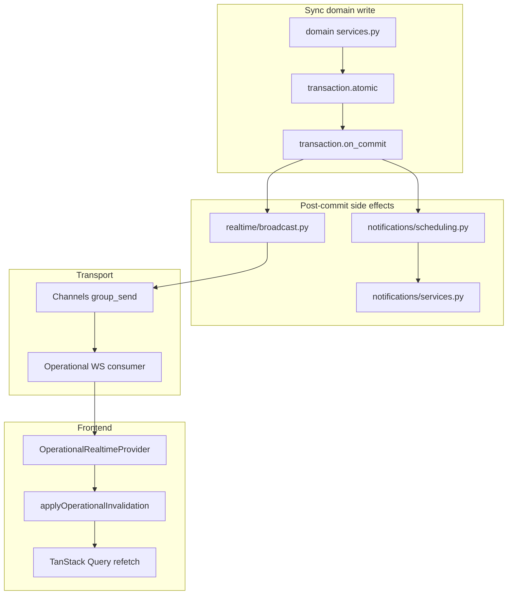

# Phase 2 — Realtime / Event-driven Audit

Status: audit report  
Date: 2026-06-26  
Mode: audit only — no source changes, no fix plan

## Sources

| Category | Files |
|----------|-------|
| Contract | [`AGENTS.md`](../AGENTS.md), [`apps/api/AGENTS.md`](../../apps/api/AGENTS.md), [`apps/web/AGENTS.md`](../../apps/web/AGENTS.md) |
| Compass | [`phase_2_audit_backlog.md`](./phase_2_audit_backlog.md) §3 |
| Prior consolidations | [`phase_2_api_openapi_consolidation.md`](./phase_2_api_openapi_consolidation.md), [`phase_2_database_orm_consolidation.md`](./phase_2_database_orm_consolidation.md) |
| Domain authority | [`docs/product/domains/realtime_domain.md`](../product/domains/realtime_domain.md) |
| Closure | [`feature_audit_closure.md`](./feature_audit_closure.md) |

**Branch context:** Feature audits closed (`TODO_NOW = 0`). API/OpenAPI and Database/ORM phase 2 audits consolidated. This audit traces how backend state changes become visible to users: services → transactions → side effects → notifications → WebSocket events → frontend invalidation/refetch. No `FIXED`, `WONT_FIX_NOW`, or `DECISION_CLOSED` items reopened without new code evidence.

---

## Files inspected

| Layer | Paths |
|-------|-------|
| Broadcast hub | `apps/api/houston/realtime/broadcast.py`, `ws_payloads.py`, `consumers.py`, `groups.py`, `ws_ticket.py`, `api/views.py` |
| WS auth (unused) | `apps/api/houston/realtime/ws_access.py` (contrast: `chat/ws_access.py`) |
| Domain emitters | `actions/services.py`, `signals/services.py`, `checklists/services.py`, `checklists/materialization.py`, `comments/services.py`, `notifications/services.py`, `notifications/scheduling.py`, `observations/services.py`, `establishments/services.py`, `accounts/services.py` |
| Feed coupling | `actions/execution_feed.py` |
| Async materialization | `checklists/tasks.py`, Beat schedule in `config/settings.py` |
| Events stub | `houston/events/apps.py`, `houston/core/events.py` |
| Frontend realtime | `apps/web/src/features/realtime/` (provider, `use-operational-realtime-websocket.ts`, `apply-operational-invalidation.ts`, `apply-realtime-access-events.ts`, `types.ts`) |
| Query invalidation | `apps/web/src/lib/query-invalidation.ts` |
| Observations poll | `apps/web/src/features/observations/hooks.ts`, `processing-status-labels.ts` |
| Notifications UI | `apps/web/src/features/notifications/hooks.ts`, `notification-center.tsx` |

## Tests inspected

| Area | Files |
|------|-------|
| Broadcast / rollback | `realtime/tests/test_broadcast.py`, `test_action_invalidation.py`, `test_comment_invalidation.py`, `test_checklist_invalidation.py`, `test_observation_pipeline_invalidation.py` |
| Materialization WS | `realtime/tests/test_checklist_materialization_invalidation.py`, `checklists/tests/test_materialization_services.py`, `checklists/tests/test_horizon_task.py` |
| Notifications | `notifications/tests/test_notification_invalidation.py`, `notifications/tests/test_scheduling_failure_logging.py`, `notifications/tests/test_signal_notification_producers.py` |
| Access events | `realtime/tests/test_access_events.py` |
| WS consumer / ticket | `realtime/tests/test_realtime_ws_consumer.py`, `realtime/tests/test_realtime_ws_ticket_api.py` |
| Frontend invalidation | `apply-operational-invalidation.test.ts`, `operational-realtime-provider.test.tsx`, `apply-realtime-access-events.test.ts`, `query-invalidation.test.ts` |
| Action↔signal | `actions/tests/test_action_services.py` (`sync_signal_after_action_change`, reopen/resolve paths) |

## Docs / rules inspected

- [`phase_2_audit_backlog.md`](./phase_2_audit_backlog.md) §3 (Realtime / Event-driven)
- [`.cursor/rules/10-backend-django-drf.mdc`](../../.cursor/rules/10-backend-django-drf.mdc), [`.cursor/rules/20-frontend-react-vite-ts.mdc`](../../.cursor/rules/20-frontend-react-vite-ts.mdc), [`.cursor/rules/21-mobile-first-pwa.mdc`](../../.cursor/rules/21-mobile-first-pwa.mdc)
- [`docs/product/domains/realtime_domain.md`](../product/domains/realtime_domain.md)
- [`docs/product/event_catalogue_v0.1.md`](../product/event_catalogue_v0.1.md) (events stub context)

## Assumptions / unknowns

- No live load test of execution-feed GET under multi-assignment establishments.
- No end-to-end test with real Redis channel layer + Celery worker + browser reconnect.
- Chat WebSocket protocol audited only where it contrasts with operational invalidation (separate contract under `houston/chat/`).
- `notification_matrix_v0.2.md` treated as draft reference, not implementation contract.
- Production channel-layer reliability and mobile battery impact of observation polling not measured.

---

## 1. Summary

Houston's operational realtime spine is **architecturally sound for MVP**. Domain services persist business state inside transactions, then schedule post-commit side effects through two hubs: `notifications/scheduling.py` (in-app notification creation) and `realtime/broadcast.py` (WebSocket invalidation and access events). All production operational invalidation and access scheduling uses `transaction.on_commit`; direct `notify_*` calls exist only in tests. Payloads are minimal and non-sensitive; frontend `applyOperationalInvalidation` maps `subject_type` / `reason` pairs to TanStack Query invalidation helpers aligned with `realtime_domain.md`.

Residual risk is **not** pre-commit WebSocket emission. It clusters in:

1. **Freshness timing** — execution feed couples read-path materialization to writes; `execution.created` WS events only fire when materialization runs; gap before `visible_from` unless a user opens the feed or Celery beat horizon catches up.
2. **Cross-domain coupling** — notification scheduling hub fans in from six domains; action lifecycle directly mutates linked signals and schedules multiple WS events.
3. **Best-effort delivery** — no durable outbox or retry beyond structured logging for notification post-commit failures; channel layer silently no-ops when unset.
4. **Frontend gaps** — reconnect sweep omits comment threads; observation processing relies on 2s polling; workspace/reporting query roots have no operational invalidation path.

| Priority | Count | Themes |
|----------|-------|--------|
| **P1** | 1 | Materialization-on-read freshness and WS timing (RT-E1) |
| **P1/P2** | 2 | Notification hub fan-in (RT-E2); action↔signal lifecycle coupling (RT-E3) |
| **P2** | 3 | Events stub drift (RT-E4); duplicated invalidation wrappers (RT-E5); best-effort delivery (RT-E6) |
| **P2/P3** | 1 | Comment thread vs parent surface staleness (RT-E7) |
| **P3** | 3 | Reconnect comment gap (RT-E8); observation poll redundancy (RT-E9); workspace/reporting invalidation (RT-E10) |

---

## 2. Findings

### RT-E1 — Materialization-on-read couples execution feed GET to writes and WS timing

| Field | Detail |
|-------|--------|
| **ID** | RT-E1 |
| **Severity** | P1 |
| **Category** | scalability / performance / ambiguity |
| **Backlog alias** | R3, R8, EF-01, CL-01, OR-10 |
| **Evidence** | `build_execution_feed_page` in `actions/execution_feed.py` unconditionally calls `ensure_visible_executions_materialized` before building the page; `ensure_visible_executions_materialized` in `checklists/materialization.py` iterates visible active assignments and may call `materialize_execution_from_assignment`; `_schedule_execution_created_invalidation` in `materialization.py` emits `execution.created` only on real creates (skipped on idempotent/race return); `_visible_occurrence_dates_for_assignment` gates materialization on `occurrence_start_at - VISIBLE_FROM_OFFSET <= now` (1-hour offset); Celery beat runs `materialize_checklist_assignments_horizon_task` on a separate schedule (`config/settings.py`) |
| **Problem** | Execution feed freshness and realtime `execution.created` delivery depend on either a user opening the feed (triggering read-path writes) or the beat horizon task. Executions within the `visible_from` window but before a supervising user's feed GET may not appear on other clients until materialization runs elsewhere. Read requests can synchronously INSERT before the feed response. |
| **Risk** | Supervision screens stay stale across the establishment until someone triggers materialization; latency grows with assignment count; read→write amplification under load (also flagged DB-01 in ORM audit). Multi-shift scenarios may show a gap before `visible_from` even when beat is healthy. |
| **Suggested direction** | Treat as cross-domain (Realtime + Celery + ORM). Clarify product contract for pre-`visible_from` visibility; measure feed GET cost with N assignments; evaluate proactive beat-only materialization vs read-path decoupling before scale. |
| **Test coverage** | Partial — `test_ensure_visible_executions_materialized_emits_execution_created`, `test_ensure_visible_skips_recently_materialized_assignments`, `test_horizon_task.py`, `test_execution_feed_checklist.py`. No multi-client WS freshness test for beat-only path; no p95 latency baseline. |
| **Size** | L |

---

### RT-E2 — Notification scheduling hub is cross-domain fan-in with silent-omission risk

| Field | Detail |
|-------|--------|
| **ID** | RT-E2 |
| **Severity** | P1/P2 |
| **Category** | structure / maintainability |
| **Backlog alias** | R2, F6 |
| **Evidence** | `notifications/scheduling.py` (~608 LOC) imports models and recipient resolvers from `actions`, `checklists`, `comments`, `signals`, `establishments`; exposes `schedule_*_notification` functions called from domain `services.py` via lazy imports; `_run_notification_after_commit` wraps deliver callbacks with structured exception logging (`test_scheduling_failure_logging.py` confirms NR-05 fix); each deliver reloads subject from DB by ID after commit |
| **Problem** | All in-app notification producers for action, signal, checklist execution, and comment-mention lifecycles converge in one file. Adding a new lifecycle event requires wiring both a `schedule_*` call in the originating domain service and a producer in this hub — no compile-time or registry guard. |
| **Risk** | New lifecycle transitions may ship without notifications; merge conflicts on the hub; import cycles if domains grow; post-commit failure is logged but not retried — user sees stale notification center until next unrelated invalidation or manual refresh. |
| **Suggested direction** | Maintain a traceable event_key → producer matrix (draft `notification_matrix_v0.2.md` is reference only). Consider per-domain producer modules or a lightweight registry when notification surface grows. |
| **Test coverage** | Partial — `test_signal_notification_producers.py`, `test_scheduling_failure_logging.py`, domain service tests that patch schedulers. No full matrix audit test; no rollback tests for notification read/archive/mark-all-read invalidation paths. |
| **Size** | L |

---

### RT-E3 — Action↔signal lifecycle coupling drives multi-event WS ordering

| Field | Detail |
|-------|--------|
| **ID** | RT-E3 |
| **Severity** | P1/P2 |
| **Category** | structure / ambiguity |
| **Backlog alias** | R4, F7 |
| **Evidence** | `sync_signal_after_action_change` in `actions/services.py` (`@transaction.atomic`) resolves or reopens linked signals from action terminal states; callers include `mark_action_done`, `validate_action`, `cancel_action`; reopen path calls `_schedule_linked_signal_updated_invalidation`; `resolve_signal` in `signals/services.py` schedules its own `signal.updated`; `realtime_domain.md` §8 documents action→signal invalidation matrix; `test_sync_signal_reopens_when_all_linked_actions_canceled` and resolve-via-validate tests assert DB state, not WS ordering |
| **Problem** | Action domain directly orchestrates signal lifecycle side effects with lazy imports into `signals/services.py`. A single user action can schedule `action.updated` plus `signal.updated` (and matching notifications) in one transaction. The implicit rule "all linked actions terminal → signal resolves" is encoded in code, not a shared lifecycle primitive. |
| **Risk** | Independent evolution of action or signal lifecycles requires coordinated changes in two apps; ordering of WS events vs REST response is undefined; frontend relies on broad prefix invalidation (defense-in-depth on `action.*` also invalidates signals per `invalidateActionMutationSurfaces`). |
| **Suggested direction** | Document the coupling as an explicit cross-domain contract in action and signal domain docs; add WS ordering or integration tests for linked resolve/reopen paths before refactoring. |
| **Test coverage** | Partial — `test_action_services.py` for DB transitions; `realtime/tests/test_action_invalidation.py` for rollback on accept/cancel. **No** test asserting both `action.updated` and `signal.updated` emission order on linked resolve/reopen. |
| **Size** | M |

---

### RT-E4 — `houston.events` stub and unused `EventEnvelope` create architectural ambiguity

| Field | Detail |
|-------|--------|
| **ID** | RT-E4 |
| **Severity** | P2 |
| **Category** | structure / maintainability |
| **Backlog alias** | R5 |
| **Evidence** | `houston.events` in `INSTALLED_APPS` (`config/settings.py`) contains only `apps.py`; `EventEnvelope` dataclass in `houston/core/events.py` tested in `core/tests/test_events.py` but not referenced by Channels, `broadcast.py`, or `scheduling.py`; `event_catalogue_v0.1.md` describes candidate events separately from live WS `subject_type`/`reason` pairs; actual side effects use per-domain `transaction.on_commit` callbacks |
| **Problem** | Two parallel narratives exist: a documented event catalogue / envelope abstraction vs ad-hoc post-commit scheduling in each domain. New contributors may search for `houston.events` or `EventEnvelope` and build on dead scaffolding. |
| **Risk** | Duplicate or divergent side-effect patterns; docs over-promise a central event bus that does not exist at runtime. |
| **Suggested direction** | Doc hygiene: mark `houston.events` and `EventEnvelope` as non-runtime / future or remove from `INSTALLED_APPS` when approved. Point contributors to `realtime/broadcast.py` and `notifications/scheduling.py` as live side-effect hubs. |
| **Test coverage** | `core/tests/test_events.py` only — no production path tests (expected). |
| **Size** | S |

---

### RT-E5 — Duplicated per-domain `_schedule_*_invalidation` wrappers atop shared broadcast hub

| Field | Detail |
|-------|--------|
| **ID** | RT-E5 |
| **Severity** | P2 |
| **Category** | maintainability |
| **Backlog alias** | Transverse (backlog §Signaux transverses — helpers `_schedule_*_invalidation` dupliqués) |
| **Evidence** | Local wrappers in `actions/services.py` (`_schedule_action_invalidation`, `_schedule_linked_signal_updated_invalidation`), `signals/services.py` (`_schedule_signal_invalidation`), `checklists/services.py` (`_schedule_checklist_invalidation`, `_schedule_execution_invalidation`), `comments/services.py` (`_schedule_comment_invalidation`), `notifications/services.py` (`_schedule_notification_invalidation`); all delegate to `schedule_establishment_invalidation` or `schedule_membership_invalidation` in `realtime/broadcast.py` |
| **Problem** | Reason strings and `subject_type` values are duplicated at each domain boundary. Adding a new operational invalidation reason requires updating a domain wrapper, `realtime_domain.md`, frontend `types.ts`, and `apply-operational-invalidation.ts` — with no shared registry linking backend emitters to frontend handlers. |
| **Risk** | Drift between domains (typo in reason string, wrong `entity_id` semantics — e.g. comment events use parent signal/action id, not comment id); incomplete frontend mapping for new reasons (silent no-op on unknown `comment`/`notification` reasons). |
| **Suggested direction** | Optional thin shared constants module or codegen checklist when extending invalidation; TanStack Query / Cache audit (NR-09) may own WS ↔ query-root matrix. |
| **Test coverage** | Per-domain realtime tests cover emitted reasons; no cross-file registry test. Frontend `apply-operational-invalidation.test.ts` covers known matrix. |
| **Size** | M |

---

### RT-E6 — Best-effort post-commit delivery with no durable outbox or retry

| Field | Detail |
|-------|--------|
| **ID** | RT-E6 |
| **Severity** | P2 |
| **Category** | scalability / maintainability |
| **Backlog alias** | D-04B (decision open; NR-05 logging FIXED) |
| **Evidence** | `broadcast.py` `_send_to_group` returns immediately if `get_channel_layer()` is None; notification `_run_notification_after_commit` catches exceptions and logs via `logger.exception` with `event_key` / `subject_type` / `subject_id` extras; no Celery retry task or outbox table for failed notification creation or missed WS broadcast; `realtime_domain.md` §3 explicitly excludes guaranteed delivery |
| **Problem** | After a successful business commit, notification creation or WS broadcast failure is observable only in logs. No automatic retry or dead-letter queue. |
| **Risk** | Transient Redis or DB blips cause permanent in-app notification gaps for affected recipients; WS invalidation missed with no server-side recovery (frontend reconnect sweep partially mitigates for non-comment surfaces). |
| **Suggested direction** | Accept for MVP pilot per product decision; if SLA tightens, evaluate outbox pattern for notifications first (persisted attention messages) before WS. |
| **Test coverage** | `test_scheduling_failure_logging.py` for log-on-failure; no retry or channel-layer-down integration test. |
| **Size** | L |

---

### RT-E7 — Comment WS invalidates thread queries only; parent surfaces can lag

| Field | Detail |
|-------|--------|
| **ID** | RT-E7 |
| **Severity** | P2/P3 |
| **Category** | ambiguity / maintainability |
| **Backlog alias** | NR-06, D-02 (decision open) |
| **Evidence** | `applyOperationalInvalidation` in `apply-operational-invalidation.ts`: `comment.signal.created` → `invalidateSignalCommentQueries`; action comment reasons → `invalidateActionCommentQueries`; no invalidation of `signals.feed`, `signals.detail`, `actions.execution-feed`, or `actions.detail`; backend `comments/services.py` uses parent entity id as `entity_id` in WS payload (documented in `realtime_domain.md` §2) |
| **Problem** | Live comment activity refreshes open thread lists but not parent signal/action feeds or detail views that may show comment counts or previews. |
| **Risk** | Feed cards show stale comment metadata while thread is fresh during an active session; product tradeoff between WS noise and parent-surface freshness. |
| **Suggested direction** | Product decision (D-02): keep thread-only invalidation or extend to parent detail prefixes; if extended, watch over-fetch on high-traffic feeds. |
| **Test coverage** | `apply-operational-invalidation.test.ts` asserts comment key targeting; no test for parent feed non-invalidation. |
| **Size** | S |

---

### RT-E8 — Reconnect sweep omits comment query roots

| Field | Detail |
|-------|--------|
| **ID** | RT-E8 |
| **Severity** | P3 |
| **Category** | maintainability / ambiguity |
| **Backlog alias** | NR-08 |
| **Evidence** | `applyOperationalReconnectInvalidation` in `apply-operational-invalidation.ts` invalidates signals, actions, checklists, notifications only; `use-operational-realtime-websocket.ts` calls `onReconnect` after `auth.ok` when `hasConnectedOnceRef` is set; `realtime_domain.md` §10 documents comment reconnect limitation; no `invalidateEstablishmentCommentQueries` helper exists in `query-invalidation.ts` |
| **Problem** | After mobile background tab, network loss, or WS reconnect, open comment threads are not refetched. Live `comment.*` events work only while the socket stays connected. |
| **Risk** | Field users on unstable networks see stale comment threads until navigation away and back or manual pull-to-refresh if implemented. |
| **Suggested direction** | Small frontend addition when product accepts extra refetch cost: invalidate active comment thread keys on reconnect (narrower than establishment-wide comment prefix). |
| **Test coverage** | `apply-operational-invalidation.test.ts` lists reconnect targets; **no** negative assertion that comment keys are excluded. Provider test does not exercise `onReconnect`. |
| **Size** | S |

---

### RT-E9 — Observation processing-status uses 2s poll; no WS `observation` subject

| Field | Detail |
|-------|--------|
| **ID** | RT-E9 |
| **Severity** | P3 |
| **Category** | performance / maintainability |
| **Backlog alias** | OR-07, OBS-07 |
| **Evidence** | `useObservationProcessingStatusQuery` in `observations/hooks.ts`: `refetchInterval` 2000ms while status is non-terminal; on terminal `processed` with `signal_created`/`signal_updated`, calls `invalidateEstablishmentSignalQueries` once per status key; `observations/services.py` `submit_observation` enqueues Celery on commit only — no WS; pipeline invalidation in `signals/services.py` emits `signal.created` / `signal.updated`; `OperationalRealtimeInvalidateEvent` `subject_type` union in `types.ts` has no `observation` |
| **Problem** | Processing panel freshness is poll-driven. Signal feed update on pipeline completion can arrive via poll terminal handler, WS `signal.*`, or both — redundant paths. |
| **Risk** | Battery and network cost on mobile during active processing wait; acceptable at dev volume. Adding WS `observation` subject would need security review (no observation body in payload). |
| **Suggested direction** | Defer unless mobile profiling shows pain; if added, minimal `observation.updated` invalidation for processing-status query only. |
| **Test coverage** | `processing-status-labels.test.ts` for terminal predicates; no hook integration test for poll → invalidate; `test_observation_pipeline_invalidation.py` covers backend WS on pipeline output. |
| **Size** | S |

---

### RT-E10 — Workspace and reporting query roots lack operational invalidation

| Field | Detail |
|-------|--------|
| **ID** | RT-E10 |
| **Severity** | P3 |
| **Category** | ambiguity |
| **Backlog alias** | NR-09 |
| **Evidence** | `workspaceSummaryQueryKey` in `auth/api.ts` → `['workspace','summary', establishmentId]`; `['reporting','kpi', establishmentId]` appears only in `query-invalidation.test.ts` purge tests, no production query hook; `applyOperationalReconnectInvalidation` omits both; `applyRealtimeAccessEvent` case `membership.updated` invalidates workspace summary, bootstrap, membership list, business unit tree (`apply-realtime-access-events.ts`); current `/reporting` route is observation submit (`ReportPage`), not KPI dashboard |
| **Problem** | Operational WS events do not refresh workspace summary or future reporting surfaces. Only membership role/scope changes trigger workspace invalidation via access events. |
| **Risk** | When reporting KPI queries ship, stale hub metrics unless each mutation adds explicit invalidation or a new WS subject is defined. Low risk today — placeholders only. |
| **Suggested direction** | Define invalidation contract when reporting feature lands; cross-reference TanStack Query / Cache audit for WS ↔ query-root matrix. |
| **Test coverage** | `apply-realtime-access-events.test.ts` for `membership.updated`; no operational invalidate → workspace test. |
| **Size** | S |

---

## 3. Safe areas

Evidence-backed areas that do not need immediate change:

| Area | Evidence |
|------|----------|
| **Post-commit scheduling** | All production operational invalidation and access events use `schedule_establishment_invalidation`, `schedule_membership_invalidation`, or `schedule_access_event` in `realtime/broadcast.py`, each wrapping `transaction.on_commit`. Direct `notify_*` has no production callers outside tests. |
| **Payload safety** | `ws_payloads.py` builders emit only allowlisted fields; parametrized tests in `test_broadcast.py`, `test_observation_pipeline_invalidation.py`, `test_comment_invalidation.py`, `test_checklist_materialization_invalidation.py`, `test_notification_invalidation.py` assert absence of title/body/raw_text. |
| **Group targeting** | Establishment-wide invalidation for operational surfaces; membership-scoped groups for notifications (`notification.bulk_updated` uses recipient membership id as `entity_id`); session group for `session.revoked` / `establishment.switched` (tested in `test_access_events.py`). |
| **Rollback guards** | Negative tests prevent WS emission on transaction rollback for actions, comments, signals (pin/cancel/resolve), checklists, observation pipeline apply, notifications create, broadcast hub. |
| **Frontend contract alignment** | `types.ts` subject_type union matches `realtime_domain.md` §2 matrix; `applyOperationalInvalidation` routes all six subject types; unknown comment/notification reasons no-op safely. |
| **Materialization idempotency** | `materialize_execution_from_assignment` skips `_schedule_execution_created_invalidation` on idempotent/race return; tested in `test_checklist_materialization_invalidation.py`. |
| **Observation pipeline boundary** | `observations/services.py` does not emit WS; pipeline owned by `signals/services.py` after AI processing — clear async boundary. |
| **Access event session hygiene** | `RealtimeConsumer._close_after_access_event` closes socket on `session.revoked`, `establishment.switched`, `membership.deactivated`; `membership.updated` keeps socket open and relies on frontend `applyRealtimeAccessEvent`. |
| **Chat separation** | Chat V1 uses separate path, ticket, protocol, and personal membership groups under `houston/chat/` — not mixed into operational invalidation channels. |

**Excluded from findings (noted here):**

- **RBAC-04** — WS ticket 403 vs REST 404 for foreign establishment: API audit scope; enforcement OK.
- **`realtime/ws_access.py` unused** — Operational consumer does not call `validate_ws_connection_access` (chat does). Ticket REST requires active membership in URL establishment; practical cross-establishment WS risk is low; consumer-level test matrix incomplete.
- **Broad signal/action prefix invalidation** — Ignores `entity_id`; correct for freshness, noisy for mobile; deferred to TanStack Query / Cache audit.

---

## 4. Needs more evidence

| Topic | Why |
|-------|-----|
| Execution-feed p95 with N visible assignments | Read-path materialization cost under realistic assignment libraries not measured |
| Multi-shift `visible_from` gap with beat-only path | No test proving WS `execution.created` reaches supervision before any user's feed GET |
| WS consumer auth edge cases | No realtime tests for auth timeout (4408), deactivated membership at connect, tenant mismatch close code — chat consumer has timeout test |
| Celery → Channels → frontend E2E | Materialization tests patch `notify_*` in-process; no integration with live channel layer + worker |
| Full notification matrix ↔ producer map | Partial coverage via `test_signal_notification_producers.py`; draft `notification_matrix_v0.2.md` not audited line-by-line |
| Mobile battery impact of 2s observation poll | OR-07 accepted as safe redundancy; not profiled |
| Beat horizon cross-tenant blocking | Celery audit scope (CL-08) |
| `realtime/ws_access.py` vs consumer auth divergence | Whether operational WS should enforce `selected_establishment` like chat |

---

## 5. Top priorities

### Do first

1. **RT-E1** — Materialization-on-read freshness and WS timing on execution feed. Blocks confidence in supervision freshness at scale and couples reads to writes.
2. **RT-E2** — Notification hub traceability. Silent omission on new lifecycles is the highest product-visible gap in the side-effect chain.
3. **RT-E3** — Action↔signal coupling contract. Required before independent lifecycle evolution or extracted domain boundaries.

### Quick wins

- **RT-E8** — Reconnect comment sweep (small frontend scope when product accepts refetch cost).
- **RT-E4** — Doc hygiene on `houston.events` / `EventEnvelope` vs live `on_commit` hubs.

### Structural — plan later

- **RT-E6** — Outbox or retry for notification delivery if SLA tightens beyond log-only.
- **RT-E1 decouple** — Move materialization off read path (coordinates with Celery CL-08, ORM DB-01).

### Not worth fixing now

- **RT-E9** — Observation poll + WS redundancy (safe, low dev volume).
- **RT-E10** — Reporting/workspace placeholders (no live KPI queries).
- Broad establishment-prefix invalidation at current pilot scale.
- RBAC-04 WS 403 vs 404 polish.

---

## 6. Changed / Validated / Risks

| | |
|---|---|
| **Changed** | N/A — audit only, no source modifications. |
| **Validated** | Post-commit contract for all operational WS paths; reason matrix matches `realtime_domain.md`; NR-08 reconnect comment gap confirmed in `applyOperationalReconnectInvalidation`; OR-07 observation poll path confirmed; NR-05 notification failure logging confirmed; idempotent materialization skips duplicate `execution.created`; observation pipeline invalidation owned by signals domain after Celery enqueue. |
| **Risks / not verified** | Production Redis channel-layer reliability under load; mobile battery impact of observation polling; beat horizon timeliness for pre-feed materialization; full notification matrix producer coverage; end-to-end reconnect behavior on physical mobile devices; WS consumer permission matrix for edge auth failures. |

---

## Backlog cross-reference

| Finding | `phase_2_audit_backlog.md` §3 aliases |
|---------|--------------------------------------|
| RT-E1 | R3, R8, EF-01, CL-01, OR-10 |
| RT-E2 | R2, F6 |
| RT-E3 | R4, F7 |
| RT-E4 | R5 |
| RT-E5 | Transverse — helpers `_schedule_*_invalidation` dupliqués |
| RT-E6 | D-04B |
| RT-E7 | NR-06, D-02 |
| RT-E8 | NR-08 |
| RT-E9 | OR-07, OBS-07 |
| RT-E10 | NR-09 |

**Related items deferred to other phase 2 audits:** CL-08 / EF-02 (Celery materialization batching), NR-09 matrix (TanStack Query / Cache), FE-04 / R6 (frontend RBAC mirrors), RBAC-04 (API/OpenAPI).
