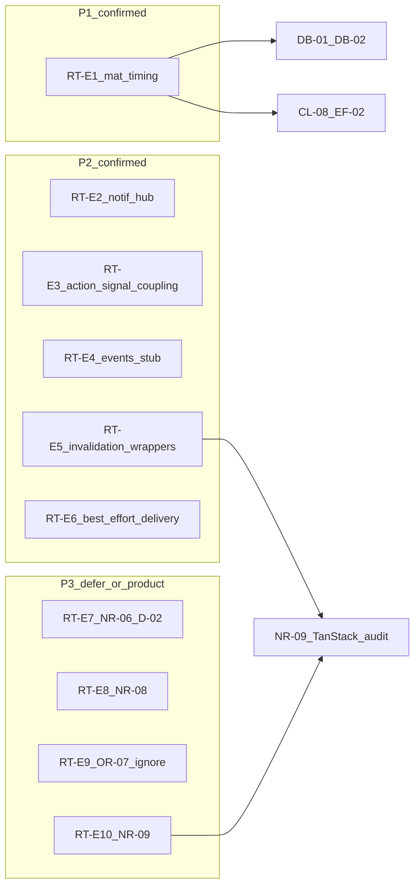
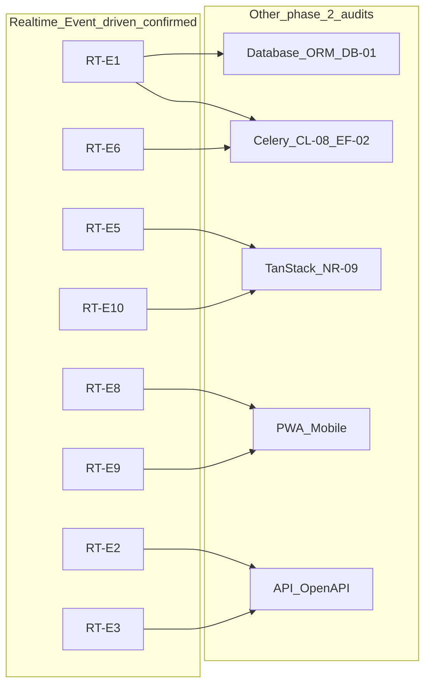

# Phase 2 — Realtime / Event-driven Consolidation

Status: consolidation report  
Date: 2026-06-26  
Mode: consolidation only — no source changes

## Sources

| Category | Files |
|----------|-------|
| Audit input | [`phase_2_realtime_event_driven_audit.md`](./phase_2_realtime_event_driven_audit.md) (RT-E1–RT-E10) |
| Backlog | [`phase_2_audit_backlog.md`](./phase_2_audit_backlog.md) §3 |
| Closure | [`feature_audit_closure.md`](./feature_audit_closure.md) |
| Decisions | [`feature_audit_decisions.md`](./feature_audit_decisions.md) |
| Prior consolidations | [`notifications_realtime_consolidation.md`](./notifications_realtime_consolidation.md), [`execution_feed_consolidation.md`](./execution_feed_consolidation.md), [`observation_refresh_consolidation.md`](./observation_refresh_consolidation.md) |
| Cross-audit | [`phase_2_database_orm_consolidation.md`](./phase_2_database_orm_consolidation.md) (DB-01/DB-02), [`phase_2_api_openapi_consolidation.md`](./phase_2_api_openapi_consolidation.md) |
| Contract | [`AGENTS.md`](../../AGENTS.md), [`apps/api/AGENTS.md`](../../apps/api/AGENTS.md), [`apps/web/AGENTS.md`](../../apps/web/AGENTS.md) |
| Domain authority | [`docs/product/domains/realtime_domain.md`](../product/domains/realtime_domain.md) |

**Branch context:** Feature audits closed (`TODO_NOW = 0`). API/OpenAPI and Database/ORM phase 2 audits consolidated. This consolidation challenges each finding from the phase 2 Realtime / Event-driven audit against backlog §3, closure registry, decision pack, prior feature consolidations, and spot-check code evidence. No `FIXED`, `WONT_FIX_NOW`, or `DECISION_CLOSED` items reopened without new direct code evidence.

---

## 1. Executive summary

Houston's operational realtime spine is **architecturally sound for MVP**. Domain services persist business state inside transactions, then schedule post-commit side effects through two live hubs: [`notifications/scheduling.py`](../../apps/api/houston/notifications/scheduling.py) (in-app notification creation) and [`realtime/broadcast.py`](../../apps/api/houston/realtime/broadcast.py) (WebSocket invalidation and access events). All production operational invalidation uses `transaction.on_commit`; payloads are minimal and non-sensitive; frontend `applyOperationalInvalidation` maps `subject_type` / `reason` pairs to TanStack Query helpers aligned with `realtime_domain.md`.

Residual risk is **not** pre-commit WebSocket emission. It clusters in:

1. **Freshness timing** — execution feed couples read-path materialization to writes; `execution.created` WS events only fire when materialization runs; gap before `visible_from` unless a user opens the feed or Celery beat horizon catches up (RT-E1)
2. **Cross-domain coupling** — notification scheduling hub fans in from six domains; action lifecycle directly mutates linked signals and schedules multiple WS events (RT-E2, RT-E3)
3. **Best-effort delivery** — no durable outbox or retry beyond structured logging for notification post-commit failures; channel layer silently no-ops when unset (RT-E6 — outbox half is product-gated)
4. **Frontend gaps** — reconnect sweep omits comment threads; observation processing relies on 2s polling; workspace/reporting query roots have no operational invalidation path (RT-E7–RT-E10)

**No P0 realtime integrity hole found.** Post-commit contract, rollback guards, payload safety, and group targeting are evidence-backed and tested.

| Priority | Count | Themes |
|----------|-------|--------|
| **P1** | 1 | Materialization-on-read freshness and WS timing (RT-E1) |
| **P2** | 5 | Notification hub fan-in (RT-E2); action↔signal lifecycle coupling (RT-E3); events stub drift (RT-E4); duplicated invalidation wrappers (RT-E5); best-effort delivery (RT-E6) |
| **P3** | 4 | Comment thread vs parent surface staleness (RT-E7); reconnect comment gap (RT-E8); observation poll redundancy (RT-E9); workspace/reporting invalidation (RT-E10) |

**Consolidation verdict:** 10 audit findings reviewed → **10 evidence-backed confirmations**, of which **5 are actionable without product gate** (RT-E1 structural/timing angle, RT-E2–RT-E5), **3 carry product-gated slices that are not actionable without a decision** (RT-E6 outbox/retry — D-04B; RT-E7 parent-feed invalidation — D-02; RT-E1 lazy pre-`visible_from` timing — EF-08/CL-04), **2 deferred** (RT-E8, RT-E10), **1 ignore at dev scale** (RT-E9), **0 full false positives**, **1 corrected sub-claim** (RT-E3 emission test gap — ACT-04 FIXED), **10/10 duplicate merges** to backlog §3 or feature closure aliases.

*Note:* RT-E6 is **confirmed as an evidence-backed risk posture** (best-effort delivery today). The **outbox/retry slice is not an open engineering action** unless product approves D-04B option B — default MVP remains log-only (NR-05 observability already FIXED).

---

## 2. Findings reviewed

All 10 findings from [`phase_2_realtime_event_driven_audit.md`](./phase_2_realtime_event_driven_audit.md) §2, cross-checked against [`phase_2_audit_backlog.md`](./phase_2_audit_backlog.md) §3, [`feature_audit_closure.md`](./feature_audit_closure.md), [`feature_audit_decisions.md`](./feature_audit_decisions.md), and spot-check code evidence.

| ID | Audit sev | Reclassification | Backlog alias | Consolidation notes |
|----|-----------|------------------|---------------|---------------------|
| **RT-E1** | P1 | **CONFIRMED** + **DUPLICATE** | **R3, R8, EF-01, CL-01, OR-10, DB-01** | Code-verified: [`execution_feed.py`](../../apps/api/houston/actions/execution_feed.py) L213 unconditionally calls `ensure_visible_executions_materialized`; [`materialization.py`](../../apps/api/houston/checklists/materialization.py) gates on `visible_from` and emits `execution.created` only on real creates. ORM cost angle in DB consolidation; **primary owner Realtime + Celery**. EF-08/CL-04 lazy decision **DECISION_OPEN** — cost documented, not re-litigated. CL-01a/EF-01a **WONT_FIX_NOW** not reopened. |
| **RT-E2** | P1/P2 | **CONFIRMED** + **DUPLICATE** | **R2, F6** | Code-verified: [`scheduling.py`](../../apps/api/houston/notifications/scheduling.py) ~608 LOC fan-in from actions, checklists, comments, signals, establishments. **Severity consolidated to P2** — maintainability/silent-omission risk, not broken MVP spine. NR-05 post-commit logging **FIXED** — do not reopen. |
| **RT-E3** | P1/P2 | **CONFIRMED** + **DUPLICATE** | **R4, F7** | Code-verified: `sync_signal_after_action_change` in [`actions/services.py`](../../apps/api/houston/actions/services.py) orchestrates signal resolve/reopen with lazy imports. **Severity consolidated to P2** — ACT-04 **FIXED** closed invalidation contract gap. Audit sub-claim "no dual-emission tests" **outdated** — tests exist in [`test_action_invalidation.py`](../../apps/api/houston/realtime/tests/test_action_invalidation.py). Structural coupling + WS ordering vs REST remain valid. |
| **RT-E4** | P2 | **CONFIRMED** + **DUPLICATE** | **R5** | Code-verified: `houston.events` in [`settings.py`](../../apps/api/config/settings.py) L54; [`core/events.py`](../../apps/api/houston/core/events.py) `EventEnvelope` tested only — no production references in `broadcast.py` or `scheduling.py`. |
| **RT-E5** | P2 | **CONFIRMED** + **DUPLICATE** | Transverse + partial **NR-09** | Code-verified: per-domain `_schedule_*_invalidation` wrappers in actions, signals, checklists, comments, notifications services → shared [`broadcast.py`](../../apps/api/houston/realtime/broadcast.py). Full WS ↔ query-root registry deferred to TanStack Query / Cache audit. |
| **RT-E6** | P2 | **CONFIRMED** (split) | **D-04B** | Logging half: NR-05 **FIXED**. Outbox/retry half: **PRODUCT_DECISION** (D-04B **DECISION_OPEN**); default MVP log-only per decision pack. `get_channel_layer()` no-op and `realtime_domain.md` §3 no-guaranteed-delivery confirmed. |
| **RT-E7** | P2/P3 | **PRODUCT_DECISION** + **CONFIRMED intentional** | **NR-06, D-02** | Code-verified: [`apply-operational-invalidation.ts`](../../apps/web/src/features/realtime/lib/apply-operational-invalidation.ts) L48–62 — comment reasons invalidate thread queries only. Default MVP: threads only per decision pack. |
| **RT-E8** | P3 | **CONFIRMED** + **DEFER_PHASE_2** + **DUPLICATE** | **NR-08** | Code-verified: `applyOperationalReconnectInvalidation` L72–79 omits comment query roots. Documented in `realtime_domain.md` §10. Quick win S when product accepts refetch cost. |
| **RT-E9** | P3 | **CONFIRMED** + **IGNORE_NOW** + **DUPLICATE** | **OR-07, OBS-07** | Code-verified: `PROCESSING_POLL_INTERVAL_MS = 2000` in [`observations/hooks.ts`](../../apps/web/src/features/observations/hooks.ts). Terminal poll + WS `signal.*` provide redundant safe paths at dev volume. |
| **RT-E10** | P3 | **CONFIRMED** + **DEFER_PHASE_2** + **DUPLICATE** | **NR-09** | Code-verified: `workspaceSummaryQueryKey` exists; `reporting` KPI key only in test purge — no production KPI hooks. Low risk today; primary owner TanStack Query / Cache audit. |

**Backlog §3 re-validation:** All 6 deferred Realtime / Event-driven themes (R2, R3, R4, R5, NR-08, OR-07) remain valid — confirmed with code evidence; product gates and cross-audit owners noted per row.

---

## 3. Confirmed findings

### RT-E1 — Materialization-on-read couples execution feed GET to writes and WS timing (R3 / EF-01 / CL-01 / DB-01)

| Field | Detail |
|-------|--------|
| **Severity** | P1 |
| **Evidence** | `build_execution_feed_page` in [`actions/execution_feed.py`](../../apps/api/houston/actions/execution_feed.py) L213 unconditionally calls `ensure_visible_executions_materialized`; [`materialization.py`](../../apps/api/houston/checklists/materialization.py) iterates visible active assignments, gates on `occurrence_start_at - VISIBLE_FROM_OFFSET <= now`, emits `execution.created` only on real creates (skipped on idempotent/race return); Celery beat runs `materialize_checklist_assignments_horizon_task` on separate schedule |
| **Why confirmed** | Execution feed freshness and realtime `execution.created` delivery depend on either a user opening the feed (triggering read-path writes) or the beat horizon task. Read requests can synchronously INSERT before the feed response. Not theoretical — code path unconditional on every feed GET. |
| **Risk** | Supervision screens stay stale across the establishment until someone triggers materialization; latency grows with assignment count; read→write amplification under load (DB-01 in ORM audit). Multi-shift scenarios may show a gap before `visible_from` even when beat is healthy. |
| **Suggested direction** | Cross-domain (Realtime + Celery + ORM): clarify product contract for pre-`visible_from` visibility (EF-08 default: accept lazy); measure feed GET cost with N assignments; evaluate proactive beat-only materialization vs read-path decoupling before scale — without reopening CL-01a early-exit |
| **Dependencies** | Database/ORM DB-01, DB-02; Celery CL-08, EF-02; EF-08/CL-04 product decision |
| **Size** | L |

---

### RT-E2 — Notification scheduling hub is cross-domain fan-in with silent-omission risk (R2 / F6)

| Field | Detail |
|-------|--------|
| **Severity** | P2 |
| **Evidence** | [`notifications/scheduling.py`](../../apps/api/houston/notifications/scheduling.py) (~608 LOC) imports models and recipient resolvers from `actions`, `checklists`, `comments`, `signals`, `establishments`; exposes `schedule_*_notification` functions called from domain `services.py` via lazy imports; `_run_notification_after_commit` wraps deliver callbacks with structured exception logging (NR-05 FIXED) |
| **Why confirmed** | All in-app notification producers for action, signal, checklist execution, and comment-mention lifecycles converge in one file. Adding a new lifecycle event requires wiring both a `schedule_*` call in the originating domain service and a producer in this hub — no compile-time or registry guard. |
| **Risk** | New lifecycle transitions may ship without notifications; merge conflicts on the hub; import cycles if domains grow; post-commit failure is logged but not retried — user sees stale notification center until next unrelated invalidation or manual refresh. |
| **Suggested direction** | Maintain a traceable event_key → producer matrix (`notification_matrix_v0.2.md` is reference only; `LOT1_EVENT_KEYS` in code is canonical for Lot1). Consider per-domain producer modules or a lightweight registry when notification surface grows. |
| **Dependencies** | API/OpenAPI (after-commit contract); Celery/notifications slice for full matrix audit |
| **Size** | L |

---

### RT-E3 — Action↔signal lifecycle coupling drives multi-event WS ordering (R4 / F7)

| Field | Detail |
|-------|--------|
| **Severity** | P2 |
| **Evidence** | `sync_signal_after_action_change` in [`actions/services.py`](../../apps/api/houston/actions/services.py) (`@transaction.atomic`) resolves or reopens linked signals from action terminal states; callers include `mark_action_done`, `validate_action`, `cancel_action`, `reopen_action`; reopen/cancel paths call `_schedule_linked_signal_updated_invalidation`; `resolve_signal` in `signals/services.py` schedules its own `signal.updated`; `realtime_domain.md` §8 documents action→signal invalidation matrix |
| **Why confirmed** | Action domain directly orchestrates signal lifecycle side effects with lazy imports into `signals/services.py`. A single user action can schedule `action.updated` plus `signal.updated` (and matching notifications) in one transaction. The implicit rule "all linked actions terminal → signal resolves" is encoded in code, not a shared lifecycle primitive. ACT-04 FIXED ensures dual emission on reopen/cancel paths — structural coupling remains. |
| **Risk** | Independent evolution of action or signal lifecycles requires coordinated changes in two apps; ordering of WS events vs REST response is undefined; frontend relies on broad prefix invalidation as defense-in-depth. |
| **Suggested direction** | Document the coupling as an explicit cross-domain contract in action and signal domain docs; optional WS ordering integration tests before refactoring — do not re-litigate ACT-04 invalidation emission |
| **Dependencies** | API/OpenAPI R4/F7; action and signal domain docs |
| **Size** | M |

---

### RT-E4 — `houston.events` stub and unused `EventEnvelope` create architectural ambiguity (R5)

| Field | Detail |
|-------|--------|
| **Severity** | P2 |
| **Evidence** | `houston.events` in `INSTALLED_APPS` ([`settings.py`](../../apps/api/config/settings.py) L54) contains only `apps.py`; `EventEnvelope` dataclass in [`core/events.py`](../../apps/api/houston/core/events.py) tested in `core/tests/test_events.py` but not referenced by Channels, `broadcast.py`, or `scheduling.py`; `event_catalogue_v0.1.md` describes candidate events separately from live WS `subject_type`/`reason` pairs |
| **Why confirmed** | Two parallel narratives exist: a documented event catalogue / envelope abstraction vs ad-hoc post-commit scheduling in each domain. New contributors may search for `houston.events` or `EventEnvelope` and build on dead scaffolding. |
| **Risk** | Duplicate or divergent side-effect patterns; docs over-promise a central event bus that does not exist at runtime. |
| **Suggested direction** | Doc hygiene: clarify in contributor-facing docs that `houston.events` and `EventEnvelope` are **non-runtime scaffolding** today — no production path in Channels, `broadcast.py`, or `scheduling.py`. Point contributors to `realtime/broadcast.py` and `notifications/scheduling.py` as the live side-effect hubs. Any removal, packaging change, or revival as a central bus remains a **future architecture decision**, not an action implied by this consolidation. |
| **Dependencies** | CI / DevEx / Docs |
| **Size** | S |

---

### RT-E5 — Duplicated per-domain `_schedule_*_invalidation` wrappers atop shared broadcast hub

| Field | Detail |
|-------|--------|
| **Severity** | P2 |
| **Evidence** | Local wrappers in `actions/services.py`, `signals/services.py`, `checklists/services.py`, `comments/services.py`, `notifications/services.py`; all delegate to `schedule_establishment_invalidation` or `schedule_membership_invalidation` in [`broadcast.py`](../../apps/api/houston/realtime/broadcast.py) |
| **Why confirmed** | Reason strings and `subject_type` values are duplicated at each domain boundary. Adding a new operational invalidation reason requires updating a domain wrapper, `realtime_domain.md`, frontend `types.ts`, and `apply-operational-invalidation.ts` — with no shared registry linking backend emitters to frontend handlers. |
| **Risk** | Drift between domains (typo in reason string, wrong `entity_id` semantics — e.g. comment events use parent signal/action id); incomplete frontend mapping for new reasons (silent no-op on unknown comment/notification reasons). |
| **Suggested direction** | Optional thin shared constants module or codegen checklist when extending invalidation; TanStack Query / Cache audit (NR-09) may own WS ↔ query-root matrix |
| **Dependencies** | TanStack Query / Cache NR-09 |
| **Size** | M |

---

### RT-E6 — Best-effort post-commit delivery with no durable outbox or retry (D-04B)

| Field | Detail |
|-------|--------|
| **Severity** | P2 (outbox half product-gated) |
| **Evidence** | [`broadcast.py`](../../apps/api/houston/realtime/broadcast.py) `_send_to_group` returns immediately if `get_channel_layer()` is None; notification `_run_notification_after_commit` catches exceptions and logs via `logger.exception` with `event_key` / `subject_type` / `subject_id` extras (NR-05 FIXED); no Celery retry task or outbox table; `realtime_domain.md` §3 explicitly excludes guaranteed delivery |
| **Why confirmed** | After a successful business commit, notification creation or WS broadcast failure is observable only in logs. No automatic retry or dead-letter queue. Intentional MVP posture per D-04B default. |
| **Risk** | Transient Redis or DB blips cause permanent in-app notification gaps for affected recipients; WS invalidation missed with no server-side recovery (frontend reconnect sweep partially mitigates for non-comment surfaces). |
| **Suggested direction** | **Document and accept** the current best-effort posture for MVP pilot (D-04B default: log only). **Outbox/retry is not actionable without product approval** of D-04B option B; if SLA tightens later, evaluate outbox for notifications first before WS |
| **Dependencies** | D-04B product decision; Celery / Async if retry infrastructure approved |
| **Size** | L (if outbox ever approved) |

---

### RT-E8 — Reconnect sweep omits comment query roots (NR-08)

| Field | Detail |
|-------|--------|
| **Severity** | P3 |
| **Evidence** | `applyOperationalReconnectInvalidation` in [`apply-operational-invalidation.ts`](../../apps/web/src/features/realtime/lib/apply-operational-invalidation.ts) L72–79 invalidates signals, actions, checklists, notifications only; `use-operational-realtime-websocket.ts` calls `onReconnect` after `auth.ok` when `hasConnectedOnceRef` is set; `realtime_domain.md` §10 documents comment reconnect limitation; no `invalidateEstablishmentCommentQueries` helper in `query-invalidation.ts` |
| **Why confirmed** | After mobile background tab, network loss, or WS reconnect, open comment threads are not refetched. Live `comment.*` events work only while the socket stays connected. |
| **Risk** | Field users on unstable networks see stale comment threads until navigation away and back or manual pull-to-refresh if implemented. |
| **Suggested direction** | Small frontend addition when product accepts extra refetch cost: invalidate active comment thread keys on reconnect (narrower than establishment-wide comment prefix) |
| **Dependencies** | PWA / Mobile-first; TanStack Query / Cache |
| **Size** | S |

---

## 4. Reclassified / duplicate / false-positive findings

### False positives

**None** at finding level. All 10 audit findings (RT-E1–RT-E10) are backed by code evidence verified in this consolidation pass.

### Corrected sub-claim (not a false finding)

| Parent ID | Audit claim | Correction | Status |
|-----------|-------------|------------|--------|
| **RT-E3** | "No test asserting both `action.updated` and `signal.updated` emission on linked resolve/reopen" | `test_cancel_last_linked_action_reopen_emits_action_and_signal_updated` and `test_reopen_action_linked_resolved_signal_emits_action_and_signal_updated` in [`test_action_invalidation.py`](../../apps/api/houston/realtime/tests/test_action_invalidation.py) prove dual emission — **ACT-04 FIXED** | Sub-claim outdated; structural coupling finding remains **CONFIRMED** |

### Product decisions (confirmed intentional behavior — no code change without gate)

| ID | Decision | Default MVP | Closure ref |
|----|----------|-------------|-------------|
| **RT-E7** | `comment.*` invalidates thread queries only, not parent signal/action feeds | Threads only | NR-06 / D-02 **DECISION_OPEN** |
| **RT-E6** (outbox half) | No retry/outbox for post-commit notification or WS delivery | Log only | D-04B **DECISION_OPEN** |
| **RT-E1** (lazy half) | Lazy materialization pre-`visible_from` acceptable at pilot scale | Accept lazy | EF-08 / CL-04 **DECISION_OPEN** |

### Duplicates merged

| Canonical ID | Absorbed backlog / audit IDs | Relationship |
|--------------|------------------------------|--------------|
| **RT-E1** | R3, R8, EF-01, CL-01, OR-10, DB-01 | Realtime angle of materialization-on-read; ORM cost in DB consolidation |
| **RT-E2** | R2, F6 | Same notification hub fan-in theme |
| **RT-E3** | R4, F7 | Same action↔signal coupling; ACT-04 FIXED scoped to invalidation emission |
| **RT-E4** | R5 | Same events stub ambiguity |
| **RT-E5** | Transverse helpers + partial NR-09 | Backend wrapper duplication; frontend matrix owned by TanStack audit |
| **RT-E6** | D-04B | Best-effort delivery; NR-05 logging FIXED separately |
| **RT-E7** | NR-06, D-02 | Comment parent-surface staleness |
| **RT-E8** | NR-08 | Reconnect comment sweep gap |
| **RT-E9** | OR-07, OBS-07 | Observation poll without WS `observation` subject |
| **RT-E10** | NR-09 | Workspace/reporting query roots |

### Deferred / ignore now

| ID | Status | Notes |
|----|--------|-------|
| **RT-E8** | DEFER_PHASE_2 | Edge case mobile; quick win S when accepted |
| **RT-E10** | DEFER_PHASE_2 | No live KPI queries; TanStack Query / Cache audit primary owner |
| **RT-E9** | IGNORE_NOW | Safe redundancy at dev volume; PWA audit may revisit battery impact |
| **RT-E7** | PRODUCT_DECISION | Intentional MVP tradeoff; extend only if D-02 option A approved |

### Items explicitly not reopened

| ID | Closure status | Why not reopened |
|----|----------------|------------------|
| **ACT-04** | FIXED | Dual `action.updated` + `signal.updated` emission on linked reopen/cancel — tests in `test_action_invalidation.py` |
| **NR-05** | FIXED | Structured `logger.exception` on post-commit notification failure |
| **NR-03, NR-04, NR-07, NR-10** | FIXED | Doc alignment and provider callback test — prior notifications_realtime consolidation |
| **CL-01a / EF-01a** | WONT_FIX_NOW | Early-exit `.exists()` not a gain; RT-E1 captures real cost |
| **EF-08 / CL-04** | DECISION_OPEN (lazy accepted) | Product default documented; RT-E1 documents timing/cost without re-litigating |
| **RBAC-04** | DEFER_PHASE_2 (API scope) | WS ticket 403 vs 404 — enforcement OK; excluded from realtime findings |
| **Broad prefix invalidation** | Deferred | TanStack Query / Cache audit scope — correct for freshness at pilot scale |

---

## 5. Cross-audit dependencies

| Confirmed item | Depends on / blocks | Other phase 2 audit |
|----------------|---------------------|---------------------|
| **RT-E1** | Materialization strategy, batching, beat timeliness | Database/ORM DB-01, DB-02; Celery CL-08, EF-02 |
| **RT-E2** | After-commit contract, producer traceability | API / OpenAPI (hub pattern); notifications/Celery for full matrix pass |
| **RT-E3** | Lifecycle contract documentation | API / OpenAPI R4/F7 |
| **RT-E5**, **RT-E10** | WS ↔ query-root matrix | TanStack Query / Cache NR-09 |
| **RT-E8**, **RT-E9** | Reconnect refetch cost, poll battery | PWA / Mobile-first transverse re-read |
| **RT-E6** (outbox) | Retry infrastructure if D-04B option B | Celery / Async |
| **RT-E1** | Meaningful EF-07 baselines | CI / DevEx (after materialization path stabilizes) |

**Recommended next phase 2 audit:** Celery / Async — CL-08 horizon sharding and EF-02 batching are co-owners of RT-E1 structural decouple with Realtime.

---

## 6. Top priorities

### P1 — must address before large-scale evolution

1. **RT-E1** — Materialization-on-read freshness and WS `execution.created` timing. Blocks confidence in supervision freshness at scale; couples reads to writes. Coordinate with DB-01/DB-02 and CL-08/EF-02 before pilot establishments with large assignment libraries.

### P2 — important but not blocking pilot

2. **RT-E2** — Notification hub traceability. Silent omission on new lifecycles is the highest product-visible maintainability gap in the side-effect chain.
3. **RT-E3** — Action↔signal coupling contract. Required before independent lifecycle evolution or extracted domain boundaries (ACT-04 invalidation gap already closed).
4. **RT-E5** — Invalidation reason drift risk. Coordinate registry work with TanStack Query / Cache audit (NR-09).
5. **RT-E4** — Events stub doc hygiene. Quick win S; reduces contributor confusion.
6. **RT-E6** — Accept best-effort delivery for pilot; gate outbox/retry on D-04B only if notification delivery SLA becomes product requirement.

### P3 — polish / hygiene

- **RT-E8** — Reconnect comment sweep (NR-08) — S when refetch cost accepted
- **RT-E7** — Parent feed staleness on `comment.*` (D-02) — product gate
- **RT-E10** — Workspace/reporting invalidation (NR-09) — when reporting ships
- **RT-E9** — Observation 2s poll (OR-07) — ignore at dev volume unless mobile profiling shows pain

### Quick wins (within P2/P3)

- **RT-E4** — Doc hygiene on `houston.events` / `EventEnvelope` vs live `on_commit` hubs (S)
- **RT-E8** — Reconnect comment sweep when product accepts cost (S)

### Structural — plan later

- **RT-E1 decouple** — Move materialization off read path (L; coordinates Celery CL-08, ORM DB-01)
- **RT-E2 decentralize** — Per-domain notification producers or registry (L)
- **RT-E6 outbox** — Only if D-04B option B approved (L)

### Not worth fixing now

- **RT-E9** — Observation poll + WS redundancy (safe at dev volume)
- **RT-E10** — Reporting/workspace placeholders (no live KPI queries)
- Broad establishment-prefix invalidation at current pilot scale (TanStack audit)
- RBAC-04 WS 403 vs 404 polish (API audit)
- `realtime/ws_access.py` unused vs chat consumer (low practical risk today)

---

## 7. What is safe today

Evidence-backed areas that do not need immediate change:

| Area | Evidence |
|------|----------|
| **Post-commit scheduling** | All production operational invalidation and access events use `schedule_establishment_invalidation`, `schedule_membership_invalidation`, or `schedule_access_event` in [`broadcast.py`](../../apps/api/houston/realtime/broadcast.py), each wrapping `transaction.on_commit`. Direct `notify_*` has no production callers outside tests. |
| **Payload safety** | [`ws_payloads.py`](../../apps/api/houston/realtime/ws_payloads.py) builders emit only allowlisted fields; parametrized tests in `test_broadcast.py`, `test_observation_pipeline_invalidation.py`, `test_comment_invalidation.py`, `test_checklist_materialization_invalidation.py`, `test_notification_invalidation.py` assert absence of title/body/raw_text. |
| **Group targeting** | Establishment-wide invalidation for operational surfaces; membership-scoped groups for notifications; session group for `session.revoked` / `establishment.switched` (tested in `test_access_events.py`). |
| **Rollback guards** | Negative tests prevent WS emission on transaction rollback for actions, comments, signals, checklists, observation pipeline apply, notifications create, broadcast hub. |
| **Frontend contract alignment** | `types.ts` subject_type union matches `realtime_domain.md` §2 matrix; `applyOperationalInvalidation` routes all six subject types; unknown comment/notification reasons no-op safely. |
| **Materialization idempotency** | `materialize_execution_from_assignment` skips `_schedule_execution_created_invalidation` on idempotent/race return; tested in `test_checklist_materialization_invalidation.py`. |
| **Observation pipeline boundary** | `observations/services.py` does not emit WS; pipeline owned by `signals/services.py` after AI processing — clear async boundary. |
| **Access event session hygiene** | `RealtimeConsumer._close_after_access_event` closes socket on `session.revoked`, `establishment.switched`, `membership.deactivated`; `membership.updated` keeps socket open and relies on frontend `applyRealtimeAccessEvent`. |
| **Chat separation** | Chat V1 uses separate path, ticket, protocol, and personal membership groups under `houston/chat/` — not mixed into operational invalidation channels. |
| **ACT-04 linked invalidation** | Cancel-last-action reopen and reopen-linked-resolved-signal paths emit both `action.updated` and `signal.updated` — `test_action_invalidation.py`. |
| **NR-05 failure observability** | Post-commit notification deliver failures log structured context — `test_scheduling_failure_logging.py`. |

---

## 8. What should wait for another audit

| Domain | Items | Relation to Realtime |
|--------|-------|----------------------|
| **Celery / Async** | CL-08 horizon sharding, EF-02 batching, beat timeliness | Co-owner of RT-E1 decouple and pre-feed materialization gap |
| **TanStack Query / Cache** | NR-09 WS ↔ query-root matrix, broad prefix invalidation noise | Primary owner for RT-E5 registry and RT-E10 workspace/reporting |
| **Database / ORM** | DB-01 read-path write cost, DB-02 duplicate SELECT, EF-07 baselines | ORM angle of RT-E1; baselines after materialization strategy |
| **PWA / Mobile-first** | Reconnect behavior, observation poll battery | RT-E8, RT-E9 field-user impact |
| **API / OpenAPI** | RBAC-04 WS ticket semantics, R4/F7 lifecycle as API contract | RT-E3 documentation angle; RBAC-04 excluded from realtime findings |
| **CI / DevEx** | EF-07 baseline CI integration | Blocks regression detection for materialization scaling |

### Needs more evidence (carry from audit §4)

| Topic | Why deferred |
|-------|--------------|
| Execution-feed p95 with N visible assignments | Read-path materialization cost under realistic assignment libraries not measured |
| Multi-shift `visible_from` gap with beat-only path | No test proving WS `execution.created` reaches supervision before any user's feed GET |
| WS consumer auth edge cases | No realtime tests for auth timeout (4408), deactivated membership at connect, tenant mismatch — chat consumer has timeout test |
| Celery → Channels → frontend E2E | Materialization tests patch `notify_*` in-process; no integration with live channel layer + worker |
| Full notification matrix ↔ producer map | Partial coverage via `test_signal_notification_producers.py`; draft `notification_matrix_v0.2.md` not audited line-by-line |
| Mobile battery impact of 2s observation poll | OR-07 accepted as safe redundancy; not profiled |
| `realtime/ws_access.py` vs consumer auth divergence | Whether operational WS should enforce `selected_establishment` like chat |

---

## 9. Open questions

1. At what visible-assignment count does RT-E1 beat-only path leave supervision stale before any feed GET?
2. Should EF-08 proactive materialization be revisited before or after CL-08 beat improvements?
3. Is D-04B outbox required for Lot2 in-app notifications or only if push/email channels are added?
4. Should a full `notification_matrix_v0.2.md` ↔ `scheduling.py` producer line-by-line audit be a separate pass or part of Celery/notifications work?
5. WS consumer auth edge cases (`ws_access.py` divergence from chat) — Realtime follow-up or API/RBAC audit?
6. Mobile battery impact of 2s observation poll — PWA audit or dedicated profiling task?
7. When reporting KPI queries ship, should workspace summary refresh on operational WS events or only on access events (`membership.updated`)?

---

## Summary

| Metric | Count |
|--------|-------|
| Audit findings reviewed | 10 (RT-E1–RT-E10) |
| Evidence-backed confirmations | 10 |
| Actionable without product gate | 5 (RT-E1 structural/timing, RT-E2–RT-E5) |
| Product-gated slices (not actionable without decision) | 3 (RT-E6 outbox/retry — D-04B; RT-E7 — D-02; RT-E1 lazy timing — EF-08) |
| Deferred | 2 (RT-E8, RT-E10) |
| Ignore now (dev scale) | 1 (RT-E9) |
| Full false positives | 0 |
| Corrected sub-claims | 1 (RT-E3 emission tests — ACT-04 FIXED) |
| Duplicate merges (backlog/closure aliases) | 10/10 |
| P1 confirmed | 1 |
| P2 confirmed | 5 |
| P3 confirmed / defer / product | 4 |

**Top 3 priorities to plan first:** RT-E1 (materialization freshness + WS timing) → RT-E2 (notification hub traceability) → RT-E3 (action↔signal coupling contract).

---

**Changed:** Nuanced consolidation verdict and Summary metrics — distinguished **evidence-backed confirmations** from **actionable without product gate** vs **product-gated slices**; clarified that RT-E6 outbox/retry is not an open engineering action without D-04B approval. RT-E4 suggested direction reframed to doc-only clarification of non-runtime status for `houston.events` / `EventEnvelope` (no implied `INSTALLED_APPS` removal).

**Validated:** Priorities (P1/P2/P3 counts and ordering) unchanged; closed registry items (ACT-04, NR-05, CL-01a, EF-08) not reopened

**Risks / not verified:** `make verify` not run; no live load test of execution-feed GET under multi-assignment establishments; no end-to-end test with real Redis channel layer + Celery worker + browser reconnect; production channel-layer reliability and mobile battery impact of observation polling not measured; beat horizon timeliness for pre-feed materialization not benchmarked; whether doc-only RT-E4 clarification fully prevents contributor confusion not validated in practice
