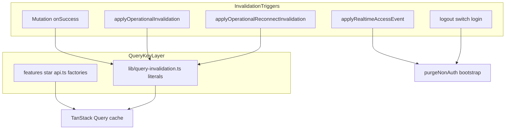

# Phase 2 — TanStack Query / Cache Audit

Status: audit report  
Date: 2026-06-26  
Mode: audit only — no source changes

## Sources

| Category | Files |
|----------|-------|
| Contract | [`AGENTS.md`](../AGENTS.md), [`apps/web/AGENTS.md`](../../apps/web/AGENTS.md), [`.cursor/rules/`](../.cursor/rules/) |
| Compass | [`phase_2_audit_backlog.md`](./phase_2_audit_backlog.md) §5 (NR-09), §decisions (NR-06 / D-02) |
| Prior consolidations | [`phase_2_realtime_event_driven_consolidation.md`](./phase_2_realtime_event_driven_consolidation.md), [`phase_2_celery_async_consolidation.md`](./phase_2_celery_async_consolidation.md) |
| Domain authority | [`docs/product/domains/realtime_domain.md`](../product/domains/realtime_domain.md) §2 invalidation matrix, §10 frontend expectations |

**Branch context:** Feature audits closed (`TODO_NOW = 0`). API/OpenAPI, Database/ORM, Realtime/Event-driven, and Celery/Async phase 2 audits consolidated. This audit follows code evidence for frontend server-state cache, query key design, invalidation behavior, and tenant isolation. No `FIXED`, `WONT_FIX_NOW`, or `DECISION_CLOSED` items reopened.

---

## Files inspected

| Layer | Paths |
|-------|-------|
| Query infrastructure | `apps/web/src/lib/query-invalidation.ts`, `apps/web/src/lib/query-client.ts` |
| Query key factories | All `apps/web/src/features/*/api.ts` (auth, signals, actions, checklists, comments, chat, notifications, observations, onboarding, establishment-config, invitations, realtime) |
| Hooks / mutations | `features/{signals,actions,checklists,comments,chat,notifications,observations,onboarding,auth,establishment-config}/hooks.ts`, `features/auth/hooks/use-app-page-workspace.ts` |
| Auth / tenant isolation | `apps/web/src/app/auth-provider.tsx`, `apps/web/src/features/auth/api.ts`, `apps/web/src/features/auth/session.ts` |
| Realtime invalidation | `features/realtime/lib/apply-operational-invalidation.ts`, `features/realtime/lib/apply-realtime-access-events.ts`, `features/realtime/components/operational-realtime-provider.tsx`, `features/chat/components/chat-realtime-provider.tsx`, `features/chat/lib/apply-chat-availability-cache.ts` |
| App wiring | `apps/web/src/App.tsx` |

## Tests inspected

| Area | Files |
|------|-------|
| Cache purge / invalidation helpers | `apps/web/src/lib/query-invalidation.test.ts` |
| Auth isolation | `apps/web/src/app/auth-provider.test.tsx`, `apps/web/src/features/auth/api.test.ts` |
| Realtime mapping | `apps/web/src/features/realtime/lib/apply-operational-invalidation.test.ts`, `apps/web/src/features/realtime/lib/apply-realtime-access-events.test.ts`, `apps/web/src/features/realtime/components/operational-realtime-provider.test.tsx` |
| Mutation invalidation | `features/{signals,actions,checklists,comments,notifications}/hooks.mutations.test.ts` |
| Chat cache | `apps/web/src/features/chat/lib/apply-chat-availability-cache.test.ts`, `apps/web/src/features/chat/components/chat-realtime-provider.test.tsx` |

## Docs / rules inspected

- [`phase_2_audit_backlog.md`](./phase_2_audit_backlog.md) §5 (NR-09), NR-06 / D-02 (decisions section)
- [`phase_2_realtime_event_driven_consolidation.md`](./phase_2_realtime_event_driven_consolidation.md) — RT-E5, RT-E7, RT-E8, RT-E9, RT-E10, NR-06, NR-08, NR-09
- [`docs/product/domains/realtime_domain.md`](../product/domains/realtime_domain.md) §2, §10
- `.cursor/rules/20-frontend-react-vite-ts.mdc`, `21-mobile-first-pwa.mdc`

## Assumptions / unknowns

- No runtime profiling of refetch volume under concurrent WebSocket events or multiple mounted queries.
- `/reporting` (`features/observations/pages/report-page.tsx`) uses observation mutations and processing-status polling, not KPI query hooks — reporting cache staleness is future-facing.
- Frequency of login without prior logout in the same SPA session not measured.
- Component-local React state retention after logout not exhaustively tested.
- WebSocket delivery ordering and missed-event rates not measured in this audit.

---

## 1. Summary

TanStack Query ownership in Houston is **disciplined for MVP**. Each domain exposes `*QueryKeys` factories in `features/*/api.ts`. Establishment-scoped operational data embeds `establishmentId` in query keys. Centralized invalidation helpers in `lib/query-invalidation.ts` are consumed by mutation hooks and realtime handlers. Tenant isolation uses a predicate-based model: `purgeNonAuthQueries` removes every query whose root is not `auth`; logout calls `clearAuthenticatedQueryCache` (full wipe).

Residual risk clusters in five areas:

1. **Invalidation registry drift** — hardcoded key arrays in `query-invalidation.ts` diverge from `api.ts` factories; backend `reason` strings and frontend handlers have no shared registry (RT-E5, TQ-E1, TQ-E2).
2. **Precision vs freshness tradeoffs** — comment events invalidate thread queries only, not parent signal/action feeds (NR-06 / RT-E7 / D-02, TQ-E3); broad establishment-prefix invalidation on signal/action/checklist events (TQ-E7).
3. **Reconnect and hub gaps** — operational reconnect sweep omits comment threads (NR-08 / RT-E8, TQ-E4); workspace roots lack operational WebSocket invalidation (NR-09 / RT-E10, TQ-E5).
4. **Key stability** — checklist template list keys embed raw filter objects without normalization (TQ-E8); duplicated user-search keys across actions and comments domains.
5. **Auth-path parity** — realtime establishment switch invalidates bootstrap instead of rewriting it; login does not defensively purge non-auth cache (TQ-E9, TQ-E10).

**No P0 cache-isolation or sensitive-data leak found.** Establishment switch purge is default-safe for any non-`auth` query root. Logout clears the full cache including bootstrap.

| Priority | Count | Themes |
|----------|-------|--------|
| **P1** | 0 | — |
| **P2** | 6 | Invalidation drift (TQ-E1, TQ-E2); broad prefixes (TQ-E7); unstable checklist keys (TQ-E8); bootstrap parity (TQ-E9); login purge gap (TQ-E10); comment parent-feed staleness product slice (TQ-E3) |
| **P3** | 4 | Reconnect comment gap (TQ-E4); workspace WS gap (TQ-E5); reporting placeholder (TQ-E6); comment staleness deferred slice (TQ-E3) |

---

## 2. Query / cache findings

### TQ-E1 — Invalidation helpers duplicate query key literals instead of importing factories

| Field | Detail |
|-------|--------|
| **ID** | TQ-E1 |
| **Severity** | P2 |
| **Category** | maintainability / API contract |
| **Evidence** | `apps/web/src/lib/query-invalidation.ts` — all `invalidateEstablishment*` and `invalidate*Comment*` functions hardcode arrays such as `['signals', 'feed', establishmentId]`. Factories in `features/signals/api.ts` (`signalsQueryKeys`), `features/actions/api.ts` (`actionsQueryKeys`), `features/checklists/api.ts` (`checklistsQueryKeys`), `features/comments/api.ts` (`commentsQueryKeys`), and `features/notifications/api.ts` (`notificationsQueryKeys`) are not imported. Realtime handler `apply-operational-invalidation.ts` routes through these helpers only. |
| **Problem** | Two sources of truth for query key shape. Renaming a segment in `api.ts` (e.g. `execution-feed` → `feed`) would not update invalidation helpers unless manually synchronized. |
| **Risk** | Silent invalidation misses after key refactor — mounted queries stay stale while mutations and new reads use updated keys. |
| **Suggested direction** | Derive invalidation prefixes from shared `*QueryKeys` factories or a single `query-keys.ts` module consumed by both hooks and invalidation helpers. Cross-ref RT-E5 (realtime consolidation). |
| **Test coverage** | `query-invalidation.test.ts` asserts hardcoded arrays match today's convention; no test guards factory/helper parity. |
| **Size** | S |

---

### TQ-E2 — WebSocket invalidation reason registry is asymmetric and untyped

| Field | Detail |
|-------|--------|
| **ID** | TQ-E2 |
| **Severity** | P2 |
| **Category** | maintainability / ambiguity |
| **Evidence** | `apply-operational-invalidation.ts` — `signal`, `action`, `checklist`, and `execution` branches ignore `event.reason`; `comment` and `notification` branches gate on exact reason strings (`NOTIFICATION_INVALIDATION_REASONS` set; comment `switch` with `default: break`). `features/realtime/types.ts` types `reason` as plain `string`. Backend emitters duplicate reason strings in five domain `services.py` wrappers → `realtime/broadcast.py`. `realtime_domain.md` §2 documents the live matrix. |
| **Problem** | No shared backend↔frontend registry. Extension requires updating domain wrapper, domain doc, frontend types, `apply-operational-invalidation.ts`, and tests independently. |
| **Risk** | Typo in backend `comment.*` or `notification.*` reason → frontend silent no-op (tested: `apply-operational-invalidation.test.ts` "ignores unknown comment reason"). New `subject_type` with wrong handler → stale cache with no error surface. |
| **Suggested direction** | Document WS ↔ query-root matrix as part of NR-09 ownership; optional shared constants or codegen checklist when extending invalidation. Coordinate with RT-E5. |
| **Test coverage** | `apply-operational-invalidation.test.ts` covers all 14 live reason pairs plus unknown-reason no-op cases. No contract test linking backend emit strings to frontend sets. |
| **Size** | M |

---

### TQ-E3 — Comment invalidation refreshes threads only, not parent signal/action feeds

| Field | Detail |
|-------|--------|
| **ID** | TQ-E3 |
| **Severity** | P2 (product) / P3 (engineering defer) |
| **Category** | ambiguity / maintainability |
| **Evidence** | `apply-operational-invalidation.ts` L48–62 — `comment.signal.created` → `invalidateSignalCommentQueries`; `comment.action.*` / `comment.signal.inherited` → `invalidateActionCommentQueries`. No call to `invalidateEstablishmentSignalQueries` or `invalidateEstablishmentActionQueries`. `realtime_domain.md` §2 maps comment reasons to comment list surfaces only. Realtime consolidation RT-E7 / backlog NR-06 / decision D-02: MVP default is threads only. |
| **Problem** | Feed cards showing comment counts or last-comment metadata can stay stale while the open thread refetches correctly. |
| **Risk** | User sees updated thread but stale count on signal/action feed card — product-visible inconsistency, not a security issue. |
| **Suggested direction** | Product decision D-02: extend invalidation to parent feeds only if option A approved. Otherwise document as intentional MVP tradeoff. |
| **Test coverage** | `apply-operational-invalidation.test.ts` asserts comment keys only; no test for parent-feed non-invalidation (implicit). Backend `realtime/tests/` cover emission. |
| **Size** | S (if product approves parent invalidation) |

---

### TQ-E4 — Operational reconnect sweep omits comment query roots

| Field | Detail |
|-------|--------|
| **ID** | TQ-E4 |
| **Severity** | P3 |
| **Category** | maintainability / ambiguity |
| **Evidence** | `applyOperationalReconnectInvalidation` in `apply-operational-invalidation.ts` L72–79 invalidates signals, actions, checklists, and notifications establishment prefixes only. No `invalidateEstablishmentCommentQueries` helper exists in `query-invalidation.ts`. `realtime_domain.md` §10 L306 documents: "Comment lists are not refetched on reconnect — a known limitation." Realtime consolidation RT-E8 / backlog NR-08: DEFER_PHASE_2. |
| **Problem** | After background tab, network loss, or transient WebSocket drop, comment threads opened during the gap may show stale data until user navigates away or a new `comment.*` event arrives. |
| **Risk** | Field teams on unreliable mobile networks see stale comment threads after reconnect — edge case while session was inactive. |
| **Suggested direction** | Add comment prefix to reconnect sweep when product accepts refetch cost (NR-08 quick win, size S). |
| **Test coverage** | `apply-operational-invalidation.test.ts` tests reconnect sweep for four domains; comments explicitly absent. No `operational-realtime-provider.test.tsx` reconnect test. |
| **Size** | S |

---

### TQ-E5 — Workspace query roots have no operational WebSocket invalidation path

| Field | Detail |
|-------|--------|
| **ID** | TQ-E5 |
| **Severity** | P3 |
| **Category** | maintainability / ambiguity |
| **Evidence** | `features/auth/api.ts` — `workspaceSummaryQueryKey`, `membershipListQueryKey`, `membershipDetailQueryKey`, `businessUnitTreeQueryKey` under `workspace` root. `apply-realtime-access-events.ts` invalidates workspace keys only on `membership.updated` and partial `membership.deactivated`. `apply-operational-invalidation.ts` never touches `workspace/*`. `use-app-page-workspace.ts` consumes summary and membership queries on `/app` workspace UI. Realtime consolidation RT-E10 / backlog NR-09. |
| **Problem** | Operational changes (signal created, action done, checklist execution) do not refresh workspace summary or membership detail caches. |
| **Risk** | User on workspace or multi-tab setup may see stale membership/BU tree while terrain feeds refresh via WebSocket. Low incidence if workspace is visited infrequently during active operations. |
| **Suggested direction** | Define which operational events should touch workspace roots when workspace KPIs ship; defer until workspace surfaces show operational aggregates. NR-09 primary owner. |
| **Test coverage** | `apply-realtime-access-events.test.ts` covers `membership.updated` workspace invalidation. No test linking operational `signal.*` to workspace keys. `membershipDetailQueryKey` never invalidated by realtime. |
| **Size** | M (when workspace operational metrics exist) |

---

### TQ-E6 — Reporting KPI query root exists only in test purge assertions

| Field | Detail |
|-------|--------|
| **ID** | TQ-E6 |
| **Severity** | P3 |
| **Category** | ambiguity |
| **Evidence** | `['reporting', 'kpi', establishmentId]` appears in `query-invalidation.test.ts`, `auth-provider.test.tsx`, `auth/api.test.ts`, and `apply-realtime-access-events.test.ts` as purge/logout fixture data. No `useQuery` hook or `*QueryKeys` factory in production `apps/web/src`. `/reporting` route uses observation mutations and `useObservationProcessingStatusQuery` polling, not a reporting KPI cache. Realtime consolidation RT-E10 / backlog NR-09. |
| **Problem** | Test-only key documents future intent but has no invalidation matrix entry. |
| **Risk** | **Low today.** When KPI hooks ship under `reporting` root, operational WebSocket events will not refresh them unless invalidation is designed upfront. |
| **Suggested direction** | Define reporting query roots and WS mapping when KPI features land; include in NR-09 matrix. |
| **Test coverage** | Purge tests confirm `reporting` root is removed on establishment switch and logout. No reporting hook or invalidation tests. |
| **Size** | S (documentation) / M (when hooks ship) |

---

### TQ-E7 — Broad establishment-prefix invalidation on operational events

| Field | Detail |
|-------|--------|
| **ID** | TQ-E7 |
| **Severity** | P2 |
| **Category** | performance / scalability |
| **Evidence** | `invalidateEstablishmentSignalQueries` invalidates `['signals', 'feed', estId]` and `['signals', 'detail', estId]` — matching all `viewMode` and filter variants and all open signal details. `invalidateActionMutationSurfaces` fans out to action and signal prefixes. Any `subject_type === 'signal'` event triggers full establishment signal sweep regardless of `entity_id`. `invalidateActionMutationSurfaces` used for all `action` events. Reconnect sweep uses same broad prefixes. TanStack Query refetches only mounted/active queries. |
| **Problem** | Defense-in-depth design invalidates more than the changed entity. Intentional per `realtime_domain.md` and dual-emission tests in backend `test_action_invalidation.py`. |
| **Risk** | At pilot scale: acceptable extra network. At growth: refetch storms when many detail views or feed variants are mounted; battery impact on mobile (PWA transverse). |
| **Suggested direction** | Monitor refetch volume at pilot; consider entity-scoped invalidation for detail keys when profiling shows pain. Not urgent at dev volume. |
| **Test coverage** | `query-invalidation.test.ts` asserts prefix scope and no global roots. `apply-operational-invalidation.test.ts` covers per-subject-type routing. No mounted-query refetch count tests. |
| **Size** | L (if narrowed later) |

---

### TQ-E8 — Checklist template list keys embed unstable filter objects

| Field | Detail |
|-------|--------|
| **ID** | TQ-E8 |
| **Severity** | P2 |
| **Category** | maintainability / performance |
| **Evidence** | `checklistsQueryKeys.templates` in `features/checklists/api.ts` L30–31 embeds raw `ChecklistTemplateListFilters` object in the key. Signals use `normalizeSignalFeedFilters` in `features/signals/api.ts` / `lib/signal-feed-filters.ts`. Invalidation uses prefix `['checklists', 'templates', establishmentId]` which matches all filter variants. Chat `eligibleMemberships` uses untrimmed search query in key (secondary note). |
| **Problem** | `{}` vs `{ created_by_me: undefined }` or object identity differences can produce duplicate cache entries for the same logical filter. |
| **Risk** | Split cache entries waste memory; stale variant may survive invalidation if key shape diverges from invalidated prefix. Hub page uses `useMemo` for minimal filter object — reduces but does not eliminate risk. |
| **Suggested direction** | Add `normalizeChecklistTemplateFilters` mirroring signal pattern, or document invariant that callers must pass canonical filter objects. |
| **Test coverage** | No test for filter key stability. `checklists/hooks.mutations.test.ts` covers invalidation scope, not key normalization. |
| **Size** | S |

---

### TQ-E9 — Realtime establishment switch does not rewrite bootstrap like REST switch

| Field | Detail |
|-------|--------|
| **ID** | TQ-E9 |
| **Severity** | P2 |
| **Category** | maintainability / security (transient UX) |
| **Evidence** | `switchEstablishment` in `features/auth/api.ts` L368–369: `purgeNonAuthQueries` then `setQueryData(bootstrapQueryKey, result.data)`. `applyRealtimeAccessEvent` case `establishment.switched` in `apply-realtime-access-events.ts` L36–39: `purgeNonAuthQueries` then `invalidateQueries({ queryKey: bootstrapQueryKey, exact: true })` only. `apply-realtime-access-events.test.ts` L116–147 expects bootstrap stale until refetch. `App.tsx` derives `establishmentId` from `auth.bootstrap?.active_membership?.establishment_id`. |
| **Problem** | Cross-tab establishment switch leaves bootstrap cache stale until `fetchBootstrap` completes. Direct user switch is synchronous. |
| **Risk** | Transient window where `active_membership`, `permission_hints`, or `establishmentId` in context disagree with server — wrong establishment queries may mount briefly, or UI shows prior establishment label. Purge removes operational data; bootstrap content is the residual leak surface. |
| **Suggested direction** | Align realtime path with REST switch: include bootstrap payload in `establishment.switched` access event or refetch-and-set before releasing UI. |
| **Test coverage** | `apply-realtime-access-events.test.ts` documents current invalidate-only behavior. `auth/api.test.ts` tests REST switch purge + rewrite. No integration test for cross-tab switch UI timing. |
| **Size** | S |

---

### TQ-E10 — Login and registration do not defensively purge non-auth cache

| Field | Detail |
|-------|--------|
| **ID** | TQ-E10 |
| **Severity** | P2 |
| **Category** | security / maintainability |
| **Evidence** | `login` and `registerOnboarding` in `features/auth/api.ts` call `hydrateBootstrap` + `setAccessToken` only (L265–266, L310–311). `switchEstablishment` additionally calls `purgeNonAuthQueries`. Logout path uses `clearAuthState` → `clearAuthenticatedQueryCache` (full wipe) in `auth-provider.tsx` L136–142 `finally` block. `apps/web/AGENTS.md` documents login is not listed as a purge trigger. |
| **Problem** | If operational cache survives in the same SPA session without a prior logout (e.g. failed partial logout, dev hot reload, future session-reuse path), login would overlay new bootstrap onto stale tenant data. |
| **Risk** | **Low in normal flow** — logout and 401 paths clear cache. Edge case: brief display of prior-tenant operational data after new login until queries refetch or user navigates. |
| **Suggested direction** | Add defensive `purgeNonAuthQueries` on successful login/register for parity with establishment switch. |
| **Test coverage** | `auth-provider.test.tsx` tests logout purge. No test for login-with-residual-cache scenario. |
| **Size** | S |

---

## 3. Invalidation precision risks

**Broad establishment prefixes (TQ-E7)**

- Signal, action, checklist, and notification invalidation use establishment-scoped prefixes that match all view modes, filter variants, and (for detail) all entity IDs under that establishment.
- `invalidateActionMutationSurfaces` always fans out to signal queries — matches backend dual-emission and frontend defense-in-depth documented in `realtime_domain.md` §8.
- Reconnect sweep (`applyOperationalReconnectInvalidation`) uses the same broad pattern as live invalidation for four domains.

**Narrow / precise invalidation**

- Comment events (TQ-E3): single thread key per `comments/signal` or `comments/action` — parent feeds untouched (NR-06 / RT-E7 / D-02).
- Notification list: `['notifications', 'list', establishmentId]` prefix covers inbox and archived status variants; `notifications/preferences` is **not** WebSocket-invalidated.
- Checklist execution: `invalidateChecklistExecutionSurfaces` targets specific `execution-detail` key plus broader checklist surfaces.
- Signal resolve mutation uses `setQueryData` on specific detail plus broad invalidate (hybrid pattern in `features/signals/hooks.ts`).

**Compensating paths**

- Observation processing: no WebSocket `observation` subject; `useObservationProcessingStatusQuery` polls every 2s and calls `invalidateEstablishmentSignalQueries` on terminal status (`observations/hooks.ts` L133–154). Redundant with downstream `signal.created` / `signal.updated` WS — safe at dev volume (RT-E9).
- Chat V1: `message.created` patches message cache via `useAppendChatMessageToCache`; reconnect invalidates conversations and active messages only — not `chat/status`, `chat/conversation`, or `chat/eligible-memberships`.

**Secondary precision notes**

- Duplicated user-search caches: `users/search` in `actions/api.ts` vs `comments/mention-search` in `comments/api.ts` hit the same REST endpoint with different query roots — duplicate fetches possible.
- Idle sentinel inconsistency: most domains use `'none'` for disabled queries; workspace uses `'idle'`; membership detail idle key uses segment `membership-detail` while live key uses `memberships`.

---

## 4. Auth / tenant cache isolation risks

**Strong isolation (evidence-backed)**

- `purgeNonAuthQueries` — predicate `queryKey[0] !== 'auth'`; removes reporting, workspace, onboarding, signals, actions, chat, and unknown future roots without per-feature whitelist (`query-invalidation.test.ts`).
- `clearAuthenticatedQueryCache` — `cancelQueries()` then `queryClient.clear()` on logout, session revoked, bootstrap 401, and refresh failure paths.
- In-flight query cancellation before purge prevents stale data repopulating cache after establishment switch (`query-invalidation.test.ts` "does not restore cancelled in-flight data after purge").
- Access token in-memory only (`session.ts`); no durable client storage of operational API responses; PWA `runtimeCaching: []` in vite config.
- Only `['auth', 'bootstrap']` under `auth` root today — matches `apps/web/AGENTS.md` contract.

**Residual risks**

- **TQ-E9** — bootstrap stale window on realtime establishment switch; `establishmentId` in `App.tsx` may lag.
- **TQ-E10** — login without defensive purge; edge case only.
- **Bootstrap patching** — `apply-chat-availability-cache.ts` mutates `permission_hints` on bootstrap via `setQueryData`; operational data must never accumulate under `auth` beyond bootstrap metadata.
- **Active membership deactivated** — `membership.deactivated` for active member triggers navigation callbacks only, no query invalidation (`apply-realtime-access-events.ts` L41–45).

**Cross-tenant leakage verdict:** Establishment switch and logout isolation are **default-safe**. No evidence of tenant-scoped data surviving purge under wrong root. Risk is transient bootstrap metadata inconsistency, not durable cross-establishment feed leakage.

---

## 5. Realtime / cache interaction risks

| Theme | Backlog / consolidation alias | Audit finding | Status |
|-------|------------------------------|---------------|--------|
| WS ↔ query-root registry drift | RT-E5, NR-09 | TQ-E1, TQ-E2 | Confirmed — primary TanStack audit ownership |
| Comment parent feeds stale | NR-06, RT-E7, D-02 | TQ-E3 | Product decision open; MVP intentional |
| Reconnect comment gap | NR-08, RT-E8 | TQ-E4 | Deferred P3; documented in `realtime_domain.md` §10 |
| Workspace / reporting hubs | NR-09, RT-E10 | TQ-E5, TQ-E6 | Deferred; low risk until KPI hooks ship |
| Observation poll redundancy | OR-07, RT-E9 | §3 compensating path | Ignore at dev volume |
| Best-effort WS delivery | D-04B, RT-E6, CA-E8 | — | If `invalidate` never arrives, cache stays stale until reconnect sweep or manual navigation; outbox half product-gated |

**WebSocket event coverage summary**

- Operational `invalidate` events map to signals, actions, checklists, executions, comment threads, and notification lists via `applyOperationalInvalidation`.
- Operational `access` events map to auth bootstrap, workspace subsets, and full purge via `applyRealtimeAccessEvent`.
- Ungapped production roots today: `observations/processing-status` (poll only), `notifications/preferences`, `workspace/memberships/{id}` detail, `onboarding/*`, user search caches, partial chat surfaces on reconnect.

**Reconnect asymmetry**

- Operational provider: signals, actions, checklists, notifications — not comments (TQ-E4).
- Chat provider: conversations + active messages — not status, conversation detail, or eligible-memberships.

---

## 6. Safe areas

- Per-domain `*QueryKeys` factories in `features/*/api.ts` with establishment or session scoping — consistent ownership pattern.
- `purgeNonAuthQueries` / `clearAuthenticatedQueryCache` contract documented in `apps/web/AGENTS.md` and enforced by tests.
- Mutation invalidation uses shared helpers; five `hooks.mutations.test.ts` files assert establishment-scoped keys and **no global-root** invalidation (`['signals']`, `['actions']`, `['checklists']`, `['auth']`).
- Signal feed filters normalized via `normalizeSignalFeedFilters` — stable cache keys across object identity.
- Notification infinite list invalidates via `notificationsQueryKeys.lists(estId)` prefix — covers status variants.
- `query-client.ts` defaults: `refetchOnWindowFocus: false`, `staleTime: 30_000` — reduces accidental refetch storms on tab focus.
- `apply-operational-invalidation.test.ts` provides full matrix coverage for live `subject_type` / `reason` pairs.
- Chat availability patches bootstrap hints without storing chat payloads under `auth` beyond permission metadata.

---

## 7. Needs more evidence

- Refetch storm severity under N concurrently mounted queries and high WebSocket event rate (TQ-E7) — requires runtime profiling, not static audit.
- User-visible stale workspace summary while user remains on terrain routes (TQ-E5) — depends on navigation patterns.
- Frequency and impact of login without prior `clearAuthState` in same SPA session (TQ-E10).
- Battery impact of observation 2s poll plus reconnect establishment sweeps on mobile — PWA / mobile-first transverse audit (RT-E9, RT-E8).
- Component-local React state after logout — may retain UI fragments until unmount; not query cache but affects perceived data leakage.
- Whether realtime `establishment.switched` access payload could include bootstrap body for parity — API contract question, not verified in backend audit.

---

## 8. Top priorities

### Do first

1. **TQ-E1 / TQ-E2** — Align `query-invalidation.ts` with `*QueryKeys` factories; document WS ↔ query-root matrix (NR-09 owner, coordinates RT-E5).
2. **TQ-E8** — Normalize checklist template filter keys (or document caller invariant).
3. **TQ-E9** — Bootstrap rewrite parity on realtime establishment switch.

### Quick wins

- Import factories into invalidation helpers (TQ-E1, size S).
- Reconnect comment prefix sweep when product accepts refetch cost (TQ-E4 / NR-08, size S).
- Defensive `purgeNonAuthQueries` on login (TQ-E10, size S).

### Structural — plan later

- Narrow entity-scoped detail invalidation at scale (TQ-E7).
- Reporting KPI invalidation matrix when hooks ship (TQ-E6 / NR-09).
- Workspace operational invalidation when workspace shows live aggregates (TQ-E5 / RT-E10).

### Product-gated

- **TQ-E3** — Parent signal/action feed invalidation on `comment.*` only if D-02 option A approved (NR-06 / RT-E7).

### Not worth fixing now

- Reporting placeholder keys with no production hooks (TQ-E6).
- Observation 2s poll redundancy (RT-E9) at dev volume.
- Workspace staleness on non-workspace routes at pilot scale (TQ-E5).
- Broad establishment-prefix invalidation at current mounted-query scale (TQ-E7).

---

## 9. Changed / Validated / Risks

**Changed**

- Created `docs/audits/phase_2_tanstack_query_cache_audit.md` (audit report only).

**Validated**

- Query key factories across 11 `features/*/api.ts` modules.
- `lib/query-invalidation.ts` helpers and auth purge/switch flows in `auth/api.ts`, `auth-provider.tsx`.
- Realtime invalidation routing in `apply-operational-invalidation.ts`, `apply-realtime-access-events.ts`, and provider wiring.
- Test files: `query-invalidation.test.ts`, `apply-operational-invalidation.test.ts`, `apply-realtime-access-events.test.ts`, `auth-provider.test.tsx`, `auth/api.test.ts`, five mutation test files.
- Cross-check with [`phase_2_realtime_event_driven_consolidation.md`](./phase_2_realtime_event_driven_consolidation.md) findings RT-E5, RT-E7, RT-E8, RT-E9, RT-E10 and backlog aliases NR-06, NR-08, NR-09.
- Domain authority in [`realtime_domain.md`](../product/domains/realtime_domain.md) §2 and §10.

**Risks / not verified**

- Runtime refetch timing and mounted-query behavior under WebSocket bursts.
- Component local state retention after logout.
- Login-without-logout same-session edge case frequency.
- Backend payload shape for potential bootstrap-in-access-event parity (TQ-E9).
