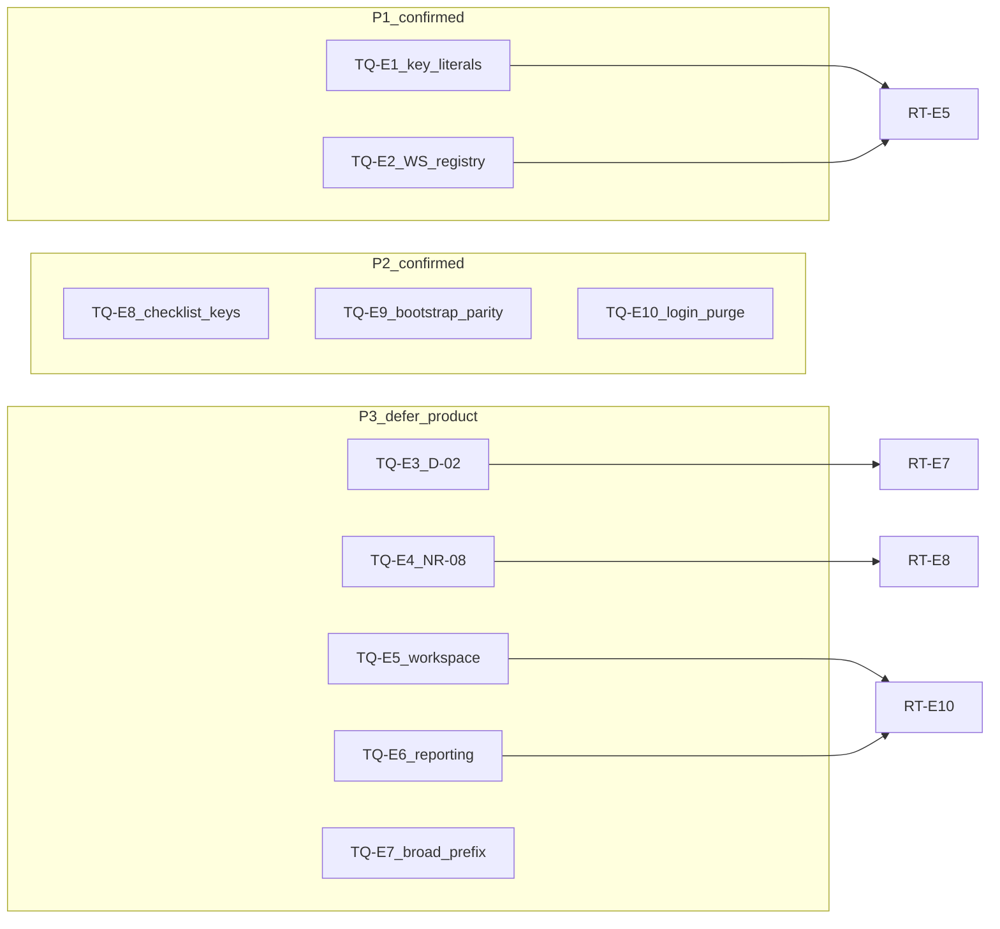
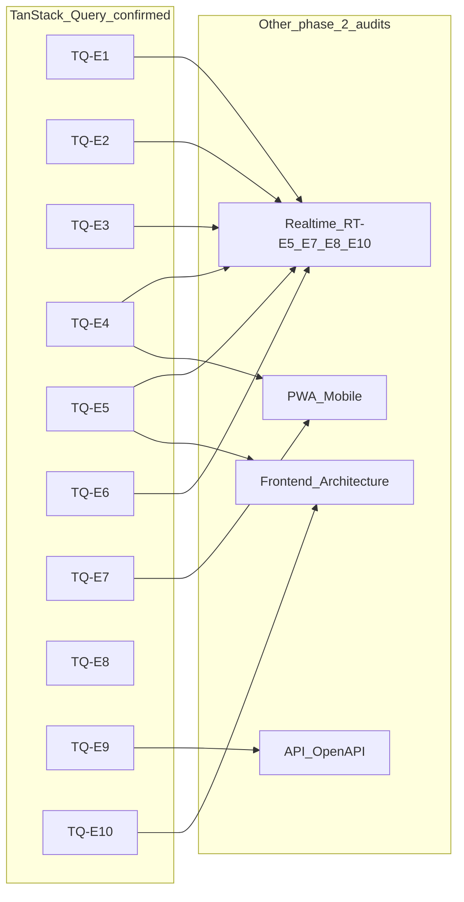

# Phase 2 — TanStack Query / Cache Consolidation

Status: consolidation report  
Date: 2026-06-26  
Mode: consolidation only — no source changes

> **Post-audit note (2026-06-27):** Wave 0 scoped deliverables landed — see [`phase_2_final_roadmap.md`](./phase_2_final_roadmap.md) § Wave 0 status. Wave 1 remainder scoped: **TQ-E8**, **TQ-E9**, **TQ-E10** closed via ROADMAP-13/14; **CACHE-01** / **TQ-E1** / **TQ-E2** architecture remains open (Wave 3). Evidence rows below reflect the 2026-06-26 audit snapshot. **TS-E4** parity guard closed.

## Sources

| Category | Files |
|----------|-------|
| Audit input | [`phase_2_tanstack_query_cache_audit.md`](./phase_2_tanstack_query_cache_audit.md) (TQ-E1–TQ-E10) |
| Backlog | [`phase_2_audit_backlog.md`](./phase_2_audit_backlog.md) §5 (NR-09), §decisions (NR-06/D-02, NR-08) |
| Closure | [`feature_audit_closure.md`](./feature_audit_closure.md) |
| Decisions | [`feature_audit_decisions.md`](./feature_audit_decisions.md) |
| Cross-audit | [`phase_2_realtime_event_driven_consolidation.md`](./phase_2_realtime_event_driven_consolidation.md) (RT-E5, RT-E7–RT-E10) |
| Contract | [`AGENTS.md`](../../AGENTS.md), [`apps/web/AGENTS.md`](../../apps/web/AGENTS.md) |
| Domain authority | [`docs/product/domains/realtime_domain.md`](../product/domains/realtime_domain.md) §2, §10 |

**Branch context:** Feature audits closed (`TODO_NOW = 0`). API/OpenAPI, Database/ORM, Realtime/Event-driven, and Celery/Async phase 2 audits consolidated. This consolidation challenges each finding from the phase 2 TanStack Query / Cache audit against backlog §5, closure registry, decision pack, Realtime consolidation, and spot-check code evidence. No `FIXED`, `WONT_FIX_NOW`, or `DECISION_CLOSED` items reopened without new direct code evidence.

---

## 1. Executive summary

TanStack Query ownership in Houston is **disciplined for MVP**. Each domain exposes `*QueryKeys` factories in `features/*/api.ts`. Establishment-scoped operational data embeds `establishmentId` in query keys. Centralized invalidation helpers in `lib/query-invalidation.ts` are consumed by mutation hooks and realtime handlers. Tenant isolation uses a predicate-based model: `purgeNonAuthQueries` removes every query whose root is not `auth`; logout calls `clearAuthenticatedQueryCache` (full wipe).

Residual risk is **not** cross-tenant durable leakage. It clusters in:

1. **Invalidation registry drift** — hardcoded key arrays in `query-invalidation.ts` diverge from `api.ts` factories; backend `reason` strings and frontend handlers have no shared registry (RT-E5, TQ-E1, TQ-E2)
2. **Key stability** — checklist template list keys embed raw filter objects without normalization (TQ-E8)
3. **Auth-path parity** — realtime establishment switch invalidates bootstrap instead of rewriting it; login does not defensively purge non-auth cache (TQ-E9, TQ-E10)
4. **Precision vs freshness tradeoffs** — comment events invalidate thread queries only, not parent signal/action feeds (NR-06 / RT-E7 / D-02, TQ-E3); broad establishment-prefix invalidation on signal/action/checklist events (TQ-E7)
5. **Reconnect and hub gaps** — operational reconnect sweep omits comment threads (NR-08 / RT-E8, TQ-E4); workspace roots lack operational WebSocket invalidation (NR-09 / RT-E10, TQ-E5)

**No P0 cache-isolation or sensitive-data leak found.** Establishment switch purge is default-safe for any non-`auth` query root. Logout clears the full cache including bootstrap.

| Priority | Count | Themes |
|----------|-------|--------|
| **P1** | 2 | Invalidation drift (TQ-E1, TQ-E2) |
| **P2** | 3 | Checklist key stability (TQ-E8); bootstrap parity (TQ-E9); login purge gap (TQ-E10) |
| **P3** | 5 | Reconnect comment gap (TQ-E4); workspace WS gap (TQ-E5); reporting placeholder (TQ-E6); broad prefixes at scale (TQ-E7); comment parent-feed product slice (TQ-E3) |

**Consolidation verdict:** 10 audit findings reviewed → **10 evidence-backed confirmations**, of which **5 are actionable without product gate** (TQ-E1, TQ-E2, TQ-E8, TQ-E9, TQ-E10), **1 carries a product-gated slice** (TQ-E3 — D-02), **3 deferred** (TQ-E5, TQ-E6, TQ-E7 at pilot scale), **1 deferred with a small remediation candidate** (TQ-E4), **0 full false positives**, **7/10 duplicate merges** to Realtime consolidation or backlog aliases.

---

## 2. Findings reviewed

All 10 findings from [`phase_2_tanstack_query_cache_audit.md`](./phase_2_tanstack_query_cache_audit.md) §2, cross-checked against [`phase_2_audit_backlog.md`](./phase_2_audit_backlog.md) §5, [`feature_audit_closure.md`](./feature_audit_closure.md), [`feature_audit_decisions.md`](./feature_audit_decisions.md), [`phase_2_realtime_event_driven_consolidation.md`](./phase_2_realtime_event_driven_consolidation.md), and spot-check code evidence.

| ID | Audit sev | Reclassification | Backlog alias | Consolidation notes |
|----|-----------|------------------|---------------|---------------------|
| **TQ-E1** | P2 | **CONFIRMED** + **DUPLICATE** (frontend half of RT-E5) | RT-E5, NR-09 | Code-verified: [`query-invalidation.ts`](../../apps/web/src/lib/query-invalidation.ts) hardcodes arrays such as `['signals', 'feed', establishmentId]`; factories in `features/signals/api.ts`, `features/actions/api.ts`, etc. are not imported. `query-invalidation.test.ts` asserts hardcoded arrays match today's convention — no factory/helper parity guard. Real risk on key refactor. |
| **TQ-E2** | P2 | **CONFIRMED** + **DUPLICATE** (full-stack half of RT-E5) | RT-E5, NR-09 | Code-verified: [`apply-operational-invalidation.ts`](../../apps/web/src/features/realtime/lib/apply-operational-invalidation.ts) — `signal`, `action`, `checklist`, `execution` branches ignore `event.reason`; `comment` and `notification` gate on exact reason strings; `features/realtime/types.ts` types `reason` as plain `string`. Backend emitters duplicate reason strings in domain `services.py` wrappers → `realtime/broadcast.py`. Not theoretical. |
| **TQ-E3** | P2/P3 | **PRODUCT_DECISION** + **DUPLICATE** | NR-06, D-02, RT-E7 | Code-verified: comment branch L48–62 invalidates thread keys only (`invalidateSignalCommentQueries` / `invalidateActionCommentQueries`); no call to `invalidateEstablishmentSignalQueries` or `invalidateEstablishmentActionQueries`. Intentional MVP per [`feature_audit_decisions.md`](./feature_audit_decisions.md) default: threads only. Not a bug — no engineering action without D-02 option A. |
| **TQ-E4** | P3 | **CONFIRMED** + **DEFER_PHASE_2** + **DUPLICATE** | NR-08, RT-E8 | Code-verified: `applyOperationalReconnectInvalidation` L72–79 invalidates signals, actions, checklists, notifications only; no `invalidateEstablishmentCommentQueries` helper in `query-invalidation.ts`. Documented in `realtime_domain.md` §10. Edge-case mobile staleness after reconnect, not security. Small remediation candidate (size S) when product accepts refetch cost. |
| **TQ-E5** | P3 | **CONFIRMED** + **DEFER_PHASE_2** + **DUPLICATE** | NR-09, RT-E10 | Code-verified: `workspaceSummaryQueryKey`, `membershipListQueryKey`, `membershipDetailQueryKey`, `businessUnitTreeQueryKey` in [`auth/api.ts`](../../apps/web/src/features/auth/api.ts); `apply-operational-invalidation.ts` never touches `workspace/*`. Low risk until workspace surfaces show live operational aggregates. |
| **TQ-E6** | P3 | **CONFIRMED** + **DEFER_PHASE_2** + **DUPLICATE** | NR-09, RT-E10 | Code-verified: `['reporting', 'kpi', establishmentId]` appears only in purge test fixtures (`query-invalidation.test.ts`, `auth-provider.test.tsx`, `auth/api.test.ts`, `apply-realtime-access-events.test.ts`); no production `useQuery` or `*QueryKeys` factory under `reporting` root. `/reporting` uses observation mutations and processing-status polling. Future-facing only. |
| **TQ-E7** | P2 | **CONFIRMED** + **IGNORE_NOW** (pilot scale) | — (Realtime consolidation deferred broad prefix) | Code-verified: `invalidateEstablishmentSignalQueries` and peers use establishment-scoped prefixes matching all view modes, filter variants, and detail keys — intentional defense-in-depth per `realtime_domain.md` §8. TanStack refetches mounted/active queries only. **NEEDS_MORE_EVIDENCE** for refetch-storm severity — requires runtime profiling, not static audit. Correct domain; defer narrowing until pilot pain. |
| **TQ-E8** | P2 | **CONFIRMED** (unique to TanStack audit) | — | Code-verified: `checklistsQueryKeys.templates` in [`checklists/api.ts`](../../apps/web/src/features/checklists/api.ts) L30–31 embeds raw `ChecklistTemplateListFilters` object; signals use `normalizeSignalFeedFilters` in `features/signals/api.ts` / `lib/signal-feed-filters.ts`. Prefix invalidation mitigates most stale cases; object-identity divergence still possible. |
| **TQ-E9** | P2 | **CONFIRMED** (unique to TanStack audit) | — | Code-verified: REST `switchEstablishment` in [`auth/api.ts`](../../apps/web/src/features/auth/api.ts) L368–369 — `purgeNonAuthQueries` then `setQueryData(bootstrapQueryKey, result.data)`; realtime `establishment.switched` in [`apply-realtime-access-events.ts`](../../apps/web/src/features/realtime/lib/apply-realtime-access-events.ts) L36–38 — `purgeNonAuthQueries` then `invalidateQueries({ queryKey: bootstrapQueryKey, exact: true })` only. Transient bootstrap/`establishmentId` lag in cross-tab switch — not durable tenant leak. Backend payload shape for bootstrap-in-access-event: **NEEDS_MORE_EVIDENCE** (API audit scope). |
| **TQ-E10** | P2 | **CONFIRMED** (unique to TanStack audit) | — | Code-verified: `login` and `registerOnboarding` in [`auth/api.ts`](../../apps/web/src/features/auth/api.ts) L265–266, L310–311 call `hydrateBootstrap` + `setAccessToken` only; no `purgeNonAuthQueries`. `switchEstablishment` additionally purges. Logout path uses `clearAuthenticatedQueryCache` in `auth-provider.tsx`. Edge case only in normal flow; defensive parity with switch is low-cost S fix. |

**Ancillary notes from audit §3** (not promoted to formal findings):

| Note | Disposition |
|------|-------------|
| Duplicated user-search keys (`users/search` in `actions/api.ts` vs `comments/mention-search` in `comments/api.ts`) | Defer to **Frontend Architecture** audit |
| Idle sentinel `'none'` vs `'idle'`; membership detail idle key segment mismatch | **IGNORE_NOW** hygiene |
| `notifications/preferences` not WebSocket-invalidated | Document in NR-09 matrix when extending |
| Observation 2s poll redundancy | **IGNORE_NOW**, alias RT-E9 / OR-07 |
| Chat reconnect partial surfaces (status, conversation detail, eligible-memberships) | Chat domain; out of TanStack audit scope |

**Backlog §5 re-validation:** NR-09 (workspace/reporting hubs) remains valid — confirmed with code evidence; TanStack audit is primary owner of WS ↔ query-root matrix. NR-08 (reconnect comment sweep) and NR-06/D-02 (parent feed invalidation) confirmed as deferred/product-gated respectively.

---

## 3. Confirmed priority findings

Full cards below cover findings with **engineering priority** (TQ-E1, TQ-E2, TQ-E4, TQ-E8, TQ-E9, TQ-E10). **TQ-E3**, **TQ-E5**, **TQ-E6**, and **TQ-E7** are also **confirmed** at finding level but are documented in [§4](#4-reclassified--duplicate--false-positive-findings) only — product-gated (TQ-E3), deferred (TQ-E5, TQ-E6, TQ-E4), or ignore-now at pilot scale (TQ-E7) — without duplicate cards here.

### TQ-E1 — Invalidation helpers duplicate query key literals instead of importing factories

| Field | Detail |
|-------|--------|
| **Severity** | P1 |
| **Evidence** | [`query-invalidation.ts`](../../apps/web/src/lib/query-invalidation.ts) — all `invalidateEstablishment*` and `invalidate*Comment*` functions hardcode arrays such as `['signals', 'feed', establishmentId]`. Factories in `features/signals/api.ts` (`signalsQueryKeys`), `features/actions/api.ts` (`actionsQueryKeys`), `features/checklists/api.ts` (`checklistsQueryKeys`), `features/comments/api.ts` (`commentsQueryKeys`), and `features/notifications/api.ts` (`notificationsQueryKeys`) are not imported. Realtime handler routes through these helpers only. |
| **Why confirmed** | Two sources of truth for query key shape. Renaming a segment in `api.ts` would not update invalidation helpers unless manually synchronized. Tests lock today's literals, not factory parity. |
| **Risk** | Silent invalidation misses after key refactor — mounted queries stay stale while mutations and new reads use updated keys. Blocks safe large-scale frontend evolution. |
| **Suggested direction** | Derive invalidation prefixes from shared `*QueryKeys` factories or a single `query-keys.ts` module consumed by both hooks and invalidation helpers. Add a parity test or lint rule. Coordinate with RT-E5 / NR-09. |
| **Dependencies** | RT-E5 (backend wrapper duplication); NR-09 (matrix ownership) |
| **Size** | S |

---

### TQ-E2 — WebSocket invalidation reason registry is asymmetric and untyped

| Field | Detail |
|-------|--------|
| **Severity** | P1 |
| **Evidence** | [`apply-operational-invalidation.ts`](../../apps/web/src/features/realtime/lib/apply-operational-invalidation.ts) — `signal`, `action`, `checklist`, `execution` branches ignore `event.reason`; `comment` and `notification` branches gate on exact reason strings (`NOTIFICATION_INVALIDATION_REASONS` set; comment `switch` with `default: break`). `features/realtime/types.ts` types `reason` as plain `string`. Backend emitters duplicate reason strings in five domain `services.py` wrappers → `realtime/broadcast.py`. `realtime_domain.md` §2 documents the live matrix. |
| **Why confirmed** | No shared backend↔frontend registry. Extension requires updating domain wrapper, domain doc, frontend types, `apply-operational-invalidation.ts`, and tests independently. Typo in backend reason → frontend silent no-op (tested: unknown comment reason ignored). |
| **Risk** | New `subject_type` or reason with wrong handler → stale cache with no error surface. Compounds TQ-E1 drift as matrix grows. |
| **Suggested direction** | Document WS ↔ query-root matrix as part of NR-09 ownership; optional shared constants or codegen checklist when extending invalidation. Coordinate with RT-E5 backend wrapper consolidation. |
| **Dependencies** | RT-E5; NR-09; `realtime_domain.md` as domain authority |
| **Size** | M |

---

### TQ-E8 — Checklist template list keys embed unstable filter objects

| Field | Detail |
|-------|--------|
| **Severity** | P2 |
| **Evidence** | `checklistsQueryKeys.templates` in [`checklists/api.ts`](../../apps/web/src/features/checklists/api.ts) L30–31 embeds raw `ChecklistTemplateListFilters` object in the key. Signals use `normalizeSignalFeedFilters` in `features/signals/api.ts` / `lib/signal-feed-filters.ts` with dedicated tests in `signal-feed-filters.test.ts`. Invalidation uses prefix `['checklists', 'templates', establishmentId]` which matches all filter variants. |
| **Why confirmed** | `{}` vs `{ created_by_me: undefined }` or object identity differences can produce duplicate cache entries for the same logical filter. Hub page uses `useMemo` for minimal filter object — reduces but does not eliminate risk. |
| **Risk** | Split cache entries waste memory; stale variant may survive if key shape diverges from invalidated prefix. Localized to checklist templates hub today. |
| **Suggested direction** | Add `normalizeChecklistTemplateFilters` mirroring signal pattern, or document invariant that callers must pass canonical filter objects. |
| **Dependencies** | Checklist domain only; independent of backend audits |
| **Size** | S |

---

### TQ-E9 — Realtime establishment switch does not rewrite bootstrap like REST switch

| Field | Detail |
|-------|--------|
| **Severity** | P2 |
| **Evidence** | `switchEstablishment` in [`auth/api.ts`](../../apps/web/src/features/auth/api.ts) L368–369: `purgeNonAuthQueries` then `setQueryData(bootstrapQueryKey, result.data)`. `applyRealtimeAccessEvent` case `establishment.switched` in [`apply-realtime-access-events.ts`](../../apps/web/src/features/realtime/lib/apply-realtime-access-events.ts) L36–39: `purgeNonAuthQueries` then `invalidateQueries({ queryKey: bootstrapQueryKey, exact: true })` only. `apply-realtime-access-events.test.ts` L116–147 expects bootstrap stale until refetch. `App.tsx` derives `establishmentId` from `auth.bootstrap?.active_membership?.establishment_id`. |
| **Why confirmed** | Cross-tab establishment switch leaves bootstrap cache stale until `fetchBootstrap` completes. Direct user switch is synchronous. Purge removes operational data; bootstrap content is the residual inconsistency surface. |
| **Risk** | Transient window where `active_membership`, `permission_hints`, or `establishmentId` in context disagree with server — wrong establishment queries may mount briefly, or UI shows prior establishment label. Not a durable cross-tenant leak. |
| **Suggested direction** | Align realtime path with REST switch: include bootstrap payload in `establishment.switched` access event or refetch-and-set before releasing UI. |
| **Dependencies** | API/OpenAPI (access event payload contract); Realtime access events |
| **Size** | S |

---

### TQ-E10 — Login and registration do not defensively purge non-auth cache

| Field | Detail |
|-------|--------|
| **Severity** | P2 |
| **Evidence** | `login` and `registerOnboarding` in [`auth/api.ts`](../../apps/web/src/features/auth/api.ts) call `hydrateBootstrap` + `setAccessToken` only (L265–266, L310–311). `switchEstablishment` additionally calls `purgeNonAuthQueries`. Logout path uses `clearAuthState` → `clearAuthenticatedQueryCache` in `auth-provider.tsx`. [`apps/web/AGENTS.md`](../../apps/web/AGENTS.md) documents login is not listed as a purge trigger. |
| **Why confirmed** | If operational cache survives in the same SPA session without a prior logout (failed partial logout, dev hot reload, future session-reuse path), login would overlay new bootstrap onto stale tenant data. Normal flow clears via logout/401 paths. |
| **Risk** | Low in normal flow — brief display of prior-tenant operational data after new login until queries refetch or user navigates. Edge case, not systemic leak. |
| **Suggested direction** | Add defensive `purgeNonAuthQueries` on successful login/register for parity with establishment switch. Update `apps/web/AGENTS.md` contract if implemented. |
| **Dependencies** | Auth provider; `apps/web/AGENTS.md` contract |
| **Size** | S |

---

### TQ-E4 — Operational reconnect sweep omits comment query roots (NR-08)

| Field | Detail |
|-------|--------|
| **Severity** | P3 |
| **Evidence** | `applyOperationalReconnectInvalidation` in [`apply-operational-invalidation.ts`](../../apps/web/src/features/realtime/lib/apply-operational-invalidation.ts) L72–79 invalidates signals, actions, checklists, notifications establishment prefixes only. No `invalidateEstablishmentCommentQueries` helper exists in `query-invalidation.ts`. `realtime_domain.md` §10 documents: "Comment lists are not refetched on reconnect — a known limitation." |
| **Why confirmed** | After background tab, network loss, or transient WebSocket drop, comment threads opened during the gap may show stale data until user navigates away or a new `comment.*` event arrives. Live `comment.*` events work while socket stays connected. |
| **Risk** | Field teams on unreliable mobile networks see stale comment threads after reconnect — edge case while session was inactive. |
| **Suggested direction** | Add comment prefix to reconnect sweep when product accepts refetch cost (NR-08; small remediation candidate). Narrower than establishment-wide sweep if cost is a concern. |
| **Dependencies** | RT-E8; NR-08; PWA / Mobile-first (reconnect refetch cost) |
| **Size** | S |

---

## 4. Reclassified / duplicate / false-positive findings

### False positives

**None** at finding level. All 10 audit findings (TQ-E1–TQ-E10) are backed by code evidence verified in this consolidation pass.

### Product decisions (confirmed intentional behavior — no code change without gate)

| ID | Decision | Default MVP | Closure ref |
|----|----------|-------------|-------------|
| **TQ-E3** | `comment.*` invalidates thread queries only, not parent signal/action feeds | Threads only | NR-06 / D-02 **DECISION_OPEN** |

### Duplicates merged

| Canonical ID | Absorbed backlog / audit IDs | Relationship |
|--------------|------------------------------|--------------|
| **TQ-E1** | RT-E5 (frontend half), NR-09 | Hardcoded invalidation literals vs `*QueryKeys` factories |
| **TQ-E2** | RT-E5 (full-stack half), NR-09 | WS reason registry drift backend ↔ frontend |
| **TQ-E3** | RT-E7, NR-06, D-02 | Comment parent-surface staleness |
| **TQ-E4** | RT-E8, NR-08 | Reconnect comment sweep gap |
| **TQ-E5** | RT-E10, NR-09 | Workspace query roots without operational WS invalidation |
| **TQ-E6** | RT-E10, NR-09 | Reporting KPI placeholder keys (test-only today) |

### Deferred / ignore now

| ID | Status | Notes |
|----|--------|-------|
| **TQ-E5** | DEFER_PHASE_2 | No live workspace operational aggregates; invalidate when KPIs ship |
| **TQ-E6** | DEFER_PHASE_2 | No production reporting KPI hooks; define matrix when features land |
| **TQ-E7** | IGNORE_NOW | Broad establishment-prefix invalidation acceptable at pilot mounted-query scale; profile before narrowing |
| **TQ-E4** | DEFER_PHASE_2 | Small remediation candidate (size S) when mobile reconnect pain accepted |
| Observation poll (audit §3) | IGNORE_NOW | RT-E9 / OR-07 — safe redundancy at dev volume |

### Items explicitly not reopened

| ID | Closure status | Why not reopened |
|----|----------------|------------------|
| **ACT-04** | FIXED | Dual `action.updated` + `signal.updated` emission on linked reopen/cancel — tests in `test_action_invalidation.py` |
| **NR-05** | FIXED | Structured `logger.exception` on post-commit notification failure |
| **NR-03, NR-04, NR-07, NR-10** | FIXED | Doc alignment and provider callback test — prior notifications_realtime consolidation |
| **Broad prefix invalidation** | Deferred in Realtime consolidation | TanStack audit confirms intentional defense-in-depth at pilot scale — does not re-litigate |

---

## 5. Cross-audit dependencies

| TanStack finding | Depends on / blocks | Other phase 2 audit |
|------------------|---------------------|---------------------|
| **TQ-E1**, **TQ-E2** | WS ↔ query-root matrix ownership | Realtime RT-E5; backlog NR-09 — **TanStack audit is primary owner** of frontend matrix; Realtime owns backend wrapper duplication |
| **TQ-E3** | Product gate on parent-feed freshness | Realtime RT-E7; decision D-02 |
| **TQ-E4** | Reconnect refetch cost on mobile | Realtime RT-E8; backlog NR-08; PWA / Mobile-first |
| **TQ-E5**, **TQ-E6** | Future hub KPI hooks and invalidation design | Realtime RT-E10; Frontend Architecture (workspace/reporting routes) |
| **TQ-E7** | Missed WS + broad refetch interaction | Realtime RT-E6/D-04B (best-effort delivery); PWA profiling |
| **TQ-E9** | Access event payload may need bootstrap body | API / OpenAPI (contract question) |
| **TQ-E8** | Checklist filter normalization | Checklist domain only — independent |
| **TQ-E10** | Auth contract in `apps/web/AGENTS.md` | Frontend Architecture (session flows) |
| Safe isolation (purge contract) | Documented in `apps/web/AGENTS.md` | No backend dependency |

**Recommended next phase 2 audit:** Frontend Architecture — guards, RBAC mirrors, duplicated user-search query roots, and component-local state after logout complement this TanStack consolidation.

---

## 6. Top priorities

### P1 — must address before large-scale evolution

1. **TQ-E1 + TQ-E2** — Align `query-invalidation.ts` with `*QueryKeys` factories; document or codify WS reason ↔ query-root matrix (NR-09 owner, coordinates RT-E5). Silent invalidation misses on any key or WS extension block safe frontend evolution.

### P2 — important but not blocking pilot

2. **TQ-E8** — Normalize checklist template filter keys (mirror `normalizeSignalFeedFilters`).
3. **TQ-E9** — Bootstrap rewrite parity on realtime establishment switch.
4. **TQ-E10** — Defensive `purgeNonAuthQueries` on login/register.

### P3 — polish / hygiene

- **TQ-E4** — Reconnect comment prefix sweep (NR-08) — S when refetch cost accepted
- **TQ-E3** — Parent feed invalidation on `comment.*` (D-02) — product gate
- **TQ-E5** — Workspace operational invalidation — when workspace shows live aggregates
- **TQ-E6** — Reporting KPI invalidation matrix — when hooks ship
- **TQ-E7** — Entity-scoped detail invalidation — profile before narrowing at scale

### Small remediation candidates to plan later

- Align invalidation helpers with query key factories (TQ-E1, size S)
- Defensive `purgeNonAuthQueries` on login (TQ-E10, size S)
- Reconnect comment prefix sweep when product accepts refetch cost (TQ-E4 / NR-08, size S)

### Structural — plan later

- Narrow entity-scoped detail invalidation at scale (TQ-E7, size L)
- Reporting KPI invalidation matrix when hooks ship (TQ-E6 / NR-09, size M)
- Workspace operational invalidation when workspace shows live aggregates (TQ-E5 / RT-E10, size M)
- WS reason registry codegen or shared constants (TQ-E2, size M)

### Not worth fixing now

- Reporting placeholder keys with no production hooks (TQ-E6)
- Observation 2s poll redundancy (RT-E9 / OR-07) at dev volume
- Workspace staleness on non-workspace routes at pilot scale (TQ-E5)
- Broad establishment-prefix invalidation at current mounted-query scale (TQ-E7)
- Secondary §3 hygiene (idle sentinel, duplicate user-search roots, chat reconnect partial surfaces)

---

## 7. What is safe today

Evidence-backed areas that do not need immediate change:

| Area | Evidence |
|------|----------|
| **Tenant purge contract** | `purgeNonAuthQueries` — predicate `queryKey[0] !== 'auth'`; removes reporting, workspace, onboarding, signals, actions, chat, and unknown future roots without per-feature whitelist (`query-invalidation.test.ts`). `clearAuthenticatedQueryCache` — `cancelQueries()` then `queryClient.clear()` on logout, session revoked, bootstrap 401, and refresh failure paths. |
| **In-flight cancellation** | Cancelled in-flight queries do not repopulate cache after establishment switch (`query-invalidation.test.ts` "does not restore cancelled in-flight data after purge"). |
| **Query key factories** | Per-domain `*QueryKeys` in `features/*/api.ts` with establishment or session scoping — consistent ownership pattern across 11 modules. |
| **Signal filter stability** | `normalizeSignalFeedFilters` in `features/signals/lib/signal-feed-filters.ts` with dedicated tests — stable cache keys across object identity. |
| **Mutation invalidation** | Shared helpers consumed by mutation hooks; five `hooks.mutations.test.ts` files assert establishment-scoped keys and **no global-root** invalidation (`['signals']`, `['actions']`, `['checklists']`, `['auth']`). |
| **Query client defaults** | `query-client.ts`: `refetchOnWindowFocus: false`, `staleTime: 30_000` — reduces accidental refetch storms on tab focus. |
| **Realtime invalidation matrix** | `apply-operational-invalidation.test.ts` provides full matrix coverage for live `subject_type` / `reason` pairs. |
| **Chat bootstrap patching** | `apply-chat-availability-cache.ts` mutates `permission_hints` on bootstrap via `setQueryData` — no chat payloads stored under `auth` beyond permission metadata. |
| **No durable cross-tenant leak** | Access token in-memory only (`session.ts`); no durable client storage of operational API responses; PWA `runtimeCaching: []` in vite config. |

**Cross-tenant leakage verdict:** Establishment switch and logout isolation are **default-safe**. Risk is transient bootstrap metadata inconsistency (TQ-E9), not durable cross-establishment feed leakage.

---

## 8. What should wait for another audit

| Topic | Owner audit | Why defer |
|-------|-------------|-----------|
| Reconnect refetch cost and mobile battery impact | PWA / Mobile-first | TQ-E4 comment sweep, TQ-E7 refetch storms, observation poll battery (RT-E9) |
| Duplicated user-search query roots, idle sentinel inconsistency, component-local state after logout | Frontend Architecture | Audit §3 ancillary notes — not formal TanStack findings |
| Bootstrap payload in `establishment.switched` access event | API / OpenAPI | TQ-E9 backend contract question — not verified in backend audit |
| Refetch storm severity under N mounted queries and high WS event rate | Runtime profiling | TQ-E7 — requires measurement, not static audit |
| User-visible stale workspace summary while on terrain routes | Navigation patterns + Frontend Architecture | TQ-E5 — depends on how often users visit workspace during active operations |

---

## 9. Open questions

1. Does D-02 option A (parent feed invalidation on `comment.*`) get approved before feed cards show comment counts or last-comment metadata?
2. Can backend include bootstrap body in `establishment.switched` access event, or must frontend refetch synchronously before releasing UI?
3. At what mounted-query / event-rate threshold does TQ-E7 broad-prefix invalidation become a measured problem worth entity-scoped narrowing?
4. When workspace KPI hooks ship, which operational WS events should invalidate `workspace/*` vs manual refresh only?
5. Should login defensive purge be documented as explicit contract in `apps/web/AGENTS.md` if TQ-E10 is implemented?
6. Should `notifications/preferences` be added to the WS invalidation matrix when notification settings gain realtime-sensitive surfaces?

---

## Changed / Validated / Risks

**Changed**

- Created `docs/audits/phase_2_tanstack_query_cache_consolidation.md` (consolidation report only).
- Clarified §3 as **Confirmed priority findings**; noted TQ-E3/TQ-E5/TQ-E6/TQ-E7 confirmed in §4 only.
- Replaced **Quick wins** with **Small remediation candidates to plan later**; aligned TQ-E1 wording to factory parity (audit-only, no implementation plan).

**Validated**

- All 10 findings (TQ-E1–TQ-E10) from [`phase_2_tanstack_query_cache_audit.md`](./phase_2_tanstack_query_cache_audit.md) challenged against code spot-checks in `query-invalidation.ts`, `apply-operational-invalidation.ts`, `apply-realtime-access-events.ts`, `auth/api.ts`, `checklists/api.ts`.
- Cross-check with [`phase_2_realtime_event_driven_consolidation.md`](./phase_2_realtime_event_driven_consolidation.md) findings RT-E5, RT-E7, RT-E8, RT-E9, RT-E10 and backlog aliases NR-06, NR-08, NR-09.
- Decision pack in [`feature_audit_decisions.md`](./feature_audit_decisions.md) for D-02 default (threads only).
- Domain authority in [`realtime_domain.md`](../product/domains/realtime_domain.md) §2 and §10.
- `FIXED` / `WONT_FIX_NOW` / `DECISION_CLOSED` items not reopened (ACT-04, NR-05, CL-01a, etc.).

**Risks / not verified**

- Runtime refetch timing and mounted-query behavior under WebSocket bursts (TQ-E7).
- Component local state retention after logout (perceived leakage, not query cache).
- Login-without-logout same-session edge case frequency (TQ-E10).
- Backend payload shape for potential bootstrap-in-access-event parity (TQ-E9).
- Cross-tab establishment switch UI timing — no integration test.
- `make verify` not executed for this consolidation pass.
