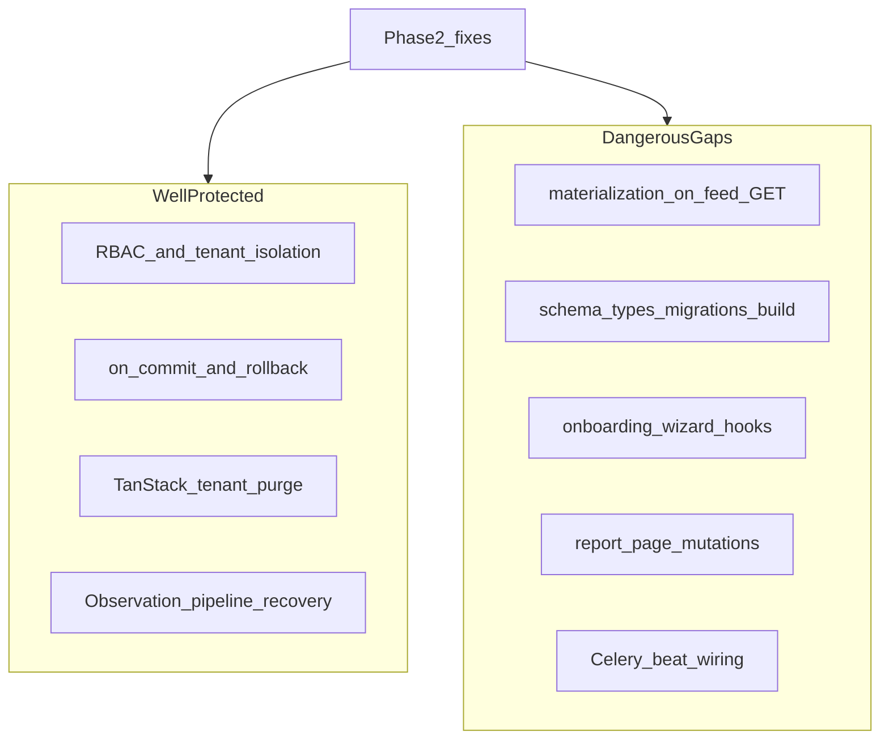

# Phase 2 — Test Strategy Audit

Status: audit report  
Date: 2026-06-26  
Mode: audit only — no source changes

## Sources

| Category | Files |
|----------|-------|
| Contract | [`AGENTS.md`](../AGENTS.md), [`apps/api/AGENTS.md`](../../apps/api/AGENTS.md), [`apps/web/AGENTS.md`](../../apps/web/AGENTS.md), [`.cursor/rules/`](../.cursor/rules/) |
| Testing conventions | [`docs/engineering/testing.md`](../engineering/testing.md) |
| CI / Make | [`.github/workflows/ci.yml`](../../.github/workflows/ci.yml), [`Makefile`](../../Makefile) |
| Phase 2 consolidations (risk context) | [`phase_2_api_openapi_consolidation.md`](./phase_2_api_openapi_consolidation.md), [`phase_2_celery_async_consolidation.md`](./phase_2_celery_async_consolidation.md), [`phase_2_database_orm_consolidation.md`](./phase_2_database_orm_consolidation.md), [`phase_2_realtime_event_driven_consolidation.md`](./phase_2_realtime_event_driven_consolidation.md), [`phase_2_tanstack_query_cache_consolidation.md`](./phase_2_tanstack_query_cache_consolidation.md), [`phase_2_frontend_architecture_consolidation.md`](./phase_2_frontend_architecture_consolidation.md), [`phase_2_pwa_mobile_first_consolidation.md`](./phase_2_pwa_mobile_first_consolidation.md), [`phase_2_ci_devex_docs_consolidation.md`](./phase_2_ci_devex_docs_consolidation.md) |

**Branch context:** Feature audits closed (`TODO_NOW = 0`). Eight Phase 2 domain audits consolidated. This audit maps Houston’s test posture to Phase 2 fix risks — what protects safe change today, what gaps are dangerous, and what tests are not worth adding yet. Prior consolidations are context, not a checklist.

---

## Files inspected

| Layer | Paths |
|-------|-------|
| Backend test layout | `apps/api/houston/<domain>/tests/` — 162 modules, ~1,419 `def test_*` functions across 14 apps |
| Backend conftest | `apps/api/houston/conftest.py`, per-app conftest in checklists, realtime, chat, actions, signals, establishments, notifications, comments |
| Shared backend harness | `apps/api/houston/testing/` — `factories.py`, `auth.py`, `taxonomy.py`, `pipeline.py`, `onboarding.py`, `query_baseline.py` |
| Frontend test layout | `apps/web/src/**/*.{test,spec}.{ts,tsx}` — 87 Vitest files (63 `.test.ts`, 24 `.test.tsx`) |
| Frontend harness | `apps/web/src/test-utils/` — `query-client.ts`, `websocket.ts`, `auth.tsx` |
| Pytest config | `pyproject.toml` — markers (`openai_smoke`, `openai_observation_smoke`, `slow`, `auth_throttle`) |
| CI | `.github/workflows/ci.yml` — `backend-tests`, `frontend-tests` jobs |
| Make targets | `make test`, `make backend-test`, `make backend-check`, `make web-test`, `make web-check`, `make verify` |

### Backend test volume by app (approximate)

| App | ~Tests | Notes |
|-----|--------|-------|
| establishments | 289 | RBAC, onboarding API, access, catalog |
| checklists | 259 | Materialization, permissions, scheduling |
| signals | 205 | Pipeline, feed, lifecycle |
| notifications | 111 | Producers, rollback, preferences |
| actions | 94 | Lifecycle, execution feed |
| realtime | 92 | Invalidation, rollback, WS consumer |
| chat | 81 | WS ticket, consumer, REST |
| accounts | 78 | Auth, throttling, bootstrap hints |
| comments | 55 | Tenant isolation, services |
| uploads | 43 | Validators, cleanup task |
| ai | 43 | Pipeline schema, provider |
| core | 36 | Events, observability, logging AST |
| observations | 31 | Submit, processing status |
| organizations | **2** | Model creation only |

## Tests inspected

| Area | Representative files |
|------|---------------------|
| RBAC / permissions | `establishments/tests/test_permissions.py`, `checklists/tests/test_permissions.py` (37 tests), `actions/tests/test_action_permissions.py` |
| Tenant isolation API | `signals/tests/test_signal_tenant_isolation_api.py`, `actions/tests/test_action_tenant_isolation_api.py`, `checklists/tests/test_tenant_isolation_api.py`, `comments/tests/test_tenant_isolation_api.py`, `establishments/tests/test_onboarding_tenant_isolation_api.py` |
| Post-commit + rollback | `realtime/tests/test_broadcast.py`, `observations/tests/test_submit_on_commit_enqueue.py`, `chat/tests/test_ws_notify_on_commit.py`, `notifications/tests/test_*_notification_producers.py` |
| Materialization | `checklists/tests/test_materialization_services.py`, `realtime/tests/test_checklist_materialization_invalidation.py` |
| Query-count baselines | `signals/tests/test_signal_feed_api.py`, `actions/tests/test_execution_feed_api.py`, `checklists/tests/test_assignment_api.py`, `checklists/tests/test_execution_feed_checklist.py`, `chat/tests/test_rest_api.py`, `ai/tests/test_observation_pipeline_input_queries.py` |
| Celery / async | `observations/tests/test_submit_on_commit_enqueue.py`, `signals/tests/test_observation_pipeline_recovery.py`, `checklists/tests/test_horizon_task.py`, `uploads/tests/test_cleanup.py`, `chat/tests/test_purge.py` |
| Realtime / WS | `realtime/tests/test_realtime_ws_consumer.py`, `chat/tests/test_ws_consumer.py`, `chat/tests/test_ws_hardening.py` |
| OpenAPI contract | `signals/tests/test_signal_api_contract.py` (sole dedicated contract module) |
| TanStack cache | `apps/web/src/lib/query-invalidation.test.ts`, `features/auth/api.test.ts`, `features/realtime/lib/apply-operational-invalidation.test.ts` |
| Mutation invalidation | `features/{actions,signals,checklists,comments,notifications}/hooks.mutations.test.ts` |
| Chat realtime | `features/chat/hooks/use-chat-websocket.test.ts`, `features/chat/components/chat-realtime-provider.test.tsx` |
| Onboarding frontend | `features/onboarding/lib/onboarding-route.test.ts`, `features/onboarding/lib/manual-v2-proposal.test.ts` only |
| Observations frontend | `features/observations/report-page-success.test.ts` (lib helpers), `processing-status-*.test.ts` |

## Docs / rules inspected

- [`AGENTS.md`](../AGENTS.md), [`apps/api/AGENTS.md`](../../apps/api/AGENTS.md), [`apps/web/AGENTS.md`](../../apps/web/AGENTS.md)
- [`docs/engineering/testing.md`](../engineering/testing.md) — philosophy, markers, CI vs local gates, voluntary debt
- `.cursor/rules/01-agent-guardrails.mdc`, `10-backend-django-drf.mdc`, `20-frontend-react-vite-ts.mdc`, `21-mobile-first-pwa.mdc`
- All eight Phase 2 consolidation reports listed above

## Assumptions / unknowns

- No runtime test execution in this audit (`make verify` not run).
- No browser E2E, mobile viewport, or physical device testing in the repo.
- No load benchmarks for materialization at high assignment counts.
- No live Redis channel layer + Celery worker + browser reconnect end-to-end proof.
- CI-E1 shared-dev mode-switch trap not live-reproduced.
- Onboarding wizard refresh divergence (dual step authority) severity unmeasured.
- Opt-in OpenAI golden corpus tests (`openai_smoke`, `slow` markers) excluded from default CI — regression risk if not run separately.

---

## 1. Summary

Houston’s tests are **behavior-heavy and security-conscious** in the operational core loop: RBAC, tenant isolation, lifecycle transitions, post-commit side effects, and realtime rollback. The strategy favors **service/API integration tests** over isolated unit tests, with a small shared factory layer (`houston/testing/`) and domain-specific conftest specialization.

Confidence to change code safely is:

| Area | Confidence | Rationale |
|------|------------|-----------|
| Auth / RBAC / tenant isolation | **High** | Dedicated permission modules + `test_*_tenant_isolation_api.py` across domains |
| Post-commit / rollback side effects | **High** | Explicit rollback pattern in realtime, notifications, observations, chat |
| TanStack tenant cache purge | **High** | `query-invalidation.test.ts`, `auth/api.test.ts`, operational invalidation matrix |
| Observation AI pipeline recovery | **High** | Retry, stuck/orphan sweeps, on_commit enqueue |
| Feed / materialization timing | **Moderate** | Idempotence tested; N-assignment scaling and WS-before-feed-GET untested |
| CI contract gates | **Low** | CI green ≠ `make verify` green |
| Onboarding wizard frontend | **Low** | 2 lib tests vs ~17 hooks; no page/wizard coverage |
| Observation report flow | **Low** | Lib helpers only; no page or mutation hook tests |
| PWA / offline / browser reconnect | **None** | Zero Vitest references to SW, offline, or `navigator.onLine` |

**Scale:** ~1,419 backend + 87 frontend Vitest files. Default CI runs `ruff` + `pytest` and `lint` + `vitest` + `typecheck` — **not** schema diff, migrations check, types regeneration, or frontend build.

| Priority | Count | Themes |
|----------|-------|--------|
| **P1** | 4 | Materialization scaling; CI contract gates; onboarding wizard; invalidation drift |
| **P2** | 5 | Report/mutations; Celery beat; query baselines; brittle fixtures; permission-denied guards |
| **P3** | 1 | PWA/offline (defer until product fixes) |

---

## 2. Findings

### TS-E1 — No regression guard for materialization-on-read + N-assignment query scaling

| Field | Detail |
|-------|--------|
| **ID** | TS-E1 |
| **Severity** | P1 |
| **Category** | tests / performance |
| **Evidence** | `checklists/tests/test_materialization_services.py` — idempotence and concurrent materialization (`test_materialize_is_idempotent`, concurrent race). `actions/tests/test_execution_feed_api.py` — `test_execution_feed_query_count_baseline_empty`, `test_execution_feed_query_count_with_three_actions` use single fixture shapes (empty feed, 3 actions) with ceiling ≤9 queries via `query_baseline.py`. No test with N≥20 visible assignments. No test proving `execution.created` WS fires before any user opens execution feed. Cross-audit: RT-E1, CA-E1, DB-01. |
| **Problem** | Phase 2’s highest cross-audit risk is materialization timing on execution-feed GET. Existing tests prove idempotence and small-fixture query ceilings but not scaling behavior or supervision freshness without feed access. |
| **Risk** | Refactoring materialization ownership (decouple from GET, enable beat-only path) can regress latency, query count, or WS timing without failing CI. |
| **Suggested direction** | Add N-assignment query-count baseline (e.g. N=20 visible assignments); add integration test asserting WS `execution.created` emission timing when beat materializes without prior feed GET. |
| **Size** | M |

---

### TS-E2 — CI green ≠ `make verify` green — contract gates ungated

| Field | Detail |
|-------|--------|
| **ID** | TS-E2 |
| **Severity** | P1 |
| **Category** | tests / API contract |
| **Evidence** | `.github/workflows/ci.yml` — `backend-tests` runs `ruff check` + `pytest` only; `frontend-tests` runs `lint` + `npm test` + `typecheck`. No `makemigrations --check`, `backend-schema-check`, `web-api-generate` diff, or `npm run build`. `docs/engineering/testing.md` L130–140 documents this gap explicitly. `make verify` = `backend-check` + `web-check` (schema, migrations, build). Cross-audit: API-O1, CI-E3, CI-E8. |
| **Problem** | OpenAPI/schema/types drift, broken migrations, and PWA build failures can merge with green CI while Phase 2 fixes touch API contracts and generated types. |
| **Risk** | Silent contract drift during RBAC refactors, invalidation key changes, or serializer updates; frontend compiles against stale types until a local `make verify` run. |
| **Suggested direction** | Extend CI with `backend-migrations-check`, `backend-schema-check`, generated `types.ts` diff, and `npm run build` smoke — not broad new behavioral tests, but gate fixes that tests assume. |
| **Size** | S |

---

### TS-E3 — Onboarding wizard/page orchestration untested — largest frontend risk hole

| Field | Detail |
|-------|--------|
| **ID** | TS-E3 |
| **Severity** | P1 |
| **Category** | tests / structure |
| **Evidence** | `apps/web/src/features/onboarding/hooks.ts` — ~17 exported hooks/mutations (session, proposals, activation, catalog seeding, director invite). Frontend tests: `onboarding-route.test.ts` (4 redirect cases), `manual-v2-proposal.test.ts` (draft/proposal pure logic) only. No tests import `onboarding-page.tsx`, `manual-onboarding-v2-wizard.tsx`, or wizard step components. Backend counterpart is strong: `establishments/tests/test_onboarding_api.py` (31 tests), `test_onboarding_tenant_isolation_api.py`, `test_onboarding_manual_v2.py`. Cross-audit: FE-E1. |
| **Problem** | Largest untested user journey sits entirely in React orchestration while backend API and tenant isolation are well covered. |
| **Risk** | Refactoring wizard step machine, activation flow, or mutation invalidation breaks onboarding without Vitest signal. |
| **Suggested direction** | jsdom tests: step transitions, activation mutation + cache invalidation, permission/error guards on wizard steps. Start with smoke, not full E2E. |
| **Size** | M |

---

### TS-E4 — Invalidation key / WS reason drift has no parity guard

| Field | Detail |
|-------|--------|
| **ID** | TS-E4 |
| **Severity** | P1 |
| **Category** | tests / maintainability |
| **Evidence** | `apps/web/src/lib/query-invalidation.ts` hardcodes key arrays; `query-invalidation.test.ts` asserts today’s literals match convention. `features/*/api.ts` exposes `*QueryKeys` factories not imported by invalidation helpers. `apply-operational-invalidation.test.ts` spies app singleton `@/lib/query-client`. No test comparing backend `reason` strings (realtime invalidation emitters) to frontend handler registry. Cross-audit: TQ-E1, TQ-E2, RT-E5. |
| **Problem** | Two sources of truth for query key shape and WS reason strings. Tests lock current literals rather than guarding factory/helper parity. |
| **Risk** | Refactoring keys or reasons during Phase 2 realtime/cache fixes causes silent stale UI — mutations succeed, mounted queries never invalidate. |
| **Suggested direction** | Parity test: import `*QueryKeys` factories and assert invalidation helper prefixes match; optional shared reason registry test (backend constants ↔ frontend `applyOperationalInvalidation` cases). |
| **Size** | S |

---

### TS-E5 — Observation report page + hooks have zero mutation/integration tests

| Field | Detail |
|-------|--------|
| **ID** | TS-E5 |
| **Severity** | P2 |
| **Category** | tests / structure |
| **Evidence** | `features/observations/hooks.ts` — 6 hooks including `useSubmitObservationMutation`, transcribe, processing-status polling. No `observations/hooks.mutations.test.ts`. `report-page-success.test.ts` describe block `'report-page success state'` tests lib helpers (`shouldShowSignalFeedNavigation`, `formatProcessingSuccessHeadline`) imported from report flow — not `pages/report-page.tsx`. No component test for submit, photo upload, or processing-status UX. Cross-audit: FE-E9, PWA-E6. |
| **Problem** | Core field workflow (observation submit → processing → success navigation) lacks page-level and mutation invalidation tests. |
| **Risk** | Report flow refactors (sticky footer, polling, submit error handling) regress without frontend test signal; backend `test_observation_api.py` does not cover UI wiring. |
| **Suggested direction** | `hooks.mutations.test.ts` for submit + invalidation scope; minimal page test for loading/error/success states and navigation after processing complete. |
| **Size** | M |

---

### TS-E6 — Celery beat schedule and broker integration untested

| Field | Detail |
|-------|--------|
| **ID** | TS-E6 |
| **Severity** | P2 |
| **Category** | tests / structure |
| **Evidence** | Zero test references to `CELERY_BEAT`, `beat_schedule`, or `CELERY_BEAT_SCHEDULE`. Horizon task tested via `checklists/tests/test_horizon_task.py` — `test_horizon_task_is_idempotent` calls `.run()` directly. Upload cleanup and chat purge similarly use `.run()`. Observation enqueue tested with `patch(...delay)` in `test_submit_on_commit_enqueue.py`. No `recover_observation_processing_batch` combined-wrapper test. Cross-audit: CA-E9, CA-E5. |
| **Problem** | Task business logic is tested in-process; scheduler wiring, beat failure logging parity (checklist/chat), and broker delivery are not. |
| **Risk** | Enabling beat in dev/prod or refactoring materialization to beat-only path breaks silently — tasks exist but never scheduled, or failure logs missing for beat tasks. |
| **Suggested direction** | Static assertion that expected task names appear in `CELERY_BEAT_SCHEDULE`; beat failure logging tests mirroring `uploads/tests/test_cleanup.py` pattern; defer full broker E2E. |
| **Size** | S |

---

### TS-E7 — Query-count baselines cover ~6 hot paths; detail/comments unpinned

| Field | Detail |
|-------|--------|
| **ID** | TS-E7 |
| **Severity** | P2 |
| **Category** | tests / performance |
| **Evidence** | `apps/api/houston/testing/query_baseline.py` — documented ceilings for signal feed, execution feed, checklist assignment list, chat conversations/messages, pipeline input build. Used in 6 test modules only. No baselines for: signal detail/commands, canceled signal detail, comments list, notifications list, mixed execution feed, N-assignment materialization path. `docs/engineering/testing.md` and consolidations note baselines deferred until materialization strategy stabilizes (EF-07 / DB-07). Cross-audit: DB-07, DB-10. |
| **Problem** | ORM prefetch fixes (ACT-01, CL-02) are protected on feed/list hot paths; detail endpoints and materialization-at-scale are not. |
| **Risk** | Phase 2 ORM fixes reintroduce N+1 on unpinned endpoints; materialization decouple changes query profile without regression signal. |
| **Suggested direction** | Expand baselines incrementally per touched endpoint during Phase 2 fixes; prioritize N-assignment execution feed (ties to TS-E1). |
| **Size** | M |

---

### TS-E8 — Brittle fixture duplication + implementation-detail tests

| Field | Detail |
|-------|--------|
| **ID** | TS-E8 |
| **Severity** | P2 |
| **Category** | tests / maintainability |
| **Evidence** | **Duplication:** `checklists/tests/conftest.py` and `realtime/tests/conftest.py` duplicate role/membership fixture graphs; `api_client` redefined in ~8 conftest files; `uploads/tests/test_temporary_upload_api.py` defines local `_login`/`_establishment` bypassing `houston.testing.auth`. **Brittle:** `signals/tests/test_import_graph.py` (`test_signal_stack_imports_without_cycle`); `checklists/tests/test_import_boundaries.py`; `core/tests/test_logging_no_direct_payload.py` (AST walk); golden pipeline tests (`test_pipeline_v4_golden.py`, `test_openai_observation_pipeline_v4_corpus_smoke.py`) excluded from default CI. **Frontend:** `createMockWebSocket` and `createAuthProviderMock` in `test-utils/` exported but unused; inline `vi.mock('@/app/auth-provider')` duplicated in ~13 page tests; French copy assertions in page tests. |
| **Problem** | Maintenance cost rises with Phase 2 touch surface; structure tests break on innocent refactors; duplicated setup drifts from shared helpers. |
| **Risk** | Engineers avoid updating tests or duplicate setup further; false failures on import moves; weak tests give illusion of coverage. |
| **Suggested direction** | Consolidate shared role fixtures when touching conftest; prefer behavior tests over import graphs; use `test-utils` harness consistently; delete or wire unused test-utils. |
| **Size** | M |

---

### TS-E9 — Frontend permission-denied deep links and long-tail mutations mostly untested

| Field | Detail |
|-------|--------|
| **ID** | TS-E9 |
| **Severity** | P2 |
| **Category** | tests / structure |
| **Evidence** | `checklists/pages/checklist-create-page.test.tsx` — happy-path form only; no `can_create_checklist=false` case. `actions/pages/action-create-page.test.tsx` sets `can_create_action: true` only. `checklists/hooks.mutations.test.ts` covers 2 of ~15 checklist mutations; `actions/hooks.mutations.test.ts` covers 2 of ~8; `signals/hooks.mutations.test.ts` covers 1 of ~5. `invitations/` feature has zero test files. `auth/pages/team-page.test.tsx` exists but no management-gate denial test. Cross-audit: FE-E3, FE-E4, FE-E8. |
| **Problem** | Permission hints and bootstrap-driven guards are tested in lib (`bootstrap-permission-hints.test.ts`, `execution-create-menu.test.ts`) but not at page/deep-link level for denied access. Most mutation hooks lack invalidation scope tests. |
| **Risk** | Routing/guard refactors expose create flows to unauthorized staff; mutation invalidation regressions on unchecked hooks. |
| **Suggested direction** | Add denied-case page tests for `/checklists/new`, `/actions/new`, `/team`; extend mutation test pattern to hooks touched by Phase 2 fixes only. |
| **Size** | S |

---

### TS-E10 — PWA/offline/reconnect-at-browser-layer zero coverage

| Field | Detail |
|-------|--------|
| **ID** | TS-E10 |
| **Severity** | P3 |
| **Category** | tests / ambiguity |
| **Evidence** | Grep across `*.test.*`: zero references to `serviceWorker`, `navigator.onLine`, offline banner, or PWA manifest. PWA configured in `vite.config.ts` (`VitePWA`); CI does not run `npm run build`. WS reconnect tested at hook level (`use-chat-websocket.test.ts`, `applyOperationalReconnectInvalidation`) — not browser network/offline layer. Cross-audit: PWA-E1, PWA-E6, PWA-E5. |
| **Problem** | Product gaps (offline UX, Profile establishment switch, sticky report submit) have no regression tests. |
| **Risk** | Low for Phase 2 code fixes unless explicitly touching PWA layer; becomes relevant after product implements offline/network UX. |
| **Suggested direction** | **Defer** behavioral PWA tests until PWA-E1 product fix lands; then add build smoke in CI and minimal offline-state component tests. |
| **Size** | L (when product-ready) |

---

## 3. What is already well protected

Evidence-backed areas where Phase 2 fixes can proceed with existing regression safety:

- **REST tenant isolation → 404** — dedicated modules: `test_signal_tenant_isolation_api.py`, `test_action_tenant_isolation_api.py`, `test_tenant_isolation_api.py` (checklists), `test_tenant_isolation_api.py` (comments), `test_onboarding_tenant_isolation_api.py`
- **RBAC permission matrices** — `establishments/tests/test_permissions.py` (16 tests, inactive/deactivated cases); `checklists/tests/test_permissions.py` (37 tests); `signals/tests/test_permissions.py`, `actions/tests/test_action_permissions.py`, `chat/tests/test_permissions.py`
- **Access context / session** — `establishments/tests/test_access.py` (16 tests for onboarding/operational access states)
- **Post-commit scheduling + rollback** — `realtime/tests/test_broadcast.py` (`test_invalidation_not_emitted_on_transaction_rollback`); `observations/tests/test_submit_on_commit_enqueue.py` (`test_submit_does_not_enqueue_on_transaction_rollback`); notification producer rollback tests (`test_business_rollback_creates_zero_notifications`); `chat/tests/test_ws_notify_on_commit.py`
- **Realtime invalidation + payload safety** — `realtime/tests/test_action_invalidation.py` (ACT-04 dual emission); `test_checklist_invalidation.py`, `test_comment_invalidation.py`; parametrized payload tests in `test_broadcast.py`
- **Observation AI pipeline** — `signals/tests/test_observation_pipeline_recovery.py` (retry after provider unavailable, stuck/orphan recovery); `test_pipeline_validation.py`; concurrency test in `test_observation_pipeline_aggregation_concurrency.py`
- **Checklist materialization idempotence** — `checklists/tests/test_materialization_services.py`; concurrent materialization; `realtime/tests/test_checklist_materialization_invalidation.py`
- **TanStack tenant purge contract** — `query-invalidation.test.ts` (`purgeNonAuthQueries`, cancelled in-flight); `auth/api.test.ts` (establishment switch purge, logout clear); `auth-provider.test.tsx`
- **Realtime invalidation matrix** — `apply-operational-invalidation.test.ts` (parametrized event → query key mapping; reconnect sweep)
- **Chat WebSocket hook** — `use-chat-websocket.test.ts` (ticket auth, access.revoked vs reconnect, enabled toggle)
- **Checklist domain depth** — ~259 backend + 18 frontend Vitest files (validation, permission hints, payloads, execution detail page)
- **Auth throttling** — `@pytest.mark.auth_throttle` opt-out pattern; `accounts/tests/test_auth_throttling_api.py`
- **Onboarding API (backend)** — `test_onboarding_api.py`, `test_onboarding_manual_v2.py`, tenant isolation
- **Security hygiene** — root `conftest.py` blocks live OpenAI; `core/tests/test_logging_no_direct_payload.py` guards unsafe logger usage

---

## 4. Dangerous test gaps

Prioritized gaps that leave Phase 2 fixes under-protected — ordered by fix-blocking risk:

1. **Materialization timing on execution-feed GET** (RT-E1, CA-E1, DB-01) — no N-assignment scaling test; no WS-before-feed-GET proof; beat-off dev default untested end-to-end
2. **CI contract gates** (API-O1, CI-E3, CI-E8) — schema, migrations, generated types, build not in CI
3. **Onboarding wizard frontend** (FE-E1) — largest untested user journey despite strong backend API coverage
4. **Query invalidation parity** (TQ-E1, TQ-E2, RT-E5) — silent stale UI risk during cache/realtime refactors
5. **LLM retry divergent aggregation key** (CA-E2) — same-output retry tested; divergent key path absent in `test_observation_pipeline_recovery.py`
6. **Observation report flow** (FE-E9) — submit/mutation/polling untested on frontend
7. **Permission-denied deep links** (FE-E3, FE-E4) — create pages test happy path only
8. **Celery beat wiring** (CA-E9) — schedule keys and beat failure logging parity untested
9. **Query baselines on unpinned endpoints** (DB-07) — signal detail, comments, notifications, mixed feed
10. **End-to-end broker → Channels → browser** — all materialization/realtime tests patch `notify_*` in-process

---

## 5. Brittle or duplicated patterns

Patterns that increase maintenance cost without proportional confidence:

| Pattern | Evidence | Why brittle |
|---------|----------|-------------|
| Duplicate role fixtures | `checklists/tests/conftest.py` ↔ `realtime/tests/conftest.py` | Drift when membership model changes |
| Local auth bypass | `uploads/tests/test_temporary_upload_api.py` | Diverges from `houston.testing.auth` |
| `api_client` redefinition | ~8 conftest files | Inconsistent client config |
| Import-graph / AST tests | `test_import_graph.py`, `test_import_boundaries.py`, `test_logging_no_direct_payload.py` | Fail on innocent moves/refactors |
| Hard-coded query ceilings | `query_baseline.py` dated comments + integers | Break on serializer/ORM changes |
| Golden pipeline corpus | `openai_smoke` / `slow` excluded from CI | Regressions only if opt-in job runs |
| Inline auth mocks | ~13 frontend page tests duplicate `vi.mock('@/app/auth-provider')` | `createAuthProviderMock` unused |
| Singleton queryClient spies | `apply-operational-invalidation.test.ts`, `auth/api.test.ts` | Order-dependent if restore missed |
| `renderToStaticMarkup` “integration” | chat/realtime provider tests | Skips effect lifecycles; WS validated via callbacks only |
| French copy assertions | `team-page.test.tsx`, checklist placeholders | Break on i18n/copy edits |
| Unused test-utils | `test-utils/websocket.ts`, `test-utils/auth.tsx` | Dead code; parallel MockWebSocket in chat hook test |

`docs/engineering/testing.md` explicitly documents voluntary debt for `organizations` (2 tests) and `provisioning` (none) — acceptable at current product risk.

---

## 6. Tests to add before Phase 2 fixes

Behavior-focused tests to add **before** touching the corresponding Phase 2 finding — not an implementation plan:

| Before fixing | Add (behavior-focused) | Protects | Size |
|---------------|------------------------|----------|------|
| Materialization decouple (CA-E1, RT-E1) | N-assignment query-count baseline; WS `execution.created` without prior feed GET | TS-E1 | M |
| OpenAPI/schema CI gap (API-O1) | CI: `backend-schema-check` + `web-api-generate` diff | TS-E2 | S |
| Onboarding wizard refactor (FE-E1) | jsdom: step transitions, activation invalidation, error guards | TS-E3 | M |
| Invalidation key refactor (TQ-E1) | Factory ↔ helper parity test | TS-E4 | S |
| Checklist create guard (FE-E3) | Page test: `can_create_checklist=false` → deny/redirect | TS-E9 | S |
| Execution feed ORM (DB-01) | Baseline with many visible assignments (e.g. N=20) | TS-E1, TS-E7 | M |
| LLM retry policy (CA-E2) | Service test: divergent aggregation key on retry | CA-E2 | S |
| Beat enablement (CA-E4) | Static `CELERY_BEAT_SCHEDULE` key assertion | TS-E6 | S |
| Report flow (FE-E9) | Submit mutation invalidation + minimal page smoke | TS-E5 | M |

**Regression tests already sufficient for these Phase 2 areas (fix without new tests first):**

- REST tenant isolation refactors — existing `test_*_tenant_isolation_api.py` suite
- Realtime rollback guards — existing `test_*_invalidation.py` rollback pattern
- TanStack establishment-switch purge — `query-invalidation.test.ts`
- Checklist materialization idempotence — `test_materialization_services.py`
- ACT-04 dual emission — `test_action_invalidation.py`

---

## 7. Tests to defer

Explicitly **not worth adding now** — per `testing.md` voluntary debt, product gates, or architecture-pending decisions:

| Defer | Reason |
|-------|--------|
| Migration forward/back tests | `makemigrations --check` sufficient at dev phase; no data-migration complexity yet |
| Full Celery broker E2E | Beat ownership decision pending (CA-E4); `.run()` covers business logic today |
| Outbox / Redis blip recovery | Product-gated D-04B; NR-05 logging already FIXED |
| PWA/offline/service worker tests | Product gap (PWA-E1) not implemented; add after fix + CI build smoke |
| Browser E2E / viewport / device | No Playwright; wizard refresh divergence (FE-E2) needs E2E when product prioritizes |
| Comment parent-feed staleness | Intentional MVP (D-02 / RT-E7); test only if product changes scope |
| `organizations` app coverage | Documented minimal — 2 model tests |
| `provisioning` | No product risk defined |
| OpenAPI contract for all ~102 paths | Add per touched endpoint; sole contract module today is `test_signal_api_contract.py` |
| Live OpenAI golden corpus in default CI | Keep opt-in (`openai_smoke`, `slow`); optional scheduled job |
| Query baselines for all endpoints | Expand incrementally with fixes (DB-07); not a pre-fix blanket |
| WS 403 vs REST 404 cross-transport parity | Tested per transport; parity test low value (API-O9 P3) |
| Operational WS hook direct tests | Mocked in provider test; defer until hook refactor |
| Long-tail mutation tests for untouched hooks | Add only when Phase 2 fix touches that mutation |
| Terrain ErrorBoundary | No boundary exists yet (PWA-E7) |

---

## 8. Top priorities

### Do first (before Phase 2 fix work)

1. **N-assignment materialization regression test** — protects highest cross-audit P1 (RT-E1 + DB-01 + CA-E1)
2. **CI contract gates** (schema, migrations, types diff, build) — prevents silent drift while fixing API/cache
3. **Onboarding wizard smoke tests** — largest untested user journey
4. **Invalidation parity guard** — cheap; prevents silent stale UI during realtime refactors
5. **Permission-denied page guards** — fast frontend tests before routing/guard fixes

### Quick wins

- Checklist-create denied case (`can_create_checklist=false`)
- Factory ↔ invalidation helper parity test
- CI `backend-schema-check` job step
- Static `CELERY_BEAT_SCHEDULE` task-name assertion
- Wire or delete unused `test-utils/websocket.ts` and `auth.tsx`

### Structural (plan later)

- Shared fixture consolidation (checklists/realtime conftest merge)
- Query baseline expansion per touched endpoint
- Mutation test harness for remaining hooks (incremental, not blanket)
- Optional slow-marker query baseline job in CI after materialization strategy stabilizes
- Opt-in OpenAI golden corpus scheduled run

### Things not worth fixing now

- Import-graph tests (keep if valuable, don’t expand)
- Full broker → browser E2E harness
- PWA/offline until product implements UX
- organizations/provisioning coverage
- Broad OpenAPI contract sweep

---

## Changed / Validated / Risks

| | |
|---|---|
| **Changed** | New audit report: `docs/audits/phase_2_test_strategy_audit.md` |
| **Validated** | Read-only inspection of backend (~1,419) and frontend (87) test files; CI workflow; Makefile targets; `testing.md`; eight Phase 2 consolidation reports; grep evidence for beat/migration/PWA gaps |
| **Risks / not verified** | No `make verify` or test suite execution in this audit; no load benchmarks; CI-E1 mode-switch trap not reproduced; no browser/E2E; opt-in smoke tests may drift undetected if not run separately; query baseline integers may be stale vs current ORM |
