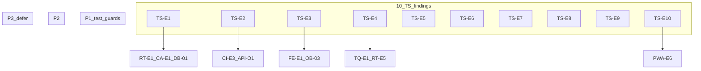
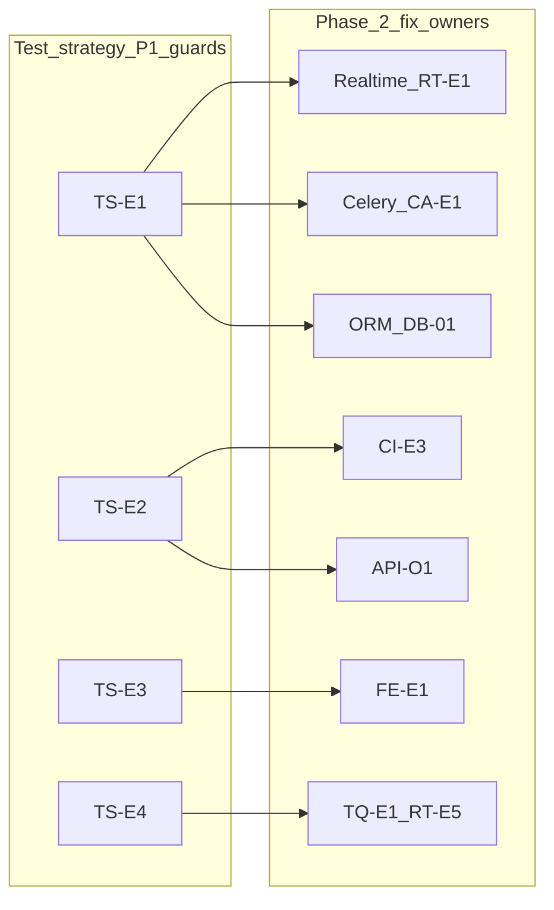

# Phase 2 — Test Strategy Consolidation

Status: consolidation report  
Date: 2026-06-26  
Mode: consolidation only — no source changes

## Sources

| Category | Files |
|----------|-------|
| Audit input | [`phase_2_test_strategy_audit.md`](./phase_2_test_strategy_audit.md) (TS-E1–TS-E10) |
| Backlog | [`phase_2_audit_backlog.md`](./phase_2_audit_backlog.md) §4 (EF-07), §6 (OB-03, FE-02/03/04, OR-09), §7 (PWA transversal), §8 (R10) |
| Closure | [`feature_audit_closure.md`](./feature_audit_closure.md) |
| Decisions | [`feature_audit_decisions.md`](./feature_audit_decisions.md) |
| Cross-audit | [`phase_2_api_openapi_consolidation.md`](./phase_2_api_openapi_consolidation.md) (API-O1), [`phase_2_database_orm_consolidation.md`](./phase_2_database_orm_consolidation.md) (DB-01, DB-07), [`phase_2_realtime_event_driven_consolidation.md`](./phase_2_realtime_event_driven_consolidation.md) (RT-E1, RT-E5), [`phase_2_celery_async_consolidation.md`](./phase_2_celery_async_consolidation.md) (CA-E1, CA-E4, CA-E9), [`phase_2_tanstack_query_cache_consolidation.md`](./phase_2_tanstack_query_cache_consolidation.md) (TQ-E1, TQ-E2, TQ-E10), [`phase_2_frontend_architecture_consolidation.md`](./phase_2_frontend_architecture_consolidation.md) (FE-E1, FE-E9), [`phase_2_pwa_mobile_first_consolidation.md`](./phase_2_pwa_mobile_first_consolidation.md) (PWA-E6), [`phase_2_ci_devex_docs_consolidation.md`](./phase_2_ci_devex_docs_consolidation.md) (CI-E3, CI-E8) |
| Contract | [`AGENTS.md`](../../AGENTS.md), [`apps/api/AGENTS.md`](../../apps/api/AGENTS.md), [`apps/web/AGENTS.md`](../../apps/web/AGENTS.md) |
| Testing spine | [`docs/engineering/testing.md`](../engineering/testing.md), [`.github/workflows/ci.yml`](../../.github/workflows/ci.yml), [`Makefile`](../../Makefile) |

**Branch context:** Feature audits closed (`TODO_NOW = 0`). All eight prior Phase 2 domain audits consolidated. This is the **final transversal audit** — it challenges each finding from the test strategy audit against backlog aliases, closure registry, sibling consolidations, and spot-check code evidence. It does **not** re-own architecture gaps; it specifies **which regression guards to add before touching sibling fixes**, and what is already safe to change without new tests. No `FIXED`, `WONT_FIX_NOW`, or `DECISION_CLOSED` items reopened without new direct code evidence.

---

## 1. Executive summary

Houston’s test posture is **behavior-heavy and security-conscious** in the operational core loop (~1,419 backend `test_*` functions across 14 apps; 87 Vitest files). The strategy favors service/API integration tests over isolated unit tests, with a shared factory layer (`houston/testing/`) and domain-specific conftest specialization.

**Confidence to change code safely today:**

| Area | Confidence | Rationale |
|------|------------|-----------|
| Auth / RBAC / tenant isolation | **High** | Dedicated permission modules + `test_*_tenant_isolation_api.py` across domains |
| Post-commit / rollback side effects | **High** | Explicit rollback pattern in realtime, notifications, observations, chat |
| TanStack tenant cache purge | **High** | `query-invalidation.test.ts`, `auth/api.test.ts`, operational invalidation matrix |
| Observation AI pipeline recovery | **High** | Retry, stuck/orphan sweeps, on_commit enqueue |
| Feed / materialization timing | **Moderate** | Idempotence tested; N-assignment scaling and WS-before-feed-GET untested |
| CI contract gates | **Low** | CI green ≠ `make verify` green |
| Onboarding wizard frontend | **Low** | 2 lib tests vs ~17 hooks; no page/wizard coverage |
| Observation report flow | **Low** | Lib helpers only; no page or mutation hook tests |
| PWA / offline / browser reconnect | **None** | Zero Vitest references to SW, offline, or `navigator.onLine` |

**Consolidation verdict:** 10 audit findings reviewed → **10 evidence-backed confirmations**, **0 false positives**, **8 findings carry duplicate slices** to sibling audits, **2 deferred slices** (TS-E7 blanket expansion timing; TS-E10 PWA behavioral tests), **0 FIXED/WONT_FIX_NOW/DECISION_CLOSED items reopened**.

| Priority | Count | Themes |
|----------|-------|--------|
| **P1** | 4 | Materialization scaling guard; CI contract gates; onboarding wizard smoke; invalidation parity guard |
| **P2** | 5 | Report/mutations; Celery beat wiring; query baselines (incremental); fixture hygiene; permission-denied pages |
| **P3** | 1 | PWA/offline tests (defer until PWA-E1 network/offline UX exists) |

**Unique value of this consolidation:** Test Strategy is the transversal lens — it maps Phase 2 fix risks to **existing regression safety** and **missing guards**, not a second architecture backlog.

---

## 2. Findings reviewed

All 10 findings from [`phase_2_test_strategy_audit.md`](./phase_2_test_strategy_audit.md) §2, cross-checked against [`phase_2_audit_backlog.md`](./phase_2_audit_backlog.md), [`feature_audit_closure.md`](./feature_audit_closure.md), sibling phase 2 consolidations, and spot-check code evidence.

| ID | Audit sev | Reclassification | Backlog / sibling alias | Consolidation notes |
|----|-----------|------------------|-------------------------|---------------------|
| **TS-E1** | P1 | **CONFIRMED** + **DUPLICATE** | RT-E1, CA-E1, DB-01, DB-07, EF-07 | Code-verified: [`test_materialization_services.py`](../../apps/api/houston/checklists/tests/test_materialization_services.py) — idempotence and concurrent races only. [`test_execution_feed_api.py`](../../apps/api/houston/actions/tests/test_execution_feed_api.py) — query baselines for empty feed and 3 actions only; no N≥20 visible assignments. No test proving `execution.created` WS fires when beat materializes without prior feed GET. **Unique test-strategy slice:** N-assignment baseline + WS timing guard before materialization decouple. |
| **TS-E2** | P1 | **CONFIRMED** + **DUPLICATE** | CI-E3, API-O1, PWA-E5, CI-E8 | Code-verified: [`.github/workflows/ci.yml`](../../.github/workflows/ci.yml) — backend ruff + pytest; frontend lint + test + typecheck; **no** migrations check, schema diff, `web-api-generate` diff, or `npm run build`. [`testing.md`](../engineering/testing.md) L130–140 documents gap. **Unique slice:** frame as regression-safety gate for Phase 2 API/cache work — not broad new behavioral tests. |
| **TS-E3** | P1 | **CONFIRMED** + **DUPLICATE** | OB-03, FE-E1 | Code-verified: zero Vitest imports of `onboarding-page` or `manual-onboarding-v2-wizard`; only [`onboarding-route.test.ts`](../../apps/web/src/features/onboarding/lib/onboarding-route.test.ts) and [`manual-v2-proposal.test.ts`](../../apps/web/src/features/onboarding/lib/manual-v2-proposal.test.ts). No `hooks.mutations.test.ts` under onboarding. Backend strong: `test_onboarding_api.py` (31 tests), tenant isolation. **Co-primary with FE-E1** on *what* to test before wizard refactors. |
| **TS-E4** | P1 | **CONFIRMED** + **DUPLICATE** | TQ-E1, TQ-E2, RT-E5, NR-09 | Code-verified: [`query-invalidation.ts`](../../apps/web/src/lib/query-invalidation.ts) hardcodes key arrays; [`query-invalidation.test.ts`](../../apps/web/src/lib/query-invalidation.test.ts) asserts today’s literals — no factory parity. `features/*/api.ts` `*QueryKeys` factories not imported by invalidation helpers. No backend `reason` ↔ frontend handler registry test. **Unique slice:** cheap parity guard before cache/realtime refactors (architecture fix remains TQ/RT P2). |
| **TS-E5** | P2 | **CONFIRMED** + **DUPLICATE** | OR-09, FE-E9, PWA-E6 slice | Code-verified: no `observations/hooks.mutations.test.ts`; [`report-page-success.test.ts`](../../apps/web/src/features/observations/report-page-success.test.ts) tests lib helpers only, not `report-page.tsx`. Backend `test_observation_api.py` does not cover UI wiring. **Unique slice:** submit mutation invalidation + minimal page smoke before report flow refactors. |
| **TS-E6** | P2 | **CONFIRMED** + **DUPLICATE** | CA-E9, CA-E4 | Code-verified: zero test references to `CELERY_BEAT_SCHEDULE` in repo tests (grep). Horizon/cleanup/purge tested via `.run()`; observation enqueue via `patch(...delay)`. No `recover_observation_processing_batch` wrapper test. **Unique slice:** static beat schedule assertion + failure-logging parity mirroring uploads cleanup pattern. |
| **TS-E7** | P2 | **CONFIRMED** + **DUPLICATE** + **DEFER_PHASE_2** (expansion timing) | DB-07, EF-07 | Code-verified: [`query_baseline.py`](../../apps/api/houston/testing/query_baseline.py) used in 6 modules; gaps on signal detail, comments, notifications, mixed feed, N-assignment path. Backlog: establish full matrix **after** materialization strategy to avoid false positives. **Unique slice:** add baselines incrementally per touched endpoint during Phase 2 fixes. |
| **TS-E8** | P2 | **CONFIRMED** | partial CI/DevEx import-graph echo | Code-verified: duplicate role fixtures in `checklists/tests/conftest.py` ↔ `realtime/tests/conftest.py`; `api_client` redefined in ~8 conftest files; local auth bypass in `uploads/tests/test_temporary_upload_api.py`. Import-graph/AST tests (`test_import_graph.py`, `test_logging_no_direct_payload.py`). Frontend: `createMockWebSocket` / `createAuthProviderMock` exported from [`test-utils/`](../../apps/web/src/test-utils/) but unused; inline `vi.mock('@/app/auth-provider')` in ~13 page tests. **Unique hygiene slice** — maintenance cost, not fix-blocking. |
| **TS-E9** | P2 | **CONFIRMED** + **DUPLICATE** | FE-E2, FE-E3, FE-E4 | Code-verified: [`checklist-create-page.test.tsx`](../../apps/web/src/features/checklists/pages/checklist-create-page.test.tsx) — happy-path manager mock only; no `can_create_checklist=false`. `actions/pages/action-create-page.test.tsx` sets `can_create_action: true` only. Mutation tests cover 2/~15 checklist and 2/~8 action hooks; `invitations/` has zero test files. **Unique slice:** denied-case page tests before routing/guard fixes. |
| **TS-E10** | P3 | **CONFIRMED** + **DUPLICATE** + **DEFER_PHASE_2** | PWA-E6, OR-09 slice | Code-verified: zero Vitest references to `serviceWorker`, `navigator.onLine`, offline banner, or PWA manifest. WS reconnect tested at hook level only. CI does not run `npm run build`. **Defer** PWA/offline/service worker behavioral tests until PWA-E1 network/offline UX exists. |

**Ancillary rows (audit §4 dangerous gaps, not formal TS IDs):**

| Topic | Disposition | Notes |
|-------|-------------|-------|
| CA-E2 / C-03 divergent LLM retry | **DUPLICATE** | Celery consolidation owner; add service test when fixing C-03 retry policy |
| Broker → Channels → browser E2E | **IGNORE_NOW** | Mock-heavy in-process tests acceptable at dev phase per audit §7 |
| Comment parent-feed staleness (NR-06 / D-02) | **PRODUCT_DECISION** | Intentional MVP; test only if product extends invalidation matrix |
| `organizations` (2 tests) / `provisioning` (0) | **IGNORE_NOW** | Documented voluntary debt in `testing.md` |
| LLM golden corpus (`openai_smoke`, `slow`) | **IGNORE_NOW** in default CI | Keep opt-in; optional scheduled job |

**Items explicitly not reopened:** all `FIXED`, `WONT_FIX_NOW`, `DECISION_CLOSED` from [`feature_audit_closure.md`](./feature_audit_closure.md) — including tenant isolation suites (TEST-01, ACT-07, OB-02), rollback guards (NR-05), materialization idempotence, ACT-04 dual emission, dual poll+WS (WONT_FIX_NOW echo).

---

## 3. Confirmed findings

### TS-E1 — No regression guard for materialization-on-read + N-assignment query scaling

| Field | Detail |
|-------|--------|
| **Severity** | P1 |
| **Evidence** | [`checklists/tests/test_materialization_services.py`](../../apps/api/houston/checklists/tests/test_materialization_services.py) — idempotence and concurrent materialization. [`actions/tests/test_execution_feed_api.py`](../../apps/api/houston/actions/tests/test_execution_feed_api.py) — `test_execution_feed_query_count_baseline_empty`, `test_execution_feed_query_count_with_three_actions` only. [`testing/query_baseline.py`](../../apps/api/houston/testing/query_baseline.py) ceilings for small fixtures. Cross-audit: RT-E1, CA-E1, DB-01, DB-07. |
| **Why confirmed** | Phase 2’s highest cross-audit risk is materialization timing on execution-feed GET. Tests prove idempotence and small-fixture query ceilings but not scaling behavior or supervision freshness without feed access. Not theoretical — read-path writes are production code path today. |
| **Risk** | Refactoring materialization ownership (decouple from GET, enable beat-only path) can regress latency, query count, or WS timing without failing CI. |
| **Suggested direction** | Add N-assignment query-count baseline (e.g. N=20 visible assignments). Add integration test asserting WS `execution.created` emission when beat materializes without prior feed GET. **Add before** RT-E1/CA-E1 decouple work — not after. |
| **Dependencies** | Realtime RT-E1; Celery CA-E1; ORM DB-01/DB-07; EF-07 baseline timing |
| **Size** | M |

---

### TS-E2 — CI green ≠ `make verify` green — contract gates ungated

| Field | Detail |
|-------|--------|
| **Severity** | P1 |
| **Evidence** | [`.github/workflows/ci.yml`](../../.github/workflows/ci.yml) — `backend-tests`: ruff + pytest; `frontend-tests`: lint + test + typecheck. No `makemigrations --check`, `backend-schema-check`, `web-api-generate` diff, or `npm run build`. [`testing.md`](../engineering/testing.md) L130–140. [`Makefile`](../../Makefile) `backend-check` + `web-check` = `verify`. Cross-audit: CI-E3, API-O1, PWA-E5, CI-E8. |
| **Why confirmed** | OpenAPI/schema/types drift, broken migrations, and PWA build failures can merge with green CI while Phase 2 fixes touch API contracts and generated types. Documented gap — not aspirational. |
| **Risk** | Silent contract drift during RBAC refactors, invalidation key changes, or serializer updates; frontend compiles against stale types until local `make verify`. |
| **Suggested direction** | Extend CI with `backend-migrations-check`, `backend-schema-check`, generated `types.ts` diff, and `npm run build` smoke — coordinate with CI-E3 (owner). Test strategy frames *why* Phase 2 work needs these gates, not new behavioral test suites. |
| **Dependencies** | CI-E3, API-O1, PWA-E5, CI-E8 |
| **Size** | M (S/M if gates are added separately vs one unified CI contract job) |

---

### TS-E3 — Onboarding wizard/page orchestration untested

| Field | Detail |
|-------|--------|
| **Severity** | P1 |
| **Evidence** | [`features/onboarding/hooks.ts`](../../apps/web/src/features/onboarding/hooks.ts) — ~17 exported hooks/mutations. Frontend tests: `onboarding-route.test.ts` (4 redirect cases), `manual-v2-proposal.test.ts` (draft/proposal logic) only. No tests import wizard page or step components. Backend: `establishments/tests/test_onboarding_api.py` (31 tests), tenant isolation, manual v2. Cross-audit: FE-E1, OB-03. |
| **Why confirmed** | Largest untested user journey sits entirely in React orchestration while backend API and tenant isolation are well covered. Gap is structural, not hypothetical. |
| **Risk** | Refactoring wizard step machine, activation flow, or mutation invalidation breaks onboarding without Vitest signal. |
| **Suggested direction** | jsdom smoke tests: step transitions, activation mutation + cache invalidation, permission/error guards on wizard steps. Start with smoke, not full E2E. **Add before** FE-E1/OB-07 refactors. |
| **Dependencies** | FE-E1, OB-03, OB-07 (dual step authority); PWA §7 mobile states on wizard |
| **Size** | M |

---

### TS-E4 — Invalidation key / WS reason drift has no parity guard

| Field | Detail |
|-------|--------|
| **Severity** | P1 |
| **Evidence** | [`query-invalidation.ts`](../../apps/web/src/lib/query-invalidation.ts) hardcodes key arrays; [`query-invalidation.test.ts`](../../apps/web/src/lib/query-invalidation.test.ts) locks current literals. `features/*/api.ts` `*QueryKeys` factories not imported by invalidation helpers. [`apply-operational-invalidation.test.ts`](../../apps/web/src/features/realtime/lib/apply-operational-invalidation.test.ts) parametrizes event → key mapping but no backend `reason` registry parity. Cross-audit: TQ-E1, TQ-E2, RT-E5, NR-09. |
| **Why confirmed** | Two sources of truth for query key shape and WS reason strings. Tests lock literals rather than guarding factory/helper parity. Real risk on any Phase 2 cache/realtime refactor. |
| **Risk** | Refactoring keys or reasons causes silent stale UI — mutations succeed, mounted queries never invalidate. |
| **Suggested direction** | Parity test: import `*QueryKeys` factories and assert invalidation helper prefixes match. Optional shared reason registry test (backend constants ↔ frontend `applyOperationalInvalidation` cases). **Add before** TQ-E1/RT-E5 refactors. Architecture consolidation remains sibling-owned. |
| **Dependencies** | TQ-E1, TQ-E2, RT-E5, NR-09 |
| **Size** | S |

---

### TS-E5 — Observation report page + hooks have zero mutation/integration tests

| Field | Detail |
|-------|--------|
| **Severity** | P2 |
| **Evidence** | [`features/observations/hooks.ts`](../../apps/web/src/features/observations/hooks.ts) — 6 hooks including `useSubmitObservationMutation`, transcribe, processing-status polling. No `observations/hooks.mutations.test.ts`. `report-page-success.test.ts` tests lib helpers only. No component test for submit, photo upload, or processing-status UX. Cross-audit: FE-E9, OR-09, PWA-E6 slice. |
| **Why confirmed** | Core field workflow (observation submit → processing → success navigation) lacks page-level and mutation invalidation tests. Backend API path covered; UI wiring is not. |
| **Risk** | Report flow refactors (sticky footer, polling, submit error handling) regress without frontend test signal. |
| **Suggested direction** | `hooks.mutations.test.ts` for submit + invalidation scope; minimal page test for loading/error/success states and navigation after processing complete. Add when touching FE-E9/OR-09 or PWA-E8 layout. |
| **Dependencies** | FE-E9, OR-09; PWA-E6/E8 for mobile layout targets |
| **Size** | M |

---

### TS-E6 — Celery beat schedule and broker integration untested

| Field | Detail |
|-------|--------|
| **Severity** | P2 |
| **Evidence** | Zero test references to `CELERY_BEAT_SCHEDULE` in application tests. [`test_horizon_task.py`](../../apps/api/houston/checklists/tests/test_horizon_task.py) calls `.run()` directly. Upload cleanup and chat purge similarly. [`test_submit_on_commit_enqueue.py`](../../apps/api/houston/observations/tests/test_submit_on_commit_enqueue.py) patches `.delay`. Cross-audit: CA-E9, CA-E4, CA-E5. |
| **Why confirmed** | Task business logic is tested in-process; scheduler wiring, beat failure logging parity, and broker delivery are not. Enabling beat or refactoring to beat-only materialization can break silently. |
| **Risk** | Tasks exist but never scheduled, or beat failure logs missing for beat tasks — discovered only in pilot ops. |
| **Suggested direction** | Static assertion that expected task names appear in `CELERY_BEAT_SCHEDULE`. Beat failure logging tests mirroring [`uploads/tests/test_cleanup.py`](../../apps/api/houston/uploads/tests/test_cleanup.py) pattern. Defer full broker E2E. |
| **Dependencies** | CA-E9, CA-E4; coordinate with DB-07 baseline timing |
| **Size** | S |

---

### TS-E8 — Brittle fixture duplication + implementation-detail tests

| Field | Detail |
|-------|--------|
| **Severity** | P2 |
| **Evidence** | Duplicate role fixtures: `checklists/tests/conftest.py` ↔ `realtime/tests/conftest.py`. `api_client` redefined in ~8 conftest files. Local auth bypass in `uploads/tests/test_temporary_upload_api.py`. Import-graph/AST tests: `test_import_graph.py`, `test_import_boundaries.py`, `test_logging_no_direct_payload.py`. Golden pipeline tests excluded from default CI (`openai_smoke`, `slow`). Frontend: unused [`test-utils/websocket.ts`](../../apps/web/src/test-utils/websocket.ts), [`test-utils/auth.tsx`](../../apps/web/src/test-utils/auth.tsx); inline auth mocks in ~13 page tests; French copy assertions in page tests. |
| **Why confirmed** | Maintenance cost rises with Phase 2 touch surface; structure tests break on innocent refactors; duplicated setup drifts from shared helpers. Not a security gap — a velocity tax. |
| **Risk** | Engineers avoid updating tests or duplicate setup further; false failures on import moves; weak tests give illusion of coverage. |
| **Suggested direction** | Consolidate shared role fixtures when touching conftest; prefer behavior tests over import graphs; use `test-utils` harness consistently; wire or delete unused test-utils. Incremental — not a pre-fix blanket. |
| **Dependencies** | CI/DevEx import-graph echo (R1/F3); no product gate |
| **Size** | M |

---

### TS-E9 — Frontend permission-denied deep links and long-tail mutations mostly untested

| Field | Detail |
|-------|--------|
| **Severity** | P2 |
| **Evidence** | [`checklist-create-page.test.tsx`](../../apps/web/src/features/checklists/pages/checklist-create-page.test.tsx) — happy path only. `action-create-page.test.tsx` — `can_create_action: true` only. `checklists/hooks.mutations.test.ts` covers 2 of ~15 mutations; `actions/hooks.mutations.test.ts` covers 2 of ~8; `signals/hooks.mutations.test.ts` covers 1 of ~5. `invitations/` — zero test files. `bootstrap-permission-hints.test.ts` covers lib hints only. Cross-audit: FE-E2, FE-E3, FE-E4. |
| **Why confirmed** | Permission hints tested in lib but not at page/deep-link level for denied access. Most mutation hooks lack invalidation scope tests. API enforces — UX and invalidation regressions are untested. |
| **Risk** | Routing/guard refactors expose create flows to unauthorized staff; mutation invalidation regressions on unchecked hooks. |
| **Suggested direction** | Denied-case page tests for `/checklists/new`, `/actions/new`, `/team`. Extend mutation test pattern to hooks touched by Phase 2 fixes only — not blanket coverage. |
| **Dependencies** | FE-E2, FE-E3, FE-E4 |
| **Size** | S |

---

## 4. Reclassified / duplicate / false-positive findings

### Duplicates — root cause owned by sibling audit

| TS finding | Sibling owner | Unique test-strategy slice |
|------------|---------------|----------------------------|
| **TS-E1** | RT-E1, CA-E1, DB-01, DB-07 | N-assignment baseline + WS-before-feed-GET timing test |
| **TS-E2** | CI-E3, API-O1, PWA-E5, CI-E8 | Regression-safety framing for Phase 2 API/cache work |
| **TS-E3** | FE-E1, OB-03 | jsdom wizard smoke spec (co-primary with FE-E1) |
| **TS-E4** | TQ-E1, TQ-E2, RT-E5 | Factory ↔ invalidation parity test (cheap guard) |
| **TS-E5** | FE-E9, OR-09, PWA-E6 | Submit mutation + page smoke for report flow |
| **TS-E6** | CA-E9, CA-E4 | Static `CELERY_BEAT_SCHEDULE` + beat failure logging parity |
| **TS-E7** | DB-07, EF-07 | Incremental baselines per touched endpoint |
| **TS-E9** | FE-E2, FE-E3, FE-E4 | Denied-case page tests before guard fixes |
| **TS-E10** | PWA-E6, OR-09 slice | PWA-specific test absence (defer until PWA-E1 network/offline UX exists) |

### Deferred

| ID / topic | Disposition | Notes |
|------------|-------------|-------|
| **TS-E7** blanket expansion | **DEFER_PHASE_2** | Full baseline matrix after materialization strategy (R3/CA-E1) — false-positive risk per backlog EF-07 |
| **TS-E10** PWA/offline tests | **DEFER_PHASE_2** | PWA-E1 network/offline UX not implemented; add behavioral tests after it exists + CI build smoke |
| Broker → Channels → browser E2E | **DEFER_PHASE_2** | All materialization/realtime tests patch `notify_*` in-process today |
| Browser E2E / viewport / device | **DEFER_PHASE_2** | No Playwright; OB-07 refresh divergence needs E2E when product prioritizes |
| OpenAPI contract for all ~102 paths | **DEFER_PHASE_2** | Add per touched endpoint; sole contract module is `test_signal_api_contract.py` |

### Ignore now

| Topic | Notes |
|-------|-------|
| `organizations` / `provisioning` coverage | Documented voluntary debt — acceptable at current product risk |
| Import-graph test expansion | Keep existing gates; do not expand |
| WS 403 vs REST 404 cross-transport parity | Tested per transport; low value (API-O9 P3) |
| Long-tail mutation tests for untouched hooks | Add only when Phase 2 fix touches that mutation |
| Terrain ErrorBoundary tests | No boundary exists yet (PWA-E7) |
| Migration forward/back tests | `makemigrations --check` sufficient at dev phase |
| Opt-in OpenAI golden corpus in default CI | Keep `openai_smoke` / `slow` opt-in |

### False positives

**None.** All 10 audit findings have direct repo evidence verified in this consolidation pass.

### Confirmed but documented primarily in §2/§4 (avoid triple-counting)

| ID | Severity | Summary |
|----|----------|---------|
| **TS-E7** | P2 | Query baselines cover ~6 hot paths; expand incrementally — full matrix deferred with DB-07 |
| **TS-E10** | P3 | Zero PWA/offline browser-layer tests; defer until PWA-E1 network/offline UX exists |

---

## 5. Cross-audit dependencies

Test Strategy consumes all eight prior consolidations as **context**, not a checklist. Below: test guards → fix owners.

| Test guard | Unblocks / protects | Owned by |
|------------|---------------------|----------|
| **TS-E1** baselines | Materialization decouple, feed latency | Realtime RT-E1, Celery CA-E1, ORM DB-01 |
| **TS-E2** CI gates | API/serializer refactors, types drift | CI-E3, API-O1, PWA-E5 |
| **TS-E3** wizard tests | Onboarding orchestration refactors | FE-E1, OB-03, OB-07 |
| **TS-E4** parity test | Cache/realtime key and reason refactors | TQ-E1, TQ-E2, RT-E5 |
| **TS-E5** report tests | Report flow, processing UX | FE-E9, OR-09 |
| **TS-E6** beat assertion | Beat enablement, scheduled materialization | CA-E4, CA-E9 |
| **TS-E7** baselines | ORM prefetch fixes on unpinned endpoints | DB-07, EF-07 |
| **TS-E9** denied pages | Route guard alignment | FE-E2, FE-E3, FE-E4 |
| **TS-E10** PWA tests | Offline/install/mobile regression | PWA-E1, PWA-E6 |

**Recommended test-add order before Phase 2 fix work** (from audit §6, validated here):

1. TS-E1 — before materialization decouple (RT-E1, CA-E1)
2. TS-E2 — before any API contract refactor (CI-E3, API-O1)
3. TS-E3 — before onboarding wizard refactor (FE-E1)
4. TS-E4 — before invalidation key refactor (TQ-E1)
5. TS-E9 denied checklist-create — before FE-E3 guard fix (size S)

**Already sufficient — fix without new tests first:**

- REST tenant isolation refactors — `test_*_tenant_isolation_api.py` suite
- Realtime rollback guards — `test_*_invalidation.py` rollback pattern
- TanStack establishment-switch purge — `query-invalidation.test.ts`
- Checklist materialization idempotence — `test_materialization_services.py`
- ACT-04 dual emission — `test_action_invalidation.py`

---

## 6. Top priorities

### P1 — must add before large-scale Phase 2 evolution

1. **TS-E1** — N-assignment materialization regression test (protects RT-E1 + DB-01 + CA-E1)
2. **TS-E2** — CI contract gates: schema, migrations, types diff, build (coordinate CI-E3)
3. **TS-E3** — Onboarding wizard jsdom smoke (co-primary with FE-E1 / OB-03)
4. **TS-E4** — Invalidation factory parity guard (before TQ-E1 / RT-E5)

### P2 — important; add when touching corresponding fix

5. **TS-E5** — Report submit mutation + minimal page smoke (FE-E9 / OR-09)
6. **TS-E6** — Static `CELERY_BEAT_SCHEDULE` task-name assertion (CA-E9)
7. **TS-E7** — Incremental query baselines on touched endpoints (DB-07 / EF-07)
8. **TS-E8** — Fixture/harness hygiene when touching conftest or page tests
9. **TS-E9** — Permission-denied page guards (FE-E2 / FE-E3)

### P3 — polish / defer

10. **TS-E10** — PWA/offline/service worker behavioral tests after PWA-E1 network/offline UX exists

### Small remediation candidates to plan later

- Checklist-create denied case (`can_create_checklist=false`) — TS-E9, size S
- Factory ↔ invalidation helper parity test — TS-E4, size S
- CI `backend-schema-check` job step — TS-E2 / CI-E3, size S
- Static `CELERY_BEAT_SCHEDULE` task-name assertion — TS-E6, size S
- Wire or delete unused `test-utils/websocket.ts` and `auth.tsx` — TS-E8, size S

### Structural — plan later

- Shared fixture consolidation (checklists/realtime conftest merge) — TS-E8
- Query baseline expansion per touched endpoint — TS-E7 / DB-07
- Mutation test harness for remaining hooks (incremental, not blanket) — TS-E9
- Optional slow-marker query baseline job in CI after materialization stabilizes
- Opt-in OpenAI golden corpus scheduled run
- Divergent LLM retry service test when fixing C-03 — Celery consolidation owner

### Not worth fixing now

- Import-graph tests (keep if valuable, don’t expand)
- Full broker → browser E2E harness
- PWA/offline/service worker behavioral tests until PWA-E1 network/offline UX exists
- `organizations` / `provisioning` coverage
- Broad OpenAPI contract sweep
- WS 403/404 cross-transport parity test

---

## 7. What is safe today

Evidence-backed areas where Phase 2 fixes can proceed **without new tests first**:

- **REST tenant isolation → 404** — `test_signal_tenant_isolation_api.py`, `test_action_tenant_isolation_api.py`, checklist/comments/onboarding tenant isolation modules
- **RBAC permission matrices** — `establishments/tests/test_permissions.py` (16 tests, inactive/deactivated); `checklists/tests/test_permissions.py` (37 tests); signals, actions, chat permission tests
- **Access context / session** — `establishments/tests/test_access.py` (16 tests for onboarding/operational access states)
- **Post-commit scheduling + rollback** — `realtime/tests/test_broadcast.py`; `observations/tests/test_submit_on_commit_enqueue.py`; notification producer rollback tests; `chat/tests/test_ws_notify_on_commit.py`
- **Realtime invalidation + payload safety** — `test_action_invalidation.py` (ACT-04 dual emission); checklist/comment invalidation; parametrized payload tests in `test_broadcast.py`
- **Observation AI pipeline** — `test_observation_pipeline_recovery.py`; `test_pipeline_validation.py`; concurrency aggregation test
- **Checklist materialization idempotence** — `test_materialization_services.py`; `test_checklist_materialization_invalidation.py`
- **TanStack tenant purge contract** — `query-invalidation.test.ts`; `auth/api.test.ts`; `auth-provider.test.tsx`
- **Realtime invalidation matrix** — `apply-operational-invalidation.test.ts` (parametrized event → query key; reconnect sweep)
- **Chat WebSocket hook** — `use-chat-websocket.test.ts` (ticket auth, access.revoked vs reconnect)
- **Checklist domain depth** — ~259 backend + 18 frontend Vitest files
- **Auth throttling** — `@pytest.mark.auth_throttle` opt-out; `test_auth_throttling_api.py`
- **Onboarding API (backend)** — `test_onboarding_api.py`, `test_onboarding_manual_v2.py`, tenant isolation (31+ tests)
- **Security hygiene** — root `conftest.py` blocks live OpenAI; `test_logging_no_direct_payload.py`

---

## 8. What should wait for another audit

| Topic | Wait for | Reason |
|-------|----------|--------|
| PWA/offline/service worker behavioral tests | PWA-E1 network/offline UX exists + CI build smoke | No network/offline UX to test yet (TS-E10, PWA-E6) |
| Full query baseline matrix | DB-07 / EF-07 after materialization strategy (R3) | False positives if baselines set before decouple |
| Full Celery broker E2E | CA-E4 beat ownership / ops decision | `.run()` covers business logic today |
| Browser E2E / viewport / device | OB-07 dual-authority repro need | No Playwright harness |
| OpenAPI contract sweep per endpoint | API-O1 incremental | Sole contract module: `test_signal_api_contract.py` |
| Comment parent-feed invalidation tests | NR-06 / D-02 product decision | Intentional MVP threads-only |
| Outbox / Redis blip recovery | D-04B product decision | NR-05 logging FIXED |
| Reporting/workspace hub freshness tests | NR-09 dedicated audit | Not test-strategy primary |
| `organizations` / `provisioning` expansion | Product risk defined | Documented voluntary debt |
| Opt-in OpenAI golden corpus in default CI | Optional scheduled job decision | Keep `openai_smoke` / `slow` opt-in |

---

## 9. Open questions

1. **EF-07 / DB-07 baseline timing** — Should N-assignment execution-feed baseline (TS-E1) land before materialization decouple, while broader mixed-feed baselines wait after (false-positive risk per backlog)?
2. **Onboarding wizard tests** — Is jsdom smoke sufficient for OB-03/FE-E1, or does OB-07 dual step authority require Playwright for refresh divergence?
3. **C-03 divergent LLM retry** — Should a service test for divergent aggregation key on retry be mandatory before any retry policy change (Celery consolidation CA-E2)?
4. **Opt-in smoke tests** — Should `openai_smoke` / `slow` markers run on a scheduled CI job to prevent golden corpus drift?
5. **TQ-E10 login purge** — Is defensive `purgeNonAuthQueries` on login/register worth a regression test alongside auth-path work (TanStack consolidation)?
6. **CI-E1 mode-switch trap** — Test strategy audit noted not live-reproduced; does shared-dev adoption warrant a container-runtime guard test or docs-only (CI/DevEx consolidation)?

---

## Changed / Validated / Risks

| | |
|---|---|
| **Changed** | `docs/audits/phase_2_test_strategy_consolidation.md` — TS-E2 size harmonized to M (S/M if gates split vs unified CI job); TS-E10 defer wording aligned to PWA-E1 network/offline UX (not “product fix”) |
| **Validated** | All 10 findings (TS-E1–TS-E10) challenged against [`phase_2_test_strategy_audit.md`](./phase_2_test_strategy_audit.md), closure registry, backlog aliases, eight sibling consolidations; spot-check code evidence for CI workflow, execution feed baselines, onboarding Vitest gap, PWA grep, beat schedule, permission page tests, unused test-utils |
| **Risks / not verified** | `make verify` not run in this consolidation pass; no load benchmarks; query baseline integers may be stale vs current ORM; CI-E1 mode-switch trap not live-reproduced; opt-in `openai_smoke` / `slow` tests may drift if not run separately; no browser/E2E validation |
