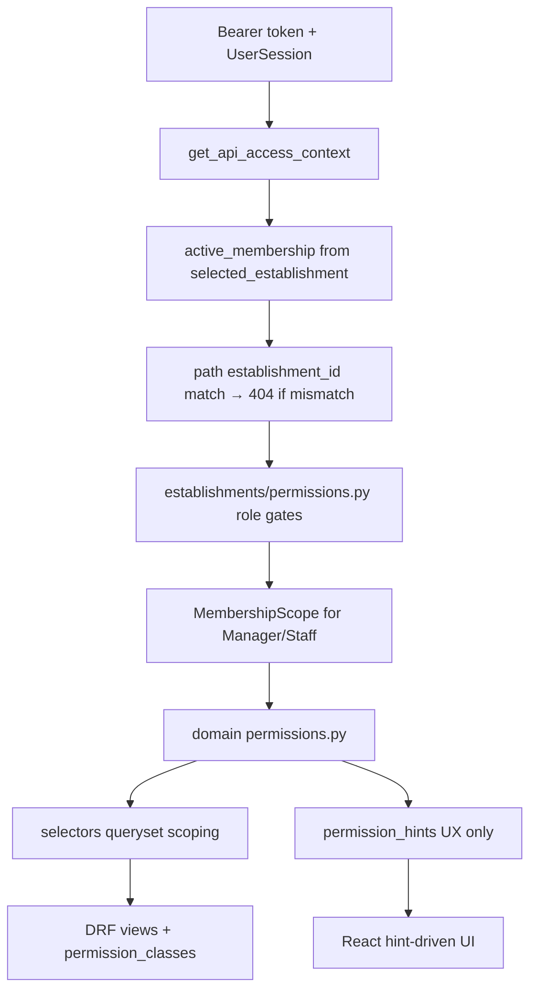

# RBAC, Tenant Isolation & Security Audit

Status: audit report  
Date: 2026-06-23  
Scope: RBAC, tenant isolation, membership status, object-level permissions, permission_hints, API enforcement, frontend hint usage, negative test coverage  
Mode: audit only — no source changes

Related: [Global Architecture Mapping Audit](./global_architecture_mapping.md), [Backend Core Architecture Audit](./backend_core_architecture.md)

---

## Inspection manifest

### 1. Files inspected

**Contract and rules**

- `AGENTS.md`, `apps/api/AGENTS.md`, `apps/web/AGENTS.md`
- `.cursor/rules/10-backend-django-drf.mdc`, `20-frontend-react-vite-ts.mdc`, `80-security-data-integrity.mdc`

**Backend — tenancy and access**

- `apps/api/houston/establishments/access.py` — `ApiAccessContext`, session-selected establishment
- `apps/api/houston/establishments/permissions.py` — role gates, DRF classes, `_is_valid_membership`
- `apps/api/houston/establishments/role_constants.py` — `_ADMIN_ROLES`, `_INVITATION_ROLES`, `_ACTION_ROLES`
- `apps/api/houston/establishments/membership_scope.py` — BU scope helpers
- `apps/api/houston/establishments/services.py` — `_MANAGEABLE_TARGET_ROLES_BY_ACTOR`, invite/update guards
- `apps/api/houston/establishments/selectors.py` — management queryset 404 pattern
- `apps/api/houston/accounts/selectors.py` — `resolve_active_membership`, bootstrap payload
- `apps/api/houston/accounts/permission_hints.py` — bootstrap hints
- `apps/api/houston/uploads/access.py` — `resolve_observation_actor_membership`
- `apps/api/houston/realtime/access.py` — WS ticket resolver

**Backend — domain permissions and views**

- `apps/api/houston/signals/permissions.py`, `selectors.py`, `api/views.py`, `api/serializers.py`
- `apps/api/houston/actions/permissions.py`, `selectors.py`, `api/views.py`, `api/serializers.py`
- `apps/api/houston/checklists/permissions.py`, `permission_hints.py`, `api/views.py`
- `apps/api/houston/comments/permissions.py`, `api/serializers.py`
- `apps/api/houston/notifications/permissions.py`
- `apps/api/houston/chat/permissions.py`, `consumers.py`
- `apps/api/houston/realtime/permissions.py`, `consumers.py`
- `apps/api/houston/uploads/permissions.py`, `api/views.py`
- `apps/api/houston/establishments/api/views.py`

**Frontend — permission hints and UX gating**

- `apps/web/src/features/auth/lib/bootstrap-permission-hints.ts`
- `apps/web/src/features/auth/lib/membership-rbac.ts`, `invitation-rbac.ts`
- `apps/web/src/features/execution/lib/execution-create-menu.ts`
- `apps/web/src/features/checklists/lib/checklist-management-access.ts`
- `apps/web/src/features/auth/hooks/use-app-page-workspace.ts`
- `apps/web/src/features/auth/components/membership-management-card.tsx`
- `apps/web/src/features/actions/pages/action-create-page.tsx`, `action-detail-page.tsx`
- `apps/web/src/features/signals/pages/signal-detail-page.tsx`
- `apps/web/src/features/checklists/pages/checklist-hub-page.tsx`, `checklist-create-page.tsx`
- `apps/web/src/features/auth/pages/team-page.tsx`, `team-invite-page.tsx`, `operational-config-page.tsx`
- `apps/web/src/features/comments/components/comment-section.tsx`, `comment-thread-item.tsx`
- `apps/web/src/App.tsx`, `apps/web/src/app/terrain-routes.ts`
- `apps/web/src/api/generated/types.ts` — `*PermissionHints` schemas

**Docs**

- `docs/product/domains/rbac_permissions_domain.md`
- `docs/product/domains/signal_domain.md`, `action_domain.md`, `checklist_domain.md`

### 2. Tests inspected

| Area | Representative tests |
|------|----------------------|
| Establishment role matrix | `establishments/tests/test_permissions.py` |
| Membership status / access context | `establishments/tests/test_access.py` |
| Cross-establishment membership API | `establishments/tests/test_membership_api.py` |
| Director → owner denial | `establishments/tests/test_membership_api.py` (`test_director_cannot_patch_owner_membership`) |
| Signal BU scope / commands | `signals/tests/test_permissions.py`, `test_signal_cancel_resolve_api.py` |
| Signal out-of-scope detail (intentional) | `signals/tests/test_signal_api_contract.py` (`test_scoped_member_can_read_out_of_scope_signal_detail`) |
| Canceled signal admin without scope | `signals/tests/test_signal_canceled_detail.py`, `notifications/tests/test_permissions.py` |
| Action cross-establishment | `actions/tests/test_action_permissions.py`, `test_action_transitions_api.py` |
| Checklist RBAC matrix | `checklists/tests/test_permissions.py` |
| Observation foreign establishment | `observations/tests/test_observation_api.py` |
| Realtime foreign establishment | `realtime/tests/test_realtime_ws_ticket_api.py` |
| WS consumer tenant match | `chat/consumers.py`, `realtime/consumers.py` (code); `chat/tests/test_ws_access_revocation.py` |
| Bootstrap permission hints | `accounts/tests/test_bootstrap_permission_hints.py` |
| Frontend hint helpers | `bootstrap-permission-hints.test.ts`, `membership-rbac.test.ts`, `invitation-rbac.test.ts` |
| Frontend page gating | `team-page.test.tsx`, `profile-page.test.tsx`, `action-detail-page.test.tsx`, `signal-detail-page.test.tsx` |

Pytest and Vitest were not executed in this audit pass.

### 3. Docs / rules inspected

- `docs/product/domains/rbac_permissions_domain.md` — authoritative RBAC domain doc
- `apps/api/AGENTS.md` — backend owns permissions; hints are UX only
- `apps/web/AGENTS.md` — frontend must not enforce security
- `.cursor/rules/80-security-data-integrity.mdc`

### 4. Assumptions or unknowns

- Signal out-of-scope **active** detail read is documented intentional product policy (rbac domain doc, 2026-06-11); treated as policy, not accidental leak.
- Backend `_MANAGEABLE_TARGET_ROLES_BY_ACTOR` includes `manager → staff`; membership PATCH API remains owner/director gated via `can_manage_memberships`.
- Production threat model and load characteristics not validated (Houston is dev-phase only).
- Celery/async notification producers with wrong tenant were not exhaustively audited.

---

## Architecture summary

Houston uses a layered RBAC model:

**Overall assessment:** Tenant isolation is consistently enforced via session-selected membership plus path `establishment_id` matching (404 anti-enumeration on most routes). Object-level checks are well-factored per domain. permission_hints correctly mirror enforcement helpers and are not trusted for security. Main issues are an **inconsistent admin BU bypass on canceled signals**, **intentionally broad active signal detail reads** (documented), and **frontend UX drift** (not security bypasses).

---

## Findings (10)

### RBAC-01 — Admin bypass missing on canceled signal reads

- **Severity:** P1
- **Category:** security / ambiguity
- **Evidence:** `signal_pole_visible_to_membership` in `apps/api/houston/signals/permissions.py`; `get_signal_for_detail` in `apps/api/houston/signals/selectors.py`; `recipient_can_view_notification_subject` in `apps/api/houston/notifications/permissions.py`
- **Problem:** Canceled signal detail and notification deep-links use `membership_scope_covers_business_unit` only. Owner/Director without explicit `MembershipScope` rows receive 404 / cannot resolve notification subjects. Elsewhere, `membership_covers_business_unit_including_admins` grants implicit all-BU access to admins (checklists, actions, feed scope helpers).
- **Why it matters now:** Owners/directors cannot follow notification deep-links to canceled signals they logically own. Breaks admin operational workflows.
- **Why it will hurt later:** As notification volume grows, inconsistent visibility rules between active and canceled signals will confuse support and produce false "access denied" reports.
- **Recommended fix:** Add admin early-return in `signal_pole_visible_to_membership`, or delegate to `membership_covers_business_unit_including_admins` for responsible/affected BU checks.
- **Tests to add/update:** Update `test_detail_canceled_owner_without_pole_scope_returns_404` to expect 200; update `test_recipient_cannot_view_canceled_signal_without_pole_scope` to expect True for owner.
- **Suggested implementation size:** S

### RBAC-02 — Active signal detail readable outside BU scope (by design)

- **Severity:** P2
- **Category:** ambiguity / security (information exposure)
- **Evidence:** `_can_view_signal_detail` in `apps/api/houston/signals/selectors.py:165-173`; `test_scoped_member_can_read_out_of_scope_signal_detail` in `signals/tests/test_signal_api_contract.py`; `docs/product/domains/rbac_permissions_domain.md:112-117`
- **Problem:** Any feed-capable member can read active/resolved signal detail by ID, including deep-links outside Ma vue BU scope. Only `can_view_signal_feed` is checked; BU scope is not applied on detail reads.
- **Why it matters now:** Scoped managers/staff can read signal content from BUs outside their operational scope if they obtain the UUID (notification, shared link, general feed discovery).
- **Why it will hurt later:** As establishments grow BU count and staff count, cross-pole information exposure may conflict with operational confidentiality expectations.
- **Recommended fix:** Product decision required. Doc says keep short term. If tightening: apply `signal_visible_in_membership_scope` in `_can_view_signal_detail` for Manager/Staff.
- **Tests to add/update:** Existing positive test documents current behavior; add explicit product sign-off note in doc if kept.
- **Suggested implementation size:** M (if scope tightened)

### RBAC-03 — `HasActiveMembership` does not enforce selected establishment

- **Severity:** P2
- **Category:** structure / security (footgun)
- **Evidence:** `HasActiveMembership.has_permission` in `apps/api/houston/establishments/permissions.py:109-114`; contrast with `resolve_observation_actor_membership` in `apps/api/houston/uploads/access.py`
- **Problem:** DRF class passes when user has any active membership, even without session selection or path establishment match. Real tenant guard lives in per-view resolvers (`resolve_observation_actor_membership`, management selectors returning None → 404).
- **Why it matters now:** No known bypass in existing endpoints; all establishment-scoped routes use resolvers.
- **Why it will hurt later:** New endpoints that rely on `HasActiveMembership` alone without a resolver could leak cross-establishment data or accept mutations against wrong tenant.
- **Recommended fix:** Add `HasSelectedEstablishmentMembership` DRF class, or rename/document `HasActiveMembership` as "has any membership" and require resolver mixin on establishment-scoped views.
- **Tests to add/update:** Test that new DRF class fails when `active_membership is None` but `active_memberships` is non-empty.
- **Suggested implementation size:** M

### RBAC-04 — 403 vs 404 inconsistency on realtime WS ticket

- **Severity:** P3
- **Category:** API contract / ambiguity
- **Evidence:** `realtime/tests/test_realtime_ws_ticket_api.py` — foreign establishment returns 403; most establishment routes (memberships, actions, observations, signals canceled detail) return 404
- **Problem:** Realtime ticket endpoint reveals existence of foreign establishment membership differently from other routes.
- **Why it matters now:** Minor; no authorization bypass.
- **Why it will hurt later:** Inconsistent error semantics complicate client error handling and security review.
- **Recommended fix:** Align to 404 pattern used elsewhere, or document 403 as intentional for realtime.
- **Tests to add/update:** Update or document existing test expectation.
- **Suggested implementation size:** S

### RBAC-05 — Duplicated establishment actor resolver

- **Severity:** P3
- **Category:** maintainability / structure
- **Evidence:** `resolve_observation_actor_membership` (`uploads/access.py`) vs `resolve_operational_realtime_actor_membership` (`realtime/access.py`) — near-identical establishment_id + membership checks with different downstream permission predicates
- **Problem:** Two copies of session-selected establishment matching. Divergence risk if one is updated and not the other.
- **Why it matters now:** Both currently enforce the same tenant boundary.
- **Why it will hurt later:** A fix to one resolver (e.g. selection-required semantics) may not propagate.
- **Recommended fix:** Extract shared `resolve_establishment_actor_membership(request, establishment_id, *, predicate)` helper.
- **Tests to add/update:** Parametrize existing resolver tests against shared helper.
- **Suggested implementation size:** S

### FE-01 — Execution create menu gated on role, not hints

- **Severity:** P2
- **Category:** API contract / maintainability (UX drift)
- **Evidence:** `canOpenExecutionCreateMenu` in `apps/web/src/features/execution/lib/execution-create-menu.ts:57-59`; inner options correctly use `permissionHints`
- **Problem:** "+" button visible to every role including staff regardless of `can_create_action` / `can_create_checklist_template`. Submenu items are hint-gated, but shell affordance is always shown.
- **Why it matters now:** Staff always see create entry point; may open empty or partial menu.
- **Why it will hurt later:** As more create options ship, role-based shell gating will drift further from backend capabilities.
- **Recommended fix:** Gate `canOpenExecutionCreateMenu` on `can_create_action || can_create_checklist_template || can_use_existing_checklist` from bootstrap hints.
- **Tests to add/update:** `execution-create-menu.test.ts` — deny when all hints false.
- **Suggested implementation size:** S

### FE-02 — Checklist create route lacks page-level permission guard

- **Severity:** P2
- **Category:** maintainability (UX drift)
- **Evidence:** `/checklists/new` → `ChecklistCreatePage` checks establishment/membership only; hub hides "+" via `can_create_checklist_template` hint
- **Problem:** Deep link to create page bypasses bootstrap hint gate. Backend POST should 403; user sees form then fails on submit.
- **Why it matters now:** Confusing UX for staff/managers without template-create rights.
- **Why it will hurt later:** Pattern may be copied for other management routes.
- **Recommended fix:** Add `canCreateChecklistTemplateFromBootstrapHints` access-denied state on page load (mirror `team-invite-page.tsx`, `operational-config-page.tsx`).
- **Tests to add/update:** Page test — staff deep-link shows access denied.
- **Suggested implementation size:** S

### FE-03 — Team hub reachable without management hints

- **Severity:** P3
- **Category:** maintainability (UX drift)
- **Evidence:** `/team` protected by membership only; invite card uses `can_invite`; membership list is "coming soon" for all roles
- **Problem:** Staff can deep-link to team page with no operational purpose. No security bypass (API enforces).
- **Why it matters now:** Minor UX noise.
- **Why it will hurt later:** When membership list ships, page may expose management UI to wrong roles if not gated.
- **Recommended fix:** Gate `/team` on `canAccessManagementSpace` (same as profile management section).
- **Tests to add/update:** `team-page.test.tsx` — staff sees access denied.
- **Suggested implementation size:** S

### FE-04 — Frontend membership RBAC mirror incomplete for manager

- **Severity:** P2
- **Category:** maintainability / ambiguity
- **Evidence:** `MANAGEABLE_TARGET_ROLES_BY_ACTOR` in `apps/web/src/features/auth/lib/membership-rbac.ts` (`manager: []`) vs `apps/api/houston/establishments/services.py:1636-1638` (`manager: {staff}`)
- **Problem:** Frontend role matrix omits manager→staff management. Latent today because membership management UI is gated by `can_manage_runtime_config` (owner/director only). Backend invite flow uses separate `_can_actor_invite_role`.
- **Why it matters now:** No user-visible bug while management UI is owner/director only.
- **Why it will hurt later:** If manager management is exposed or backend matrix changes, UI will silently hide valid options or show invalid ones.
- **Recommended fix:** Align frontend matrix with backend, or remove frontend mirror and drive editable roles from API response.
- **Tests to add/update:** `membership-rbac.test.ts` — add manager→staff case.
- **Suggested implementation size:** S

### TEST-01 — Missing cross-establishment API negative tests for active signals and comments

- **Severity:** P1
- **Category:** tests
- **Evidence:** `signals/tests/test_signal_canceled_detail.py:149` has cross-establishment test for canceled detail only; no equivalent for active signal detail/commands; `comments/tests/` has out-of-scope tests but no cross-establishment API test
- **Problem:** Primary tenant boundary for active signal reads and comment threads lacks dedicated API regression tests.
- **Why it matters now:** Refactors to `get_signal_for_detail` or comment selectors could regress tenant isolation without test failure.
- **Why it will hurt later:** Multi-establishment users are a core product scenario; gaps compound as API surface grows.
- **Recommended fix:** Add parametrized tests: valid membership in Est A, path Est B → 404 for signal feed detail, pin/cancel/resolve commands, comment list/create.
- **Tests to add/update:** New tests in `signals/tests/` and `comments/tests/`.
- **Suggested implementation size:** S

---

## 1. Confirmed RBAC risks

| ID | Severity | Risk | Backend enforces? |
|----|----------|------|-------------------|
| RBAC-01 | P1 | Owner/Director blocked from canceled signal detail and notification deep-links without explicit BU scope | Yes — over-restrictive, not under-restrictive |
| RBAC-02 | P2 | Active signal detail readable outside Ma vue BU scope (deep-link / general feed) | Yes — intentional broad read; mutations scoped |
| RBAC-03 | P2 | `HasActiveMembership` weaker than name; new endpoints could skip resolver | No known bypass today |
| RBAC-04 | P3 | Realtime foreign establishment returns 403 vs 404 elsewhere | Enforced; inconsistent semantics |
| RBAC-05 | P3 | Duplicated establishment resolver — maintenance drift risk | Enforced today |

**Not confirmed as authorization bypasses (backend correct):**

- Cross-establishment object access — guarded at resolver + object permission layers (`establishment_id != membership.establishment_id` throughout domain permissions)
- INVITED / DEACTIVATED membership — fail-closed via `_is_valid_membership` / `_is_valid_invitation_membership` chain; tested on observations, access resolution, chat deactivation
- Frontend deep-link routes without page guards — mutations return 403/404 from API
- WS consumers — establishment_id match enforced in `chat/consumers.py:172`, `realtime/consumers.py:155`

---

## 2. Ambiguous role rules

### Signal feed scope triad

| Mode | List scope | Detail scope |
|------|------------|--------------|
| Ma vue (`personal`) | BU-filtered for Manager/Staff | Unscoped read for active signals |
| Vue générale (`general`) | Entire establishment, all roles | Same |
| Canceled signals | N/A (not in feed) | Pole-scoped via `signal_pole_visible_to_membership` — **no admin bypass (RBAC-01)** |

Easy to misread general-feed or detail access as a BU scope leak. Documented in `rbac_permissions_domain.md` §7.

### Staff action creation split

- Establishment gate `can_create_action` **includes Staff** (`establishments/permissions.py:53-56`; `test_staff_permissions` asserts True).
- Linked action creation blocked for Staff (`actions/permissions.py:144-145`).
- Free actions require BU scope (`can_create_free_action`).
- **Doc drift:** `rbac_permissions_domain.md:107-109` states Staff cannot create actions — contradicts code and tests.

### Two BU visibility helpers in signals

- `signal_visible_in_membership_scope` — admin bypass via `_ADMIN_ROLES`.
- `signal_pole_visible_to_membership` — no admin bypass; used for canceled detail only.

Same domain, different semantics. Source of RBAC-01.

### Director vs Owner onboarding

Director can manage onboarding; Owner-only runtime config on DRAFT establishments (`establishments/access.py` onboarding context). Operational runtime admin requires active establishment + owner/director role.

### Visibility ≠ actionability

- Comments inherit parent signal/action visibility; reply/resolve gated separately via per-comment hints.
- Chat is participant-only: Owner/Director have no read access to conversations they do not participate in.
- Signal/action lifecycle commands remain BU-scoped for Manager/Staff even when detail is readable.

### Role capability matrix (implemented helpers)

| Capability | Owner | Director | Manager | Staff |
|------------|-------|----------|---------|-------|
| Manage memberships (API) | Yes | Yes | No | No |
| Invite | Yes (all roles) | Yes (Manager/Staff) | Yes (Staff, scoped) | No |
| Runtime config | Yes | Yes | No | No |
| View signal feed | Yes | Yes | Yes | Yes |
| Create observation | Yes | Yes | Yes | Yes |
| Create action (establishment gate) | Yes | Yes | Yes | Yes |
| Create linked action | Yes | Yes | Scoped + actionable | No |
| Create free action | Yes | Yes | BU scope | BU scope |
| Validate action | Yes | Yes | Yes | No |
| Pin/cancel/resolve signal | Yes | Yes | Scoped on responsible BU | No |

---

## 3. Frontend/backend permission drift

| ID | Type | Frontend | Backend | Security impact |
|----|------|----------|---------|-----------------|
| FE-01 | UX over-permissive | `canOpenExecutionCreateMenu(role)` | Bootstrap `can_create_action`, `can_create_checklist_template` | None — API enforces |
| FE-02 | Missing page guard | `/checklists/new` unguarded | `can_create_registered_template` | None — POST 403 |
| FE-03 | Missing page guard | `/team` membership-only | `can_invite`, `can_manage_memberships` | None |
| FE-04 | Duplicated role matrix | `membership-rbac.ts` manager: [] | `services.py` manager: {staff} | None today (UI owner/director gated) |
| FE-05 | Unused hints | No UI for `can_reassign`, `can_update_due_at` | Exposed in action serializers | None |
| FE-06 | Unused hints | No UI for checklist `can_activate`, `can_deactivate`, `can_use_template` | Exposed in checklist serializers | None |
| FE-07 | Comment composer | Always rendered | POST enforces create permission | None — UX only |
| FE-08 | Doc drift | N/A | Staff `can_create_action` True | Documentation only |

**Aligned (good patterns):**

- Bootstrap hints mirror `apps/api/houston/accounts/permission_hints.py` field-for-field.
- Signal/action/checklist lifecycle buttons driven by per-resource `permission_hints`.
- Hint helpers fail closed when shapes incomplete (`hasComplete*PermissionHints`).
- `team-invite-page`, `operational-config-page`, `action-create-page` use bootstrap hint gates with access-denied states.
- Route guards are auth/membership-based; RBAC enforced at API boundary per AGENTS.md contract.

---

## 4. Missing negative tests

### P1 — Tenant boundary regression

| Gap | Suggested test | Domain |
|-----|----------------|--------|
| Active signal cross-establishment API | User with membership in Est A, path Est B → 404 on `GET .../signals/{id}/`, pin/cancel/resolve commands | signals |
| Canceled signal admin access after RBAC-01 fix | Owner without scope rows reads canceled signal → 200 | signals, notifications |
| Comments cross-establishment API | Foreign establishment path → 404 on list/create | comments |

### P2 — Membership status and commands

| Gap | Suggested test | Domain |
|-----|----------------|--------|
| INVITED membership on operational APIs | Parametrize status → 403 on signal feed, action detail, checklist list | signals, actions, checklists |
| DEACTIVATED membership on operational APIs | Same parametrization | all operational |
| Signal command cross-establishment | pin/cancel/resolve with foreign establishment path | signals |
| Manager invite manager API | POST invite with manager role as actor → 403 | establishments |

### P3 — Edge cases and UX

| Gap | Suggested test | Domain |
|-----|----------------|--------|
| Multi-membership without selection | 2 memberships, no `selected_establishment`, establishment-scoped URL | access, signals |
| Realtime 403 vs 404 contract | Document or align foreign establishment response | realtime |
| Frontend deep-link denial | `/checklists/new`, `/team` access-denied for staff | web |
| `HasActiveMembership` with selection_required | Establishment URL without selection → 404 | establishments |

### Well-covered areas

- Full role matrix: `establishments/tests/test_permissions.py`
- Checklist RBAC negative matrix: `checklists/tests/test_permissions.py`
- Director cannot PATCH/deactivate owner: `establishments/tests/test_membership_api.py`
- Action cross-establishment unit + API: `actions/tests/test_action_permissions.py`, `test_action_transitions_api.py`
- Observation foreign establishment 403: `observations/tests/test_observation_api.py`
- Out-of-scope signal detail allowed (documents policy): `signals/tests/test_signal_api_contract.py`
- Notification cross-establishment and out-of-scope action subjects: `notifications/tests/test_permissions.py`

---

## 5. Recommended RBAC fixes by priority

### Top 3 fixes first

1. **Fix RBAC-01 (S):** Add admin bypass to `signal_pole_visible_to_membership`. Update notification subject visibility and tests. Restores Owner/Director canceled signal + notification deep-link access.

2. **Add cross-establishment API negative tests (S):** Active signal detail/commands and comments API (TEST-01). Prevents regression on primary tenant boundary.

3. **Fix Staff action creation doc drift (S):** Update `docs/product/domains/rbac_permissions_domain.md` Staff section: free actions with BU scope allowed; linked actions and validation denied.

### Quick wins

- Tie `canOpenExecutionCreateMenu` to bootstrap hints (FE-01, S)
- Add page-level access-denied to `/checklists/new` and `/team` (FE-02, FE-03, S)
- Align realtime foreign establishment to 404 or document 403 (RBAC-04, S)
- Extend `membership-rbac.test.ts` with manager→staff case (FE-04, S)
- Extract shared establishment actor resolver (RBAC-05, S)

### Structural issues to plan later

- Revisit active signal detail read scope vs Ma vue BU filter — product decision; doc says keep short term (RBAC-02, M)
- Strengthen `HasActiveMembership` or add `HasSelectedEstablishmentMembership` DRF class (RBAC-03, M)
- Systematic INVITED/DEACTIVATED API test parametrization across domains (M)
- Reduce frontend duplicated RBAC mirrors — expose editable roles / capabilities from API instead of `membership-rbac.ts` (M)
- Wire unused action/checklist hints when UI features ship (FE-05, FE-06)

### Not worth fixing now

- General feed unscoped list — documented product behavior
- Unused action/checklist hints until corresponding UI ships
- Comment composer always visible — API enforces; UX polish only
- `HasActiveMembership` naming alone — no known bypass in existing endpoints
- Execution create menu shell for staff when staff can create free actions anyway

---

## Closing summary

| Category | Count | Highest severity |
|----------|-------|------------------|
| Confirmed RBAC risks | 5 | P1 (RBAC-01 admin bypass on canceled signals) |
| Ambiguous role rules | 5 areas | Signal scope triad, Staff action doc drift |
| Frontend/backend drift | 8 items | UX-only; no security bypass confirmed |
| Missing negative tests | 10+ gaps | Cross-establishment active signals, comments API |

Houston RBAC is **structurally sound** for tenant isolation: session-selected membership, path establishment matching, object-level permission helpers, and selector scoping form a consistent defense-in-depth pattern. The highest-priority fix is RBAC-01 (admin access to canceled signals). The highest-priority test gap is cross-establishment API coverage for active signals and comments. Frontend drift is real but confined to UX affordances; backend remains authoritative.
