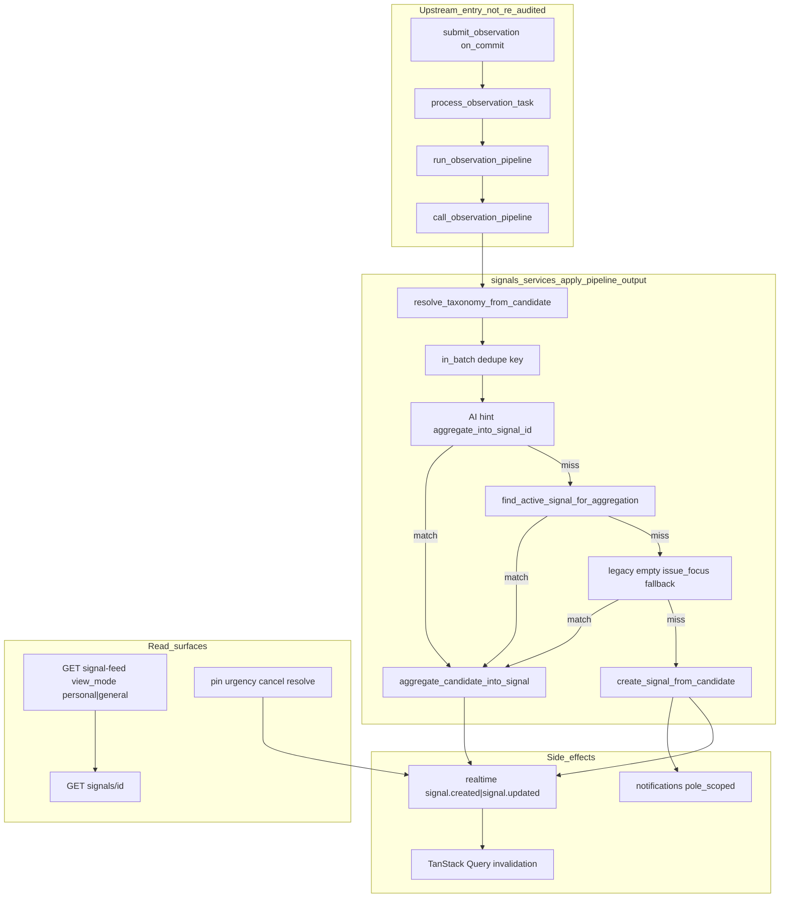

# Signal + Signal Feed Audit

Status: audit report  
Date: 2026-06-24  
Scope: Signal creation/aggregation, feed/detail APIs, RBAC (Ma zone vs Vue globale), lifecycle, notifications, realtime/cache freshness, frontend feed — backend `signals/` app, related tests, docs, and frontend `features/signals/`  
Mode: audit only — no source changes

Related: [Onboarding + Observation + AI Consolidation](./onboarding_observation_ai_consolidation.md) (pipeline handoff context), [Observation Domain Audit](./observation_audit.md), [RBAC Security Audit](./rbac_security_audit.md)

---

## Inspection manifest

### 1. Files inspected

**Contract and rules**

- `AGENTS.md`, `apps/api/AGENTS.md`, `apps/web/AGENTS.md`
- `.cursor/rules/10-backend-django-drf.mdc`, `80-security-data-integrity.mdc`

**Backend — signals core**

- `apps/api/houston/signals/models.py` — `Signal`, `CandidateSignal`, `SignalSourceObservation`
- `apps/api/houston/signals/services.py` — `apply_pipeline_output`, `create_signal_from_candidate`, `aggregate_candidate_into_signal`, aggregation helpers, lifecycle (`pin_signal`, `cancel_signal`, `resolve_signal`), recovery enqueue helpers
- `apps/api/houston/signals/selectors.py` — `feed_signals_for_establishment`, `signal_feed_queryset`, `get_signal_for_detail`
- `apps/api/houston/signals/permissions.py` — feed gate, pole visibility, actionability, command hints
- `apps/api/houston/signals/constants.py` — `ACTIVE_SIGNAL_STATUSES`, `FEED_SIGNAL_STATUSES`
- `apps/api/houston/signals/signal_classification.py`, `classification_fallback.py`, `aggregation_eval.py`
- `apps/api/houston/signals/feed_filters.py`, `feed_cursor.py`, `reporter_display.py`
- `apps/api/houston/signals/api/views.py`, `serializers.py`, `urls.py`
- `apps/api/houston/signals/tasks.py` — `process_observation_task`, recovery sweep wrapper

**Backend — cross-domain**

- `apps/api/houston/establishments/membership_scope.py` — `build_signal_feed_scope_q_v2`
- `apps/api/houston/notifications/scheduling.py`, `recipients.py`, `permissions.py`
- `apps/api/houston/realtime/broadcast.py`, `ws_payloads.py`
- `apps/api/houston/ai/observation_pipeline_schema.py` — pipeline output contract (entry to `apply_pipeline_output` only)

**Frontend**

- `apps/web/src/features/signals/` — pages, hooks, api, types, components, lib
- `apps/web/src/features/realtime/lib/apply-operational-invalidation.ts`
- `apps/web/src/lib/query-invalidation.ts`
- `apps/web/src/features/observations/hooks.ts`, `processing-status-labels.ts` — post-submit feed invalidation
- `apps/web/src/features/execution/components/execution-feed-tabs.tsx` — label comparison

**Docs**

- `docs/product/domains/signal_domain.md`
- `docs/product/domains/feed_domain.md`
- `docs/product/domains/rbac_permissions_domain.md`
- `docs/product/notification_matrix_v0.2.md`
- `docs/product/domains/realtime_domain.md`

### 2. Tests inspected

| Area | Key files |
|------|-----------|
| Feed API + view modes | `signals/tests/test_signal_feed_api.py` |
| Feed selectors / scope oracle | `signals/tests/test_signal_feed_selectors.py` |
| Feed filters + cursor | `signals/tests/test_signal_feed_filters.py`, `test_feed_cursor.py` |
| API contract / privacy | `signals/tests/test_signal_api_contract.py` |
| Canceled detail | `signals/tests/test_signal_canceled_detail.py` |
| Cancel / resolve API | `signals/tests/test_signal_cancel_resolve_api.py`, `test_signal_commands_api.py` |
| Lifecycle services | `signals/tests/test_signal_lifecycle_services.py` |
| Resolved in feed | `signals/tests/test_signal_feed_resolved_behavior.py` |
| Aggregation | `signals/tests/test_legacy_issue_focus_aggregation.py`, `test_golden_observation_split.py`, `test_aggregation_eval.py` |
| Permissions helpers | `signals/tests/test_permissions.py` |
| Tenant isolation | `signals/tests/test_signal_tenant_isolation_api.py` |
| Query budget | `signals/tests/test_signal_feed_api.py` (`test_signal_feed_query_count_baseline_two_items`) |
| Pipeline recovery (signal creation path) | `signals/tests/test_observation_pipeline_recovery.py` |
| Notifications | `notifications/tests/test_signal_notification_producers.py` |
| Realtime | `realtime/tests/test_observation_pipeline_invalidation.py`, `test_broadcast.py` |
| Frontend | `signals/lib/signal-feed-filters.test.ts`, `signal-detail-page.test.tsx`; `observations/processing-status-labels.test.ts`; `lib/query-invalidation.test.ts`, `realtime/lib/apply-operational-invalidation.test.ts` |

Pytest and Vitest were not executed in this audit pass.

### 3. Docs / rules inspected

- `docs/product/domains/signal_domain.md` — authoritative signal behavior
- `docs/product/domains/feed_domain.md` — cross-cutting feed rules (partially stale — see SIG-08)
- `docs/product/domains/rbac_permissions_domain.md` — Ma vue / Vue générale semantics
- `docs/product/notification_matrix_v0.2.md` — signal notification V1
- `docs/product/domains/realtime_domain.md` — `signal.created` / `signal.updated` contract
- `apps/api/AGENTS.md` — pipeline ownership table (observations → signals → ai)

### 4. Assumptions or unknowns

- Product intent for **detail wider than personal feed** not confirmed with PM; code comment treats it as intentional deep-link support.
- Whether **Owner/Director duplicate tabs** (Ma zone ≡ Vue globale) are intentional product design not verified.
- `make backend-test` / `make verify` not run in this audit pass.
- Production signal volume, aggregation query explain plans, and Celery concurrency not measured.
- Observation + AI + onboarding pipeline fixes on the current branch are treated as done; this audit does not re-audit them except where they explain signal creation entry.

---

## 1. Current Signal flow

### Creation from AI output

Entry: `apply_pipeline_output()` in `apps/api/houston/signals/services.py`, called from `run_observation_pipeline()` after `call_observation_pipeline()` validates candidates.

Per candidate (max 5):

1. **Taxonomy resolve** — `resolve_taxonomy_from_candidate()` maps AI keys to `BusinessUnit`, `ActivitySubject`, optional `OperationalUnit`; `validate_signal_classification()` enforces establishment ownership and responsible/affected rules; `try_apply_responsible_affected_fallback()` allows single fallback when subject is valid under affected BU only.
2. **In-batch dedupe** — aggregation key `(affected_bu, responsible_bu, activity_subject, operational_unit|null, normalized_issue_focus)`; duplicate key in same observation → `CandidateSignal` rejected.
3. **Audit row** — `CandidateSignal` with `outcome=PENDING`.
4. **Aggregation priority** (first match wins):
   - AI hint (`_try_resolve_hint_signal`) — validates UUID, establishment, active status, taxonomy match, `issue_focus` match.
   - Exact match (`find_active_signal_for_aggregation`) — same taxonomy + `issue_focus`, `status__in ACTIVE_SIGNAL_STATUSES`, `select_for_update` when `for_update=True`.
   - Legacy fallback (`find_active_legacy_signal_for_aggregation`) — same taxonomy, `issue_focus=""`, exactly one legacy peer; 0 or 2+ peers → skip, create new.
   - **Create** (`create_signal_from_candidate`) — `Signal` status `OPEN`, `CREATED_FROM` link, `signal.created` realtime, `schedule_signal_created_notification`.
5. **Aggregate** (`aggregate_candidate_into_signal`) — updates `last_activity_at`, optional backfill of legacy empty `issue_focus`, `AGGREGATED_FROM` link, may delete observation media when no active `CREATED_FROM` remains; emits `signal.updated` only (no notification).

Outcomes on `ObservationProcessing`: `NO_SIGNAL_CREATED`, `SIGNALS_CREATED`, `SIGNAL_AGGREGATED`, or mixed → `SIGNALS_CREATED`.

### Feed read path

- **Base queryset** — `feed_signals_for_establishment()`: statuses `open`, `in_progress`, `resolved` (`FEED_SIGNAL_STATUSES`); excludes `canceled` and `archived`. Annotates `aggregation_count` (count of `AGGREGATED_FROM` links). Heavy `select_related` + dual `Prefetch` for reporter chronology and created-from media.
- **Sorting** — `apply_feed_sorting()` + cursor pagination (`feed_cursor.py`): active group before resolved, then pin / urgency / status / `last_activity_at`.
- **View modes** (`signal_feed_queryset`):
  - `general` (Vue globale): all feed-visible signals for any active member; optional status/BU/subject filters.
  - `personal` (Ma zone): Owner/Director → same as general (no scope filter); Manager/Staff → `build_signal_feed_scope_q_v2` (affected **OR** responsible BU in `MembershipScope`); empty feed if no scopes.

Gate: `CanViewSignalFeed` → `can_view_signal_feed` (= valid active membership).

### Detail read path

- Feed-visible signals (`open`, `in_progress`, `resolved`): `get_signal_for_detail()` → `_can_view_signal_detail()` = `can_view_signal_feed` only — **no membership scope check** (comment at `selectors.py:169–170`).
- `canceled`: separate query branch; requires `signal_pole_visible_to_membership` (admins bypass pole check). Read-only; all command hints false.

### Commands and lifecycle

| Command | Service | Guards |
|---------|---------|--------|
| Pin / unpin | `pin_signal` / `unpin_signal` | Active only; pin requires `OPEN` |
| Urgency | `set_signal_urgency` | Active only; high→normal allowed |
| Cancel | `cancel_signal` | Active → `CANCELED`; clears pin; does not reset high urgency |
| Resolve | `resolve_signal` | Active → `RESOLVED`; blocks if active linked actions (`SignalBusinessConflictError`); resets high urgency; clears pin |

Terminal transitions delete observation media when no other active signal shares the `CREATED_FROM` observation.

### Notifications and realtime

- **Notifications (V1):** `signal.created`, `signal.urgency_changed` (→ high only), `signal.pinned`, `signal.resolved`, `signal.canceled` — pole-scoped recipients (affected ∪ responsible BU), actor excluded; aggregation emits **zero** notifications (`test_aggregate_emits_zero_notifications`).
- **Realtime:** `signal.created` on create; `signal.updated` on aggregate, pin, unpin, urgency, cancel, resolve. No granular reasons on the wire (`signal.pinned`, etc.).
- **Frontend invalidation:** `invalidateEstablishmentSignalQueries()` prefix-invalidates all `viewMode` and filter variants; triggered by WS `subject_type: signal`, signal mutations, action mutations, observation terminal processing, reconnect.

### Frontend surfaces

- **Feed page** — `SignalFeedPage`: `useSignalFeedQuery` infinite query; tabs **Ma zone** / **Vue globale** (`signal-feed-tabs.tsx`); filters in local state (not URL-persisted).
- **Detail page** — `SignalDetailPage`: `useSignalDetailQuery`; command UI gated by backend `permission_hints`.
- **Post-report** — processing-status poll invalidates signal feed on terminal `signal_created` / `signal_updated` ux status; navigates to `/signals` list only (no deep-link to `signal_ids`).

### Domain ownership assessment

Signal feed logic lives entirely in `houston/signals/` (no separate feed Django app). Cross-app coupling for creation is intentional per `apps/api/AGENTS.md`: observations enqueues `process_observation_task`; signals owns orchestration, aggregation, feed, and lifecycle. Notifications and realtime are consumers triggered from signal services.

**Overall:** Core signal domain is well-bounded for MVP. Main risks are RBAC asymmetry between feed scope and detail/commands, aggregation race without DB guard, and doc/label drift — not missing modules.

---

## 2. Top findings

### SIG-01 — Detail read is wider than Ma zone personal feed

- **Severity:** P1
- **Category:** security / ambiguity
- **Evidence:** `get_signal_for_detail()` + `_can_view_signal_detail()` in `apps/api/houston/signals/selectors.py:126–173`; `signal_feed_queryset()` applies `build_signal_feed_scope_q_v2` for Manager/Staff personal mode; `test_scoped_member_can_read_out_of_scope_signal_detail` in `signals/tests/test_signal_api_contract.py:158` asserts 200 for open signals outside personal scope
- **Problem:** Any feed-capable member can `GET /signals/{id}` for active/resolved signals even when those signals are absent from their Ma zone feed. Scope filtering applies to the list, not detail.
- **Why it matters now:** Small teams may not notice; deep links from notifications or shared URLs expose signal summaries to peers outside their BU scope.
- **Why it will hurt later:** As establishments grow and scopes narrow, operators assume Ma zone boundaries apply everywhere; detail leaks operational metadata (title, summary, classification, media previews) beyond intended visibility.
- **Recommended fix:** Product decision required — (A) align detail read with personal scope for Manager/Staff, or (B) document and test deep-link model explicitly (detail = establishment-wide for feed-visible statuses; Ma zone = list filter only). Add API test for **resolved** out-of-scope detail (today only open is tested).
- **Tests to add/update:** `test_scoped_member_can_read_out_of_scope_signal_detail` — extend to `resolved` status; optional negative test if policy changes to 404.
- **Suggested implementation size:** S (policy + tests) or M (selector change if scope enforced on detail)

### SIG-02 — Feed scope vs command actionability use different BU rules

- **Severity:** P1
- **Category:** ambiguity / security
- **Evidence:** `build_signal_feed_scope_q_v2` in `establishments/membership_scope.py` — affected **OR** responsible BU; `signal_actionable_by_membership` in `signals/permissions.py:53–63` — **responsible BU only** (admins bypass); `test_staff_restaurant_scope_sees_but_cannot_act_on_maintenance_responsible_signal` in `test_signal_feed_api.py:325` tests helper-level visibility vs actionability; no API test for manager affected-only scope denied on pin/cancel/resolve
- **Problem:** A Manager scoped only on the **affected** pole sees a signal in Ma zone but receives `permission_hints` with all command flags false and gets 403 on mutation attempts.
- **Why it matters now:** Confusing UX — signal appears in "my zone" but is read-only without clear explanation.
- **Why it will hurt later:** Misconfigured scopes and support tickets; product ambiguity about who "owns" a signal operationally.
- **Recommended fix:** Either align feed scope with actionability (responsible-only for personal feed), or keep split but surface UX copy / hints explaining read-only visibility; add API-level command-denial test for affected-only manager.
- **Tests to add/update:** API: manager with affected-only scope → feed 200, `POST pin` / `cancel` / `resolve` → 403; assert `permission_hints` all false on detail.
- **Suggested implementation size:** S (tests + UX copy) or M (scope rule change)

### SIG-03 — No database guard on aggregation key (duplicate active signals possible)

**Status: mitigated** — partial unique constraint `signal_unique_active_aggregation_key` on `Signal` (`nulls_distinct=False`, active statuses only) plus `IntegrityError` retry-to-aggregate in `apply_pipeline_output`; concurrency test in `test_observation_pipeline_aggregation_concurrency.py`.

- **Severity:** P1
- **Category:** scalability / data integrity
- **Evidence:** `find_active_signal_for_aggregation()` in `services.py:430–460` uses `select_for_update` within one transaction; `create_signal_from_candidate()` does unconditional `Signal.objects.create()`; no unique constraint on `(establishment, taxonomy quadruplet, issue_focus, status)` in `models.py`; `run_observation_pipeline` catches `IntegrityError` but nothing triggers it for duplicates
- **Problem:** Two concurrent observations (or Celery retries with divergent AI output that still normalizes to the same key) can each pass aggregation lookup and create separate active signals with identical taxonomy + `issue_focus`.
- **Why it matters now:** Low probability at dev volume.
- **Why it will hurt later:** Duplicate signals fragment operational context, inflate feed noise, and break aggregation eval monitoring (`aggregation_eval.find_active_taxonomy_duplicate_groups`).
- **Recommended fix:** Partial unique index or constraint on aggregation key for `ACTIVE_SIGNAL_STATUSES`; or advisory lock keyed by aggregation key during `apply_pipeline_output`. Add concurrency integration test.
- **Tests to add/update:** Parallel `apply_pipeline_output` / pipeline runs with same key → assert single active signal; retry path from consolidation finding **C-03** (divergent AI output on Celery retry) if keys differ — document as residual risk.
- **Suggested implementation size:** M (migration + test)
- **Cross-ref:** [Consolidation C-03](./onboarding_observation_ai_consolidation.md) — Celery retry re-invokes LLM; divergent output can create second signal if aggregation keys differ (orthogonal to SIG-03 race, same symptom).

### SIG-04 — Aggregation lookup lacks composite index

- **Severity:** P2
- **Category:** performance
- **Evidence:** `find_active_signal_for_aggregation()` filters on `establishment_id`, both BUs, `activity_subject`, optional `operational_unit`, `issue_focus`, `status__in`; `Signal.Meta.indexes` in `models.py:93–116` has feed-sort index and per-FK indexes only
- **Problem:** Aggregation queries may degrade to sequential scans as active signal count grows per establishment.
- **Why it matters now:** Negligible at MVP volume; feed query budget is already tested (`SIGNAL_FEED_MAX_QUERIES_TWO_ITEMS = 8`).
- **Why it will hurt later:** Every observation submission runs aggregation lookup per candidate; latency adds directly to pipeline completion time.
- **Recommended fix:** Add partial composite index aligned to aggregation filter (e.g. establishment + taxonomy fields + `issue_focus` where status in active); validate with `EXPLAIN ANALYZE` before migration.
- **Tests to add/update:** None required for index; optional query-count assertion on aggregation path under load.
- **Suggested implementation size:** S

### SIG-05 — `can_view_signal` helper is dead / misleading

- **Severity:** P2
- **Category:** maintainability
- **Evidence:** `can_view_signal()` in `permissions.py:73–83` restricts to `ACTIVE_SIGNAL_STATUSES` only; API detail uses `get_signal_for_detail()` which serves `resolved` via feed path and `canceled` via pole scope — `can_view_signal` is not imported by views; only unit-tested in `test_permissions.py`
- **Problem:** Future RBAC work may assume `can_view_signal` is the detail gate; it contradicts actual API behavior.
- **Why it matters now:** No runtime bug.
- **Why it will hurt later:** Incorrect permission refactors; duplicated/conflicting helpers.
- **Recommended fix:** Remove `can_view_signal` or rewire `get_signal_for_detail` to use a single named helper that matches feed-visible + canceled rules; update tests.
- **Tests to add/update:** Replace `test_permissions.py` assertions with helper that matches API contract.
- **Suggested implementation size:** S

### SIG-06 — Admin personal ≡ general; UI label drift across terrain hubs

- **Severity:** P2
- **Category:** ambiguity / maintainability
- **Evidence:** `signal_feed_queryset()` lines 111–116 — Owner/Director `personal` skips scope; `signal-feed-tabs.tsx` labels **Ma zone** / **Vue globale**; `execution-feed-tabs.tsx` labels **Ma vue** / **Vue globale**; `membership_scope.py` docstring says "Ma vue filter"; separate TanStack Query cache keys per `viewMode` despite identical data for admins
- **Problem:** Admins see two tabs with duplicate data and different empty-state copy; product vocabulary inconsistent (Ma zone vs Ma vue vs backend Ma vue).
- **Why it matters now:** Cosmetic confusion; wasted cache entries.
- **Why it will hurt later:** Localization and onboarding docs multiply; users learn inconsistent terms per screen.
- **Recommended fix:** Unify labels across signal and execution feeds; hide personal/general toggle for Owner/Director or document that Ma zone is a Manager/Staff concept only.
- **Tests to add/update:** API: owner `personal` feed item count == `general` feed item count.
- **Suggested implementation size:** S

### SIG-07 — Realtime lifecycle invalidation undertested

- **Severity:** P2
- **Category:** tests
- **Evidence:** `_schedule_signal_invalidation(..., reason="signal.updated")` in `services.py` for pin, unpin, urgency, cancel, resolve, aggregate; realtime tests cover pipeline (`test_observation_pipeline_invalidation.py`) and pin after-commit (`test_broadcast.py`) only — no assertions for cancel, resolve, unpin, urgency
- **Problem:** Regression in after-commit broadcast wiring for terminal transitions could leave stale feed/detail until manual refresh.
- **Why it matters now:** Frontend uses broad prefix invalidation; any `signal` subject type triggers refetch — low user-visible risk if WS fires at all.
- **Why it will hurt later:** Harder to debug stale UI reports; contract drift between services and realtime layer undetected.
- **Recommended fix:** Add realtime tests mirroring pin pattern for `cancel_signal`, `resolve_signal`, `unpin_signal`, `set_signal_urgency` — assert `schedule_establishment_invalidation` called with `subject_type=signal`, `reason=signal.updated` after commit.
- **Tests to add/update:** New cases in `realtime/tests/` following `test_broadcast.py` structure.
- **Suggested implementation size:** S

### SIG-08 — `feed_domain.md` stale on feed-visible statuses

- **Severity:** P2
- **Category:** ambiguity / API contract
- **Evidence:** `feed_domain.md:131` — "active Signals"; `FEED_SIGNAL_STATUSES` in `constants.py:18–19` includes `resolved`; `test_signal_feed_resolved_behavior.py` asserts resolved signals appear in default feed; `signal_domain.md` is aligned with code
- **Problem:** Authoritative feed doc implies resolved/canceled excluded from default feed; code includes resolved, excludes only canceled/archived.
- **Why it matters now:** Misleading for implementers and auditors.
- **Why it will hurt later:** Wrong filter defaults, frontend copy, and RBAC assumptions when extending feed behavior.
- **Recommended fix:** Replace "active Signals" with **feed-visible** (`open`, `in_progress`, `resolved`) in `feed_domain.md`; cross-link `signal_domain.md` §7.
- **Tests to add/update:** None — behavior already tested.
- **Suggested implementation size:** S

### SIG-09 — Frontend ignores parts of feed API contract

- **Severity:** P2
- **Category:** API contract / maintainability
- **Evidence:** `SignalFeedItem.permission_hints` returned by `serialize_signal_feed_item` but `SignalCard` never reads it; `SignalFeedResponse.applied_filters` in generated types unused; `appendSignalFeedFiltersToSearchParams` in `signal-feed-filters.ts` tested but `SignalFeedPage` uses local state only (filters/viewMode not URL-persisted)
- **Problem:** Backend ships fields clients do not consume; filter state lost on navigation/refresh; dead helper suggests incomplete feature.
- **Why it matters now:** No functional bug — detail page uses hints correctly.
- **Why it will hurt later:** OpenAPI bloat; engineers assume feed hints drive UI; shareable filtered views impossible without URL sync.
- **Recommended fix:** Wire URL persistence or remove dead helper; document that feed hints are reserved for future inline actions; optionally stop serializing unused hints on list if never planned.
- **Tests to add/update:** Optional `SignalFeedPage` test for view-mode query key switch.
- **Suggested implementation size:** S

### SIG-10 — Aggregation is silent on notification channel

- **Severity:** P3
- **Category:** product clarity
- **Evidence:** `aggregate_candidate_into_signal()` schedules `signal.updated` only; `test_aggregate_emits_zero_notifications` in `notifications/tests/test_signal_notification_producers.py`; notification matrix marks `signal.aggregated` as deferred
- **Problem:** Pole-scoped members who rely on in-app notifications are not notified when an existing signal is enriched by a new observation; they depend on feed visit or realtime refetch.
- **Why it matters now:** Acceptable MVP — realtime invalidation covers connected clients.
- **Why it will hurt later:** Field staff offline during aggregation miss enrichment unless they open feed; product may expect "something changed on your signal."
- **Recommended fix:** Confirm product intent; if needed, add `signal.aggregated` notification or include aggregation in existing `signal.updated` notification policy; document in `signal_domain.md` §8.
- **Tests to add/update:** Producer test if notification added.
- **Suggested implementation size:** S (doc) or M (notification)

---

## 3. Fix now vs later

### Top 3 fixes to do first

1. **SIG-01 + SIG-02** — Decide and document feed-vs-detail RBAC model; add missing API tests (resolved out-of-scope detail; affected-only manager command denial).
2. ~~**SIG-03** — Add DB-level or lock-based guard on aggregation key for active signals; concurrency test.~~ **Done** (partial unique constraint + retry-to-aggregate).
3. **SIG-08** — Sync `feed_domain.md` feed-visible statuses with code and `signal_domain.md`.

### Quick wins

- **SIG-05** — Remove or align `can_view_signal` with `get_signal_for_detail`.
- **SIG-07** — Realtime tests for cancel/resolve/unpin/urgency (copy pin test pattern).
- **SIG-10** — Document aggregation notification policy in `signal_domain.md`.

### Structural issues to plan later

- **SIG-04** — Composite/partial index for aggregation lookup after explain-plan validation.
- **SIG-06** — Unify Ma zone/Ma vue labels; collapse or relabel admin duplicate tabs.
- **SIG-09** — URL-persist feed filters; trim unused OpenAPI fields if not planned.

### Things not worth fixing now

- Broad TanStack Query prefix invalidation (works at MVP scale; over-invalidation is cheap).
- Per-create `count_active_taxonomy_peers_with_different_focus` observability query.
- Report-page deep-link to `signal_ids` from processing-status response.
- Pipeline ownership split ([Consolidation C-01](./onboarding_observation_ai_consolidation.md)) — documented in `apps/api/AGENTS.md`; refactor only if module boundaries become painful.
- Query budget for feed list — already enforced and passing.

---

## 4. Tests required

| Priority | Gap | Suggested test |
|----------|-----|----------------|
| P1 | SIG-01 | API: scoped Manager/Staff reads **resolved** signal outside personal scope — 200 or 404 per product decision |
| P1 | SIG-02 | API: manager with **affected-only** scope — feed includes signal, pin/cancel/resolve return 403 |
| P1 | SIG-03 | Service/integration: parallel pipeline apply same aggregation key → single active signal |
| P2 | SIG-06 | API: Owner/Director `personal` vs `general` feed — same item IDs and count |
| P2 | SIG-07 | Realtime: `cancel_signal`, `resolve_signal`, `unpin_signal`, `set_signal_urgency` emit `signal.updated` after commit |
| P2 | Notifications | Dedupe window for `signal.created`; `high→normal` urgency emits zero notifications |
| P3 | Frontend | Optional: `SignalFeedPage` switches query key when toggling Ma zone / Vue globale |
| P3 | SIG-10 | If product adds aggregation notification — producer + delivery RBAC test |

**Existing coverage worth keeping (no duplication needed):**

- Feed scope oracle parity (`test_signal_feed_selectors.py`)
- Tenant isolation (`test_signal_tenant_isolation_api.py`)
- Canceled detail pole scope + admin bypass (`test_signal_canceled_detail.py`)
- Notification pole union/dedupe/actor exclusion (`test_signal_notification_producers.py`)
- Pipeline retry without duplicate signals (`test_observation_pipeline_recovery.py`)
- Feed query budget (`test_signal_feed_query_count_baseline_two_items`)

---

## 5. Next recommended audit

**Primary: Actions + Execution feed** (`apps/api/houston/actions/`, `apps/web/src/features/actions/`)

Rationale:

- Signals link to Actions (`can_create_action` hints; `resolve_signal` blocked by active linked actions — `SignalBusinessConflictError`).
- Execution feed shares Ma vue/Vue globale pattern with scope asymmetries (SIG-02 follow-through).
- Action realtime invalidates signal queries (`apply-operational-invalidation.ts`); cancel/reopen paths have partial realtime tests only.
- Natural continuation of operational loop: Signal → Action → Execution → Validation.

**Alternative: Comments on Signals** — inheritance model, `comment.signal.created` / `comment.signal.inherited` realtime (invalidates comments only, not full signal feed), media/context boundaries.

---

## Cross-reference: pipeline consolidation

| Consolidation ID | Relevance to this audit |
|------------------|-------------------------|
| **C-01** Pipeline ownership split | Signals app owns `apply_pipeline_output` and feed; observations enqueues Celery task. Intentional MVP coupling — not a signal-feed bug; documented in `apps/api/AGENTS.md`. |
| **C-03** Celery retry / divergent AI output | If retry produces different `issue_focus` or taxonomy, second signal may be created despite idempotence on `PROCESSED` status. Related to SIG-03 symptom (duplicate signals) but different root cause — mitigation is aggregation key stability + retry policy, not feed RBAC. |

Observation-side recovery gaps (**C-02**) were addressed on the current branch (orphan `queued`/`retrying` recovery); not re-audited here except as upstream entry to signal creation.

---

## Changed

- Created `docs/audits/06_signal_feed_audit.md`.

## Validated

- Behavior traced through `signals/services.py`, `selectors.py`, `permissions.py`, `api/views.py`, `api/serializers.py`, notification and realtime layers, frontend `features/signals/`, and 25+ test files. No application source code modified.

## Risks / not verified

- `make backend-test` / `make verify` not executed for this audit pass.
- Product confirmation of detail-vs-feed scope model (SIG-01) and aggregation notification intent (SIG-10).
- Aggregation query performance at high establishment signal volume (SIG-04) — no explain plans captured.
- WebSocket event catalog completeness vs all signal lifecycle emitters in production traffic.
