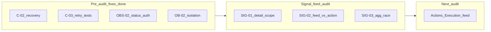

# Signal + Signal Feed — Audit Consolidation

Status: consolidation report  
Date: 2026-06-24  
Mode: audit only — no source changes

## Sources

| Audit | File | Findings |
|-------|------|----------|
| Signal + Signal feed | [`signal_feed_audit.md`](./signal_feed_audit.md) | SIG-01–SIG-10 |
| Onboarding + Observation + AI (prior) | [`onboarding_observation_ai_consolidation.md`](./onboarding_observation_ai_consolidation.md) | C-01–C-09, fix-before-signal-audit list |

**Branch context:** Pre-signal-audit fixes from the prior consolidation are **implemented** on the current branch: C-02 recovery, C-03 retry tests, AI F5 `schema_version`, OBS-02 processing-status auth, OB-02 tenant isolation API tests, OB-04/C-09 doc sync, C-01 `apps/api/AGENTS.md` ownership table.

---

## 1. Audit read

### Signal + Signal feed audit (2026-06-24)

Audited `houston/signals/` end-to-end: creation/aggregation (`apply_pipeline_output`), feed/detail APIs, RBAC (Ma zone vs Vue globale), lifecycle (pin, urgency, cancel, resolve), notifications, realtime invalidation, and frontend `features/signals/`.

**Findings:** 0 P0, 3 P1, 6 P2, 1 P3 (SIG-01–SIG-10).

**Strengths (no action):** Signal feed logic is well-bounded in `signals/`; feed scope oracle parity tests; tenant isolation; canceled-detail pole scope; notification pole union/dedupe; feed query budget enforced; pipeline retry idempotence tested upstream.

**Main risk themes:** RBAC asymmetry between personal feed scope and detail/commands (SIG-01, SIG-02); aggregation race without DB guard (SIG-03); doc/label drift (SIG-05, SIG-06, SIG-08).

### Prior consolidation (onboarding + observation + AI)

Merged three domain audits into 9 themes (C-01–C-09). The fix-before-signal-audit list had 7 items; **6 of 7 are done** on the current branch. **OB-03** (frontend wizard component tests) remains open and deferred.

| Prior item | Status |
|------------|--------|
| C-02 pipeline recovery (`queued` / `retrying` orphans) | Done |
| C-03 + AI F5 Celery retry tests + `schema_version` enforcement | Done |
| OBS-02 processing-status auth (submitter + admin only) | Done |
| OB-02 tenant isolation API suite | Done |
| OB-04 / C-09 doc sync (activity description optional, processing-status implemented) | Done |
| C-01 `apps/api/AGENTS.md` pipeline ownership table | Done |
| OB-03 frontend wizard component tests | **Open** (defer) |

### Upstream handoff

The signal audit treats observation → AI → signal pipeline fixes as done. It validates the handoff at `apply_pipeline_output` → Signal creation/aggregation → feed/detail surfaces. C-03 (divergent AI output on Celery retry) and SIG-03 (concurrent aggregation race) share the symptom (duplicate active signals) but have different root causes.



---

## 2. Findings to fix now

**Criteria:** P0/P1 or high-ROI **S-sized** fixes that do **not** require product sign-off.

| ID | Severity | Size | Action | Tests |
|----|----------|------|--------|-------|
| **SIG-08** | P2 | S | Update [`docs/product/domains/feed_domain.md`](../product/domains/feed_domain.md) §7: feed-visible = `open`, `in_progress`, `resolved` (not "active only"); cross-link [`signal_domain.md`](../product/domains/signal_domain.md) §7 | None — behavior covered by `test_signal_feed_resolved_behavior.py` |
| **SIG-05** | P2 | S | Remove or replace misleading `can_view_signal()` in [`signals/permissions.py`](../../apps/api/houston/signals/permissions.py) so one helper matches `get_signal_for_detail()` (feed-visible + canceled pole rules) | Update [`signals/tests/test_permissions.py`](../../apps/api/houston/signals/tests/test_permissions.py) |
| **SIG-07** | P2 | S | Add realtime after-commit tests for `cancel_signal`, `resolve_signal`, `unpin_signal`, `set_signal_urgency` mirroring pin pattern in [`realtime/tests/test_broadcast.py`](../../apps/api/houston/realtime/tests/test_broadcast.py) | Assert `schedule_establishment_invalidation` with `subject_type=signal`, `reason=signal.updated` |

**Optional stretch (P1, M — only if time before next audit):**

| ID | Severity | Size | Action | Tests |
|----|----------|------|--------|-------|
| **SIG-03** | P1 | M | Partial unique constraint or advisory lock on aggregation key for `ACTIVE_SIGNAL_STATUSES` in [`signals/services.py`](../../apps/api/houston/signals/services.py) | Parallel `apply_pipeline_output` / pipeline → single active signal |

**Explicitly not in fix-now** (blocked on product): SIG-01, SIG-02.

---

## 3. Findings needing product decision

| ID | Question | Options | Default recommendation |
|----|----------|---------|------------------------|
| **SIG-01** | Should `GET /signals/{id}` respect Ma zone scope for Manager/Staff? | (A) Enforce scope on detail → 404 out-of-scope; (B) Keep establishment-wide detail as intentional deep-link model | **(B)** document + extend tests to `resolved` status — matches notification deep-link UX today |
| **SIG-02** | Should Ma zone personal feed use same BU rule as command actionability? | (A) Responsible-only in personal feed; (B) Keep affected ∪ responsible visibility, read-only when not responsible | **(B)** + UX copy on detail when `permission_hints` all false |
| **SIG-06** | Admin duplicate tabs (Ma zone ≡ Vue globale) — hide toggle or keep? | Hide for Owner/Director vs keep with unified labels | Unify **Ma zone** / **Ma vue** labels first (S); hide toggle is product call |
| **SIG-10** | Notify on aggregation? | Defer notification vs add `signal.aggregated` | Document silent aggregation in `signal_domain.md` §8 (MVP acceptable) |

**Tests to add after product decides:**

| ID | Test |
|----|------|
| SIG-01 | API: scoped Manager/Staff reads **resolved** signal outside personal scope — 200 or 404 per decision |
| SIG-02 | API: manager with **affected-only** scope — feed 200, pin/cancel/resolve → 403; `permission_hints` all false on detail |

---

## 4. Findings to defer

| ID | Size | Source | Rationale |
|----|------|--------|-----------|
| **SIG-03** (if not taken in fix-now) | M | Signal audit | P1 data integrity; needs migration design + concurrency test |
| **SIG-04** | S | Signal audit | Aggregation composite index — validate with `EXPLAIN ANALYZE` at scale first |
| **SIG-06** (full UI) | S | Signal audit | Label unification + admin tab collapse — cosmetic; no security impact |
| **SIG-09** | S | Signal audit | URL-persist feed filters; unused `permission_hints` on list — no functional bug |
| **OB-03** | M | Prior consolidation | Frontend wizard component tests |
| **C-06** | L | Prior consolidation | `establishments/services.py` monolith split |
| **OBS-04** | S–M | Prior consolidation | Media preview negative tests |
| **OBS-07** | L | Prior consolidation | Observation realtime vs 2s polling |
| **AI F6** | M | Prior consolidation | Prompt trimming / taxonomy cache |
| **C-04** | S | Prior consolidation | `NOT_ACTIONABLE` dead outcome — align model or docs |
| **C-07** | S | Prior consolidation | Move Celery task out of `signals` — coupled to C-01 |

---

## 5. Findings to ignore for now

- Broad TanStack Query prefix invalidation (works at MVP scale; over-invalidation is cheap)
- Feed query budget — already enforced (`SIGNAL_FEED_MAX_QUERIES_TWO_ITEMS = 8`)
- Report-page deep-link to `signal_ids` from processing-status response
- Pipeline ownership refactor (**C-01** / **C-07**) — documented in `apps/api/AGENTS.md`
- Per-create `count_active_taxonomy_peers_with_different_focus` observability query
- **C-05** / **AI F10** onboarding AI metadata stubs
- **C-08** pipeline domain events (structured logging substitutes)
- Fuzzy `issue_focus` aggregation (explicitly rejected in v4 contract)
- **OBS-08** dead `useCreateChecklistTaskObservationMutation` hook — quick win when touching frontend
- **OBS-09** actor resolution unit tests — integration coverage adequate for MVP

---

## 6. Recommended next audit

**Primary: Actions + Execution feed**

Scope: `apps/api/houston/actions/`, `apps/web/src/features/actions/`, execution feed merge semantics.

Rationale:

- Signals link to Actions (`can_create_action` hints; `resolve_signal` blocked by active linked actions — `SignalBusinessConflictError`)
- Execution feed shares Ma vue/Vue globale pattern — SIG-02 feed-vs-action asymmetry may repeat
- Action realtime invalidates signal queries (`apply-operational-invalidation.ts`); cancel/reopen paths have partial realtime tests only
- Completes operational loop: Signal → Action → Execution → Validation

**Suggested scope:**

- `houston/actions/` — models, services, selectors, API, permissions, `execution_feed.py`
- Execution feed frontend — `features/actions/`, feed tabs, invalidation
- Cross-domain: signal resolve coupling, checklist execution permissions (OBS-10)
- Tests: execution feed API, materialization (`ensure_visible_executions_materialized`), tenant isolation, lifecycle

**Secondary (after Actions):** Comments on Signals — inheritance model, `comment.signal.created` / `comment.signal.inherited` realtime, media/context boundaries.

---

## 7. Short Cursor implementation prompt

```
Implement pre–Actions-audit signal feed quick fixes only. No product RBAC changes.

1. SIG-08: Update docs/product/domains/feed_domain.md — feed-visible statuses are open, in_progress, resolved; link signal_domain.md §7.

2. SIG-05: Align signals/permissions.py with get_signal_for_detail() — remove or replace misleading can_view_signal(); update test_permissions.py.

3. SIG-07: Add realtime/tests cases for cancel_signal, resolve_signal, unpin_signal, set_signal_urgency — mirror test_broadcast.py pin after-commit pattern; assert signal.updated invalidation.

Do NOT change detail/feed scope rules (SIG-01/SIG-02) until product decides.
Do NOT add aggregation DB constraint (SIG-03) in this pass unless explicitly requested.

Validate: make backend-test on signals/tests/test_permissions.py, realtime/tests/, and doc-only change.
```

---

## Summary

| Metric | Count |
|--------|-------|
| Source audits referenced | 2 (+ 3 upstream via prior consolidation) |
| Signal audit findings | 10 (0 P0, 3 P1) |
| Prior fix-before-signal-audit items | 7 (6 done, 1 open) |
| Fix now (no product gate) | 3 (SIG-05, SIG-07, SIG-08) |
| Optional stretch | 1 (SIG-03) |
| Product decisions pending | 4 (SIG-01, SIG-02, SIG-06, SIG-10) |
| Defer | 11 |
| Ignore | 10+ |

**Top 3 before Actions audit:**

1. **SIG-08** — Sync `feed_domain.md` feed-visible statuses (S, doc-only).
2. **SIG-05 + SIG-07** — Align permission helper + realtime lifecycle tests (S, reduces refactor risk).
3. **SIG-01 + SIG-02** — Product decision on feed vs detail RBAC, then tests (blocked).

---

## Changed

- Created `docs/audits/signal_feed_consolidation.md`.

## Validated

- Consolidation derived from [`signal_feed_audit.md`](./signal_feed_audit.md) and [`onboarding_observation_ai_consolidation.md`](./onboarding_observation_ai_consolidation.md); no application source code modified.

## Risks / not verified

- `make backend-test` / `make verify` not executed for this consolidation pass.
- Product confirmation of SIG-01, SIG-02, SIG-06, SIG-10 not obtained.
- SIG-03 aggregation concurrency not tested in-repo.
