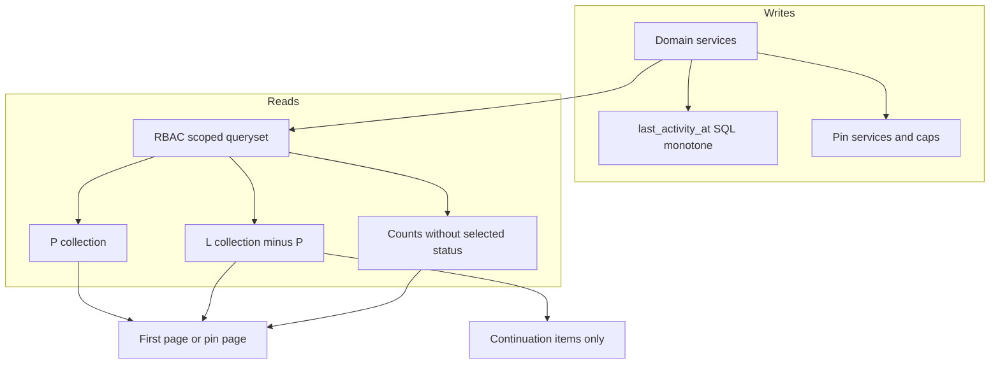

# Feed contracts & pagination — plan V2

## Objectif

Rendre les feeds Signals et Exécution paginables, autorisés et maintenables à la croissance, sans moteur universel, sans double API, et sans casser le détail, l’À venir, le calendrier, les médias ou le RBAC.

**Repo inspecté (V1, inchangé) :** `main` @ `09ff9ac1eb69244025f462f6ede6d27c4e625e1e`. Aucune mesure SQL ni charge n’a encore été exécutée. Cette V2 n’ajoute pas d’audit général.

**Arbitrages produit désormais validés** (ne plus les rouvrir) :

- Counts des filtres alternatifs **indépendants du statut sélectionné**.
- Continuation **autorisée** malgré les reclassements différés ; retrait **immédiat** des éléments devenus inéligibles ; arrêt propre si la génération ne peut plus progresser.
- Historique 7/30/90 = **jours civils Europe/Paris, aujourd’hui inclus**.
- Historique **hérite du scope courant** ; sans scope, **sélection locale explicite** ; **aucun Cross implicite**.
- Cross reste **lecture seule** pour ce chantier.

---

## 1. Verdict sur le cadrage

Inchangé. Le cadrage produit est supérieur à l’existant. Trois tensions avec le dépôt restent :

- `/general` est le profil ; l’Historique est une surface nouvelle branchée depuis cette entrée.
- `FEED_SIGNAL_STATUSES` et `EXECUTION_FEED_CURSOR_STATUSES` sont partagés : créer des ensembles **opérationnels distincts**, ne pas les réduire globalement.
- [`docs/engineering/api_pagination_standard.md`](../../docs/engineering/api_pagination_standard.md) pose encore le Signal Feed sectionné comme référence Tier A : le chantier **remplace** cette référence.

---

## 2. Faits observés (conservés)

### Signals

- Pagination par statut, première GET jusqu’à 5 × `page_size` ([`feed_pagination.py`](../../apps/api/houston/signals/feed_pagination.py)) ; refill client plafonné à 10 pages ([`signal-feed-cache.ts`](../../apps/web/src/features/signals/lib/signal-feed-cache.ts)).
- `resolved` / `canceled` dans le feed ([`constants.py`](../../apps/api/houston/signals/constants.py) L52–54). Aucun count métier API.
- Pins = champs sur `Signal`, OPEN only, sans plafond, sans lock ([`pin_signal`](../../apps/api/houston/signals/services.py) L1277–1303).
- `mark_signal_interesting` retire l’épingle (L1328–1330). Pin/unpin avancent `last_activity_at`.
- L’UI actuelle dérive la zone épinglée **uniquement des items `open`** ([`signal-display.ts`](../../apps/web/src/features/signals/lib/signal-display.ts)). Un intéressant encore épinglé ne serait pas représenté comme le cadrage l’exige.
- Cross matérialise tous les UUID avant LIMIT ([`selectors.py`](../../apps/api/houston/signals/selectors.py) L325–342).
- Détail et médias réutilisent `FEED_SIGNAL_STATUSES` : ne pas y greffer le queryset opérationnel.

### Exécution

- Une liste curseur (ossature conservable) qui mélange actifs + terminaux ; jusqu’à 50 `scheduled_items` + counts à chaque page ([`execution_feed.py`](../../apps/api/houston/action_plans/execution_feed.py) L96–122).
- Pins membership : bon modèle, plafond 3 absent ; unpin terminal déjà conforme.
- P et L partagent le même `ORDER BY` `-is_feed_pinned` : à remplacer par deux lectures.
- GET exécute matérialisation + promotion : Celery reste le nominal ; le GET est un rattrapage à borner et mesurer.
- `pending_validation` n’est pas trié par demande courante (`marked_done_at`).
- Détail ≠ queryset feed : conservable.

### Activité

Réutiliser `last_activity_at`. Un `save()` Python avec `last_activity_at = now` **ne garantit pas** la monotonie : deux writers concurrents peuvent chacun relire une ancienne valeur et réécrire la plus petite. `GREATEST` appliqué seulement en mémoire sur une instance déjà chargée a le même trou.

### Frontend

Un codebase, deux caches. Pas de pull-to-refresh. « Afficher plus » nominal. Sections repliables à abandonner sur Tout. Cross déjà sans actions. Reconnect omet `['signals','cross-feed']` et upcoming.

### Historique

Pas d’endpoint. Journaux de cycle de vie en écriture. Dates terminales parfois nulles. `cancel_origin` actuel ne distingue pas proprement une cascade.

---

## 3. Direction technique

Principes inchangés : remplacer les contrats dans la même PR que le frontend ; deux domaines, vocabulaire commun mince (curseur opaque + rejet de contexte) ; P et L = deux lectures serveur ; constantes opérationnelles nouvelles ; pas de Redis, snapshot, flag, virtualisation a priori ; matérialisation async nominale.

**Séquencement Signals (correction V2).** Ne pas activer au Lot 2 l’éligibilité INTERESTING, la conservation d’épingle, le plafond 5 ou le remplacement : l’UI actuelle ne montre les pins que depuis la section `open` et n’a ni carousel filtré ni picker de remplacement. Ces writes partent avec le Lot 4 (contrat + UI). Le Lot 1 peut cesser d’avancer `last_activity_at` sur pin/unpin (invisible). Le Lot 2 ne traite que les **pins Exécution**.

---

## 4. Contrats cibles et invariants

### Envelope opérationnel

Première page / refresh :

- `items` : page L (défaut 25, max 50), hors P
- `pins` : voir contrats P ci-dessous
- `counts` : totaux autorisés, **sans** le statut sélectionné (validé)
- `scheduled` Exécution : `{ count, next: { id, start_at, title } | null }` — plus de `scheduled_items[50]`
- `next_cursor` / `has_more` pour L
- `applied_filters` / `view_mode` inchangés sémantiquement

Continuation L : `items`, `next_cursor`, `has_more`. Pas de recount, pas de scheduled, pas de pins. Curseur hors contexte : **400** `cursor_context_mismatch`.

`has_more` = `limit+1` uniquement. Réponse vide + `has_more=true`, ou curseur qui ne progresse pas (même identifiant de tête) : le client **arrête** et propose retry — pas de boucle.

### Counts (validé)

Périmètre, personal/general, pôles/sujets et autres filtres **hors statut**. Compteur de zone épinglée = P filtré.

- Signals : Ouverts / En cours / Intéressants = **L seulement** ; Épinglés = |P filtré| ; Tout affiché = |P|+|L| si affiché, chaque signal une fois
- Exécution : catégories = **P+L** de la catégorie ; Épinglés = sous-total, non additionné aux totaux métier

### Pins Signals — établissement

- Collectif, **cinq maximum par établissement**, tous filtres/vues/appareils confondus
- Éligible : `open` et `interesting` seulement ; ouvert ↔ intéressant **conserve** l’épingle ; in_progress / resolved / canceled : retrait atomique avec la transition
- Zone = les épingles **éligibles au filtre actif** (sous Intéressants : intéressants épinglés ; sous En cours : zone absente)
- Toutes les épingles éligibles au périmètre/vue/filtres sont **exclues de L**, y compris si la zone est vide pour le filtre courant
- Première réponse : jusqu’à 5 cartes (pas de pagination P établissement : le plafond = la collection)
- Ordre : `pinned_at DESC`, `id DESC` ; ré-épingler un déjà épinglé : no-op sur la date
- Mutation : établissement seulement ; 409 sans `replace_pin_id` autorisé, **sans** fuite des pins invisibles (RB02)

### Pins Signals — Cross (lecture seule)

- Même plafond **cinq par établissement** ; **aucun plafond global Cross** qui cacherait définitivement des épingles autorisées
- Collection P Cross = union des pins visibles, ordre `pinned_at DESC`, `id DESC`, établissement identifié sur chaque carte
- Chargement **progressif et borné** (page P distincte, reco 10, max 50) jusqu’à épuisement de P autorisé ; `pins_has_more` / `pins_next_cursor`
- Pas d’API pin/unpin Cross ; pas de fetch intégral en arrière-plan
- Exclusion de L : toutes les pins correspondant au filtre/périmètre, même non encore chargées dans l’aperçu

### Pins Exécution

Inchangé vs V1 : 3 par utilisateur/membership et établissement ; Cross aperçu 3 + suite sur place, toutes exclues de L ; lecture seule en Cross ; unpin terminal pour tous les membres.

### Curseurs et changement de périmètre Cross

Opaque `v1`. Payload : collection `L|P`, `view_mode`, hash des filtres, **empreinte d’autorisation**, tuple de tri, id, `as_of` (Exécution).

L’empreinte n’est pas la liste des `establishment_id`. Elle identifie le **périmètre d’autorisation effectif** qui a produit la collection — tout ce qui, dans les selectors actuels, peut changer les lignes visibles à établissements constants : rôle, membership actif, `view_mode`, et scopes métier (pôles / `MembershipScope` déjà utilisés par `build_signal_feed_scope_q_v2` et les Q personal/general Exécution).

Représentation : hash opaque stable, recalculé à chaque requête depuis les memberships **déjà résolus** par la vue (`resolve_management_memberships_for_scope` en Cross ; le membership courant en établissement). Tuple canonique trié, par membership contributeur : `(membership_id, establishment_id, role, status, frozenset des business_unit_id de scope)`. Y ajouter `view_mode` et le hash des filtres déjà dans le curseur. Ne pas embarquer le `Q` SQL ni des titres. Même fonction d’empreinte pour établissement et Cross (Cross = concaténation triée des tuples).

Invalidation :

- Serveur : recomputer l’empreinte sur l’état membership/scope **vivant** ; divergence → **400** `cursor_context_mismatch` (changement de rôle, de pôles, d’activation, d’ensemble d’établissements, ou de `view_mode`/filtres)
- Client : jeter curseur et continuations, page 1 du nouveau périmètre, sur 400, bootstrap, `access.revoked`, invalidation membership/scope, reconnect
- Un curseur établissement n’est jamais rejoué sur Cross et inversement

Tie-breakers (à figer en tests) :

- Exécution À valider : `marked_done_at ASC NULLS LAST`, `id ASC`
- En retard / En cours datées : `end_at ASC`, `last_activity_at DESC`, `created_at DESC`, `id DESC`
- Sans échéance : `last_activity_at DESC`, `created_at DESC`, `id DESC`
- Pins Exécution : `pinned_at ASC`, `id ASC`
- Signals L : `last_activity_at DESC`, `created_at DESC`, `id DESC` ; Tout : open → in_progress → interesting
- Pins Signals : `pinned_at DESC`, `id DESC`

Overdue : `end_at < as_of` (strict). `as_of` figé pour la génération du parcours. Revalidation bornée au prochain `end_at` visible ou reprise — pas un tick par carte.

### Continuation, reclassement, inéligibilité (validé)

- Défilement : **continue le curseur / `as_of` / génération courants**
- Reclassement des objets **toujours éligibles** : différé pendant une lecture défilée ; bandeau « Mises à jour » ; refresh reconstruit le parcours
- Objet devenu **inéligible** (terminal, filtre, périmètre, révocation) : **retrait immédiat** de cette collection, ancre voisine préservée, même si le reclassement général attend
- Si la génération ne peut plus progresser (vide + `has_more`, curseur identique, 400 contexte, auth) : **arrêt propre**, cartes conservées, retry local — pas d’auto-continue

### Mémoire client (bornée, sans limite fonctionnelle du parcours)

**Invariant :** les données de reprise, d’ancrage et de déduplication conservées côté client restent **à cardinalité bornée** (fenêtre fixe + enregistrements O(1)). Cela ne borne pas la profondeur du feed : tant que `has_more`, l’utilisateur peut continuer. Interdit : chaîne d’ids/cursors qui croît avec le nombre de pages vues.

Le serveur reste la limite de page (25/50). Pas de `maxPages` TanStack comme fin de feed.

Mécanique :

- **Fenêtre hydratée à taille fixe** : page 1 de la génération courante (retour haut) + pages autour du viewport + au plus une page préchargée en avant. Chaque slot : items, `request_cursor`, `next_cursor`. Evincer un slot **supprime** ses items, ids et cursors.
- **Dédup** : uniquement le set d’ids de la fenêtre hydratée, pas l’historique des ids croisés.
- **Reprise / ancre (O(1), remplacés, jamais empilés)** : génération, category, filtres, empreinte d’autorisation, `anchorId`, `neighborId`, `resume_cursor` (curseur de la page qui contenait l’ancre). Retour détail : scroll si hydraté ; sinon refetch de `resume_cursor` puis seek ; sinon voisin ; si l’objet a quitté L/P, seek voisin.
- **Scroll avant** : `next_cursor` de la tête de fenêtre ; la page qui sort par l’arrière est évincée (sauf la page 1).
- **Zone évincée** : pas d’index sparse croissant. Refetch **à la demande** depuis le `request_cursor` encore retenu le plus proche (bord de fenêtre ou page 1). Une reconstruction ponctuelle n’est pas une chaîne stockée. Si le curseur de cette zone n’existe plus, on ne fabrique pas la page ; retry / reprise depuis le bord retenu ou refresh.
- Auto-load : une continuation in-flight, un préchargement d’approche — n’empêche pas d’aller plus loin, n’empêche pas d’évincer.
- Virtualisation : seulement si la mesure de rendu, à fenêtre déjà bornée, l’exige

### Historique

- Endpoints nouveaux : `…/history/signals/` et `…/history/executions/` ; Cross **explicite** seulement si l’utilisateur est déjà en scope Cross, jamais déduit
- Sans scope : écran de **sélection locale d’établissement**, pas d’appel Cross, pas de dernier établissement implicitement réutilisé comme vérité métier (le contexte terrain courant, s’il existe, est hérité ; s’il n’existe pas, l’utilisateur choisit)
- 7/30/90 : jours civils Paris **inclusifs se terminant aujourd’hui** ; custom = `[from 00:00, to 24:00)` Paris ; `all` sans borne
- Ordre : date terminale DESC, `id DESC` ; groupement quotidien client sur cette date (en-têtes type upcoming)

**Dates terminales — pas d’omission silencieuse :**

1. Champ direct s’il est présent (résolution / annulation signal ; `validated_at` / `marked_done_at` / `canceled_at` exécution selon l’état)
2. Sinon **dernier lifecycle event fiable** du type terminal correspondant (occurred_at) — utilisé pour filtrer, trier et grouper, et exposé comme date dérivée d’événement, pas comme champ métier inventé
3. **Orphelins** (ni champ ni event fiable) : Lot 0 les compte. Ils restent **visibles** dans l’Historique, groupe explicite « Date inconnue », ordre `id DESC`, hors 7/30/90 calendaires (inclus dans `all` et, si on filtre une période, **exclus de cette période avec un compteur/état local** « N sans date » — pas un drop invisible). Traitement durable (réparation opérateur vs laisser le groupe) **après inventaire**, pas un `updated_at` de substitution

Entrée UI : lien Historique depuis [`profile-page.tsx`](../../apps/web/src/features/auth/pages/profile-page.tsx), page `/general/history`, pas de 5e icône bottom nav.

### Activité

Matrice inchangée (avance / n’avance pas). Rejet et annulation requester de résolution : avancent. Approve : transition terminale.

**Monotonie réelle sous concurrence :**

- `touch_*` = `UPDATE … SET last_activity_at = GREATEST(last_activity_at, :now)` (expression SQL / `Greatest(F('last_activity_at'), Value(now))`), pas un `instance.last_activity_at = now` + `save()` sur une copie potentiellement stale
- Tout writer qui sauve d’autres champs dans la même transaction : `select_for_update` puis `last_activity_at = max(locked.last_activity_at, now)`, **ou** touch SQL séparé après le save métier **sans** renvoyer `last_activity_at` depuis l’instance stale
- Interdit : inclure `last_activity_at` dans `update_fields` d’un `save()` dont la valeur a été lue avant un writer concurrent
- Test : deux transactions, un `now` plus ancien qui commit après un plus récent **ne recule pas** la colonne (AC03)

Origine cascade (toujours reco Lot 6, pas validée produit au-delà) : `origin` = chemin, `actor` = initiateur ; pas de backfill ; ancien `manual`+actor None → exposer `unknown` si on ne peut pas prouver le chemin.

---

## 5. Conserver / remplacer / supprimer

Inchangé, avec une précision : les writes d’éligibilité / conservation / plafond Signals ne remplacent l’existant **qu’avec** le contrat et l’UI du Lot 4.

---

## 6. Lots

Chaque lot = PR bout-en-bout. Pas de dual envelope.

### Lot 0 — Mesure et inventaire

EXPLAIN des lectures actuelles (y compris Cross UUID). Compter : pins Exécution > 3 par membership ; pins Signals ; pins inéligibles ; terminaux avec champ date ; terminaux sans champ mais **avec** event fiable ; **orphelins** (ni champ ni event) ; `cancel_origin` atypiques.

### Lot 1 — Activité

Fichiers : services signals / action_plans / comments / `execution_update` / resolution requests.

Touch SQL monotone ; commentaires create ; plus de touch sur pin/unpin ; update exécution seulement si échéance/affectation (tâches déjà via `touch_execution_activity`). Tests AC01–AC03 y compris course stale-save. Pas de réécriture historique des timestamps.

### Lot 2 — Pins Exécution seulement

Plafond 3, replace atomique, concurrence EX07. Cross lecture seule. Trim démo déterministe (plus anciennes conservées) **si** l’inventaire le montre.

**Hors lot :** éligibilité INTERESTING, conservation d’épingle, cap 5, replace Signals.

### Lot 3 — Feed Exécution (contrat + UI)

Constante opérationnelle ≠ upcoming/calendar. P/L, category, scheduled slim, curseur v1 + empreinte d’autorisation (membership/rôle/scopes, pas seuls les établissements), rattrapage GET borné/loggé. Schema + generate + hooks/cache/page. Auto-load L, pins query séparée (Cross 3 + suite). Tests EX*, PG*, CT01, TM01, MU01.

### Lot 4 — Feed Signals + pins Signals (contrat + UI)

Pagination globale ; Cross SQL combiné ; counts validés ; **ici seulement** : OPEN+INTERESTING, conservation, cap 5, replace, carousel établissement (≤5) et Cross progressif sans plafond global. Suppression de `paginate_signal_feed_sections`. Tests SI*, CT02, RB02, CT03.

### Lot 5 — Chargement / refresh / realtime

Pull-to-refresh mobile ; bouton desktop ; bandeau ; refresh = nouveau parcours, même filtre. Génération : ignorer stale ; refresh échoué = garder l’affichage (ER01). Continuation selon §4. Reconnect : cross-feed + upcoming. Mémoire §4 (fenêtre fixe, pas de chaîne d’ids). Invalidation curseur dès changement d’empreinte d’autorisation (rôle, pôles, membership, établissements, bootstrap, révocation, reconnect).

### Lot 6 — Historique

Selectors RBAC type détail/liste close. Périodes Paris validées. Scope hérité / sélection locale. Dates : champ → event fiable → orphelins visibles selon règle §4. HI01–HI05. Décision de réparation des orphelins **après** les chiffres du Lot 0, dans ce lot.

### Lot 7 — Docs

[`api_pagination_standard.md`](../../docs/engineering/api_pagination_standard.md), [`feed_domain.md`](../../docs/product/domains/feed_domain.md), domaines liés. Pas de nouveau cadrage.

---

## 7. Tests et mesures

Inchangés dans l’esprit : `make backend-test` ciblé, `npm test` ciblé, `make schema` + `make web-api-generate` à chaque contrat. Mesures avant/après Lots 3–4 sur données synthétiques (Mama insuffisant). Recette desktop / mobile web / Capacitor.

Ajouter : tests de curseur dont l’empreinte d’autorisation change à établissements constants (rôle ou pôles) et à ensemble d’établissements changé ; test de continuation qui retire un inéligible sans reset ; test d’arrêt sans progression ; test Historique orphelin visible ; test `UPDATE GREATEST` concurrent.

---

## 8. Impacts et risques

Inchangés (breaking API volontaire, constantes partagées, index après EXPLAIN, GET qui écrit encore). Risque séquencement **refermé** : plus de pin Signals « cible » derrière l’ancienne UI.

---

## 9. Hors périmètre

Calendrier, catalogue, offline, subscriptions, virtualisation a priori, Redis, refonte DA, bus, clôtures auto, **actions Cross**.

---

## 10. Arbitrages

**Plus bloquants pour implémenter** : counts, continuation, 7/30/90, scope Historique, Cross lecture seule.

**Pendant la préparation (ne bloquent pas Lots 1–4) :**

- Origine cascade (reco inchangée : chemin + acteur ; pas de backfill).
- Trim pins démo hors plafond (après Lot 0).
- `page_size` P Cross et seuil d’intersection observer (reco 10 / ~400px) — budgets techniques, pas un plafond métier global.
- Traitement durable des orphelins Historique (groupe « Date inconnue » dès le Lot 6 ; réparation opérateur seulement si l’inventaire le justifie).
- Writers d’activité non nommés : Lot 1 selon la matrice ; écart non nommé = question, pas une invention.

**Non vérifié (mesure) :** plans SQL, latences, volume orphelins/pins, contention du GET matérialisant, coût réel de la fenêtre d’éviction vs tout garder en mémoire aux volumes démo.
