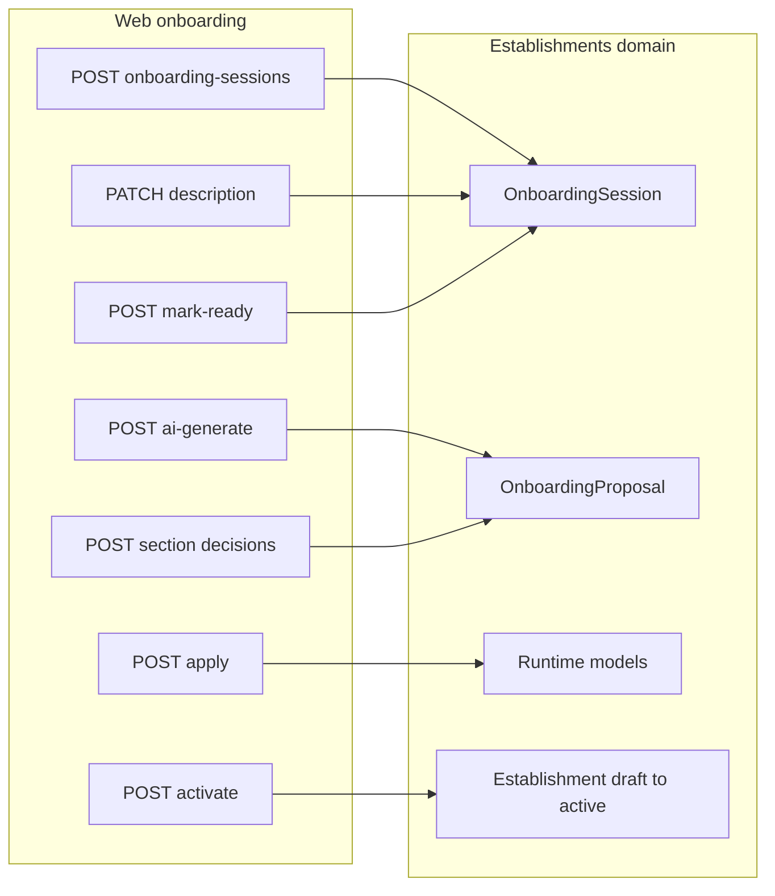

# Phase 2 Closure Pass Action Plan

## 1. Current baseline

**Authority (per [phase_2_runtime_config_onboarding.md](docs/product/build_plan_mvp/phase_2_runtime_config_onboarding.md)):** code → tests → [apps/api/schema.yml](apps/api/schema.yml) → domain docs → build plan.

**Reported implementation state (Sub-phase 10, tests green):**

| Area | Location | Status |
|------|----------|--------|
| Models | [apps/api/houston/establishments/models.py](apps/api/houston/establishments/models.py) | `OnboardingSession`, runtime models, `OnboardingProposal` |
| Access / RBAC | [access.py](apps/api/houston/establishments/access.py), [permissions.py](apps/api/houston/establishments/permissions.py) | `get_onboarding_access_context` (owner/director on draft/active); membership RBAC separate |
| Services | [services.py](apps/api/houston/establishments/services.py) | Session, description, readiness, mark-ready, activate, proposal validate/apply |
| AI provider | [ai_onboarding.py](apps/api/houston/establishments/ai_onboarding.py) | OpenAI → `OnboardingProposal` only; template fallback |
| AI usage log | [apps/api/houston/ai/models.py](apps/api/houston/ai/models.py) | Metadata-only `AIUsageLog` |
| API | [api/urls.py](apps/api/houston/establishments/api/urls.py), [api/views.py](apps/api/houston/establishments/api/views.py) | 13 onboarding-session routes in OpenAPI |
| Frontend | [apps/web/src/features/onboarding/](apps/web/src/features/onboarding/) | `/onboarding` flow: start → description → proposals → runtime read → activation |
| Contract | [schema.yml](apps/api/schema.yml) + [types.ts](apps/web/src/api/generated/types.ts) | Generated types; feature re-exports via [types.ts](apps/web/src/features/onboarding/types.ts) |

**OpenAPI onboarding routes (confirmed in schema):** create, retrieve, description PATCH, runtime-config GET, activation-summary GET, mark-ready POST, activate POST, proposals list/retrieve, ai-generate POST, section decision POST, reject POST, apply POST.

**In-flight git changes (closure must re-verify before sign-off):** `serializers.py`, `urls.py`, `views.py`, `services.py`, `test_onboarding_api.py`, `test_onboarding_proposal_api.py`, `test_services.py`, `schema.yml`.

**Documentation drift (known):** [phase_2_runtime_config_onboarding.md](docs/product/build_plan_mvp/phase_2_runtime_config_onboarding.md) § “Current implementation baseline” still lists most Phase 2 APIs as *not implemented*; §5 still marks OpenAI/`AIUsageLog` out of scope while §6 and code implement them. Closure must reconcile doc with code, not change product behavior.



---

## 2. Closure scope

**In scope:** verification, documentation alignment, contract regeneration sanity, targeted test gaps, safe cleanup, risk register, Phase 3 entry checklist.

**Out of scope:** new endpoints, UI redesign, Observation Pipeline AI, migrations (unless `makemigrations --check` fails), generic refactors, Phase 3 implementation.

**Fix policy:** only small, scoped fixes for confirmed bugs/inconsistencies (e.g. wrong capability gate, schema drift, missing Staff denial test). No API contract changes unless a real bug is proven.

---

## 3. Scope audit checklist

Map each Phase 2 requirement to evidence. Mark: **Implemented** | **Deferred (document)** | **Gap (fix or defer)**.

### Sub-phase / foundation (build plan §2–3)

| Requirement | Verify in | Expected |
|-------------|-----------|----------|
| `OnboardingSession` + constraints | `test_models.py`, migrations | One non-terminal session per establishment |
| Runtime models + establishment scope | `test_models.py` | Keys scoped; tags/hints not RBAC |
| Activity description ≥ 50 chars | `test_onboarding_api.py`, services | Rejected below minimum |
| Onboarding access helper (draft/active, owner/director) | `test_access.py` | Separate from Phase 1 bootstrap |
| Draft excluded from bootstrap | `test_onboarding_api.py::test_draft_onboarding_membership_remains_excluded_from_bootstrap` | Unchanged Phase 1 |
| Activation readiness + summary | `test_services.py`, activation-summary API | Server-side blockers |
| `mark_onboarding_ready_for_activation` | mark-ready API tests | Does not activate establishment |
| `activate_onboarding_session` | activate API tests | Draft → active + session terminal |

### API (build plan §4)

| Requirement | Evidence | Notes |
|-------------|----------|-------|
| Session create/retrieve | OpenAPI + `test_onboarding_api.py` | `source_mode`: manual/template only at create; `ai` rejected |
| Description PATCH | schema + tests | Canonical description |
| Runtime config read | GET `runtime-config` | **No PUT** in schema—write path is proposal apply (see deferral) |
| Activation summary | GET `activation-summary` | Includes `access`, `readiness`, `effective_can_activate` |
| Mark-ready + activate commands | POST endpoints | Not generic PATCH |
| Post-activation establishment runtime GET | schema grep | **Absent**—optional per build plan; defer if not needed for MVP |

### OnboardingProposal (build plan §5)

| Requirement | Evidence | Notes |
|-------------|----------|-------|
| Model + apply service | `test_onboarding_proposals.py` | Shared manual/template/AI path |
| Caps + catalog validation | service + AI tests | Max modules/domains/units/etc. |
| No roles/memberships/billing/checklists/signals | validation tests | |
| Section accept/skip | proposal API tests | `accepted` / `skipped` |
| Human validation before apply | apply tests | |
| Apply resets readiness | services + tests | `ready_for_activation_at` cleared; re-mark-ready required |

### AI onboarding (build plan §6)

| Requirement | Evidence | Notes |
|-------------|----------|-------|
| Real provider integration | `ai_onboarding.py`, `test_ai_onboarding.py` | Backend-only |
| Input excludes PII | `test_ai_onboarding.py` | No emails/usernames in serialized input |
| Output → proposal only | provider + API tests | No direct runtime mutation on generate |
| Template fallback | AI tests + `test_ai_generate_fallback_returns_template_without_leakage` | |
| `AIUsageLog` metadata | `ai/models.py`, usage tests | No prompt/output/key fields |
| `cost estimate` in build plan | model fields | **Gap → defer** (no cost column) |
| `STARTED` / `FAILED` log statuses | `ai_onboarding._write_usage_log` | **Defer** (only succeeded/fallback_* written) |

### Frontend (build plan §7–8)

| Requirement | Evidence | Notes |
|-------------|----------|-------|
| Generated types + hooks | `hooks.ts`, `api.ts` | TanStack Query; no Zustand server state |
| Mobile-first onboarding UI | `onboarding-page.tsx` + cards | Loading/error/empty states |
| Description 50-char UX | `activity-description-card.tsx` | Reflect backend errors |
| Section validation UX | `proposal-card.tsx` | Accept/skip per section |
| Activation summary + activate | `activation-summary-card.tsx` | Backend gating only |
| Manual runtime setup without AI | UI + API | **Audit carefully:** UI starts `manual` session but populates runtime via **AI generate** or **backend template fallback**; no HTTP `create_manual_proposal`; runtime card is **read-only** |
| Template session start in UI | `onboarding-page.tsx` | Hardcodes `source_mode: 'manual'`; backend supports `template` |
| AI claims only when proposal exists | proposal card copy/behavior | No false “AI succeeded” without stored proposal |

**Deferred items to document explicitly (not Phase 2 blockers if defaults accepted):**

- `PUT /runtime-config/` (replaced by proposal apply + membership setup outside onboarding API)
- HTTP manual/template proposal create (service-level only; tests use factories)
- `GET /establishments/{id}/runtime-config/` post-activation
- `list_onboarding_sessions` API (selector exists, no route)
- `AIUsageLog` cost + `STARTED`/`FAILED` rows
- UI template-start and fully manual runtime CRUD without AI

---

## 4. Code consistency audit

**File placement (expected):** onboarding/runtime/proposal in `houston.establishments`; AI usage model in `houston.ai`; provider in `establishments/ai_onboarding.py`—document as intentional unless team wants `ai/` provider module later (no move in closure).

| Check | Files | Action |
|-------|-------|--------|
| Thin views | [api/views.py](apps/api/houston/establishments/api/views.py) | Confirm commands call services only |
| Serializers vs services duplication | [serializers.py](apps/api/houston/establishments/api/serializers.py) vs `build_activation_summary` `_serialize_*` | Note dual paths; acceptable if shapes match—spot-check one activation-summary response |
| Dead selector | `get_activation_summary_for_session` | Use in views or remove in cleanup if unused |
| Dead permission helper | `CanManageRuntimeContext` in [permissions.py](apps/api/houston/establishments/permissions.py) | Onboarding uses `get_onboarding_access_context`; document or remove unused export |
| Duplicated constants | `_ONBOARDING_MANAGEMENT_ROLES` in access + selectors | Optional tiny dedup only if zero risk |
| Naming | `SourceMode.AI` vs `Source.AI_PROPOSED` | Document mapping; no rename unless bug |
| Activate capability mismatch | `OnboardingSessionActivateView` uses `configure_runtime`; `MarkReadyView` uses `activate` | **Verify intent:** service activate checks `can_manage` + draft; align view capability only if post-draft leak found |
| 403 vs 404 | command helper in views | Document obfuscation policy; ensure clients handle both |
| Frontend flow | [api.ts](apps/web/src/features/onboarding/api.ts) → [hooks.ts](apps/web/src/features/onboarding/hooks.ts) → components | No `fetch` in components |
| Query invalidation | activate success | Must invalidate auth bootstrap (confirm in `hooks.ts`) |
| Test fixtures | repeated `create_onboarding_session` across test files | Optional extract—low priority cleanup |

---

## 5. Security and privacy audit

| Control | How to verify | Pass criteria |
|---------|---------------|---------------|
| No OpenAI in frontend | grep `apps/web` for `openai`, `OPENAI`, `VITE_OPENAI` | Zero matches (already clean) |
| No `VITE_*` secrets | `.env.example`, web config | Only `VITE_API_BASE_URL` |
| API key server-only | [config/settings.py](apps/api/config/settings.py) `OPENAI_API_KEY` | Never in schema/types/responses |
| No raw prompt/output in logs | `ai_onboarding.py`, `test_ai_onboarding.py` | Tests: no prompt field on `AIUsageLog`; no activity text in log serialization |
| `AIUsageLog` metadata only | [ai/models.py](apps/api/houston/ai/models.py) | No TextField for prompts; API does not expose logs |
| Proposal payload in API | `OnboardingProposalResponse` | Structured proposal only—confirm no provider raw dump field |
| AI input contract | `build_ai_onboarding_input` | No nominative user data (existing tests) |
| Tenant isolation | path `session_id` + selectors | Foreign session → 404; mismatched proposal → denied |
| Phase 1 preservation | draft bootstrap test | Draft not in active workspace list |

**Manual spot-check during smoke:** browser network tab shows no third-party OpenAI calls; only `/api/v1/onboarding-sessions/...`.

---

## 6. RBAC and tenant isolation audit

**Rule summary:** Owner/Director with active membership on draft/active establishment → manage/configure; activate requires draft establishment + readiness + mark-ready; Manager/Staff → denied for commands; reads scoped by `get_onboarding_session_for_actor` (owner/director only).

| Surface | Owner/Director | Manager | Staff | Unauthenticated |
|---------|----------------|---------|-------|-----------------|
| Create session | allow | deny (403/404) | deny | 401 |
| GET session/runtime/summary | allow | 404 (no selector match) | 404 | 401 |
| PATCH description | allow | 403 on commands | untested → **add closure test** | 401 |
| AI generate | allow | 403 (test exists) | **add test** | 401 |
| Section decision / reject / apply | allow | 403 (test exists) | **add test** | 401 |
| Mark-ready | allow (draft) | 403 (test exists) | **add test** | 401 |
| Activate | allow when ready | 403 (test exists) | **add test** | 401 |
| Cross-tenant session/proposal | 404 | 404 | 404 | 401 |

**Closure actions:** run existing tests; add **Staff** matrix tests mirroring Manager if any gap; confirm Manager cannot GET another establishment’s session by ID guessing (404 not 200).

**Post-activation:** `can_activate` false for active establishment; activate on active establishment → conflict (existing test).

---

## 7. End-to-end smoke test plan

**Prerequisites:** `make up` (or equivalent stack); seed or API fixtures: active org, **draft** establishment, owner user (and optional manager for negative check); `OPENAI_API_KEY` set for live AI path OR rely on template fallback after forced provider failure.

**Entry:** App → workspace link to `/onboarding?establishmentId={draft_establishment_uuid}` (see [app-page.tsx](apps/web/src/app/app-page.tsx)).

| Step | Action | Expected |
|------|--------|----------|
| 1 | Start onboarding | 200/201; session id in URL; status `started` or resumed non-terminal |
| 2 | Submit activity description (≥50 chars) | 200; session advances; description in runtime-config GET |
| 3 | Generate AI proposal | 201/200; new proposal in list; `source` ai_proposed or template on fallback; runtime unchanged |
| 4 | Accept required sections (modules, domains); skip optional (vocabulary/tags/routing/units) | Section decisions 200; proposal moves toward validated |
| 5 | Apply proposal | 200; runtime-config shows modules (≥1) and domains (≥3) |
| 6 | Inspect activation summary | `readiness.is_ready` true when memberships satisfy minimums (may need membership API setup pre-activation) |
| 7 | Mark ready | Session `ready_for_activation`; `ready_for_activation_at` set |
| 8 | Activate | Establishment `active`; session `activated` |
| 9 | Workspace access | `GET /api/v1/auth/bootstrap/` includes establishment; switch/select works |
| 10 | Negative | Manager token on mark-ready/activate → 403 |

**Membership prerequisites for activation (manual setup outside onboarding UI if blockers appear):** ≥1 active owner/director; ≥1 active/invited manager with operational domains assigned—use existing membership APIs under `/api/v1/establishments/{id}/memberships/`.

**Optional scripted smoke (closure artifact, not product feature):** thin `scripts/smoke_phase2_onboarding.sh` calling API with bearer token—only if team wants repeatability; otherwise manual checklist above is sufficient.

**Re-apply regression:** after apply, confirm mark-ready is blocked until readiness re-met (apply clears `ready_for_activation_at`).

---

## 8. OpenAPI and frontend contract audit

1. Regenerate schema: `make schema` → diff [schema.yml](apps/api/schema.yml) (should be clean or only intentional backend doc tweaks).
2. Regenerate types: `make web-api-generate` → diff [types.ts](apps/web/src/api/generated/types.ts).
3. Confirm **no manual edits** in generated file (header only; “manual” strings are schema descriptions).
4. Cross-check operations exist in both:
   - `v1_onboarding_sessions_*` operations in types `paths`
   - Feature wrappers in [api.ts](apps/web/src/features/onboarding/api.ts) match paths/methods
5. Confirm **removed/never-implemented** candidates are absent: `PUT runtime-config`, establishment-level activate, `AIUsageLog` in components schemas.
6. Commit rule: `schema.yml` and `types.ts` committed together after regeneration.

---

## 9. Test/check commands

Run from repo root unless noted. Prefer `make verify` as the final gate when Docker stack is up.

### Backend focused (Phase 2)

```bash
cd apps/api && uv run pytest houston/establishments/tests/test_models.py -q
cd apps/api && uv run pytest houston/establishments/tests/test_access.py -q
cd apps/api && uv run pytest houston/establishments/tests/test_permissions.py -q
cd apps/api && uv run pytest houston/establishments/tests/test_selectors.py -q
cd apps/api && uv run pytest houston/establishments/tests/test_services.py -q
cd apps/api && uv run pytest houston/establishments/tests/test_onboarding_proposals.py -q
cd apps/api && uv run pytest houston/establishments/tests/test_ai_onboarding.py -q
cd apps/api && uv run pytest houston/establishments/tests/test_onboarding_api.py -q
cd apps/api && uv run pytest houston/establishments/tests/test_onboarding_proposal_api.py -q
cd apps/api && uv run pytest houston/establishments/tests/ -q
```

### Backend full + hygiene

```bash
cd apps/api && uv run pytest -q
cd apps/api && uv run ruff check .
cd apps/api && uv run ruff format --check .
cd apps/api && uv run python manage.py makemigrations --check --dry-run
cd apps/api && uv run python manage.py check
```

### Docker / Make equivalents (when compose is running)

```bash
make test
make lint
make schema
make migrations-check
make check
make verify    # check + test + lint + schema + migrations-check + web-typecheck + web-build
```

### Frontend

```bash
make web-api-generate
make web-typecheck
cd apps/web && npm run lint
make web-build
```

### Phase 1 regression (onboarding must not break auth)

```bash
cd apps/api && uv run pytest houston/accounts/tests/test_auth_api.py -q
```

---

## 10. Documentation update plan

| Document | Update |
|----------|--------|
| [phase_2_runtime_config_onboarding.md](docs/product/build_plan_mvp/phase_2_runtime_config_onboarding.md) | Set **Status: Complete**; replace “not implemented” baseline with implemented endpoint/model list; mark sub-phases 1–8+ done; add **Closure notes** section |
| [houston_mvp_build_plan.md](docs/product/build_plan_mvp/houston_mvp_build_plan.md) | Mark Phase 2 ✅ with link to closure notes |
| [apps/api/AGENTS.md](apps/api/AGENTS.md) / root [AGENTS.md](AGENTS.md) | Only if OpenAPI command path needs clarifying (already documents `make schema` via Makefile) |
| New subsection in phase 2 doc: **Known debt / risks** | See §12 below |
| New subsection: **Phase 3 entry assumptions** | See §13 |
| Security domain doc | If [docs/product/domains/security_rgpd_domain.md](docs/product/domains/security_rgpd_domain.md) mentions onboarding AI, align with actual logging boundaries |

**Do not** expand archived `docs/archive/codex/` unless explicitly requested.

---

## 11. Cleanup plan

Safe-only, after audits pass:

- `ruff format` / fix unused imports in touched establishment files (if lint reports)
- Remove stale comments claiming “AI not implemented”
- Remove or wire dead `get_activation_summary_for_session` if still unused
- Do **not** merge duplicate test fixtures unless trivial
- Do **not** move `ai_onboarding.py` into `houston.ai`
- Regenerated `schema.yml` / `types.ts`: commit as-is after `make schema` + `make web-api-generate`
- Review in-flight git diff for accidental debug/logging of payloads

---

## 12. Phase 2 closure criteria

Phase 2 may be declared **complete** when all are true:

1. **Scope:** Every row in §3 is Implemented or explicitly Deferred with product owner acceptance.
2. **Tests:** All commands in §9 pass; Staff RBAC gaps closed or documented with tests.
3. **Security:** §5 checklist passes; grep shows no frontend OpenAI/key leakage.
4. **Contract:** `schema.yml` and `types.ts` regenerated and aligned; no manual generated edits.
5. **E2E:** §7 smoke completed once on draft establishment through activation and bootstrap access.
6. **Phase 1:** Draft establishments still excluded from default bootstrap.
7. **Documentation:** Phase 2 build plan and MVP build plan status updated; debt register written.
8. **Git:** Working tree clean or only documented intentional changes; no unreviewed WIP on core onboarding files.
9. **No false claims:** Docs/UI do not state AI onboarding exists without provider + `AIUsageLog` + tests (now true—wording must match).
10. **Observation Pipeline AI** untouched in `houston` domains outside onboarding provider.

---

## 13. Phase 3 readiness assumptions

**Phase 3 can assume (from [houston_mvp_build_plan.md](docs/product/build_plan_mvp/houston_mvp_build_plan.md)):**

- Authenticated users with establishment-scoped RBAC (Phase 1).
- Active establishments have runtime config: modules, domains, optional vocabulary/tags/routing/units (Phase 2).
- Onboarding is complete for pilot establishments; new drafts use `/onboarding` flow.
- OpenAPI + generated TS client pattern is established.
- `AIUsageLog` with `ai_domain=onboarding` exists; Phase 3 Observation AI should use **separate** domain contract (`observation_pipeline`), not reuse onboarding prompts/schemas.
- Backend remains authority; no frontend business rules.

**Explicitly out of Phase 2 / not assumed for Phase 3:**

- Observation submission APIs, media upload, transcription workers
- Signal/Action/feeds
- Post-activation runtime config HTTP admin API (unless added later)
- Manual proposal HTTP create UI
- Realtime invalidation
- `AIUsageLog` cost tracking

---

## 14. Explicit out of scope (closure pass itself)

- Phase 3 Observation/Media/Transcription implementation
- New onboarding endpoints (manual proposal create, session list, PUT runtime-config)
- UI redesign or template-start button
- Broad refactors (merge apps, dedupe entire test suite)
- Migration changes unless `makemigrations --check` fails
- Production rate limiting / observability hardening (note as Phase 9 debt)
- WebSocket/realtime

---

## 15. Blocking questions

**No blocking question if these defaults are accepted:**

1. **Runtime writes without PUT:** proposal apply (+ membership/domain setup via existing membership APIs) satisfies “manual runtime setup”; no `PUT runtime-config` in Phase 2.
2. **Manual proposal without HTTP:** service-level manual/template + AI/template fallback is sufficient; no new create-proposal endpoint in closure.
3. **`AIUsageLog` cost / `STARTED` status:** deferred metadata enhancements, not Phase 2 blockers.
4. **Activate view `configure_runtime` capability:** acceptable if verified no privilege escalation on active establishments (service enforces draft); fix only if audit finds leak.
5. **UI `source_mode: manual` only:** acceptable; template session start remains API-only.

If product requires **fully manual runtime configuration with zero AI call** in the UI, that is a **scope decision** (would block closure)—not implied by current implementation.

---

## 16. Next Codex implementation prompt

Use in **Agent mode** after plan approval (not Plan mode):

```
Execute Phase 2 closure pass only. No new product features, no UI redesign, no broad refactors, no API contract changes unless a verified bug, no migrations unless makemigrations --check fails. Do not start Phase 3.

Follow AGENTS.md, apps/api/AGENTS.md, apps/web/AGENTS.md.

1. Scope audit: Walk docs/product/build_plan_mvp/phase_2_runtime_config_onboarding.md Global DoD vs code/schema/tests. Record Implemented vs Deferred in closure notes. Pay special attention to: no PUT runtime-config (apply path), manual proposal HTTP absence, UI read-only runtime card, template fallback vs manual-first wording.

2. Code consistency: Review establishments/api/views.py activate vs mark-ready capabilities; dead get_activation_summary_for_session / CanManageRuntimeContext; serializer vs service shape parity for activation-summary.

3. Security: Grep web for OPENAI/VITE_OPENAI; confirm AIUsageLog and proposal API responses leak no prompts/keys; re-run test_ai_onboarding privacy tests.

4. RBAC: Add Staff denial tests mirroring Manager for onboarding + proposal commands if missing. Re-run establishments onboarding test modules.

5. OpenAPI contract: make schema && make web-api-generate; fix backend if drift; commit schema.yml + types.ts together.

6. Run full check matrix from closure plan §9 (pytest establishments + accounts auth smoke, ruff, migrations-check, web-typecheck, lint, web-build, make verify if docker up).

7. Manual E2E: document results of smoke steps (start → description → AI proposal → sections → apply → mark-ready → activate → bootstrap) or add scripts/smoke_phase2_onboarding.sh if useful.

8. Documentation: Update phase_2_runtime_config_onboarding.md status/baseline/debt; mark Phase 2 complete in houston_mvp_build_plan.md; add Phase 3 entry assumptions.

9. Safe cleanup only: unused imports, stale comments, optional dead code removal after verification.

10. Report: closure criteria checklist (§12) with pass/fail per item, files changed, commands run, remaining deferred debt.

Do not implement Phase 3 Observation features.
```
