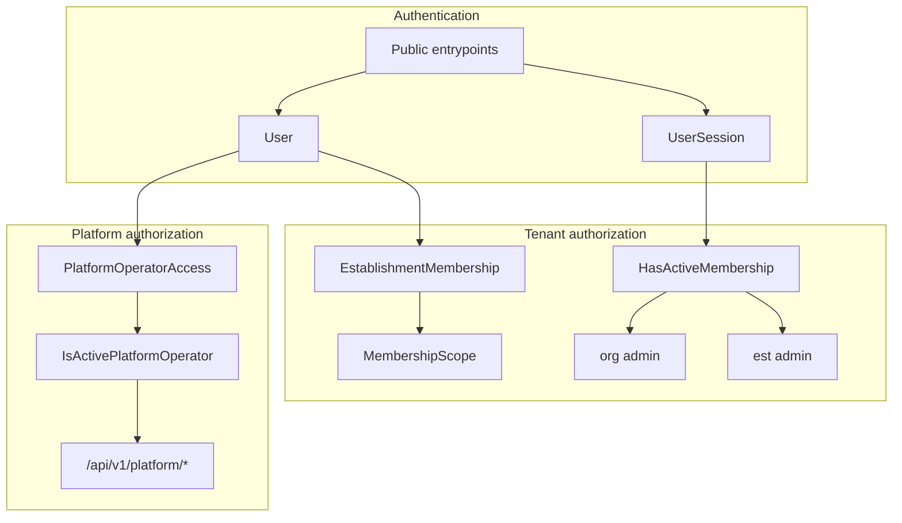

# Identity / Membership Domain

Status: authoritative
Last reviewed: 2026-09-21
Implementation status: live (identity, memberships, Platform grant)

Owner of global identity, organization/establishment lifecycle, and membership. Session/token mechanics: [`authentication_charter.md`](../../architecture/authentication_charter.md). Tenant RBAC matrices: [`rbac_permissions_domain.md`](rbac_permissions_domain.md). Onboarding activation: [`runtime_config_onboarding_domain.md`](runtime_config_onboarding_domain.md). Platform grant + HTTP: `houston.platform`. HTTP: [`apps/api/schema.yml`](../../../apps/api/schema.yml).

## Authentication vs Tenant vs Platform

Houston is not three equivalent authorization plans. Authentication establishes who is speaking. Tenant and Platform are **independent** authorization contexts. Deny-by-default DRF applies to both (`DenyByDefault`; public routes opt in with `AllowAny` and are inventory-tested).

- **Authentication** — global identity + session (`User`, `UserSession`, tokens). Public entrypoints (login, refresh, invitation accept, password reset, CSRF, email-change confirm) **establish** identity and/or session; they are not consumers of an existing `UserSession` grant. This is not business authorization. Owner: `houston.accounts` + authentication charter.
- **Tenant** — independent context rooted in an **active** `EstablishmentMembership` plus active user, establishment, and organization. `HasActiveMembership` is a coarse session gate. Org/est admin is path-scoped. Operational périmètre is `MembershipScope` (BusinessUnit UUID only). Owner matrices: RBAC domain. Code: `houston.organizations`, `houston.establishments`.
- **Platform** — independent operator grant `PlatformOperatorAccess` / `IsActivePlatformOperator` on `/api/v1/platform/*` only. Not a membership, not `User.is_staff`, not a tenant-selector bypass. An operator who also has tenant memberships keeps those memberships for client APIs only. Code: `houston.platform`.

Nothing below grants tenant or Platform access by itself: a `User` row, `User.is_staff`, frontend hints, or a Platform grant used against tenant APIs.

## Objects

- `User` — global identity (`email` is the login identifier). Status: `pending`, `active`, `suspended`, `anonymized`. Does not carry establishment role or domain authority. Live email does not change on `PATCH /api/v1/auth/me/`; email change is a password-authenticated pending request plus token confirm.
- `Organization` — parent business container. Status: `active`, `suspended`, `archived`. `has_been_operational` is sticky, set only at live activation (`mark_organization_has_been_operational`); default `False`, no historical backfill.
- `Establishment` — operational tenant. Status: `draft`, `active`, `deactivated`. Belongs to one organization. Drafts are not session-selectable.
- `EstablishmentMembership` — access link. Role + status (`invited`, `active`, `deactivated`). Operational périmètre via `MembershipScope` rows, not on `User`. There is no `OrganizationMembership` model.

## Access resolution

- Only **active** user + **active** membership + **active** establishment + **active** organization count.
- `invited` and deactivated memberships do not grant access and are excluded from bootstrap.
- Frontend state cannot grant permissions. Establishment switching must not bypass backend authorization. Selected context on `UserSession` is cleared if stale, inactive, or outside active memberships.
- Login/refresh auto-select the sole active establishment when exactly one active membership exists.

## Isolation and membership management

- Tenant product APIs must not expose data outside establishments visible through valid memberships.
- Membership management is establishment-scoped: path `establishment_id` must match the current `UserSession` selected establishment for **active** establishments. Membership invitations additionally allow a **draft** path when the actor has an active membership on that draft (drafts are never session-selectable; never fall back to another active establishment).
- Organizational owners (`role=owner`) stay coherent across all draft/active establishments of an organization (fan-out invite / deactivate / reactivate).
- Invite vs reactivate: email invitation only for new emails or controlled `User.pending` resume. An already-active user who should regain owner access uses reactivation, never invite/email.
- Invitation accept (`POST /api/v1/invitations/accept/`, bearer in JSON body): password setup and session creation. CSRF required for cookie transport. Secret is never in path or query. Owner accept requires `User.status == pending` and activates owner/invited memberships on draft/active establishments of that organization.
- Last-active-owner: deactivation is blocked unless another user is `owner`/`active` with **full coverage** of every draft/active establishment (not a per-establishment count). `PATCH` cannot demote or assign destination `owner`. Directors cannot patch, deactivate, or reassign owner memberships.
- Last sole owner account deletion must confirm organization closure (`close_organizations`): organization `archived`, draft/active establishments `deactivated`. Last director who is not last owner may delete their account; team management still cannot remove the last director (`DirectorCoverageInvariantError`).
- Self-service account deletion anonymizes `User` (no hard delete) and deactivates that user’s memberships. Submitted UGC is tombstoned; see [`data_inventory.md`](../data_inventory.md).
- Directors may manage manager and staff; owners may manage director, manager, staff, and organizational owners subject to invariants. Managers may manage in-scope staff/manager targets (service-enforced BU perimeter). Staff cannot manage memberships.

## Platform and onboarding (identity boundary)

- Starting onboarding from Platform creates organization + draft establishment **without** a membership for the operator.
- Owner/Director invitations during onboarding are identity/membership writes, not Platform user administration. After incomplete-onboarding cleanup, invitations and establishment memberships of that establishment go away; `User` rows remain.
- Platform is the only onboarding entry. Public signup, invite-code owner registration, `POST /api/v1/establishments/`, and tenant `onboarding-sessions` writes are gone. `/onboarding` in the Web app redirects; it is not a wizard. Invited users wait on `/pending-onboarding`.

## Out of scope here

SSO, MFA (unless code proves otherwise), billing, advanced org hierarchy, fine-grained RBAC matrices, token internals, Platform HTTP details beyond the grant boundary above.

## Frontend

- Read bootstrap from the backend. TanStack Query owns auth/bootstrap server state. Do not persist selected establishment outside the backend session.
- Handle unauthenticated, inactive user, no active memberships, single membership, and multiple memberships with no selected context.
- Do not derive authorization from role or scope payloads.

## Agent notes

- Inspect models, tests, and `schema.yml` before changing this domain.
- Do not move role or operational scope onto `User`.
- Do not implement Platform as a tenant-permission bypass or `is_staff` check.
- Do not document Django `request.session["current_establishment_id"]` as public auth-session authority.
- Session/CSRF/tokens: authentication charter. Matrices: RBAC. Wizard/activation: runtime domain.
